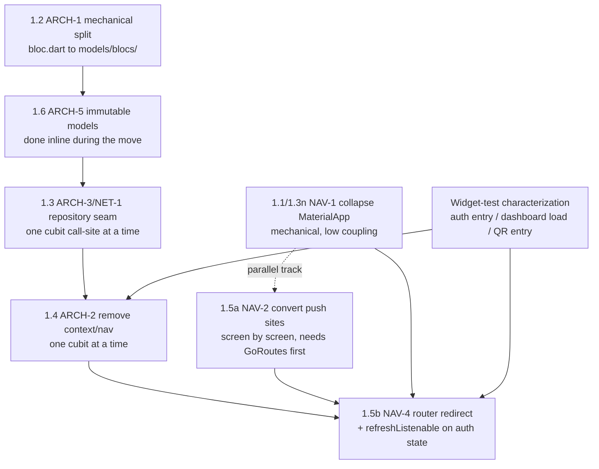

# PLAN-SPIKE — app-mobileclient Architecture Refactor (Phase 1: Foundations)

> Reference: `ANALYSIS.md` (the quality review this remediates). Findings ARCH-1, ARCH-2, ARCH-3,
> ARCH-5, NAV-1, NAV-2, NAV-3, NAV-4, NET-1, TEST-1 are the input to this document and are not
> re-derived here. Phase 0 (security/store) is already largely resolved; Phases 2–4 are referenced
> as the roadmap this phase unblocks, not detailed.

## Objective

Detail **Phase 1 — Foundations** of the `ANALYSIS.md` remediation plan: collapse the app to a
single `MaterialApp.router`, split the 3,577-line `lib/model/bloc/bloc.dart` god file into
`models/`, `repositories/`, `blocs/`, introduce a repository layer over one long-lived
`GraphQLClient`, remove `BuildContext`/navigation from cubits, route all navigation through
go_router with an auth redirect, and make models immutable with value equality. The engineer's
crux question — given thin test coverage, how to sequence and safety-net six interdependent seams
that together touch every screen, without a big-bang rewrite — is the center of this document:
options for a characterization-test strategy and options for seam ordering, each with trade-offs,
so the engineer can choose before a canonical `PLAN.md` is composed.

## Scope

### In scope

- Phase 1.1 — Collapse to a single `MaterialApp.router`; routes return plain screens; theme/
  localization declared once (NAV-1, NAV-3).
- Phase 1.2 — Split `bloc.dart` into `models/`, `repositories/`, `blocs/` (ARCH-1).
- Phase 1.3 — Repository layer over a single long-lived `GraphQLClient`; token via `AuthLink`
  reading secure storage (NET-1, ARCH-3).
- Phase 1.4 — Remove `BuildContext`/navigation from cubits; cubits emit state, widgets react and
  navigate (ARCH-2).
- Phase 1.5 — Route all navigation through go_router with an auth redirect / `refreshListenable`
  (NAV-2, NAV-4).
- Phase 1.6 — Immutable models with value equality; loading/error as states (ARCH-5).
- The characterization/test-safety-net strategy needed to execute the six items above
  incrementally under the existing CI gate (`flutter analyze --no-fatal-infos` + `flutter test`).
- The dependency order between the six seams.

### Out of scope (referenced only, per `ANALYSIS.md` Phases 2–4)

- NET-2 (typed GraphQL operations, `graphql_codegen`), NET-3/NET-4/NET-5 (endpoint
  centralization, timeouts, typed errors) — Phase 2.
- CQ-1 through CQ-8 (widget extraction, design tokens, ARB strings, dead code) — Phase 3.
- ARCH-4 (bloc scoping, duplicate providers), PLAT-*, TOOL-*, TEST-1's broader coverage build-out
  — Phase 4.
- SEC-4, PLAT-2 (Phase 0 residue) — unrelated to this phase's seams.

### Out of scope (open question)

- Whether the Flutter version drift between `.fvmrc` (`3.47.4`) and
  `.github/workflows/ci.yaml:25` (`flutter-version: 3.32.0`) is fixed before or during Phase 1 —
  see Open Questions.

## Current-state confirmation (grounding reads)

Read in full or in depth against the findings before drafting options:

- `lib/main.dart` (1,074 lines) — confirms NAV-1 (three nested `MaterialApp(...)` at
  `main.dart:206,232,272`, each with the identical `supportedLocales`/`localizationsDelegates`/
  `theme` block), NAV-3 (`main.dart:269,312` return a bare `CircularProgressIndicator()` as the
  route body when a `token` query param is present), and ARCH-4 (28 `BlocProvider`s at
  `main.dart:61-197`, `BlocPlanStatementRules` and `BlocStatementRulesView` each created twice).
- `lib/model/bloc/bloc.dart` (3,577 lines) — `grep -n "^class \|^@HiveType"` returns 84 top-level
  declarations: consistently paired `@HiveType` model(s) immediately followed by their `Cubit`
  (e.g. `DashboardModel` at line 14 / `BlocDashInit` at line 47; `PeriodModal` at line 142 /
  `BlocPeriods` at line 170). This pairing is a usable extraction unit for the split (see Decision
  2). `grep -n "context)"` against the file returns 20+ methods taking `BuildContext context` as a
  parameter (`fetchUser` at line 75, `fetchPerdiods` at line 204, `fetchCalendars` at line 287,
  `fetchPlans` at lines 561/723/925, and more) — most following the **same repeated idiom**:
  `context.read<BlocConnected>().verifyConnection(context)` then, on `result.data == null`,
  `Navigator.pushAndRemoveUntil(context, MaterialPageRoute(builder: (context) =>
  const StartAppCheck()), (route) => false)` (e.g. `bloc.dart:78,109-114`). This idiom repeats
  across at least 10 cubit methods — it is one behavior (force back to the auth entry point on a
  failed/expired session), not ten.
- `lib/view/initialization/start.dart` (87 lines) — confirms NAV-4: `_StartAppCheckState.initState`
  (lines 20-81) drives the whole entry decision inside
  `WidgetsBinding.instance.addPostFrameCallback`, with `Navigator.pushAndRemoveUntil` calls to
  `LoginView` (line 54) or `StartApp` (line 66), against a bare `Scaffold()` `build()` (line 85).
- `lib/model/graphql.dart` (61 lines) — confirms NET-1 verbatim:
  `GraphQLService.getClient()` (lines 9-29) is called fresh from `performQuery`/`performMutation`
  (lines 33, 40) on every call, re-reading secure storage and constructing a new `GraphQLClient` +
  empty `GraphQLCache` each time.
- `lib/model/bloc/bloc_login.dart` (22 lines) and `lib/http/login/login_http.dart` (41 lines) — a
  precedent already in the repository for the target shape: a single-bloc-per-file (`BlocLogin`)
  calling a single-concern HTTP class (`LoginHttp`). Neither is inside `bloc.dart`. The Phase 1.2
  split is not an invented shape — it generalizes a pattern that already exists beside the god
  file (§ Code Pattern Discipline).
- `lib/storage/secure_storage.dart` (34 lines) — the token/config accessor the repository seam and
  the `AuthLink` both read from; already a clean, small, static-method class.
- `lib/hive_registrar.g.dart` (40 lines) — generated by `hive_ce_generator`, currently imports only
  `package:FourShark/model/bloc/bloc.dart` and registers 28 adapters by class name. This file (and
  each model's own `part 'x.g.dart'`) is **regenerated by `build_runner`**, not hand-edited — a
  concrete mechanical step and verification point for the ARCH-1 split (see Decision 3a).
- `test/navigation/app_router_test.dart` (28 lines) — the one existing test that pumps the real
  `MyApp` (parameterized via `MyApp({this.initialLocation = "/"})`, `main.dart:55`) and asserts on
  rendered widget + text. This is the established pattern (from PR #18) that a widget-level
  characterization test would extend, not a new technique for this codebase.
- `test/model/bloc/bloc_parser_test.dart` (99 lines) — already exercises `PeriodModal.fromJson`,
  `GoalModel.fromJson`, `DealsModelView.fromJson`, `PlanStatementRules.fromJson` directly against
  `model/bloc/bloc.dart`. These are an existing, if partial, characterization net for the **models**
  half of the ARCH-1 split — they must stay green (after an import-path update) through the move.
- `.github/workflows/ci.yaml:25` pins `flutter-version: 3.32.0` for the PR gate, while
  `.fvmrc:2` pins `3.47.4` for local/`fvm` use — a version drift, flagged in Open Questions, not
  resolved here.
- `pubspec.yaml` — `bloc_test: ^10.0.0` and `mocktail: ^1.0.5` are already dev dependencies
  (line 78-79); neither `equatable` nor `freezed` is present yet (relevant to Decision 4d).
  `go_router: ^17.0.0` (line 59) is current enough to support `redirect` +
  `refreshListenable`/`GoRouterRefreshStream` (verified against current go_router docs, see
  Sources).

## The crux: characterization strategy and seam ordering

Two decisions are coupled and are presented first because every other choice in this document
depends on them.

### Decision 1 — characterization / test strategy before each seam

**The concrete finding that shapes this decision**: the cubit methods this refactor must change
(ARCH-2) take `BuildContext` as a parameter and call `Navigator`/`context.read` **inside** their
business logic (`bloc.dart:75,109-114` and 10+ similar sites). `bloc_test`'s `blocTest(build, act,
expect)` harness calls the method under test directly and inspects emitted states — it has no way
to supply a `BuildContext` without a widget tree. This is confirmed against the framework's own
authors' documentation: bloclibrary.dev's testing guide sets up `blocTest` as
`build: () => counterBloc, act: (bloc) => bloc.add(CounterIncrementPressed()), expect: () => [1]` —
a pure object call, with no widget/context involved anywhere in the shown pattern
(https://bloclibrary.dev/testing/). **The cubits most in need of a pre-refactor safety net are
exactly the ones `bloc_test` cannot exercise yet** — the refactor (ARCH-2) is what makes them
testable that way, not a prerequisite it can lean on.

**Option A — Golden-test-first.** Pin the current visual output of the three named screens (auth
entry / `StartApp`, dashboard, the QR/link-code entry inside `StartApp`'s `codeActive` switcher)
as golden images before touching any of them.
- Pros: catches pixel-level regressions precisely; well-supported natively by `flutter_test`
  (`matchesGoldenFile`).
- Cons: current 2026 community guidance is to scope goldens to small, stable components, not full
  screens: "They are especially useful for design-system components, where a pixel shift might not
  break functionality but still breaks the visual experience" and goldens "need careful
  maintenance, since legitimate design changes require regenerating the reference images with
  `--update-goldens`" (https://www.getpanto.ai/blog/flutter-app-testing-guide). `StartApp`'s
  `build()` is a ~700-line single method (`main.dart:443-1073`) with no extracted widgets yet
  (CQ-1, Phase 3) — a golden test at that scope will need re-recording on almost any change to the
  seams in this phase, since Phase 1 touches how the screen is reached (routing) and how it gets
  its data (cubits/repository), not just its pixels. The maintenance cost front-loads onto exactly
  the phase meant to reduce risk.
- Cost: low to set up, high to maintain through six seams that are not visual in nature.

**Option B — `bloc_test`-first on the ~25 cubits.** Write `blocTest` specs pinning today's
state-emission sequence for each cubit before refactoring it.
- Pros: directly tests the unit ARCH-2/ARCH-5 changes, once written, guard.
- Cons: as established above, most of the cubits this phase touches cannot be driven by
  `blocTest` today — their public methods require a `BuildContext`. Writing `bloc_test` specs for
  the ARCH-2-affected cubits is not possible until ARCH-2 is (at least partially) done, which
  inverts the "test before you refactor" order for exactly the seam that most needs a net.
- Cost: low per cubit, but only applicable to the minority of cubits/methods that do **not** take
  `context` (e.g. `BlocMutation`, `BlocMutation.MutationSignature`) until ARCH-2 lands elsewhere.

**Option C — Widget-test-first, extending the existing pattern.** Write `testWidgets` that pump
the real widget tree (`MyApp`, `DashboardView`, the `StartApp` code-entry flow) with the network
boundary mocked via `mocktail` (already a dev dependency), and assert on rendered, user-visible
facts: which screen is showing, which text/buttons are present, what happens on a mocked
success/failure/no-connection response. This is a direct extension of
`test/navigation/app_router_test.dart` (`app_router_test.dart:18-25`), which already pumps
`MyApp(initialLocation: '/login')` and asserts `find.byType(UnauthorizedScreen)` +
`find.text('You are not authorized...')`.
- Pros: exercises the exact behavior about to move (context-driven navigation, cross-cubit
  `verifyConnection` calls, the auth-gating flow in `start.dart`) without needing the refactor
  first; matches an established in-repo pattern instead of introducing a new one; the general
  technique — "observing existing behavior, capturing it, then refactoring implementation while
  running the characterization tests to verify behavior remains stable" — is the documented
  characterization-testing workflow (https://www.freecodecamp.org/news/characterization-tests-before-refactoring-legacy-code).
- Cons: does not catch pure visual/pixel regressions (out of scope for Phase 1 — CQ-5 design
  tokens are Phase 3); broader/slower than a `blocTest` per cubit; needs `mocktail` fakes for
  `GraphQLService`/`http` at the boundary, which is new setup (though the toolchain is already in
  `pubspec.yaml`).
- Cost: medium to write (one per screen/flow, not per cubit), reusable as regression coverage
  afterward (contributes directly to TEST-1's broader goal, Phase 4).

**Option D — Hybrid, sequenced by what each technique can actually reach today.** Use widget tests
(Option C) as the *pre-refactor* net for the context-coupled screens/flows (auth entry, dashboard
load, QR/link-code entry) before Phase 1.4/1.5 touch them; add `bloc_test` specs *incrementally*,
cubit by cubit, the moment each cubit loses its `BuildContext` parameter under ARCH-2 (that
cubit's new, pure state-emission sequence is then pinned directly, and that pin protects the
Phase 2 query/typing changes that follow); reserve golden tests for Phase 3, once CQ-1 has
extracted small, stable, presentational widgets that are cheap to re-record.
- Pros: matches each technique to what it can test *right now* rather than assuming a uniform
  strategy; the widget-test net is written once per flow and then stays useful as ordinary
  regression coverage (feeds TEST-1); no wasted work writing `bloc_test` specs against an API
  surface (`BuildContext`-taking methods) that Phase 1 is about to delete anyway.
- Cons: two testing techniques active in the same phase (more to explain/onboard than one); the
  widget-test net for the dashboard load (`attData()` chain: `fetchUser` → `fetchCalendars` →
  `fetchPlans`, `dashboard.dart:63-81`) is the most involved to set up, since it spans three
  cubits and their cross-calls.
- Cost: front-loaded on the three widget-test flows named in the task; each subsequent cubit's
  `bloc_test` is cheap once ARCH-2 has landed for it.

### Decision 2 — seam ordering (the dependency graph between the six Phase-1 items)

The six items are not independent. Three concrete couplings, found by reading the code rather
than assumed:

1. **ARCH-2 cannot be meaningfully tested with `bloc_test` until it is done** (Decision 1) — so
   whichever seam order is chosen, the widget-level characterization net has to exist *before*
   ARCH-2/NAV-4 are touched, not before the whole phase.
2. **NAV-2 (route all navigation through go_router) requires a `GoRoute` to exist for every
   current imperative destination first.** Today only four paths are declared as `GoRoute`s
   (`/`, `/dash`, `/login`, `/session/create`, `main.dart:203-364`); the other ~43
   `Navigator.push`/`pushAndRemoveUntil` call sites (`grep -c "Navigator\.\(push\|pop\)"` → 46)
   target screens (`DashboardView`, `QrCodeScanner`, `LoginView`, `StartAppCheck`, …) that have no
   route today. Converting a call site to `context.go`/`context.push` is only possible once that
   destination has a `GoRoute`. NAV-2 is therefore inherently incremental and screen-by-screen —
   it cannot be a single PR.
3. **NAV-1 (collapse nested `MaterialApp`s) does not strictly require NAV-2 first.** With plain
   screens returned from `GoRoute.builder` instead of a nested `MaterialApp`, there is exactly one
   `Navigator` left in the tree (go_router's own). An un-converted `Navigator.push(context, ...)`
   call still resolves to that same Navigator and still pushes successfully — it is the same
   mixed-model risk NAV-2 already names ("the two navigation models fight"), now concentrated on
   one Navigator instead of scattered across three, and it is exactly what `ANALYSIS.md` already
   flags: collapsing "moves the entire imperative flow onto go_router's root navigator and needs
   device validation" (`ANALYSIS.md:156-158`). NAV-1 is mechanical (delete two duplicate
   `MaterialApp` wrappers, hoist their `theme`/`localizationsDelegates` to the root) and does not
   itself require any cubit or bloc.dart change.

**Option A — Data-layer first, navigation as a parallel track.** ARCH-1 (mechanical split) →
ARCH-5 (immutability, folded into the same move) → ARCH-3/NET-1 (repository seam, cubit by cubit)
→ ARCH-2 (remove context, cubit by cubit) → NAV-4 (router redirect on the now-pure auth state).
NAV-1 (collapse) and NAV-2 (convert push sites) run as a mostly-independent parallel track that
only needs to land before NAV-4 is wired up.
- Pros: keeps the highest-blast-radius file (`bloc.dart`) shrinking from PR 1 (reduces merge
  conflict surface for everyone touching the app for the rest of the effort); each cubit's
  repository seam and context removal can be the *same* small PR (one cubit, one call site,
  bloc_test added the moment it applies) — a tight, reviewable unit; the router-redirect payoff
  (collapsing ~10 duplicated `verifyConnection` + `pushAndRemoveUntil` call sites into one
  `redirect` callback) only becomes buildable once the auth-relevant cubits are already
  context-free, so this order reaches that payoff directly instead of building it twice.
- Cons: the navigation seams (NAV-1/NAV-2), which `ANALYSIS.md` itself frames as best done "as its
  own scoped project" (`ANALYSIS.md:159-160`), are deferred in priority even though they are
  independent — a team that wants the visible win (one `MaterialApp`, no more duplicated theme
  blocks) early does not get it first under this ordering unless the parallel track is staffed
  concurrently.

**Option B — Navigation first, matching `ANALYSIS.md`'s own note.** NAV-1 (collapse to one
`MaterialApp.router`, accept that imperative pushes now target the single root Navigator, "needs
device validation" per the finding) immediately, then NAV-3 (fix the bare
`CircularProgressIndicator` route body) alongside it, then begin converting push sites to
`GoRoute`s + `context.go`/`push` (NAV-2) screen by screen — before starting on `bloc.dart` at all.
- Pros: delivers the cheapest, most mechanical, most visible fix first (NAV-1 touches only
  `main.dart`); does not require the god file to move before the router work starts; matches the
  sequencing hint already written into `ANALYSIS.md:154-160`.
- Cons: leaves the god file, and therefore the context-coupled cubit methods, untouched the
  longest — every `Navigator.push` conversion under NAV-2 that originates from inside `bloc.dart`
  (e.g. `bloc.dart:109-114`) still has to wait for ARCH-2 regardless, so this order does not
  actually finish NAV-2 without ARCH-1/ARCH-2 arriving anyway — it only starts NAV-1/NAV-3 earlier.
  The single root Navigator briefly hosts both navigation models with a higher combined call-site
  count than before (46 imperative calls now competing with go_router on one Navigator instead of
  three), which is the exact state `ANALYSIS.md` flags as needing device validation.

**Option C — Strict finding-ID order (1.1 → 1.2 → … → 1.6), ignoring the dependency graph.**
- Pros: simplest to explain; matches the numbering already in `ANALYSIS.md`.
- Cons: 1.1 (NAV-1) and 1.4 (ARCH-2) would each be attempted with no completed prerequisite in
  places where one exists (e.g. 1.5's router redirect, item 5, precedes nothing that finishes it if
  1.4 has not fully landed for the auth cubits) — this option is included for completeness, not
  because the dependency findings above support it.

## Candidate approaches per seam (splitting/introduction technique)

### 1.2 — Splitting `bloc.dart` (ARCH-1)

**Option A — Strangler-fig, one model+cubit pair per PR.** Using the pairing already visible in
the file (`grep -n "^class \|^@HiveType"` shows 84 declarations grouped as adjacent
model/cubit pairs, e.g. `DashboardModel`/`BlocDashInit` at lines 14/47), move one pair at a time
into its own file under `lib/model/models/` and `lib/model/blocs/`, fix the handful of importing
files (13 files import `model/bloc/bloc.dart` today, confirmed by
`grep -rl "model/bloc/bloc.dart'" lib | wc -l`), run `flutter analyze` + `flutter test`, ship. The
`hive_registrar.g.dart` and each model's `part 'x.g.dart'` are regenerated by `build_runner` after
each move (Hive persists by `@HiveType(typeId: N)`, not by file location, so preserving the typeId
verbatim keeps on-device data intact). This is the classic strangler-fig shape applied
in-repository: "code can be divided into many small sections, wrapped with the strangler fig
pattern, then that section of old code can be swapped out with new code before moving on to the
next section" (https://www.gocodeo.com/post/how-the-strangler-fig-pattern-enables-safe-and-gradual-refactoring).
- Pros: every PR is small, reviewable, keeps `bloc.dart` shrinking monotonically, keeps CI green
  after each step, matches the "one seam per PR" constraint directly; `bloc_parser_test.dart`
  already characterizes several of the models being moved (just needs its imports updated as each
  model relocates).
- Cons: 84 declarations means dozens of small PRs if taken to the letter; some pairs are tightly
  coupled (`BlocDashInit.fetchUser` calls `context.read<BlocConnected>()`,
  `bloc.dart:78` — moving `BlocDashInit` alone still leaves a cross-file dependency on
  `BlocConnected`, which is fine for compilation but means the ARCH-2 removal of that call has to
  happen after both are relocated).
- Cost: highest total review overhead (many small PRs), lowest per-PR risk.

**Option B — Single big-bang split PR.** Move all 84 declarations into their target files in one
PR, mechanically, with no other changes.
- Pros: one round of import-fixing instead of many; the `hive_registrar.g.dart` regeneration and
  typeId-preservation check happen once.
- Cons: directly violates the "each PR ships green and navigable, never big-bang" constraint from
  the task; a single-PR move across the whole 3,577-line file is exactly the shape most likely to
  hide a broken import or a dropped `@HiveField` during review, with no incremental CI signal to
  catch it early; the review itself becomes a full re-read of a diff nearly as large as the file
  it starts from.

**Option C — Split by concept-group rather than one-pair-per-PR (a middle ground).** Group
related pairs (e.g. all `Comissioning*`-family models/cubits — `Comissionings`, `Comissioning`,
`BlocComission`, `BlocComissioningsDeal`, `BlocComissioningsLimiter`,
`BlocComissioningsRedemption`, `BlocComissioningsRanking`, `BlocComissioningsIndicador`, seven
declarations clustered at `bloc.dart:2333-3374`) into one PR per group, rather than one PR per
single pair.
- Pros: fewer PRs than Option A while each is still bounded and reviewable; groups that share a
  domain concept move together, which may reduce cross-file coupling noise.
- Cons: grouping boundaries are judgment calls (which pairs are "related enough"?) and some groups
  (the `Comissioning*` family above) are still 400+ lines of diff; does not obviously reduce total
  effort versus Option A, just shifts the granularity.

### 1.3 — Repository seam over the `GraphQLClient` (NET-1, ARCH-3)

**Option A — Branch by Abstraction, applied per call site.** Introduce a repository/service
interface that, on day one, does nothing but wrap today's exact behavior (call
`GraphQLService.performQuery`/`performMutation` under the hood, still per-call client
construction); convert cubit call sites to depend on the new interface one at a time (each is a
small, reviewable diff); only once most/all call sites are converted, change what the interface
does internally — build the `GraphQLClient` once, inject the token via a lazily-reading `AuthLink`
(the existing `AuthLink(getToken: () async => "Bearer $token")` shape at `graphql.dart:12-14`
already reads the token at call time; the change is *not* rebuilding the whole client per call).
This is exactly Martin Fowler's documented technique: "create an abstraction layer that separates
client code from the current implementation... migrate client code gradually to use this
abstraction layer... build a new implementation... switch clients incrementally... until migration
is complete" (https://martinfowler.com/bliki/BranchByAbstraction.html), chosen specifically
because it "enables continuous delivery throughout the replacement process — the system continues
to build and run correctly at every stage."
- Pros: the client-singleton change (the actual bug fix — an empty `GraphQLCache` discarded every
  call) lands as one small, well-isolated PR once the seam exists everywhere, instead of being
  entangled with every cubit's conversion; each cubit's conversion PR is behavior-preserving by
  construction (same query, same variables, same result shape) and needs no new test beyond
  confirming the call still returns the same data.
- Cons: two-step (seam first, singleton behavior second) means the actual performance/caching win
  (NET-1's real payoff) is not visible until the second step; until then, the repository is a thin
  pass-through that some reviewers may read as unnecessary ceremony.

**Option B — Introduce the singleton client and the repository interface together, per cubit.**
Each cubit's conversion PR both moves it onto the new repository interface *and* onto the shared
singleton client in the same diff.
- Pros: fewer total PRs than Option A; no intermediate "pass-through repository" state to explain.
- Cons: couples two independent changes (which method the cubit calls; how the underlying client
  is constructed) in every PR, so a regression is harder to bisect to one cause; the first cubit
  converted is also the first to exercise the *new* singleton-client behavior in production, which
  means the safety net (Decision 1) has to already cover caching/token-refresh timing, not just
  the query result — a strictly harder test to write than "does this call return the same data".

### 1.4 — Removing `BuildContext`/navigation from cubits (ARCH-2)

**Option A — Cubit by cubit, replacing the repeated `verifyConnection` + `pushAndRemoveUntil`
idiom with an emitted state, then wiring the router redirect once several cubits are converted.**
Each cubit's `fetch*(BuildContext context)` method becomes `fetch*()`; on the failure path it
`emit`s an error/unauthenticated state instead of navigating; the widget that was calling it reacts
via `BlocListener` (or the new router redirect once NAV-4 is wired). Since the same idiom repeats
verbatim across 10+ methods (`bloc.dart:78,109-114` and similar), the *first* conversion is the
expensive one (deciding the shape of the new state/error type); the rest are closer to a
mechanical find-and-replace once that shape exists.
- Pros: directly shrinks the 40 `context` references under `model/` that ARCH-2 flags; the
  repeated idiom collapsing into one router-level `redirect` (Decision 2, Option A) is a real
  simplification, not just a relocation, once enough cubits are converted.
- Cons: the first cubit converted has no router redirect to hand off to yet (NAV-4 needs several
  cubits done first to be worth wiring) — for a transition period, the newly-pure cubit's caller
  widget has to handle the new error state directly via `BlocListener`, which is throwaway
  wiring once NAV-4 lands. This is the ordinary cost of an incremental seam, not a defect in the
  approach.

### 1.1/1.5 — go_router only, collapse `MaterialApp`, redirect (NAV-1, NAV-2, NAV-3, NAV-4)

**Option A — `GoRouterRefreshStream` wrapping the auth cubit's stream.** Once an
auth/session cubit exposes a pure (context-free) stream of authenticated/unauthenticated state,
wrap it with `GoRouterRefreshStream(authCubit.stream)` as the router's `refreshListenable`, and
check that state in a single top-level `redirect` callback. This is the documented integration
point between `flutter_bloc` and go_router: "if your route-driving state is available as a Stream
instead of a Listenable, you can wrap your stream with a `GoRouterRefreshStream`, which makes it
possible for GoRouter to react to stream-based state management solutions like flutter_bloc"
(go_router docs, https://docs.page/csells/go_router/redirection), and is the pattern the
community converges on for `flutter_bloc` + go_router auth flows: "a GoRouter can be configured
with `refreshListenable: GoRouterRefreshStream(authCubit.stream)` and a redirect callback that
checks the auth state" (https://medium.com/@mahdi.yami3235/gorouters-authentication-with-bloc-state-management-24646953e459).
- Pros: one redirect callback replaces the ~10 duplicated `verifyConnection`/
  `pushAndRemoveUntil` call sites and the imperative `start.dart` `initState` chain entirely;
  matches current go_router (`^17.0.0`) capability directly, no version upgrade needed.
- Cons: depends on ARCH-2 having produced a context-free, stream-exposing auth cubit first
  (Decision 2 dependency); until that cubit exists, this cannot be started.

## Technical decisions to be made (NOT decided here)

| Decision point | Options | Trade-off summary | Engineer to choose |
|----------------|---------|-------------------|---------------------|
| Characterization strategy (Decision 1) | A: golden-first · B: `bloc_test`-first · C: widget-test-first · D: hybrid, sequenced | A is discouraged at full-screen scope by current community guidance; B cannot reach the context-coupled cubits yet; C extends an existing in-repo pattern but misses pixel regressions; D matches technique to what each seam needs but runs two techniques in one phase | ☐ |
| Seam ordering (Decision 2) | A: data-layer first, nav parallel · B: navigation first (matches `ANALYSIS.md`'s own note) · C: strict finding-ID order | A reaches the router-redirect payoff directly but defers the cheap, visible NAV-1 win; B ships the visible win first but the single Navigator briefly hosts more competing imperative calls than today; C is offered for completeness only | ☐ |
| `bloc.dart` split granularity (1.2) | A: one pair per PR · B: single big-bang PR · C: concept-group per PR | A is smallest/safest but most PRs; B violates the no-big-bang constraint; C is a middle ground with judgment-call grouping boundaries | ☐ |
| Repository seam introduction (1.3) | A: seam first, singleton behavior second (Branch by Abstraction) · B: both together per cubit | A isolates the actual caching/singleton bug fix into one PR but delays its payoff; B is fewer PRs but harder to bisect and needs a stronger safety net from PR 1 | ☐ |
| Immutable models (1.6) | `equatable` (manual, no new codegen) · `freezed` (codegen `copyWith`/`toString`/unions, but a second `part` generator alongside `hive_ce_generator` on the same files, untested combination in this repo) | `equatable` is additive and low-risk; `freezed` is more capable but stacks a second build_runner generator on files that already have one, with no precedent in this repo for the two coexisting | ☐ |

## Risks (cross-cutting)

| Risk | Impact | Possible mitigation |
|------|--------|---------------------|
| Flutter version drift: CI pins `3.32.0` (`ci.yaml:25`), local `.fvmrc` pins `3.47.4` | Phase 1 changes validated locally against a different Flutter version than the one enforcing the CI gate; a change that passes locally could fail in CI or vice versa | Resolve the drift (bump CI to match `.fvmrc`, or vice versa) before or as the first Phase 1 PR — flagged in Open Questions, not decided here |
| `BlocDashInit.fetchUser` calls `context.read<BlocConnected>().verifyConnection(context)` (`bloc.dart:78`) — a cross-cubit dependency inside business logic | Converting `BlocDashInit` under ARCH-2 without also handling `BlocConnected`'s coupling leaves a partially-converted state where one cubit is context-free and its collaborator is not | Sequence `BlocConnected`'s own conversion alongside (or just before) any cubit that calls it, not independently |
| Hive `@HiveType(typeId: N)` values must be preserved verbatim across the ARCH-1 file move | A typo or renumbering during the split silently corrupts on-device Hive box data for existing app installs (Hive persists by typeId, not file location) | Diff `hive_registrar.g.dart` after each `build_runner` regeneration and confirm only import paths changed, not the adapter/typeId list — a mechanical, scriptable check per PR |
| 46 imperative `Navigator.*` calls briefly target a single shared Navigator if NAV-1 lands before NAV-2 is complete (Decision 2, Option B) | `ANALYSIS.md` already flags this exact state as needing device validation, not just `flutter test`; a purely automated CI gate would not catch a navigation/back-stack regression here | Manual device validation (iOS + Android) is a required step for the NAV-1 PR regardless of which seam-ordering option is chosen, not optional |
| Widget-test characterization for the dashboard load spans three cubits and their cross-calls (`dashboard.dart:63-81`) | The most involved test to write in Decision 1, Option C/D — risk of being deferred or written thin | Scope it explicitly as its own task before Phase 1.4/1.5 touch `BlocDashInit`/`BlocCalendar`/`BlocPlan` |

## Open questions for the engineer

- Which Decision 1 option (test strategy) and which Decision 2 option (seam order) to take —
  these are the two the `plan-composer` needs an explicit choice on before writing `PLAN.md`.
- Should the CI Flutter-version drift (`3.32.0` in `ci.yaml` vs `3.47.4` in `.fvmrc`) be fixed as
  a zero-risk prerequisite PR before Phase 1 starts, or bundled into the first Phase 1 PR?
- `equatable` vs `freezed` for 1.6 (ARCH-5) — is the untested combination of `freezed`'s codegen
  with `hive_ce_generator`'s existing `part` generation on the same files an acceptable risk to
  spike separately, or is `equatable` preferred outright to avoid it?
- Is Phase 1.2's split granularity (Option A/B/C above) expected to also relocate the `Comissioning*`
  family's GraphQL query strings verbatim (unchanged), deferring NET-2's typed-operations work to
  Phase 2 as planned — confirming no scope creep into Phase 2 during the move?

## Sources

- `lib/main.dart:55,61-197,203-364,443-1073` — root widget, `BlocProvider` registration, nested
  `MaterialApp` routes, `StartApp`'s monolithic `build()`.
- `lib/model/bloc/bloc.dart:14-45,47-121,75-120,78,109-114,204,287,561,723,925,1104,1295,1421,
  1533,1535,1832,2115,2119,2239,2243,2333-3374,3416-3441` — model/cubit pairing, the repeated
  `verifyConnection`+`pushAndRemoveUntil` idiom, the `Comissioning*` cluster, `BlocConnected`.
- `lib/view/initialization/start.dart:18-87` — `StartAppCheck`'s `initState`-driven auth gating.
- `lib/model/graphql.dart:9-44` — per-call `GraphQLClient` construction.
- `lib/model/bloc/bloc_login.dart`, `lib/http/login/login_http.dart` — existing sibling pattern for
  the target one-bloc-per-file / one-concern-per-class shape.
- `lib/storage/secure_storage.dart` — token/config accessor.
- `lib/hive_registrar.g.dart` — generated adapter registrar, regenerated by `build_runner`.
- `test/navigation/app_router_test.dart`, `test/model/bloc/bloc_parser_test.dart` — existing
  characterization precedent to extend.
- `.github/workflows/ci.yaml:25`, `.fvmrc:2` — Flutter version drift.
- `pubspec.yaml:44,59,63-65,78-81` — `flutter_bloc`, `go_router`, `hive_ce`/`hive_ce_generator`,
  `bloc_test`/`mocktail` already present; `equatable`/`freezed` absent.
- https://bloclibrary.dev/testing/ — `blocTest(build, act, expect)` shape, no `BuildContext`
  involved.
- https://www.getpanto.ai/blog/flutter-app-testing-guide — golden tests scoped to design-system
  components; maintenance cost of full-screen goldens.
- https://www.freecodecamp.org/news/characterization-tests-before-refactoring-legacy-code —
  characterization-testing workflow (observe → capture → refactor → verify).
- https://martinfowler.com/bliki/BranchByAbstraction.html — Branch by Abstraction technique.
- https://www.gocodeo.com/post/how-the-strangler-fig-pattern-enables-safe-and-gradual-refactoring
  — strangler-fig applied to in-codebase section-by-section replacement.
- https://docs.page/csells/go_router/redirection — `GoRouterRefreshStream` wrapping a Stream-based
  state source.
- https://medium.com/@mahdi.yami3235/gorouters-authentication-with-bloc-state-management-24646953e459
  — `GoRouterRefreshStream(authCubit.stream)` + `redirect` pattern with `flutter_bloc`.
