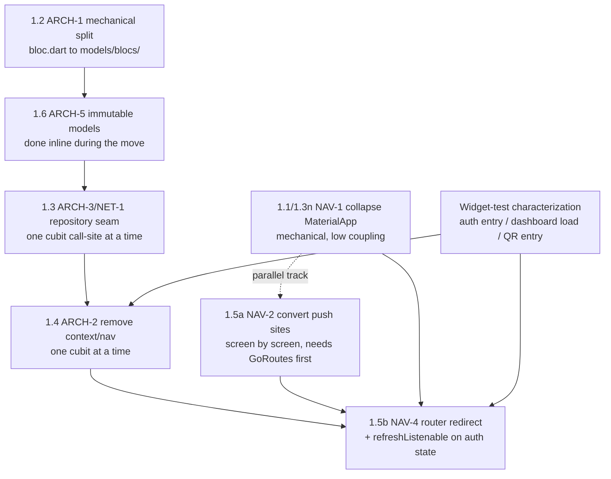

# PLAN — app-mobileclient Architecture Refactor (Phase 1: Foundations)

> Reference: `ANALYSIS.md` (the quality review this remediates); derived from `PLAN-SPIKE.md`.
> Findings ARCH-1, ARCH-2, ARCH-3, ARCH-5, NAV-1, NAV-2, NAV-3, NAV-4, NET-1, TEST-1 are the input
> to this document. Phase 0 (security/store) is already resolved; Phases 2–4 are referenced as the
> roadmap this phase unblocks, not detailed here.

## Objective

Phase 1 — Foundations of the `ANALYSIS.md` remediation plan: collapse the app to a single
`MaterialApp.router`, split the 3,577-line `lib/model/bloc/bloc.dart` god file into `models/`,
`repositories/`, `blocs/`, introduce a repository layer over one long-lived `GraphQLClient`,
remove `BuildContext`/navigation from cubits, route all navigation through go_router with an auth
redirect, and make models immutable with value equality. The six interdependent seams are executed
one at a time, each behind its own characterization test, in the dependency order established
below — never as a big-bang rewrite.

## Scope

### In scope

- Step 0 — Resolve the Flutter-version drift between `.github/workflows/ci.yaml` and `.fvmrc`
  as its own isolated, zero-risk PR before any Phase 1 seam work starts, so the safety net runs on
  the same Flutter version the app targets. Done in PR #35: the workflow reads the version from
  `.fvmrc` (`jq -r .flutter`), making `.fvmrc` the single source of truth so the two cannot drift
  again.
- Phase 1.1 — Collapse to a single `MaterialApp.router`; routes return plain screens; theme/
  localization declared once (NAV-1, NAV-3).
- Phase 1.2 — Split `bloc.dart` into `models/`, `repositories/`, `blocs/` (ARCH-1).
- Phase 1.3 — Repository layer over a single long-lived `GraphQLClient`; token via `AuthLink`
  reading secure storage (NET-1, ARCH-3).
- Phase 1.4 — Remove `BuildContext`/navigation from cubits; cubits emit state, widgets react and
  navigate (ARCH-2).
- Phase 1.5 — Route all navigation through go_router with an auth redirect / `refreshListenable`
  (NAV-2, NAV-4).
- Phase 1.6 — Immutable models with value equality; loading/error as states (ARCH-5).
- The widget-test characterization net (three named flows) required before Phase 1.4/1.5 touch
  the cubits and the router.

### Out of scope (referenced only, per `ANALYSIS.md` Phases 2–4)

- NET-2 (typed GraphQL operations, `graphql_codegen`), NET-3/NET-4/NET-5 (endpoint
  centralization, timeouts, typed errors) — Phase 2.
- CQ-1 through CQ-8 (widget extraction, design tokens, ARB strings, dead code) — Phase 3.
- ARCH-4 (bloc scoping, duplicate providers), PLAT-*, TOOL-*, TEST-1's broader coverage build-out
  — Phase 4.
- SEC-4, PLAT-2 (Phase 0 residue) — unrelated to this phase's seams.

## Chosen approach

**Direction:** Data-layer first, navigation as a parallel track (Decision 2, Option A), with a
widget-test-first characterization net (Decision 1) sequenced as: widget tests for the three
named user-facing flows before ARCH-2/NAV-4 touch them, then `bloc_test` unit specs added
incrementally, cubit by cubit, the moment each cubit loses its `BuildContext` parameter under
ARCH-2 — that removal is what makes a cubit unit-testable with `bloc_test`; pre-refactor it takes
a `BuildContext` and `blocTest` has no way to supply one. The `bloc.dart` split (1.2) proceeds as
strangler-fig, one model+cubit pair per PR. The repository seam (1.3) is introduced via Branch by
Abstraction — the interface first, the singleton-client behavior second. Immutable models (1.6)
use `equatable`, not `freezed`.

**Rationale (from engineer):**
- `equatable` over `freezed` — "avoids stacking `freezed` codegen alongside the existing
  `hive_ce_generator` `part` generation on the same files (no precedent in the repo)."
- `bloc.dart` split — "strangler-fig, one type at a time," preserving each Hive
  `@HiveType(typeId:)` exactly, since typeId (not file location) is what Hive persists by.
- Repository seam — "Branch by Abstraction over a single long-lived `GraphQLClient`."
- Seam ordering — "follow the spike's dependency graph," notably: ARCH-2 precedes the NAV-4
  router redirect; NAV-1 does not require NAV-2 first; NAV-2 is inherently incremental (one
  imperative destination converted per PR once its `GoRoute` exists).
- Step 0 — the CI Flutter-version drift is fixed first, as its own isolated PR, so the safety net
  built through this phase runs on the same Flutter version the app uses.
- Every PR keeps `flutter analyze --no-fatal-infos` + `flutter test` green and the app manually
  navigable (iOS 27 simulator + Android emulator both work now) — never big-bang.

**Source patterns referenced:**
- `test/navigation/app_router_test.dart` (PR #18) — the established widget-level characterization
  pattern this phase extends, rather than introducing a new testing technique.
- `test/model/bloc/bloc_parser_test.dart` — existing `fromJson` characterization for several
  models being relocated under the ARCH-1 split.
- `lib/model/bloc/bloc_login.dart` + `lib/http/login/login_http.dart` — the existing
  one-bloc-per-file / one-concern-per-class shape the ARCH-1 split generalizes.
- Martin Fowler's Branch by Abstraction technique — the repository seam introduction (1.3).
- The strangler-fig pattern — the `bloc.dart` split (1.2), applied section-by-section in place.
- `GoRouterRefreshStream(authCubit.stream)` + a single top-level `redirect` callback — the
  documented `flutter_bloc` + go_router integration point for the NAV-4 auth redirect.

## Execution phases

### Phase 1: Foundations — ordered PR sequence

**Objective:** Execute the six Phase 1 seams (ARCH-1, ARCH-2, ARCH-3, ARCH-5, NAV-1/NAV-3,
NAV-2/NAV-4) plus the CI prerequisite, one seam per PR, following the dependency graph below.

**Components:**

- **ARCH-1** (`lib/model/bloc/bloc.dart` split) — mechanical move of the 84 top-level
  declarations, grouped as model/cubit pairs, into `lib/model/models/` and `lib/model/blocs/`.
- **ARCH-5** (immutable models) — `equatable`-based value equality added to each model inline
  during its ARCH-1 move; loading/error modelled as distinct states, not a bool field.
- **ARCH-3 / NET-1** (repository seam) — a repository/service interface over
  `GraphQLService`, introduced as a pass-through first, then backed by one long-lived
  `GraphQLClient` with token supplied via the existing `AuthLink(getToken: ...)` shape
  (`graphql.dart:12-14`), read lazily from secure storage.
- **ARCH-2** (context-free cubits) — the repeated `verifyConnection` +
  `pushAndRemoveUntil` idiom (`bloc.dart:78,109-114` and 10+ similar sites) replaced by an
  emitted state per cubit; the widget layer reacts via `BlocListener` until NAV-4 lands.
- **NAV-1 / NAV-3** (single `MaterialApp.router`) — the two duplicate `MaterialApp` wrappers
  (`main.dart:206,232,272`) removed; theme/localization hoisted to the root; the bare
  `CircularProgressIndicator()` route bodies (`main.dart:269,312`) replaced with a proper loading
  screen.
- **NAV-2** (go_router-only navigation) — a `GoRoute` declared per current imperative
  destination (today only `/`, `/dash`, `/login`, `/session/create` exist), then that screen's
  `Navigator.push`/`pushAndRemoveUntil` sites converted to `context.go`/`context.push`.
- **NAV-4** (router redirect) — `GoRouterRefreshStream(authCubit.stream)` wired as the router's
  `refreshListenable`, with a single top-level `redirect` callback replacing `start.dart`'s
  `initState`-driven auth gating and the ~10 duplicated call sites.

**Dependencies:** None outside the repository. Phase 0 (security/store, `ANALYSIS.md`) is already
resolved. Phase 2 (NET-2 typed operations) depends on this phase's split (1.2) and repository seam
(1.3) being in place; Phase 3 (CQ-1 widget extraction) depends on the architecture skeleton this
phase builds.

**Ordered PR sequence:**

0. **CI Flutter-version alignment (prerequisite, own PR — PR #35, open).**
   - Seam / finding: the CI-vs-`.fvmrc` drift risk (not an `ANALYSIS.md` finding ID).
   - Technique: the workflow reads the version from `.fvmrc` (`jq -r .flutter`), so `.fvmrc` is the
     single source of truth and the two cannot drift again.
   - Characterization test: none — infra-only change; the workflow's own analyze+test run on the
     aligned Flutter version is the validation.
   - Done: CI runs the same Flutter version the app targets; existing tests stay green.

1. **`bloc.dart` split — one model+cubit pair per PR, repeated across all 84 declarations.**
   - Seam / finding: ARCH-1 (split), ARCH-5 (immutability, folded in).
   - Technique: strangler-fig — move one model/cubit pair (e.g. `DashboardModel`/
     `BlocDashInit`) into `lib/model/models/` and `lib/model/blocs/`; fix the importing files (13
     files import `model/bloc/bloc.dart` today); add `equatable` value equality to the moved
     model inline; regenerate `hive_registrar.g.dart` and each model's `part 'x.g.dart'` via
     `build_runner`, preserving `@HiveType(typeId:)` verbatim. Each declaration's GraphQL query
     strings move unchanged — typing them (NET-2) stays deferred to Phase 2.
   - Characterization test: `bloc_parser_test.dart`'s existing `fromJson` specs (`PeriodModal`,
     `GoalModel`, `DealsModelView`, `PlanStatementRules`), import paths updated per move — the
     existing net for the models half, not a new test written for this step.
   - Done: `flutter analyze --no-fatal-infos` + `flutter test` green; `hive_registrar.g.dart`
     diff confirmed to change only import paths, not the adapter/typeId list; app navigable.

2. **Repository seam over the `GraphQLClient` — Branch by Abstraction, three sub-steps.**
   - Seam / finding: ARCH-3, NET-1.
   - **2a — Introduce the interface (one PR).** A repository/service interface that on day one
     does nothing but wrap today's exact behavior (calls `GraphQLService.performQuery`/
     `performMutation`, still per-call client construction).
     - Characterization test: none new — the pass-through is behavior-identical by construction.
     - Done: green CI + navigable.
   - **2b — Convert cubit call sites, one cubit per PR.** Each cubit's call sites moved to depend
     on the new interface, one at a time.
     - Characterization test: confirm the call returns the same data — no new test needed beyond
       that, since each conversion is behavior-preserving by construction.
     - Done: green CI + navigable per cubit converted.
   - **2c — Singleton client behavior (one PR, once most/all call sites are converted).** Build
     the `GraphQLClient` once; inject the token via the existing `AuthLink(getToken: ...)` shape,
     reading secure storage lazily — this is NET-1's actual payoff (the `GraphQLCache` stops being
     discarded every call).
     - Characterization test: the cubit conversions from 2b, already passing, act as the net;
       confirm caching/token-refresh timing.
     - Done: green CI + navigable; `GraphQLCache` persists across calls.

3. **Widget-test characterization net — one PR per flow, three total.**
   - Seam / finding: no finding ID of its own — the pre-refactor safety net for ARCH-2/NAV-4;
     feeds TEST-1.
   - Technique: `testWidgets` extending `test/navigation/app_router_test.dart`'s pattern, network
     boundary mocked via `mocktail` (already a dev dependency), for:
     (a) the auth entry / `StartApp` flow (`start.dart`'s `initState`-driven gating);
     (b) the dashboard load (`attData()` chain — `fetchUser` → `fetchCalendars` → `fetchPlans`
     across `BlocDashInit`/`BlocCalendar`/`BlocPlan`, `dashboard.dart:63-81` — the most involved of
     the three, scoped as its own explicit task);
     (c) the QR/link-code entry inside `StartApp`'s `codeActive` switcher.
   - Characterization test: this step *is* the characterization test — written before ARCH-2
     (step 4) or NAV-4 (step 5) touch these flows.
   - Done: green CI; all three widget tests pass against current, pre-ARCH-2 behavior.

4. **Remove `BuildContext`/navigation from cubits — one PR per cubit, repeated.**
   - Seam / finding: ARCH-2.
   - Technique: cubit by cubit, replace the repeated `verifyConnection` + `pushAndRemoveUntil`
     idiom with an emitted error/unauthenticated state; the calling widget reacts via
     `BlocListener` (throwaway wiring, retired once NAV-4 lands). Sequence `BlocConnected`'s own
     conversion alongside or just before any cubit that calls it (e.g. `BlocDashInit.fetchUser`
     calls `context.read<BlocConnected>().verifyConnection(context)` at `bloc.dart:78`) — otherwise
     a converted cubit's collaborator remains context-coupled.
   - Characterization test: the three widget tests from step 3 must stay green through each
     conversion; add that cubit's `bloc_test` spec the moment it loses its `BuildContext`
     parameter — the removal is what makes `blocTest` able to drive it.
   - Done: green CI (analyze + test, including the new `bloc_test`) + navigable; the widget tests
     from step 3 still pass.

**Parallel track** (runs alongside steps 1–4; must land before step 5):

- **P1 — Collapse `MaterialApp`, one PR.**
  - Seam / finding: NAV-1, NAV-3.
  - Technique: delete the two duplicate `MaterialApp` wrappers (`main.dart:206,232,272`); hoist
    `theme`/`localizationsDelegates`/`supportedLocales` to the root `MaterialApp.router`; replace
    the bare `CircularProgressIndicator()` route bodies (`main.dart:269,312`) with a proper
    loading screen.
  - Characterization test: `app_router_test.dart` extended and kept green.
  - Done: green CI + **manual device validation (iOS + Android)**, required regardless of seam
    ordering, since the ~46 un-converted imperative `Navigator.*` calls now briefly target the
    single root Navigator instead of three.

- **P2 — Convert push sites to go_router — one PR per screen, repeated (~43 destinations).**
  - Seam / finding: NAV-2.
  - Technique: declare a `GoRoute` for the destination (only `/`, `/dash`, `/login`,
    `/session/create` exist today), then convert that screen's `Navigator.push`/
    `pushAndRemoveUntil` sites to `context.go`/`context.push`.
  - Characterization test: existing/extended widget tests for that screen where present.
  - Done: green CI + navigable per screen converted.

5. **Router redirect / `refreshListenable` — one PR.**
   - Seam / finding: NAV-4.
   - Precondition: ARCH-2 (step 4) has produced a context-free, stream-exposing auth cubit; the
     parallel track (P1, P2) has landed the relevant screens.
   - Technique: wrap the auth cubit's stream with `GoRouterRefreshStream(authCubit.stream)` as the
     router's `refreshListenable`; check that state in a single top-level `redirect` callback —
     replacing the ~10 duplicated `verifyConnection`/`pushAndRemoveUntil` call sites and
     `start.dart`'s imperative `initState` chain entirely.
   - Characterization test: the auth-entry widget test from step 3, extended to assert the
     redirect-based behavior.
   - Done: green CI + navigable; `start.dart`'s `initState`-driven gating removed; the router
     `redirect` callback replaces the duplicated call sites.

**Success criteria:**

- [ ] Every Phase 1 PR ships independently green (`flutter analyze --no-fatal-infos` +
      `flutter test`) and the app stays manually navigable (iOS 27 simulator + Android emulator).
- [ ] `bloc.dart` is fully split into `models/`, `repositories/`, `blocs/`, with
      `hive_registrar.g.dart`'s adapter/typeId list unchanged from before the split.
- [ ] Every cubit query/mutation call goes through the repository seam, backed by one long-lived
      `GraphQLClient` (token via `AuthLink`, reading secure storage lazily).
- [ ] No cubit under `model/`/`blocs/` takes a `BuildContext` parameter or calls
      `Navigator`/`context.read` directly.
- [ ] Exactly one `MaterialApp.router`; every navigation call site routes through go_router; a
      single `redirect` callback replaces `start.dart`'s imperative auth-gating.
- [ ] Models are immutable with `equatable` value equality; loading/error are modelled as states,
      not a bool field on the data model.
- [ ] The three widget-test flows (step 3) and the `bloc_test` specs added per converted cubit
      (step 4) are part of the permanent test suite, feeding TEST-1.

### Phase 2: Data & networking hardening (referenced only — `ANALYSIS.md` Phase 2)

Replace string-interpolated GraphQL queries with typed `variables` and `graphql_codegen` (NET-2);
typed request results, status-code handling, timeouts, no `!` force-unwraps (NET-4, SEC-5);
centralize endpoint/config resolution (NET-3, NET-5). Depends on Phase 1.2 (split) and 1.3
(repository seam) being in place.

### Phase 3: UI decomposition & consistency (referenced only — `ANALYSIS.md` Phase 3)

Extract widgets from monolithic `build()` methods (CQ-1); extract one shared login form (CQ-2);
design tokens replacing 120 inline color literals (CQ-5); remaining strings to ARB (CQ-6, I18N-1);
replace remaining `setState` with bloc-driven state (ARCH-2 follow-through). Depends on the
architecture skeleton Phase 1 builds.

### Phase 4: Quality, tests & hygiene (referenced only — `ANALYSIS.md` Phase 4)

Scope blocs to routes, remove duplicate providers (ARCH-4); rename PascalCase methods, fix
`Modal`→`Model`, fix package name (CQ-3, CQ-4, TOOL-2); align Android package identity (PLAT-1);
flavors/`--dart-define`, `CAMERA` permission, PNG launcher icon, orientation lock (PLAT-3,
PLAT-4, PLAT-5); strict analyzer modes, audit `// ignore:` suppressions (TOOL-1, TOOL-3); dead
code, `async/await`, context-after-await guards, TODOs (CQ-7, CQ-8); broad test-suite build-out —
cubit unit tests, repository/parsing tests, key widget tests, coverage wired into CI (TEST-1).

## Technical decisions

| Decision | Choice | Rationale (from engineer / from draft) |
|----------|--------|----------------------------------------|
| Characterization / test strategy (Decision 1) | Widget-test-first, hybrid-sequenced: widget tests for the three named flows before ARCH-2/NAV-4 are touched; `bloc_test` specs added incrementally, cubit by cubit, the moment each cubit loses its `BuildContext` parameter | The cubits ARCH-2 must change take `BuildContext` and cannot be driven by `blocTest` today (`bloc.dart:75,109-114`); ARCH-2 is what makes a cubit unit-testable, not a prerequisite it can lean on. Widget tests extend the existing `app_router_test.dart` pattern instead of introducing a new technique |
| Seam ordering (Decision 2) | Option A — data-layer first, navigation as a parallel track: ARCH-1 → ARCH-5 (inline) → ARCH-3/NET-1 → ARCH-2 → NAV-4, with NAV-1/NAV-2 as a parallel track landing before NAV-4 | Keeps the highest-blast-radius file (`bloc.dart`) shrinking from PR 1; each cubit's repository seam and context removal can be the same small PR; the router-redirect payoff (collapsing ~10 duplicated call sites) only becomes buildable once the auth-relevant cubits are context-free, so this order reaches that payoff directly |
| CI Flutter-version drift | Fixed first, as its own isolated PR (PR #35): the workflow reads the version from `.fvmrc`, so the two cannot drift again | The safety net (widget tests, `flutter test`) must run on the same Flutter version the app uses; a hardcoded CI version risks a change passing locally against `.fvmrc` while CI gates on a different one |
| `bloc.dart` split granularity (1.2) | Option A — strangler-fig, one model+cubit pair per PR | Every PR stays small and reviewable, keeps `bloc.dart` shrinking monotonically, keeps CI green after each step, matches the "one seam per PR, never big-bang" constraint directly |
| Repository seam introduction (1.3) | Option A — Branch by Abstraction: interface first (pass-through), singleton-client behavior second | Isolates the actual caching/singleton bug fix (NET-1's real payoff) into one small, well-isolated PR instead of entangling it with every cubit's conversion; each cubit's conversion PR is behavior-preserving by construction and needs no new test beyond confirming the call still returns the same data |
| Immutable models (1.6) | `equatable`, not `freezed` | Avoids stacking `freezed` codegen alongside the existing `hive_ce_generator` `part` generation on the same files — an untested combination with no precedent in this repo |

## Risks

| Risk | Impact | Mitigation |
|------|--------|------------|
| Flutter version drift: a hardcoded CI Flutter version can diverge from `.fvmrc` | Phase 1 changes validated locally against a different Flutter version than the one enforcing the CI gate; a change that passes locally could fail in CI or vice versa | Resolved in PR #35 (Step 0) — CI reads the version from `.fvmrc` (`jq -r .flutter`), so `.fvmrc` is the single source of truth |
| `BlocDashInit.fetchUser` calls `context.read<BlocConnected>().verifyConnection(context)` (`bloc.dart:78`) — a cross-cubit dependency inside business logic | Converting `BlocDashInit` under ARCH-2 without also handling `BlocConnected`'s coupling leaves a partially-converted state where one cubit is context-free and its collaborator is not | Sequence `BlocConnected`'s own conversion alongside (or just before) any cubit that calls it, not independently — called out explicitly in step 4 of the PR sequence |
| Hive `@HiveType(typeId: N)` values must be preserved verbatim across the ARCH-1 file move | A typo or renumbering during the split silently corrupts on-device Hive box data for existing app installs (Hive persists by typeId, not file location) | Diff `hive_registrar.g.dart` after each `build_runner` regeneration and confirm only import paths changed, not the adapter/typeId list — a mechanical, scriptable check per PR (step 1's done criteria) |
| 46 imperative `Navigator.*` calls briefly target a single shared Navigator once NAV-1 lands (parallel track) while NAV-2 is still incomplete | `ANALYSIS.md` already flags this exact state as needing device validation, not just `flutter test`; a purely automated CI gate would not catch a navigation/back-stack regression here | Manual device validation (iOS + Android) is a required step for the NAV-1 PR (P1's done criteria), not optional |
| Widget-test characterization for the dashboard load spans three cubits and their cross-calls (`dashboard.dart:63-81`) | The most involved test in the safety net (step 3) — risk of being deferred or written thin | Scoped explicitly as its own task (step 3b) before Phase 1.4/1.5 touch `BlocDashInit`/`BlocCalendar`/`BlocPlan` |

## Assumptions

- Hive persists by `@HiveType(typeId:)`, not by file location (confirmed via
  `lib/hive_registrar.g.dart`) — this is what makes the ARCH-1 strangler-fig move safe as long as
  typeIds are preserved verbatim.
- `test/navigation/app_router_test.dart` and `test/model/bloc/bloc_parser_test.dart` are the
  established characterization precedent this phase extends; the widget-test-first strategy is not
  a new testing technique introduced for this refactor.
- `mocktail` and `bloc_test` are already dev dependencies (`pubspec.yaml:78-79`) — Decision 1 needs
  no new test-tooling dependency.
- `go_router: ^17.0.0` (`pubspec.yaml:59`) supports `redirect` + `refreshListenable`/
  `GoRouterRefreshStream` as NAV-4 requires, verified against current go_router documentation.
- The `bloc.dart` split (1.2) relocates each declaration — including its inline GraphQL query
  strings — verbatim; typing the queries (NET-2) stays out of scope for Phase 1 and is deferred to
  Phase 2, per the Scope section above.
- SEC-4 and PLAT-2 (`ANALYSIS.md` Phase 0 residue) are unrelated to Phase 1's seams and are not
  addressed by this plan.

---

> **Authoring:** written by `@agent-plan-composer` from the engineer-validated `PLAN-SPIKE.md`
> plus the engineer's communicated choice. No new options, new technical decisions, or new
> assumptions were introduced at the composer stage.
