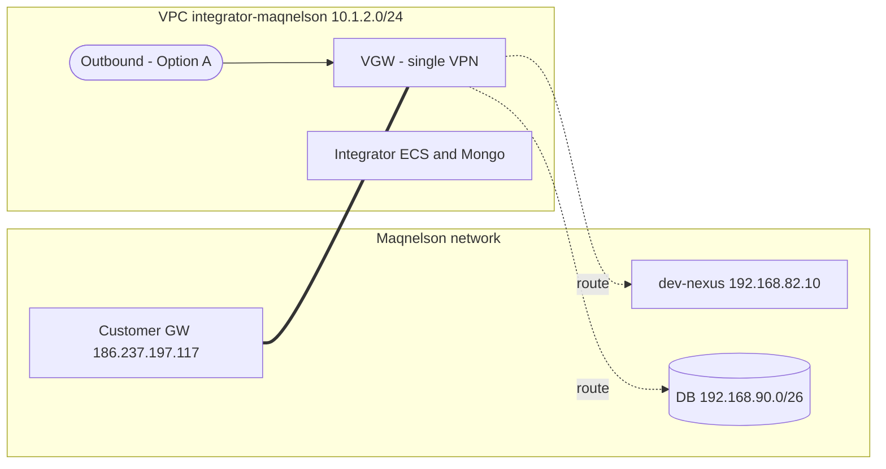

# SPIKE — app-outbound for Maqnelson (shared environment)

**Date:** 2026-07-14
**Status:** Closed — decision taken (Option A). Feeds `PLAN.md` in this folder.
**Question:** Stand up an outbound integration that pushes 4Shark award/payment data to Maqnelson's Nexus API. The API is only reachable through Maqnelson's VPN, which today terminates on the `integrator-maqnelson` network. Where do we run the outbound service, and how does it reach the VPN?

---

## 1. What the integration needs (from Maqnelson)

Maqnelson's outbound API contract and connection data (Fanini / Thiago Alves, e-mails 2026-04-28 and 2026-07-14; Postman collection `Maqnelson — Premiacao Comercial`):

- **Direction:** 4Shark **sends** award/payment data → Maqnelson Nexus API (outbound / "integração de saída").
- **Request URL:** `https://dev-nexus.maqnelson.com.br/api/v1/premiação/pagamentos` (2 endpoints in the contract).
- **Payload shape (example):** `{ mes_competencia, ano_competencia, pagamentos: [ { usuario_id_externo, tipo_pagamento_id_externo, premio_valor } ] }`.
- **Internal-only resolution:** the host answers **only** by its internal hostname, not by raw IP. We must run **internal DNS** resolving `dev-nexus.maqnelson.com.br → 192.168.82.10`.
- **VPN reachability:** Maqnelson will add the network **`192.168.82.0/26`** (where Nexus lives) to the **Phase 2 of the existing VPN** — i.e. reuse the current tunnel, not a new one.
- **Access credential:** the e-mail carries an access password for the Nexus environment. It must live in SSM/secrets, never in code, Terraform, docs or PR. (See §6.)

## 2. Current terrain (terraform/, direct reads)

- **Maqnelson VPN** — `integrator-maqnelson/main.tf:41-46`: the `integrator` module brings up the VPN via its `vpns.main` entry — `customer_gateway_ip = "186.237.197.117"`, today routing `192.168.90.0/26` (the customer DB subnet). It is a **VGW-terminated** site-to-site VPN attached to the `maqnelson` VPC (`10.1.2.0/24`, `networking/vpc_maqnelson.tf:4`). The module turns each `customer_network_cidrs` entry into a VPN static route (`modules/integrator/vpn.tf:93`) **and** a private-RT route → VGW (`modules/integrator/routing.tf:5`).
- **Outbound precedent (Atento)** — `app-outbound-atento-br/` has a **dedicated VPC** (`networking/vpc_app_outbound_atento_br.tf`, `10.12.0.0/26`) **and its own dedicated VPN** (`modules/app_outbound/vpn.tf` creates VGW + CGW + connection straight to the customer gateway). The "one dedicated VPC per outbound" standard existed **because that outbound had its own dedicated VPN** — a premise that does not hold here, where we are mandated to reuse the integrator's single VPN.
- **`app_outbound` module is thin** — it provides only the default SG, the VPN, the private-RT VPN routes, and the internal-zone association (`modules/app_outbound/{security,vpn,routing,dns}.tf`). The **compute** (ECS cluster + worker/runner services + autoscaling Lambda + scheduler) lives in the **stack** (`app-outbound-atento-br/compute.tf`), not the module.
- **Transit Gateway** — `networking/transit_gateway.tf:9-17`: the `egress-sa-east-1` TGW is for **centralized internet egress** (spoke-rt carries only a default `0.0.0.0/0` → egress VPC). It is **not** an inter-VPC mesh: spoke VPCs cannot reach each other today.
- **Internal DNS override precedent** — `dns/internal_dns_atento_vpn.tf`: a Route53 **private hosted zone** overrides the customer's public hostnames (`database.windows.net` for Atento's Azure SQL) to the private IPs reachable over the VPN, associated with the integrator VPC. This is the exact mold for `dev-nexus.maqnelson.com.br`.

## 3. The constraint that decides the architecture

**A VGW-terminated VPN is not routable from another VPC.** AWS does not perform edge-to-edge routing through a Virtual Private Gateway — neither via VPC peering nor via Transit Gateway. So a *separate* outbound VPC cannot use the integrator's VPN by merely peering/attaching to the integrator VPC and routing through it; that traffic path is blocked.

- Source: [AWS re:Post — can't reach a peered VPC over a VGW VPN](https://repost.aws/articles/ARy1NuLZbJQh2vgnZ2BzXxGw/why-can-t-i-connect-to-a-peered-vpc-when-using-an-aws-site-to-site-vpn-connection-that-terminates-on-a-virtual-private-gateway)
- Source: [AWS whitepaper — TGW + S2S VPN for multiple VPCs](https://docs.aws.amazon.com/whitepapers/latest/aws-vpc-connectivity-options/aws-transit-gateway-vpn.html)

Consequence: "put it in a separate VPC and just give that VPC access to the integrator network" does **not** resolve with plain routing. It resolves only via (B-proxy) a forward proxy inside the integrator VPC, or (B-tgw) re-terminating the VPN on the Transit Gateway.

## 4. Options considered

Constraint fixed by the engineer: **one single VPN, staying on the `integrator-maqnelson` network; no new VPN.**

| Option | Shape | Recurring cost/mo (differential) | Verdict |
|---|---|---|---|
| **A** | Outbound compute runs **inside the integrator VPC**, reuses the VGW directly | ≈ **US$ 0** | **CHOSEN** |
| B-proxy | Dedicated outbound VPC + forward proxy in the integrator VPC | ≈ US$ 12–35 + ops burden | Rejected |
| B-tgw | Dedicated outbound VPC + VPN re-terminated on the TGW | ≈ US$ 73 + data processing on all VPN traffic + live-tunnel migration | Rejected |

Cost basis: S2S VPN US$ 0.05/h (~US$ 36.5/mo); TGW attachment US$ 0.05/h + US$ 0.02/GB — [VPN pricing](https://aws.amazon.com/vpn/pricing/), [TGW pricing](https://aws.amazon.com/transit-gateway/pricing/) (us-east-1 published; sa-east-1 same order). The outbound ECS worker and the internal DNS record are common to all three, excluded from the differential.

### Community / AWS recommendation, and why it does not apply literally

For "share one VPN across multiple VPCs", the AWS/community consensus is unambiguous: **terminate the VPN on the Transit Gateway** (= B-tgw) — [re:Post](https://repost.aws/knowledge-center/transit-gateway-multiple-vpc), [whitepaper](https://docs.aws.amazon.com/whitepapers/latest/aws-vpc-connectivity-options/aws-transit-gateway-vpn.html). But that answers a *different* question: it assumes you are building N VPCs from scratch that need the VPN. Here a live VGW VPN already serves one VPC and we are adding one consumer that lives in the same customer-network trust boundary. Re-terminating a production tunnel + re-coordinating the customer to avoid co-locating one small service is not what the guidance is for; "one VPC per service" is a guideline, not a law. The proxy (B-proxy) is universally treated as a last-resort hack.

## 5. Decision

**Option A — run the Maqnelson outbound compute inside the `integrator-maqnelson` VPC and reuse the existing VGW VPN.**

**Confirmed to the customer** in the 2026-07-14 08:00 meeting ("4shark - VPN - api"): *"vou subir uma cópia da aplicação na rede que está a VPN"* — Option A is now a commitment, not just an internal preference. The meeting also proved the `0.0.0.0/0` shortcut is unavailable: it collides with the private RT's default route to the Transit Gateway, so the tunnel keeps two specific routes.

Rationale: the outbound service exists solely to reach the Maqnelson customer network through the *same* mandatory VPN the integrator already uses; the two share one network/trust boundary. Co-locating sidesteps the AWS edge-to-edge limitation entirely, needs no proxy and no tunnel migration, and matches exactly what Maqnelson agreed to (add `192.168.82.0/26` to the existing Phase 2). Accepted trade-off: two workloads share the integrator VPC (blast radius, `/24` CIDR) and the outbound is not in its own VPC — divergence from the Atento precedent, whose premise (dedicated VPN) does not hold here.

## 6. Handling notes / follow-ups feeding the PLAN

- **VPN route** is a one-line change: add `"192.168.82.0/26"` to `vpns.main.customer_network_cidrs` in `integrator-maqnelson/main.tf:44` — the module creates the tunnel static route and the private-RT route automatically.
- **Internal DNS**: new Route53 private zone for the customer domain (mold: `dns/internal_dns_atento_vpn.tf`) with `dev-nexus.maqnelson.com.br → 192.168.82.10`, associated with the integrator VPC.
- **Nexus access password** (from the e-mail): rotate into shared-001 SSM/secrets; it must never enter code, Terraform, docs or PR. Because it transited an e-mail, treat it as needing rotation on Maqnelson's side once wired.
- **Open dependencies** (detailed in `PLAN.md`): (1) the app-side worker that actually calls the Nexus REST API must exist in the shared-001 app; (2) stack shape (dedicated `app-outbound-maqnelson` stack reading the integrator VPC vs. compute added into `integrator-maqnelson`); (3) a shared-001 task-config analog to `modules/atento_001_task_config`; (4) Maqnelson-side confirmation that the existing tunnel (CGW `186.237.197.117`) actually reaches `192.168.82.0/26`.
