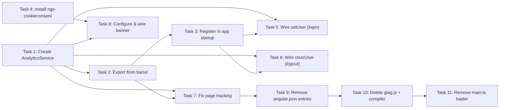

# TASKS — GA4 Front-End Instrumentation (Phase 1: Foundation)

> Reference: PLAN.md (engineer-approved), derived from TASKS-SPIKE.md

## Implementation progress — HANDOFF (resume here)

**Worktree:** `~/Projects/4Shark/app-webclient/.claude/worktrees/ga4-phase1` — branch `feature/ga4-instrumentation` (base `develop`). **Phase 1 code-complete incl. functional banner — PR #6525 open, MERGEABLE, 1 commit** (`eea3a64d8`). Rebased onto latest `develop` (conflicts in `CHANGELOG.md`/`package.json` resolved — kept develop's `translations:compile`, dropped `analytics:compile`). **Validated: `tsc --noEmit` (0 errors), `eslint` (0 errors), AND a real `ng build 4shark` production build (EXIT 0).** Remaining is engineer-side: production build across ALL 39 projects + GA4 DebugView, the `.env.ts.sample` line, and a review of the `cookieconsent` JS load method (see below).

### Round 2 — banner gap closed (this session)
- **Found mid-session**: `ngx-cookieconsent` is only a wrapper; the peer dep `cookieconsent@^3.1.1` (JS `window.cookieconsent` + CSS) was NOT installed, so the banner would not render at runtime. Closed in the same PR.
- `yarn add cookieconsent` → `cookieconsent@^3.1.1` + `@types/cookieconsent` (auto-pulled).
- **JS load**: `import 'cookieconsent';` in `src/main.ts` (side-effect import; the build is a pure IIFE that sets `window.cookieconsent`, and the package has no `sideEffects:false` so esbuild keeps it). **DEVIATION to flag**: the local pattern loads global vendor JS via `angular.json` `scripts[]` (jquery/worldmap), but those arrays are NON-uniform across the 39 projects (`[]` / `[jquery]` / `[jquery, worldmap]`), so a single `main.ts` import was chosen over 39 fragile edits. Engineer may prefer the `scripts[]` route — easy to switch.
- **CSS**: `@import "cookieconsent/build/cookieconsent.min.css";` in `src/main.scss` (1 edit, applies to all 39; vendor sets no `.cc-window`/`.cc-allow` colors so no cascade conflict with the white-label override).
- **White-label colors** (engineer asked "pegar do whitelabel?"): NEW partial `src/assets/styles/cookie-consent.scss` styling `.cc-window`/`.cc-btn` via `theme(primary, main)` / `theme(secondary, main)` / `theme(basic, white)` — resolves per-client through the existing `includePaths` → `colorVariables.scss` mechanism, so each white-label inherits its own brand. `@use`d in `main.scss`. NO JS `palette` set (that would be static/global — wrong for white-label).
- **Layout**: `position: 'bottom-right'` added to `cookieConfig` (floating box, per engineer choice).
- Env-setup note: the earlier `.env.ts` symlink → main checkout BROKE `ng build` (angular-compiler rejects a file resolved outside the worktree). Replaced with a real in-tree `.env.ts` generated by `yarn env` (git-ignored). `translation-files.config.ts` is generated by `yarn translations:compile` (develop's mechanism) — also git-ignored, regenerate if missing.

### Done (code written, NOT yet tested)
- `src/environments/environment.ts` + `environment.prod.ts` — added `analytics_id: env.ANALYTICS_ID` and `backend_slug: env.GRAPHQL_API_SERVER?.split('.')[0]`.
- `src/app/core/analytics.service.ts` (NEW) — `AnalyticsService` with `initialize/trackPageView/setUser/clearUser/grantConsent/emitEvent`. `initialize()` recreates the GA4 inline bootstrap (`window.dataLayer` + `gtag` function) before consent-default → js → config. `setUser` encapsulates the prefix: caller passes the raw internal id, the service emits `${environment.backend_slug}_${id}`. `declare let gtag` lives here.
- `src/app/core/index.ts` — barrel `export * from './analytics.service'`.
- `src/app/core/authentication/authentication.service.ts` — injected `AnalyticsService`; login (line 39) calls `setUser(response.body.user.id)` + `emitEvent('login', { method: 'password' })`; logout `finalize` calls `emitEvent('logout')` + `clearUser()`.
- `src/app/app.component.ts` — injected `AnalyticsService`; constructor calls `initialize()` + router `NavigationEnd` → `trackPageView(...)`; REMOVED the broken `dataLayer.push`, the dead `declare let gtag`, and the now-orphan `import { env }`.

### Discoveries already applied (don't re-derive)
- Deleting `src/gtag.js` removes the `gtag` function definition — `initialize()` now recreates it (the inline GA4 snippet). Without this, `gtag` would be undefined at runtime.
- `develop` diverged from `master` in `app.component.ts`/`app.module.ts`/`package.json`/`core/index.ts` — the broken `dataLayer.push` was at **line 46** (not 45). The other wiring files (`main.ts`, `authentication.service.ts`, models, `environment.ts`, `gtag.js`, `gtag_compiler.js`) are identical in both.
- Open item "credentials.user.id availability" RESOLVED: used `response.body.user.id` (present in the login response body at line 39).

### Done this session (all Phase 1 code)
- **Task 4 + 8 — consent banner**: `yarn add ngx-cookieconsent@8.0.0` (latest, requires Angular v19+ — compatible). Configured `NgcCookieConsentModule.forRoot(cookieConfig)` in `app.module.ts` (top-level `cookieConfig` const mirroring `defaultOptions`); `type: 'opt-in'`, `cookie.domain: window.location.hostname`, PT copy (engineer-approved draft), `content.href = environment.privacy_policy_url`. `AppComponent` injects `NgcCookieConsentService` and subscribes `statusChange$` → on `status === 'allow'` calls `analyticsService.grantConsent()` (mirrors the existing router subscription in the constructor).
- **Task 11 — `src/main.ts`**: removed `scriptGtagConfig` + its `insertBefore`; kept `scriptGtag` (GA4 library loader) and the `if (env.ANALYTICS_ID)` guard.
- **Task 9 — `angular.json`**: removed all 39 `"src/gtag.js"` entries (`grep -c` → 0; JSON re-validated via `JSON.parse`).
- **Task 10 — deletes**: removed `src/gtag.js`, `gtag_compiler.js`, the `analytics:compile` script, **and** its `yarn run analytics:compile &&` use in the `build` chain (package.json:8).
- **`PRIVACY_POLICY_URL` env threading** (Open item 1): added to the `env` script list (package.json:20) and to `environment.ts`/`environment.prod.ts` as `privacy_policy_url: env.PRIVACY_POLICY_URL || undefined` (mirrors `currencyNumberRepresentation`; `|| undefined` gives the `string | undefined` type `content.href` needs).
- **Changelog**: added `Cookie consent banner` + `Usage analytics tracking` under `## [Unreleased] ### Added`.
- Validation done: `eslint` (0 errors; 1 pre-existing unrelated `unused eslint-disable` warning in main.ts, suppressed by CI `--quiet`), `tsc --noEmit -p tsconfig.app.json` (0 errors).

### Engineer-side remaining (manual)
- **`.env.ts.sample`**: add `'PRIVACY_POLICY_URL': '<the _v2 S3 URL>'` in alphabetical position (between `MOBILE_CONFIGURATION_UUID` and `ROLLBAR_ACCESS_TOKEN`). Claude's tools are permission-blocked from reading/writing `.env*` files, so this one line could not be applied automatically. Not load-bearing — `env` is typed `{ [s: string]: string | null }`, so a missing key is type-safe; the functional wiring (env script + environment.ts/prod) is already in. Also add the key to your local machine `.env.ts` for local runs.
- **Production build + GA4 DebugView** (Phase-1 success checklist, below): build across all projects; in DebugView verify consent default before js/config, no 404 on `/gtag.js`, `page_view`/`login`/`logout` with `{slug}_{id}` user_id, banner persistence, no PII in payloads, Electron disabled. The worktree `node_modules` and a symlinked `.env.ts` (→ main checkout) are already set up for local runs.

### State
Phase 1 is code-complete on PR #6525 (base `develop`), awaiting the engineer's manual validation (production build + GA4 DebugView) and merge. After merge: run `/merge-cleanup` (removes the `ga4-phase1` worktree), then the dot-claude consent-mechanism doc (Follow-up below). Phase 2 (feature events) and Phase 3 (Electron) remain — see bottom of this file.

---

## Decomposition

**Chosen option:** Option A — monolithic single PR for all 11 Phase 1 steps

**Rationale (from engineer):** Atomic delivery of consent default + tracking infrastructure together guarantees LGPD compliance (no window where consent is set but tracking is offline). Single review gate, simpler PR narrative. Large diff (~450 lines service + 20+ line modifications + 39-project angular.json edit + 3 file deletions) is acceptable given the coherence of the change.

---

## Tasks

The 11 Phase 1 steps are executed as discrete units of work within a single PR, in dependency order.

### Task 1: Create `AnalyticsService`

- **Phase** (from PLAN.md): Phase 1, step 1
- **Description**: Create new file `src/app/core/analytics/analytics.service.ts` with `@Injectable({providedIn:'root'})` decoration. Implement six methods: `initialize()` (fires `gtag('consent','default',{analytics_storage:'denied',...})` BEFORE `gtag('js',...)` and `gtag('config',...)` — load-bearing ordering); `trackPageView(pagePath: string)` (calls `gtag('config', measurementId, {page_path})`, guarded on `if (!measurementId) return`); `setUser(userId: string)` (calls `gtag('set', {user_id})`); `clearUser()` (calls `gtag('set', {user_id: null})`); `grantConsent()` (calls `gtag('consent','update',{analytics_storage:'granted'})`); `emitEvent(eventName: string, params?: object)` (calls `gtag('event', eventName, params)`). Include `declare let gtag: Function` global declaration (inline or in .d.ts).
- **Dependencies**: None
- **Acceptance criteria**:
  - [ ] File exists at `src/app/core/analytics/analytics.service.ts`
  - [ ] All six methods present with correct gtag call signatures
  - [ ] `initialize()` fires consent-default BEFORE gtag('js') and gtag('config') (verified in DevTools console on first page load)
  - [ ] `initialize()` guards on `if (!measurementId) return` to handle Electron (ANALYTICS_ID=null)
  - [ ] `trackPageView()` passes `page_path` parameter correctly
  - [ ] `setUser()` and `clearUser()` guard on `if (!measurementId) return`
  - [ ] `grantConsent()` calls gtag('consent','update',{analytics_storage:'granted'})
  - [ ] `emitEvent()` present as infrastructure for Phase 2 (method stub; no feature events wired yet)
  - [ ] All gtag calls wrapped in error guards or try-catch to prevent uncaught errors
- **Pattern reference**: `src/app/rollbar.ts:40-42` (factory pattern for `@Injectable`), `src/app/app.module.ts:283-284` (provider registration)
  ```typescript
  // rollbar.ts — injectable singleton pattern
  export function errorHandlerFactory(rollbarService: RollbarService) {
    return (error: any) => {
      rollbarService.error(error);
    };
  }
  ```

### Task 2: Export `AnalyticsService` from barrel

- **Phase**: Phase 1, step 2 (integration)
- **Description**: Add export statement to `src/app/core/index.ts` so that `AnalyticsService` can be imported via `@app/core` (consistent with codebase convention for core services).
- **Dependencies**: Task 1
- **Acceptance criteria**:
  - [ ] `src/app/core/index.ts` exports `AnalyticsService`
  - [ ] `import { AnalyticsService } from '@app/core'` works in a test file without errors

### Task 3: Register `AnalyticsService` in app startup

- **Phase**: Phase 1, step 3 (initialization)
- **Description**: Wire `AnalyticsService.initialize()` into the Angular bootstrap path via `src/app/app.module.ts` providers. Use the factory/provider pattern at lines 283-284 (existing Rollbar registration model), or call from `AppComponent` constructor if that matches the codebase convention at implementation time. Goal: `initialize()` is called synchronously before any route changes or other feature initialization, guaranteeing Consent Mode ordering.
- **Dependencies**: Task 1, Task 2
- **Acceptance criteria**:
  - [ ] `AnalyticsService` is registered as a provider in `src/app/app.module.ts` (factory or standard `@Injectable`)
  - [ ] `initialize()` is called during app bootstrap (verified: DevTools Network tab shows `www.googletagmanager.com/gtag/js` in Network with gtag/js call order)
  - [ ] `gtag('consent','default',...)` fires before `gtag('js',...)` in the Network timeline on first page load

### Task 4: Install `ngx-cookieconsent` v8.0.0

- **Phase**: Phase 1, step 4 (dependencies)
- **Description**: Run `npm install ngx-cookieconsent@8.0.0` (or equivalent; MIT license, Angular 19+ compatible). Update `package.json` to reflect the new dependency.
- **Dependencies**: None (can run in parallel)
- **Acceptance criteria**:
  - [ ] `package.json` includes `"ngx-cookieconsent": "8.0.0"`
  - [ ] `npm install` succeeds; `node_modules/ngx-cookieconsent` exists
  - [ ] No breaking dependency conflicts

### Task 5: Wire `setUser()` into login flow

- **Phase**: Phase 1, step 5 (authentication integration)
- **Description**: Modify `src/app/core/authentication/authentication.service.ts:39`. After `this.credentialsService.setCredentials(response.body, formData.remember)`, add: `const slug = env.GRAPHQL_API_SERVER.split('.')[0]; const userId = \`${slug}_${this.credentialsService.credentials.user.id}\`; this.analyticsService.setUser(userId); this.analyticsService.emitEvent('login', {method: 'password'});`. This wires both the user_id (GA4 built-in `user_id`) and the `login` event (GA4 recommended event).
- **Dependencies**: Task 1, Task 3
- **Acceptance criteria**:
  - [ ] `setUser()` is called after `setCredentials()` at line 39
  - [ ] User ID is formatted as `{slug}_{userId}` where `slug = env.GRAPHQL_API_SERVER.split('.')[0]`
  - [ ] `emitEvent('login', {method: 'password'})` is called
  - [ ] GA4 DebugView shows `login` event with `user_id` populated in `{slug}_{userId}` format
  - [ ] No PII fields (`email`, `first_name`, `last_name`, `company_id`) appear in the event payload

### Task 6: Wire `clearUser()` and logout event into logout flow

- **Phase**: Phase 1, step 6 (authentication integration)
- **Description**: Modify `src/app/core/authentication/authentication.service.ts:68-69`. Before `destroyCredentials()` (or before the navigation to /login), add: `this.analyticsService.emitEvent('logout'); this.analyticsService.clearUser();`. This sends the `logout` event and clears the `user_id` in GA4 to mark the end of the session.
- **Dependencies**: Task 1, Task 3
- **Acceptance criteria**:
  - [ ] `emitEvent('logout')` is called before `destroyCredentials()`
  - [ ] `clearUser()` is called before `destroyCredentials()` (or the navigation that follows)
  - [ ] GA4 DebugView shows `logout` event
  - [ ] After logout, GA4 session has `user_id: null` (user_id is cleared)

### Task 7: Replace broken page_path tracking with `trackPageView()`

- **Phase**: Phase 1, step 7 (page tracking fix)
- **Description**: Modify `src/app/app.component.ts:45`. Replace the broken call `(window as any).dataLayer.push('config', env.ANALYTICS_ID, { page_path: event.urlAfterRedirects });` with `this.analyticsService.trackPageView(event.urlAfterRedirects);`. Inject `AnalyticsService` into `AppComponent` constructor.
- **Dependencies**: Task 1, Task 2
- **Acceptance criteria**:
  - [ ] `dataLayer.push` call is removed
  - [ ] `this.analyticsService.trackPageView(event.urlAfterRedirects)` is called on route changes
  - [ ] GA4 DebugView shows `page_view` events on each route change
  - [ ] `page_path` parameter in GA4 matches the NavigationEnd URL (`event.urlAfterRedirects`)

### Task 8: Configure and wire `ngx-cookieconsent` banner

- **Phase**: Phase 1, step 8 (consent UI)
- **Description**: Configure `ngx-cookieconsent` in `src/app/app.module.ts` (import `NgxCookieConsentModule`) with opt-in type (default-denied, LGPD-compliant), Portuguese copy for the banner text, and the shared 4Shark privacy policy URL (engineer provides at implementation time). Subscribe to `ngcCookieConsentService.statusChange$` in `AppComponent` or `AnalyticsService`; on `status === 'allow'` (or 'dismiss', depending on library behavior), call `this.analyticsService.grantConsent()`.
- **Dependencies**: Task 4, Task 1
- **Acceptance criteria**:
  - [ ] `NgxCookieConsentModule` is imported in `src/app/app.module.ts`
  - [ ] Banner configuration specifies `type: 'opt-in'`
  - [ ] Banner renders on first visit in Portuguese
  - [ ] "Learn more" link points to shared 4Shark privacy policy URL (open item: engineer provides URL)
  - [ ] Accepting banner calls `grantConsent()` → GA4 DebugView shows `gtag('consent','update',{analytics_storage:'granted'})`
  - [ ] Banner state persists via localStorage (second visit does not re-show banner)
  - [ ] No errors in browser console on banner initialization

### Task 9: Remove `"src/gtag.js"` entries from all 39 `angular.json` projects

- **Phase**: Phase 1, step 9 (cleanup)
- **Description**: Delete the plain-string asset entry `"src/gtag.js"` from the `assets` array in all 39 projects' `angular.json` files. Recommended approach: automated sed/jq pass to avoid manual error across 39 projects. Verify post-removal with `grep -r '"src/gtag.js"' angular.json` (should return empty). Note this approach in the task commit message.
- **Dependencies**: Task 1, Task 7 (AnalyticsService must be deployed before asset entries are removed, so page tracking is live)
- **Acceptance criteria**:
  - [ ] `grep -r '"src/gtag.js"' angular.json` returns empty (all 39 entries removed)
  - [ ] Build succeeds for all 39 projects (`npm run build` or equivalent CI command)
  - [ ] No other asset entries are accidentally modified

### Task 10: Delete `src/gtag.js` and `gtag_compiler.js`; remove `analytics:compile` script

- **Phase**: Phase 1, step 10 (cleanup)
- **Description**: Delete file `src/gtag.js` from the repository. Delete file `gtag_compiler.js`. Modify `package.json` to remove the `"analytics:compile"` npm script entry (the `gtag_compiler.js` is no longer needed).
- **Dependencies**: Task 9 (angular.json entries must be removed before deleting the file, to avoid asset resolution errors)
- **Acceptance criteria**:
  - [ ] `src/gtag.js` does not exist in repository
  - [ ] `gtag_compiler.js` does not exist in repository
  - [ ] `package.json` does not contain `"analytics:compile"` script
  - [ ] `npm run build` succeeds (verify scripts still run correctly)

### Task 11: Remove local `/gtag.js` loader from `src/main.ts`; keep GA4 library loader

- **Phase**: Phase 1, step 11 (cleanup)
- **Description**: Modify `src/main.ts:35-45`. Remove lines 40-41 (the `scriptGtagConfig` creation) and the corresponding `insertBefore` call at line 43 that loads the local `/gtag.js` file. **KEEP** lines 36-38 (the `scriptGtag` loader that loads `www.googletagmanager.com/gtag/js?id=…`) and the `if (env.ANALYTICS_ID)` guard. Without this step, deleting `src/gtag.js` causes a runtime 404 on `/gtag.js` on every page load. After removal, `main.ts` loads only the GA4 library; the consent/js/config/page_path calls are now owned by `AnalyticsService`.
- **Dependencies**: Task 10
- **Acceptance criteria**:
  - [ ] Lines 40-41 (scriptGtagConfig) are removed
  - [ ] Line 43 (insertBefore call) is removed
  - [ ] Lines 36-38 (scriptGtag loader) remain unchanged
  - [ ] `if (env.ANALYTICS_ID)` guard remains unchanged (Phase 3 / Electron relies on it)
  - [ ] Build succeeds
  - [ ] Network tab on first page load shows NO 404 for `/gtag.js`
  - [ ] Network tab shows GA4 library load from `www.googletagmanager.com/gtag/js?id=…` (expected)
  - [ ] GA4 DebugView continues to show page_view, login, logout, and consent events

---

## Sequencing

All 11 tasks execute within a single PR and are sequenced as follows:



**Critical path:** Tasks 1 → 2 → 3 → 5, 6, 7 (in parallel) → 9 → 10 → 11. Tasks 4 and 8 (banner) can proceed in parallel with the service wiring.

**Dependency summary:**
- Tasks 5, 6, 7 depend on Tasks 1, 2, 3 (service must be created and initialized)
- Task 8 depends on Tasks 1 and 4 (service and library must be present)
- Task 9 depends on Task 7 (page tracking must be live before removing angular.json references)
- Task 10 depends on Task 9 (angular.json entries must be gone before deleting files)
- Task 11 depends on Task 10 (cleanup must complete before removing main.ts loader)

---

## Cross-cutting concerns

### PII boundary (non-negotiable)

**NEVER send the following fields in any GA4 event parameter or user_id computation:**
- `email`
- `first_name`
- `last_name`
- `company_id`

These fields live on the `UserCredentials` object alongside `id` (the only field used — for the user_id). Verify all event payloads in DevTools Network tab (analytics.google.com → collect requests) that no PII leaks.

### LGPD consent-ordering constraint (load-bearing)

`gtag('consent','default',{analytics_storage:'denied', ad_storage:'denied', ad_user_data:'denied', ad_personalization:'denied'})` **MUST fire BEFORE** `gtag('js', new Date())` and **BEFORE** any `gtag('config', ...)` call. This ordering is the reason `AnalyticsService.initialize()` is called synchronously from the Angular bootstrap path, not from `window.onload`. Verify this ordering in DevTools Console on first page load (look for the gtag call sequence in the output).

### Testing strategy (guidance for implementation)

- **Unit tests (AnalyticsService):** Mock gtag function; verify that `initialize()` calls consent-default before js/config; verify that `setUser()` formats user_id correctly; verify that `trackPageView()` passes page_path; verify that `grantConsent()` updates consent state.
- **Integration tests (authentication flow):** Verify that login flow calls `setUser()` + `emitEvent('login')`; verify that logout flow calls `emitEvent('logout')` + `clearUser()`.
- **E2E / Manual validation:** Open GA4 DebugView (with debug token); trigger login → verify `login` event and user_id; navigate between pages → verify `page_view` events; accept banner → verify consent update; logout → verify `logout` event and user_id becomes null.

### Error handling (guidance for implementation)

- `initialize()` guards on `if (!measurementId) return` to handle Electron builds (ANALYTICS_ID=null)
- All gtag calls should be wrapped in error guards or try-catch to prevent uncaught errors if gtag is undefined
- Consent banner accepts/rejects gracefully; no blocking errors if localStorage is unavailable
- NetworkError handling: if gtag/collect requests fail (unlikely, but possible in offline scenarios), do not break the UI

### Observability and validation checklist (Phase 1 success criteria)

Run these checks before signing off on the PR merge:

- [ ] **Consent ordering:** Browser DevTools Console → first page load shows `gtag('consent','default',...)` before `gtag('js',...)` in the call sequence
- [ ] **Repository cleanup:** `grep -r '"src/gtag.js"' angular.json` returns empty; `src/gtag.js` and `gtag_compiler.js` do not exist
- [ ] **No 404 on /gtag.js:** DevTools Network tab → first page load shows NO 404 for `/gtag.js` (only GA4 library load from googletagmanager.com)
- [ ] **Page tracking fixed:** Route changes → GA4 DebugView shows `page_view` events with `page_path` matching the NavigationEnd URL
- [ ] **User-ID on login:** Login flow → GA4 DebugView shows `login` event with `user_id` in `{slug}_{userId}` format (e.g., `atento001_12345`)
- [ ] **User-ID cleared on logout:** Logout flow → GA4 DebugView shows `logout` event; subsequent events have `user_id: null`
- [ ] **Banner rendering and persistence:** First visit → banner renders in Portuguese; accept banner → GA4 DebugView shows `gtag('consent','update',{analytics_storage:'granted'})`; second visit → banner does NOT re-appear (localStorage persistence verified)
- [ ] **No PII in payloads:** DevTools Network tab → filter `analytics.google.com/collect` → inspect requests → confirm NO `email`, `first_name`, `last_name`, or `company_id` in any payload
- [ ] **Electron disabled:** Electron build with `ANALYTICS_ID=null` → no gtag calls, no Network requests to googletagmanager.com (the `if (env.ANALYTICS_ID)` guard in main.ts handles this)
- [ ] **Build succeeds:** Run `npm run build` for all 39 projects; CI passes

---

## Open items (resolve at implementation)

These do not block the architecture but must be resolved before the PR merges:

1. **Privacy policy URL** — RESOLVED: `https://4shark-legal.s3.sa-east-1.amazonaws.com/4shark_politica_de_privacidade_brasil_v2.pdf` (current version in the `4shark-legal` bucket). Wire it as an env var (`PRIVACY_POLICY_URL`, like `ANALYTICS_ID`) so it can be updated per Netlify site without a code rebuild. The versioned-policy model stays as-is (v1/v2 separate, by design); when compliance publishes a new version, the operational rule is to update this env var (see "Follow-up" below).

2. **`credentials.user.id` availability at the login hook** — confirm at implementation that `credentialsService.credentials.user.id` is populated immediately after `this.credentialsService.setCredentials(response.body, formData.remember)` at `authentication.service.ts:39`, before `setUser(...)` is called. Path: `credentials.model.ts:18` (`user: UserCredentials`) → `user-credential.model.ts:17` (`id: string`). If the id is not available at that call site, adjust the hook placement or async timing.

---

## Follow-up — document the consent mechanism in dot-claude (after Phase 1 merges)

A separate small PR to `dot-claude` (a reference doc / runbook), done at the END of this front. It documents:

- The GA4 Consent Mode v2 + `ngx-cookieconsent` banner flow (default-denied → granted on accept).
- The **versioned privacy policy** in the `4shark-legal` bucket (v1/v2 separate by design) and why it stays that way (per-version acceptance traceability via `pending_legal_documents_acceptance`).
- **The operational rule, front and center:** when compliance publishes a new policy version, update `PRIVACY_POLICY_URL` on the Netlify sites to the new file. The banner link must track the current version; the re-acceptance flow re-collects consent.

Goal: the next person who touches consent finds this documented and is reminded of the version-update step without rediscovering it. **Acceptance:** doc merged in `dot-claude`, discoverable (linked from the relevant index/runbook list).

**Phase 2: Feature events** — Implement the C3 feature-level event taxonomy using `AnalyticsService.emitEvent()`. Pending: engineer-provided event list + PII audit of every event parameter. Infrastructure (`emitEvent` method) is ready in Phase 1; no architectural changes needed.

**Phase 3: Electron** — Track Electron desktop usage via a dedicated GA4 property (D2). Pending: defined LGPD consent mechanism for desktop + GA4 property creation in `google-analytics-manager`. Current state: Electron builds have `ANALYTICS_ID: null`; the `if (env.ANALYTICS_ID)` guard in `src/main.ts:35-45` keeps analytics disabled with no code change required.
