# Auxiliary file 2 — the commission worker chain, verified enqueue by enqueue

Referenced from `PLAN-SPIKE.md` §§ "Where the value is materialized" and "The read path".

Repository: `~/Projects/4Shark/app`, branch `develop`. Every arrow below is a
`dynamic_perform_async` / `dynamic_push_bulk` call read at the line cited. Produced by
`grep -rn "dynamic_perform_async\|dynamic_push_bulk"` over the commission-stage worker directories.

---

## 1. The chain

```mermaid
graph TD
  CP[Commission::Producer] --> CC[Commission::Consumer]
  CC --> CGP[CommissionGoal::Producer]
  CGP -.-> PURGE[AggregatedIndicator::Purge::Producer]
  PURGE --> PURGEC[Purge::Consumer]
  PURGEC --> AIP[AggregatedIndicator::Producer]
  AIP --> AIC[AggregatedIndicator::Consumer]
  AIC --> IAP[IndicatorAggregation::Producer]
  IAP -.-> CALCP[AggregatedIndicator::Calculator::Producer]
  CALCP --> CALCC[Calculator::Consumer]
  CALCC --> IOP[UserCommission::IndicatorOptionsProducer]
  IOP --> IOC[IndicatorOptionsConsumer]
  IOC --> DIP[DealIncentive::Producer]
  DIP --> DEAL[DealProducer / PeriodProcessor / Consumer]
  DEAL --> DCP[UserPaymentTypeCommission::DealCacheProducer]
  DCP -.-> UDCP[UserCommission::DealCacheProducer]
  UDCP --> UDCC[DealCacheConsumer]
  UDCC --> DIF[DealIncentive::Finalizer]
  DIF --> IIP[IndicatorIncentive::Producer]
  IIP --> IIC[IndicatorIncentive::Consumer]
  IIC --> ICP[UserPaymentTypeCommission::IndicatorCacheProducer]
  ICP -.-> UICP[UserCommission::IndicatorCacheProducer]
  UICP --> UICC[IndicatorCacheConsumer]
  UICC --> IIF[IndicatorIncentive::Finalizer]
  IIF --> RP[Ranking::Producer]
  RP --> RC[Ranking::Consumer]
  RC --> ROP[Ranking::OrderProducer]
  ROP --> ROC[Ranking::OrderConsumer]
  ROC --> RIP[RankingIncentive::Producer]
  RIP --> RIC[RankingIncentive::Consumer]
  RIC --> RCP[UserPaymentTypeCommission::RankingCacheProducer]
  RCP -.-> URCP[UserCommission::RankingCacheProducer]
  URCP --> URCC[RankingCacheConsumer]
  URCC --> RIF[RankingIncentive::Finalizer]
  RIF --> LOP[UserCommission::LimiterOptionsProducer]
  LOP --> LOC[LimiterOptionsConsumer]
  LOC --> LIP[LimiterIncentive::Producer]
  LIP --> LIC[LimiterIncentive::Consumer]
  LIC --> LCP[UserPaymentTypeCommission::LimiterCacheProducer]
  LCP -.-> ULCP[UserCommission::LimiterCacheProducer]
  ULCP --> ULCC[LimiterCacheConsumer]
  ULCC --> LIF[LimiterIncentive::Finalizer]
  LIF --> REP[RedemptionIncentive::Producer]
  REP --> REC[RedemptionIncentive::Consumer]
  REC --> RECP[UserPaymentTypeCommission::RedemptionCacheProducer]
  RECP -.-> URECP[UserCommission::RedemptionCacheProducer]
  URECP --> URECC[RedemptionCacheConsumer]
  URECC --> REF[RedemptionIncentive::Finalizer]
  REF --> MSP[Commission::MoneySanitizerProcessor]
```



Dotted edges are the segments not read line-by-line for this file (the
`UserPaymentTypeCommission::*CacheProducer` family and the `IndicatorAggregation` /
`CommissionGoal` legs); every solid edge is cited below.

## 2. The cited enqueues

| From | Line | To |
|---|---|---|
| `commission/producer.rb` | 36 | `Commission::Consumer` |
| `commission/consumer.rb` | 50 | `CommissionGoal::Producer` |
| `aggregated_indicator/purge/producer.rb` | 23 / 25 | `Purge::Consumer` / `AggregatedIndicator::Producer` |
| `aggregated_indicator/purge/consumer.rb` | 27 | `AggregatedIndicator::Producer` |
| `aggregated_indicator/producer.rb` | 32 / 34 | `AggregatedIndicator::Consumer` / `UserCommission::IndicatorOptionsProducer` |
| `aggregated_indicator/consumer.rb` | 29 | `IndicatorAggregation::Producer` |
| `aggregated_indicator/calculator/producer.rb` | 26 / 28 | `Calculator::Consumer` / `UserCommission::IndicatorOptionsProducer` |
| `aggregated_indicator/calculator/consumer.rb` | 23 | `UserCommission::IndicatorOptionsProducer` |
| `user_commission/indicator_options_producer.rb` | 20 | `IndicatorOptionsConsumer` |
| `user_commission/indicator_options_consumer.rb` | 22 | `DealIncentive::Producer` |
| `deal_incentive/producer.rb` | 31 / 36 / 39 | `PeriodProcessor` / `DealProducer` / `DealCacheProducer` |
| `deal_incentive/deal_producer.rb` | 41 / 47 | `DealIncentive::Consumer` / `DealCacheProducer` |
| `deal_incentive/consumer.rb` | 96 | `UserPaymentTypeCommission::DealCacheProducer` |
| `user_commission/deal_cache_consumer.rb` | 41 | `DealIncentive::Finalizer` |
| `deal_incentive/finalizer.rb` | 22 | `IndicatorIncentive::Producer` |
| `indicator_incentive/producer.rb` | 25 / 27 | `IndicatorIncentive::Consumer` / `IndicatorCacheProducer` |
| `indicator_incentive/consumer.rb` | 67 | `UserPaymentTypeCommission::IndicatorCacheProducer` |
| `user_commission/indicator_cache_producer.rb` | 20 | `IndicatorCacheConsumer` |
| `user_commission/indicator_cache_consumer.rb` | 51 | `IndicatorIncentive::Finalizer` |
| `indicator_incentive/finalizer.rb` | 22 | `Ranking::Producer` |
| `ranking/producer.rb` | 39 / 41 | `Ranking::Consumer` / `UserCommission::LimiterOptionsProducer` |
| `ranking/consumer.rb` | 20 | `Ranking::OrderProducer` |
| `ranking/order_producer.rb` | 19 | `Ranking::OrderConsumer` |
| `ranking/order_consumer.rb` | 57 | `RankingIncentive::Producer` |
| `ranking_incentive/producer.rb` | 26 / 28 | `RankingIncentive::Consumer` / `UserCommission::LimiterOptionsProducer` |
| `ranking_incentive/consumer.rb` | 61 | `UserPaymentTypeCommission::RankingCacheProducer` |
| `user_commission/ranking_cache_producer.rb` | 20 | `RankingCacheConsumer` |
| `user_commission/ranking_cache_consumer.rb` | 51 | `RankingIncentive::Finalizer` |
| `ranking_incentive/finalizer.rb` | 22 | `UserCommission::LimiterOptionsProducer` |
| `user_commission/limiter_options_producer.rb` | 24 / 26 | `LimiterOptionsConsumer` / `RedemptionIncentive::Producer` |
| `user_commission/limiter_options_consumer.rb` | 35 | `LimiterIncentive::Producer` |
| `limiter_incentive/producer.rb` | 26 / 28 | `LimiterIncentive::Consumer` / `RedemptionIncentive::Producer` |
| `limiter_incentive/consumer.rb` | 54 | `UserPaymentTypeCommission::LimiterCacheProducer` |
| `user_commission/limiter_cache_producer.rb` | 20 | `LimiterCacheConsumer` |
| `user_commission/limiter_cache_consumer.rb` | 51 | `LimiterIncentive::Finalizer` |
| `limiter_incentive/finalizer.rb` | 22 | `RedemptionIncentive::Producer` |
| `redemption_incentive/producer.rb` | 35 / 37 | `RedemptionIncentive::Consumer` / `MoneySanitizerProcessor` |
| `redemption_incentive/consumer.rb` | 61 | `UserPaymentTypeCommission::RedemptionCacheProducer` |
| `user_commission/redemption_cache_producer.rb` | 20 | `RedemptionCacheConsumer` |
| `user_commission/redemption_cache_consumer.rb` | 39 | `RedemptionIncentive::Finalizer` |
| `redemption_incentive/finalizer.rb` | 16 | `Commission::MoneySanitizerProcessor` |

All paths are relative to `app/workers/`.

---

## 3. The stage order is encoded ONLY in this graph

There is no constant, enum, or column expressing "Deal, then Indicator, then Ranking, then Limiter,
then Redemption". `Incentive::TYPES` (`app/models/incentive.rb:15`) is declared in a different
order and carries no ordering semantics:

```ruby
  TYPES = %w[DealIncentive LimiterIncentive IndicatorIncentive RankingIncentive RedemptionIncentive].freeze
```

The only place the execution order exists is the chain above, spread across 41 enqueue sites.

---

## 4. The `Computation` protocol every stage obeys

`app/models/computation.rb:22-44`:

```ruby
  def increment_queue(by: 1)
    @queue_value = queue.increment(by: by)
  end

  def increment_executions(by: 1)
    @executions_value = executions.increment(by: by)
  end
```

```ruby
  def done?
    queue_value == executions_value
  end
```

The invariant each producer/consumer pair follows:

- A **producer** raises when the previous stage has not settled, then increments `queue` by the
  fan-out size before pushing. `app/workers/indicator_incentive/producer.rb:15,23`:

```ruby
      raise RaceConditionException unless commission.computation.done?
```

```ruby
        commission.computation.increment_queue(by: combinations.count)
```

- A **consumer** increments `executions` once, then enqueues the next stage only if it observed
  `done?`. `app/workers/indicator_incentive/consumer.rb:63-67`:

```ruby
      commission.computation.increment_executions

      return unless commission.computation.done?

      UserPaymentTypeCommission::IndicatorCacheProducer.with_company_id(commission.company_id).dynamic_perform_async(commission_id, partial)
```

- The counters are reset once per run, at the head of the chain
  (`app/workers/commission/producer.rb:17-18`):

```ruby
      commission.computation.reset_queue
      commission.computation.reset_executions
```

A new fan-out stage that does not increment `queue` before pushing, or does not increment
`executions` in every terminating path, leaves `queue != executions` and the chain stops advancing.

---

## 5. Where the frozen snapshot is written and read

Written once, per user commission, before any incentive stage
(`app/workers/user_commission/indicator_options_consumer.rb:16-17`):

```ruby
      indicator_options = Commission::IndicatorOptionsProcessor.call(user_commission: user_commission, commission: commission)
      UserCommission.with_uncached_connection { user_commission.update(modifier_options: indicator_options) }
```

Read by every downstream consumer:

| Consumer | Line | Verbatim |
|---|---|---|
| `deal_incentive/consumer.rb` | 31 | `metric_options = user_commission.modifier_options.select { \|key\| variables_keys.include?(key) }` |
| `deal_incentive/period_processor.rb` | 20 | `metric_options = user_commission.modifier_options.select { \|key\| variables_keys.include?(key) }` |
| `indicator_incentive/consumer.rb` | 29 | `options = deal_options.merge(user_commission.modifier_options)` |
| `ranking_incentive/consumer.rb` | 44 | `options = deal_options.merge(modifier_options).merge(ranking_options)` |
| `limiter_incentive/consumer.rb` | 37 | `options = deal_options.merge(modifier_options).merge(limiter_options)` |
| `redemption_incentive/consumer.rb` | 34 | `options = deal_options.merge(modifier_options).merge(redemption_options)` |

The two deal-stage sites filter the snapshot down to metric keys only, so a fresh auxiliary merge
there would need its own path rather than riding the existing `select`.

### The fresh-read precedent the auxiliary path would copy

`Commission::LimiterOptionsProcessor` and `Commission::RedemptionOptionsProcessor` are invoked
with live state at the moment of use rather than read from the snapshot.

`app/services/commission/redemption_options_processor.rb:4-11` — the whole class:

```ruby
  class RedemptionOptionsProcessor
    def self.call(user_commission:)
      {
        pontos: user_commission.points.to_f,
        points: user_commission.points.to_f
      }
    end
  end
```

`app/workers/redemption_incentive/consumer.rb:32-34`:

```ruby
      modifier_options = user_commission.modifier_options
      redemption_options = Commission::RedemptionOptionsProcessor.call(user_commission: user_commission)
      options = deal_options.merge(modifier_options).merge(redemption_options)
```

Note that `LimiterOptionsProcessor` is called one stage earlier and persisted onto the user
commission (`app/workers/user_commission/limiter_options_consumer.rb:19-28`) rather than inside the
limiter consumer itself; `limiter_incentive/consumer.rb:36` then reads the persisted hash:

```ruby
      limiter_options = incentive.money? ? user_commission.money_limiter_options : user_commission.points_limiter_options
```

So the two named precedents differ: redemption computes in the consumer, limiter computes in a
dedicated preceding stage and persists. Both merge last, after `modifier_options`.

---

## 6. Retry idempotency is NOT uniform across the commissioning writes

SPIKE §4.2b rests on the indicator commissioning being idempotent under retry. It is:

`app/workers/indicator_incentive/consumer.rb:52-60`:

```ruby
        indicator_commissioning =
          IndicatorCommissioning.with_uncached_connection do
            IndicatorCommissioning.find_or_initialize_by(user_commission_id: user_commission.id, rule_id: rule_id)
          end

        indicator_commissioning.value = indicator_value
        indicator_commissioning.payment_type_id = payment_type_id
        indicator_commissioning.user_payment_type_commission_id = user_payment_type_commission.id
        IndicatorCommissioning.with_uncached_connection { indicator_commissioning.save! }
```

The other three stages construct a new record instead:

`app/workers/limiter_incentive/consumer.rb:41-47`:

```ruby
        limiter_commissioning = LimiterCommissioning.new
        limiter_commissioning.user_commission_id = user_commission.id
        limiter_commissioning.rule_id = rule.id
        limiter_commissioning.value = limiter_value
        limiter_commissioning.payment_type_id = incentivation.payment_type_id
        limiter_commissioning.user_payment_type_commission_id = user_payment_type_commission.id
        LimiterCommissioning.with_uncached_connection { limiter_commissioning.save! }
```

`ranking_incentive/consumer.rb:48-54` and `redemption_incentive/consumer.rb:48-54` have the same
`.new` shape. The unique index still holds the invariant at the database
(`db/schema.rb:457`):

```ruby
    t.index ["rule_id", "user_commission_id"], name: "commissionings_unique_period_index", unique: true, where: "(deal_id IS NULL)"
```

so a retry of one of those three raises on `save!` rather than overwriting. The redemption stage
compensates by destroying its prior rows at the top of its producer
(`app/workers/redemption_incentive/producer.rb:30`):

```ruby
        RedemptionCommissioning.with_uncached_connection { RedemptionCommissioning.destroy(commissioning_ids) }
```

The limiter and ranking stages have no equivalent purge.

---

## 7. `LimiterCommissioning` inverts its sign

`app/models/limiter_commissioning.rb`, the whole class:

```ruby
class LimiterCommissioning < Commissioning
  def money
    return 0 if rule.incentive.points?

    value * -1
  end

  def points
    return 0 if rule.incentive.money?

    value * -1
  end
end
```

`Commissioning#money` (the base, `app/models/commissioning.rb:60-64`) returns `value` unchanged.
A materialization that sums `commissionings.value` and one that sums `#money` therefore disagree in
sign for any limiter rule bound to an auxiliary variable.

---

## 8. `commissionings` requires a payment type

`app/models/commissioning.rb:13-17`:

```ruby
  validates :payment_type_id, presence: true
  validates :rule_id, presence: true
  validates :type, inclusion: { in: TYPES }
  validates :user_commission_id, presence: true
  validates :user_payment_type_commission_id, presence: true
```

Both `payment_type_id` and `user_payment_type_commission_id` are mandatory, and both are resolved
from the `Incentivation` of the plan (e.g. `app/workers/limiter_incentive/consumer.rb:18-23`). A
commissioning row therefore cannot exist detached from a payment type — relevant to the
publish-only question, because a rule that writes an auxiliary value without paying still has to
decide whether a commissioning row exists at all.

---

## 9. The zero-value guard, per stage

Each consumer persists only on a non-zero result:

| File:line | Verbatim |
|---|---|
| `indicator_incentive/consumer.rb:41` | `if indicator_value.present? && indicator_value.nonzero?` |
| `limiter_incentive/consumer.rb:40` | `if limiter_value.present? && limiter_value.nonzero?` |
| `ranking_incentive/consumer.rb:47` | `if ranking_value.present? && ranking_value.nonzero?` |
| `redemption_incentive/consumer.rb:37` | `if redemption_value.present? && redemption_value.nonzero?` |

This confirms SPIKE §2.2 and extends it: the guard is present in all four incentive stages, not
only indicator and limiter.

---

## 10. Purge wipes every aggregated indicator; recreation is type-scoped

`app/workers/aggregated_indicator/purge/consumer.rb:17-21`:

```ruby
        aggregated_indicator_ids = AggregatedIndicator.with_uncached_connection { user_commission.aggregated_indicator_ids }

        aggregated_indicator_ids.each do |aggregated_indicator_id|
          AggregatedIndicator.with_uncached_connection { AggregatedIndicator.destroy(aggregated_indicator_id) }
        end
```

Unscoped, so auxiliary rows stored in `aggregated_modifiers` are cleared on every reprocess — the
free half of SPIKE §4.2c. Recreation is type-scoped
(`app/workers/aggregated_indicator/producer.rb:22-26`), so auxiliary rows are not recreated there.

**One consequence SPIKE §4.2c does not state.** `AggregatedIndicator::Calculator::Producer` fans
out over *every* aggregated indicator of the commission's user commissions, with no type scope
(`app/workers/aggregated_indicator/calculator/producer.rb:20-21`):

```ruby
        aggregated_indicator_ids =
          AggregatedIndicator.with_uncached_connection { AggregatedIndicator.where(user_commission: user_commission_ids).pluck(:id) }
```

and its consumer calls `calculate!` on each (`calculator/consumer.rb:17`):

```ruby
        AggregatedIndicator.with_uncached_connection { aggregated_indicator.calculate! }
```

`AggregatedIndicator#calculate!` (`app/models/aggregated_indicator.rb:25-47`) recomputes from
`indicator_aggregations` and falls back to `variable.format_default` when the result is blank
(line 27-28):

```ruby
      if result.compact.blank?
        variable.format_default
```

Within a single commission run the Calculator stage completes before any incentive stage begins, so
an auxiliary row written during the indicator stage is never seen by it. The exposure is any path
that re-enters the Calculator after auxiliary rows exist — it would overwrite them with the
variable's default.
