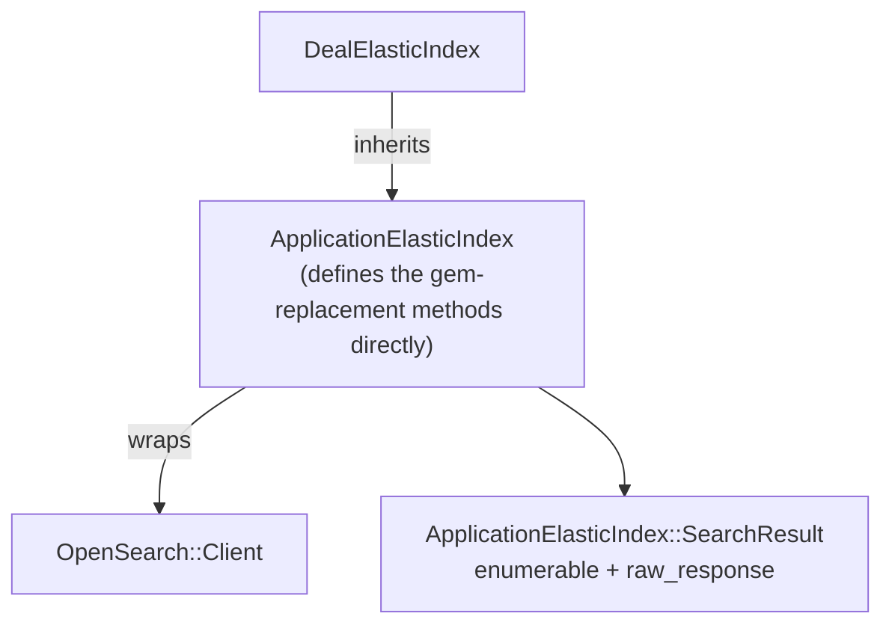

# BLUEPRINT — `opensearch-ruby` migration + Repository shim

**Decision recorded in:** `SPIKE.md` (same folder) — migrate to official `opensearch-ruby` + hand-rolled Repository shim, keep app code.
**This document:** the detailed HOW — the shim's contract, per-method mapping over `OpenSearch::Client`, files affected, test/rollout, risks, and the open design decisions for the engineer.

Source line refs are against `develop` as read on 2026-06-22.

---

## The contract the shim must preserve (black-box surface)

The shim must let `ApplicationElasticIndex` / `DealElasticIndex` and their callers keep working unchanged. Everything the callers actually use:

| Surface | Used by | Notes |
|---|---|---|
| `save` / `update` / `delete` (instance, doc-aware) | `application_elastic_index.rb:100-131` (aliased to `elasticsearch_repository_*`) | return response hash with `['result']` ∈ `created/updated/deleted` |
| `client` / `client=` (class) | per-tenant swap; `client.bulk`, `client.scroll` | the raw `OpenSearch::Client` |
| `client.bulk(index:, body:)` | `save_documents!` `application_elastic_index.rb:59` | response with `['errors']` |
| `client.scroll(scroll_id:, scroll:)` | `scroll` `application_elastic_index.rb:74` | scroll continuation |
| `search(query)` → enumerable of `klass`, also `.map(&:id)` | `deal_elastic_index.rb:79`, `delegate :search` `:16` | deserialized hits |
| `search(query, options).raw_response` | `expirator.rb:27` | must expose raw hash (incl. `_scroll_id`) |
| `create_index!(force:)` / `delete_index!` / `refresh_index!` / `index_exists?` | `create!/delete!/refresh!/exists!` `:77-91` | index management |
| `serialize` / `deserialize` (overridden) | `:133-149` | uses `properties`; `klass.new(document[SOURCE])` |
| DSL: `index_name`, `klass`, `settings`, `mappings ... do indexes ... end` | `deal_elastic_index.rb:4-21` | builds the create-index body |
| custom DSL already on the base: `document_attributes`, `document_id`, `extra_attributes`, `properties` | `application_elastic_index.rb:20-40` | **stay as-is** — not from the gem |
| `HTTP_EXCEPTIONS` namespaces | `:4-6` | `Elasticsearch::Transport::Transport::Errors::*` → `OpenSearch::Transport::Transport::Errors::*` |
| `SOURCE` constant | `deserialize :145,147` | currently `Elasticsearch::Persistence::Repository::SOURCE` (the `_source` key) → shim constant |

What the gem provides today and the shim must replace: the two `include Elasticsearch::Persistence::Repository` / `::DSL` (`application_elastic_index.rb:8-9`).

---

## Approach — define the replacement methods directly in `ApplicationElasticIndex`

No separate `OpensearchRepository` module. There is only one index hierarchy (`ApplicationElasticIndex` → `DealElasticIndex`) and no second consumer, so extracting a module would be premature abstraction. The methods the two gem `include`s provided are defined **directly on `ApplicationElasticIndex`** — the class that already owns this behavior — over `OpenSearch::Client`. Smallest surface, behavior preserved.

Defined directly on `ApplicationElasticIndex` (replacing the two `Elasticsearch::Persistence::Repository` / `::DSL` includes at `:8-9`):

- **CRUD/index** — `client`/`client=`, base `save`/`update`/`delete` (serialize → `client.index`/`update`/`delete`, normalize the `result` key), `search` (→ `client.search`, wrap), `create_index!`/`delete_index!`/`refresh_index!`/`index_exists?` (→ `client.indices.*`). `SOURCE = '_source'`.
- **DSL macros** (class-level, used by `DealElasticIndex`) — `index_name`, `klass`, `settings`, and the `mappings ... do indexes :x, type: :y end` builder that produces the mappings hash. (`document_attributes`/`document_id`/`extra_attributes`/`properties` already live here — unchanged.)
- **`ApplicationElasticIndex::SearchResult`** — the one genuinely-new small object: a nested value object wrapping `client.search`, both `Enumerable` of `deserialize`d `klass` (so `.map(&:id)` works) **and** `#raw_response` (raw hash incl. `_scroll_id`). Required because the dual behavior is load-bearing (`deal_elastic_index.rb:79` vs `expirator.rb:27`).

Scope: implement only the used surface (black-box), not a full port of `elasticsearch-persistence`.

---

## Per-method mapping (shim → `OpenSearch::Client`)

| Shim method | Implementation over `OpenSearch::Client` |
|---|---|
| `save(doc)` | `client.index(index: index_name, id: doc_id(doc), body: serialize(doc))` → `{'result' => ...}` |
| `update(doc)` | `client.update(index:, id:, body: { doc: serialize(doc) })` |
| `delete(doc)` | `client.delete(index:, id:)` |
| `save_documents!` (bulk) | `client.bulk(index:, body:)` — **identical interface**, no change needed beyond namespace |
| `search(query, opts)` | `client.search(index:, body: query, **opts)` → `SearchResult.new(response, self)` |
| `scroll(...)` | `client.scroll(body: { scroll_id:, scroll: })` |
| `create_index!(force:)` | `delete_index! if force && index_exists!`; `client.indices.create(index:, body: { settings:, mappings: })` |
| `delete_index!` | `client.indices.delete(index:)` |
| `refresh_index!` | `client.indices.refresh(index:)` |
| `index_exists?` | `client.indices.exists(index:)` |

`opensearch-ruby`'s `bulk` is interface-identical to `elasticsearch`'s (confirmed in prior spike), so `save_documents!` needs only the namespace swap.

---

## Files affected

**New:** the shim modules (`OpensearchRepository` + `::DSL` + `SearchResult`).

**Changed:**
- `Gemfile:30-31` — remove `elasticsearch`, `elasticsearch-persistence`; add `opensearch-ruby`. Run `bundle`. Confirm faraday resolves to `>= 2.14.3`.
- `app/elastic_indexes/application_elastic_index.rb` — swap the two includes (`:8-9`); `HTTP_EXCEPTIONS` namespaces (`:4-6`); `SOURCE` reference (`:145,147`). Body methods (`save/update/delete/serialize/deserialize` and the `save_document!`/`save_documents!`/`scroll`/`create!`/etc. class methods) stay — they already sit on top of the shimmed surface.
- `app/middlewares/elastic_index_connection.rb:5` + `config/initializers/elastic_indexes.rb:6` — `Elasticsearch::Client.new(...)` → `OpenSearch::Client.new(...)`.
- `app/elastic_indexes/deal_elastic_index.rb` — **no change expected** (uses only `index_name`/`klass`/`settings`/`mappings`/`fetch_ids_by`/`search`, all preserved). Verify after.

**Unchanged callers (must keep passing):** `app/adapters/metric/{total,quantity}_adapter.rb` (`fetch_ids_by`), `app/workers/deal_elastic_index/{consumer,grower,destroyer,refresher,expirator,...}.rb`.

---

## Test & rollout

- **No elastic specs exist** (only `spec/spec_helper.rb` references elastic) → there is **no unit safety net**. Mitigation is mandatory:
  - Build an **equivalence harness**: same query through the old gem and the shim against a real OpenSearch index; assert identical hit IDs + raw responses for `fetch_ids_by` (every branch: client_id/product_id/installment comparators) and the scroll path in `expirator`.
  - Validate on **staging** before production (the cluster is OpenSearch 3.5).
- **Reindex:** confirm whether existing `deals` index data needs a reindex (the mapping is unchanged, so likely not — verify).
- **PR:** standalone PR, independent of the rename (#5151) and any other work.

---

## Design decisions (resolved — engineer, 2026-06-22)

1. **No separate module/dir** — define the gem-replacement methods directly on `ApplicationElasticIndex` (single index hierarchy, no second consumer → a module would be premature abstraction). Only `ApplicationElasticIndex::SearchResult` is added.
2. **Equivalence harness in this PR** — assert the **request JSON sent to the client is identical** (old gem vs new) for every `fetch_ids_by` branch + the scroll path, plus matching result IDs. The request-JSON comparison is deterministic and needs no live cluster for most of it.
3. **Minimal `SearchResult`** — only `Enumerable` + `#raw_response` (exactly what `deal_elastic_index.rb` and `expirator.rb` use), to keep behavior and shrink the added-bug surface.

---

## Risks

| Risk | Impact | Mitigation |
|---|---|---|
| No test net | Silent search regression in commission calc (`fetch_ids_by` feeds metric adapters) | Equivalence harness + staging |
| `search` dual behavior (`.map(&:id)` + `.raw_response`) | Expirator scroll or fetch breaks | `SearchResult` covers both; test both paths |
| `ApplicationConfiguration.elastic_search_client` config keys | `OpenSearch::Client.new` may reject ES-shaped options | Verify the config hash keys against `OpenSearch::Client` (open item) |
| Another gem also pins `faraday (~> 1)` | CVE not actually resolved after removing elasticsearch | faraday pin sweep on the new lock (SPIKE open item #3) |
| OpenSearch 3.5 API drift vs the gem | Index/search calls behave differently | opensearch-ruby targets OS 2/3; validate on staging |

---

## To verify during implementation (carried from research)

- `ApplicationConfiguration.elastic_search_client` exact shape (host/ssl/faraday adapter keys).
- `OpenSearch::Client` constructor option compatibility with that config.
- faraday pin sweep on the regenerated `Gemfile.lock` (no other `~> 1` pin).
- Whether the `deals` index needs a reindex (mapping unchanged → likely not).
