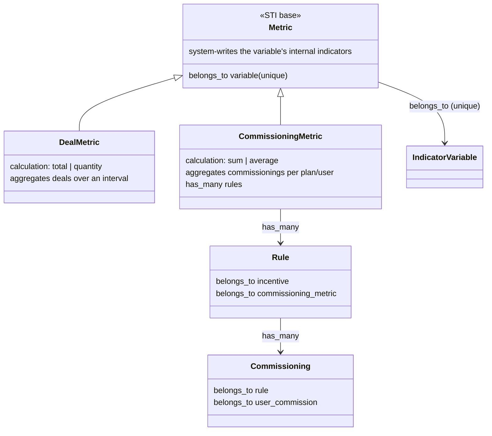

# DOMAIN — Commissioning-result variables (metric specialization)

Domain model for the feature currently tracked as "output variables". It supersedes the earlier
"new `OutputVariable` STI type" shape: there is **no new variable type**. A variable whose value the
system produces from commission results is an ordinary `IndicatorVariable` that carries a specialized
`Metric`.

## Core decision

The distinguishing trait of these variables is **who writes them**, not what they are. A variable the
user cannot register — because the system computes its value — is already modeled today: an
`IndicatorVariable` that has a `Metric` (`variable.rb:33` `has_one :metric`). When a variable has a
metric, all its indicators are internal/system-generated — enforced by `Metric#indicators_existence`
(`metric.rb:100-105`, the variable must have no external indicator) and sealed on the read side by
`Indicator#internal_variable` (`indicator.rb:116-122`, internal indicator ⟺ variable has a metric).

So the feature is a **specialization of `Metric`**, not a new variable type. The `Metric` becomes an
STI base with two subtypes distinguished by the source of the value:

- `DealMetric` — the current behavior: aggregates **deals** over an interval (`Metric#calculate` →
  `TotalAdapter`/`QuantityAdapter`, `metric.rb:56-83`).
- `CommissioningMetric` — new: aggregates **commissionings** within a plan.

Both produce the variable's internal `Indicator` per user. Same domain, two sources.

## CommissioningMetric

- `belongs_to :variable` — an `IndicatorVariable`, numeric (base validation `variable_type`,
  `metric.rb:93-95`). The `variable_id` unique index (`schema.rb:1102`) already guarantees a variable
  has at most one metric of any subtype, so a variable can never be both deal- and commissioning-fed.
  No new constraint needed.
- `has_many :rules` — the rules whose results feed this metric.
- `calculation` — `sum | average`, declared on the subtype over the existing integer `calculation`
  column (`schema.rb:1079`; base `DealMetric` uses `total | quantity`, `metric.rb:41`). No migration
  for the column; each subtype declares its own `enumerize`.

### The aggregation

Within a plan, per user, the metric sums or averages the **commissionings** of its linked rules and
writes the result as the user's internal `Indicator` for the variable. A commissioning is the
computed result of one rule for one user: `Commissioning belongs_to :rule` (`commissioning.rb:8`),
`belongs_to :user_commission` (`commissioning.rb:9`); a rule has many (`rule.rb:20`).

Motivating case: an indicator incentive with several parallel bands (rules) all feed one metric; the
user is paid the **average** of the band results. A later incentive stage reads the metric's variable
— a single already-computed value — instead of the raw bands.

The aggregation is **per plan, not over time** — this is the axis that separates it from `DealMetric`,
which aggregates over a date interval.

## Rule link

The rule points at the metric, not at the variable:

- Today: `Rule belongs_to :output_variable, class_name: 'Variable'` (`rule.rb:18`), validated by
  `output_variable_type` requiring `output?` (`rule.rb:90-94`).
- Target: `Rule belongs_to :commissioning_metric`. The `output_variable_type` validation is removed —
  the metric already guarantees the variable is correct (indicator, numeric, no external indicator).

This link is the "one more column" on the incentive create/update screen: `rules.commissioning_metric_id`.
The rule already `belongs_to :incentive` (`rule.rb:17`) and is STI by incentive type (`rule.rb:15`),
so a rule contributing its result to a metric fits the existing shape.

## Variable availability by incentive type

A variable that carries a `CommissioningMetric` is **excluded from the transactional (deal) incentive**
and available in the others, and becomes selectable as a rule's result target. No per-incentive-type
variable-availability filter exists in the models today (the only related scope is the unrelated
`Incentive.for_incentive_document`, `incentive.rb:56`), so this filter is net-new.

## Plan-level validations (one family)

These are the validations the plan-save enforces over commissioning-metric variables. Validation 1 is
enforced; validations 2 and 3 are not yet implemented.

1. **Producer must precede consumer.** An incentive that reads a commissioning-metric variable as
   input requires an earlier-stage incentive whose rule feeds that variable's metric. Stage order:
   deal → indicator → ranking → limiter → redemption. `Incentivation#commissioning_metric`
   dispatches per incentive type to `Incentivation::<Type>IncentivationMetricValidator`, which adds the
   `metric_not_populated` error on the `Incentivation`'s `:incentive_id`.

2. **Single writer type per variable (the sibling rule).** All incentives that **write** a
   commissioning-metric variable — i.e. whose rules feed that variable's metric — must be of one
   incentive type. Many incentives of that one type may all write to it (their commissionings
   aggregate through the metric, sum/average); an incentive of any second type may not. **Reading**
   the variable downstream is subject to validations 1 and 3. This keeps the variable written
   at a single calculation stage, so it holds one value per plan; writers of two different types would
   write it at two different stages and give it two values, impossible to present coherently. The
   error is added on the `Incentivation` at plan save.

3. **Single reading level per variable (proposed 2026-09-01).** A commissioning-metric variable may be
   read at a single calculation stage only — an incentive that reads one forbids any incentive at a
   different stage from reading the same variable. This is a comprehensibility and legal-clarity
   constraint, not a correctness one: validation 2 already fixes a single writer stage, so the variable
   holds one stable sum and every downstream read sees the same number regardless of how many stages read
   it — the value a third stage reads is exactly the value the second stage read. What multi-stage reading
   costs is legibility: a variable consumed across several stages turns the rule graph into a web the end
   user cannot follow, which is what forfeits the signed declaration's legal validity. Restricting a
   metric variable to one reading stage keeps the graph a line — fed at one stage, summed, read at one
   stage. The error is added on the `Incentivation` at plan save.

Validations 1, 2 and 3 compose: 2 fixes a single writer stage (one stable value), 1 requires that writer
stage to precede every reader, and 3 confines reading to a single stage so the dependency graph stays a
legible line rather than a web.

## Migrations

- **`metrics.type`** — add the STI discriminator (absent today, `schema.rb:1078-1103`) and backfill
  every existing row to `DealMetric` (all current metrics are deal-based). Non-null after backfill.
  The deal-shaped `metrics_uniqueness` index (`schema.rb:1095`, built on `calculation`/interval
  columns) becomes `DealMetric`'s concern; `CommissioningMetric` uniqueness is the existing unique
  `variable_id`.
- **`rules.output_variable_id` → `rules.commissioning_metric_id`** — the rule's target moves from the
  variable to the metric. Clean, because the feature is unlaunched (no production rows).

## Naming

`<Concept>Metric` mirrors the existing `<Concept>Variable` STI convention (`DealVariable`,
`IndicatorVariable`). "Commissioning" matches the existing `commissioning/` namespace and the
`Commissioning` model. The i18n error key is `metric_not_populated` on the incentivation's
`:incentive_id`, describing the variable that no earlier incentive populates rather than a missing
"output" concept.

## Remaining work

- **Validation 2 — single writer type per variable** (the sibling rule in Plan-level validations
  above). Not yet implemented.
- **Validation 3 — single reading level per variable** (comprehensibility / legal-clarity constraint,
  Plan-level validations above). Not yet implemented.
- **Variable availability by incentive type** — the transactional-exclusion filter (see the section
  above). Where it lives (a new availability filter vs the API/GraphQL layer) is still open.
