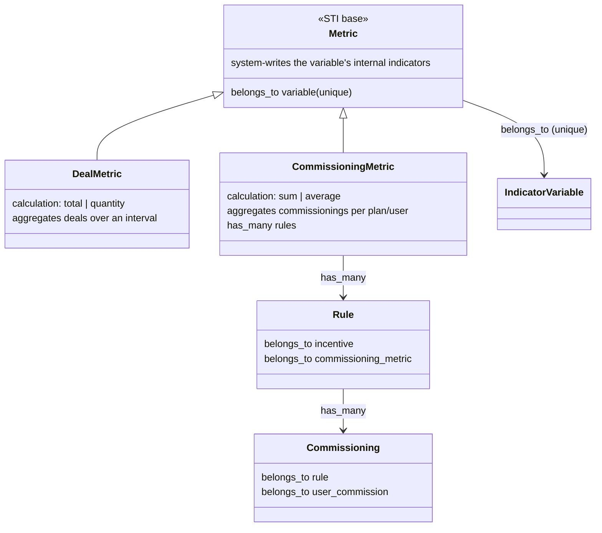

# DOMAIN — Commissioning-result variables (metric specialization)

Domain model for the feature currently tracked as "output variables". It supersedes the earlier
"new `OutputVariable` STI type" shape: there is **no new variable type**. A variable whose value the
system produces from commission results is an ordinary `IndicatorVariable` that carries a specialized
`Metric`.

## Core decision

The distinguishing trait of these variables is **who writes them**, not what they are. A variable the
user cannot register — because the system computes its value — is already modeled today: an
`IndicatorVariable` that has a `Metric` (`variable.rb:33` `has_one :metric`). When a variable has a
metric, all its indicators are internal/system-generated — enforced by `Metric#indicators_existence`
(`metric.rb:100-105`, the variable must have no external indicator) and sealed on the read side by
`Indicator#internal_variable` (`indicator.rb:116-122`, internal indicator ⟺ variable has a metric).

So the feature is a **specialization of `Metric`**, not a new variable type. The `Metric` becomes an
STI base with two subtypes distinguished by the source of the value:

- `DealMetric` — the current behavior: aggregates **deals** over an interval (`Metric#calculate` →
  `TotalAdapter`/`QuantityAdapter`, `metric.rb:56-83`).
- `CommissioningMetric` — new: aggregates **commissionings** within a plan.

Both produce the variable's internal `Indicator` per user. Same domain, two sources.

## CommissioningMetric

- `belongs_to :variable` — an `IndicatorVariable`, numeric (base validation `variable_type`,
  `metric.rb:93-95`). The `variable_id` unique index (`schema.rb:1102`) already guarantees a variable
  has at most one metric of any subtype, so a variable can never be both deal- and commissioning-fed.
  No new constraint needed.
- `has_many :rules` — the rules whose results feed this metric.
- `calculation` — `sum | average`, declared on the subtype over the existing integer `calculation`
  column (`schema.rb:1079`; base `DealMetric` uses `total | quantity`, `metric.rb:41`). No migration
  for the column; each subtype declares its own `enumerize`.

### The aggregation

Within a plan, per user, the metric sums or averages the **commissionings** of its linked rules and
writes the result as the user's internal `Indicator` for the variable. A commissioning is the
computed result of one rule for one user: `Commissioning belongs_to :rule` (`commissioning.rb:8`),
`belongs_to :user_commission` (`commissioning.rb:9`); a rule has many (`rule.rb:20`).

Motivating case: an indicator incentive with several parallel bands (rules) all feed one metric; the
user is paid the **average** of the band results. A later incentive stage reads the metric's variable
— a single already-computed value — instead of the raw bands.

The aggregation is **per plan, not over time** — this is the axis that separates it from `DealMetric`,
which aggregates over a date interval.

## Rule link

The rule points at the metric, not at the variable:

- Today: `Rule belongs_to :output_variable, class_name: 'Variable'` (`rule.rb:18`), validated by
  `output_variable_type` requiring `output?` (`rule.rb:90-94`).
- Target: `Rule belongs_to :commissioning_metric`. The `output_variable_type` validation is removed —
  the metric already guarantees the variable is correct (indicator, numeric, no external indicator).

This link is the "one more column" on the incentive create/update screen: `rules.commissioning_metric_id`.
The rule already `belongs_to :incentive` (`rule.rb:17`) and is STI by incentive type (`rule.rb:15`),
so a rule contributing its result to a metric fits the existing shape.

## Variable availability by incentive type

A variable that carries a `CommissioningMetric` is **excluded from the transactional (deal) incentive**
and available in the others, and becomes selectable as a rule's result target. No per-incentive-type
variable-availability filter exists in the models today (the only related scope is the unrelated
`Incentive.for_incentive_document`, `incentive.rb:56`), so this filter is net-new.

## Plan-level validations (one family)

These are the validations the plan-save enforces over commissioning-metric variables, both implemented.
Each incentivation validates its own incentive, so the error lands on that incentivation's `:incentive_id`
and reaches the plan through nested-attribute autosave exactly like every other incentivation error — no
plan-level marker. The domain object `Plan::IncentiveCommissioningMetricMapping`
(`plan/incentive_commissioning_metric_mapping.rb`) holds the reads and feeds of the plan's
commissioning-metric variables; `Plan#incentive_commissioning_metric_mapping` builds a fresh instance in a
`before_validation` (`plan.rb:146,148`). It exposes `rows`, keyed by `incentive_id`, each row carrying
`{ type, consumed_metric_ids, produced_metric_ids }`. The `Incentivation::PROCESSING_ORDER` constant lists
the incentive types in stage order, and the producers that satisfy validation 1 for a consumer are the types
strictly before it (`PROCESSING_ORDER.take(PROCESSING_ORDER.index(incentive.type))`).

1. **Producer must precede consumer.** An incentive that consumes a commissioning-metric variable requires
   that the variable's metric was fed by a rule on an incentive of an earlier stage. The allowed producers
   per consumer type: `IndicatorIncentive` ← deal; `RankingIncentive` ← deal, indicator; `LimiterIncentive`
   ← deal, indicator, ranking; `RedemptionIncentive` ← deal, indicator, ranking, limiter. Any number of
   incentive types may produce the same metric — the metric aggregates them all — so precedence only requires
   that each consumed metric has at least one earlier-stage producer. `commissioning_metric_precedence` adds
   `:missing_producing_incentive` on the consumer's own `:incentive_id` when a consumed metric has no
   earlier-stage producer. A deal consumes no commissioning-metric variable — it is the first stage — and is
   exempt.

2. **Single consumer type per variable.** A commissioning-metric variable may be consumed by incentives of a
   single type only — an incentive that consumes one forbids any incentive of a different type from consuming
   the same variable (many incentives of that one type may all consume it). Production is deliberately
   unconstrained: any number of incentive types may feed a metric, and the metric aggregates (sum/average)
   them into a single value, so every consumer reads the same number regardless of how many types produced it.
   The constraint is on the read side and is a comprehensibility and legal-clarity one: a variable consumed by
   several types turns the rule graph into a web the end user cannot follow, which forfeits the signed
   declaration's legal validity. Confining a metric variable to one consumer type keeps the graph a legible
   line. `commissioning_metric_consumption` adds `:multiple_consuming_incentive_types` on the consumer's own
   `:incentive_id` when the variable it consumes is consumed by more than one incentive type.

The two compose: precedence guarantees every consumed value was written by an earlier stage before it is
read, and single-consumer-type confines reading to one type so the dependency graph stays a legible line
rather than a web.

## Migrations

- **`metrics.type`** — add the STI discriminator (absent today, `schema.rb:1078-1103`) and backfill
  every existing row to `DealMetric` (all current metrics are deal-based). Non-null after backfill.
  The deal-shaped `metrics_uniqueness` index (`schema.rb:1095`, built on `calculation`/interval
  columns) becomes `DealMetric`'s concern; `CommissioningMetric` uniqueness is the existing unique
  `variable_id`.
- **`rules.output_variable_id` → `rules.commissioning_metric_id`** — the rule's target moves from the
  variable to the metric. Clean, because the feature is unlaunched (no production rows).

## Naming

`<Concept>Metric` mirrors the existing `<Concept>Variable` STI convention (`DealVariable`,
`IndicatorVariable`). "Commissioning" matches the existing `commissioning/` namespace and the
`Commissioning` model. Validation 1's i18n error key is `missing_producing_incentive` on the offending
incentivation's `:incentive_id`, naming that no earlier incentive produces the metric it consumes.
Validation 2's key is `multiple_consuming_incentive_types` on the same attribute, naming that more than one
incentive type consumes the variable.

## Remaining work

- **Variable availability by incentive type** — the transactional-exclusion filter (see the section
  above). Where it lives (a new availability filter vs the API/GraphQL layer) is still open.
