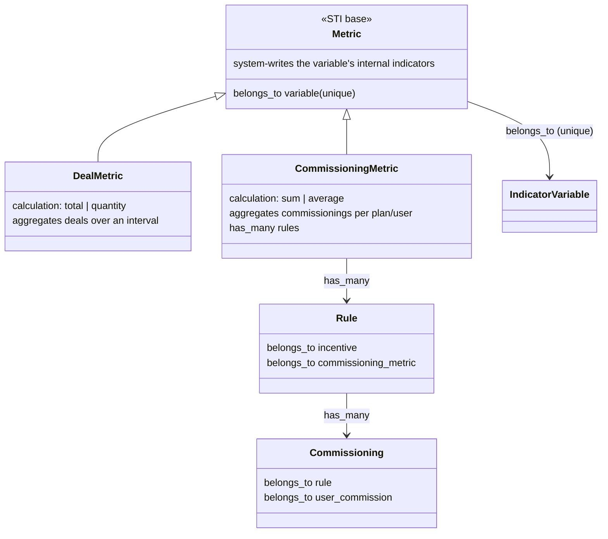
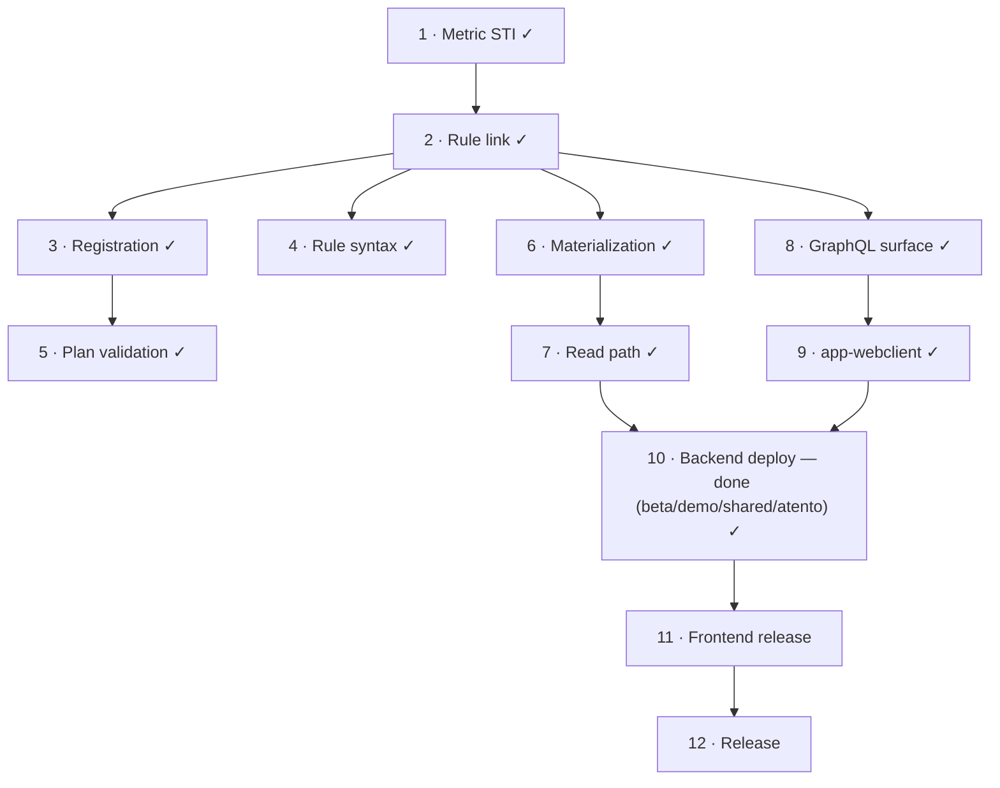

# PLAN — Commissioning-metric variables in `app`

> This is the single authoritative plan for the commissioning-metric feature — the whole picture (what was
> done, where it stands, what remains, and the decisions to implement) lives here. Background research is
> referenced under § Related and excluded documents; where any of it conflicts with this plan, this plan
> governs.
> Repository: `~/Projects/4Shark/app` (backend) and `~/Projects/4Shark/app-webclient` (frontend),
> branch `develop`.
> Language classification: internal engineering doc → English (`LANGUAGE-POLICY.md`, category 1).

## Objective

A variable whose value the system produces from commission results — not from the integration — is an
ordinary `IndicatorVariable` that carries a `CommissioningMetric`. A `CommissioningMetric` links to a set
of `Rule`s; within a plan, per user, it aggregates (sum or average) the commissionings those rules
produced and writes the result as that user's internal `Indicator` for the variable. A later incentive
stage then reads that already-computed value by the variable's key, instead of the raw per-rule bands.

The feature is therefore a **specialization of `Metric`**, not a new variable type: `Metric` is an STI
base with `DealMetric` (aggregates deals over an interval — the pre-existing behaviour) and
`CommissioningMetric` (aggregates commissionings per plan/user — this feature). Both write the variable's
internal `Indicator`; they differ only in the source of the value.

At plan save, two validations hold over commissioning-metric variables: an incentive that **consumes** one
requires an earlier-stage incentive whose rule **feeds** its metric (validation 1); and a variable is
consumed by incentives of a single type only (validation 2). Any number of incentive types may feed one
metric — it aggregates them into a single value, so there is no single-writer-type constraint. Stage order:
deal → indicator → ranking → limiter → redemption.

## Status

The full feature build is merged to `develop` and running on `beta-001`, where the business is testing it —
metric authoring and the metric-visualization screen are both confirmed working. The backend model, both
plan validations, the stage-boundary rules, the GraphQL authoring binding, **and the calculation
(materialization + read path)** are all merged; the `app-webclient` authoring surface and the declaration
screens are live in beta. The platform now computes with commissioning metrics: a `CommissioningMetric`
aggregates its rules' commissionings per user commission, writes the variable's internal `Indicator`, and
delivers the value to the consuming rule through the `user_commissions.metric_options` column.

**Delivered, merged to `develop`:**

| PR | Delivered |
|----|-----------|
| #5348 | Register the produced variable on incentive save and roll it into the plan — superseded by the metric pivot |
| #5431 | `Metric` STI base — `DealMetric` / `CommissioningMetric` (the `metrics.type` discriminator) |
| #5433 | Rule target moves `rules.output_variable_id` → `rules.commissioning_metric_id`; the output-variable type removed |
| #5434 | Validation 1 — a consumer requires an earlier-stage feeder (four per-type validators) |
| #5436 | Validation 1 consolidated against `Plan::IncentiveCommissioningMetricMapping`; validation 2 — a single consumer incentive type per variable |
| #5441 | Stage-boundary rules — a redemption rule cannot feed a metric; a deal incentive excludes metric variables from consumption |
| #5442 | GraphQL authoring surface — the `commissioning_metric` binding on the rule mutations/types, the clone round-trip, `MetricGraphqlType.type` |
| #5453 | `type` filter on the `metrics` query — the front distinguishes a `CommissioningMetric` server-side (the item Phase 8 had deferred) |
| #5454 | Incentivation errors identified by reference (per-incentive error surface) |
| #5455 | Incentive search exclusion filter |
| #5456 | Materialization + read path — `CommissioningMetric#calculate`, the four boundary Producer/Consumer stages, the `user_commissions.metric_options` column, the sliced read injection, and the deal-metrification stage scoped off commissioning metrics (Phases 6–7) |
| #5457 | Metric visualization — `MetricGraphqlType` resolves the deal-only associations (`client`/`product`/`status`) as null on a `CommissioningMetric` instead of raising, so the show page renders |

Test-infra fixes #5429 / #5432 landed alongside (spec isolation; STI factory construction) — not feature work.

**Frontend, delivered in beta:** the `app-webclient` authoring surface (the plan form, #6772) and the
declaration display — declaração de regras (#6773) and declaração de resultado (#6774).

**One divergence from the planned read injection (#5456, § Phase 6 step 5 / § Phase 7), recorded so the code
is read for what it is:** the four consuming consumers slice `user_commissions.metric_options` by
`rule.formula.referenced_identifiers` rather than by the metrics the incentive consumes
(`consumed_metric_ids`) — a simpler key source holding the same guarantee, that a stage reads only the metric
keys its own formula names. The plan's step-5 rename of the deal incentive's local `metric_options`
(`deal_incentive/consumer.rb:32`, `period_processor.rb:21`) to `deal_metric_options` was dropped, correctly:
that local holds the metric-backed variables' options sliced from `modifier_options`, so `metric_options` is
the accurate name — deal-stage metric options travel in `modifier_options` (deal metrics are materialized up
front), commissioning-metric options travel in the new column, and both are legitimately metric options,
differing only in source.

**Remaining: frontend release only — the backend release is done.** The `release/3.68.0` backend deploy is
live in all four environments (Phase 10) — beta, demo and both productive stacks (`shared-001`, `atento-001`);
the frontend production release (Phase 11 — the screens are live in beta; production is one Netlify merge)
is what remains. Shipping the backend ahead of the frontend is safe:
the release's GraphQL change is purely additive and the current production frontend references nothing it
removed, so the backend deploy is invisible to the running front (see Phase 10). No new permission is
involved: the feature modifies existing screens, so whoever could already create a metric, an incentive and a
plan can use it (Phase 12). The feature stays inert until the frontend ships — there is no screen to author a
commissioning metric, and `IncentivePolicy#update?` blocks binding one to a plan-attached incentive — so no
existing plan's arithmetic changes.

## Related and excluded documents

This is the single authoritative plan for the commissioning-metric feature and governs wherever a
background document conflicts with it. The research is spread across several documents that predate the
pivot to the `CommissioningMetric` model:

- `spike/incentive-calculated-variables/SPIKE.md` — the origin research (the trigger, the "calculated
  variable" framing, options A–E, the chosen direction in §4).
- `spike/auxvar-migrations`, `spike/auxvar-validation`, `spike/auxvar-materialization`,
  `spike/auxvar-graphql-frontend` — the four aux-variable spikes that fed the earlier phases. They
  predate the pivot and describe the earlier "fourth `OutputVariable` type" approach.

These share commissioning vocabulary but are **different features** — never fold them in here:

- `deal-commissioning-snapshot/` and `spike/commissioning-snapshot-pattern/` — the `CommissionedDeal`
  intermediate entity that caches a deal's calculation-input state; unrelated to commissioning metrics.
- `spike/declaration-expand-before-sign/` — forcing full review before a declaration is signed, a
  declaration-UX and legal-review concern.
- `atento-colombia-vkpi-integration/` — the VKPI Colombia integration (loading apurado values through the
  integrator's Modifier stream); it only names this feature as a roadmap dependency.

## Scope

### In scope

- The `Metric` STI base and its `DealMetric` / `CommissioningMetric` subtypes. **(delivered — #5431)**
- The rule link `Rule belongs_to :commissioning_metric`, replacing the earlier `output_variable` link. **(delivered — #5433)**
- Plan-level validation 1 — a consumer requires an earlier-stage feeder. **(delivered — #5434, consolidated into `Plan::IncentiveCommissioningMetricMapping` #5436)**
- Plan-level validation 2 — a single consumer incentive type per commissioning-metric variable. **(delivered — #5436)**
- Materialization: the `CommissioningMetric` computes its per-user-commission value from the commissionings
  of its linked rules, writes the variable's durable `Indicator`, and injects the value into the new
  `user_commissions.metric_options` column. **(delivered — #5456)**
- The read path that delivers the materialized value to a consuming rule — the four consuming consumers merge
  a slice of `metric_options` into the formula options. **(delivered — #5456)**
- Variable availability by incentive type — a commissioning-metric variable is excluded from the deal
  (transactional) incentive and selectable as a rule's feeding target elsewhere. **(delivered — the deal-incentive workers exclude commissioning-metric variables from consumption (#5441), and the transactional incentive's rule-formula picker is scoped to `DealMetric` so the variable is never offered there)**
- GraphQL authoring surface — expose the `commissioning_metric` binding on the rule create/update
  mutations and types, and close the clone gap. **(delivered)**
- No new permission. The feature modifies the existing metric, incentive and plan screens rather than adding
  any, so it rides the permissions those screens already require — a commissioning metric is another metric
  type on the same screen. There is no `Action` row and no permission-based release toggle.
- The `app-webclient` authoring surface: the commissioning-metric control on a rule, its replication
  across an incentive's rules, and the plan-side compatible-incentive picker. **(delivered — live in beta; plan form #6772)**
- **The statement display.** Three marks the engineer named: the commissioning-metric variable appears
  in the upper variable listing carrying its composed value; every commissioning that fed a metric is
  marked with which variable it fed; every commissioning whose rule reads a metric-fed variable is marked
  as having been calculated on one. **(delivered — declaração de regras #6773, declaração de resultado #6774; the value the display shows is correct once materialization lands)**
- Test strategy, data migration, rollout sequence, execution order.

### Out of scope

- The incentive CSV bulk import of the binding. `IncentiveDocument::Processor` builds rules from
  positional CSV columns (`app/workers/incentive_document/processor.rb:81-86`, `row[0]` for value and
  `row[1]` for description); adding the binding changes a customer-facing template format. Documented as a
  limitation instead.

---

## Domain model

The distinguishing trait of these variables is **who writes them**, not what they are. An `IndicatorVariable`
that has a `Metric` (`variable.rb:33` `has_one :metric`) already has all its indicators system-generated —
enforced by `Metric#indicators_existence` (`metric.rb:100-105`, the variable must carry no external indicator)
and sealed on the read side by `Indicator#internal_variable` (`indicator.rb:116-122`, internal indicator ⟺
variable has a metric). So the feature is a specialization of `Metric`, not a new variable type.

- `CommissioningMetric belongs_to :variable` (numeric `IndicatorVariable`, base validation `variable_type`
  `metric.rb:93-95`); the `variable_id` unique index (`schema.rb:1102`) already guarantees a variable has at
  most one metric of any subtype, so it can never be both deal- and commissioning-fed — no new constraint.
- `has_many :rules` — the rules whose commissionings feed it. `calculation` is `sum | average`, declared on
  the subtype over the existing integer `calculation` column (`schema.rb:1079`); `DealMetric` uses
  `total | quantity`. No column migration.
- A `Commissioning` is one rule's computed result for one user: `belongs_to :rule` (`commissioning.rb:8`),
  `belongs_to :user_commission` (`commissioning.rb:9`); a rule `has_many` (`rule.rb:20`). The aggregation is
  **per plan, not over time** — the axis that separates it from `DealMetric`.
- The two plan validations live on `Incentivation` (`commissioning_metric_precedence`,
  `commissioning_metric_consumption`), each reading `Plan::IncentiveCommissioningMetricMapping#rows`
  (`plan/incentive_commissioning_metric_mapping.rb`, built in a `before_validation` at `plan.rb:146,148`),
  keyed by `incentive_id`, each row `{ type, consumed_metric_ids, produced_metric_ids }`.
  `Incentivation::PROCESSING_ORDER` encodes the stage order; a consumer's allowed producers are the types
  strictly before it (`PROCESSING_ORDER.take(PROCESSING_ORDER.index(incentive.type))`).

## Chosen approach

**Direction:** a `Metric` specialization, executed as a single backend change followed by a single
frontend release. The distinguishing trait of these variables is **who writes them**, not what they are:
a variable the user cannot register because the system computes its value is already modeled today as an
`IndicatorVariable` that has a `Metric` (`variable.rb:30`, `has_one :metric`), and a variable with a metric
already has all its indicators system-generated — enforced by `Metric#indicators_existence`
(`metric.rb:50-55`, the variable must carry no external indicator) and sealed on the read side by
`Indicator#internal_variable` (internal indicator ⟺ variable has a metric).

Concretely:

- **`Metric` is the STI base.** `Metric::TYPES = %w[DealMetric CommissioningMetric]` (`metric.rb:5`),
  `Metric::CALCULATIONS = { total: 0, quantity: 1, sum: 2, average: 3 }` (`metric.rb:4`). The base carries
  `belongs_to :variable` (unique — `index_metrics_on_variable_id`), and the base validations
  `variable_type` (numeric + indicator, `metric.rb:43-48`) and `indicators_existence`
  (`metric.rb:50-55`). Each subtype slices its own calculations and declares its own `enumerize`.
- **`CommissioningMetric < Metric`** (`commissioning_metric.rb`): `CALCULATIONS = sum | average`,
  `has_many :rules` (the rules whose commissionings feed it), and `validates :calculation`.
- **`DealMetric < Metric`** (`deal_metric.rb`): the pre-existing behaviour — `CALCULATIONS = total | quantity`,
  the interval/comparator/date columns, `#calculate` via `TotalAdapter` / `QuantityAdapter`.
- **The rule points at the metric, not at a variable.** `Rule belongs_to :commissioning_metric, optional: true`
  (`rule.rb:17`); `CommissioningMetric has_many :rules, dependent: :nullify` (`commissioning_metric.rb:6`).
  A rule contributing its commissioning to a metric fits the existing STI-by-incentive-type shape
  (`rule.rb:15`), and the metric already guarantees the variable is correct (indicator, numeric, no
  external indicator), so the earlier per-rule `output_variable_type` validation is gone.
- **No fourth variable type.** `Variable::TYPES = %w[DealVariable IndicatorVariable EasyVariable]`
  (`variable.rb:4`) is unchanged; the commissioning-metric variable is an `IndicatorVariable`. The unique
  `variable_id` index on `metrics` already guarantees a variable has at most one metric of any subtype, so
  it can never be both deal- and commissioning-fed — no new constraint.
- **Any stage's rule may feed a metric; reading is constrained to every stage except the deal stage.**
  The deal stage feeds but never reads; it is the exporter an indicator reader depends on, since the
  indicator stage is the first stage that may read and the deal stage is the only stage strictly before it.
- **A single plan-level object, `Plan::IncentiveCommissioningMetricMapping`, builds the per-incentive
  `rows` (`{ type, consumed_metric_ids, produced_metric_ids }`) both validations reason over, and the
  `Incentivation::PROCESSING_ORDER` constant carries the stage order.** Validation 1 rejects a plan whose
  consumer has no feeder in a strictly earlier stage (consumer ← eligible feeder stages: indicator ← deal;
  ranking ← deal, indicator; limiter ← deal, indicator, ranking; redemption ← deal, indicator, ranking,
  limiter). Validation 2 rejects a variable consumed by incentives of more than one type.
- Rollout is one backend deploy per environment, then one frontend release. There is no permission gate and
  no per-account grant — the feature rides the permissions the existing screens already require.

**Rationale (from engineer):** the value is recomputed *"toda vez que criar um commissioning"* — the
engineer specified the write moment; recompute rather than increment follows from Sidekiq being
at-least-once (`SPIKE §4.2b`), which makes `+=` non-idempotent while `value = aggregate(feeding commissionings)`
is idempotent by construction. And the published value carries its sign, because the engineer's worked
example of what the feature must express is *"essa pessoa ganhou R$ 300 nesse incentivo, R$ 200 nesse e
perdeu R$ 100 nesse outro aqui. Resultado final: R$ 400."* — the limiter appears there as −100, and the
arithmetic closes only if the sign travels with the value. **The recompute is triggered at each consuming
stage's boundary and writes the durable `Indicator` plus the `user_commissions.metric_options` read channel**
(see § Materialization).

**Source patterns referenced:**

| Pattern | Where it comes from |
|---|---|
| STI subtype slicing a base's constant + its own `enumerize` | `commissioning_metric.rb`, `deal_metric.rb` over `metric.rb:4` |
| A metric writing a variable's internal indicators | `DealMetric` (the existing deal-based metric path) |
| Plan-level validation reasoning over the incentive set | `Plan#redemption_incentive_requirements` (`app/models/plan.rb`), the structural twin of validation 1 |
| A plan-level domain object the incentivation validators read | `Plan::IncentiveCommissioningMetricMapping#rows`, consumed by `Incentivation#commissioning_metric_precedence` / `#commissioning_metric_consumption` (delivered) |
| Options processor merged last, after `modifier_options` | `Commission::RedemptionOptionsProcessor` / `Commission::LimiterOptionsProcessor` |
| Worker/data access | `~/.claude/docs/DATA-ACCESS.md` — `with_uncached_connection`, IDs not loaded objects, associations navigated per record |

---

## Execution phases

Phases carry a status. **Delivered** phases are merged to `develop` and reconciled to what shipped;
**open** phases are re-planned in the commissioning-metric model and carry the design questions that must
be answered when the phase is picked up. Under the chosen deploy shape all backend phases ship in a single
backend deploy and the frontend in a single release, so the phase boundaries are ordering and review
units, not deploy units.

### Phase 1: The `Metric` STI base and the two subtypes — DELIVERED (#5431)

`metrics.type` STI discriminator added and every existing row backfilled to `DealMetric` (all current
metrics are deal-based). `Metric::TYPES`, `CommissioningMetric` (calc sum/average, `has_many :rules`) and
`DealMetric` (calc total/quantity, the interval columns, `#calculate`) exist. No fourth variable type was
added; `Variable::TYPES` is unchanged. The deal-shaped uniqueness index became `DealMetric`'s concern; a
`CommissioningMetric`'s uniqueness is the existing unique `variable_id`.

### Phase 2: The rule link — DELIVERED (#5433)

`rules.output_variable_id` → `rules.commissioning_metric_id`; `Rule belongs_to :commissioning_metric`
(`rule.rb:17`). The output-variable type and its per-rule `output_variable_type` validation were removed.
Clean, because the feature is unlaunched (no production rows).

### Phase 3: Registration — DELIVERED, then reworked by the pivot (#5348 → #5431/#5433)

The earlier registration (`#5348`, `incentive_output_variables` / `plan_output_variables` entities) was
superseded when the pivot removed the output-variable type. In the commissioning-metric model the
feeding relationship is carried directly by `CommissioningMetric has_many :rules` and `Rule belongs_to
:commissioning_metric` — there is no separate registration entity.

**OPEN — the plan-set comparison.** Validation 1 (delivered) reasons per incentivation over the plan's
incentive set. Any future need to answer "which commissioning-metric variables does this plan feed vs
consume" as a set (for the authoring picker) must be derived from the incentives' rules and their metrics,
not from the removed `plan_output_variables` roll-up. How that set is computed and where it is cached (if at
all) is undecided.

### Phase 4: Rule syntax validation for a metric-fed key — DELIVERED

A consuming rule references the commissioning-metric variable **by its key**, and that variable is an
ordinary `IndicatorVariable`, so its key is already in the indicator read scope that `Rule::Options`
builds — a downstream indicator/ranking/limiter/redemption rule referencing it passes the name-comparison
syntax check (`Rule#syntax`, `rule.rb:98-113`; `Rule#unknown_identifier`, `rule.rb:83-85`). The deal
(formula) stage carries no such key and correctly refuses to read one. The one guarantee that matters — the
transactional (deal) calculation never injects a commissioning-metric variable's value — is the
consumption exclusion delivered in #5441; nothing beyond that is required.

### Phase 5: Plan validation and the stage order — DELIVERED

Both validations live on `Incentivation` as two methods — `commissioning_metric_precedence` and
`commissioning_metric_consumption` — each reading `plan.incentive_commissioning_metric_mapping.rows`. The
mapping object `Plan::IncentiveCommissioningMetricMapping` builds those rows in a `before_validation`
(`plan.rb:146,148`): one row per non-destroyed incentive, keyed by `incentive_id`, carrying
`{ type, consumed_metric_ids, produced_metric_ids }` — `consumed_metric_ids` are the metrics behind the
variables the incentive reads (`IncentiveVariable` → `CommissioningMetric`), `produced_metric_ids` the
metrics its rules feed (`Rule.commissioning_metric_id`). The error lands on `:incentive_id` (the frontend
lists per-`incentive_id` errors after submit). Validation 1 adds `missing_producing_incentive` when a
consumed metric has no producer among the incentives of a strictly-earlier stage; the
`Incentivation::PROCESSING_ORDER` constant encodes the stage order and the allowed producers for a consumer
are `PROCESSING_ORDER.take(PROCESSING_ORDER.index(incentive.type))` (Indicator ← Deal; Ranking ← Deal,
Indicator; Limiter ← Deal, Indicator, Ranking; Redemption ← Deal, Indicator, Ranking, Limiter). Validation
2 adds `multiple_consuming_incentive_types` when a metric variable is consumed by incentives of more than
one type. Production is unconstrained — any number of incentive types may feed a metric, which aggregates
them into one value.

### Phase 6: Materialization — DELIVERED (#5456)

The design below shipped, with one divergence in the read injection (step 5): the consumers slice
`metric_options` by `rule.formula.referenced_identifiers` rather than by `consumed_metric_ids` (same
guarantee). The step-5 rename of the deal incentive's local `metric_options` to `deal_metric_options` was
dropped, correctly — that local holds the metric-backed variables' options sliced from `modifier_options`
(deal metrics), so `metric_options` is the accurate name. The stage was built as four boundary
Producer/Consumer pairs (`app/workers/commissioning_metric/{indicator,ranking,limiter,redemption}_{producer,consumer}.rb`),
one per consuming stage, rather than one reused stage with four insertions — the finalizer role folds into
each boundary's consumer.

**Objective:** a `CommissioningMetric`, within a plan and per user commission, computes its value from the
commissionings of its linked rules, writes the user's internal `Indicator` for the variable (the durable
store) and injects the value into a dedicated `metric_options` column on `user_commission` (the read
channel), carrying the sign the value has for the person.

**Why a dedicated read channel and not the existing indicator path.** Every consuming rule reads a
variable's value from `user_commission.modifier_options` (`app/workers/{indicator,ranking,limiter,redemption}_incentive/consumer.rb`),
a per-user-commission cache built **once** by `Commission::IndicatorOptionsProcessor`
(`app/services/commission/indicator_options_processor.rb:45,51` — from the cache-backed
`AggregatedIndicator.get`) just before `DealIncentive::Producer`, and never rebuilt by the later stages. A
commissioning metric is **fed back**: it consumes commissionings produced earlier in the same chain, so it
cannot be computed up front and cannot sit in that frozen cache. The value therefore travels in a new column
populated at the boundary and merged into the formula options alongside `modifier_options`. The column is
kept separate from `modifier_options` on purpose — one column is modifiers, one is metrics, so a log makes
the two legible at a glance.

**Why both writes — the Indicator AND `metric_options`.** They serve two different readers and neither is
redundant. The **`Indicator`** exists so the person sees the computed value in their own indicator listing —
a metric variable is an ordinary `IndicatorVariable`, and its listing shows the value the metric produced.
The **`metric_options`** is a point-in-time snapshot of that value at the moment of the calculation: the
indicator can change after the commission runs (it read 20% at calc time, the day closes at 100%), and the
commission must reflect the 20% that was true when it computed. This is exactly the role `modifier_options`
already plays — a cache that freezes the consumed values so a later change never rewrites a settled
commission. The injected code stays deliberately dumb: it reads already-computed values and injects them,
which is also an audit property (nothing is transformed at read time), the only addition being the slice.

**The design (settled):**

- **Four identical flows, one per boundary, look-ahead by consumption.** A materialization flow sits before
  each consuming stage — before indicator, ranking, limiter, redemption. Each looks at the stage it precedes
  and reads which commissioning-metric variables that stage consumes from
  `Plan::IncentiveCommissioningMetricMapping` (filter `rows` by the next stage's `type`, flat-map
  `consumed_metric_ids`). None → skip, fire the next stage's Producer directly. One or more → materialize
  those metrics, then fire the next Producer. Validation 1 makes the boundary correct: every producer of a
  consumed metric sits in a strictly-earlier stage, so at the boundary every feeding commissioning exists.
- **A Producer/Consumer stage inside the `Computation` chain.** The Producer fans out one Consumer per user
  commission (× consumed metric), registers `queue`/`executions`, and the stage closes before the next
  stage's Producer fires. One Consumer per `user_commission` row is the single writer of that row's
  `metric_options` and of the user's `Indicator`, and the feeding commissionings are quiescent at the
  boundary — no lock, no re-read. The only residual concurrency case is two plans in parallel consuming the
  same variable (§ Assumptions), which this single-plan stage does not address.
- **The aggregate.** Per user commission, over the commissionings of the metric's `has_many :rules`
  (`Commissioning.where(rule_id: metric.rules, user_commission_id: ...)`), reduced by `calculation`: `sum`,
  or `average` dividing by the count of feeding commissionings. The per-commissioning value is the signed,
  type-agnostic `money + points`: `Commissioning#money` / `#points` (`commissioning.rb:60-70`) each return
  `value` for the incentive's own type and `0` for the other, and `LimiterCommissioning`
  (`limiter_commissioning.rb`) overrides both to `value * -1`, so the sum is `+value` for every stage and
  `-value` for limiter — never the raw `value` column. Recompute, never `+=`.
- **Default on empty — the reprocess guarantee.** The Producer enumerates every user commission in the
  plan's scope, not only those with feeding commissionings. A user with none gets the metric's key written to
  the variable/metric default in `metric_options` (and the `Indicator` to the same default). Every run
  rewrites the key, so a reprocess leaves no stale value.
- **Store + read channel.** Two writes per (user commission, metric): the durable `Indicator` in `indicators`
  (what dashboards and statements read), and the `{ variable.key => value }` pair **merged** into
  `user_commission.metric_options` — additive, never a whole-hash overwrite. Because validation 2 forbids a
  variable being consumed by more than one incentive type, no two boundaries ever write the same key, so the
  merges across boundaries only add keys and never collide.

**Execution order (the code, in sequence):**

1. **The column.** A migration adds `metric_options` (jsonb, `null: false, default: {}`) to `user_commissions`,
   generated with `bin/rails generate migration` (never hand-created), then `db:migrate` to refresh
   `schema.rb`. Sibling: the existing `modifier_options` column on the same table.
2. **The aggregation.** `CommissioningMetric#calculate(user_commission:)` returns the signed `money + points`
   sum/average of the metric's rules' commissionings for that user commission, and the variable/metric
   default when there are none. The data source is commissionings, not deals — the adapter *structure* is the
   sibling (`deal_metric.rb:30`, `app/adapters/metric/{total,quantity}_adapter.rb`), the query is new.
3. **The stage.** `CommissioningMetric::Producer` / `::Consumer` / `::Finalizer`: the Producer fans out one
   Consumer per user commission (× consumed metric) and registers `Computation`; the Consumer computes step 2,
   writes the `Indicator` (near-copy of `Metric::Consumer:39-63` — `find_or_initialize_by(company_id:,
   compiled_at:, user_id:, variable_id:)`, `compiled_at` the period start since the metric is per-plan, not
   per-interval), and merges the key into that user commission's `metric_options`; the Finalizer fires the
   next stage's Producer. Sibling: `app/workers/metric/{producer,consumer}.rb`. Named for the topology, never
   `Executor`/`Runner` (`DATA-PROCESSING.md`).
4. **The chain insertion.** Each boundary is a single call site: the previous stage's `Finalizer` fires the
   next stage's `Producer`. The four (`app/workers/*/finalizer.rb:22`): before indicator →
   `DealIncentive::Finalizer` (`IndicatorIncentive::Producer`); before ranking → `IndicatorIncentive::Finalizer`
   (`Ranking::Producer`); before limiter → `RankingIncentive::Finalizer`
   (`UserCommission::LimiterOptionsProducer`); before redemption → `LimiterIncentive::Finalizer`
   (`RedemptionIncentive::Producer`). At each, read the mapping for the next stage; skip (fire the next
   Producer directly) when none; otherwise run the materialization stage and have its Finalizer fire the
   original next Producer. Identical at all four; the only variance is which Producer to fire.
5. **The read injection — sliced to the incentive's own metric keys.** `metric_options` accumulates every
   boundary's keys, so a consumer must inject only the metric variables *its own incentive* consumes, never
   the whole hash — otherwise a ranker's formula would be handed the indicator stage's metric variable, which
   only the indicator stage may use. Each of the four consuming consumers slices:
   `metric_options.slice(*consumed_keys)`, where `consumed_keys` are the variable keys of the metrics that
   incentive consumes (`rows[incentive_id][:consumed_metric_ids]` → `CommissioningMetric.joins(:variable).pluck(:key)`).
   This is the exact pattern the deal incentive already runs against `modifier_options`
   (`deal_incentive/consumer.rb:30-33`, #5441 — `select { |key| variables_keys.include?(key) }`), applied to
   the metric column. The slice makes the code correct by construction rather than leaning on validation 2
   alone. `Commission::IndicatorOptionsProcessor` also excludes commissioning-metric variables from the
   `modifier_options` it builds, so a metric key lives only in `metric_options` and the two columns stay
   disjoint and legible in a log. The transactional incentive's local `metric_options`
   (`deal_incentive/consumer.rb:31`, `period_processor.rb:21`) holds the deal-metric values sliced out of
   `modifier_options` — a different concept — so it is renamed `deal_metric_options`, leaving the plain
   `metric_options` name for the commissioning-metric column.
6. **Scope the deal-metric flow to `DealMetric`.** `plan.metrics` is `Metric.where(variable_id: ...)`
   (`plan.rb:372`) — every STI type, `CommissioningMetric` included. The deal-metrification stage
   (`Metric::Producer:18` / `Metric::Sower:18`, triggered from the deal stage) plucks `plan.metrics` and its
   `Metric::Consumer:36` calls `metric.calculate` — undefined on `CommissioningMetric`. So a plan carrying a
   commissioning metric breaks that stage today. Scope the deal-metrification producer/sower to `DealMetric`
   (the same `type` filter #5441 applied to deal consumption).
7. **The tests** (`TESTING-PHILOSOPHY.md`): the aggregate (sum and average, signed, the 300 + 200 − 100 = 400
   example); default-on-empty; skip-when-none produces a byte-identical chain and options; a metric consumed
   at a later stage (ranking/limiter/redemption) reaches its consuming rule through `metric_options`;
   additive merge across two boundaries never drops a key; idempotency; the deal-metrification stage ignores
   commissioning metrics.

**Acceptance criteria:**

- Several rules feeding one metric, across incentives of any types, produce the expected aggregate per user.
- The engineer's worked example closes: 300 + 200 − 100 = 400.
- A commissioning metric consumed at any of the four stages reaches its consuming rule — the value read by
  the formula equals the materialized value, not the variable default.
- A user with no feeding commissioning reads the variable/metric default; a reprocess overwrites cleanly.
- A metric consumed before ranking and a different metric consumed before limiter both end up in
  `metric_options` (additive, no key lost).
- Idempotent under retry.

### Phase 7: Read path — DELIVERED (#5456)

**Objective:** the materialized value reaches every consuming rule.

The value travels in the new `user_commission.metric_options` column, written at the boundary (Phase 6,
steps 1/3) and injected into the formula options next to `modifier_options` in the four consuming consumers.
Each consumer injects a **slice** of `metric_options` — only the variable keys the executing incentive
consumes (`metric_options.slice(*consumed_keys)`) — so a stage never receives another stage's metric
variable, mirroring the slice the deal incentive already runs against `modifier_options`
(`deal_incentive/consumer.rb:30-33`). This is the read-path code the once-built `modifier_options` cache made
necessary — a commissioning metric is fed back mid-chain and cannot sit in a cache frozen before the deal
stage. `modifier_options` stays purely modifiers and `metric_options` purely metrics, so the two are legible
in a log; the slice keeps the injection correct by construction rather than leaning on validation 2 alone.
Phase 7 is therefore not free of code; it is Phase 6's steps 1 and 5 plus the read half of 3.

### Phase 8: GraphQL surface — DELIVERED (#5442)

**Objective:** the authoring surface exists on the API. No permission gates the feature — it modifies
existing metric/incentive/plan screens rather than adding any, so it rides the permissions those screens
already require (a commissioning metric is another metric type). There is no `Action` row and no
permission-based release toggle.

**Delivered (#5442):** the `commissioning_metric` (`MetricGraphqlType`) and `commissioning_metric_id` (`ID`)
read fields on `RuleGraphqlType`; a `commissioning_metric_id` argument (`required: false`) on
`RuleInputGraphqlType`; that argument in the `rules:` permit of both incentive mutations
(`create_incentive_graphql_mutation.rb`, `update_incentive_graphql_mutation.rb`), so a clone through
`CreateIncentiveGraphqlMutation` keeps its binding (asserted by a request spec); and `MetricGraphqlType.type`
exposing the STI discriminator so the front tells a `CommissioningMetric` from a `DealMetric`. Creating a
`CommissioningMetric` needs no new mutation — `CreateMetricGraphqlMutation` already permits `type` +
`calculation`.

**The `type` filter on `MetricGraphqlResolver` is delivered (#5453)** — the front distinguishes a
`CommissioningMetric` server-side. The one item that stays deferred to the frontend surface (Phase 9) is a
field on `IncentiveGraphqlType` distinguishing the metric variables an incentive feeds vs reads (its shape
is a frontend-contract decision the picker query fixes).

### Phase 9: `app-webclient` — DELIVERED

**Objective:** an operator can bind a commissioning metric on a rule, replicate it across the rules of an
incentive, and pick compatible incentives when building a plan.

The authoring surface is live in beta: the binding control on a rule and its clone flows, the replicate
action across an incentive's rules, and the plan-side picker, alongside the plan form (#6772). The
declaration display ships separately — declaração de regras (#6773) shows, per incentive, what it produces
(which faixa computes which metric, into which destination variable) and what it consumes; declaração de
resultado (#6774) shows the metric-generated indicators at the top and, per fulfilled faixa, the produce
line. The values these screens display are correct once materialization (Phase 6) lands.

- **One control in the shared `rule/` module** (`app-webclient/src/app/rule/`), added to the create and
  update form builders, wired into all five incentive modules × three flows (`create/`, `update/`,
  **`clone/`** — the clone flows are the part that must not be missed, per the Phase 8 clone gap).
- **Replicate to all rules** — a form-level action on the rules `FormArray`, at the incentive form level.
- **The plan-side compatible-incentive picker**, reading each candidate's fed vs read metric variables.
  UX, not the guarantee (validation 1 is the guarantee).
- **OPEN — the metric-creation screen.** There is no fourth variable type to offer; creating a
  commissioning-metric variable is creating an `IndicatorVariable` and attaching a `CommissioningMetric`
  (calculation sum/average) whose rules feed it. Whether this is a new screen, an extension of the variable
  screen, or folded into the incentive/rule authoring flow is undecided and depends on the Phase 8 answer.

### Phase 10: Backend deploy — DONE (all four environments)

**Objective:** the backend change is live in all four environments, with the feature reachable by nobody.

**Status: the `release/3.68.0` backend deploy is live in all four environments** — one GitHub Actions run per
environment (dispatched 2026-09-12 ~00:54 UTC), all concluded success:

| Environment | Productive? | Run |
|---|---|---|
| `beta-001` (develop) | no | https://github.com/4shark/app/actions/runs/34663137948 |
| `demo-001` (master) | no | https://github.com/4shark/app/actions/runs/34663144251 |
| `shared-001` (master) | **yes** | https://github.com/4shark/app/actions/runs/34663163217 |
| `atento-001` (master) | **yes** | https://github.com/4shark/app/actions/runs/34663180653 |

The commissioning-metric migration `20260901190105` needed a per-environment reconciliation on the three
`master` stacks before it settled: its automatic `ANALYZE rules` / concurrent-index steps cancelled under the
default 250 ms migration `statement_timeout`, and the interrupted runs left `rules.commissioning_metric_id`
present with an invalid index and an unvalidated foreign key. Landed per stack by raising the timeout to
60000 ms (terraform PR #1159 — `MIGRATION_20260901190105` / `MIGRATION_20260901192053`), dropping the
leftover column, deleting the `20260901190105` row from `schema_migrations`, re-running `db:migrate`, then
`ALTER TABLE rules VALIDATE CONSTRAINT` on the recreated FK. `beta-001` migrated cleanly on the first run and
needed none of this.

- **One deploy per environment**, in progression. `beta-001` builds from `develop` and is where the full
  sequence is validated first — a real incentive feeding a metric, a real plan, a real commission run;
  `demo-001` is the second non-productive gate; then the two productive stacks.

| Environment | Build branch | Command | Productive? |
|---|---|---|---|
| `beta-001` | `develop` | `gh workflow run deploy-beta-001.yaml -R 4shark/app` | no |
| `demo-001` | `master` | `gh workflow run deploy-demo-001.yaml -R 4shark/app` | no |
| `shared-001` | `master` | `gh workflow run deploy-shared-001.yaml -R 4shark/app` | **yes** |
| `atento-001` | `master` | `gh workflow run deploy-atento-001.yaml -R 4shark/app` | **yes** |

- **The productive gate is enforced, not advisory.** `validate-productive-deploy.sh` (PreToolUse) blocks a
  `deploy-shared-001` / `deploy-atento-001` command unless a GO from the queue check is on record for that
  stack within the last 5 minutes. So each productive step is
  `bash ~/.claude/scripts/sidekiq-queue-check.sh --stack <stack>` followed immediately by the deploy, as
  one motion. `beta-001` and `demo-001` are never gated.
- **The migration window.** The `prepare-and-migrate` job builds/pushes the image and runs
  `bin/rails db:migrate`, while the job that activates the new code runs later — between those two points
  the schema is new and every serving container is old. This release carries 10 migrations, all verified safe
  to run in every environment: Postgres is ≥ 16 on all four stacks (beta 18, demo 17, shared/atento 16), so
  the two `add_column`s (`metrics.type`; `user_commissions.metric_options` jsonb `null: false default: {}`)
  are metadata-only even on the 7.5M-row `user_commissions` on `atento-001`; `metrics` is tiny everywhere
  (≤ 429 rows) so the `type` backfill is trivial; the concurrent-index, `NOT VALID` FK, drop-column and
  drop-unused-table migrations are online or metadata-only. The one watch-item is
  `validate_commissioning_metric_foreign_key_on_rules`, which scans `rules` (201k on `shared-001`, 112k on
  `atento-001`): online (`SHARE UPDATE EXCLUSIVE`, does not block traffic) and expected to pass, but if it
  cancels under those stacks' tight `statement_timeout`, raise `MIGRATION_20260901192053` and re-run — safe
  to re-run.
- **Backend-first is contract-compatible with the running frontend.** The release's GraphQL change is purely
  additive (`Rule.commissioning_metric`/`_id`, `Metric.type`, `Plan.errors` + `PlanErrorGraphqlType`, an
  optional `reference` argument on rules/incentivations); nothing was removed or renamed, so an existing
  client that does not ask for the new fields is unaffected. The dropped `rules.output_variable_id` column
  was never a GraphQL field and neither the backend GraphQL surface nor `app-webclient/src` references it. The
  plan mutations moved to `ApplicationMutationV2`, which returns errors-as-data only when the client selects
  the new `errors` field (`lookahead.selects?(:errors)`) — the current front does not select it, so it falls
  through to the identical V1 `raise GraphQL::ExecutionError`. The backend deploy is therefore invisible to
  the current front, which is why it can ship ahead of the Phase 11 frontend release.
- **Rollback is a redeploy of the previous image at every step.** Nothing drops a column, rewrites data, or
  changes an existing cross-service contract, so there is no point of no return; the closest candidate is a
  commission already calculated with metric values, and a reprocess under the old code reproduces the old
  result (a recovery path, though a productive reprocess is not free).

**Dependencies:** Phases 1-8. **Running the deploy is the engineer's** — an action outside version control
that a PR diff neither shows nor reverts. The shape above is decided; the execution and its timing are not.

### Phase 11: Frontend release

**Objective:** the authoring surface is live.

One merge, which fans out into the per-client Netlify builds. `app-webclient` ships via Netlify, one site
per client (whitelabel), NOT GitHub Actions; every site runs the same entry point against the same
repository, so this is one merge fanning out into ~38 builds, not 38 coordinated releases. The frontend
ships last and therefore never faces an old backend.

### Phase 12: Release — no permission gate

The feature modifies existing metric/incentive/plan screens rather than adding any, so there is no new
permission to grant and no per-account rollout: once the backend deploy (Phase 10) and the frontend release
(Phase 11) are live, whoever could already author a metric, an incentive and a plan can use it. The
authoring is inert until materialization (Phase 6) exists — the screens accept the binding, but nothing
computes with it — so there is no dangerous capability to gate behind a toggle. One boundary still holds:
`IncentivePolicy#update?` returns false when `record.plans.any?`, so an incentive already attached to a
plan cannot acquire a binding, and no existing plan's arithmetic changes without a new incentive being
authored and added.

---

## Technical decisions

| Decision | Choice | Rationale / status |
|---|---|---|
| The "output" concept | A `Metric` specialization (`CommissioningMetric` on an `IndicatorVariable`), NOT a fourth variable type | Delivered (#5431/#5433). The distinguishing trait is who writes the variable, which the existing `variable.has_one :metric` already models; a metric variable already has only system-generated indicators |
| The rule link | `Rule belongs_to :commissioning_metric, optional: true` | Delivered (#5433). The metric guarantees the variable is correct (indicator, numeric, no external indicator), so the earlier per-rule `output_variable_type` validation was removed |
| The metric's calculation | `sum \| average`, sliced from `Metric::CALCULATIONS` on the subtype | Delivered. `DealMetric` uses `total \| quantity`; each subtype declares its own `enumerize` over the shared integer `calculation` column |
| Which stages feed and which read | Any stage's rule may feed; every stage except the deal stage may read | Engineer's definition (`DECISION-AUTHORITY.md` ladder, source 1): the deal stage is the only stage that may not read, and any reader needs a feeder in a strictly earlier stage |
| Validation 1 error surface | `missing_producing_incentive` on the incentivation's `:incentive_id` | Delivered (#5434, consolidated into `Plan::IncentiveCommissioningMetricMapping` #5436). The frontend already lists per-`incentive_id` errors after submit, so the error surfaces on the incentive rather than as a generic base error |
| Validation 2 | Single consumer incentive type per commissioning-metric variable (`multiple_consuming_incentive_types`) | Delivered (#5436). A comprehensibility/legal constraint — a variable consumed across incentive types turns the rule graph into a web the signed declaration cannot legibly present |
| Production is unconstrained | Any number of incentive types may feed one metric | Decided (engineer, `DECISION-AUTHORITY.md` ladder, source 1). The metric aggregates (sum/average) every feeding commissioning into one value, so multiple feeder types produce a single coherent number — no single-writer-type validation |
| Materialization trigger + store + read channel | Four identical boundary flows, one before each consuming stage, look-ahead by consumption; a Producer/Consumer stage (one Consumer per user commission) that writes the durable `Indicator` AND merges the metric's key into a new `user_commissions.metric_options` column; recompute never `+=` | **Delivered (#5456, § Phase 6).** The consuming rule reads variable values from `modifier_options`, a cache built once before the deal stage and never rebuilt, so a fed-back metric cannot ride it — the value travels in a dedicated `metric_options` column, populated additively at the boundary and injected into the formula options next to `modifier_options`, **sliced to the keys the executing rule's formula references** (`metric_options.slice(*rule.formula.referenced_identifiers)`) so no stage receives another stage's metric variable. Kept a separate column for log clarity (modifiers vs metrics). Default-on-empty per user makes reprocess clean |
| What the aggregate sums | The signed, commission-type-aware expression (`#money` / `#points`; limiter `value * -1`), not the raw `value` column | Engineer's requirement (source 1): the 300 + 200 − 100 = 400 example closes only if the sign travels with the value; an unsigned publication would force a downstream author to know the feeder's stage |
| Where the stage order lives | The ordered `PROCESSING_ORDER` constant on `Incentivation` | Delivered (#5436). The allowed producers for a consumer are the types strictly before it (`PROCESSING_ORDER.take(PROCESSING_ORDER.index(incentive.type))`); no separate `Incentive::CALCULATION_ORDER` constant was added |
| Variable availability by incentive type | A commissioning-metric variable is excluded from the deal incentive | **Delivered** — the deal-incentive workers exclude it from consumption (#5441), and the transactional incentive's rule-formula picker is scoped to `DealMetric` |
| Does the incentive CSV import support the binding | No — documented limitation | § Scope Discipline. Changes a customer-facing template |
| Deploy shape | One backend deploy, then one frontend release | No phasing trigger fires: the `Computation` key derivation is unchanged, job argument shapes are unchanged, and recompute makes the materialization idempotent. The act of deploying remains the engineer's |

---

## Risks

| Risk | Impact | Mitigation |
|---|---|---|
| A cloned incentive silently loses its metric binding | High — a plan validates and computes a different number than the operator authored | Extend both mutation allow-lists and all five front clone builders in the same change (Phases 8-9); cover with a clone-and-assert test |
| The materialized value never reaches the consuming rule | High — a silently low number, the failure class payroll cannot tolerate; the consuming rule reads `modifier_options`, a cache frozen before the deal stage | Resolved by the dedicated `metric_options` column: the value is written at the boundary and merged into the formula options directly, bypassing the frozen cache. The stage runs after every producing stage completes (validation 1), so the feeding commissionings are quiescent and each user-commission row has one writer — no lock, no re-read; recompute replaces the value each run |
| Limiter and ranking commissioning writes are not retry-idempotent | Medium — a retried job raises on the unique index, and a commissionings-based aggregate inherits whatever those rows hold | Pre-existing, not introduced here; redemption compensates in its producer, limiter and ranking do not. Bounds how much the aggregate can rely on those rows being rewritable |
| The deal-metrification stage sweeps commissioning metrics | Medium — `Metric::Producer` plucks `plan.metrics` (all STI types) and `Metric::Consumer` calls `metric.calculate`, undefined on `CommissioningMetric`, so a plan carrying one breaks the deal stage | Scope the deal-metrification producer/sower to `DealMetric` (Phase 6, step 6) — the same `type` filter #5441 applied to deal consumption |
| The stage order becomes a second representation of the enqueue graph | Medium — drift between validation and execution | A spec asserting `Incentivation::PROCESSING_ORDER` matches the observed chain is the sync mechanism (Phase 5) |

---

## Assumptions

- **Two plans running in parallel that consume the same commissioning-metric variable are out of scope.**
  The materialization stage is race-free within one plan's run (one Consumer per user writes each
  `indicators` row, and the feeding commissionings are quiescent at the boundary). Two concurrent plans
  writing the same user+variable `indicators` row would be last-writer-wins — but that is a pre-existing
  property of any indicator variable shared across plans, not introduced here, and the single-plan
  materialization stage does not address it. Recorded so it is not rediscovered as a materialization bug.
- **Only `app` and `app-webclient` are affected.** A grep for `IncentiveVariable`, `PlanVariable`,
  `Commissioning`, `Metric` and `incentive_variables` across `onboarding`, `setup`, `integrator` and
  `lambda` returned no matches. `app-sdk-advpl`, `app-sdk-dotnet` and `app-mobileclient` were not opened,
  so whether either SDK models `Incentive` / `Rule` / `Variable` / `Metric` is unverified.
- **`/api/v3/` is not an authoring path for incentives, rules or plans.** `app/controllers/api/v3/` holds
  `clients`, `deals`, `goals`, `groups`, `indicators`, `products`, `roles`, `subsidiaries`, `users` and
  nothing else. The integrator feeds `indicators`, which feed `IndicatorVariable` values — a
  commissioning-metric variable's value is produced by the metric, never fed by the integrator, which is
  the design's premise.
- **The backwards-compatibility surface is bounded by `IncentivePolicy#update?`.**
  `return false if record.plans.any?` means an incentive attached to any plan is not updatable through the
  mutation, so no existing productive incentive can acquire a metric binding and no existing plan's
  arithmetic can change without a new incentive being authored and added to a plan.
- **The in-flight-commission reasoning is inference from read facts, not an executed test.** It rests on
  the `Computation` key derivation being unchanged, job argument shapes being unchanged, and the successor
  being resolved at execution time rather than carried in the payload. Confirming it on `beta-001` — start
  a commission, deploy mid-chain, confirm completion — is available if the engineer wants the stronger
  guarantee before the first productive deploy.
- **The materialization is built and merged (#5456).** `CommissioningMetric#calculate(user_commission:)`,
  the four boundary Producer/Consumer stages under `app/workers/commissioning_metric/`, the
  `user_commissions.metric_options` column, the sliced read injection in the four consuming consumers, and
  the deal-metrification stage scoped off commissioning metrics all live in `develop` and run on `beta-001`.
- **The two proposal decks named in SPIKE §6 remain unreviewed** — neither file is on this machine. If
  either constrains the authoring surface, Phase 9 should be re-sized against it.

---

## Sequencing

The nodes are the phases numbered under § Execution phases, in dependency order.

Every build phase is delivered — the backend model, both plan validations, the stage-boundary rules, the
GraphQL binding (#5431 / #5433 / #5434 / #5436 / #5441 / #5442), the metric type filter (#5453), the
calculation and read path (#5456), the visualization fix (#5457), and the frontend authoring surface plus
the two declaration screens (#6772 / #6773 / #6774). The `release/3.68.0` backend deploy is live in all four
environments (phase 10). What remains is the frontend production release (phase 11) and the release with no
permission gate (phase 12). Nothing on the build side is outstanding.

## Cross-cutting concerns

- **Tests belong to the task that introduces the code** — the delivered tasks carry their specs
  (`spec/models/plan_spec.rb` for validation 1); each open task carries its own.
- **Data access on every worker follows `~/.claude/docs/DATA-ACCESS.md`** — `with_uncached_connection`, IDs
  not loaded objects, associations navigated per record. This binds the materialization and read-path work
  specifically.
- **The changelog entry lands once per repository** (feature-level, not per PR), naming the capability.
- **No `## Decisions` block in any PR body** — a resolved decision goes in a code comment at the line
  (`DECISION-AUTHORITY.md`, `PULL-REQUEST-CONVENTIONS.md`).
