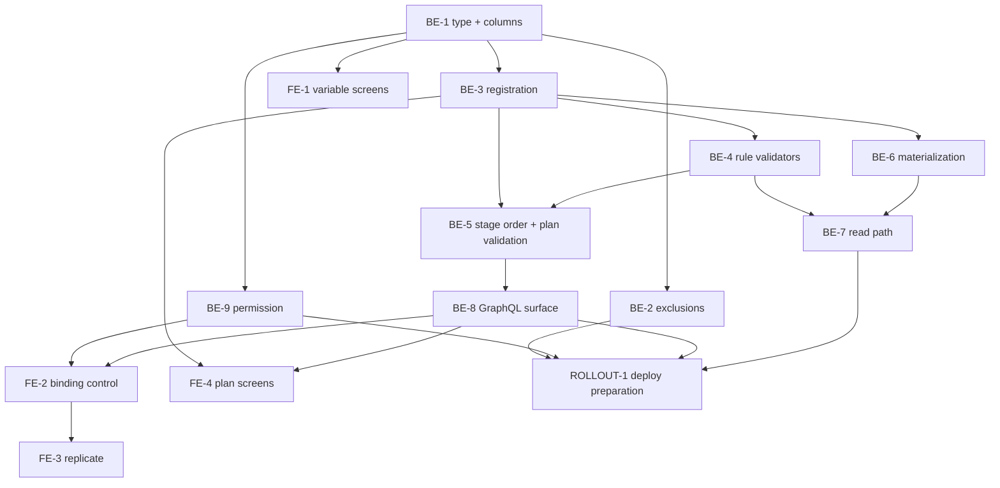

# TASKS-SPIKE — Output variables in `app`

> Reference: `PLAN.md` (engineer-approved) in this directory, and its evidence files
> `output-variables_call-sites_1.md`, `output-variables_pipeline_2.md`,
> `output-variables_rollout_3.md`.
> Repositories: `~/Projects/4Shark/app` (backend) and `~/Projects/4Shark/app-webclient` (frontend),
> branch `develop` in both.
> Language classification: internal engineering doc → English (`LANGUAGE-POLICY.md`, category 1).

## Scope of this document

`PLAN.md` settles every technical decision — fifteen of them, each with the source that resolved it.
Nothing here reopens one. This document does one thing: turn the twelve execution phases into
**fourteen discrete units of work**, each one PR's worth, with real dependencies and checkable
completion criteria.

**Substitution against the `TASKS-SPIKE` template, made deliberately.** The template's
"Decomposition options (engineer chooses at review)" section is replaced by § Decomposition
decisions below, where each fork that had more than one sensible shape is **resolved** and the
resolving source recorded. The engineer's instruction is source 1 on the `DECISION-AUTHORITY.md`
ladder and states that an unresolved fork handed back is a defect, not diligence. Every decision
below is visible in a PR diff and correctable at review, so it passes that document's reversibility
gate.

---

## Decomposition decisions

Each row is a fork where the work could reasonably have been cut more than one way, the shape
chosen, and the source that decided it.

| # | Fork | Resolved | Source |
|---|---|---|---|
| D1 | Phase 1 as one task, or split into type / role column / rule binding | **One task (BE-1).** | `PLAN.md:71-93` states one objective and one dependency line ("Dependencies: none. Blocks every other phase") for the whole phase. Reviewability confirms it: each third is unjudgeable alone — a reviewer seeing "add a `role` column defaulting to input" with no fourth type in the diff cannot assess it. The combined diff is ~15 files of declarations, read in one pass |
| D2 | The Calculator re-entry guard (`aggregated_indicator/calculator/producer.rb:20-21`) in the exclusions task or the materialization task | **Materialization task (BE-6).** | `PLAN.md:212` lists it under Phase 6 components, and its failure mode ("a silently zeroed output value", `PLAN.md:380`) is a materialization failure, not an exclusion failure. Its criterion is only meaningful once output rows exist |
| D3 | The plan-finish goal suppression — backend or frontend | **Split by repository.** Backend half (the output `plan_variable` validates with a blank `goal_type` and is distinguishable through the API) in BE-3; frontend half (the screen stops rendering the goal control) in FE-4 | `PLAN.md:69` puts phases 1-8 in the backend deploy and phase 9 in the frontend release, so the halves cannot ship together. `PLAN.md:188` sets the precedent for which half is the guarantee: "The plan picker filtered to compatible incentives (Phase 9) is the preventive form and is UX, not the guarantee" |
| D4 | Phase 6 as one task, or the recompute mechanism + indicator writer first, then the other three writers | **One task (BE-6).** | `PLAN.md:224` makes the engineer's worked example a Phase 6 success criterion: "two positive contributions and one limiter contribution of the same magnitude publish 300 + 200 − 100 = 400". That criterion needs the limiter writer, so a first PR carrying only the indicator writer could not satisfy the phase's own acceptance test |
| D5 | Phase 8 as one task, or the GraphQL surface separated from the permission | **Two tasks (BE-8, BE-9).** | `PLAN.md:378` and `PLAN.md:386` assign the two halves different failure modes and different mitigations — "A cloned incentive silently loses its output bindings" (High) versus "M4's `Action.create!` is re-applied" (Low, a re-run hazard). A PR whose entire subject is "the binding survives create/update/clone" gets the review attention the first risk warrants; the permission PR's subject is a non-idempotent data migration needing a different kind of scrutiny. They still ship in the same deploy, so nothing is lost |
| D6 | Phase 9 as one frontend task, or split | **Four tasks (FE-1..FE-4).** | `PLAN.md:290-294` lists three independent success criteria, and the variable-creation screen has a fourth, separate dependency profile: `PLAN.md:266` records that "creating an output variable needs no mutation change", so FE-1 depends only on the type existing, while FE-2/FE-3 depend on the new GraphQL argument and FE-4 on the new `role` field. Splitting turns one 20-file diff into four coherent ones with distinct reviewers' contexts |
| D7 | The two plan screens (create picker, finish goal control) as one task or two | **One task (FE-4).** | Both depend on the same backend deploy, both live in the plan authoring flow, and each is small on its own. § No Premature DRY's converse applies — do not split what only makes sense reviewed together |
| D8 | The name of the STI subclass, its scope, and its data-type allow-list | **`OutputVariable`, `scope :output`, `ApplicationDataType::OUTPUT_TYPES`.** | The surrounding code (`DECISION-AUTHORITY.md` ladder, source 2). `app/models/variable.rb:4` declares `TYPES = %w[DealVariable IndicatorVariable EasyVariable]`; `:47`, `:49`, `:58` declare `scope :deals` / `:easy` / `:indicators` in one shape; `app/data_types/application_data_type.rb:4-6` declares `DEAL_TYPES` / `INDICATOR_TYPES` / `EASY_TYPES`. The fourth member follows mechanically |
| D9 | The name of the new options processor | **`Commission::OutputOptionsProcessor`, at `app/services/commission/output_options_processor.rb`.** | The sibling files in that directory are `deal_options_processor.rb`, `deal_options_v2_processor.rb`, `indicator_options_processor.rb`, `limiter_options_processor.rb`, `ranking_options_processor.rb`, `redemption_options_processor.rb` — each named for what it supplies. (Correction recorded: `PLAN.md:235` says "alongside the four existing ones"; `ls app/services/commission/` returns six files. The naming pattern is unaffected) |
| D10 | The permission key, level and resource | **`key: 'incentive_output_variable_binding'`, `level: 'module'`, `resource: 'incentive'`.** | The `MODULE_KEYS` grammar at `app/workers/company/admin/processor.rb:15-52` is `<resource>_<action-noun>` with multi-segment resources already present (`user_identifier_action_document_creation`, `:35-36`). `level: 'module'` because the permission gates a capability rather than a per-record action — the contrast is `db/migrate/20260729113439_user_update_document_actions.rb:5-8`, where `*_listing` / `*_creation` are `level: 'module'` and `*_destruction` / `*_download` are `level: 'resource'`. `incentive_clone` (`processor.rb:31`) is the closest sibling and is module-level, gated by `IncentivePolicy#clone?` (`app/policies/incentive_policy.rb:28-33`) |
| D11 | Where the CHANGELOG entry lands across a 9-PR backend feature | **On the first task of each repository — BE-1 for `app`, FE-1 for `app-webclient` — named once and not duplicated.** | § Changelog Policy requires every feature branch to update the changelog and requires entries to "name the subject, nothing else". The observed granularity in `app/CHANGELOG.md:15-19` is feature-level ("Bulk user update by spreadsheet"), not PR-level; nine entries for one capability would violate the succinctness rule. Landing it first means no branch ships the capability before it is recorded |
| D12 | Where the incentive-CSV-import limitation is recorded | **In the `## Decisions` block of BE-1's PR description.** | § Decision Authority makes that block mandatory for a resolved ambiguity a reviewer would want to know about, and BE-1 is where the binding is introduced — the point a reader asks why the CSV cannot set it. `PLAN.md:32` already carries the reasoning and the citation (`app/workers/incentive_document/processor.rb:81-86`). No new document file, per § Scope Discipline |

---

## Sequencing



**What is genuinely parallel.** After BE-1 merges, four independent starts exist: BE-2, BE-3, BE-9,
and FE-1. After BE-3 merges, two lanes run side by side and do not touch each other's files —
**lane A** is BE-4 → BE-5 → BE-8 (`rule.rb`, `plan.rb`, `incentive.rb` constant, the GraphQL types
and mutations) and **lane B** is BE-6 → BE-7 (`aggregated_indicator.rb`, the four incentive
consumers, the new options processor). `PLAN.md:218` states the lane independence directly:
"Independent of Phases 4-5, so it can run in parallel with them". The lanes converge only at the
deploy.

**What is strictly serial and why.** BE-4 after BE-3 because the validator has to know which
output variables the company has, which is what registration establishes (`PLAN.md:173`).
BE-7 after BE-6 because there is nothing to read otherwise, and after BE-4 because no rule can name
the variable otherwise (`PLAN.md:248`). BE-8 after BE-5 "so the front never offers a binding the
backend rejects" (`PLAN.md:268`). FE-2 after both BE-8 (the argument must exist) and BE-9 (the
action must be gated).

**Repository split.** BE-1 through BE-9 are `app`; FE-1 through FE-4 are `app-webclient`;
ROLLOUT-1 produces a document in this feature directory and touches neither repository.

---

## Tasks

### BE-1 — The fourth variable type, the two new columns, and their model declarations

- **Repository**: `app`
- **Phase** (`PLAN.md:71-93`): Phase 1, schema and model, inert
- **Description**: create the output `Variable` type and its STI subclass, the `role` column on
  `incentive_variables`, the output binding on `rules`, and the unique index that guarantees the
  role pair. Nothing reads or writes any of it yet. This is the only task with no dependency and it
  blocks every other task.
- **Dependencies**: none
- **Acceptance criteria**:
  - [ ] Three migrations, each generated with `bin/rails generate migration` (never hand-written —
        `validate-rails-migration-creation.sh` blocks the Write), one action each, then applied with
        `bin/rails db:migrate`; `db/schema.rb` committed in the same commit.
  - [ ] **M1 carries a database-level default equal to the input role, and this is the task's
        load-bearing constraint, not a style point.** During the deploy window the schema is new and
        every serving container still runs the old code (`output-variables_rollout_3.md:210-220`,
        reading `deploy-shared-001.yaml:403-458` against `:616-621`). That old code calls
        `incentive_variables.create(variable_id: variable.id)` with no role at
        `app/models/incentive.rb:156`, `:160`, `:164`, `:168`, and it runs against the OLD model
        class, which carries no `enumerize` declaration — so an `enumerize`-level default does not
        reach it and only the column default does. Verify by confirming `db/schema.rb` shows the
        integer default on `incentive_variables.role`, and that a bare
        `IncentiveVariable.create(incentive_id: …, variable_id: …)` produces a row whose role is the
        input role.
  - [ ] M2 uses `t.references` with inline `index:`/`foreign_key:` and explicit `null:`, wrapped in
        `safety_assured { … }` — `strong_migrations` is active with default checks
        (`Gemfile:78`; the initializer is `StrongMigrations.auto_analyze = true` and nothing else),
        and the repository's own precedent is
        `db/migrate/20260722215726_add_plan_id_to_plan_statement_portable_batches.rb:5`.
  - [ ] M3 adds the unique index on `incentive_variables (incentive_id, variable_id, role)` with
        `disable_ddl_transaction!` **and** `algorithm: :concurrently` together —
        `validate-concurrent-index-migration.sh` blocks the write otherwise, and the pair always
        fails in Postgres when split. M3 runs after M1; the index references the column M1 creates.
        Precedent: `db/migrate/20260729113429_add_unique_index_to_user_update_document_enrollments.rb:2-11`.
  - [ ] `Variable::TYPES` (`app/models/variable.rb:4`) gains the fourth member and a
        `scope :output` joins the three at `:47`, `:49`, `:58`.
  - [ ] `OutputVariable < Variable` mirrors `app/models/easy_variable.rb` — the two
        `rescue_unique_constraint` declarations plus a `data_type` inclusion drawn from a new
        `ApplicationDataType::OUTPUT_TYPES` alongside the three at
        `app/data_types/application_data_type.rb:4-6`. The type constrains `default` to zero
        (`PLAN.md:368`); `validates :default, presence: true` (`app/models/variable.rb:35`) still
        applies, while the three indicator-only validations at `:32`, `:36` and `:39` do not,
        because each is `if: :indicator?`.
  - [ ] `Rule` gains `belongs_to :output_variable, class_name: 'Variable', optional: true` with **no**
        manual presence validation — the binding is optional (`PLAN.md:360`), which is the one case
        where § Optional belongs_to's companion `validates … presence: true` is deliberately absent.
  - [ ] `IncentiveVariable` gains the role `enumerize` and a presence validation joining the two at
        `app/models/incentive_variable.rb:7-8`.
  - [ ] **Tests, in this task's own PR.** `spec/models/variable_spec.rb:35` currently reads
        `it { is_expected.to validate_inclusion_of(:type).in_array(%w[DealVariable EasyVariable IndicatorVariable]) }`
        and fails by construction against a fourth type — editing it is required, not a regression.
        A new `spec/models/output_variable_spec.rb` mirrors
        `spec/models/easy_variable_spec.rb` (145 lines of shoulda-matchers plus method blocks) and
        asserts the data-type allow-list and that the three indicator-only validations do not fire.
        `spec/models/incentive_variable_spec.rb` (10 lines today) gains the role presence and
        `enumerize` assertions.
  - [ ] Factories: `spec/factories/variables.rb` gains an `:output` trait alongside `:indicator`
        and `:deal`; `spec/factories/rules.rb` gains the output binding;
        `spec/factories/incentive_variables.rb` is a bare `factory :incentive_variable` today and
        gains the role.
  - [ ] `CHANGELOG.md` gains one entry under `## [Unreleased]` → `### Added`, naming the capability
        in user terms with no class, method, file or column named (§ Changelog Policy). Per D11 this
        is the only `app` entry for the feature.
  - [ ] The PR's `## Decisions` block records D8, D12, and the deliberate absence of a presence
        validation on `output_variable_id`.
- **Pattern references**:
  - `app/models/easy_variable.rb` (whole file, 8 lines) — the STI subclass shape this copies.
  - `db/migrate/20260722215726_add_plan_id_to_plan_statement_portable_batches.rb:5` — the
    `safety_assured` + `add_reference` shape.
  - `db/migrate/20260729113429_add_unique_index_to_user_update_document_enrollments.rb:2-11` — the
    concurrent-index shape.
  - `db/schema.rb:1959-1961` — a variable-bearing FK already on `rules` (`variable_track_id` and its
    partial unique index), so M2's shape has precedent in the same table.

### BE-2 — Exclude output variables from the unscoped existing flows

- **Repository**: `app`
- **Phase** (`PLAN.md:94-116`): Phase 2, exclusions. Independently valuable — this is the task that
  contains the blast radius.
- **Description**: fifteen call sites already read through `variables.deals` / `.indicators` /
  `.easy` and exclude a fourth type with no code change (full inventory,
  `output-variables_call-sites_1.md:16-32`). Six unscoped sites need a scope; five are left
  unscoped deliberately. This task is the regression net for every other task.
- **Dependencies**: BE-1 merged — the type must exist before a scope can exclude it.
- **Acceptance criteria**:
  - [ ] `app/workers/calendar_audit/producer.rb:19` is scoped. Its fan-out at `:20` is
        `period_ids.product(user_ids, variable_ids)`, so each unscoped output variable adds
        `periods × users` audit jobs per plan.
  - [ ] `app/models/calendar_audit.rb:30` (`PlanVariable.where(plan_id: plan_ids).count`, the
        audit's expected row count) excludes auxiliaries. An output variable has no integration
        source, so counting it as expected produces a permanent false gap.
  - [ ] `app/workers/goal_dataset/migration/producer.rb:16` is scoped.
  - [ ] `app/workers/commission/money_sanitizer_processor.rb:48` is scoped.
  - [ ] `app/work_books/commission_work_book/indicator_work_sheet.rb:29` and
        `app/work_books/plan_slice_commission_work_book/indicator_work_sheet.rb:36` each get
        `.indicators` on the lookup. Both files already gate on `variables.indicators.exists?` at
        their line 12, so scoping the lookup restores the file's own declared subject rather than
        changing it.
  - [ ] **Five sites are left untouched, and the PR says so explicitly** —
        `app/work_books/variable_audit_work_book/variables_work_sheet.rb:28` (a configuration catalog
        with a type column that already renders blank frequency for deal and easy variables, `:15-38`);
        `app/services/commission/indicator_options_processor.rb:41` (left unscoped deliberately —
        BE-7 depends on output keys landing in the frozen snapshot carrying their default, so a
        consuming formula never hits the unbound-variable path at runtime); and
        `app/workers/company/inactivator.rb:107`, `app/workers/company/activator.rb:110`,
        `app/workers/company/cleansing/variable_producer.rb:13`, whose purpose is covering every
        variable of a company.
  - [ ] **Tests.** The two workbook changes are covered where the repository tests workbooks
        (`spec/work_books/`). The four worker/model changes have no spec home — `spec/` contains
        `factories`, `forms`, `models`, `requests`, `search_indexes`, `work_books` and **no
        `spec/workers/` directory** (see § Test surface). `app/models/calendar_audit.rb:30` is model
        code and is asserted in `spec/models/` that a plan carrying an output variable does not
        raise the expected count. The three producer scopes are verified on `beta-001` under
        ROLLOUT-1, which is where PLAN.md already places end-to-end confirmation.
- **Pattern reference**: `app/workers/aggregated_indicator/producer.rb:23,25` —
  `Variable.with_uncached_connection { plan.variables.easy.pluck(:id) }`, the already-scoped shape
  each unscoped site is being brought in line with.

### BE-3 — Register output variables on incentive save, and carry them into the plan roll-up

- **Repository**: `app`
- **Phase** (`PLAN.md:118-134`): Phase 3, registration
- **Description**: saving an incentive records its inputs and its outputs, each with the right role.
  Output variables reach `plan_variables` — the read path requires them there — with goal binding
  suppressed for the type on the backend side.
- **Dependencies**: BE-1 merged.
- **Acceptance criteria**:
  - [ ] `Incentive#update_variables` (`app/models/incentive.rb:149-175`, the `after_save` callback
        declared at `:80`) writes output rows with the output role alongside the input rows it writes
        today. The method opens with `incentive_variables.delete_all` at `:150`, so a spec asserts
        the rebuild does not drop outputs.
  - [ ] **The ranking branch is the named hazard and gets its own assertion.**
        `app/models/incentive.rb:172` is
        `incentive_variables.find_or_create_by(variable_id: variable.id) if …` — with no role scope,
        that call can find an output row and skip creating the input row. A spec covers an incentive
        whose variable is both an input of one rule and an output of another and asserts **both**
        rows exist. M3's unique index (BE-1) is where the defect would surface if the scope is
        missed.
  - [ ] An output variable reaches `plan_variables`. `Plan#create_variables`
        (`app/models/plan.rb:434-436`) populates it from `variable_ids` (`:438-445`), which is
        unscoped, so this is verification rather than a change — the spec pins it so a later scope
        cannot silently remove it.
  - [ ] The output `plan_variables` row validates with a blank `goal_type`.
        `PlanVariable#goals_presence` (`app/models/plan_variable.rb:32-39`) opens with
        `return if goal_type.blank?`, so this holds today; the spec pins it.
  - [ ] The backend half of goal suppression: the plan-finish path can distinguish an output
        `plan_variable`. `PlanVariableInputGraphqlType` declares both arguments `required: true`
        (`app/graphql_types/plan_variable_input_graphql_type.rb:4-5`) and is consumed by
        `finish_plan_graphql_mutation.rb:5` as `plan_variables_attributes`. The frontend half —
        not rendering the goal control — is FE-4 (decision D3).
  - [ ] **Tests.** `spec/models/incentive_spec.rb` (108 lines, association matchers only today)
        gains a `describe '#update_variables'` block; the shape to copy is
        `spec/models/deal_variable_spec.rb:50-62`, and 48 of the 284 model specs already use it.
        `spec/requests/graphql_mutations/graphql_controller_finish_plan_spec.rb` covers the
        finish path with an output variable present.

### BE-4 — Bind output keys in the `Rule` syntax validators

- **Repository**: `app`
- **Phase** (`PLAN.md:136-178`): Phase 4, the blocker
- **Description**: **this is a prerequisite for the read side, not polish.** Today a rule whose
  formula references an output variable key cannot be saved at all, and the failure is silent
  about its cause. `Rule` validates every formula by evaluating it against a synthetic options hash
  built from positively-scoped variable queries; an unbound identifier raises
  `Dentaku::UnboundVariableError`, a subclass of `Dentaku::Error`, which is the first entry of
  `Rule::PARSE_EXCEPTIONS` (`app/models/rule.rb:4-5`), so `validate_syntax`
  (`app/models/rule.rb:172-180`) swallows it into a bare `errors.add(:value, :invalid)`.
- **Dependencies**: BE-3 merged — the validator needs to know which output variables the company
  has (`PLAN.md:173`).
- **Acceptance criteria**:
  - [ ] The synthetic options hash binds output keys for the three incentive types that may read
        one — ranking, limiter and redemption. The four existing builders are `metrics_options`
        (`app/models/rule.rb:183`), `deal_extra_fields_options` (`:203`),
        `indicator_variables_options` (`:209`) and `easy_variables_options` (`:217`); the three
        validators that consume them are `ranking_syntax` (`:114`), `limiter_syntax` (`:140`) and
        `redemption_syntax` (`:161`). (Correction already recorded in
        `output-variables_call-sites_1.md:34-38`: SPIKE §4.5 cites `173,193,199,207`; the current
        `develop` lines are the ones above.)
  - [ ] `indicator_syntax` (`:95`) and `formula_syntax` (`:71`) are **not** given output bindings
        — the indicator stage writes but does not read (`PLAN.md:45`).
  - [ ] A rule referencing an output key saves through the incentive mutation, on the incentive
        types that may read one. Asserted in
        `spec/requests/graphql_mutations/graphql_controller_create_incentive_spec.rb`.
  - [ ] A rule referencing a genuinely unknown key still fails with `errors.add(:value, :invalid)` —
        the negative case, without which the change could be an unconditional bind. Asserted in
        `spec/models/rule_spec.rb` (60 lines today).
  - [ ] Runtime behaviour is confirmed unchanged: `calculate` returns `0` on a parse exception
        (`app/models/rule.rb:53-57`), so a missing output value at calculation time yields zero
        rather than an error.
- **Pattern reference** — `app/models/rule.rb:209-215`, the builder this one is modelled on:
  ```ruby
  def indicator_variables_options
    incentive.company.variables.indicators.enabled.each_with_object({}) do |variable, options|
      options["#{variable.key}_goal"] = rand(5000..10_000) # english variable
      options["meta_#{variable.key}"] = rand(5000..10_000) # portuguese variable
      options[variable.key] = rand(1..5_000)
    end
  end
  ```

### BE-5 — The stage-order constant and the plan-level exporter validation

- **Repository**: `app`
- **Phase** (`PLAN.md:180-196`): Phase 5
- **Description**: a plan whose incentive reads an output variable is rejected unless another
  incentive in the same plan, in a strictly earlier stage, exports it. The calculation order has no
  representation in code today — it exists only in the enqueue graph across 41 call sites
  (`output-variables_pipeline_2.md:69-115`), and `Incentive::TYPES`
  (`app/models/incentive.rb:15`) is declared in a different order carrying no ordering semantics.
- **Dependencies**: BE-3 and BE-4 merged.
- **Acceptance criteria**:
  - [ ] `Incentive::CALCULATION_ORDER` expresses Deal → Indicator → Ranking → Limiter → Redemption.
        **The enqueue graph remains the source of truth for execution; the constant becomes the
        source of truth for validation only** (`PLAN.md:186`).
  - [ ] A spec asserts `CALCULATION_ORDER` matches the observed enqueue chain. This is the sync
        mechanism that answers the "nothing keeps them in sync" objection and is the mitigation
        `PLAN.md:382` names for the drift risk — without it the constant is a second, silently
        divergent representation.
  - [ ] `Plan#output_variable_requirements` joins the four custom validations at
        `app/models/plan.rb:58-61`, modelled on its structural twin `redemption_incentive_requirements`
        (`:389-398`), which also reasons over the plan's incentive set and adds to `:incentivations`.
  - [ ] **Two details differ from the twin and each has a consequence.** It reads `incentive_ids`
        (`app/models/plan.rb:421-425`), which rejects incentivations marked for destruction — the
        twin uses `incentivations.map(&:incentive_id)` (`:392`) and does not. And the error is added
        to `:incentivations` with **no dot**, because `PlanDocument::Consumer` skips only attributes
        starting with `incentivations.` (`app/workers/plan_document/consumer.rb:212`,
        `next if attribute.to_s.start_with?('incentivations.')`) — a dotted key would be swallowed
        by the bulk plan import.
  - [ ] Validation branches covered, all five: reader with no exporter; reader with an exporter in
        the same stage; reader with an exporter in a later stage; reader with an exporter in an
        earlier stage; two exporters into one variable.
  - [ ] The bulk plan import surfaces the error rather than swallowing it — asserted against
        `PlanDocument::Consumer`, which builds plans from a spreadsheet at
        `app/workers/plan_document/consumer.rb:158` and `:209`.
  - [ ] **Tests** land in `spec/models/plan_spec.rb` (58 lines today) and
        `spec/requests/graphql_mutations/graphql_controller_create_plan_spec.rb` /
        `..._update_plan_spec.rb`.

### BE-6 — Materialize the per-`(user_commission, variable)` output value

- **Repository**: `app`
- **Phase** (`PLAN.md:198-226`): Phase 6. The largest task and the one carrying the feature's
  correctness risk.
- **Description**: at commissioning save, inside the existing consumers, recompute
  `value = SUM(commissionings of the rules bound to this variable, for this user commission)` and
  upsert it into `aggregated_modifiers`. No new worker, no new `Computation` participation, no edit
  to the enqueue graph.
- **Dependencies**: BE-3 merged. **Independent of BE-4 and BE-5** (`PLAN.md:218`), so this and BE-7
  form a lane that runs beside them.
- **Acceptance criteria**:
  - [ ] **Recompute, never `+=`.** Every `(user_commission, rule)` pair is an independent job
        (`app/workers/indicator_incentive/producer.rb:22`,
        `combinations = user_commission_ids.product(rule_ids)`), so a read-modify-write on a shared
        row loses updates; and Sidekiq is at-least-once, so `+=` is not idempotent while the
        recomputed sum is idempotent by construction.
  - [ ] **The sum is over the signed, commission-type-aware expression, not the raw `value` column.**
        A money incentive's rules sum `Commissioning#money`, a points incentive's sum
        `Commissioning#points`. `LimiterCommissioning` returns `value * -1`
        (`app/models/limiter_commissioning.rb`, whole class, quoted at
        `output-variables_pipeline_2.md:307-323`); the base `Commissioning#money` returns `value`
        unchanged (`app/models/commissioning.rb:60-70`).
  - [ ] **The engineer's worked example closes**: two positive contributions and one limiter
        contribution of the same magnitude publish 300 + 200 − 100 = 400. This test fails if the raw
        `value` column is summed, which is exactly what it exists to catch (`PLAN.md:385`).
  - [ ] Several rules into one variable, and two incentives into one variable, produce the expected
        sum.
  - [ ] A rule that evaluated to zero — and therefore wrote no commissioning row — contributes
        nothing. The guard is present in all four incentive stages:
        `indicator_incentive/consumer.rb:41`, `limiter_incentive/consumer.rb:40`,
        `ranking_incentive/consumer.rb:47`, `redemption_incentive/consumer.rb:37`.
  - [ ] **Idempotency under retry: running the materialization twice leaves the value unchanged.**
        This is the property `PLAN.md:225` singles out as invisible in a single-run test.
  - [ ] Storage is `aggregated_modifiers`, already unique on `(user_commission_id, variable_id)`
        (`db/schema.rb:86`, `aggregated_modifiers_unique_index`). Note for the implementer:
        `AggregatedIndicator` is the model on that table — `self.table_name = :aggregated_modifiers`
        at `app/models/aggregated_indicator.rb:19`. The write is an upsert against that index.
  - [ ] **The race is closed**: the aggregate query re-reads at the moment of write, inside its own
        transaction. Two consumers writing the same variable for the same user race on the
        *recompute*, not on the commissioning, and a stale read produces a silently low number —
        the failure class the payroll cannot tolerate (`PLAN.md:209`). `AggregatedIndicator`
        caches only the record **id** (`app/models/application_record.rb:134-140`:
        `Rails.cache.read(cache_id) || find_by!(…).id`, then `find(id)`), so the id cache is not a
        staleness vector for the value; the transaction boundary is.
  - [ ] **The Calculator re-entry guard** (decision D2):
        `app/workers/aggregated_indicator/calculator/producer.rb:20-21` gains a type scope. It fans
        out over every row for the commission with no type scope, and its consumer calls `calculate!`
        (`calculator/consumer.rb:17`), which falls back to `variable.format_default` when there are
        no `indicator_aggregations` (`app/models/aggregated_indicator.rb:26-28`) — so any path
        re-entering the Calculator after output rows exist overwrites them with the default.
        Within one run the ordering makes this unreachable; the scope closes the re-entry exposure.
  - [ ] A reprocess clears the output rows and recomputes them. The purge at
        `app/workers/aggregated_indicator/purge/consumer.rb:17-21` is unscoped, so the clearing half
        is free; the recompute half is what this criterion tests.
  - [ ] **Partial commissions checked specifically.** Every worker in the chain branches on `partial`
        to load `PartialCommission` instead of `Commission` (e.g.
        `app/workers/indicator_incentive/consumer.rb:8-13`), and `AggregatedIndicator#indicator` has
        a partial-specific `nil` return (`app/models/aggregated_indicator.rb:115-116`), so the
        zero-versus-absent semantics need confirming against partials.
  - [ ] **Documented, not guarded against**: `#money` returns zero for a points-typed incentive and
        `#points` zero for a money-typed one, so a variable bound by both a money rule and a points
        rule sums mixed units. That is the author's modelling choice and no validation is added
        (`PLAN.md:207`). The PR's `## Decisions` block records it.
  - [ ] **Pre-existing constraint the PR must state, not fix**: limiter and ranking commissioning
        writes are not retry-idempotent — both construct a fresh record
        (`app/workers/limiter_incentive/consumer.rb:41`, `ranking_incentive/consumer.rb:48`), so a
        retry hits the unique index at `db/schema.rb:457` and raises on `save!`. Redemption
        compensates in its producer (`redemption_incentive/producer.rb:30`); limiter and ranking do
        not. Indicator survives a retry via
        `IndicatorCommissioning.find_or_initialize_by(user_commission_id:, rule_id:)`
        (`indicator_incentive/consumer.rb:54`). This is not introduced here and is out of scope
        (§ Scope Discipline, category 3 — a follow-up, not this PR); it bounds how much the
        materialization can rely on those rows being rewritable.
  - [ ] The work runs on the existing commission queue of the stage it hangs off, so
        `config/sidekiq_commission*.yml` (five files), `config/initializers/hire_fire.rb` (five dyno
        blocks) and Terraform are untouched. Confirmed by the diff containing none of those paths.
  - [ ] **Tests.** The signed summing logic belongs where the repository can test it — a model-level
        method, asserted in `spec/models/`. The four consumer call sites have no spec home (§ Test
        surface) and are confirmed end to end on `beta-001` under ROLLOUT-1.
- **Cost recorded, not re-decided**: N recomputes per user per stage rather than one at the stage
  boundary, for an identical result (`PLAN.md:216`).

### BE-7 — Deliver the materialized value to every consuming rule

- **Repository**: `app`
- **Phase** (`PLAN.md:228-253`): Phase 7, read path
- **Description**: a new options processor supplies the materialized output values, merged last
  into the Dentaku options hash of the three reading stages.
- **Dependencies**: BE-6 (nothing to read otherwise) and BE-4 (no rule can name the variable
  otherwise).
- **Acceptance criteria**:
  - [ ] `Commission::OutputOptionsProcessor` created at
        `app/services/commission/output_options_processor.rb` (decision D9).
  - [ ] The merge is added in exactly three consumers, each joining the existing expression:
        `app/workers/ranking_incentive/consumer.rb:44`
        (`options = deal_options.merge(modifier_options).merge(ranking_options)`),
        `app/workers/limiter_incentive/consumer.rb:37`, and
        `app/workers/redemption_incentive/consumer.rb:34`. The output merge comes last, after
        `modifier_options`, following both named precedents.
  - [ ] **The indicator consumer is not touched.** It is the first writer and nothing has been
        written before it; its line 29
        (`options = deal_options.merge(user_commission.modifier_options)`) is unchanged.
  - [ ] **The deal stage is not touched, and the PR states why that is safe.** It does not merge the
        snapshot wholesale — it filters it to metric keys
        (`app/workers/deal_incentive/consumer.rb:30-32`, and the same shape at
        `deal_incentive/period_processor.rb:20`), so an output key is filtered out by that
        `select` with no code change.
  - [ ] **A plan with no output variable produces byte-identical options hashes to today.** This
        is the regression criterion for the whole read path.
  - [ ] A rule in a ranking, limiter or redemption incentive reading an output variable evaluates
        against the materialized value, not the default. The frozen snapshot already carries
        output keys at their default — it is written once before any incentive stage
        (`app/workers/user_commission/indicator_options_consumer.rb:16-17`) and
        `IndicatorOptionsProcessor` reads `plan.variables` unscoped
        (`app/services/commission/indicator_options_processor.rb:41`) — so this criterion is
        specifically that the fresh merge **overwrites** the default.
  - [ ] Data access follows `~/.claude/docs/DATA-ACCESS.md`: `with_uncached_connection` around each
        access, IDs rather than loaded objects, associations navigated per record rather than joined.
- **Pattern references** — the two precedents differ, and the PR should say which it follows:
  - `app/services/commission/redemption_options_processor.rb:4-11` computes inside the consumer:
    ```ruby
    class RedemptionOptionsProcessor
      def self.call(user_commission:)
        {
          pontos: user_commission.points.to_f,
          points: user_commission.points.to_f
        }
      end
    end
    ```
  - `Commission::LimiterOptionsProcessor` computes in a dedicated preceding stage and persists onto
    the user commission (`app/workers/user_commission/limiter_options_consumer.rb:19-28`), which
    `limiter_incentive/consumer.rb:36` then reads.

### BE-8 — The GraphQL authoring surface and the clone round-trip

- **Repository**: `app`
- **Phase** (`PLAN.md:255-274`): Phase 8, first half (decision D5)
- **Description**: expose the output binding on the API and close the clone gap — the sharpest
  backwards-compatibility risk in the feature.
- **Dependencies**: BE-1; sequenced after BE-5 so the front never offers a binding the backend
  rejects (`PLAN.md:268`).
- **Acceptance criteria**:
  - [ ] An output-variable field on `RuleGraphqlType`, which today exposes `commissionings`,
        `created_at`, `description`, `document_line`, `id`, `incentive`, `incentive_id`, `type`,
        `updated_at`, `value` and no variable field (`app/graphql_types/rule_graphql_type.rb:3-14`).
  - [ ] The matching argument on `RuleInputGraphqlType`
        (`app/graphql_types/rule_input_graphql_type.rb:4-8`), **declared `required: false`**. Every
        argument on that type is `required: false` today and the frontend declares the input type by
        name (`$rules: [RuleInputGraphql!]`), so a newly-required argument would fail validation on
        every existing client, and the type name must not change.
  - [ ] A `role` field on `IncentiveVariableGraphqlType`
        (`app/graphql_types/incentive_variable_graphql_type.rb:4-7`, today `id`, `incentive`,
        `incentive_id`, `variable`, `variable_id`) so the plan-side picker in FE-4 can distinguish
        inputs from outputs.
  - [ ] **Both mutation rule allow-lists carry the new argument.**
        `create_incentive_graphql_mutation.rb:43-47` is `rules: %i[ description type value ]` and
        `update_incentive_graphql_mutation.rb:43-49` is `rules: %i[ _destroy description id type value ]`.
        These are explicit `%i[…]` arrays — an unlisted argument is silently dropped, which is
        precisely how a clone would lose its binding.
  - [ ] **A clone carrying an output binding round-trips through `CreateIncentiveGraphqlMutation`
        with the binding intact, asserted by a test that clones and checks the binding.** There is no
        backend clone mutation — `clone` is a permission and a UI action only
        (`IncentivePolicy#clone?` at `app/policies/incentive_policy.rb:28-33`, the permission string
        `incentive_clone` at `app/workers/company/admin/processor.rb:31`, and
        `actions << 'clone' if policy.clone?` at `app/graphql_types/incentive_graphql_type.rb:49`),
        so a clone goes through the create mutation. Without both allow-lists carrying the binding
        **and** the front clone builders carrying it (FE-2), a cloned incentive silently produces a
        plan that validates but computes a different number.
  - [ ] No change to `create_variable_graphql_mutation.rb` — it already lists `type` in both
        arguments and `permit` (`:4-11`, `:30-40`), and `Variable.for_type`
        (`app/models/variable.rb:55`) already backs the resolver's type filter
        (`app/graphql_resolvers/variable_graphql_resolver.rb:21`). Confirmed by the diff not touching
        those files.
  - [ ] `field :type, String, null: false` on `VariableGraphqlType` (`:33`) is a `String`, not a
        GraphQL enum, so a fourth type value is not a client-visible schema change. Confirmed by the
        diff not touching that line.
  - [ ] **Tests** in `spec/requests/graphql_mutations/graphql_controller_create_incentive_spec.rb`
        and `..._update_incentive_spec.rb`, both of which already exist.

### BE-9 — The `incentive_output_variable_binding` permission

- **Repository**: `app`
- **Phase** (`PLAN.md:255-274`): Phase 8, second half (decision D5)
- **Description**: the permission that makes the feature reachable by nobody until granted. The
  permission system is 4Shark's release toggle.
- **Dependencies**: BE-1 merged. Independent of the rest of the backend, so this runs as its own
  lane.
- **Acceptance criteria**:
  - [ ] Migration M4 creates the `Action` row in the established pattern —
        `Action.create!(key: …, level: 'module', resource: 'incentive')`, following
        `db/migrate/20260729113439_user_update_document_actions.rb:4-9`, with a `down` method
        destroying it in the shape of that file's `:11-16`. The key, level and resource are
        decision D10.
  - [ ] **The migration-ordering constraint for this task, stated in its own criteria.** The key is
        added to the hardcoded `MODULE_KEYS` list at
        `app/workers/company/admin/processor.rb:15-52` (where `incentive_clone` sits at `:31`). The
        processor iterates that list at `:77-83` and resolves each key with `Action.get`, which goes
        through `ApplicationRecord.get_id` (`app/models/application_record.rb:134-140`) ending in
        `find_by!` — **so a key listed in `MODULE_KEYS` with no `Action` row raises
        `RecordNotFound` and the processor dies. M4 must land in the same deploy as the
        `MODULE_KEYS` entry, never after it.** Verified by both changes being in this one PR.
  - [ ] **M4 is not idempotent and the PR says so.** `Action.create!` raises on a re-run. This is a
        re-run hazard, not a rollback hazard (`PLAN.md:386`).
  - [ ] A policy method on `IncentivePolicy` following the shape of every sibling — e.g.
        `app/policies/incentive_policy.rb:8-10`,
        `role.permission?('incentive_creation') || user.permission?('incentive_creation')`.
  - [ ] **The permission is granted to nobody.** The deploy makes the feature present and
        unreachable; granting is ROLLOUT-1's prepared procedure, executed by the engineer.
  - [ ] The PR's `## Decisions` block records D10.

### FE-1 — Offer the output type on the variable screens

- **Repository**: `app-webclient`
- **Phase** (`PLAN.md:276-294`): Phase 9, the variable creation screen component
- **Description**: the earliest frontend task and fully independent of the rest — until an operator
  can create an output variable there is nothing to bind. `PLAN.md:266` records that creating one
  needs no backend mutation change, so this depends only on the type existing.
- **Dependencies**: BE-1 merged (the backend accepts the type).
- **Acceptance criteria**:
  - [ ] The fourth type appears in the three option lists —
        `src/app/variable/variable.component.html:101`,
        `src/app/variable/create/variable-create.component.html:30`, and
        `src/app/variable/update/variable-update.component.html:30` — with its
        `variable.type.options.*` translation key added to every locale file the siblings have.
  - [ ] **This is a list change, not a form change.**
        `src/app/variable/create/variable-create-form-builder.service.ts:84-88` already has a `type`
        control with a required validator. Its `variableCalculation` (`:36`), `variableFrequency`
        (`:46`) and `variableOverrideCalculation` (`:56`) helpers are conditionally required,
        matching the backend model where those three are validated only `if: :indicator?`
        (`app/models/variable.rb:32,36,39`) — an output variable follows the deal/easy shape and
        requires none of them. Verified by the diff not adding a control.
  - [ ] The conditional blocks keyed on `IndicatorVariable`
        (`variable-create.component.html:124`, `variable-update.component.html:116`,
        `variable-create.component.ts:105`) are confirmed not to fire for the new type.
  - [ ] `CHANGELOG.md` gains one entry under `## [Unreleased]` → `### Added` (decision D11); this is
        the only `app-webclient` entry for the feature.
  - [ ] **Verification is manual, and that is the repository's convention, not a gap.**
        `app-webclient` contains seven `.spec.ts` files in total — `app.component.spec.ts`,
        `cropper-dialog.component.spec.ts`, and five under `core/http/`. There is no test convention
        for feature components, form builders or services, so § Testing Policy's "read 2-3 similar
        existing test files" has nothing to read at this layer. The criterion is a manual check
        against the deployed backend, recorded in ROLLOUT-1's checklist.

### FE-2 — The output-variable control on a rule, across five incentive types

- **Repository**: `app-webclient`
- **Phase** (`PLAN.md:276-294`): Phase 9, the shared control and its wiring
- **Description**: one control in the shared `rule/` module, wired into five incentive modules ×
  three flows. **The clone flows are the part that must not be missed** — see the clone gap in BE-8.
- **Dependencies**: BE-8 (the argument must exist) and BE-9 (the action must be gated), both merged
  and deployed.
- **Acceptance criteria**:
  - [ ] The control is added once in `src/app/rule/` — `rule.model.ts` (whose `Rule` class carries
        `_destroy`, `description`, `expanded`, `id`, `value`, `type` today),
        `rule-create-form-builder.service.ts` (whose `build` returns a group of `value` and
        `description`) and `rule-update-form-builder.service.ts`.
  - [ ] Wiring in **fifteen sites**: `deal-incentive`, `indicator-incentives`, `limiter-incentives`,
        `redemption-incentives` and `rankifier-incentives`, each with `create/`, `update/` and
        `clone/`. Each composes the shared builder — the reference call is
        `src/app/indicator-incentives/create/indicator-incentive-create-form-builder.service.ts:25`,
        `rules: this.ruleFormBuilder.buildArray()`.
  - [ ] **Every one of the five `clone/` flows carries the binding.** A clone prefills the create
        form and therefore goes through `CreateIncentiveGraphqlMutation`; if a clone builder drops
        the binding, the cloned incentive validates and computes a different number than the
        operator authored (`PLAN.md:378`). Verified by cloning an incentive with a binding on each
        of the five types and confirming the binding survives.
  - [ ] The binding can be set, edited and cloned on all five incentive types.
  - [ ] The rule payload builder sends the field only when set — the existing shape is
        `src/app/indicator-incentives/create/indicator-incentive-create.component.ts:153-165`, which
        adds `value` and `description` conditionally.
  - [ ] **No query selects a field the server does not have.** Apollo is configured with
        `errorPolicy: 'none'` (`indicator-incentive-create.service.ts:15-28`, and verbatim the same
        block in `indicator-incentive-permissions.service.ts:16-29`), so a partial result is
        discarded and the whole screen errors. This is why FE-2 ships strictly after the backend
        deploy.
  - [ ] **Scope note, from `PLAN.md:283`**: the plan names `create/`, `update/` and `clone/`. Each
        module also has a `show/` folder, which is outside the plan's stated scope and is not
        touched here.
  - [ ] Verification is manual per FE-1's criterion on the repository's test convention.

### FE-3 — Replicate the binding across an incentive's rules

- **Repository**: `app-webclient`
- **Phase** (`PLAN.md:284`): Phase 9, the replicate action
- **Description**: a form-level action on the rules `FormArray`. The array lives in each incentive
  builder, so the control sits at the incentive form level rather than inside the shared rule module.
- **Dependencies**: FE-2 merged — there is no binding to replicate otherwise.
- **Acceptance criteria**:
  - [ ] The replicate action sets one rule's output variable across the incentive's rule array.
  - [ ] The action exists on all five incentive types, at the incentive form level, not inside
        `src/app/rule/`.
  - [ ] It is compatible with the optional binding: an operator can still bind one rule and leave
        the rest unbound (`PLAN.md:360` — "ele pode salvar só uma faixa ou ele pode salvar todas").
  - [ ] Verification is manual per FE-1's criterion.

### FE-4 — Plan screens: compatible-incentive picker and no goal control for output variables

- **Repository**: `app-webclient`
- **Phase** (`PLAN.md:285` and `PLAN.md:126`): Phase 9's plan picker plus the frontend half of
  Phase 3's goal suppression (decisions D3 and D7)
- **Description**: the plan create screen offers only incentives compatible with the output
  variables already present, and the plan finish screen stops offering a goal type for an output
  variable.
- **Dependencies**: BE-8 (the `role` field on `IncentiveVariableGraphqlType`) and BE-3 (the backend
  half of the goal suppression), both merged and deployed.
- **Acceptance criteria**:
  - [ ] The plan picker offers only compatible incentives. The plan create form builds
        `incentivationsAttributes` via `IncentivationCreateFormBuilderService`
        (`src/app/plan/create/plan-create-form-builder.service.ts:23`); the picker needs each
        candidate incentive's output inputs and outputs, which is why BE-8 adds `role`.
  - [ ] **The picker is UX, not the guarantee.** `PLAN.md:188` is explicit: the plan validation from
        BE-5 is the guarantee. A plan assembled around the picker still has to be rejected by the
        backend when it lacks an exporter — confirmed by attempting it and seeing the BE-5 error.
  - [ ] The plan finish screen does not offer a goal type for an output `plan_variable`.
        `PlanVariableInputGraphqlType` requires `goal_type`
        (`app/graphql_types/plan_variable_input_graphql_type.rb:5`) and the screen offers a goal type
        for every `plan_variable` today, so an output variable would otherwise appear there.
  - [ ] Verification is manual per FE-1's criterion.

### ROLLOUT-1 — Deploy and rollout preparation

- **Repository**: neither. The deliverable is a document in this feature directory.
- **Phase** (`PLAN.md:296-349`): Phases 10, 11 and 12
- **Description**: **prepare the deploy; do not run it.** `PLAN.md:315` records the boundary
  directly: "**Running the deploy is the engineer's** — an action outside version control that a PR
  diff neither shows nor reverts. The shape above is decided; the execution and its timing are not."
  The shape is settled at one backend deploy per environment in progression, then one frontend
  release, then the permission grant per account (`PLAN.md:367`). This task produces everything the
  engineer needs to execute that, in one place.
- **Dependencies**: BE-1 through BE-9 merged, for the backend half; FE-1 through FE-4 merged, for the
  frontend half.
- **Acceptance criteria**:
  - [ ] **A `beta-001` validation checklist**, executable step by step, covering every Phase 10
        success criterion: a commission with no output variables completes end to end unchanged;
        one with an output variable produces the expected value; a rule naming an output key
        saves; a plan missing an exporter is rejected and the document import reports it;
        `Incentive` save still produces the same `incentive_variables` rows for incentives with no
        output binding; the new GraphQL fields resolve and the permission exists, granted to nobody.
        This checklist is also where BE-2's three producer scopes and BE-6's four consumer call sites
        get their confirmation, since neither has a unit-test home (§ Test surface).
  - [ ] **The per-environment sequence, with the productive gate written as a single motion.**
        `beta-001` builds from `develop` and is validated first; `demo-001` is the second
        non-productive gate; then the two productive stacks.

        | Environment | Build branch | Command | Productive? |
        |---|---|---|---|
        | `beta-001` | `develop` | `gh workflow run deploy-beta-001.yaml -R 4shark/app` | no |
        | `demo-001` | `master` | `gh workflow run deploy-demo-001.yaml -R 4shark/app` | no |
        | `shared-001` | `master` | `gh workflow run deploy-shared-001.yaml -R 4shark/app` | **yes** |
        | `atento-001` | `master` | `gh workflow run deploy-atento-001.yaml -R 4shark/app` | **yes** |

        Each productive step is `bash ~/.claude/scripts/sidekiq-queue-check.sh --stack <stack>`
        followed immediately by the deploy, as one motion —
        `validate-productive-deploy.sh` blocks the deploy command unless a GO for that stack is on
        record within the last five minutes (`DEPLOY-REFERENCE.md:98`). `beta-001` and `demo-001` are
        never gated.
  - [ ] **The migration-window statement, carried explicitly rather than by reference.** In
        `deploy-shared-001.yaml` the `prepare-and-migrate` job (`:371`) builds and pushes the image
        (`:384`, `image-tag: latest` at `:396`) and then runs `bin/rails db:migrate` (`:403`, `:458`),
        while the job activating the new code depends on it and runs later (`:616`, `:621`).
        **Between those two points the schema is new and every serving container is old.** M1's
        default is what makes that window safe (BE-1); M2 is nullable and unread by old code; M3 is
        safe once M1's default is in place; M4 changes no old-code behaviour. Nothing needs
        splitting, and there is no contract half — nothing is dropped or rewritten.
  - [ ] **The rollback path per step**: a redeploy of the previous image. The columns stay — rolling
        back a migration is not part of the deploy flow — which is harmless because the old code
        never reads them and M1's default keeps the old code writing valid rows. Output rows
        already written become unread and are purged by the next reprocess. There is no point of no
        return; the closest candidate is a commission already calculated with output values, which
        a reprocess under the old code reproduces — a recovery path rather than an irreversibility,
        though a reprocess on a productive stack is not free.
  - [ ] **The frontend release step and its rollback.** One merge fans out into the per-client
        Netlify builds — `app-webclient` ships via Netlify, one site per client
        (`DEPLOY-REFERENCE.md:138`), and `ls src/environments` returns 40 entries: two shared
        environment files and 38 per-client folders. The sites do not version independently; every
        one runs the same entry point against the same repository, `build.js` called by Netlify as
        `yarn build <project> [overrideSelector]` (`app-webclient/build.js:13-18`). So this is one
        merge fanning out into 38 builds, not 38 coordinated releases. Rollback is a Netlify redeploy
        of the previous build, per site. Which branch each site tracks lives in each site's Netlify
        settings rather than in the repository (`netlify.toml` carries no `[context.*]` block), which
        affects timing only — the frontend ships last and therefore never faces an old backend.
  - [ ] **The permission-grant procedure**: grant on a single pilot account, validate, then widen.
        Rollback is revoking the permission. The document records the boundary that bounds the blast
        radius — because `IncentivePolicy#update?` returns false when `record.plans.any?`
        (`app/policies/incentive_policy.rb:12-19`), granting the permission cannot retroactively
        change any incentive already in a plan, so the exposure is limited to incentives authored
        afterwards.
  - [ ] **The optional stronger guarantee is offered as a prepared step, with its cost.**
        `PLAN.md:396` records that the in-flight-commission reasoning is inference from read facts
        rather than an executed test, and that confirming it on `beta-001` — start a commission,
        deploy mid-chain, confirm completion — is available before the first productive deploy. The
        checklist includes it as an optional step the engineer runs or skips at deploy time; it is
        not a gate.
  - [ ] **What this task does not do**: it runs no deploy, triggers no workflow, and grants no
        permission.

---

## Cross-cutting concerns

### Test surface — where tests can actually live in these two repositories

This shapes several tasks' criteria and is worth stating once, because the natural assumption is
wrong in both repositories.

**`app`** — `ls spec/` returns `factories`, `forms`, `models`, `rails_helper.rb`, `requests`,
`search_indexes`, `spec_helper.rb`, `work_books`. **There is no `spec/workers/` and no
`spec/services/` directory.** Worker and service code is not unit-tested in this repository at all,
which is consistent with § Testing Policy ("Skip Rails Way trivial code, helpers, chained workers").
Behaviour that must be asserted therefore lands in one of three places, and every task above names
which:

- `spec/models/` — 284 files. Predominantly shoulda-matcher one-liners
  (`spec/models/incentive_variable_spec.rb`, 10 lines, is the shape), with 48 files also carrying
  `describe '#method'` blocks (`spec/models/deal_variable_spec.rb:50-62` is the shape to copy).
- `spec/requests/graphql_mutations/` — the mutation-visible behaviour. The relevant files already
  exist: `graphql_controller_create_incentive_spec.rb`, `..._update_incentive_spec.rb`,
  `..._create_plan_spec.rb`, `..._update_plan_spec.rb`, `..._finish_plan_spec.rb`,
  `..._create_variable_spec.rb`.
- `spec/work_books/` — for BE-2's two worksheet changes.

**`app-webclient`** — seven `.spec.ts` files exist in total: `app.component.spec.ts`,
`cropper-dialog/cropper-dialog.component.spec.ts`, and five under `core/http/`. There is **no test
convention for feature components, form builders or services**. § Testing Policy's instruction to
read 2-3 similar existing test files has nothing to read at this layer, so FE-1 through FE-4 carry
manual verification criteria rather than automated ones, and ROLLOUT-1's checklist is where they are
exercised.

**Consequence for the plan's Phase 6 and Phase 7 criteria.** Both phases live in workers. Their
criteria are met by (a) putting the summing logic where a model spec can reach it, and (b) the
`beta-001` end-to-end validation in ROLLOUT-1. Neither phase's PR can be gated on a worker unit test
that this repository has no convention for.

### Tests belong to the task that introduces the code

Per `~/.claude/docs/TESTING-PHILOSOPHY.md`, coverage ships with the code it covers. There is no
trailing "write the tests" task in this decomposition, and each task above states what its tests
assert.

### Migration ordering

Two tasks touch migrations and each carries the constraint in its own criteria rather than relying
on a reader remembering `PLAN.md`: BE-1 (M1's database-level default, M3 after M1, both
`strong_migrations` shapes) and BE-9 (M4 in the same deploy as the `MODULE_KEYS` entry, and not
idempotent).

### The three pre-existing hazards, each owned by one task

| Hazard | Owner | Why there |
|---|---|---|
| The `Rule` syntax validator refuses to save a rule naming an output key, silently | **BE-4** | It is the task's entire subject; `PLAN.md:138` calls it "a prerequisite for the read side, not optional polish" |
| The incentive-clone gap through `CreateIncentiveGraphqlMutation`'s rule allow-list | **BE-8** (backend allow-lists + the round-trip test) and **FE-2** (all five front clone builders) | The gap needs both halves to close; `PLAN.md:263` and `PLAN.md:378` name both |
| `IncentivePolicy#update?` returns false when `record.plans.any?` | **ROLLOUT-1** | It is not a defect to fix — it is the boundary that bounds the permission grant's blast radius, so it belongs to the grant procedure (`PLAN.md:342`) |

A fourth, the ranking `find_or_create_by` at `app/models/incentive.rb:172`, is owned by **BE-3** with
its own assertion, and M3's unique index (BE-1) is where the defect would surface if missed.

### One risk is deliberately not owned by any task

Limiter and ranking commissioning writes are not retry-idempotent. `PLAN.md:381` records it as
"Pre-existing, not introduced here", so it is a § Scope Discipline category-3 follow-up rather than
work in this feature. BE-6's criteria require the PR to **state** the constraint without fixing it,
so the materialization's reliance on those rows is explicit to a reviewer.

### Deploy shape

Settled at one backend deploy then one frontend release (`PLAN.md:367`) — no phasing trigger fires,
because the `Computation` key derivation is unchanged (`app/models/plan.rb:166-168`), job argument
shapes are unchanged, and the materialization decision makes the step idempotent. Nothing in this
decomposition reopens that. ROLLOUT-1 prepares the execution; the engineer runs it.

---

## Sources

**Plan and its evidence** (this directory):

- `PLAN.md` — read in full, 404 lines. Every phase citation above resolves to it.
- `output-variables_call-sites_1.md` — the 15 positively-scoped reads and the unscoped inventory
  behind BE-2, and the `rule.rb` line-number correction behind BE-4.
- `output-variables_pipeline_2.md` — the 41-enqueue chain behind BE-5's sync spec, the
  `LimiterCommissioning` sign inversion and per-stage zero guards behind BE-6, and the merge sites
  behind BE-7.
- `output-variables_rollout_3.md` — the migration window, the `Action.create!` / `MODULE_KEYS`
  coupling, the GraphQL contract constraints, and the Netlify shipping model behind BE-8, BE-9 and
  ROLLOUT-1.

**Verified directly in `~/Projects/4Shark/app` (`develop`) for this decomposition:**

- `app/models/variable.rb:4,32,35,36,39,41,47,49,55,58` — `TYPES`, the indicator-only validations,
  `validates :default`, and the three type scopes plus `for_type` (decision D8).
- `app/models/easy_variable.rb` — whole file, 8 lines; the STI shape BE-1 copies.
- `app/data_types/application_data_type.rb:4-6` — `DEAL_TYPES` / `INDICATOR_TYPES` / `EASY_TYPES`.
- `app/models/incentive.rb:15,80,149-175` — `TYPES`, the `after_save`, and `update_variables`
  including the `delete_all` at `:150`, the four bare `create` calls at `:156,160,164,168`, and the
  ranking `find_or_create_by` at `:172`.
- `app/models/plan.rb:58-61,389-398,421-425,434-436,438-445` — the four custom validations, the twin
  validation, `incentive_ids` (which rejects records marked for destruction, unlike the twin's
  `:392`), `create_variables` and `variable_ids`.
- `app/models/rule.rb:4-5,13-19,53-61,71,95,114,140,161,172-180,183,203,209,217` — `PARSE_EXCEPTIONS`,
  the five per-type validations and their methods, `calculate`/`calculate!`, `validate_syntax`, and
  the four options builders.
- `app/models/aggregated_indicator.rb:19,25-47,115-116` — `self.table_name = :aggregated_modifiers`,
  `calculate!` with its `variable.format_default` fallback, and the partial-specific `nil` return.
- `app/models/application_record.rb:124-140` — `get` and `get_id`; the cache holds the record id,
  not the value.
- `app/policies/incentive_policy.rb:8-10,12-19,28-33` — the gate shape, the `record.plans.any?`
  boundary, and `clone?`.
- `app/graphql_types/rule_graphql_type.rb:3-14`, `rule_input_graphql_type.rb:4-8` (every argument
  `required: false`), `incentive_variable_graphql_type.rb:4-7`,
  `plan_variable_input_graphql_type.rb:4-5` (both arguments `required: true`).
- `app/graphql_mutations/create_incentive_graphql_mutation.rb:43-47`,
  `update_incentive_graphql_mutation.rb:43-49`, `finish_plan_graphql_mutation.rb:5`.
- `app/workers/company/admin/processor.rb:15-52,68,77-83` — `MODULE_KEYS` (with `incentive_clone` at
  `:31`), `ACTION_KEYS`, and the `Action.get` loop that dies on a missing row.
- `db/migrate/20260729113439_user_update_document_actions.rb:4-9,11-16` — the `up` with its
  module/resource level contrast and the `down` that destroys each row (decision D10).
- `app/workers/plan_document/consumer.rb:212` — `next if attribute.to_s.start_with?('incentivations.')`.
- `app/workers/indicator_incentive/consumer.rb:29,41,52-60,63`,
  `ranking_incentive/consumer.rb:43-48`, `deal_incentive/consumer.rb:30-33`,
  `aggregated_indicator/calculator/producer.rb:20-21`,
  `aggregated_indicator/purge/consumer.rb:17-21` — the merge points, zero guards, commissioning
  writes, and the two unscoped fan-outs.
- `app/services/commission/` — six files, listed (decision D9);
  `indicator_options_processor.rb:41,51-60` — the unscoped `plan.variables.pluck(:id)` and the
  `format_default` fallback BE-2 deliberately preserves.
- `db/schema.rb:80-89` (`aggregated_modifiers` and its unique index), `:457`, `:950-955`
  (`incentive_variables`, no timestamps and no pair index), `:1951-1962` (`rules`, with
  `variable_track_id` at `:1959-1961`).
- `spec/` — directory listing (no `workers/`, no `services/`);
  `spec/models/variable_spec.rb:35`; `spec/models/incentive_variable_spec.rb` (10 lines);
  `spec/models/easy_variable_spec.rb` (145 lines); `spec/models/deal_variable_spec.rb:50-62`;
  `spec/models/plan_spec.rb` (58 lines); `spec/models/incentive_spec.rb` (108 lines);
  `spec/models/rule_spec.rb` (60 lines); `spec/requests/graphql_mutations/` listing;
  the 48-of-284 count of model specs carrying `describe '#`.
- `spec/factories/variables.rb`, `rules.rb`, `incentive_variables.rb` — current traits.
- `CHANGELOG.md:13-19` — the `[Unreleased]` block and its feature-level entry granularity
  (decision D11).

**Verified directly in `~/Projects/4Shark/app-webclient` (`develop`):**

- `src/app/rule/` — five files, listed; `rule.model.ts` (the `Rule` class fields);
  `rule-create-form-builder.service.ts` (the `value` + `description` group).
- The five incentive modules, each with `clone/`, `create/`, `show/`, `update/` — twenty folders.
- `src/app/plan/create/plan-create-form-builder.service.ts:23`.
- `src/app/variable/create/variable-create-form-builder.service.ts:17,36,46,56,84-88`;
  `variable.component.html:101`; `variable-create.component.html:30,124`;
  `variable-update.component.html:30,116`; `variable-create.component.ts:105`.
- The full `.spec.ts` inventory — seven files, none at the feature layer.
- `CHANGELOG.md:11-16` — the `[Unreleased]` block.

**Governing 4Shark documents applied:**
`DECISION-AUTHORITY.md` (the resolution ladder and the PR-reversibility gate behind every decision
in D1-D12), `TESTING-PHILOSOPHY.md` (tests ship with their code; what to test),
`RAILS-MIGRATIONS.md` (generate-then-migrate, one action per migration, `t.references`),
`DATA-ACCESS.md` (BE-6 and BE-7), `DEPLOY-REFERENCE.md` (ROLLOUT-1's commands and the productive
gate), `DEPLOYMENT-STRATEGY.md` (the settled deploy shape), § Changelog Policy (D11),
§ Scope Discipline (D12 and the retry-idempotency non-ownership), § Optional belongs_to and
§ Association Naming (BE-1's `output_variable`), `LANGUAGE-POLICY.md` (this document's language).
