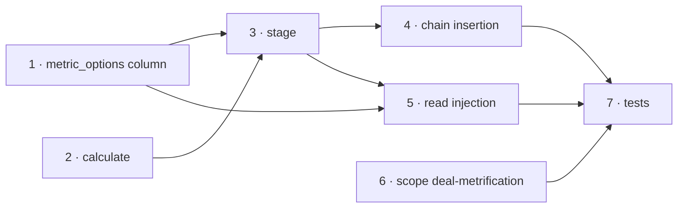

# TASKS — Commissioning metric (output variable)

> Reference: PLAN.md (§ Phase 6 — Materialization, § Phase 7 — Read path). Only the build lane is decomposed
> here: Phases 1–5, 8 and 9 carry no task. Phases 10–12 (rollout) follow the build and are listed last.
>
> **Status: DELIVERED (#5456), running on `beta-001`.** All seven tasks below shipped in one PR; the
> acceptance criteria are the build's targets. One divergence from the plan, in Task 5: the four consumers
> slice `metric_options` by `rule.formula.referenced_identifiers` rather than by `consumed_metric_ids` (same
> guarantee, simpler key source). Task 5's prescribed rename of the deal incentive's local `metric_options`
> to `deal_metric_options` was dropped, correctly — that local holds the metric-backed variables' options
> sliced from `modifier_options` (deal metrics), so `metric_options` is the accurate name; deal-stage metric
> options travel in `modifier_options` and commissioning-metric options in the new column, both legitimately
> metric options. Task 3 shipped as four boundary Producer/Consumer pairs under
> `app/workers/commissioning_metric/`, one per consuming stage, rather than one reused stage with four
> insertions.

## Decomposition

**Chosen option:** the plan's Phase 6/7 execution order — the new `metric_options` column, the aggregation,
the materialization stage (writes the `Indicator` and injects into `metric_options`), the four boundary
insertions, the read injection in the four consuming consumers, and scoping the deal-metrification flow off
commissioning metrics. One PR.

**Rationale:** the consuming rule reads variable values from `modifier_options`, a per-user-commission cache
built once before the deal stage and never rebuilt, so a fed-back commissioning metric cannot ride it. A
dedicated `metric_options` column carries the value from the boundary to the consuming rule. The
materialization stage mirrors the existing `Metric::` (deal-metrification) flow; the four insertion
boundaries are the four finalizers. `app` is Ruby, so the work rides the Ruby policy corpus (worker
topologies, `with_uncached_connection`, IDs-only, migrations-by-generator).

## Tasks

### Task 1: the `metric_options` column

- **Phase** (PLAN.md): 6, step 1.
- **Description:** add `metric_options` (jsonb, `null: false, default: {}`) to `user_commissions`, separate
  from `modifier_options` so a log distinguishes modifier variables from metric variables. Generate the
  migration (`bin/rails generate migration`), never hand-write it; run `db:migrate` and commit the refreshed
  `schema.rb` with the migration.
- **Dependencies:** none.
- **Acceptance criteria:**
  - [ ] `user_commissions.metric_options` exists, `null: false`, default `{}`, jsonb.
  - [ ] `schema.rb` regenerated and committed with the migration.
- **Pattern reference:** the existing `modifier_options` column on the same table (`db/schema.rb`).

### Task 2: `CommissioningMetric#calculate` — the aggregation

- **Phase** (PLAN.md): 6, step 2.
- **Description:** `CommissioningMetric#calculate(user_commission:)` returns the signed, type-agnostic
  `money + points` sum/average over the commissionings of the metric's `has_many :rules` for that user
  commission — `Commissioning.where(rule_id: rules, user_commission_id: user_commission.id)` — reduced by
  `calculation` (`sum`, or `average` dividing by the count of feeding commissionings), and the variable/metric
  default when there are none. The data source is commissionings, not deals, so the adapter *structure* is
  the sibling and the query is new.
- **Dependencies:** none (independent of Task 1).
- **Acceptance criteria:**
  - [ ] `money + points` gives the signed value: `+value` for every stage, `-value` for limiter.
  - [ ] The signed example closes: `300 + 200 − 100 = 400`.
  - [ ] `sum` and `average` each verified; `average` divides by the count of feeding commissionings.
  - [ ] No feeding commissioning → the variable/metric default, not zero-by-accident.
- **Pattern reference:** `app/models/deal_metric.rb:30` (structure); `app/models/commissioning.rb:60-70` and `app/models/limiter_commissioning.rb` (the signed `money`/`points`)
  ```ruby
  def money
    return 0 if rule.incentive.points?
    value
  end
  # LimiterCommissioning overrides money/points to `value * -1`
  ```

### Task 3: the materialization stage — `CommissioningMetric::Producer` / `::Consumer` / `::Finalizer`

- **Phase** (PLAN.md): 6, step 3.
- **Description:** a Producer/Consumer stage in the `Computation` chain — the Producer fans out one Consumer
  per user commission (× consumed metric) over the plan's scope and registers `queue`/`executions`; the
  Consumer computes Task 2, writes the durable `Indicator` (near-copy of `Metric::Consumer:39-63`,
  `compiled_at` the period start since the metric is per-plan, not per-interval), and **merges** the
  `{ variable.key => value }` pair into that user commission's `metric_options` (never a whole-hash
  overwrite); the Finalizer fires the next stage's Producer once the stage closes.
- **Dependencies:** Tasks 1, 2.
- **Acceptance criteria:**
  - [ ] Producer enumerates every user commission in the plan's scope (default-on-empty), not only those with commissionings.
  - [ ] The Consumer writes both the `Indicator` and the `metric_options` key; the merge preserves existing keys.
  - [ ] The stage's counters close before the consuming stage's Producer fires.
  - [ ] Class names are the topology (`Producer` / `Consumer` / `Finalizer`), never `Executor` / `Runner`.
- **Pattern reference:** `app/workers/metric/producer.rb`, `app/workers/metric/consumer.rb:39-72`
  ```ruby
  indicator.external = false
  indicator.value = value
  Indicator.with_uncached_connection { indicator.save! }
  # then: user_commission.update(metric_options: user_commission.metric_options.merge(key => value))
  commission.computation.increment_executions
  ```

### Task 4: chain insertion at the four consuming boundaries

- **Phase** (PLAN.md): 6, step 4.
- **Description:** at each consuming stage's boundary, read from `Plan::IncentiveCommissioningMetricMapping`
  which commissioning-metric variables the next stage consumes (filter `rows` by the next stage's `type`,
  flat-map `consumed_metric_ids`); when none, fire the next Producer directly (unchanged); when one or more,
  run the materialization stage first and let its Finalizer fire the original next Producer. Identical at all
  four; the only variance is which next Producer.
- **Dependencies:** Task 3.
- **Acceptance criteria:**
  - [ ] before indicator — `app/workers/deal_incentive/finalizer.rb:22` (`IndicatorIncentive::Producer`).
  - [ ] before ranking — `app/workers/indicator_incentive/finalizer.rb:22` (`Ranking::Producer`).
  - [ ] before limiter — `app/workers/ranking_incentive/finalizer.rb:22` (`UserCommission::LimiterOptionsProducer`).
  - [ ] before redemption — `app/workers/limiter_incentive/finalizer.rb:22` (`RedemptionIncentive::Producer`).
  - [ ] skip-when-none: a plan with no consumed commissioning metric produces a byte-identical chain.
- **Pattern reference:** `app/models/plan/incentive_commissioning_metric_mapping.rb:23` (the `rows` shape), `app/workers/limiter_incentive/finalizer.rb:22`
  ```ruby
  { type: incentive_types[incentive_id], consumed_metric_ids: consumed_metric_ids, produced_metric_ids: produced_metric_ids }
  ```

### Task 5: the read injection — sliced to the incentive's own metric keys

- **Phase** (PLAN.md): 6, step 5 / § Phase 7.
- **Description:** each of the four consuming consumers injects a **slice** of `metric_options` — only the
  variable keys the executing incentive consumes, never the whole hash — so a stage never receives another
  stage's metric variable. `consumed_keys` come from the incentive's consumed metrics
  (`rows[incentive_id][:consumed_metric_ids]` → `CommissioningMetric.joins(:variable).pluck(:key)`). This is
  the pattern the deal incentive already runs against `modifier_options` (`deal_incentive/consumer.rb:30-33`,
  #5441), applied to the metric column. Keep the two columns disjoint:
  `Commission::IndicatorOptionsProcessor` also excludes commissioning-metric variables from the
  `modifier_options` it builds. Rename the transactional incentive's local `metric_options`
  (`deal_incentive/consumer.rb:31`, `deal_incentive/period_processor.rb:21` — it holds the deal-metric
  variable values sliced out of `modifier_options`, a different concept from the new column) to
  `deal_metric_options`, so the plain `metric_options` name belongs to the commissioning-metric column
  and the two read cleanly side by side.
- **Dependencies:** Task 1 (column), Task 3 (population).
- **Acceptance criteria:**
  - [ ] `indicator_incentive/consumer.rb:29`, `ranking_incentive/consumer.rb:44`, `limiter_incentive/consumer.rb:44`, `redemption_incentive/consumer.rb:34` inject `metric_options.slice(*consumed_keys)`.
  - [ ] `Commission::IndicatorOptionsProcessor` (`app/services/commission/indicator_options_processor.rb:41-46`) skips commissioning-metric variables.
  - [ ] The transactional incentive's local `metric_options` is renamed `deal_metric_options` in both sites.
  - [ ] A metric consumed at any stage: the value the formula reads equals the materialized value, not the default.
  - [ ] A stage whose next-stage sibling consumes a different metric does NOT receive that other metric's key.
- **Pattern reference:** `app/workers/deal_incentive/consumer.rb:30-33` (the existing slice), `app/workers/limiter_incentive/consumer.rb:35,44`
  ```ruby
  # deal incentive, delivered #5441 — the slice this task mirrors onto metric_options:
  variables_keys = plan.metrics.where.not(type: 'CommissioningMetric').joins(:variable).pluck(:key)
  metric_options = user_commission.modifier_options.select { |key| variables_keys.include?(key) }
  ```

### Task 6: scope the deal-metrification flow to `DealMetric`

- **Phase** (PLAN.md): 6, step 6.
- **Description:** `plan.metrics` (`app/models/plan.rb:372`) returns every STI type, so the deal-metrification
  Producer/Sower currently pluck `CommissioningMetric` rows and the Consumer calls `metric.calculate`, which
  is undefined on `CommissioningMetric`. Scope the deal-metrification producer/sower to `DealMetric` so the
  deal flow materializes only deal metrics and the new stage owns commissioning metrics — the same `type`
  filter #5441 applied to deal consumption.
- **Dependencies:** none (independent; same PR).
- **Acceptance criteria:**
  - [ ] A plan carrying a `CommissioningMetric` runs the deal-metrification stage without touching that metric.
  - [ ] The deal-metrification stage still materializes every `DealMetric` exactly as before.
- **Pattern reference:** `app/workers/metric/producer.rb:18`, `app/workers/metric/sower.rb:18`
  ```ruby
  metric_ids = Metric.with_uncached_connection { plan.metrics.pluck(:id) }
  # scope to DealMetric so CommissioningMetric is not swept into deal-metrification
  ```

### Task 7: tests

- **Phase** (PLAN.md): 6, step 7.
- **Description:** cover the aggregate, the stage, the boundary insertion, the read injection, and the
  deal-metrification scoping. Read 2–3 sibling specs first; follow the project's RSpec/FactoryBot conventions.
- **Dependencies:** Tasks 1–6.
- **Acceptance criteria:**
  - [ ] Aggregate: `sum` and `average`, signed `money + points`, the `300 + 200 − 100 = 400` example.
  - [ ] Default-on-empty writes the default to `metric_options`; skip-when-none leaves the chain byte-identical.
  - [ ] A metric consumed at a later stage (ranking/limiter/redemption) reaches its consuming rule through `metric_options`.
  - [ ] Additive merge across two boundaries never drops a key; each stage injects only its own metric keys (the slice), never a sibling stage's.
  - [ ] Idempotency: running the materialization twice leaves every value unchanged.
  - [ ] The deal-metrification stage ignores commissioning metrics.

## Sequencing



## Rollout (after the build — PLAN.md Phases 10–12)

- **Backend deploy (Phase 10):** one zero-downtime deploy per environment; the queue-depth check gates a
  productive deploy. `beta-001` is deployed and under business test; `demo-001` and the two productive stacks
  (`shared-001`, `atento-001`) remain. The `metric_options` migration is additive (`null: false,
  default: {}`) and runs in the ephemeral migration task before the new code goes live; the `Computation` key
  derivation and existing job argument shapes are unchanged, so no phasing trigger fires.
- **Frontend release (Phase 11):** the `app-webclient` screens (delivered) display correct values once the
  materialization deploy lands; no code change.
- **Release (Phase 12):** no permission gate — the feature rides existing permissions.

## Cross-cutting concerns

- **Worker data access:** every stage worker wraps DB access in `with_uncached_connection`, passes IDs (not
  loaded objects), and decomposes joins — per the Data Processing / Data Access rules.
- **`metric_options` vs `modifier_options`:** two columns on `user_commissions`, disjoint by construction —
  modifiers in one, metrics in the other, so a log reads cleanly and no key ever collides (validation 2
  forbids a metric variable being consumed by more than one incentive type).
- **The `Indicator` write is the durable store, `metric_options` is the calc channel:** dashboards and
  statements read `indicators`; the consuming formula reads `metric_options`. Confirm `compiled_at` (the
  period start) against how a metric-variable indicator is read elsewhere when the code is written.
