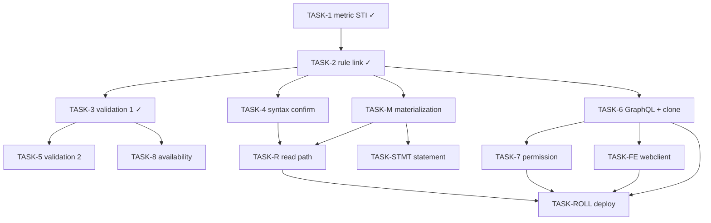

# TASKS — Commissioning-metric variables in `app`

> Reference: `PLAN.md` and `DOMAIN.md` in this directory. `DOMAIN.md` is the authoritative current-state
> model.
> Repositories: `~/Projects/4Shark/app` (backend) and `~/Projects/4Shark/app-webclient` (frontend),
> branch `develop` in both.
> Language classification: internal engineering doc → English (`LANGUAGE-POLICY.md`, category 1).

## Status — 2026-09-01

**The feature is built as a `Metric` specialization, not a fourth variable type.** A variable whose value
the system produces is an ordinary `IndicatorVariable` carrying a `CommissioningMetric` — a subtype of an
STI `Metric`, alongside `DealMetric`. `DOMAIN.md` is the authoritative model.

**Merged to `develop`:**

| PR | Delivered |
|----|-----------|
| #5348 | Register the produced variable on incentive save and roll it into the plan — superseded by the pivot below |
| #5431 | Specialize `Metric` into `DealMetric` / `CommissioningMetric` — the `metrics.type` STI discriminator |
| #5433 | Remove the output-variable type in favor of the commissioning metric; move the rule target `rules.output_variable_id` → `rules.commissioning_metric_id` |
| #5434 | Validation 1 — an incentive reading a commissioning-metric variable requires an earlier-stage incentive whose rule feeds that metric (the four `Incentivation::<Type>IncentivationMetricValidator`; error `metric_not_populated` on `:incentive_id`) |

Test-infra fixes #5429 and #5432 landed alongside (spec isolation; STI factory construction) — not
feature tasks.

**Remaining, in order:** validation 2 (single feeding type), materialization, read path, GraphQL surface +
permission, variable availability filter, the `app-webclient` half. The materialization/read design is the
critical unknown — see the open questions on TASK-M below.

---

## Tasks

Delivered tasks are recorded for traceability. Open tasks carry acceptance criteria plus the design
questions that must be answered when the task is picked up — the commissioning-metric mechanism for
materialization and the read path is not yet grounded in code.

### TASK-1 — `Metric` STI base + `DealMetric` / `CommissioningMetric` — DELIVERED (#5431)

`metrics.type` STI discriminator; existing rows backfilled to `DealMetric`. `Metric::TYPES`,
`Metric::CALCULATIONS = { total, quantity, sum, average }`, base validations `variable_type` +
`indicators_existence`. `CommissioningMetric` slices `sum | average`, `has_many :rules`, `validates
:calculation`. `DealMetric` slices `total | quantity`, keeps the interval columns and `#calculate`. No
fourth `Variable` type; `Variable::TYPES` unchanged.

### TASK-2 — Rule link `Rule belongs_to :commissioning_metric` — DELIVERED (#5433)

`rules.output_variable_id` → `rules.commissioning_metric_id`; `CommissioningMetric has_many :rules,
dependent: :nullify`. The output-variable type and its per-rule `output_variable_type` validation removed.

### TASK-3 — Plan validation 1 (feeder precedes reader) — DELIVERED (#5434)

`Incentivation#commissioning_metric` dispatches per incentive type to
`Incentivation::<Type>IncentivationMetricValidator` (`app/services/incentivation/`). Each reads the
incentive's read variables (`IncentiveVariable.where(incentive_id:)`), the metrics behind them
(`CommissioningMetric.where(variable_id:)`), and whether an earlier-stage incentive feeds each metric
(`Rule.where(incentive_id:, commissioning_metric_id:)`), filtering `marked_for_destruction?` in memory. A
metric with no earlier feeder adds `metric_not_populated` on `:incentive_id`. The per-validator
`INCENTIVE_TYPES` allow-lists encode the strictly-earlier stage order.

### TASK-4 — Rule syntax validation for a metric-fed key — OPEN (confirm)

- **Repository**: `app`
- **Description**: confirm a downstream rule referencing a metric-fed variable's key passes syntax
  validation on the four reading stages and is refused on the deal stage.
- **Acceptance criteria**:
  - [ ] A rule in an indicator/ranking/limiter/redemption incentive whose formula references a metric-fed
        variable's key saves; the key is in `Rule::Options`' permitted set for those stages.
  - [ ] A deal (formula) rule referencing that key is refused.
  - [ ] A genuinely unknown key still fails with the existing `unknown_variable` error.
- **Open questions**:
  - Because the metric-fed variable is an ordinary `IndicatorVariable`, its key may already be permitted by
    the existing indicator scope — verify whether any scope change is needed at all, or whether the task is
    purely tests.
  - If a metric-fed variable must be distinguished from a plain indicator variable at syntax time, that
    distinction is net-new.

### TASK-5 — Plan validation 2 (single feeding incentive type per metric) — OPEN (build)

- **Repository**: `app`
- **Description**: every incentive that feeds one commissioning-metric variable must be of a single
  incentive type, so the variable is written at one stage and holds one value per plan.
- **Acceptance criteria**:
  - [ ] A plan whose one metric is fed by two incentive types is rejected with an error on the
        `Incentivation`.
  - [ ] A plan whose metric is fed by several incentives of the same type is accepted.
  - [ ] Reading the variable downstream stays unrestricted, subject to validation 1.
- **Open questions**:
  - Dispatch shape: mirror validation 1's per-type validator family, or a single plan-level validation?
  - Whether a shared `Incentive::CALCULATION_ORDER` constant already exists (introduced with validation 1)
    or must be added here; a spec keeps it aligned to the enqueue graph.

### TASK-M — Materialization — OPEN (design + build; the critical unknown)

- **Repository**: `app`
- **Description**: a `CommissioningMetric`, per plan per user, aggregates the commissionings of its rules
  (sum or average) and writes the user's internal `Indicator` for the variable, signed.
- **Acceptance criteria**:
  - [ ] Several rules feeding one metric, and — subject to validation 2 — several same-type incentives,
        produce the expected aggregate per user.
  - [ ] A rule that evaluated to zero (wrote no commissioning) contributes nothing.
  - [ ] The engineer's worked example closes: 300 + 200 − 100 = 400, pinning the signed expression
        (`#money`/`#points`; limiter `value * -1`) against the raw `value` column.
  - [ ] Idempotent under retry: running the materialization twice leaves the value unchanged.
  - [ ] A reprocess clears and recomputes the metric-produced value.
- **Open questions (must be resolved first)**:
  - `CommissioningMetric` has no `#calculate` and there is no commissionings-aggregating adapter — both are
    net-new. What is the trigger (commissioning save inside the consumer, vs a stage boundary) and which
    worker writes the indicator?
  - Which store the metric-produced value lands in (`indicators` / `aggregated_indicators` /
    `indicator_aggregations`), so the read path finds it.
  - The `average` denominator: the count of feeding commissionings, confirmed.
  - The stale-read race: the aggregate must re-read inside its own transaction at write time.
  - Retry idempotency of the feeding commissionings is not uniform (indicator survives; limiter/ranking/
    redemption reconstruct) — bounds how much the aggregate can rely on rewritable rows.
  - Partial commissions: the zero-versus-absent semantics need checking against partials.

### TASK-R — Read path — OPEN (confirm)

- **Repository**: `app`
- **Description**: a consuming rule evaluates against the metric-produced value.
- **Acceptance criteria**:
  - [ ] A rule in an indicator/ranking/limiter/redemption incentive reading a metric-fed variable
        evaluates against the materialized indicator, not the default.
  - [ ] A plan with no commissioning-metric variable produces byte-identical options hashes to today.
- **Open questions**:
  - Because the value is the variable's internal `Indicator`, the existing indicator options path may
    already deliver it — confirm whether any new `Commission::<name>OptionsProcessor` / merge step is
    required, and in which reading consumers. Depends on TASK-M's store answer.

### TASK-6 — GraphQL authoring surface + clone round-trip — OPEN (build)

- **Repository**: `app`
- **Description**: expose the `commissioning_metric` binding on the rule create/update mutations and types,
  and close the clone gap.
- **Acceptance criteria**:
  - [ ] A `commissioning_metric` field on `RuleGraphqlType` and a matching `required: false` argument on
        `RuleInputGraphqlType` (the type name unchanged; every argument there is optional today).
  - [ ] Both mutation rule allow-lists carry the new argument — `create_incentive_graphql_mutation.rb`
        (`rules: %i[ description type value ]`) and `update_incentive_graphql_mutation.rb`
        (`rules: %i[ _destroy description id type value ]`).
  - [ ] A field on `IncentiveGraphqlType` distinguishing fed vs read metric variables, for the plan picker.
  - [ ] A clone carrying a binding round-trips through `CreateIncentiveGraphqlMutation` with the binding
        intact (clone is a UI action through the create mutation — no backend clone mutation).
  - [ ] No new mutation; creating the variable is unchanged.
- **Open questions**:
  - The exact field/argument names.
  - Whether the `CommissioningMetric` itself is created through its own mutation/screen or as part of the
    incentive/rule save.

### TASK-7 — The binding permission — OPEN (build)

- **Repository**: `app`
- **Description**: the permission that makes the feature reachable by nobody until granted (the release
  toggle).
- **Acceptance criteria**:
  - [ ] A migration creates the `Action` row in the established pattern
        (`Action.create!(key: ..., level: 'module', resource: 'incentive')`), and the key is added to the
        hardcoded `MODULE_KEYS` list in `app/workers/company/admin/processor.rb` **in the same deploy** — a
        key in `MODULE_KEYS` with no `Action` row raises `RecordNotFound` and the processor dies.
  - [ ] A policy method on `IncentivePolicy` following the sibling shape.
  - [ ] The permission is granted to nobody; the non-idempotency of `Action.create!` is recorded as a code
        comment in the migration.
- **Open questions**: the permission key name.

### TASK-8 — Variable availability by incentive type — OPEN (design + build)

- **Repository**: `app`
- **Description**: a commissioning-metric variable is excluded from the deal (transactional) incentive and
  selectable as a rule's feeding target elsewhere.
- **Open questions**: no per-incentive-type variable-availability filter exists in the models today; where
  it lives (a new model scope vs the GraphQL/API layer) is undecided (DOMAIN.md § Remaining work).

### TASK-FE — `app-webclient` authoring surface — OPEN (build)

- **Repository**: `app-webclient`
- **Description**: bind a commissioning metric on a rule, replicate across an incentive's rules, pick
  compatible incentives on the plan, and create a commissioning-metric variable.
- **Acceptance criteria**:
  - [ ] The binding can be set, edited and **cloned** on all five incentive types (the clone flows carry it,
        per TASK-6's clone gap).
  - [ ] A replicate action sets one rule's binding across the incentive's rule array.
  - [ ] The plan picker offers only compatible incentives (UX; validation 1 is the guarantee).
- **Open questions**:
  - There is no fourth variable type to offer — creating a commissioning-metric variable is creating an
    `IndicatorVariable` and attaching a `CommissioningMetric`. Whether this is a new screen, an extension of
    the variable screen, or folded into the incentive/rule flow depends on TASK-6.

### TASK-STMT — Statement display — OPEN (build)

- **Repository**: `app` + `app-webclient`
- **Description**: the three marks the engineer named (the metric variable in the upper listing with its
  composed value; every feeding commissioning marked with the variable it fed; every commissioning whose
  rule reads a metric-fed variable marked as calculated on one). The declaration is signed, so a value
  influencing payment without appearing is signed unseen — the legal requirement.
- **Open questions**: the GraphQL exposure of the composition and the two statement screens' changes; sized
  after TASK-M/TASK-R settle where the value and its provenance live.

### TASK-ROLL — Deploy, release, permission grant — OPEN (engineer-run)

Backend deploy per environment (beta → demo → shared → atento; productive stacks gated by the Sidekiq
queue check), then the frontend Netlify release, then the permission grant one account at a time. The
delivered migrations are already in `develop`; the only migration still owed is TASK-7's permission
`Action` row. Running the deploy and the grant is the engineer's — actions outside version control.

---

## Sequencing

**Delivered:** TASK-1, TASK-2, TASK-3. **Critical unknown:** TASK-M (materialization) — TASK-R, TASK-STMT
and the productive rollout all wait on its design. **Independent lanes** once the model is in place:
validation 2 (TASK-5), the GraphQL/permission/FE lane (TASK-6 → TASK-7/TASK-FE), the availability filter
(TASK-8), and the materialization/read lane (TASK-M → TASK-R). The lanes converge at the deploy.

## Cross-cutting concerns

- **Tests belong to the task that introduces the code** — the delivered tasks carry their specs
  (`spec/models/plan_spec.rb` for validation 1); each open task carries its own.
- **Data access** on every worker follows `~/.claude/docs/DATA-ACCESS.md` — `with_uncached_connection`,
  IDs not loaded objects, associations navigated per record. This binds TASK-M and TASK-R specifically.
- **The changelog entry** lands once per repository (feature-level, not per PR), naming the capability.
- **No `## Decisions` block in any PR body** — a resolved decision goes in a code comment at the line
  (`DECISION-AUTHORITY.md`, `PULL-REQUEST-CONVENTIONS.md`).
