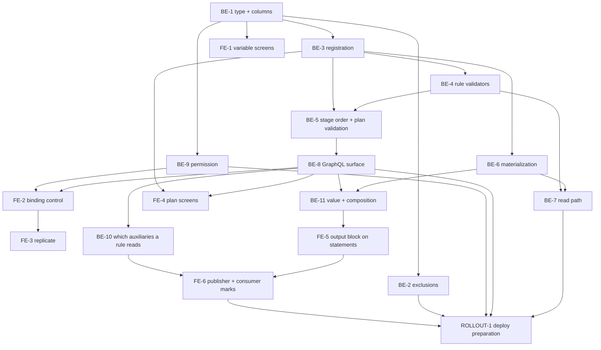

# TASKS — Output (output) variables in `app`

> Reference: `PLAN.md` (engineer-approved) in this directory; derived from `TASKS-SPIKE.md` and its
> evidence files `output-variables_call-sites_1.md`, `output-variables_pipeline_2.md`,
> `output-variables_rollout_3.md`.
> Repositories: `~/Projects/4Shark/app` (backend) and `~/Projects/4Shark/app-webclient` (frontend),
> branch `develop` in both.
> Language classification: internal engineering doc → English (`LANGUAGE-POLICY.md`, category 1).

## Decomposition

**Chosen option:** **twenty discrete units of work, each one PR's worth** — BE-1 through BE-11 in
`app`, FE-1 through FE-8 in `app-webclient`, and ROLLOUT-1, which produces a document in this feature
directory and touches neither repository.

**Rationale:** `PLAN.md` settles every technical decision — fifteen of them, each with the source
that resolved it. Nothing here reopens one. This document turns the twelve execution phases into
twenty tasks with real dependencies and checkable completion criteria.

Each row below is a fork where the work could reasonably have been cut more than one way, the shape
chosen, and the source that decided it. Every one is visible in a PR diff and correctable at review,
so each passes the reversibility gate in `DECISION-AUTHORITY.md`.

| # | Fork | Resolved | Source |
|---|---|---|---|
| D1 | Phase 1 as one task, or split into type / role column / rule binding | **One task (BE-1).** | `PLAN.md:71-93` states one objective and one dependency line ("Dependencies: none. Blocks every other phase") for the whole phase. Reviewability confirms it: each third is unjudgeable alone — a reviewer seeing "add a `role` column defaulting to input" with no fourth type in the diff cannot assess it. The combined diff is ~15 files of declarations, read in one pass |
| D2 | The Calculator re-entry guard (`aggregated_indicator/calculator/producer.rb:20-21`) in the exclusions task or the materialization task | **Materialization task (BE-6).** | `PLAN.md:212` lists it under Phase 6 components, and its failure mode ("a silently zeroed output value", `PLAN.md:380`) is a materialization failure, not an exclusion failure. Its criterion is only meaningful once output rows exist |
| D3 | The plan-finish goal suppression — backend or frontend | **Split by repository.** Backend half (the output `plan_variable` validates with a blank `goal_type` and is distinguishable through the API) in BE-3; frontend half (the screen stops rendering the goal control) in FE-4 | `PLAN.md:69` puts phases 1-8 in the backend deploy and phase 9 in the frontend release, so the halves cannot ship together. `PLAN.md:188` sets the precedent for which half is the guarantee: "The plan picker filtered to compatible incentives (Phase 9) is the preventive form and is UX, not the guarantee" |
| D4 | Phase 6 as one task, or the recompute mechanism + indicator writer first, then the other three writers | **One task (BE-6).** | `PLAN.md:224` makes the engineer's worked example a Phase 6 success criterion: "two positive contributions and one limiter contribution of the same magnitude publish 300 + 200 − 100 = 400". That criterion needs the limiter writer, so a first PR carrying only the indicator writer could not satisfy the phase's own acceptance test |
| D5 | Phase 8 as one task, or the GraphQL surface separated from the permission | **Two tasks (BE-8, BE-9).** | `PLAN.md:378` and `PLAN.md:386` assign the two halves different failure modes and different mitigations — "A cloned incentive silently loses its output bindings" (High) versus "M4's `Action.create!` is re-applied" (Low, a re-run hazard). A PR whose entire subject is "the binding survives create/update/clone" gets the review attention the first risk warrants; the permission PR's subject is a non-idempotent data migration needing a different kind of scrutiny. They still ship in the same deploy, so nothing is lost |
| D6 | Phase 9 as one frontend task, or split | **Four tasks (FE-1..FE-4).** | `PLAN.md:290-294` lists three independent success criteria, and the variable-creation screen has a fourth, separate dependency profile: `PLAN.md:266` records that "creating an output variable needs no mutation change", so FE-1 depends only on the type existing, while FE-2/FE-3 depend on the new GraphQL argument and FE-4 on the new `role` field. Splitting turns one 20-file diff into four coherent ones with distinct reviewers' contexts |
| D7 | The two plan screens (create picker, finish goal control) as one task or two | **One task (FE-4).** | Both depend on the same backend deploy, both live in the plan authoring flow, and each is small on its own. § No Premature DRY's converse applies — do not split what only makes sense reviewed together |
| D8 | The name of the STI subclass, its scope, and its data-type allow-list | **`OutputVariable`, `scope :output`, `ApplicationDataType::OUTPUT_TYPES`.** | The surrounding code (`DECISION-AUTHORITY.md` ladder, source 2). `app/models/variable.rb:4` declares `TYPES = %w[DealVariable IndicatorVariable EasyVariable]`; `:47`, `:49`, `:58` declare `scope :deals` / `:easy` / `:indicators` in one shape; `app/data_types/application_data_type.rb:4-6` declares `DEAL_TYPES` / `INDICATOR_TYPES` / `EASY_TYPES`. The fourth member follows mechanically |
| D9 | The name of the new options processor | **`Commission::OutputOptionsProcessor`, at `app/services/commission/output_options_processor.rb`.** | The sibling files in that directory are `deal_options_processor.rb`, `deal_options_v2_processor.rb`, `indicator_options_processor.rb`, `limiter_options_processor.rb`, `ranking_options_processor.rb`, `redemption_options_processor.rb` — each named for what it supplies. (Correction recorded: `PLAN.md:235` says "alongside the four existing ones"; `ls app/services/commission/` returns six files. The naming pattern is unaffected) |
| D10 | The permission key, level and resource | **`key: 'incentive_output_variable_binding'`, `level: 'module'`, `resource: 'incentive'`.** | The `MODULE_KEYS` grammar at `app/workers/company/admin/processor.rb:15-52` is `<resource>_<action-noun>` with multi-segment resources already present (`user_identifier_action_document_creation`, `:35-36`). `level: 'module'` because the permission gates a capability rather than a per-record action — the contrast is `db/migrate/20260729113439_user_update_document_actions.rb:5-8`, where `*_listing` / `*_creation` are `level: 'module'` and `*_destruction` / `*_download` are `level: 'resource'`. `incentive_clone` (`processor.rb:31`) is the closest sibling and is module-level, gated by `IncentivePolicy#clone?` (`app/policies/incentive_policy.rb:28-33`) |
| D11 | Where the CHANGELOG entry lands across a 9-PR backend feature | **On the first task of each repository — BE-1 for `app`, FE-1 for `app-webclient` — named once and not duplicated.** | § Changelog Policy requires every feature branch to update the changelog and requires entries to "name the subject, nothing else". The observed granularity is feature-level, not PR-level: `app/CHANGELOG.md:26` is "Bulk user update by spreadsheet", one entry naming one capability. It sits under `## [3.60.0] - 2026-07-30` — a **released, dated** section, so it is the shipped shape of an entry rather than a work-in-progress one, which is what makes it the granularity to copy. Nine entries for one capability would violate the succinctness rule. Landing it first means no branch ships the capability before it is recorded |
| D12 | Where the incentive-CSV-import limitation is recorded | **In the `## Decisions` block of BE-1's PR description.** | § Decision Authority makes that block mandatory for a resolved ambiguity a reviewer would want to know about, and BE-1 is where the binding is introduced — the point a reader asks why the CSV cannot set it. `PLAN.md:32` already carries the reasoning and the citation (`app/workers/incentive_document/processor.rb:81-86`). No new document file, per § Scope Discipline |

---

## Tasks

### BE-1 — The fourth variable type, the two new columns, and their model declarations

- **Repository**: `app`
- **Phase** (`PLAN.md:71-93`): Phase 1, schema and model, inert
- **Description**: create the output `Variable` type and its STI subclass, the `role` column on
  `incentive_variables`, the output binding on `rules`, and the unique index that guarantees the
  role pair. Nothing reads or writes any of it yet. This is the only task with no dependency and it
  blocks every other task.
- **Dependencies**: none
- **Acceptance criteria**:
  - [ ] Three migrations, each generated with `bin/rails generate migration` (never hand-written —
        `validate-rails-migration-creation.sh` blocks the Write), one action each, then applied with
        `bin/rails db:migrate`; `db/schema.rb` committed in the same commit.
  - [ ] **M1 carries a database-level default equal to the input role, and this is the task's
        load-bearing constraint, not a style point.** During the deploy window the schema is new and
        every serving container still runs the old code (`output-variables_rollout_3.md:210-220`,
        reading `deploy-shared-001.yaml:403-458` against `:616-621`). That old code calls
        `incentive_variables.create(variable_id: variable.id)` with no role at
        `app/models/incentive.rb:156`, `:160`, `:164`, `:168`, and it runs against the OLD model
        class, which carries no `enumerize` declaration — so an `enumerize`-level default does not
        reach it and only the column default does. Verify by confirming `db/schema.rb` shows the
        integer default on `incentive_variables.role`, and that a bare
        `IncentiveVariable.create(incentive_id: …, variable_id: …)` produces a row whose role is the
        input role.
  - [ ] **M2 uses the documented safe form for adding a reference to an existing table, names its
        target table explicitly, and carries no `safety_assured`.** The shape is
        `t.references :output_variable, null: true, index: { algorithm: :concurrently }, foreign_key: { to_table: :variables, validate: false }`
        with `disable_ddl_transaction!`. Both halves are load-bearing. **The safe form** —
        `index: { algorithm: :concurrently }`, `foreign_key: { validate: false }` and
        `disable_ddl_transaction!` — is what `RAILS-MIGRATIONS.md:227` names for exactly this
        operation; `safety_assured` is the override for a real risk with no safe variant ("If you
        just wrote `safety_assured`, your first question is 'is there a safe form I should use
        instead?'", `:231`; "Never use it to silence the warning on an operation that has a safe form
        (the table above) — fix the operation instead", `:245`). An existing migration in the
        repository using `safety_assured` for this shape is not a justification — a precedent does
        not override the convention. **`to_table: :variables` is not optional**: the reference is
        named for its role (`output_variable`) while its target table is `variables`, and Rails
        pluralizes the reference name to derive the target table when `to_table:` is absent — so
        without it the migration asks for a foreign key to a nonexistent `output_variables` table and
        fails on the first `db:migrate`. The convention already covers this case;
        `RAILS-MIGRATIONS.md:64` is `t.references :owner, null: true, foreign_key: { to_table: :users }, index: true`,
        the same role-differs-from-table shape.
  - [ ] **M2 stays ONE migration — no follow-up `validate_foreign_key`.** `RAILS-MIGRATIONS.md:228`
        splits a **validated** FK add into `add_foreign_key ..., validate: false` plus a separate
        `validate_foreign_key`; that split exists to avoid validating existing rows under a lock.
        `rules.output_variable_id` is a new nullable column, so every pre-existing row holds `NULL`
        and no row can violate the constraint — there is nothing for a validation pass to check.
        Confirmed by the diff containing exactly three migrations.
  - [ ] M3 adds the unique index on `incentive_variables (incentive_id, variable_id, role)` with
        `disable_ddl_transaction!` **and** `algorithm: :concurrently` together —
        `validate-concurrent-index-migration.sh` blocks the write otherwise, and the pair always
        fails in Postgres when split. M3 runs after M1; the index references the column M1 creates.
        Precedent: `db/migrate/20260729113429_add_unique_index_to_user_update_document_enrollments.rb:2-11`.
  - [ ] `Variable::TYPES` (`app/models/variable.rb:4`) gains the fourth member and a
        `scope :output` joins the three at `:47`, `:49`, `:58`.
  - [ ] `OutputVariable < Variable` mirrors `app/models/easy_variable.rb` — the two
        `rescue_unique_constraint` declarations plus a `data_type` inclusion drawn from a new
        `ApplicationDataType::OUTPUT_TYPES` alongside the three at
        `app/data_types/application_data_type.rb:4-6`. The type constrains `default` to zero
        (`PLAN.md:368`); `validates :default, presence: true` (`app/models/variable.rb:35`) still
        applies, while the three indicator-only validations at `:32`, `:36` and `:39` do not,
        because each is `if: :indicator?`.
  - [ ] `Rule` gains `belongs_to :output_variable, class_name: 'Variable', optional: true` with **no**
        manual presence validation — the binding is optional (`PLAN.md:360`), which is the one case
        where § Optional belongs_to's companion `validates … presence: true` is deliberately absent.
  - [ ] `IncentiveVariable` gains the role `enumerize` and a presence validation joining the two at
        `app/models/incentive_variable.rb:7-8`.
  - [ ] **Tests, in this task's own PR.** `spec/models/variable_spec.rb:35` currently reads
        `it { is_expected.to validate_inclusion_of(:type).in_array(%w[DealVariable EasyVariable IndicatorVariable]) }`
        and fails by construction against a fourth type — editing it is required, not a regression.
        A new `spec/models/output_variable_spec.rb` mirrors
        `spec/models/easy_variable_spec.rb` (145 lines of shoulda-matchers plus method blocks) and
        asserts the data-type allow-list and that the three indicator-only validations do not fire.
        `spec/models/incentive_variable_spec.rb` (10 lines today) gains the role presence and
        `enumerize` assertions.
  - [ ] Factories: `spec/factories/variables.rb` gains an `:output` trait alongside `:indicator`
        and `:deal`; `spec/factories/rules.rb` gains the output binding;
        `spec/factories/incentive_variables.rb` is a bare `factory :incentive_variable` today and
        gains the role.
  - [ ] `CHANGELOG.md` gains one entry under `## [Unreleased]` → `### Added`, naming the capability
        in user terms with no class, method, file or column named (§ Changelog Policy). Per D11 this
        is the only `app` entry for the feature.
  - [ ] The PR's `## Decisions` block records D8, D12, and the deliberate absence of a presence
        validation on `output_variable_id`.
- **No `def self.statement_timeout` on any of these migrations, and that is deliberate**:
  `RAILS-MIGRATIONS.md:141` prescribes a per-migration `statement_timeout` method, but it is inert at
  the installed version — `strong_migrations` reads the **global** `StrongMigrations.statement_timeout`
  (`lib/strong_migrations/checker.rb:193-194`) and nothing reads a method on the migration class,
  while `app/config/initializers/strong_migrations.rb` sets only `StrongMigrations.auto_analyze = true`,
  so the global is never assigned. Do not add the method back as dead code; a doc fix is open
  separately.
- **Pattern references**:
  - `app/models/easy_variable.rb` (whole file, 8 lines) — the STI subclass shape this copies.
  - `RAILS-MIGRATIONS.md:64` — `t.references :owner, null: true, foreign_key: { to_table: :users }, index: true`,
    the role-differs-from-table shape M2 follows.
  - `db/migrate/20260729113429_add_unique_index_to_user_update_document_enrollments.rb:2-11` — the
    concurrent-index shape.
  - `db/schema.rb:1959-1961` — a variable-bearing FK already on `rules` (`variable_track_id` and its
    partial unique index), so M2's shape has precedent in the same table.

### BE-2 — Exclude output variables from the unscoped existing flows

- **Repository**: `app`
- **Phase** (`PLAN.md:94-116`): Phase 2, exclusions. Independently valuable — this is the task that
  contains the blast radius.
- **Description**: fifteen call sites already read through `variables.deals` / `.indicators` /
  `.easy` and exclude a fourth type with no code change (full inventory,
  `output-variables_call-sites_1.md:16-32`). Six unscoped sites need a scope; five are left
  unscoped deliberately. This task is the regression net for every other task.
- **Dependencies**: BE-1 merged — the type must exist before a scope can exclude it.
- **Acceptance criteria**:
  - [ ] `app/workers/calendar_audit/producer.rb:19` is scoped. Its fan-out at `:20` is
        `period_ids.product(user_ids, variable_ids)`, so each unscoped output variable adds
        `periods × users` audit jobs per plan.
  - [ ] `app/models/calendar_audit.rb:30` (`PlanVariable.where(plan_id: plan_ids).count`, the
        audit's expected row count) excludes auxiliaries. An output variable has no integration
        source, so counting it as expected produces a permanent false gap.
  - [ ] `app/workers/goal_dataset/migration/producer.rb:16` is scoped.
  - [ ] `app/workers/commission/money_sanitizer_processor.rb:48` is scoped.
  - [ ] `app/work_books/commission_work_book/indicator_work_sheet.rb:29` and
        `app/work_books/plan_slice_commission_work_book/indicator_work_sheet.rb:36` each get
        `.indicators` on the lookup. Both files already gate on `variables.indicators.exists?` at
        their line 12, so scoping the lookup restores the file's own declared subject rather than
        changing it.
  - [ ] **Five sites are left untouched, and the PR says so explicitly** —
        `app/work_books/variable_audit_work_book/variables_work_sheet.rb:28` (a configuration catalog
        with a type column that already renders blank frequency for deal and easy variables, `:15-38`);
        `app/services/commission/indicator_options_processor.rb:41` (left unscoped deliberately —
        BE-7 depends on output keys landing in the frozen snapshot carrying their default, so a
        consuming formula never hits the unbound-variable path at runtime); and
        `app/workers/company/inactivator.rb:107`, `app/workers/company/activator.rb:110`,
        `app/workers/company/cleansing/variable_producer.rb:13`, whose purpose is covering every
        variable of a company.
  - [ ] **Tests.** The two workbook changes are covered where the repository tests workbooks
        (`spec/work_books/`). The four worker/model changes have no spec home — `spec/` contains
        `factories`, `forms`, `models`, `requests`, `search_indexes`, `work_books` and **no
        `spec/workers/` directory** (see § Test surface). `app/models/calendar_audit.rb:30` is model
        code and is asserted in `spec/models/` that a plan carrying an output variable does not
        raise the expected count. The three producer scopes are verified on `beta-001` under
        ROLLOUT-1, which is where PLAN.md already places end-to-end confirmation.
- **Pattern reference**: `app/workers/aggregated_indicator/producer.rb:23,25` —
  `Variable.with_uncached_connection { plan.variables.easy.pluck(:id) }`, the already-scoped shape
  each unscoped site is being brought in line with.

### BE-3 — Register output variables on incentive save, and carry them into the plan roll-up

- **Repository**: `app`
- **Phase** (`PLAN.md:118-134`): Phase 3, registration
- **Description**: saving an incentive records its inputs and its outputs, each with the right role.
  Output variables reach `plan_variables` — the read path requires them there — with goal binding
  suppressed for the type on the backend side.
- **Dependencies**: BE-1 merged (`PLAN.md:128`) — BE-1 is the only task with no dependency and it
  blocks every other task.
- **Acceptance criteria**:
  - [ ] `Incentive#update_variables` (`app/models/incentive.rb:149-175`, the `after_save` callback
        declared at `:80`) writes output rows with the output role alongside the input rows it writes
        today. The method opens with `incentive_variables.delete_all` at `:150`, so a spec asserts
        the rebuild does not drop outputs.
  - [ ] **The ranking branch is the named hazard and gets its own assertion.**
        `app/models/incentive.rb:172` is
        `incentive_variables.find_or_create_by(variable_id: variable.id) if …` — with no role scope,
        that call can find an output row and skip creating the input row. A spec covers an incentive
        whose variable is both an input of one rule and an output of another and asserts **both**
        rows exist. M3's unique index (BE-1) is where the defect would surface if the scope is
        missed.
  - [ ] An output variable reaches `plan_variables`. `Plan#create_variables`
        (`app/models/plan.rb:434-436`) populates it from `variable_ids` (`:438-445`), which is
        unscoped, so this is verification rather than a change — the spec pins it so a later scope
        cannot silently remove it.
  - [ ] The output `plan_variables` row validates with a blank `goal_type`.
        `PlanVariable#goals_presence` (`app/models/plan_variable.rb:32-39`) opens with
        `return if goal_type.blank?`, so this holds today; the spec pins it.
  - [ ] The backend half of goal suppression: the plan-finish path can distinguish an output
        `plan_variable`. `PlanVariableInputGraphqlType` declares both arguments `required: true`
        (`app/graphql_types/plan_variable_input_graphql_type.rb:4-5`) and is consumed by
        `finish_plan_graphql_mutation.rb:5` as `plan_variables_attributes`. The frontend half —
        not rendering the goal control — is FE-4 (decision D3).
  - [ ] **Tests.** `spec/models/incentive_spec.rb` (108 lines, association matchers only today)
        gains a `describe '#update_variables'` block; the shape to copy is
        `spec/models/deal_variable_spec.rb:50-62`, and 48 of the 284 model specs already use it.
        `spec/requests/graphql_mutations/graphql_controller_finish_plan_spec.rb` covers the
        finish path with an output variable present.
- **Follow-up recorded, not fixed**: `Incentive#update_variables` opens with
  `incentive_variables.delete_all` (`app/models/incentive.rb:150`), the shape § Bulk Delete asks to
  avoid. It is pre-existing code this task does not introduce, so § Scope Discipline category 3
  applies — a follow-up, kept out of this task's diff.

### BE-4 — Bind output keys in the `Rule` syntax validators

- **Repository**: `app`
- **Phase** (`PLAN.md:136-178`): Phase 4, the blocker
- **Description**: **this is a prerequisite for the read side, not polish** — a rule whose formula
  references an output variable key must be able to save at all. The shape of the work is an
  extension of one class, not a rewrite of the validators: commit `ad88b4616` (2026-08-04,
  *"validate the variables a formula references on every branch"*) extracted the permitted-identifier
  set into `Rule::Options` (`app/models/rule/options.rb`) and replaced formula evaluation against a
  synthetic hash of random values with a name comparison — `unknown_identifier(rule_options.identifiers)`
  (`app/models/rule.rb:80-81,101-103`), which reports `:unknown_variable` carrying the offending name.
  So the whole task is: teach `Rule::Options` about output variables, for the rule types that may
  read one.
- **The branch structure is the one design point.** `Options#identifiers`
  (`app/models/rule/options.rb:37-45`) has three branches — formula rules, easy-company indicator
  rules, and an `else` that covers indicator, ranking, limiter and redemption together. Output
  keys belong to ranking, limiter and redemption but **not** indicator (the indicator stage writes
  and does not read, `PLAN.md:45`), so the `else` branch cannot simply gain a fourth term. The
  per-type table `BUILT_IN_VARIABLES_BY_TYPE` (`:14-24`) is already keyed by rule class name and is
  the natural place to express which types may read one.
- **Dependencies**: BE-3 merged — the validator needs to know which output variables the company
  has (`PLAN.md:173`).
- **Acceptance criteria**:
  - [ ] `Rule::Options` answers with the company's output variable keys for the three rule types
        that may read one — `RankingRule`, `LimiterRule`, `RedemptionRule` — following the shape of
        its sibling queries, which every one of them plucks keys rather than loading records
        (`app/models/rule/options.rb:52-78`).
  - [ ] `IndicatorRule` and `FormulaRule` are **not** given output keys — the indicator stage
        writes but does not read (`PLAN.md:45`). This is the assertion that the `else` branch at
        `app/models/rule/options.rb:43` was split rather than extended.
  - [ ] A rule referencing an output key saves through the incentive mutation, on the incentive
        types that may read one. Asserted in
        `spec/requests/graphql_mutations/graphql_controller_create_incentive_spec.rb`.
  - [ ] A rule referencing a genuinely unknown key still fails with
        `errors.add(:value, :unknown_variable, variable: <name>)` (`app/models/rule.rb:103`) — the
        negative case, without which the change could be an unconditional bind. Asserted in
        `spec/models/rule_spec.rb` and `spec/models/rule/options_spec.rb`.
  - [ ] An output key is offered only to a company that has one — the query is company-scoped
        like every sibling in `Rule::Options`, so a company with no output variables sees an
        unchanged permitted set.
  - [ ] Runtime behaviour is confirmed unchanged: `calculate` returns `0` on a parse exception
        (`app/models/rule.rb:58-62`), so a missing output value at calculation time yields zero
        rather than an error.
- **Pattern reference** — `app/models/rule/options.rb:76-78`, the sibling query this one is modelled
  on. It plucks keys and returns names; there is no value to fabricate, which is what makes the task
  small:
  ```ruby
  def easy_variables
    company.variables.easy.enabled.pluck(:key)
  end
  ```

### BE-5 — The stage-order constant and the plan-level exporter validation

- **Repository**: `app`
- **Phase** (`PLAN.md:180-196`): Phase 5
- **Description**: a plan whose incentive reads an output variable is rejected unless another
  incentive in the same plan, in a strictly earlier stage, exports it. The calculation order has no
  representation in code today — it exists only in the enqueue graph across 41 call sites
  (`output-variables_pipeline_2.md:69-115`), and `Incentive::TYPES`
  (`app/models/incentive.rb:15`) is declared in a different order carrying no ordering semantics.
- **Dependencies**: BE-3 and BE-4 merged (`PLAN.md:190`).
- **Acceptance criteria**:
  - [ ] `Incentive::CALCULATION_ORDER` expresses Deal → Indicator → Ranking → Limiter → Redemption.
        **The enqueue graph remains the source of truth for execution; the constant becomes the
        source of truth for validation only** (`PLAN.md:186`).
  - [ ] A spec asserts `CALCULATION_ORDER` matches the observed enqueue chain. This is the sync
        mechanism that answers the "nothing keeps them in sync" objection and is the mitigation
        `PLAN.md:382` names for the drift risk — without it the constant is a second, silently
        divergent representation.
  - [ ] `Plan#output_variable_requirements` joins the four custom validations at
        `app/models/plan.rb:58-61`, modelled on its structural twin `redemption_incentive_requirements`
        (`:389-398`), which also reasons over the plan's incentive set and adds to `:incentivations`.
  - [ ] **Two details differ from the twin and each has a consequence.** It reads `incentive_ids`
        (`app/models/plan.rb:421-425`), which rejects incentivations marked for destruction — the
        twin uses `incentivations.map(&:incentive_id)` (`:392`) and does not. And the error is added
        to `:incentivations` with **no dot**, because `PlanDocument::Consumer` skips only attributes
        starting with `incentivations.` (`app/workers/plan_document/consumer.rb:212`,
        `next if attribute.to_s.start_with?('incentivations.')`) — a dotted key would be swallowed
        by the bulk plan import.
  - [ ] Validation branches covered, all five: reader with no exporter; reader with an exporter in
        the same stage; reader with an exporter in a later stage; reader with an exporter in an
        earlier stage; two exporters into one variable.
  - [ ] The bulk plan import surfaces the error rather than swallowing it — asserted against
        `PlanDocument::Consumer`, which builds plans from a spreadsheet at
        `app/workers/plan_document/consumer.rb:158` and `:209`.
  - [ ] **Tests** land in `spec/models/plan_spec.rb` (58 lines today) and
        `spec/requests/graphql_mutations/graphql_controller_create_plan_spec.rb` /
        `..._update_plan_spec.rb`.

### BE-6 — Materialize the per-`(user_commission, variable)` output value

- **Repository**: `app`
- **Phase** (`PLAN.md:198-226`): Phase 6. The largest task and the one carrying the feature's
  correctness risk.
- **Description**: at commissioning save, inside the existing consumers, recompute
  `value = SUM(commissionings of the rules bound to this variable, for this user commission)` and
  write it into `aggregated_modifiers`. No new worker, no new `Computation` participation, no edit
  to the enqueue graph.
- **Dependencies**: BE-3 merged. **Independent of BE-4 and BE-5** (`PLAN.md:218`), so this and BE-7
  form a lane that runs beside them.
- **Acceptance criteria**:
  - [ ] **Recompute, never `+=`.** Every `(user_commission, rule)` pair is an independent job
        (`app/workers/indicator_incentive/producer.rb:22`,
        `combinations = user_commission_ids.product(rule_ids)`), so a read-modify-write on a shared
        row loses updates; and Sidekiq is at-least-once, so `+=` is not idempotent while the
        recomputed sum is idempotent by construction.
  - [ ] **The read-then-write is wrapped in a transaction with a row lock — a unique index and an
        upsert do NOT close this race.** Two consumer jobs for two rules bound to the same output
        variable each compute their `SUM` from a separate `SELECT`; under Read Committed the later
        write overwrites the earlier with a lower number, silently, and on payroll figures. The shape
        is `transaction { lock!; recompute the sum; write }` on the `aggregated_modifiers` row.
        **Decided by 4Shark's own precedent** (`DECISION-AUTHORITY.md` ladder, source 2), and the
        precedent is explicitly about money: `Reward#increment_budget` wraps its read-modify-write in
        exactly this shape — `transaction do` … `lock!` … `end` at `app/models/reward.rb:65-71`,
        inside the method at `:61-75`. It stays in ActiveRecord (`transaction`, `lock!`,
        `find_or_create_by`, `update`), so no raw-SQL authorization is needed
        (§ ActiveRecord Query Discipline, rule 1).
  - [ ] **The unique index still matters and stays.** `aggregated_modifiers_unique_index` on
        `(user_commission_id, variable_id)` (`db/schema.rb:86`) is what makes the
        `find_or_create_by` half safe against a duplicate insert racing between its `SELECT` and its
        `INSERT`. The lock closes the recompute race; the index closes the insert race. Both are
        required.
  - [ ] **`aggregated_modifiers.value` is a string column, and that constrains the write shape.**
        `db/schema.rb:84` declares `t.string "value", limit: 8000`, while the sum being written comes
        from `commissionings.value`, declared `t.decimal "value", precision: 28, scale: 6`
        (`db/schema.rb:454`). So the recompute casts on the way in, and reads go back out through
        `variable.format(value)` (`app/models/aggregated_indicator.rb:49-51`). The consequence worth
        stating: **no SQL-side accumulation is available here** — `SET value = value + x` is not
        valid arithmetic on a string column — which independently rules out the shapes that looked
        cheaper than the row lock.
  - [ ] **The sum is over the signed, commission-type-aware expression, not the raw `value` column.**
        A money incentive's rules sum `Commissioning#money`, a points incentive's sum
        `Commissioning#points`. `LimiterCommissioning` returns `value * -1`
        (`app/models/limiter_commissioning.rb`, whole class, quoted at
        `output-variables_pipeline_2.md:307-323`); the base `Commissioning#money` returns `value`
        unchanged (`app/models/commissioning.rb:60-70`).
  - [ ] **The engineer's worked example closes**: two positive contributions and one limiter
        contribution of the same magnitude publish 300 + 200 − 100 = 400. This test fails if the raw
        `value` column is summed, which is exactly what it exists to catch (`PLAN.md:385`).
  - [ ] Several rules into one variable, and two incentives into one variable, produce the expected
        sum.
  - [ ] A rule that evaluated to zero — and therefore wrote no commissioning row — contributes
        nothing. The guard is present in all four incentive stages:
        `indicator_incentive/consumer.rb:41`, `limiter_incentive/consumer.rb:40`,
        `ranking_incentive/consumer.rb:47`, `redemption_incentive/consumer.rb:37`.
  - [ ] **Idempotency under retry: running the materialization twice leaves the value unchanged.**
        This is the property `PLAN.md:225` singles out as invisible in a single-run test.
  - [ ] Storage is `aggregated_modifiers`. Note for the implementer: `AggregatedIndicator` is the
        model on that table — `self.table_name = :aggregated_modifiers` at
        `app/models/aggregated_indicator.rb:19`.
  - [ ] **Index awareness for the recompute is closed here, not left open.** The aggregate reads
        commissionings by rule and by user commission, and `db/schema.rb` already covers that
        lookup: `:458` carries `index ["rule_id"], name: "index_commissionings_on_rule_id"` and
        `:457` carries the unique partial index on `["rule_id", "user_commission_id"]`. No new index
        is needed and none is added.
  - [ ] **Data access follows `~/.claude/docs/DATA-ACCESS.md`, stated here rather than inherited
        from BE-7.** This task does the per-record materialization inside the worker chain, so:
        `with_uncached_connection` around each database access, IDs rather than loaded objects, and
        joins decomposed — associations navigated per record rather than pulled into one query.
  - [ ] The id cache is confirmed not to be a staleness vector: `AggregatedIndicator` caches only the
        record **id** (`app/models/application_record.rb:134-140`:
        `Rails.cache.read(cache_id) || find_by!(…).id`, then `find(id)`), so what the lock has to
        protect is the value read, not the lookup.
  - [ ] **The Calculator re-entry guard** (decision D2):
        `app/workers/aggregated_indicator/calculator/producer.rb:20-21` gains a type scope. It fans
        out over every row for the commission with no type scope, and its consumer calls `calculate!`
        (`calculator/consumer.rb:17`), which falls back to `variable.format_default` when there are
        no `indicator_aggregations` (`app/models/aggregated_indicator.rb:26-28`) — so any path
        re-entering the Calculator after output rows exist overwrites them with the default.
        Within one run the ordering makes this unreachable; the scope closes the re-entry exposure.
  - [ ] A reprocess clears the output rows and recomputes them. The purge at
        `app/workers/aggregated_indicator/purge/consumer.rb:17-21` is unscoped, so the clearing half
        is free; the recompute half is what this criterion tests.
  - [ ] **Partial commissions checked specifically.** Every worker in the chain branches on `partial`
        to load `PartialCommission` instead of `Commission` (e.g.
        `app/workers/indicator_incentive/consumer.rb:8-13`), so the materialization resolves a
        different owning record on a partial run and must be confirmed to write the row correctly
        there too.
  - [ ] **Documented, not guarded against**: `#money` returns zero for a points-typed incentive and
        `#points` zero for a money-typed one, so a variable bound by both a money rule and a points
        rule sums mixed units. That is the author's modelling choice and no validation is added
        (`PLAN.md:207`). The PR's `## Decisions` block records it.
  - [ ] **Pre-existing constraint the PR must state, not fix**: limiter and ranking commissioning
        writes are not retry-idempotent — both construct a fresh record
        (`app/workers/limiter_incentive/consumer.rb:41`, `ranking_incentive/consumer.rb:48`), so a
        retry hits the unique index at `db/schema.rb:457` and raises on `save!`. Redemption
        compensates in its producer (`redemption_incentive/producer.rb:30`); limiter and ranking do
        not. Indicator survives a retry via
        `IndicatorCommissioning.find_or_initialize_by(user_commission_id:, rule_id:)`
        (`indicator_incentive/consumer.rb:54`). This is not introduced here and is out of scope
        (§ Scope Discipline, category 3 — a follow-up, not this PR); it bounds how much the
        materialization can rely on those rows being rewritable.
  - [ ] The work runs on the existing commission queue of the stage it hangs off, so
        `config/sidekiq_commission*.yml` (five files), `config/initializers/hire_fire.rb` and
        Terraform are untouched. Confirmed by the diff containing none of those paths.
  - [ ] **Tests.** The signed summing logic belongs where the repository can test it — a model-level
        method, asserted in `spec/models/`. The four consumer call sites have no spec home (§ Test
        surface) and are confirmed end to end on `beta-001` under ROLLOUT-1.
- **Cost recorded, not re-decided**: N recomputes per user per stage rather than one at the stage
  boundary, for an identical result (`PLAN.md:216`).

### BE-7 — Deliver the materialized value to every consuming rule

- **Repository**: `app`
- **Phase** (`PLAN.md:228-253`): Phase 7, read path
- **Description**: a new options processor supplies the materialized output values, merged last
  into the Dentaku options hash of the three reading stages.
- **Dependencies**: BE-6 (nothing to read otherwise) and BE-4 (no rule can name the variable
  otherwise) — `PLAN.md:248`.
- **Acceptance criteria**:
  - [ ] `Commission::OutputOptionsProcessor` created at
        `app/services/commission/output_options_processor.rb` (decision D9).
  - [ ] The merge is added in exactly three consumers, each joining the existing expression:
        `app/workers/ranking_incentive/consumer.rb:44`
        (`options = deal_options.merge(modifier_options).merge(ranking_options)`),
        `app/workers/limiter_incentive/consumer.rb:37`, and
        `app/workers/redemption_incentive/consumer.rb:34`. The output merge comes last, after
        `modifier_options`, following both named precedents.
  - [ ] **The indicator consumer is not touched.** It is the first writer and nothing has been
        written before it; its line 29
        (`options = deal_options.merge(user_commission.modifier_options)`) is unchanged.
  - [ ] **The deal stage is not touched, and the PR states why that is safe.** It does not merge the
        snapshot wholesale — it filters it to metric keys
        (`app/workers/deal_incentive/consumer.rb:30-32`, and the same shape at
        `deal_incentive/period_processor.rb:20`), so an output key is filtered out by that
        `select` with no code change.
  - [ ] **A plan with no output variable produces byte-identical options hashes to today.** This
        is the regression criterion for the whole read path.
  - [ ] A rule in a ranking, limiter or redemption incentive reading an output variable evaluates
        against the materialized value, not the default. The frozen snapshot already carries
        output keys at their default — it is written once before any incentive stage
        (`app/workers/user_commission/indicator_options_consumer.rb:16-17`) and
        `IndicatorOptionsProcessor` reads `plan.variables` unscoped
        (`app/services/commission/indicator_options_processor.rb:41`) — so this criterion is
        specifically that the fresh merge **overwrites** the default.
  - [ ] Data access follows `~/.claude/docs/DATA-ACCESS.md`: `with_uncached_connection` around each
        access, IDs rather than loaded objects, associations navigated per record rather than joined.
- **Pattern references** — the two precedents differ, and the PR should say which it follows:
  - `app/services/commission/redemption_options_processor.rb:4-11` computes inside the consumer:
    ```ruby
    class RedemptionOptionsProcessor
      def self.call(user_commission:)
        {
          pontos: user_commission.points.to_f,
          points: user_commission.points.to_f
        }
      end
    end
    ```
  - `Commission::LimiterOptionsProcessor` computes in a dedicated preceding stage and persists onto
    the user commission (`app/workers/user_commission/limiter_options_consumer.rb:19-28`), which
    `limiter_incentive/consumer.rb:36` then reads.

### BE-8 — The GraphQL authoring surface and the clone round-trip

- **Repository**: `app`
- **Phase** (`PLAN.md:255-274`): Phase 8, first half (decision D5)
- **Description**: expose the output binding on the API and close the clone gap — the sharpest
  backwards-compatibility risk in the feature.
- **Dependencies**: BE-1; sequenced after BE-5 so the front never offers a binding the backend
  rejects (`PLAN.md:268`).
- **Acceptance criteria**:
  - [ ] An output-variable field on `RuleGraphqlType`, which today exposes `commissionings`,
        `created_at`, `description`, `document_line`, `id`, `incentive`, `incentive_id`, `type`,
        `updated_at`, `value` and no variable field (`app/graphql_types/rule_graphql_type.rb:3-14`).
  - [ ] The matching argument on `RuleInputGraphqlType`
        (`app/graphql_types/rule_input_graphql_type.rb:4-8`), **declared `required: false`**. Every
        argument on that type is `required: false` today and the frontend declares the input type by
        name (`$rules: [RuleInputGraphql!]`), so a newly-required argument would fail validation on
        every existing client, and the type name must not change.
  - [ ] A `role` field on `IncentiveVariableGraphqlType`
        (`app/graphql_types/incentive_variable_graphql_type.rb:4-7`, today `id`, `incentive`,
        `incentive_id`, `variable`, `variable_id`) so the plan-side picker in FE-4 can distinguish
        inputs from outputs.
  - [ ] **Both mutation rule allow-lists carry the new argument.**
        `create_incentive_graphql_mutation.rb:43-47` is `rules: %i[ description type value ]` and
        `update_incentive_graphql_mutation.rb:39-45` is `rules: %i[ _destroy description id type value ]`.
        These are explicit `%i[…]` arrays — an unlisted argument is silently dropped, which is
        precisely how a clone would lose its binding.
  - [ ] **A clone carrying an output binding round-trips through `CreateIncentiveGraphqlMutation`
        with the binding intact, asserted by a test that clones and checks the binding.** There is no
        backend clone mutation — `clone` is a permission and a UI action only
        (`IncentivePolicy#clone?` at `app/policies/incentive_policy.rb:28-33`, the permission string
        `incentive_clone` at `app/workers/company/admin/processor.rb:31`, and
        `actions << 'clone' if policy.clone?` at `app/graphql_types/incentive_graphql_type.rb:49`),
        so a clone goes through the create mutation. Without both allow-lists carrying the binding
        **and** the front clone builders carrying it (FE-2), a cloned incentive silently produces a
        plan that validates but computes a different number.
  - [ ] No change to `create_variable_graphql_mutation.rb` — it already lists `type` in both
        arguments and `permit` (`:4-11`, `:30-40`), and `Variable.for_type`
        (`app/models/variable.rb:55`) already backs the resolver's type filter
        (`app/graphql_resolvers/variable_graphql_resolver.rb:21`). Confirmed by the diff not touching
        those files.
  - [ ] `field :type, String, null: false` on `VariableGraphqlType` (`:33`) is a `String`, not a
        GraphQL enum, so a fourth type value is not a client-visible schema change. Confirmed by the
        diff not touching that line.
  - [ ] **Tests** in `spec/requests/graphql_mutations/graphql_controller_create_incentive_spec.rb`
        and `..._update_incentive_spec.rb`, both of which already exist.

### BE-9 — The `incentive_output_variable_binding` permission

- **Repository**: `app`
- **Phase** (`PLAN.md:255-274`): Phase 8, second half (decision D5)
- **Description**: the permission that makes the feature reachable by nobody until granted. The
  permission system is 4Shark's release toggle.
- **Dependencies**: BE-1 merged. Independent of the rest of the backend, so this runs as its own
  lane.
- **Acceptance criteria**:
  - [ ] Migration M4 creates the `Action` row in the established pattern —
        `Action.create!(key: …, level: 'module', resource: 'incentive')`, following
        `db/migrate/20260729113439_user_update_document_actions.rb:4-9`, with a `down` method
        destroying it in the shape of that file's `:11-16`. The key, level and resource are
        decision D10.
  - [ ] **The migration-ordering constraint for this task, stated in its own criteria.** The key is
        added to the hardcoded `MODULE_KEYS` list at
        `app/workers/company/admin/processor.rb:15-52` (where `incentive_clone` sits at `:31`).
        `MODULE_KEYS` is folded into `ACTION_KEYS` at `:68`
        (`ACTION_KEYS = (DASHBOARD_ACTION_KEYS + ROOT_ACTION_KEYS + MODULE_KEYS).freeze`), and the
        processor iterates **`ACTION_KEYS`** at `:77-83`, resolving each key with `Action.get`
        (`:78`), which goes through `ApplicationRecord.get_id`
        (`app/models/application_record.rb:134-140`) ending in `find_by!` — **so a key added to
        `MODULE_KEYS` with no `Action` row reaches that loop through `ACTION_KEYS`, raises
        `RecordNotFound`, and the processor dies. M4 must land in the same deploy as the
        `MODULE_KEYS` entry, never after it.** Verified by both changes being in this one PR.
  - [ ] **M4 is not idempotent and the PR says so.** `Action.create!` raises on a re-run. This is a
        re-run hazard, not a rollback hazard (`PLAN.md:386`).
  - [ ] A policy method on `IncentivePolicy` following the shape of every sibling — e.g.
        `app/policies/incentive_policy.rb:8-10`,
        `role.permission?('incentive_creation') || user.permission?('incentive_creation')`.
  - [ ] **The permission is granted to nobody.** The deploy makes the feature present and
        unreachable; granting is ROLLOUT-1's prepared procedure, executed by the engineer.
  - [ ] The PR's `## Decisions` block records D10.
- **No `def self.statement_timeout` on M4, for the reason recorded under BE-1**: the convention in
  `RAILS-MIGRATIONS.md:141` is inert at the installed version — `strong_migrations` reads the global
  `StrongMigrations.statement_timeout` (`lib/strong_migrations/checker.rb:193-194`), which
  `app/config/initializers/strong_migrations.rb` never assigns.

### FE-1 — Offer the output type on the variable screens

- **Repository**: `app-webclient`
- **Phase** (`PLAN.md:276-294`): Phase 9, the variable creation screen component
- **Description**: the earliest frontend task and fully independent of the rest — until an operator
  can create an output variable there is nothing to bind. `PLAN.md:266` records that creating one
  needs no backend mutation change, so this depends only on the type existing.
- **Dependencies**: BE-1 merged (the backend accepts the type).
- **Acceptance criteria**:
  - [ ] The fourth type appears in the three option lists —
        `src/app/variable/variable.component.html:101`,
        `src/app/variable/create/variable-create.component.html:30`, and
        `src/app/variable/update/variable-update.component.html:30` — with its
        `variable.type.options.*` translation key added to every locale file the siblings have.
  - [ ] **This is a list change, not a form change.**
        `src/app/variable/create/variable-create-form-builder.service.ts:84-88` already has a `type`
        control with a required validator. Its `variableCalculation` (`:36`), `variableFrequency`
        (`:46`) and `variableOverrideCalculation` (`:56`) helpers are conditionally required,
        matching the backend model where those three are validated only `if: :indicator?`
        (`app/models/variable.rb:32,36,39`) — an output variable follows the deal/easy shape and
        requires none of them. Verified by the diff not adding a control.
  - [ ] The conditional blocks keyed on `IndicatorVariable`
        (`variable-create.component.html:124`, `variable-update.component.html:116`,
        `variable-create.component.ts:105`) are confirmed not to fire for the new type.
  - [ ] `CHANGELOG.md` gains one entry under `## [Unreleased]` → `### Added` (decision D11); this is
        the only `app-webclient` entry for the feature.
  - [ ] **Verification is manual, and that is the repository's convention, not a gap.**
        `app-webclient` contains seven `.spec.ts` files in total — `app.component.spec.ts`,
        `cropper-dialog.component.spec.ts`, and five under `core/http/`. There is no test convention
        for feature components, form builders or services, so § Testing Policy's "read 2-3 similar
        existing test files" has nothing to read at this layer. The criterion is a manual check
        against the deployed backend, recorded in ROLLOUT-1's checklist.

### FE-2 — The output-variable control on a rule, across five incentive types

- **Repository**: `app-webclient`
- **Phase** (`PLAN.md:276-294`): Phase 9, the shared control and its wiring
- **Description**: one control in the shared `rule/` module, wired into five incentive modules ×
  three flows. **The clone flows are the part that must not be missed** — see the clone gap in BE-8.
- **Dependencies**: BE-8 (the argument must exist) and BE-9 (the action must be gated), both merged
  and deployed.
- **Acceptance criteria**:
  - [ ] The control is added once in `src/app/rule/` — `rule.model.ts` (whose `Rule` class carries
        `_destroy`, `description`, `expanded`, `id`, `value`, `type` today),
        `rule-create-form-builder.service.ts` (whose `build` returns a group of `value` and
        `description`) and `rule-update-form-builder.service.ts`.
  - [ ] Wiring in **fifteen sites**: `deal-incentive`, `indicator-incentives`, `limiter-incentives`,
        `redemption-incentives` and `rankifier-incentives`, each with `create/`, `update/` and
        `clone/`. Each composes the shared builder — the reference call is
        `src/app/indicator-incentives/create/indicator-incentive-create-form-builder.service.ts:25`,
        `rules: this.ruleFormBuilder.buildArray()`.
  - [ ] **Every one of the five `clone/` flows carries the binding.** A clone prefills the create
        form and therefore goes through `CreateIncentiveGraphqlMutation`; if a clone builder drops
        the binding, the cloned incentive validates and computes a different number than the
        operator authored (`PLAN.md:378`). Verified by cloning an incentive with a binding on each
        of the five types and confirming the binding survives.
  - [ ] The binding can be set, edited and cloned on all five incentive types.
  - [ ] The rule payload builder sends the field only when set — the existing shape is
        `src/app/indicator-incentives/create/indicator-incentive-create.component.ts:153-165`, which
        adds `value` and `description` conditionally.
  - [ ] **No query selects a field the server does not have.** Apollo is configured with
        `errorPolicy: 'none'` (`indicator-incentive-create.service.ts:15-28`, and verbatim the same
        block in `indicator-incentive-permissions.service.ts:16-29`), so a partial result is
        discarded and the whole screen errors. This is why FE-2 ships strictly after the backend
        deploy.
  - [ ] **Scope note, from `PLAN.md:283`**: the plan names `create/`, `update/` and `clone/`. Each
        module also has a `show/` folder, which is outside the plan's stated scope and is not
        touched here.
  - [ ] Verification is manual per FE-1's criterion on the repository's test convention.

### FE-3 — Replicate the binding across an incentive's rules

- **Repository**: `app-webclient`
- **Phase** (`PLAN.md:284`): Phase 9, the replicate action
- **Description**: a form-level action on the rules `FormArray`. The array lives in each incentive
  builder, so the control sits at the incentive form level rather than inside the shared rule module.
- **Dependencies**: FE-2 merged — there is no binding to replicate otherwise.
- **Acceptance criteria**:
  - [ ] The replicate action sets one rule's output variable across the incentive's rule array.
  - [ ] The action exists on all five incentive types, at the incentive form level, not inside
        `src/app/rule/`.
  - [ ] It is compatible with the optional binding: an operator can still bind one rule and leave
        the rest unbound (`PLAN.md:360` — "ele pode salvar só uma faixa ou ele pode salvar todas").
  - [ ] Verification is manual per FE-1's criterion.

### FE-4 — Plan screens: compatible-incentive picker and no goal control for output variables

- **Repository**: `app-webclient`
- **Phase** (`PLAN.md:285` and `PLAN.md:126`): Phase 9's plan picker plus the frontend half of
  Phase 3's goal suppression (decisions D3 and D7)
- **Description**: the plan create screen offers only incentives compatible with the output
  variables already present, and the plan finish screen stops offering a goal type for an output
  variable.
- **Dependencies**: BE-8 (the `role` field on `IncentiveVariableGraphqlType`) and BE-3 (the backend
  half of the goal suppression), both merged and deployed.
- **Acceptance criteria**:
  - [ ] The plan picker offers only compatible incentives. The plan create form builds
        `incentivationsAttributes` via `IncentivationCreateFormBuilderService`
        (`src/app/plan/create/plan-create-form-builder.service.ts:23`); the picker needs each
        candidate incentive's output inputs and outputs, which is why BE-8 adds `role`.
  - [ ] **The picker is UX, not the guarantee.** `PLAN.md:188` is explicit: the plan validation from
        BE-5 is the guarantee. A plan assembled around the picker still has to be rejected by the
        backend when it lacks an exporter — confirmed by attempting it and seeing the BE-5 error.
  - [ ] The plan finish screen does not offer a goal type for an output `plan_variable`.
        `PlanVariableInputGraphqlType` requires `goal_type`
        (`app/graphql_types/plan_variable_input_graphql_type.rb:5`) and the screen offers a goal type
        for every `plan_variable` today, so an output variable would otherwise appear there.
  - [ ] Verification is manual per FE-1's criterion.

### BE-10 — Expose, per rule, the output variables its formula reads

- **Repository**: `app`
- **Description**: the consumer mark on the statement needs to know which output variables a rule
  reads. The primitive exists: `Formula#referenced_identifiers` (`app/models/formula.rb:15-17`)
  returns the distinct identifier names without evaluating the formula, and intersecting that set
  with the company's output variables is the answer. The publisher side needs nothing new here —
  `RuleGraphqlType` gains the output-variable field in BE-8.
- **Dependencies**: BE-1 merged (the type must exist) and BE-8 merged (the type already gains fields
  there, so both land on the same GraphQL surface).
- **Acceptance criteria**:
  - [ ] A field on `RuleGraphqlType` returning the output variables the rule's formula references.
  - [ ] A rule referencing two output variables returns both; one referencing none returns empty.
  - [ ] The lookup is company-scoped, like every sibling query in `Rule::Options`.
  - [ ] A rule referencing an indicator variable whose key resembles an output key returns empty —
        the negative case that proves the intersection is by identity and not by name shape.

### BE-11 — Expose the materialized output value and its composition

- **Repository**: `app`
- **Description**: the statement block needs two things per `(user_commission, output variable)` —
  the composed value, and what composed it. The value is the `aggregated_modifiers` row BE-6 writes,
  unique on `(user_commission_id, variable_id)` (`db/schema.rb:86`). The composition is the set of
  commissionings whose rule binds that variable as its output, for that user commission, each
  carrying the **signed** contribution BE-6 already sums — `#money` or `#points` by commission type,
  `value * -1` for a limiter (`app/models/limiter_commissioning.rb`).
- **This is exposure, not new computation.** BE-6 already recomputes the sum from exactly this set;
  the task publishes the operands alongside the result.
- **Dependencies**: BE-6 merged (nothing to expose otherwise) and BE-8 merged.
- **Acceptance criteria**:
  - [ ] A query by user commission returns each output variable with its composed value.
  - [ ] Each value carries its contributions: incentive, stage, rule, signed amount.
  - [ ] The engineer's worked example round-trips through the API — three contributions of +300, +200
        and −100 returning a composed 400, which fails if the raw `value` column is exposed instead
        of the signed expression.
  - [ ] A variable with no contributions is absent rather than present-and-zero, matching
        `PLAN.md:372` (a faixa that evaluated to zero writes no row).
  - [ ] Data access follows `~/.claude/docs/DATA-ACCESS.md`.

### FE-5 — The output variable block on both statement screens

- **Repository**: `app-webclient`
- **Description**: the upper listing on the statement is goal-driven, not variable-driven —
  `statement-show.component.html:94` renders on `*ngIf="goals?.length > 0"`, and
  `statement-show.component.ts:332` builds that collection by joining a variables-by-plan query
  (`:264`) with an aggregated-indicators-by-user-commission query (`:288`), keeping only elements
  that have an output, a value or a goal. An output variable has neither goal nor direction by
  design (`PLAN.md` Phase 3 suppresses goal binding for the type), so it does not belong inside that
  table: two of its six columns would be permanently blank. It gets **its own block immediately
  after**, in the same list markup, identified as output and carrying the composed value.
- **The third query follows a pattern already in this component.** The block's data is a sibling of
  the aggregated-indicators query at `:288` — same shape, same `userCommissionId` argument.
- **Both screens.** `plan-statement-show.component.html` mirrors the same sections (goals at `:95`,
  then deal / indicator / ranking / limiter / redemption incentives), so the block lands in both.
- **Dependencies**: BE-11 merged.
- **Acceptance criteria**:
  - [ ] The block lists each output variable with name, key, data type and composed value, and
        states that it is output — the reader must be able to tell it was produced by incentives
        rather than fed by the integration.
  - [ ] The composition is reachable from the block: which incentives contributed, with sign, summing
        to the composed value.
  - [ ] The block is absent when the plan carries no output variable, so an existing statement is
        visually unchanged.
  - [ ] Both statement screens carry it.

### FE-6 — The publisher and consumer marks on every commissioning

- **Repository**: `app-webclient`
- **Description**: two marks on the commissioning panels, which today show
  `rule.description || rule.value` in the header (`statement-show.component.html:270-274`) and expand
  to reveal `rule.value` (`:293`). **The publisher mark** goes on every commissioning whose rule binds
  an output variable: it names which variable this value fed. **The consumer mark** goes on every
  commissioning whose rule reads one: it says the value was calculated on top of an output
  variable, and names it.
- **Follow the tooltip pattern already in this file.** The percent-rounding hint at
  `statement-show.component.html:129-136` is the local precedent: a `material-symbols-outlined` icon
  wrapped in a span carrying `tabindex="0"` and an `[attr.aria-label]`, with the tooltip text in a
  sibling span. Copying it matters beyond consistency — hover alone excludes touch and keyboard, and
  this mark is the audit trail on a document the person signs.
- **Four commissioning sections per screen** (indicator, ranking, limiter, redemption) **× two
  screens**.
- **Dependencies**: BE-10 and BE-11 merged; FE-5 merged (the consumer mark points at its block).
- **Acceptance criteria**:
  - [ ] A commissioning that fed an output variable carries the publisher mark naming it.
  - [ ] A commissioning whose rule reads one carries the consumer mark naming it.
  - [ ] A commissioning that neither publishes nor reads carries no mark, so existing statements are
        visually unchanged.
  - [ ] Both marks are reachable by keyboard and expose their text to a screen reader, per the
        pattern at `:129-136`.
  - [ ] Both statement screens carry both marks, across all four commissioning sections.

### FE-7 — The live plan variable panel and the dependency gate

- **Repository**: `app-webclient`
- **Description**: while the operator assembles a plan, a panel lists the variables the plan's
  incentives bring with them, recomposing as incentives are added and removed, and the form refuses
  to advance while an incentive reads an output variable that no other incentive in the plan
  writes.
- **Where it lands**: the plan create and update screens build `incentivations` as
  `{ incentiveId, paymentTypeId }` (`plan-create.component.ts:175-177`), which is the array the panel
  reacts to.
- **The panel** lists each variable once, deduplicated across incentives: name, key, which family it
  belongs to (indicator, deal, output), data type, and default value. Adding an incentive merges
  its variables in; removing one drops the variables no remaining incentive brings.
- **The gate** is the reason the panel exists rather than being decoration. An output variable
  that no incentive in the plan writes is flagged in place, and the form does not advance. The
  backend validation from BE-5 remains the guarantee — this is the preventive half, and it must not
  be the only check.
- **Backend dependency**: the incentive payload must carry both directions — the variables it reads
  and the output variables it writes — so `IncentiveGraphqlType` exposes its `variables` and its
  `outputVariables`. Without the second the panel cannot tell a writer from a reader.
- **Dependencies**: BE-3 merged (the two registrations must exist), BE-5 merged (the gate mirrors its
  rule, including the strictly-earlier-stage condition) and BE-8 merged (the fields).
- **Acceptance criteria**:
  - [ ] The panel recomposes on every add and remove, with no duplicate rows across incentives.
  - [ ] Each row states the variable's family, so an output is distinguishable at a glance.
  - [ ] An output read by some incentive and written by none is flagged, and the form does not
        advance while that holds.
  - [ ] Adding a writing incentive clears the flag without a reload.
  - [ ] A plan with no output variable behaves exactly as it does today.

### FE-8 — The payment-type control stops appearing out of nowhere, and stops carrying stale values

- **Repository**: `app-webclient`
- **Description**: on the plan screens the payment-type column is not rendered at all until a calendar
  is chosen — `plan-create.component.html:260` wraps it in
  `*ngIf="form.get('calendarId').value !== null"` — so the control materialises without warning the
  moment a calendar is picked. It becomes permanently present and explicitly disabled instead, and
  it stops holding values that belong to a calendar the plan no longer uses.
- **Why it travels with this feature rather than as a follow-up**: FE-7 adds a second reactive
  element to the same incentivation row, and both react to a selection made elsewhere on the form.
  Two controls on one row that behave inconsistently — one hiding, one disabling — is a worse screen
  than either alone, and the engineer scoped them together for that reason.
- **The payment-type list is calendar-scoped at the source**, which is what makes a retained value
  wrong rather than merely stale: `plan-create.component.ts:243-244` searches
  `paymentTypeService.search(value, this.form.controls.calendarId.value, …)`, so every option offered
  belongs to the calendar selected at the time.
- **Dependencies**: none on the rest of this feature. It can merge at any point.
- **Acceptance criteria**:
  - [ ] The control renders whether or not a calendar is selected, and is disabled while none is,
        carrying text that names the reason rather than an empty list.
  - [ ] The form does not submit while a payment type is required and no calendar is selected.
  - [ ] **Any change to the calendar clears every payment type already chosen across all
        incentivation rows** — not only clearing the calendar but switching it, because the options
        offered were scoped to the previous one and a retained id points at a payment type that does
        not belong to the new calendar. Re-selection is required rather than preserved.
  - [ ] Selecting a calendar enables the control and populates it without a reload.
  - [ ] Both the plan create and plan update screens carry all of the above.

### ROLLOUT-1 — Deploy and rollout preparation

- **Repository**: neither. The deliverable is a document in this feature directory.
- **Phase** (`PLAN.md:296-349`): Phases 10, 11 and 12
- **Description**: **prepare the deploy; do not run it.** `PLAN.md:315` records the boundary
  directly: "**Running the deploy is the engineer's** — an action outside version control that a PR
  diff neither shows nor reverts. The shape above is decided; the execution and its timing are not."
  The shape is settled at one backend deploy per environment in progression, then one frontend
  release, then the permission grant per account (`PLAN.md:367`). This task produces everything the
  engineer needs to execute that, in one place.
- **Dependencies**: BE-1 through BE-9 merged, for the backend half; FE-1 through FE-4 merged, for the
  frontend half.
- **Acceptance criteria**:
  - [ ] **A `beta-001` validation checklist**, executable step by step, covering every Phase 10
        success criterion: a commission with no output variables completes end to end unchanged;
        one with an output variable produces the expected value; a rule naming an output key
        saves; a plan missing an exporter is rejected and the document import reports it;
        `Incentive` save still produces the same `incentive_variables` rows for incentives with no
        output binding; the new GraphQL fields resolve and the permission exists, granted to nobody.
        This checklist is also where BE-2's three producer scopes and BE-6's four consumer call sites
        get their confirmation, since neither has a unit-test home (§ Test surface).
  - [ ] **The per-environment sequence, with the productive gate written as a single motion.**
        `beta-001` builds from `develop` and is validated first; `demo-001` is the second
        non-productive gate; then the two productive stacks.

        | Environment | Build branch | Command | Productive? |
        |---|---|---|---|
        | `beta-001` | `develop` | `gh workflow run deploy-beta-001.yaml -R 4shark/app` | no |
        | `demo-001` | `master` | `gh workflow run deploy-demo-001.yaml -R 4shark/app` | no |
        | `shared-001` | `master` | `gh workflow run deploy-shared-001.yaml -R 4shark/app` | **yes** |
        | `atento-001` | `master` | `gh workflow run deploy-atento-001.yaml -R 4shark/app` | **yes** |

        Each productive step is `bash ~/.claude/scripts/sidekiq-queue-check.sh --stack <stack>`
        followed immediately by the deploy, as one motion —
        `validate-productive-deploy.sh` blocks the deploy command unless a GO for that stack is on
        record within the last five minutes (`DEPLOY-REFERENCE.md:98`). `beta-001` and `demo-001` are
        never gated.
  - [ ] **The migration-window statement, carried explicitly rather than by reference.** In
        `deploy-shared-001.yaml` the `prepare-and-migrate` job (`:371`) builds and pushes the image
        (`:384`, `image-tag: latest` at `:396`) and then runs `bin/rails db:migrate` (`:403`, `:458`),
        while the job activating the new code depends on it and runs later (`:616`, `:621`).
        **Between those two points the schema is new and every serving container is old.** M1's
        default is what makes that window safe (BE-1); M2 is nullable and unread by old code; M3 is
        safe once M1's default is in place; M4 changes no old-code behaviour. Nothing needs
        splitting, and there is no contract half — nothing is dropped or rewritten.
  - [ ] **The rollback path per step**: a redeploy of the previous image. The columns stay — rolling
        back a migration is not part of the deploy flow — which is harmless because the old code
        never reads them and M1's default keeps the old code writing valid rows. Output rows
        already written become unread and are purged by the next reprocess. There is no point of no
        return; the closest candidate is a commission already calculated with output values, which
        a reprocess under the old code reproduces — a recovery path rather than an irreversibility,
        though a reprocess on a productive stack is not free.
  - [ ] **The frontend release step and its rollback.** One merge fans out into the per-client
        Netlify builds — `app-webclient` ships via Netlify, one site per client
        (`DEPLOY-REFERENCE.md:138`), and `ls src/environments` returns 40 entries: two shared
        environment files and 38 per-client folders. The sites do not version independently; every
        one runs the same entry point against the same repository, `build.js` called by Netlify as
        `yarn build <project> [overrideSelector]` (`app-webclient/build.js:13-18`). So this is one
        merge fanning out into 38 builds, not 38 coordinated releases. Rollback is a Netlify redeploy
        of the previous build, per site. Which branch each site tracks lives in each site's Netlify
        settings rather than in the repository (`netlify.toml` carries no `[context.*]` block), which
        affects timing only — the frontend ships last and therefore never faces an old backend.
  - [ ] **The permission-grant procedure**: grant on a single pilot account, validate, then widen.
        Rollback is revoking the permission. The document records the boundary that bounds the blast
        radius — because `IncentivePolicy#update?` returns false when `record.plans.any?`
        (`app/policies/incentive_policy.rb:12-19`), granting the permission cannot retroactively
        change any incentive already in a plan, so the exposure is limited to incentives authored
        afterwards.
  - [ ] **The optional stronger guarantee is offered as a prepared step, with its cost.**
        `PLAN.md:396` records that the in-flight-commission reasoning is inference from read facts
        rather than an executed test, and that confirming it on `beta-001` — start a commission,
        deploy mid-chain, confirm completion — is available before the first productive deploy. The
        checklist includes it as an optional step the engineer runs or skips at deploy time; it is
        not a gate.
  - [ ] **What this task does not do**: it runs no deploy, triggers no workflow, and grants no
        permission.

---

## Sequencing



**The statement half extends the critical path — it does not run alongside it.** FE-5 and FE-6 sit
behind BE-11, which sits behind BE-6, already the longest backend task. So
BE-1 → BE-3 → BE-6 → BE-11 → FE-5 → FE-6 is the chain that decides the delivery date, and all six
links are serial. That is the scheduling cost of shipping the transparency together with the
mechanics instead of after it.

**What is genuinely parallel.** After BE-1 merges, four independent starts exist: BE-2, BE-3, BE-9,
and FE-1. After BE-3 merges, two lanes run side by side and do not touch each other's files —
**lane A** is BE-4 → BE-5 → BE-8 (`rule.rb`, `plan.rb`, `incentive.rb` constant, the GraphQL types
and mutations) and **lane B** is BE-6 → BE-7 (`aggregated_indicator.rb`, the four incentive
consumers, the new options processor). `PLAN.md:218` states the lane independence directly:
"Independent of Phases 4-5, so it can run in parallel with them". The lanes converge only at the
deploy.

**What is strictly serial and why.** BE-4 after BE-3 because the validator has to know which
output variables the company has, which is what registration establishes (`PLAN.md:173`).
BE-7 after BE-6 because there is nothing to read otherwise, and after BE-4 because no rule can name
the variable otherwise (`PLAN.md:248`). BE-8 after BE-5 "so the front never offers a binding the
backend rejects" (`PLAN.md:268`). FE-2 after both BE-8 (the argument must exist) and BE-9 (the
action must be gated).

**Repository split.** BE-1 through BE-11 are `app`; FE-1 through FE-8 are `app-webclient`;
ROLLOUT-1 produces a document in this feature directory and touches neither repository.

**FE-8 hangs off nothing.** It shares a screen with FE-7 and is scoped alongside it, but it depends
on no other task in this document and blocks none, so it can merge at any point — including first,
as a way of touching the plan screens once before FE-7 rebuilds part of them.

---

## Cross-cutting concerns

### Test surface — where tests can actually live in these two repositories

This shapes several tasks' criteria and is worth stating once, because the natural assumption is
wrong in both repositories.

**`app`** — `ls spec/` returns `factories`, `forms`, `models`, `rails_helper.rb`, `requests`,
`search_indexes`, `spec_helper.rb`, `work_books`. **There is no `spec/workers/` and no
`spec/services/` directory.** Worker and service code is not unit-tested in this repository at all,
which is consistent with § Testing Policy ("Skip Rails Way trivial code, helpers, chained workers").
Behaviour that must be asserted therefore lands in one of three places, and every task above names
which:

- `spec/models/` — 284 files. Predominantly shoulda-matcher one-liners
  (`spec/models/incentive_variable_spec.rb`, 10 lines, is the shape), with 48 files also carrying
  `describe '#method'` blocks (`spec/models/deal_variable_spec.rb:50-62` is the shape to copy).
- `spec/requests/graphql_mutations/` — the mutation-visible behaviour. The relevant files already
  exist: `graphql_controller_create_incentive_spec.rb`, `..._update_incentive_spec.rb`,
  `..._create_plan_spec.rb`, `..._update_plan_spec.rb`, `..._finish_plan_spec.rb`,
  `..._create_variable_spec.rb`.
- `spec/work_books/` — for BE-2's two worksheet changes.

**`app-webclient`** — seven `.spec.ts` files exist in total: `app.component.spec.ts`,
`cropper-dialog/cropper-dialog.component.spec.ts`, and five under `core/http/`. There is **no test
convention for feature components, form builders or services**. § Testing Policy's instruction to
read 2-3 similar existing test files has nothing to read at this layer, so FE-1 through FE-4 carry
manual verification criteria rather than automated ones, and ROLLOUT-1's checklist is where they are
exercised.

**Consequence for BE-6 and BE-7.** Both phases live in workers. Their criteria are met by (a) putting
the summing logic where a model spec can reach it, and (b) the `beta-001` end-to-end validation in
ROLLOUT-1. Neither phase's PR can be gated on a worker unit test that this repository has no
convention for — the reason is the absent directories above, not an omission to correct by inventing
worker specs.

### Tests belong to the task that introduces the code

Per `~/.claude/docs/TESTING-PHILOSOPHY.md`, coverage ships with the code it covers. There is no
trailing "write the tests" task in this decomposition, and each task above states what its tests
assert.

### Migration ordering

Two tasks touch migrations and each carries the constraint in its own criteria rather than relying
on a reader remembering `PLAN.md`: BE-1 (M1's database-level default, M2's safe form with its
explicit `to_table:`, M3 after M1) and BE-9 (M4 in the same deploy as the `MODULE_KEYS` entry, and
not idempotent). Neither task declares a per-migration `def self.statement_timeout` — that
convention is inert at the installed `strong_migrations` version, and both tasks record why so it is
not added back as dead code.

### Stale `rule.rb` line numbers — re-verify before implementing BE-4

Every `app/models/rule.rb` citation in BE-4 was re-verified against the file for this document and
is current as written. It is worth knowing that this file has moved twice during the feature's
planning: the four `_options` builders were cited as `173,193,199,207` in SPIKE §4.5, corrected to
`183,203,209,217` in `output-variables_call-sites_1.md:34-38`, and are now at `187,207,213,221`.
The shift is a uniform five lines from the second state, caused by an insertion near the top of the
class — `app/models/rule.rb:4-7` now holds a three-line comment plus
`CONSTRAINT_OPTION_BY_ATTRIBUTE_AND_ERROR_KEY`, pushing `PARSE_EXCEPTIONS` from `:4-5` to `:9-10` and
everything below it by the same amount. `app/CHANGELOG.md:31` records the change that introduced it,
"Rule validation message when the formula has a syntax problem", under `## [3.60.0] - 2026-07-30`.
`PLAN.md` and `TASKS-SPIKE.md` still carry the pre-shift numbers for this file.

### The three pre-existing hazards, each owned by one task

| Hazard | Owner | Why there |
|---|---|---|
| The `Rule` syntax validator refuses to save a rule naming an output key, silently | **BE-4** | It is the task's entire subject; `PLAN.md:138` calls it "a prerequisite for the read side, not optional polish" |
| The incentive-clone gap through `CreateIncentiveGraphqlMutation`'s rule allow-list | **BE-8** (backend allow-lists + the round-trip test) and **FE-2** (all five front clone builders) | The gap needs both halves to close; `PLAN.md:263` and `PLAN.md:378` name both |
| `IncentivePolicy#update?` returns false when `record.plans.any?` | **ROLLOUT-1** | It is not a defect to fix — it is the boundary that bounds the permission grant's blast radius, so it belongs to the grant procedure (`PLAN.md:342`) |

A fourth, the ranking `find_or_create_by` at `app/models/incentive.rb:172`, is owned by **BE-3** with
its own assertion, and M3's unique index (BE-1) is where the defect would surface if missed.

### Two risks are deliberately not owned by any task

Limiter and ranking commissioning writes are not retry-idempotent. `PLAN.md:381` records it as
"Pre-existing, not introduced here", so it is a § Scope Discipline category-3 follow-up rather than
work in this feature. BE-6's criteria require the PR to **state** the constraint without fixing it,
so the materialization's reliance on those rows is explicit to a reviewer.

The `incentive_variables.delete_all` at `app/models/incentive.rb:150` is the second. BE-3 touches the
method that opens with it, but the call is pre-existing, so § Scope Discipline category 3 applies
there too: BE-3 records it as a follow-up and leaves it out of the diff.

### Deploy shape

Settled at one backend deploy then one frontend release (`PLAN.md:367`) — no phasing trigger fires,
because the `Computation` key derivation is unchanged (`app/models/plan.rb:166-168`), job argument
shapes are unchanged, and the materialization decision makes the step idempotent. Nothing in this
decomposition reopens that. ROLLOUT-1 prepares the execution; the engineer runs it.

---

## Estimation

### The basis: a measured comparable, not a count of files

The unit of estimation is **one task, delivered as one PR**, and the rate comes from a measured
comparable in this repository rather than from counting files at an assumed typing speed.

That comparable is `completed/app/dentaku-ast-migration`, and it is unusually close: same subsystem
(`Rule`, `Formula`, `Incentive`), same repository, same working method, and it is the work that
produced the `Rule::Options` class BE-4 now extends. Its plan decomposed into **five items, each one
PR**, and the window is on record — SPIKE written 2026-07-29, plan the following day, the five items
merged as `6e2c97dc2`, `98c11de60`, `08babc8ea`, `5da9a6114` and `ad88b4616`, the last two on
2026-08-04, and the folder moved to `completed/` on 2026-08-05. **Five working days, planning
included**, for five backend PRs plus two `app-webclient` PRs, totalling roughly 1,700 insertions
across 64 file-touches, with five new classes and five new spec files. The largest single PR of that
set (`ad88b4616`: 24 files, 917 insertions) is comparable to the largest task here.

**That window was shared, not dedicated, and reading it as dedicated is the error to avoid.** The
same five working days carried **twenty substantive commits**, of which only five were dentaku:
`feat(portable-exportation)` and `feat(plan): creation date range filter` are whole features, and
alongside them shipped two autoscaling fixes, three document-error fixes, a search-index fix, a
seat-action fix, a goal fix and a locale pass. Dentaku was roughly a quarter of the output of that
window. Its five task-PRs therefore consumed on the order of **one and a half dedicated working
days**, not five.

Weighting the five dentaku items by their own surface (139, 317, 67, 258 and 917 insertions across
5, 21, 5, 9 and 24 files) puts them at about **5.5 weight units** on the scale the per-task table
below uses. Against one and a half dedicated days, the delivery rate is therefore roughly
**3 to 4 weight units per dedicated working day**.

The unit is deliberately not "how long to type the code". Code is generated, so typing is not the
constraint. What the rate actually measures is the cycle of stating a task, generating against it,
reviewing the diff, and correcting — which is why **rework is the cost line that matters**, and why
a task with a sibling to copy and written acceptance criteria is cheap while a task whose
correctness argument must be constructed is not.

The rate assumes an engineer already familiar with the commission pipeline. Where a task's risk has
no analogue in the comparable, that is stated in its row — the measured rate is evidence for work of
the kind that was measured, and nothing more.

**The residual uncertainty is one input this document cannot measure**: how much of those five days
actually went to dentaku. The quarter-of-the-output figure is a proxy read off commit counts, not a
record of attention. The engineer is the only source for the real figure, and it moves the whole
calendar proportionally.

### Per-task size

| Task | Countable surface it turns on | Weight | What drives the spread |
|---|---|---|---|
| BE-1 | 4 migrations (2 of them new tables), 1 STI subclass, 3 model declarations, the output-type validation on the binding, 4 factories, ~6 spec files | 2 – 2.5 | File count, not logic, but the breadth is real |
| BE-2 | 15 inventoried call sites, ~6 gain a scope, 5 deliberately untouched, 1 spec example each | 0.5 – 1 | Mechanical. The judgement is per-site and already made in `PLAN.md` |
| BE-3 | The reading branches gain the output scope, the output rebuild from the rules' bindings, both plan roll-ups, goal-suppression backend half | 1.5 – 2 | Two rebuilds and two roll-ups instead of one, and `spec/models/incentive_spec.rb` carries association matchers only today, so the `#update_variables` block is written from nothing |
| BE-4 | 1 query on `Rule::Options`, 1 branch split in `#identifiers`, 3 spec files | 0.5 | Smallest backend task. `spec/models/rule/options_spec.rb` already exists to copy |
| BE-5 | `CALCULATION_ORDER`, one `Plan` validation, 5 validation branches, the enqueue-graph sync spec, bulk-import surfacing | 1 – 1.5 | The sync spec is the uncertainty — it pins a constant against a 41-call-site graph |
| BE-6 | Recompute arithmetic, signed commission-type expression, upsert, the re-read race, 4 writer consumers, retry idempotency, partial commissions, Calculator guard | 2 – 3 | **The one task with no analogue in the comparable.** The dentaku work was synchronous parsing — no concurrent write, no idempotency property. The measured rate is not evidence for this row |
| BE-7 | 1 new options processor (6 siblings to copy), 3 merge-site edits, the byte-identical regression | 1 | Well-precedented shape |
| BE-8 | 3 GraphQL types, 2 mutation allow-lists, the clone round-trip test | 1 – 1.5 | Carries the feature's highest-impact risk (a clone silently losing bindings) |
| BE-9 | 1 data migration, 1 `MODULE_KEYS` entry, 1 policy gate | 0.5 | Non-idempotent migration needs care, but the pattern is copied |
| FE-1 | The type list on the variable screens | 0.5 | The `type` control and its validator already exist |
| FE-2 | 1 shared control + 5 incentive modules × 3 flows = 15 wirings | 1.5 – 2 | Breadth, and the clone flows are where the High risk lands |
| FE-3 | A form-level action on the rules `FormArray`, across 5 modules | 0.5 – 1 | Small but repeated five times |
| FE-4 | Plan create picker (needs the `role` field) + finish-screen goal suppression | 1 | Two screens, one deploy dependency |
| BE-10 | 1 GraphQL field, 1 set intersection over an existing primitive | 0.5 | Small. `Formula#referenced_identifiers` already exists |
| BE-11 | 1 query for the value, 1 resolver for the composition, the signed-contribution round trip | 1 – 1.5 | Exposure of what BE-6 already computes, not new computation |
| FE-5 | 1 new block + 1 sibling query, on 2 statement screens | 1.5 – 2 | The third query copies the aggregated-indicators query in the same component |
| FE-6 | 2 marks × 4 commissioning sections × 2 screens, with the accessible tooltip pattern | 1.5 – 2 | Breadth. The tooltip precedent is in the same file, which bounds it |
| FE-7 | A live panel over the incentivations array + the dependency gate, on the plan create and update screens | 2 – 2.5 | The panel is reactive state, not a render — it recomposes on every add and remove, and the gate has to clear without a reload |
| FE-8 | 1 control × 2 screens, a disabled state, and a calendar-change subscription that clears the incentivations array | 1 – 1.5 | Small and self-contained. The clearing rule is the part with a correctness argument, not the rendering |
| ROLLOUT-1 | One document in this directory | 0.5 | Touches neither repository |

**Weight totals** — backend (BE-1..BE-11) **12 – 16**; frontend (FE-1..FE-8) **9.5 – 12.5**;
rollout preparation **0.5**. Total **22 – 29 weight units** across twenty task-PRs.

At the measured 3 – 4 weight units per dedicated working day, that is **5.5 to 9.5 dedicated working
days of implementation**.

### What sits outside the implementation figure

**Review latency and deploy are already inside the rate and must not be added again.** The comparable
window is measured spike-to-merged: the dentaku PRs went through the review pipeline inside it, and
three releases (3.59.0, 3.60.0, 3.61.0) shipped in the same window. A per-PR review allowance and a
separate deploy block would double-count.

Three things genuinely sit outside:

- **BE-6's risk premium — 1 to 2 days.** Its weight already reflects its surface; what the weight
  cannot carry is that its correctness argument (a recompute that genuinely re-reads, idempotency
  under retry) has no analogue in the comparable, so the rate is not evidence for it.
- **Rework — 1 to 2 days.** The cost that actually consumes time is a PR that comes back at review
  because the generated code drifted from the plan, or because an ambiguity was resolved silently
  instead of being raised. Eighteen tasks with written acceptance criteria and a named sibling per
  task is what suppresses this; it does not eliminate it.
- **The `beta-001` end-to-end validation — 1 day.** Phase 10 makes it a success criterion: a real
  incentive with an output binding, a real plan, a real commission run, checked against the
  statement.

**Delivered total: 7.5 to 13 working days.**

### Calendar

Effort is not duration, and here the two diverge more than usual because the statement half sits at
the end of the chain rather than beside it (§ Sequencing).

**The delivery is one engineer across both repositories.** The parallel lanes § Sequencing identifies
are therefore not available: they describe which tasks *could* run side by side, and with a single
engineer every task is serial. The dependency graph still matters, but only for ordering.

Serial delivery of 18.5 – 24.5 working days, starting 2026-08-18 and counting 2026-09-07
(Independência) as the one holiday in the window:

| Working days | Lands on | Reading |
|---|---|---|
| 8.5 | 2026-08-28 | Floor. Every task at its low end, no rework, BE-6 clean |
| 12 | 2026-09-02 | Midpoint of the measured range |
| 14.5 | 2026-09-08 | Ceiling. BE-6 overruns and rework lands on two or three PRs; the 09-07 holiday pushes the tail past the weekend |

**The committed date is Friday 2026-09-11**, which is eighteen working days out and therefore sits
**three and a half working days beyond the ceiling** of the estimate. That gap is deliberate and is
what separates a commitment from a forecast: the table above says where the work lands if it behaves,
and the committed date says where it lands even if it does not.

The estimate itself is narrow because it is bounded on both sides. Sixteen of the twenty tasks have a
sibling in the code to copy and written acceptance criteria, which is what makes them predictable,
while the two lines that can move — BE-6's correctness argument and rework across the twenty PRs —
are each capped at two days and are the only reason the ceiling is not the floor. Committing to a
Friday also means an overrun consumes buffer rather than spilling into the following week.

**This assumes the delivery is worked continuously.** The comparable's rate is per *dedicated* day,
so a week in which the feature gets half the attention is a week that counts as two or three days
here. Interleaving other work does not change the effort; it stretches the calendar in direct
proportion, and that is the single largest lever on the date.

### The lever, if the date has to move earlier

Two items are convenience rather than capability, and dropping both buys roughly two working days —
enough to absorb a BE-6 overrun without touching the committed date:

- **FE-3** (replicate the binding across an incentive's rules) is a time-saver for incentives with
  many faixas, not a capability. Without it the operator sets the binding faixa by faixa.
- **The second statement screen in FE-6.** Shipping the marks on `statement` first and on
  `plan-statement` in a follow-up halves that task's breadth.

Neither is a silent cut: FE-3's absence is felt by whoever authors a twenty-faixa incentive, and a
statement screen without the marks is the transparency gap this scope decision exists to close. They
are named here so the trade is explicit rather than discovered under deadline pressure.

### Excluded from every number above

- The incentive CSV bulk import of the output binding — a documented limitation.
- Any change to `app-sdk-advpl`, `app-sdk-dotnet` or `app-mobileclient`. `PLAN.md:396` records that
  those three were **not opened**, so whether either SDK models `Incentive` / `Rule` / `Variable` is
  unverified. Confirming it is cheap and should happen before the number is committed to.

### What would move the number

The two proposal decks named in SPIKE §6 are still unreviewed (`PLAN.md:402`) — neither file is on
this machine. If the interface proposal constrains the authoring surface, FE-2 and FE-4 re-size and
the frontend subtotal is the part that moves. BE-6 is the other lever: it is the only task whose high
estimate is 50% above its low, and it is the one whose correctness argument (idempotency under
retry, and a recompute that genuinely re-reads) cannot be settled by reading alone.

---

> **Authoring:** written by `@agent-task-composer` from a validated `TASKS-SPIKE.md` plus the
> engineer's chosen decomposition. No new tasks, no new dependencies, and no new acceptance criteria
> beyond cosmetic clarity were introduced at the composer stage — every task, criterion and citation
> traces to the draft or to `PLAN.md`. Three correction rounds were applied after the write: the
> migration safe forms and BE-3's `delete_all` follow-up; the citation corrections in BE-4, BE-8,
> BE-9 and D11; and the four spike-validated corrections (M2's `to_table:`, the removal of the inert
> `statement_timeout` criterion, BE-6's locked-transaction write shape, and BE-6's string-column
> constraint). Every correction was re-verified against the cited file rather than applied from the
> review note.
