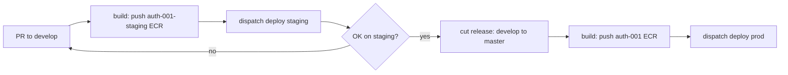

# PLAN — Keycloak restructure (HubFlow + staging + role-named ECRs)

Supersedes the earlier "auth-001-staging" plan (that scope is folded in below). This is the full keycloak image-repo + infra restructure so a new upstream version is validated on a non-productive staging instance and promoted to production through GitFlow, before it touches the productive SSO.

## Decisions (engineer, this session)

1. **HubFlow for keycloak** (`develop` + `master`) — keycloak is actively-versioned / multi-scenario (unlike pgbouncer, which stays main-only). `develop` builds the staging image; `master` builds the production image.
2. **Deploy is a manual dispatch** (same as pgbouncer) — NOT auto-deploy on merge. The only difference vs main-only: the staging deploy pulls the `develop`-built image, prod pulls the `master`-built image.
3. **Separate role-named ECRs per instance** — `auth-001` (prod), `auth-001-staging` (staging). No shared `:latest` collision; ECR storage cost is negligible.
4. **Naming principle** — infra is named after the application ROLE (`authenticator`), not the tool (`keycloak`). The repo stays `keycloak`. The pgbouncer → `connection-pooler` fleet rename is a SEPARATE effort (renaming productive ECS clusters/services is destroy+recreate — its own planned migration).
5. **Standard doc gets two shapes** — main-only (simple/stable, pgbouncer) vs HubFlow (actively-versioned, keycloak).

## Flow this enables

## Done already

- **Staging infra** — service (desired 0) + task-def + target group + host listener rule + log group (terraform #591); DNS CNAME → same ALB (#592).
- **ECRs** — `auth-001` + `auth-001-staging` created, deploy user push access granted; legacy `auth-001-app` kept (#594).
- **The `keycloak_staging` database** created on the shared RDS instance (via psql from the VPN box).
- (Earlier this session: the whole CI/CD — Dockerfile pinned tag+digest, renovate.json, hadolint ci, verify-minimum-age, build/deploy workflows, CHANGELOG, identity min-age check; build-fix; repo hygiene; README.)

## Remaining — safe execution order

The ECR-rename steps fold into the HubFlow build/deploy rewrite. The order below never strands production and keeps develop/master driving the right ECRs.

### Phase A — HubFlow migration (keycloak repo) — DONE
The branch migration and the identity governance are coupled (terraform protects `main`; deleting `main` before moving governance breaks `github_branch_protection.main["keycloak"]`). Order:
1. ✅ Create `master` and `develop` from `main` (both = current `main` HEAD); push.
2. ✅ Set the GitHub default branch → `develop`.
3. ✅ **Identity PR #595** — moved `keycloak` from `local.main_branch_repositories` → `local.hubflow_repositories` (+ `hubflow_repositories_with_min_age_check`); applied (2 add, 1 destroy). PR open, awaiting merge. Added master/develop protection and dropped the stale `main` protection.
4. ✅ Delete `main` (protection gone, default moved) — remote + local.
5. ✅ HubFlow config set (matches `app`/`integrator`: master/develop, feature/release/hotfix/support prefixes, empty versiontag prefix — 4Shark HubFlow standard).

### Phase B — build.yaml restructure (keycloak PR → develop)
- `develop` push → build + push to **`auth-001-staging`** ECR (`:latest` + `:<sha>`).
- `master` push → build + push to **`auth-001`** ECR (`:latest` + `:<sha>`).
- Update `ci.yaml` / `verify-minimum-age` triggers to `develop`/`master` (PRs target develop).
- On merge to develop, this populates `auth-001-staging:latest`; the first master release populates `auth-001:latest`.

### Phase C — repoint task-defs (terraform PR)
- Prod `auth-001` task-def image → `auth-001:latest` (was `auth-001-app:latest`).
- Staging `auth-001-staging` task-def image → `auth-001-staging:latest` (was `auth-001-app:latest`).
- Apply. Services have `ignore_changes = [task_definition]`, so running tasks are unaffected until a deploy.

### Phase D — populate + validate
- Staging: a `develop` build populates `auth-001-staging`; scale up + dispatch deploy staging; validate login on `auth-001-staging.app4shark.com`; scale to 0.
- Prod: the first `master` release populates `auth-001`; dispatch deploy prod; validate on the new ECR. `auth-001-app` stays intact the whole time (rollback = repoint).

### Phase E — drop the legacy ECR (terraform PR)
- Remove `aws_ecr_repository.app` (`auth-001-app`) + its `iam_deploy` arn — only after prod is validated on `auth-001`.

### Phase F — deploy.yaml (keycloak PR)
- `workflow_dispatch` environment choice `[auth-001, auth-001-staging]`; **cluster is `auth-001-cluster` for both** (staging shares it — do NOT derive `<env>-cluster`); service/task-family per choice.
- GitHub Environment `auth-001-staging` with the deploy secrets (the `iam_deploy` policy already covers `service/auth-001-cluster/*`).

### Phase G — doc (dot-claude PR)
- `DOCKER-IMAGE-TOOL-REPOS.md`: document the two repo shapes (main-only vs HubFlow develop/master), keycloak as the HubFlow example, pgbouncer as the main-only example.

## Risks

1. **Prod ECR repoint** — keep `auth-001-app` until prod is validated on `auth-001` (Phase C keeps it, Phase E drops it). Rollback = repoint the task-def back.
2. **HubFlow migration ↔ identity coupling** — the branch-protection move (Phase A.3) must land before deleting `main` (A.4), or terraform errors on the missing branch.
3. **Default-branch / open-PR coordination** — changing the default to `develop` re-bases open PRs; there are none on keycloak right now, so low risk.
4. **CHANGELOG lifecycle** — HubFlow uses `release/*` branches and `[Unreleased]` on develop; the release flow changes accordingly.
5. **Productive SSO first deploy** — `desired_count = 2` + circuit breaker + rollback keep it zero-downtime; still the engineer's controlled dispatch.

## Open questions (confirm at execution)
- HubFlow migration mechanics: create `master`+`develop` from `main`, then delete `main` (vs keep). Default → `develop`.
- Prod image tag stays `:latest` (from master). Confirm.
- pgbouncer → connection-pooler fleet rename: OUT of scope here; separate PLAN when we get to it.
