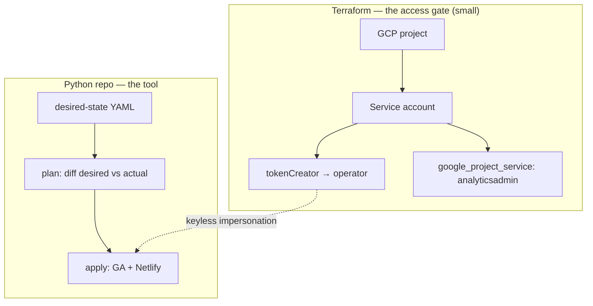
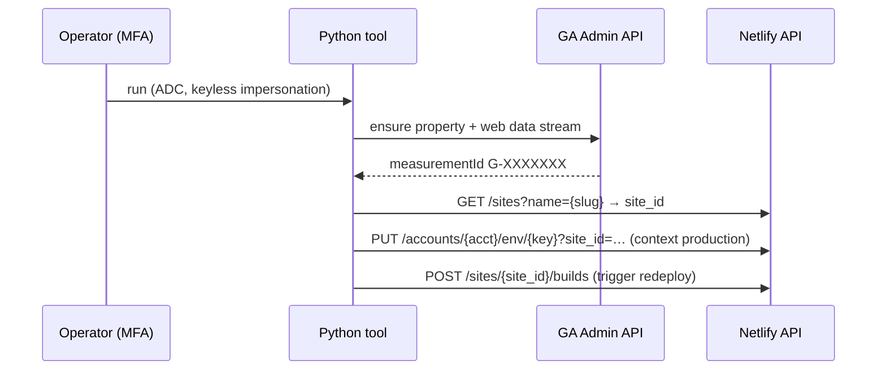

# PLAN — Google Analytics 4 management as code

> Status: **draft for engineer review** (no code written yet). Session date: 2026-06-26. This consolidates the design decided in-session and is backed by three verified spikes (links under "Supporting research"). GA stays — this is about managing it at scale, not removing it.

## Goal

Stop controlling GA4 for the ~50 Netlify front-ends by hand. A **Python tool, run on-demand by an operator**, manages GA4 properties through the GA Admin API, retrieves each property's `measurementId` (`G-XXXXXXX`), pushes it into the corresponding Netlify site as an environment variable, and triggers a redeploy — end-to-end in a single run.

## Decisions (locked in-session)

- **Direction** — Python script against the GA Admin API directly. No Terraform provider for GA4 exists (official or community); the Admin API itself is fully capable. (spike `google-analytics-terraform`)
- **Execution model** — on-demand by an operator, **keyless** via the operator's own MFA-protected GCP ADC + service-account impersonation. No standing credential anywhere — mirrors the `data-privacy` email-erasure tool exactly.
- **Config model** — **declarative desired-state YAML**: the file describes how the ~50 properties (and their front-end mapping) should be; the tool applies the diff. This is what removes the manual control.
- **Safety** — **plan → apply**: the tool first shows the diff, the operator reviews, then it applies. Same shape as email-erasure's `plan → delete`.
- **Script repo** — a new **dedicated repo**, Python.
- **Terraform** — a new **dedicated GCP stack** with its **own GCP project**, mirroring `workspace-access` (SA + `tokenCreator` to the operator + `google_project_service` for the Admin API, no SA key). Chosen over folding into `monitoring` to avoid credential blast-radius coupling and the semantic mismatch (GA = product analytics, not infra health). (spike `terraform-stack-organization`)
- **Scope (initial)** — property + web data stream + `measurementId`; basic standardizations (timezone, currency, default data retention) and flow improvements identified **during implementation**, not now.
- **measurementId → front-ends** — included in scope. The YAML carries each front-end's Netlify site name; the tool sets the env var and triggers a deploy. (spike `netlify-api-env-deploy`)
- **Netlify credential** — a Personal Access Token pulled from **1Password (`op`) at runtime**, like `monitoring/.envrc` does with the Rollbar token. No standing token in env.

## Architecture — two artifacts

1. **Terraform stack (access gate)** — GCP project + SA + `tokenCreator` grant + Admin API enable. Mirrors `workspace-access/main.tf:24-59`. The SA is added as a GA4 Administrator (manual in the GA4 UI, or via the access-bindings endpoint).
2. **Python repo (the tool)** — reads the desired-state YAML, talks to the GA Admin API and the Netlify API.

## End-to-end flow, per front-end

Netlify confirmed: changing the env var does **not** auto-deploy — *"Environment variable changes require a build and deploy to take effect"* — so the build trigger is always a separate call.

## Supporting research (all verified)

- `~/.claude/plans/active/spike/google-analytics-terraform/SPIKE.md` — no TF provider for GA4; Admin API capability; keyless auth.
- `~/.claude/plans/active/spike/terraform-stack-organization/SPIKE.md` — dedicated GCP stack vs `monitoring`; credential blast radius; monitoring ≠ product analytics.
- `~/.claude/plans/active/spike/netlify-api-env-deploy/SPIKE.md` — exact Netlify calls (env var PUT, build POST, PAT auth, site lookup).

## Execution phases

1. **Terraform access-gate stack** — new GCP project, SA, `tokenCreator` to the operator, enable `analyticsadmin.googleapis.com`. Apply; add the SA as a GA4 Administrator.
2. **Python repo scaffold + GA client** — impersonation auth (ADC → signBlob, mirroring `strip_attachments.py:204-224`), desired-state YAML schema, `plan` command (read-only diff of desired vs actual GA state).
3. **GA apply** — create/update property + web data stream; capture the `measurementId`.
4. **Netlify integration** — resolve site, set env var, trigger build; PAT via `op` at runtime.
5. **Pilot + rollout** — run end-to-end on one front-end, validate, then roll to all ~50 (throttled, see Risks).

## Open items (resolve during implementation)

- **Which basic standardizations** to enforce across all properties (timezone / currency / retention) — confirm with engineer before coding the apply step.
- **`clear_cache` on `POST /sites/{site_id}/builds`** — unconfirmed in fetched docs; a changed env var needs a *fresh* build, so this needs a quick live test (the value may not be picked up by a cached redeploy).
- **Desired-state YAML shape** — exact schema (per-property fields + Netlify site name) to be designed in Phase 2.
- **Idempotency** — `measurementId` is output-only (Google assigns it on creation). On re-runs the tool must look up existing properties (by displayName or a stored mapping) to avoid recreating them — this is the core of the `plan` diff.

## Risks

- **Netlify build rate limit** — 3/min, 100/day. Rolling 50 sites must throttle and may span more than one run.
- **PAT lifecycle** — expiration and password-reset invalidation break an automated run; the `op`-at-runtime pattern contains the blast radius but the token still needs rotation handling.
- **Two external APIs in one run** — a partial failure (GA property created, Netlify deploy failed) must be recoverable; the `plan → apply` + idempotent lookups make re-runs safe.
