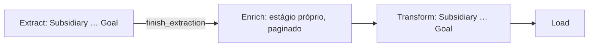

# PLAN — Enricher como estágio próprio da pipeline

## Problema

O enrich hoje mora dentro do estágio de extração do Client: o extractor consumer, na última página do upstream, dispara `Client::EnricherProducer` inline e o estágio do Client só avança quando extração + enrich drenam juntos. O fan-out é "um chama o outro na hora", então tudo se materializa quase simultaneamente no Redis.

Conta do estouro (números do engenheiro): 50 mil registros do upstream ≈ 100 páginas ≈ 100 collections. Na topologia inline, o produtor enfileira 100 workers de collection, e cada um enfileira ~500 consumers finais no mesmo instante → ~50 mil jobs (chaves) vivos no Redis ao mesmo tempo. É o "perder o controle ao desdobrar demais".

Decisão do engenheiro: separar o enrich num **estágio próprio da pipeline**, que começa **depois que toda a extração termina**, com um **produtor paginado** (modelo do `LoaderProducer`) que produz o trabalho em lotes limitados em vez de tudo de uma vez. Extração e enrich são ambos a fase de "buscar dados"; a transformação (unificar) continua no passo posterior, como hoje.

## Arquitetura atual (aterrada no código)

- **`Computation` é único por job** — `Job#computation` = `Computation.new("j_#{id}")` ([job.rb:74-76](app/models/job.rb:74)). Um único par de contadores `queue`/`executions`; `done?` é `queue == executions` ([computation.rb:39-46](app/models/computation.rb:39)).
- **A pipeline é uma cadeia sequencial de stream em stream**, cada stream drenando o contador antes de disparar o próximo. Extract: Subsidiary → Hierarchy → User::* → ParentUpdate → UserIdentifier → Client → Product → … → Goal. Cada `<Stream>::*ExtractorConsumer`, ao ficar `done?`, chama `<ProximoStream>::ExtractorProducer`.
- **Fronteira extract → transform**: o `Goal` é o último stream do extract; ao terminar, faz `job.finish_extraction` e dispara `Subsidiary::TransformerProducer` ([goal/database_extractor_consumer.rb:82-83](app/workers/goal/database_extractor_consumer.rb:82), [goal/api_extractor_consumer.rb:132-133](app/workers/goal/api_extractor_consumer.rb:132), [goal/extractor_producer.rb:36-37](app/workers/goal/extractor_producer.rb:36)).
- **O contador NÃO é resetado entre streams** — é um contador corrido: `done?` fica verdadeiro sempre que todo o trabalho enfileirado até ali executou, o que é a barreira natural pra avançar. (Reset existe — `database_warmer/producer.rb:13-14` usa `reset_queue`/`reset_executions` — mas não é usado entre streams.)
- **Modelo de paginação existente (`LoaderProducer`)** ([client/loader_producer.rb](app/workers/client/loader_producer.rb)): na primeira chamada conta o total, faz `increment_queue(by: total)` uma vez, pega a primeira página (`ApplicationConfiguration.mongo_page_size`), **re-enfileira a si mesmo com um cursor** (`collection_last_id`) e dá `push_bulk` só dos consumers daquela página. Assim o Redis só segura uma página de cada vez.
- **Enrich inline hoje**: o extractor consumer do Client monta `enricher_arguments` por downstream e dá `push_bulk` de `Client::EnricherProducer` ([client/api_extractor_consumer.rb:60-66](app/workers/client/api_extractor_consumer.rb:60)). Os workers do enrich atuais: `EnricherProducer` (por downstream → por collection), `CollectionEnricherProducer` (por collection → por external_id), `Database/ApiEnricherConsumer` (por external_id, busca na fonte e grava `Enrichment`).

## Arquitetura alvo

O enrich vira um estágio entre o fim da extração (Goal) e o início da transformação (Subsidiary transform):

O par do estágio de enrich, seguindo o padrão do Extractor e a decisão de nome que você fechou:

- **`Client::EnricherProducer`** — o produtor do estágio, **paginado no modelo do `LoaderProducer`**. Anda pelas collections do upstream do downstream em lotes (cursor), e por lote lê as collections, extrai os external_ids e dá `push_bulk` só do lote de consumers finais, re-enfileirando a si mesmo pro próximo lote. O `Collection` sai do nome — a collection é o cursor interno, não a identidade do worker.
- **`Client::DatabaseEnricherConsumer` / `Client::ApiEnricherConsumer`** — o consumer final, por external_id, busca na fonte e grava o `Enrichment` (sem dedup, por decisão anterior: last-write-wins + log das duas execuções).

O `CollectionEnricherProducer` e o `EnricherProducer` por-downstream atuais somem, colapsados nesse produtor paginado único.

Barreira e contagem: como o `Computation` é um contador corrido, o estágio de enrich não precisa de reset — ele é só mais um estágio na cadeia, igual o transform segue o extract. O Goal, em vez de ir direto pro `Subsidiary::TransformerProducer`, passa a chamar a entrada do enrich; e o enrich, ao drenar (`done?`), chama o `Subsidiary::TransformerProducer`. O `finish_extraction` continua no fim do Goal (a extração de fato terminou ali).

## Decisões

1. **Grão da paginação: por external_id.** O `LoaderProducer` pagina no grão mais fino (por registro, `mongo_page_size`), que dá o cap de Redis mais previsível; o produtor do enrich segue esse precedente, produzindo lotes de external_ids em vez de uma collection inteira por ciclo.

2. **Escopo: só Client agora.** É a instrução de escopo da task (um recurso primeiro, replicar depois). A entrada do enrich é `Client::EnricherProducer`, que avança direto pro `Subsidiary::TransformerProducer`. Os outros streams com downstreams entram como passos do walk do estágio de enrich (Subsidiary::EnricherProducer → … → Goal::EnricherProducer → Subsidiary transform), na replicação deferida.

3. **Trade-off de paralelismo: aceito.** A leitura das collections deixa de ser paralela (um worker por collection) e passa a ser paginada no produtor (um lote por ciclo). É a própria escolha de separar e paginar contra o estouro de Redis — a leitura paginada substitui o fan-out paralelo por design.

## Inventário de workers

- **Novo/reescrito**: `Client::EnricherProducer` — produtor paginado (cursor de collection/id), `increment_queue` por lote, `push_bulk` do lote de consumers finais, re-enfileira a si mesmo, `increment_executions` + avança pro transform quando `done?`.
- **Removido**: `Client::CollectionEnricherProducer` (colapsado no produtor paginado).
- **Inalterado**: `Client::DatabaseEnricherConsumer` / `Client::ApiEnricherConsumer` (por external_id; já fazem `find_or_initialize_by` + `save!` + `increment_executions` + avanço).
- **Alterado (compartilhado)**: `Goal::DatabaseExtractorConsumer` / `Goal::ApiExtractorConsumer` / `Goal::ExtractorProducer` — a fronteira que hoje chama `Subsidiary::TransformerProducer` passa a chamar a entrada do enrich. E `Client::DatabaseExtractorConsumer` / `Client::ApiExtractorConsumer` — param de disparar o enricher inline (removem o bloco `enricher_arguments` + `push_bulk` e o respectivo `increment_queue`).

## Fases de execução

1. Reescrever `Client::EnricherProducer` como produtor paginado; remover `CollectionEnricherProducer`.
2. Tirar o disparo inline do enricher dos extractor consumers do Client (e o `increment_queue` correspondente).
3. Ligar a fronteira: Goal extract → entrada do enrich; enrich `done?` → `Subsidiary::TransformerProducer`.
4. Validar: rubocop nos tocados, eager-load, e revisar a contagem do `Computation` no boundary (o contador fecha o extract, o enrich seed+drena, avança).

## Fora de escopo / deferido

- **Replicação pros outros 23 recursos** — o walk do estágio de enrich pros demais streams com downstreams; fora deste PLAN, entra depois do Client validado.
- **Blocker de deploy — backfill de `_type`**: os documentos `Stream` em produção precisam de `_type` (`Upstream`/`Downstream`) preenchido antes/junto do deploy, senão os `.upstreams`/`.downstreams` não enxergam nada. Continua como blocker, independente deste redesign.
- **PR-review** segue segurado (branch meia-migração).

## Estado

Nada de código mudou nesta rodada; último push do PR #2385 é `981a8ccc`. O PLAN está decision-complete — não há sub-decisão em aberto. A única porta antes da execução é a tua revisão da arquitetura (estágio próprio + produtor paginado na fronteira Goal→Subsidiary transform).
