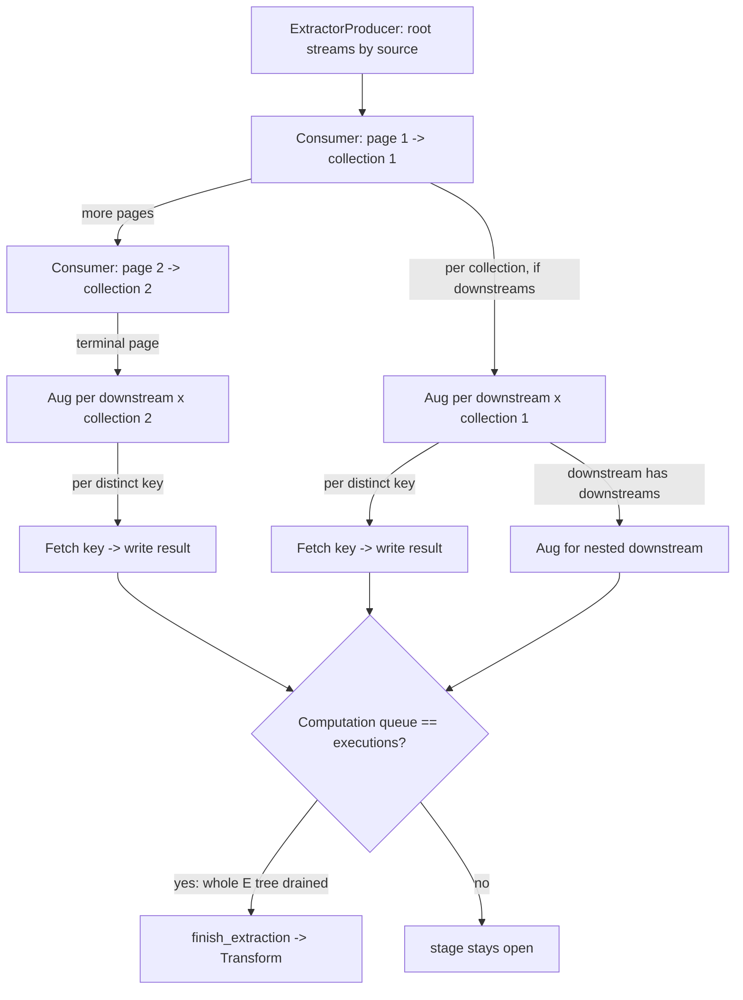

# PLAN — Stream augmentation as fan-out inside the Extract stage

Feature: downstream (dependent) stream augmentation for the `integrator` pipeline.
Branch: `feature/stream-augmentation-consumer` · PR #2385 (open, held — no edits until this plan is agreed).

## Problem

A downstream stream (`stream.downstream?` — `upstream_id.present?`) enriches each record its
upstream produced: for each record keyed by `record[stream.source_field]`, fetch complementary
data (from an API or the customer database, per the downstream's own source) and make it available
to the Transform stage.

The current PR implements this as a **single inline loop** inside every extractor consumer: when a
stream is a downstream, one job iterates ALL of the upstream's collections and every record, doing a
serial fetch per key, then advances to the next resource. Two problems:

1. It is one long-lived job doing N serial fetches — the opposite of the Data Processing Pattern
   (many small parallel jobs, never one large process).
2. The downstream branch never re-runs the fan-out, so a downstream that itself has downstreams
   (level 3+) is never enqueued — the tree stops one level deep.

## Corrected design (engineer-specified)

Augmentation is **part of the Extract (E) stage** — it is still "fetching the data", just from
dependent sources. There is **no new stage and no augmentation producer** between Extract and
Transform. The tree is walked by the fan-out that already exists in the extract consumers, extended
so a downstream also fans out its own downstreams. The Transform stage begins only when the whole
tree (root pagination + every augmentation level) has drained.

### Extract flow, per stream

Extraction paginates **sequentially and self-chaining** (unchanged from master): a consumer fetches
one page (~500 records), saves it as a collection, reads the last id, and enqueues itself for the
next page. Page after page until the source is exhausted; the `Computation` counter only closes on
the **terminal** page (a non-terminal page re-enqueues the next page without incrementing executions
or checking `done?`).

The change: **at each collection produced**, the consumer also fans out that stream's enabled
downstreams for that collection. No downstreams → nothing extra. Has downstreams → `increment_queue`
and enqueue an augmentation unit per `(downstream, collection)`. This overlaps augmentation with
ongoing pagination.

### Augmentation, two grains ("os dois")

Per the engineer: both a per-collection unit AND a per-record unit.

1. **Per-`(downstream, collection)` worker** — reads that one collection's records, dedups the keys,
   and fans out one fetch job per distinct key (`increment_queue`). It also fans out the downstream's
   OWN downstreams (recursion — a downstream can depend on a downstream). It does no fetching itself.
2. **Per-`(downstream, collection, key)` worker** — does the single fetch for that key (API GET with
   authenticated headers + `render_query`, or `connection.fetch` against the customer DB, by
   `downstream.source.database?`), and writes the result for that key. `increment_executions`.

### Stage transition

`Computation` (atomic Redis `queue`/`executions`) already coordinates this. Pages, per-collection
augmentation units, per-key fetch jobs, and recursive downstreams all count into the same stage. Even
after all pagination finishes, if any augmentation is still pending the stage stays open. When the
**last** unit drains (`queue == executions`), the stream's consumer calls `finish_extraction` (for the
last stream, `Goal`) and the first Transform producer starts.

## Open decisions (defaults proposed; confirm at review)

### D1 — Storage & fan-in shape  ← the load-bearing one

Today `StreamAugmentation` has a **unique index on `(job_id, downstream_id)`** and mounts a single
`raw_body` file; the transformer (`client/transformer_consumer.rb:14-28`) reads **one hash per
downstream**, `data[record[source_field]]`. Per-key parallel writers cannot share that one file
(race) and cannot each own a `(job, downstream)` row (unique index).

- **Default (recommended): per-key rows.** A row keyed by `(job, downstream, source_value)` written
  by each per-key worker via `find_or_initialize_by` (which also gives dedup for free — D2). The
  transformer looks the value up by key instead of reading one hash. Matches the Data Processing
  Pattern (small rows, no aggregator), no write contention. Costs a small schema/model change to
  `StreamAugmentation` (drop the unique index, add `source_value`, per-key `raw_body`) and a small
  transformer change.
- **Alternative: keep one row per `(job, downstream)` + a finalizer.** Per-key workers write
  individual scratch results; a fan-in finalizer (last per-collection worker, or a dedicated
  finalize step) aggregates them into the single keyed-hash file the transformer already reads.
  Keeps the transformer identical to today, at the cost of an aggregation step and its ordering.

### D2 — Dedup of repeated keys

The same `source_value` recurs across records/pages. With per-key rows (D1 default),
`find_or_initialize_by(job, downstream, source_value)` dedups naturally (a repeat overwrites with the
same payload — idempotent). Additionally dedup keys **within** a collection before fan-out so one
collection never enqueues the same key twice. Cross-collection repeats collapse at the row level.

### D3 — Nesting depth for this cut

Recursion (downstream-of-downstream) is in the design above. Confirm whether the first cut must
support arbitrary depth now, or ship single-level augmentation first (root → its downstreams) and add
deeper nesting as a follow-up. The worker shape is the same either way; only the "aug worker fans out
its own downstreams" edge changes.

## What comes out of the current PR

- The inline `if stream.downstream?` augmentation loop in all 25 api + 25 db extractor consumers.
- The consumer-level source-split fan-out added this session is **reshaped, not deleted**: the routing
  by `downstream.source.database?` moves into the new per-collection augmentation fan-out (an api
  downstream → api fetch worker; a database downstream → database fetch worker).

## What is added

- New worker(s) for the two augmentation grains (per-collection, per-key), each with the
  api/database variant, following the existing `<Resource>::…Consumer` topology and namespacing.
- The `Computation` wiring on the terminal extract page to `increment_queue` for the per-collection
  augmentation fan-out before its own `increment_executions`.
- D1's storage change (per-key rows) if that option is chosen.

## Transform stage

Restore the transform consumers to master's structure (the trusted shape), with the augmentation read
slotted in as the only addition. Once the E-stage structure is proven, the remaining work is wiring
the actual augmentation queries into the downstream requests, then a re-test.

## Out of scope

The per-client activation migration that enables downstreams in production (deferred, engineer-led).
Everything here stays inert until that runs (`stream.downstream?` / `stream.downstreams.enabled` are
false/empty for existing streams).

## Execution order (after this plan is agreed)

1. Settle D1–D3.
2. Add the augmentation workers + storage shape; wire the extract consumers to fan out per collection
   and drop the inline loop.
3. Restore transform to master structure + augmentation read.
4. rubocop / eager-load / specs / brakeman; amend onto PR #2385; force-push; re-run review.
