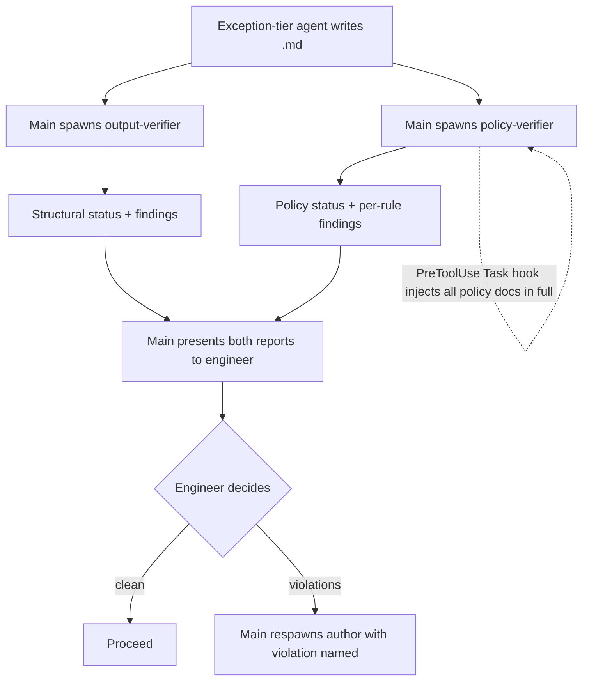

# PLAN — policy-verifier Agent

> Reference: derived from `~/.claude/plans/active/spike/policy-verifier-agent/SPIKE.md` (+ auxiliaries: rule inventory, routing table, trigger set). Target repo: `dot-claude` (config). Implementation lands via PR from the working copy `~/Projects/4Shark/dot-claude` — never a direct edit to `~/.claude/`.

## Objective

Add a new read-only verifier subagent, `policy-verifier`, that checks the CONTENT of planning/behavior-defining documents (the 9 exception-tier writes) against 4Shark's internal policy/convention docs, complementing the existing `output-verifier` (which checks only structural integrity: citations, scope, template, references, auxiliary integrity). This closes "vazamento A" — a plan that is born violating a convention because the session never read the governing doc.

## Scope

### In scope

- New agent file `agents/policy-verifier.md` (read-only; conformance check; status enum; main decides).
- New injection hook `scripts/inject-policy-verifier-docs.sh` (PreToolUse on `Task`) that injects the curated policy-doc set in full at spawn — the anti-recursion guarantee.
- `settings.json` wiring for the new PreToolUse Task hook.
- Documentation: `SUBAGENT-CONTRACT.md` (verifier role gains the second verifier), `CLAUDE.md` (workflow diagrams, agents list, repo-structure tree), `CHANGELOG.md` entry, optional `ADR-002` (verification-complements-injection).
- Cleanup of the 3 truncated/paraphrased citations the `output-verifier` flagged in the SPIKE.md.

### Out of scope (registered follow-ups, not solved here)

- **Script-generating skills** (`integration-debug`, `create-integrator`, `create-app-webclient`) — they emit code as chat text, not a `.md` write; different trigger shape, real unknowns (PostToolUse payload shape, Task input size). Deferred by decision.
- **"Vazamento B"** — code diverging from a policy-compliant plan at `/execute` time. Partially covered by existing mechanical hooks (`validate-bang-method-web-flow.sh`, `validate-rails-migration-creation.sh`, `check-abbreviated-variables.sh`); the residual gap stays open by decision.

## Chosen approach

**Direction:** a second main-driven verifier, mirroring `output-verifier`'s contract and invocation exactly, distinguished only by WHAT it checks (policy conformance vs structural integrity). Anti-recursion via full-doc injection at spawn (the `inject-integration-debug-docs.sh` Pattern B).

**Rationale (from engineer's locked decisions):** broadest coverage and simplest guarantee preferred over targeted optimization; conformance gate belongs at the plan level; subjective rules kept but tiered as advisory.

**Source patterns referenced:** `agents/output-verifier.md` (verifier contract/enum), `scripts/inject-integration-debug-docs.sh` (full-doc injection at spawn), `scripts/inject-deployment-strategy.sh:94` (signal→doc routing precedent), `docs/SUBAGENT-CONTRACT.md` (verifier role).

## Flow

## Execution phases

### Phase 1: The agent (`agents/policy-verifier.md`)

**Objective:** the conformance verifier itself.

**Components:**
- Frontmatter: `name: policy-verifier`, `model: sonnet`, `tools: Read, Grep, Glob, WebFetch`, color of choice. Mirror `output-verifier.md` frontmatter shape.
- Operating contract block: research-only, read-only, no file writes, no workflow decisions — returns a status enum + per-rule findings; main decides. Copy the false-negative weighting verbatim in spirit from `output-verifier.md:13`.
- Mission: given a target file path + author agent (+ the policy docs injected at spawn), scan each code example / technical decision in the target doc, apply the routing table to know which governing doc applies, and check:
  - **16 mechanically verifiable rules** → hard checks (high confidence). Source list: `policy_verifier_rule_inventory_1.md`.
  - **4 subjective rules** (index awareness; the 5 CODE-PATTERN anti-patterns; deploy-strategy compliance) → advisory flags marked "requires judgment", governed by the false-negative weighting (flag rather than clear when uncertain).
- The routing table (`policy_verifier_routing_table_2.md`) lives INSIDE the agent's logic (signal keyword in a code section → which governing doc's rule to apply). It is NOT a hook concern here (Option A injects every doc anyway).
- Status enum identical to `output-verifier`: `ACCEPT` (c>0.85) / `ACCEPT_WITH_WARNINGS` (0.70–0.85) / `PARTIAL` (0.50–0.70) / `REJECT` (<0.50). Same disjoint thresholds, same false-negative defaulting.
- Output template: per-rule findings, each carrying the offending code excerpt + file:line in the target doc, the governing rule + quote from the policy doc, verdict (violation / compliant / advisory), confidence. No closing recommendation/verdict paragraph (contract).

**Dependencies:** none (agent name `policy-verifier` is fixed; Phase 2 keys on it).

**Success criteria:**
- [ ] Agent file mirrors `output-verifier.md` structure and contract.
- [ ] Mechanical vs advisory tiering is explicit in the checks section.
- [ ] No verdict/recommendation language; read-only tools only.

### Phase 2: The injection hook + wiring (anti-recursion guarantee)

**Objective:** the policy-verifier can never not-read the governing docs.

**Components:**
- `scripts/inject-policy-verifier-docs.sh`: PreToolUse hook on `Task`. Detects that the spawned subagent is `policy-verifier` (keys on the Task input's `subagent_type` field — **confirm the exact field name in the PreToolUse Task payload before coding the matcher**; fallback if absent: match on a sentinel string the agent briefing carries). On match, reads the curated policy-doc set and injects them in full as `additionalContext`, with the "treat as authoritative full text — you do not need to Read these again" framing copied from `inject-integration-debug-docs.sh:76-78`.
- Curated doc set (starting list — finalize during implementation; the spike inventory is a starting set, not complete): `DATA-PROCESSING.md`, `DATA-ACCESS.md`, `TERRAFORM-POLICY.md`, `TERRAFORM-CONVENTIONS.md`, `RAILS-MIGRATIONS.md`, `BANG-METHOD-WEB-FLOW.md`, `ACTIVE-RECORD-QUERY-DISCIPLINE.md`, `OPTIONAL-BELONGS-TO.md`, `BULK-DELETE.md`, `NO-MULTIPLE-RAISE.md`, `USE-THE-OBJECT.md`, `CODE-PATTERN-DISCIPLINE.md`, `DEPLOYMENT-STRATEGY.md`, `NO-SAFE-NAVIGATION.md`, `NO-UNLESS-CONVENTION.md`, `CODE-STYLE-RULES.md`, `ALPHABETICAL-ORDERING.md`.
- `settings.json`: add the PreToolUse Task hook entry, mirroring the existing PreToolUse Skill hook block shape (`settings.json:275-296`).

**Dependencies:** Phase 1 (agent name fixed).

**Success criteria:**
- [ ] Hook fires only for `policy-verifier` Task spawns, injects the full doc set.
- [ ] PreToolUse Task payload field for the subagent type confirmed (or fallback matcher in place).
- [ ] `settings.json` validates; no regression to existing hooks.

### Phase 3: Documentation + workflow integration

**Objective:** the second verifier is documented as canonical and main knows to spawn it.

**Components:**
- `docs/SUBAGENT-CONTRACT.md`: extend the verifier-role section — there are now TWO read-only verifiers after each exception-tier write: `output-verifier` (structural) and `policy-verifier` (conformance). Same enum, same "main decides".
- `CLAUDE.md`: update the Standard + DDD workflow diagrams (the "output-verifier runs automatically" note becomes "output-verifier + policy-verifier run automatically"); add `policy-verifier` to the Available Agents list and the `agents/` + `scripts/` repo-structure tree.
- `CHANGELOG.md` (dot-claude): one succinct entry under `## [Unreleased]` → `### Added`: "Policy conformance verification of planning documents".
- **ADR-002 (engineer confirms whether to write it):** "Verification complements injection" — records why the team added a detection gate on top of the existing prevention (injection) mechanism. Follows the `ADR-001` precedent. Optional; drop if the engineer prefers no ADR.

**Dependencies:** Phases 1–2 (documents what was built).

**Success criteria:**
- [ ] Both verifiers described in `SUBAGENT-CONTRACT.md` with the split made explicit.
- [ ] Workflow diagrams + agents list + repo tree updated in `CLAUDE.md`.
- [ ] CHANGELOG entry present, succinct, no implementation detail.

### Phase 4: SPIKE.md citation cleanup

**Objective:** clear the `output-verifier` PARTIAL on the spike (record hygiene).

**Components:** fix the 3 flagged citations in `SPIKE.md` — Finding 2 (expand the truncated `inject-deployment-strategy.sh:94` block to full verbatim), Finding 4 (full verbatim of `inject-integration-debug-docs.sh:76-78`), Finding 5 (replace the composite paraphrase of `SUBAGENT-CONTRACT.md` with a literal substring or drop the quote marks).

**Dependencies:** none.

**Success criteria:**
- [ ] The 3 citations match source verbatim (or are rewritten as the author's own observation, unquoted).

## Technical decisions

| Decision | Choice | Rationale (from engineer) |
|----------|--------|----------------------------|
| Trigger set | All 9 exception-tier agents | Broadest coverage; engineer chose full over HIGH-5-only |
| Anti-recursion injection | Inject all curated policy docs in full at spawn (Option A) | Simplest, guaranteed coverage, no routing-error silent gap; size cost accepted |
| Rule scope | 16 mechanical (hard) + 4 subjective (advisory, false-negative weighted) | Keep the high-value structural catches (anti-patterns) without dropping precision on the mechanical set |
| Script-generating skills | Deferred to follow-up | Different structural problem + real unknowns; ship document gating first |
| Agent vs 7th check on output-verifier | Separate agent | Different nature (semantic vs mechanical), token-heavy, distinct confidence model |
| Name | `policy-verifier` | Avoids collision with `COMPLIANCE.md` doc-type (client/regulatory); maps to `*-POLICY.md` |

## Risks

| Risk | Impact | Mitigation |
|------|--------|------------|
| PreToolUse `Task` payload may not expose `subagent_type` | Hook can't target policy-verifier | Confirm field name early in Phase 2; fallback matcher on a sentinel string in the briefing |
| Full doc-set injection is large per spawn | Token cost on every policy-verifier call | Curate to verifiable-rule docs only; cost accepted as the price of the guarantee (Option A chosen knowing this) |
| False positives on the 4 subjective rules | Noisy verifier output | Advisory tier + false-negative weighting; verifier marks them "requires judgment" |
| Missed routing signal → missed check | A violation slips through | Option A injects ALL docs, so the verifier is never blind to a doc; only the in-agent signal mapping can miss, lower risk |
| main may forget to spawn policy-verifier | Gate silently skipped | Same exposure as today's main-driven output-verifier; documented in the workflow as a paired spawn |

## Assumptions

- The PreToolUse `Task` hook can key on the spawned subagent type (to confirm in Phase 2).
- The policy-doc set is curatable to docs carrying verifiable rules; the spike inventory is a starting set, refined during implementation.
- main reliably spawns `policy-verifier` alongside `output-verifier` for the 9 writes — a documented behavioral expectation, not mechanically enforced (parity with the current output-verifier).
