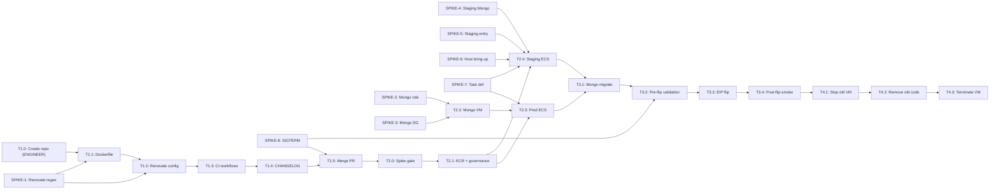

# TASKS — Pritunl VPN: VM to Containerized ECS Migration

> Reference: PLAN.md (engineer-approved), derived from TASKS-SPIKE.md

## Decomposition

**Chosen option (from engineer):** Option A — PRs grouped by repository + repository phase (5-6 smaller, individually-reviewable PRs)

**Rationale (from engineer):** Clearer repository boundary; Phase 1 is self-contained; Terraform changes are loosely grouped; easy to roll back per component. Trade-off: more PRs to review (5-6 total) and explicit external sequencing required (ECR repos and governance must land before ECS services can use them).

## Tasks

### Pre-implementation spike tasks

These research/validation tasks unblock the main work. Each task is placed BEFORE the blocking task it gates.

---

### SPIKE-1: Renovate versioning regex validation for Pritunl's four-field tag scheme

**Phase**: Phase 1 (Dockerfile scaffolding)
**Blocks**: T1.4 (Renovate config write) and T1.6 (Renovate validation)

**Description**: Validate that Pritunl's version tags follow a four-field scheme (e.g., `v1.34.4681.89`) and test a custom `versioning` regex against a live Renovate instance to confirm it orders versions correctly.

**Acceptance criteria**:
- [ ] Verify Pritunl's apt-repo version scheme matches GitHub release tags (confirm `apt-cache policy pritunl` shows a version corresponding to a GitHub release tag)
- [ ] Draft and test the `versioning` regex against a local Renovate dry-run or a temporary branch — confirm it orders the four-field versions correctly
- [ ] Document the final regex in the Renovate config with a comment explaining the four-field override

**Pattern reference**: `pgbouncer/renovate.json:11-16` — the existing non-semver `versioning: regex:` precedent

```json
"versioning": "regex:^v?(?<major>\\d+)\\.(?<minor>\\d+)\\.(?<patch>\\d+)\\.(?<build>\\d+)$",
```

**Dependencies**: None — can start immediately.

---

### SPIKE-2: MongoDB VM Ansible role placement decision

**Phase**: Phase 2 (Terraform + Ansible infra)
**Blocks**: T2.2 (MongoDB VM provisioning)

**Description**: Decide how to retarget existing Ansible MongoDB-only tasks to the dedicated Mongo VM: extract into a new independent role (e.g., `ansible/roles/4shark.mongodb-pritunl/`) or keep in existing role with an inventory-group conditional.

**Acceptance criteria**:
- [ ] Engineer or main decides: new independent role vs conditional-in-existing-role
- [ ] Ansible inventory structure for the Mongo VM is defined (which inventory file, which group, what hostname/IP pattern)
- [ ] Playbook structure is documented (e.g., `provision-pritunl.yml` extended to run against both Pritunl host and Mongo VM, or separate `provision-pritunl-mongo.yml`)

**Pattern reference**: `ansible/roles/4shark.pritunl/tasks/main.yml:32-79` — MongoDB-only tasks to be extracted/retargeted

```yaml
# MongoDB apt-repo key, repo, install
# MongoDB config (mongod.conf template)
# Enable/start mongod via systemd
# Logrotate for mongod
# Handlers: restart mongod
```

**Dependencies**: Depends on engineer/main choice; no hard blockers.

---

### SPIKE-3: Dedicated MongoDB security group mechanism

**Phase**: Phase 2 (Terraform + Ansible infra)
**Blocks**: T2.2 (MongoDB VM security group write)

**Description**: Decide the mechanism to restrict MongoDB VM's ingress to ONLY the Pritunl instance: security-group-to-security-group scoping via `referenced_security_group_id` (new pattern, no existing 4Shark precedent) or narrowed CIDR to Pritunl instance's private IP (existing convention, fragile across instance replacement).

**Acceptance criteria**:
- [ ] Engineer or main decides: SG-to-SG vs narrowed CIDR
- [ ] If SG-to-SG: verify `referenced_security_group_id` Terraform argument exists in current AWS provider version and write a proof-of-concept ingress rule
- [ ] If narrowed CIDR: document Pritunl instance's fixed private IP allocation strategy
- [ ] Security group draft written and validated with `terraform plan`

**Pattern reference**: `terraform/auth-001/security_groups.tf:11-23,41-47` — existing CIDR-scoped convention

```hcl
resource "aws_vpc_security_group_ingress_rule" "rds_postgres" {
  security_group_id            = aws_security_group.auth_001.id
  from_port                    = 5432
  to_port                      = 5432
  ip_protocol                  = "tcp"
  cidr_ipv4                    = "10.255.0.0/16"  # ← existing pattern: VPC-wide CIDR
}
```

**Dependencies**: None — can be decided in parallel with T2.1.

---

### SPIKE-4: Staging MongoDB strategy

**Phase**: Phase 2 (Terraform + Ansible infra)
**Blocks**: T2.4 (Staging ECS instance provisioning)

**Description**: Decide the database strategy for the staging Pritunl instance: separate staging Mongo VM (full isolation, doubles Mongo footprint), separate database on same production Mongo VM (shared instance, isolated at database level), or ephemeral/seeded Mongo (brought up only for test window).

**Acceptance criteria**:
- [ ] Engineer or main decides: separate staging VM vs shared prod Mongo vs ephemeral
- [ ] MongoDB provisioning/seeding strategy documented (if separate VM, does it use same Ansible role as T2.2? If shared, name the staging database. If ephemeral, document ECS task definition and seed-data source)
- [ ] Terraform code drafted for the chosen mechanism

**Pattern reference**: `terraform/auth-001/auth_001_staging.tf:1-194` — Fargate staging-instance pattern (separate database, shared RDS instance)

```hcl
resource "aws_ecs_service" "auth_001_staging" {
  desired_count = 0  # ← staging normally at zero
}
# Staging uses separate RDS database ("auth_001_staging" database name)
```

**Dependencies**: Depends on engineer/main choice; can be decided in parallel with T2.3.

---

### SPIKE-5: Staging Pritunl instance public entry point mechanism

**Phase**: Phase 2 (Terraform + Ansible infra)
**Blocks**: T2.4 (Staging ECS instance provisioning) and Phase 3 (cutover pre-flip validation)

**Description**: Decide how staging Pritunl instance reaches the public during a bring-up window for client validation: dedicated (possibly ephemeral) Elastic IP for staging, default (non-elastic) public IP on instance's ENI, or private-only validation path via Systems Manager Session Manager or VPN management interface.

**Acceptance criteria**:
- [ ] Engineer or main decides: dedicated EIP vs default public IP vs private-only
- [ ] If dedicated EIP: confirm it is released when staging scales to zero
- [ ] If default public IP: document procedure for communicating the changing IP
- [ ] If private-only: document the validation path and confirm it can reach VPN ports 14720/14721
- [ ] Terraform code drafted for the chosen mechanism

**Pattern reference**: `terraform/modules/pritunl/main.tf:32-39` — production EIP pattern (for production only)

```hcl
resource "aws_eip" "pritunl" {
  instance = aws_instance.pritunl.id
  domain   = "vpc"
  tags = { Name = "pritunl-eip" }
}
```

**Dependencies**: Depends on engineer/main choice; must be decided before T2.4.

---

### SPIKE-6: EC2 host bring-up mechanism for `-staging` confirmation

**Phase**: Phase 2 (Terraform + Ansible infra)
**Blocks**: T2.4 (Staging ECS instance provisioning)

**Description**: Confirm that direct stop/start via `~/.claude/scripts/stop-instance.sh` / `start-instance.sh` is the intended mechanism for staging host lifecycle. Alternative (ASG-backed capacity provider with `min_size=0`) is ruled out because AWS docs confirm it launches 2 instances on scale-from-zero, violating the single-instance framing.

**Acceptance criteria**:
- [ ] Engineer or main confirms: direct stop/start wrapper (not ASG managed scaling)
- [ ] If confirmed: verify existing `stop-instance.sh` / `start-instance.sh` scripts are sufficient or extend them for staging host
- [ ] Terraform code for staging instance provisioned as bespoke `aws_instance` (not via ASG)
- [ ] Skills or runbook documentation updated to show stop/start workflow for staging bring-up/down

**Pattern reference**: `~/.claude/scripts/ecs-scale.sh:1-63` — existing ECS service scaling wrapper; stop/start scripts are the EC2-host complement

```bash
aws ecs update-service --cluster "$cluster_name" --service "$service_name" --desired-count "$desired_count"
```

**Dependencies**: No hard blockers; should be confirmed before T2.4.

---

### SPIKE-7: `ecs_service` module extension vs. bespoke task definition decision

**Phase**: Phase 2 (Terraform + Ansible infra)
**Blocks**: T2.3 (Production ECS) and T2.4 (Staging ECS)

**Description**: Decide whether to extend `terraform/modules/ecs_service` with `privileged` variable and host network-mode branch, or write bespoke task definitions for Pritunl ECS instances. Current module only supports EC2-launch-type with `bridge` networking and has no `privileged` variable exposed.

**Acceptance criteria**:
- [ ] Engineer or main decides: extend module vs bespoke task definitions
- [ ] If extend module: verify the module is the right place (no versioning constraints, no downstream breakage), draft `privileged` variable and `host` network-mode conditional, test with a non-production example
- [ ] If bespoke: review existing task definitions to match style/naming, draft Pritunl-specific resources
- [ ] Terraform code ready for T2.3 / T2.4 implementation

**Pattern reference**: `terraform/modules/ecs_service/main.tf:14-54` — current module structure (no privileged/host branch)

```hcl
network_mode = var.launch_type == "FARGATE" ? "awsvpc" : "bridge"  # ← no host option
# Lines 21-54: container_definitions has no privileged key
```

**Dependencies**: Must be decided before T2.3 / T2.4; can be decided in parallel with other spikes.

---

### SPIKE-8: Pritunl SIGTERM graceful-shutdown behavior validation

**Phase**: Phase 3 (Cutover)
**Blocks**: T3.2 (pre-flip validation) and Phase 1 Dockerfile finalization (STOPSIGNAL setting)

**Description**: Validate empirically what Pritunl does with in-flight OpenVPN/WireGuard client sessions when it receives `SIGTERM`. Two possibilities: gracefully drains sessions within 20-second window, or drops them immediately. This affects cutover risk assessment.

**Acceptance criteria**:
- [ ] Establish a live OpenVPN or WireGuard connection to a test Pritunl instance
- [ ] Send `SIGTERM` to Pritunl process (via `docker stop` or `kill -15`)
- [ ] Observe connection behavior: does it persist ~20 seconds (drain) or drop immediately?
- [ ] Document the finding with exact Pritunl version tested
- [ ] If drain: confirm Dockerfile's `STOPSIGNAL SIGTERM` + ECS `stopTimeout: 20s` is sufficient; update comments
- [ ] If drop: explore workarounds (pre-cutover notification, phased cutover, etc.)

**Pattern reference**: `pgbouncer/Dockerfile:18-25` — explicit STOPSIGNAL pattern this mirrors

```dockerfile
STOPSIGNAL SIGTERM
STOPTIMEOUT 20s
# Rationale: pgbouncer drains in-flight connections on SIGTERM
```

**Dependencies**: No hard blockers for Phase 1 (Dockerfile can set STOPSIGNAL as-is and document open question), but must be resolved before Phase 3 to finalize cutover runbook.

---

## Main implementation tasks

### Phase 1 — New `pritunl` tool repository scaffolding (HubFlow shape)

---

#### T1.0: Create `pritunl` GitHub repository and register in governance (ENGINEER/MAIN ACTION)

**Phase**: Phase 1
**Repository**: GitHub org + `terraform/identity/`

**Description**: Create the new `pritunl` repository in the 4Shark GitHub organization and add it to the `terraform/identity/github_repositories.tf` governance lists. This is the FIRST task and is an engineer/main action, not an agent implementation task.

**Acceptance criteria**:
- [ ] `github.com/4shark/pritunl` repository exists with:
  - [ ] Empty state or README only
  - [ ] `develop` branch as default (not `master`)
  - [ ] Initial `master` branch exists
- [ ] `terraform/identity/github_repositories.tf` updated:
  - [ ] `local.hubflow_repositories` includes `"pritunl"`
  - [ ] Once CI produces the check: `local.hubflow_repositories_with_min_age_check` includes `"pritunl"`
  - [ ] NOT in `local.main_branch_repositories`
- [ ] Terraform plan/apply clean
- [ ] GitHub branch protection rules applied (require PR, require `Verify Minimum Age` check once CI ships)

**Dependencies**: None — can start immediately; blocks all subsequent Phase 1 tasks.

**Note**: This task is an engineer/main action. Once completed, the repo exists and subsequent tasks proceed.

---

#### T1.1: Scaffold Dockerfile with base image, Pritunl install, and entrypoint skeleton

**Phase**: Phase 1
**Repository**: `pritunl` (new)

**Description**: Write the Dockerfile (`FROM ubuntu:24.04`), add Pritunl's signed apt repository, install `pritunl` and supporting packages (`wireguard-tools`, `dnsmasq`, `fail2ban`) pinned via `ARG PRITUNL_VERSION`, and create a `configured-entrypoint.sh` skeleton that will later materialize Pritunl's runtime config (Mongo URI, rate limiting, dnsmasq, fail2ban startup).

**Acceptance criteria**:
- [ ] Dockerfile exists with:
  - [ ] `FROM ubuntu:24.04` (noble)
  - [ ] Pritunl apt-repo added (key + repo URL from `ansible/roles/4shark.pritunl/tasks/main.yml:93-97`)
  - [ ] `ARG PRITUNL_VERSION=<pinned-version>` with renovate annotation: `# renovate: datasource=github-releases packageName=pritunl/pritunl` (exact regex TBD by SPIKE-1)
  - [ ] `apt install pritunl wireguard-tools dnsmasq fail2ban` (conditional: idempotent)
  - [ ] `STOPSIGNAL SIGTERM` (explicit, with comment; grace window detail TBD by SPIKE-8)
- [ ] `configured-entrypoint.sh` exists with:
  - [ ] Skeleton sections: (a) Pritunl `set-*` commands (Mongo URI, rate limiting, auditing), (b) dnsmasq wait-loop + start, (c) fail2ban start
  - [ ] Comments marking sections as TODO — implementation deferred until Phase 2 knows Mongo VM private address
  - [ ] Helper functions for health checks / logging (copy from `pgbouncer/configured-entrypoint.sh:1-11` pattern)
- [ ] Local build test: `docker build -t pritunl:local .` succeeds

**Pattern reference**: `pgbouncer/Dockerfile:1-32` — base image pin pattern, explicit STOPSIGNAL, entrypoint chain; `pgbouncer/configured-entrypoint.sh:1-11` — config materialization pattern

```dockerfile
FROM ubuntu:22.04
RUN apt-get update && apt-get install -y pgbouncer
STOPSIGNAL SIGTERM
ENTRYPOINT ["/bin/bash", "/configured-entrypoint.sh"]
```

```bash
#!/bin/bash
set -e
# Materialize config from env vars
cat > /etc/pgbouncer/pgbouncer.ini << EOF
...
EOF
exec pgbouncer -u pgbouncer /etc/pgbouncer/pgbouncer.ini
```

**Dependencies**:
- Depends on T1.0 (repo must exist)
- Requires SPIKE-1 (Renovate regex) and SPIKE-8 (SIGTERM behavior) to finalize annotations

---

#### T1.2: Add Renovate configuration and custom-manager regex for Pritunl versioning

**Phase**: Phase 1
**Repository**: `pritunl` (new)

**Description**: Write `renovate.json` with base `config:recommended`, `helpers:pinGitHubActionDigests`, `minimumReleaseAge: 7 days`, and a `customManagers` block to track the Dockerfile `ARG PRITUNL_VERSION` via `datasource=github-releases`. Include the exact regex discovered in SPIKE-1.

**Acceptance criteria**:
- [ ] `renovate.json` exists with:
  - [ ] `extends: ["config:recommended", "helpers:pinGitHubActionDigests"]`
  - [ ] `minimumReleaseAge: 7` (days)
  - [ ] `customManagers` block with regex from SPIKE-1, matching `ARG PRITUNL_VERSION=<version>` in Dockerfile
  - [ ] Comment explaining four-field version override
- [ ] `renovate.yml` runner workflow added (copy from `pgbouncer` or `terraform`)
- [ ] Renovate runs manually via `workflow_dispatch` and extracts `PRITUNL_VERSION` correctly (dry-run)

**Pattern reference**: `pgbouncer/renovate.json:1-39` — non-semver `versioning` override

```json
{
  "extends": ["config:recommended"],
  "customManagers": [
    {
      "customType": "regex",
      "fileMatch": ["^Dockerfile$"],
      "matchStrings": ["# renovate: datasource=github-releases packageName=pritunl/pritunl\\s(?:ENV|ARG) PRITUNL_VERSION=(?<currentValue>.+?)\\s"],
      "datasourceTemplate": "github-releases",
      "versioning": "<regex-from-SPIKE-1>"
    }
  ]
}
```

**Dependencies**:
- Depends on T1.1 (Dockerfile `ARG` annotation must exist)
- Depends on SPIKE-1 (exact regex discovered and tested)

---

#### T1.3: Add CI workflows (hadolint, min-age gate, build.yaml, deploy.yaml)

**Phase**: Phase 1
**Repository**: `pritunl` (new)

**Description**: Write GitHub Actions workflows for:
1. `ci.yaml`: hadolint linting on every Dockerfile push
2. Minimum-age gate files: `.github/scripts/verify-minimum-age.sh`, `.github/workflows/verify-minimum-age.yaml` (PR trigger + daily re-verify), `.github/workflows/reverify-minimum-age.yaml`
3. `build.yaml`: one job per target (`develop` → `:latest` + `:<short-sha>` to staging ECR, `master` → production ECR); includes `workflow_dispatch` with environment choice input
4. `deploy.yaml`: manual `workflow_dispatch`, per-target cluster/service/task-family map, `aws ecs update-service --force-new-deployment`, stabilization poll for `rolloutState == COMPLETED`

**Acceptance criteria**:
- [ ] `ci.yaml` runs hadolint on Dockerfile; blocks merge on lint failure
- [ ] Minimum-age gate files present (shared or repo-specific); gate blocks merge until 7 days have elapsed
- [ ] `build.yaml`:
  - [ ] Triggers on `push: branches: [develop, master]` and `workflow_dispatch`
  - [ ] One explicit job per target (staging/production)
  - [ ] Each job pushes `:latest` + `:<short-sha>` to its target's ECR repo
  - [ ] GitHub Environments used for credentials
- [ ] `deploy.yaml`:
  - [ ] Manual `workflow_dispatch` only (no auto-trigger)
  - [ ] Input: choice of `environment` (staging / production)
  - [ ] Calls `aws ecs update-service --force-new-deployment` with per-target cluster/service/task-family
  - [ ] Polls for `rolloutState == COMPLETED` with timeout
- [ ] All workflows pass dry-run test

**Pattern reference**: `keycloak/.github/workflows/build.yaml:1-108` and `keycloak/.github/workflows/deploy.yaml:1-101`

**Dependencies**:
- Depends on T1.0 (repo must exist)
- Depends on T2.1 (ECR repos must exist so push targets are known)

---

#### T1.4: Add CHANGELOG.md with HubFlow lifecycle

**Phase**: Phase 1
**Repository**: `pritunl` (new)

**Description**: Write `CHANGELOG.md` following Keep a Changelog + Semantic Versioning format. Include notes on the HubFlow lifecycle specific to this repo: dated `## [X.Y.Z] - YYYY-MM-DD` sections are created directly on the `release/*` branch, NOT under `## [Unreleased]` (unlike main-only repos). Seed the CHANGELOG with a `## [Unreleased]` section (empty, ready for the first development cycle).

**Acceptance criteria**:
- [ ] `CHANGELOG.md` exists with:
  - [ ] Header explaining the HubFlow lifecycle
  - [ ] `## [Unreleased]` section (empty)
  - [ ] Blank lines around all headings (CommonMark compliance)
  - [ ] Section order: Added, Changed, Deprecated, Removed, Fixed, Security
- [ ] Commit includes CHANGELOG.md and is pushed to `develop` as part of the PR

**Pattern reference**: `pgbouncer/CHANGELOG.md:1-25` — example CHANGELOG (note: pgbouncer is main-only; check `keycloak/CHANGELOG.md` for HubFlow shape)

**Dependencies**: None — can be done in parallel with T1.1-T1.3.

---

#### T1.5: Merge Phase 1 PR and validate

**Phase**: Phase 1
**Repository**: `pritunl` (new)

**Description**: Create a single PR with all Phase 1 components (Dockerfile, entrypoint skeleton, renovate.json, CI workflows, CHANGELOG.md). Ensure all checks pass, then merge to `develop`.

**Acceptance criteria**:
- [ ] PR created with all Phase 1 components
- [ ] All CI checks pass:
  - [ ] hadolint passes
  - [ ] Minimum-age gate passes (or is waived for initial commit)
  - [ ] Build workflow runs successfully via `workflow_dispatch`, produces images in ECR with tags
- [ ] Manual verification: pull the `pritunl:latest` image locally and run `docker run -it pritunl:latest bash` to confirm Dockerfile layers are correct
- [ ] PR merged to `develop`
- [ ] Master branch exists and is ready for HubFlow release (no commits yet)

**Dependencies**: All T1.1-T1.4 must be completed.

---

### Phase 2 — Terraform Infrastructure Tasks

---

#### T2.0: Pre-phase dependency verification

**Phase**: Phase 2 (preparation)
**Repository**: `terraform`

**Description**: Confirm all SPIKE tasks (SPIKE-2 through SPIKE-7) have been completed and decisions documented. This is a gate before Terraform authoring begins.

**Acceptance criteria**:
- [ ] SPIKE-1 result: exact Renovate regex documented (T1.2 can finalize now)
- [ ] SPIKE-2 result: Mongo VM Ansible role placement decided (new role vs conditional)
- [ ] SPIKE-3 result: dedicated Mongo security group mechanism decided (SG-to-SG vs CIDR)
- [ ] SPIKE-4 result: staging Mongo strategy decided (separate VM vs shared vs ephemeral)
- [ ] SPIKE-5 result: staging public-entry mechanism decided (dedicated EIP vs default IP vs private-only)
- [ ] SPIKE-6 result: EC2 host bring-up mechanism confirmed (direct stop/start)
- [ ] SPIKE-7 result: `ecs_service` module decision made (extend vs bespoke)
- [ ] SPIKE-8 in progress: Pritunl SIGTERM behavior validation underway (needed for Phase 3 runbook, but T2.x doesn't require it yet)

**Dependencies**: All spike tasks must be started/completed before T2.1.

---

#### T2.1: ECR repositories + identity-stack governance

**Phase**: Phase 2
**Repository**: `terraform`

**Description**: Create two ECR repositories for Pritunl images (`pritunl` for production, `pritunl-staging` for staging) with identical scanning/encryption config. Update `terraform/identity/github_repositories.tf` to add `pritunl` to `local.hubflow_repositories` and `local.hubflow_repositories_with_min_age_check`.

**Acceptance criteria**:
- [ ] `terraform/ecr/pritunl.tf` (or within existing `ecr.tf`) defines:
  - [ ] `aws_ecr_repository.pritunl` (name: `"pritunl"`)
  - [ ] `aws_ecr_repository.pritunl_staging` (name: `"pritunl-staging"`)
  - [ ] Both with `image_tag_mutability = "IMMUTABLE"`, `scan_on_push = true`, `encryption_config` block
  - [ ] IAM policy allowing GitHub Actions to push to both repos per target environment
- [ ] `terraform/identity/github_repositories.tf`:
  - [ ] Add `"pritunl"` to `local.hubflow_repositories` list
  - [ ] Add `"pritunl"` to `local.hubflow_repositories_with_min_age_check` list (once CI check exists)
- [ ] GitHub Actions workflows (from T1.3) can now push images to ECR (test push manually)
- [ ] `terraform plan` and `terraform apply` clean

**Pattern reference**: `terraform/auth-001/ecr.tf:1-29`

```hcl
resource "aws_ecr_repository" "auth_001" {
  name                 = "auth-001"
  image_tag_mutability = "IMMUTABLE"
  image_scanning_configuration {
    scan_on_push = true
  }
}
```

**Dependencies**:
- Depends on T1.0 (repo must exist so GitHub Actions credentials can be set up)
- Depends on T2.0 (all spike decisions must be made)
- Blocks T2.3 and T2.4 (ECS services depend on ECR repos)

---

#### T2.2: MongoDB VM (bare instance + security group + Ansible role provisioning)

**Phase**: Phase 2
**Repository**: `terraform` + `ansible`

**Description**: Provision a dedicated MongoDB EC2 VM alongside the running combined VM. Include:
1. Bare `aws_instance` resource (no ASG, single dedicated instance) with EBS root volume
2. Dedicated security group (ingress restricted to Pritunl instance only; mechanism per SPIKE-3)
3. Launch template with user_data to register with Ansible and optionally trigger Ansible playbook
4. Extract/refactor Ansible MongoDB tasks from `ansible/roles/4shark.pritunl/` into the target location (per SPIKE-2 decision: new role or conditional)

**Acceptance criteria**:
- [ ] `terraform/mongodb/pritunl.tf` (or within existing module) defines:
  - [ ] `aws_instance.pritunl_mongodb` with:
    - [ ] `instance_type = "t3a.small"` or engineer-specified
    - [ ] `ami = data.aws_ami.ubuntu_24_04_lts.id`
    - [ ] EBS root volume sized for MongoDB data
    - [ ] `user_data` script that registers instance in Ansible inventory or triggers playbook
    - [ ] Tags: `Name`, `Project`, `Environment`, etc.
  - [ ] `aws_security_group.pritunl_mongodb` with:
    - [ ] Ingress on port 27017 from Pritunl instance only (mechanism per SPIKE-3)
    - [ ] Egress unrestricted (or minimally, allow updates)
  - [ ] Static or ENI-backed private IP (if necessary for security group references)
- [ ] Ansible provisioning (per SPIKE-2 decision):
  - [ ] If new role: `ansible/roles/4shark.mongodb-pritunl/` created with trimmed tasks from `ansible/roles/4shark.pritunl/tasks/main.yml:32-79`
  - [ ] If conditional: `ansible/roles/4shark.pritunl/tasks/main.yml` updated to conditionally run Mongo tasks for `mongodb_host` inventory group
  - [ ] Playbook: `ansible/playbooks/provision-pritunl-mongo.yml` (new or extension) targets the Mongo VM's inventory
  - [ ] Variables: `pritunl_mongodb_version: "8.0"` (unchanged)
  - [ ] Handlers: `restart mongod` configured for systemd
- [ ] Manual verification:
  - [ ] EC2 instance launches and reaches running state
  - [ ] Ansible playbook runs successfully
  - [ ] MongoDB process (`mongod`) is running
  - [ ] Port 27017 is reachable ONLY from Pritunl security group (test from outside — should be refused)
- [ ] `terraform plan` clean; `terraform apply` succeeds

**Pattern reference**: `terraform/modules/ecs_capacity/main.tf:1-51` — launch template and user_data pattern; `ansible/roles/4shark.pritunl/tasks/main.yml:32-79` — MongoDB tasks to extract

**Dependencies**:
- Depends on T2.0 (spike decisions, especially SPIKE-2 and SPIKE-3)
- Blocks T2.3 (Pritunl ECS must be able to connect to Mongo VM)
- No hard dependency on T2.1 (can run in parallel)

---

#### T2.3: Production Pritunl ECS (task definition, host prep, security group, IAM)

**Phase**: Phase 2
**Repository**: `terraform`

**Description**: Provision the production Pritunl ECS instance and supporting infrastructure:
1. **ECS task definition** (per SPIKE-7 decision: bespoke or extended module) with:
   - `privileged: true`
   - `network_mode: "host"`
   - Container definition pointing to production ECR image
   - `environment` variables: `PRITUNL_MONGO_URL`, `PRITUNL_AUTH_RATE_LIMIT_DISABLED`, etc. (sourced from Mongo VM private IP)
   - `stopTimeout: 20` (seconds; matches systemd `TimeoutStopSec`)
   - Logging to CloudWatch Logs (ECS log driver)
   - Port mappings for 14720/tcp (OpenVPN) and 14721/udp (WireGuard)
2. **ECS service** (per SPIKE-7 decision):
   - Cluster: shared Pritunl ECS cluster (create if doesn't exist)
   - Service: `pritunl` with `desired_count = 1`
   - Capacity provider: EC2-backed
3. **EC2 instance / ASG** (via `ecs_capacity` module or bespoke):
   - Launch template with `user_data` extended to:
     - Disable `systemd-resolved` DNS stub (host-level DNS bootstrap)
     - Load WireGuard kernel module (`modprobe wireguard`)
     - Ensure `/dev/net/tun` device node exists
     - Base OS hardening
     - Register with ECS cluster
   - Instance type: `t3a.medium` or engineer-specified
4. **Security group**:
   - Ingress: ports 14720/tcp, 14721/udp (OpenVPN/WireGuard client connections)
   - Ingress: port 443/tcp (Pritunl admin API, optional)
   - Egress: unrestricted (or minimally, allow Mongo VM port 27017)
5. **IAM role**:
   - Carry forward route-advertisement permissions from current role (`ec2:DescribeRouteTables`, `CreateRoute`, `ReplaceRoute`, `DeleteRoute`)
   - Add ECS service role permissions (ECS task execution, CloudWatch Logs, ECR pull)
6. **EIP (production only)**:
   - **Do NOT associate the production EIP yet** (Phase 3 handles the flip)
   - Create the Pritunl instance with a temporary/secondary Elastic IP for Phase 3 validation

**Acceptance criteria**:
- [ ] `terraform plan` output shows:
  - [ ] ECR repository and task definition created
  - [ ] ECS service at `desired_count = 1`
  - [ ] EC2 instance / ASG with extended launch template
  - [ ] Security groups with correct ports
  - [ ] IAM role with route-advertisement + ECS permissions
  - [ ] No association to the production EIP yet
- [ ] `terraform apply` succeeds
- [ ] Manual verification:
  - [ ] EC2 instance launches and joins the ECS cluster
  - [ ] Pritunl container starts and reaches running state (check CloudWatch Logs)
  - [ ] Ports 14720/14721 are reachable from the VPC
  - [ ] MongoDB connection works (entrypoint can connect to Mongo VM)
  - [ ] DNS resolution for `*.4shark.internal` works from inside the container
  - [ ] fail2ban is running inside the container

**Pattern reference**: `terraform/modules/ecs_capacity/main.tf:1-102` (capacity provider), `terraform/modules/connection_pooler/main.tf` (full ECS example), `terraform/modules/pritunl/main.tf` (existing Pritunl IAM/security group)

**Dependencies**:
- Depends on T1.5 (image pushed to ECR)
- Depends on T2.1 (ECR repo created)
- Depends on T2.2 (Mongo VM running and reachable)
- Depends on SPIKE-7 (decide on task definition approach)
- Blocks T3 (cutover phase requires this instance)

---

#### T2.4: Staging Pritunl ECS (task definition, host prep, public entry, desired_count=0)

**Phase**: Phase 2
**Repository**: `terraform`

**Description**: Provision the staging Pritunl ECS instance (normally at zero capacity). Mirrors T2.3 but with staging-specific details:
1. **ECS task definition**: same structure as T2.3 but:
   - Pointing to staging ECR image (`pritunl-staging:latest`)
   - `PRITUNL_MONGO_URL` pointing to staging MongoDB (per SPIKE-4 decision)
   - Logging to separate CloudWatch log group (`/ecs/pritunl-staging`)
2. **ECS service**:
   - Same cluster as production
   - Service: `pritunl-staging` with `desired_count = 0` (default; scaled up manually during validation)
3. **EC2 instance / ASG**:
   - Same launch template as production (host prep, kernel modules, ECS registration)
   - ASG configured to scale between 0 and 1 instance (or bespoke, per SPIKE-6: direct stop/start)
4. **Security group**:
   - Same ports as production (14720/tcp, 14721/udp, 443/tcp)
5. **Public entry point** (per SPIKE-5 decision):
   - If dedicated EIP: allocate and associate to staging instance
   - If default public IP: output the instance's public IP
   - If private-only: no public IP; reference SSM Session Manager or VPN management interface
6. **Database** (per SPIKE-4 decision):
   - If separate staging Mongo VM: create it (or in separate task)
   - If shared production Mongo: ensure staging database name is distinct
   - If ephemeral: documented but provisioning deferred to validation phase

**Acceptance criteria**:
- [ ] `terraform plan` output shows:
  - [ ] Staging ECS service at `desired_count = 0`
  - [ ] Staging EC2 instance (stopped, not running, unless engineer requires it up during Phase 2)
  - [ ] Staging security group with same ports
  - [ ] Public entry point (EIP, default IP, or private-only note)
  - [ ] Staging database configuration per SPIKE-4 decision
- [ ] `terraform apply` succeeds
- [ ] Manual verification:
  - [ ] Scaling up works: brings the instance online
  - [ ] Pritunl container starts and reaches running state
  - [ ] Connection to staging public entry point works
  - [ ] Staging database is reachable and distinct from production
  - [ ] Scaling down works: stops the instance

**Pattern reference**: `terraform/auth-001/auth_001_staging.tf:1-194` — existing Fargate staging-instance pattern (adapted for EC2)

```hcl
resource "aws_ecs_service" "auth_001_staging" {
  desired_count = 0  # ← normally at zero
}
```

**Dependencies**:
- Depends on T1.5 (staging image pushed to ECR)
- Depends on T2.1 (ECR repo created)
- Depends on T2.2 or SPIKE-4 result (Mongo configuration for staging)
- Depends on SPIKE-4, SPIKE-5, SPIKE-6, SPIKE-7 (all staging-specific decisions)
- Blocks Phase 3 validation

---

### Phase 3 — Cutover (One-Time VM to ECS Migration)

---

#### T3.1: MongoDB state migration (`mongodump` → `mongorestore`)

**Phase**: Phase 3
**Repository**: (manual / runbook)

**Description**: Extract the current combined VM's MongoDB data and restore it into the new dedicated Mongo VM. This is the critical state-transfer step and primary risk point.

**Acceptance criteria**:
- [ ] Script/runbook documenting:
  - [ ] `ssh` into current combined VM
  - [ ] `mongodump --out /tmp/pritunl-backup-$(date +%s)` to export all databases
  - [ ] Transfer dump to Mongo VM (via `scp`, `aws s3`, or direct `mongorestore` over network)
  - [ ] `mongorestore /path/to/dump` on the Mongo VM
  - [ ] Verify restored data: user count, org count, route entries match the source
  - [ ] Capture and document the verified counts
- [ ] Restore validation queries:
  - [ ] `mongo pritunl --eval "db.users.count()"`
  - [ ] `mongo pritunl --eval "db.organization.count()"`
  - [ ] `mongo pritunl --eval "db.routes.count()"`
  - [ ] Compare counts to source dump

**Pattern reference**: Standard MongoDB backup/restore procedures

```bash
mongodump --out /tmp/pritunl-backup --db pritunl
mongorestore /tmp/pritunl-backup/pritunl --db pritunl
```

**Dependencies**:
- Depends on T2.2 (Mongo VM running and reachable)
- Depends on T2.3 (production Pritunl ECS ready to connect to restored Mongo)
- Blocks T3.2 (pre-flip validation)

---

#### T3.2: Pre-flip parallel validation (connectivity, DNS, Mongo over temporary IP)

**Phase**: Phase 3
**Repository**: (manual / runbook)

**Description**: With the new production stack live on a **temporary secondary Elastic IP**, validate that all systems work correctly before flipping the production EIP. This is where dnsmasq wait-loop, fail2ban iptables reach, and Pritunl↔Mongo-VM network are first tested in a realistic scenario.

**Acceptance criteria**:
- [ ] OpenVPN connectivity:
  - [ ] Generate a test client profile pointing to the temporary IP
  - [ ] Import into OpenVPN client
  - [ ] Establish connection; confirm it reaches "connected" state
- [ ] WireGuard connectivity:
  - [ ] Generate a test WireGuard peer key via Pritunl admin
  - [ ] Import into WireGuard client
  - [ ] Bring up the tunnel; confirm it routes traffic
- [ ] DNS resolution for `*.4shark.internal`:
  - [ ] From an active VPN client connection, query a known internal hostname
  - [ ] Confirm resolution succeeds
  - [ ] This validates dnsmasq is running, listening on the VPN interface, and forwarding to the VPC resolver
- [ ] Pritunl↔Mongo-VM network:
  - [ ] From inside the Pritunl container (via `docker exec` or ECS Exec), test connection to Mongo VM
  - [ ] `nc -zv <mongo-vm-ip> 27017` (or `mongo --host <mongo-vm-ip>`)
  - [ ] Confirm connection succeeds; this validates the dedicated security group is working
- [ ] fail2ban brute-force protection (optional, but recommended):
  - [ ] Attempt multiple failed Pritunl admin login attempts from a test client IP
  - [ ] Confirm fail2ban bans the IP (check Pritunl's admin panel or `iptables -L` on the host)
  - [ ] Verify the ban blocks subsequent connection attempts
- [ ] Document all results and timestamp

**Acceptance criteria (SPIKE-8 required)**:
- [ ] If SPIKE-8 finds that Pritunl **drains** in-flight connections on `SIGTERM`:
  - [ ] Document: "graceful shutdown confirmed; in-flight sessions will drain within 20 seconds"
  - [ ] This is low-risk for the EIP flip
- [ ] If SPIKE-8 finds that Pritunl **drops** in-flight connections immediately:
  - [ ] Investigate workarounds (e.g., pre-flip notification)
  - [ ] Escalate to engineer if risk is unacceptable

**Dependencies**:
- Depends on T3.1 (Mongo state restored)
- Depends on T2.3 (production ECS running on temporary IP)
- Depends on SPIKE-8 (understand SIGTERM behavior; may gate this task)
- Blocks T3.3 (EIP flip)

---

#### T3.3: Scheduled maintenance window — EIP reassociation

**Phase**: Phase 3
**Repository**: `terraform`

**Description**: In a scheduled maintenance window (after pre-flip validation passes), reassociate the production Elastic IP from the old combined VM to the new production Pritunl ECS instance. This is the critical flip and should be done in a controlled window.

**Acceptance criteria**:
- [ ] Maintenance window scheduled and communicated to engineers (time, expected downtime, rollback plan)
- [ ] Terraform code updated:
  - [ ] `terraform/modules/pritunl/main.tf` (or wherever EIP is defined) changed to re-target `instance_id` to new ECS instance
- [ ] Plan shows only the EIP association change
- [ ] Within the maintenance window:
  - [ ] Run `terraform apply` to reassociate EIP (downtime: ~seconds to ~minutes)
  - [ ] Monitor Pritunl admin panel (or CloudWatch logs) for errors
  - [ ] Confirm new instance is healthy and processing connections
- [ ] Post-flip smoke test (see T3.4)

**Pattern reference**: `terraform/modules/pritunl/main.tf:41-44` — EIP association resource (unchanged in shape, just re-targeted)

```hcl
resource "aws_eip_association" "pritunl" {
  instance_id       = aws_instance.pritunl.id  # ← changes from old combined VM to new ECS instance
  allocation_id     = aws_eip.pritunl.id
  private_ip_address = "10.x.x.x"  # TBD based on ECS instance ENI
}
```

**Dependencies**:
- Depends on T3.2 (pre-flip validation passes)
- Blocks T3.4 (post-flip smoke test)

**Risk**: This is the highest-risk task; any mistake locks all engineers out of the VPN. Engineer review and explicit confirmation before execution is critical.

---

#### T3.4: Post-flip smoke test

**Phase**: Phase 3
**Repository**: (manual / runbook)

**Description**: After the EIP flip, confirm that the production VPN is healthy and processing traffic at the new IP address.

**Acceptance criteria**:
- [ ] OpenVPN connectivity:
  - [ ] Reconnect a real client to the production EIP (now pointing to new Pritunl instance)
  - [ ] Confirm connection succeeds
- [ ] WireGuard connectivity:
  - [ ] Reconnect a real WireGuard client
  - [ ] Confirm tunnel is active and routing traffic
- [ ] DNS resolution:
  - [ ] From the connected VPN client, resolve `*.4shark.internal` hostnames
  - [ ] Confirm resolution works
- [ ] Admin access:
  - [ ] Access Pritunl admin panel at the EIP IP
  - [ ] Confirm the database reflects the restored state (user count, orgs, routes are correct)
- [ ] Document results and timestamp (cutover complete)

**Dependencies**:
- Depends on T3.3 (EIP flipped)
- Completes Phase 3

---

### Phase 4 — VM Retirement

---

#### T4.1: Stop old combined VM (retain for rollback window)

**Phase**: Phase 4
**Repository**: `terraform` (or manual)

**Description**: Stop (do not terminate) the old combined Pritunl VM. This serves as a rollback path if the new stack has critical issues.

**Acceptance criteria**:
- [ ] Old combined VM (`terraform/vpn/main.tf`'s instance) is stopped (not terminated)
- [ ] VM remains stopped for a retention window (engineer-specified duration; recommend N = 7-14 days)
- [ ] Terraform code **does not yet remove** the old Terraform modules (removed in T4.2, after retention window)
- [ ] Document the stop time and rollback procedure

**Dependencies**:
- Depends on T3.4 (post-flip smoke test passes; new stack is healthy)
- Blocks T4.2 (retention window must elapse first)

---

#### T4.2: Remove old Terraform modules and infrastructure code

**Phase**: Phase 4
**Repository**: `terraform` + `ansible`

**Description**: After the retention window elapses (and no rollback is needed), remove the old `terraform/vpn/` and `terraform/modules/pritunl/` code. Update `ansible/playbooks/provision-pritunl.yml` to remove or reduce the role.

**Acceptance criteria**:
- [ ] `terraform/vpn/main.tf` removed or gutted (no Pritunl module instantiation)
- [ ] `terraform/modules/pritunl/` directory removed
- [ ] `ansible/playbooks/provision-pritunl.yml` updated:
  - [ ] If a new independent Mongo role exists: role removed (Mongo provisioning now happens in `terraform/` via Mongo VM)
  - [ ] If Mongo role conditional remains: trimmed to only Mongo tasks, applied only to `mongodb_host` inventory group
  - [ ] Pritunl tasks removed
- [ ] `terraform plan` shows resource deletions (old VPN stack); apply to remove
- [ ] Ansible playbook still runs but no longer targets the combined VM (now stopped/terminated)

**Dependencies**:
- Depends on T4.1 (retention window elapsed; old VM confirmed stopped)
- Completion signals end of Phase 4

---

#### T4.3: Terminate old combined VM (after retention window)

**Phase**: Phase 4
**Repository**: `terraform` (optional, if not already done)

**Description**: After the retention window, terminate the old combined Pritunl VM and release its EBS volumes.

**Acceptance criteria**:
- [ ] Old combined VM is terminated (via Terraform `destroy` or manual AWS console)
- [ ] EBS volumes are deleted (follow AWS default: delete on termination)
- [ ] Document final decommissioning timestamp

**Dependencies**:
- Depends on T4.1 (retention window elapsed)
- Completion signals VM retirement is final

---

## Sequencing



## Cross-cutting concerns

### Testing strategy
- **Phase 1 (Dockerfile)**: local `docker build` test; Renovate dry-run to verify version extraction
- **Phase 2 (Terraform)**: `terraform plan` must be clean and reviewed before `apply`; manual validation of EC2/ECS launch, container startup, connectivity
- **Phase 3 (Cutover)**: pre-flip validation on temporary IP is the main test; post-flip smoke test confirms success
- **Phase 4 (Retirement)**: cleanup is straightforward; no complex testing needed

### Error handling
- **Phase 1 Dockerfile build failure**: revert Dockerfile, fix, re-build locally before pushing
- **Phase 2 Terraform failures**: revert Terraform code, debug resource issues, retry; keep the old combined VM untouched until new stack is stable
- **Phase 3 pre-flip validation failure**: do NOT flip EIP; investigate the issue (dnsmasq, fail2ban, Mongo connection, etc.) and fix before proceeding
- **Phase 3 post-flip failure**: if the new stack is unhealthy, EIP flip can be reversed (Terraform change) to revert to the old VM; rollback procedure should be documented and tested before cutover

### Observability
- **Phase 1**: GitHub Actions logs (build workflow)
- **Phase 2**: Terraform apply logs; CloudWatch Logs for ECS container startup
- **Phase 3**: CloudWatch Logs for Pritunl/dnsmasq/fail2ban; ECS container health checks; manual connection tests
- **Phase 4**: Terraform apply logs for resource deletion; EC2 console for VM state
