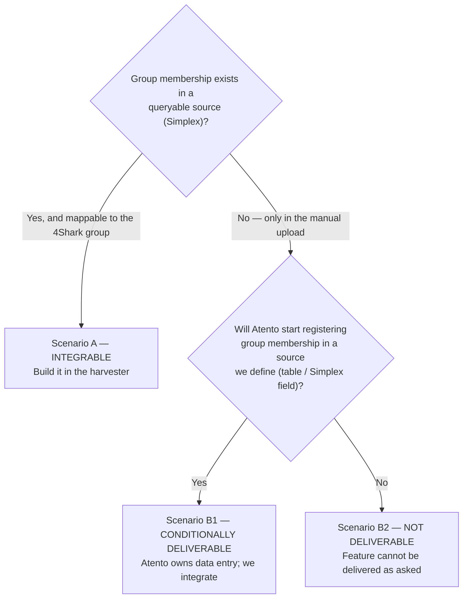

# PLAN — Groupification for Atento: can we even integrate it, and under what conditions?

Purpose: structure the conversation with Atento (Mexico). This is **not** an implementation plan — it is a decision map. The pivotal unknown is whether the group-membership data exists anywhere we can integrate. Depending on the answer, Luis Bravo's request is deliverable, conditionally deliverable, or **not deliverable**.

## What Luis Bravo asked for

Keep a terminated employee **computable for ~90 days** after they leave (the commission cascade is paid in arrears over 90 days). On the platform, "computable" = **being in the group** for the period, because the commission calc includes whoever is in the group (`app/models/commission.rb:247-267`, membership drives the calc, no active/inactive filter).

So the request reduces to: **the harvester must keep terminated users in their groups for ~90 days.** That requires the harvester to manage groupifications.

## The hard dependency (why this is blocked)

To manage groupifications, the harvester needs the **group-membership source data** — which group each employee belongs to, per period. Today it does **not** have it:

- **The harvester does not manage groups.** `SaveGroupifications` (the only start/finish writer) is **dead code, no callers** (`SimplexHarvesterService.cs:1051`).
- **The 4Shark group id is never produced.** The hierarchy SP carries `cod_campana` (Simplex campaign) but **never populates `cod_campana_4shark`** (the 4Shark group id) — no `SET` for it in `sql/sp_reporte_jeraquia_4shark.sql` (declared :43, selected :299, never assigned). There is **no campaign→group mapping** anywhere.
- **Today Atento does groups by manual monthly upload** — every month they put everyone in the group with an exit at month-end, then re-upload the next month. The group-membership truth lives in *that upload process*, not in an integrable source.

So: with today's data, **we cannot produce groupifications automatically.** That is the crux to resolve with Atento.

## The pivotal question for Atento

> Does the group-membership per employee (which 4Shark group each person is in, per period) exist in a **queryable source** — Simplex or anything the harvester can read — or does it exist **only inside your manual monthly upload**?

Everything branches on that answer.

## The scenarios

### Scenario A — the data exists in Simplex and maps to the 4Shark group → INTEGRABLE
We can deliver. Work required (rough): (1) resolve `cod_campana` → 4Shark group id (a mapping — where it lives is a sub-decision); (2) emit the monthly entry/exit per active user (replicating the upload); (3) hold retention state so terminated users keep getting entry/exit for ~90 days; (4) obey the app groupification contract (start/finish alternation, `chronological_dates`, `finishing_date`, no retroactive). Then the Atento validation step below.

### Scenario B1 — data is not in a source, but Atento agrees to register it → CONDITIONALLY DELIVERABLE
The data does not exist anywhere integrable, so **Atento must start maintaining it** in a place we define (a new table, a Simplex field, an agreed feed). Message to them: *"we'll create the structure, but you have to register and keep the group membership there."* Once they own that data entry, Scenario A's work applies. **This shifts an ongoing operational burden to Atento** — they must accept it explicitly.

### Scenario B2 — data is not in a source and Atento will not register it → NOT DELIVERABLE
Then Luis Bravo's 90-day feature **cannot be delivered** through the integration: we have no group data to drive groupifications, and we won't invent it. The honest answer to Atento: *"as asked, this can't be done — because the group data lives only in your manual upload; without an integrable source, there is nothing for us to integrate."* Fallbacks to put on the table: they keep the manual upload (status quo, with its monthly re-add already avoiding the retention edge), or the requirement is dropped/re-scoped.

## What we need FROM Atento to resolve the branch

1. Where does group membership live? Is it in Simplex (any table/view), or only in whoever prepares the monthly upload?
2. Is `cod_campana` (Simplex campaign) the same thing as, or mappable to, the 4Shark group? Is there a stable mapping?
3. How exactly does the current monthly upload work (one entry+exit per person per month? exit = last day? mid-month moves)?
4. If the data is not in a source: are they willing to **register and maintain** it going forward in a structure we define?

## If Scenario A or B1 (integration proceeds) — the Atento coordination gates

Both required before a production cutover, no order between them:
1. **Atento stops the manual upload** (otherwise the harvester and the upload fight over the same groupifications).
2. **Atento validates** the harvester-produced groupifications — run on the integrator **staging**, they review ("this one's in the wrong group", etc.), iterate until correct.

## The dead groupification code — remove it, regardless

There is groupification code in the harvester today that does nothing: `SaveGroupifications` (`SimplexHarvesterService.cs:1051`) is the only start/finish writer and it has **no callers**. It is dead weight left over from an earlier attempt, and it does not serve the feature as it stands.

**Removal is decided, not conditional** — this code comes out at the end of this work no matter which scenario we land in. What is optional is whether we write a *new* implementation to replace it. The three outcomes:

- **Not deliverable (Scenario B2)** — we kill the dead code and write nothing new. There is no groupification to integrate.
- **Deliverable but the design is very different (Scenario A/B1, new shape)** — we kill the dead code and start fresh; the old writer does not fit what the integration needs.
- **Deliverable and the dead code is actually usable (Scenario A/B1, reusable)** — we build on it instead of deleting-then-rewriting.

**Leave it in place for now.** It is inert (no callers, no effect), so there is no urgency to rip it out mid-decision. When the branch resolves, we decide the disposition — remove-and-stop, remove-and-rebuild, or adopt — as part of that same step. The one certainty recorded here: it does not survive as-is.

## Relationship to PR #38

The 90-day group retention added to PR #38 (`ScheduleGroupExitOnTermination`) presumed a capability that does not exist — it should be **pulled out** of that PR regardless of the scenario. PR #38 keeps only the termination-detection fix (report/fallback), which is solid and self-contained. Group retention lives or dies with this plan.

## Sources

- `simplex-harvester@worktree` — `Services/SimplexHarvesterService.cs:1051` (`SaveGroupifications`, no callers); `sql/sp_reporte_jeraquia_4shark.sql:43,299` (`cod_campana_4shark` never SET); `Models/Jerarquia.cs:110`.
- `app/models/groupification.rb` (start/finish/chronology/finishing_date rules); `app/models/commission.rb:247-267` (membership drives the calc).
- Engineer context: Atento does groups by manual monthly upload today; the group-membership data may not exist in any integrable source — the whole point to confirm with them.
