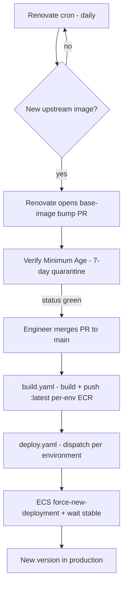

# SPIKE — Docker-image tool repos (build-on-merge, auto-update from upstream)

## Question

How does 4Shark standardize a repository whose deliverable is a **Docker image wrapping a third-party tool** (pgbouncer, keycloak, and future ones), so that a new upstream version flows to production **automatically** with the same supply-chain guarantees the rest of the fleet has?

## Trigger / context

- The `pgbouncer` repo was just brought to the full pattern (build-on-merge to per-env ECR, deploy workflow, Renovate base-image tracking, hadolint CI, min-age supply-chain gate, tag+digest pin, first release). It is the **reference implementation**.
- Next target: `keycloak` — a third-party-built image repo. Current state (via GitHub API): default branch `main`, has a `Dockerfile`, but **no `.github/workflows`** — no CI, no build-on-merge, no deploy, no Renovate. It needs the pattern applied so every new Keycloak upstream version reaches production automatically.

This SPIKE names the standard so it can be applied to `keycloak` and reused for the next tool repo.

## What a "Docker-image tool repo" is

A repo whose only product is a container image — a thin wrapper over an upstream image (edoburu/pgbouncer, quay.io/keycloak/keycloak, …) plus a small amount of 4Shark glue (entrypoint, config injection, shutdown behavior). It is a **deployment artifact**, not a library with parallel release lines. That single fact drives the whole shape below.

## The standard — checklist for any Docker-image tool repo

Each item names **what**, **why**, and **where it lives in the `pgbouncer` reference**.

### 1. Branch model — a single protected `main`

- **What**: one `main` branch. No `develop`, no HubFlow, no `release/*` branches.
- **Why**: the repo is a deployment artifact under trunk-based flow — there is no parallel-maintenance need that GitFlow exists to serve. Merge to `main` == "this is what ships".
- **Where**: governed in Terraform `identity/github_repositories.tf` → `local.main_branch_repositories` (both `pgbouncer` and `keycloak` are already members).

### 2. Base image pin — `tag + digest`, never digest-only

- **What**: `FROM upstream/image:<semver-tag>@sha256:<digest>` (`pgbouncer/Dockerfile:10`).
- **Why**: the digest gives immutability (supply-chain); the **tag is required for Renovate to track the image and open digest-update PRs** — a digest-only pin has no `currentValue`, so Renovate never proposes an update ([Renovate Docker docs](https://docs.renovatebot.com/docker/)). A digest-only pin also hides which upstream version is running. The Dockerfile carries a comment telling future readers not to "clean up" the tag as redundant.

### 3. Renovate — `renovate.json` in the repo root

- **What**: `config:recommended` + `helpers:pinGitHubActionDigests`, `minimumReleaseAge: 7 days`, `rangeStrategy: pin`, with the GHA-digest exemption (Renovate cannot compute release age for moving tags — the custom CI restores it).
- **Why**: Renovate is the engine that watches upstream daily and opens the base-image bump PR. Copied verbatim from the `terraform` repo so every repo shares one policy.
- **Where**: `pgbouncer/renovate.json`.

### 4. CI — hadolint on PR and push

- **What**: `name: Continuous Integration`, one job `Hadolint (Linter)` (`pgbouncer/.github/workflows/ci.yaml`).
- **Why**: lints the Dockerfile on every PR and merge. Matches the `app` repo workflow-naming convention (`Continuous Integration`, not `CI`).

### 5. Supply-chain minimum-age gate

- **What**: `verify-minimum-age.yaml` (PR trigger) + `reverify-minimum-age.yaml` (daily self-healing cron) + `.github/scripts/verify-minimum-age.sh`, producing the `Verify Minimum Age` commit status. All GHA `uses:` pinned by SHA.
- **Why**: enforces the 7-day quarantine per release — the main supply-chain protection (a malicious upstream version is yanked before it reaches mergeable age). Copied from the `terraform` repo.
- **Where**: `pgbouncer/.github/workflows/{verify,reverify}-minimum-age.yaml`, `.github/scripts/verify-minimum-age.sh`.

### 6. Build-on-merge — `build.yaml`, per-environment ECR

- **What**: on push to `main` (and `workflow_dispatch`), **one explicit job per environment** builds the root `Dockerfile` and pushes `:latest` + `:<short-sha>` to `<environment>-<image>` using that environment's GitHub Environment credentials (`pgbouncer/.github/workflows/build.yaml`).
- **Why**: merging to `main` rebuilds every environment's image with no manual step. The ECS task definitions track `:latest` (Terraform-managed); the image is staged in ECR, ready for a deploy.
- **Note**: one job per env (not a matrix) so each binds its own GitHub Environment secret scope. Registry + region are workflow-level `env`.

### 7. Deploy — `deploy.yaml`, `workflow_dispatch` per environment

- **What**: manual dispatch with an `environment` choice → `aws ecs update-service --force-new-deployment` + `aws ecs wait services-stable`. Cluster/service/task-family are all `<environment>-<image>` (`pgbouncer/.github/workflows/deploy.yaml`).
- **Why**: **deploy is decoupled from build**. Build always runs on merge; deploy is an explicit choice, because rolling a new task revision when the running version did not change buys nothing. Deploy only when the version actually changes (or to validate on a single env first — e.g. `beta-001`).

### 8. Graceful shutdown — `STOPSIGNAL` (app-specific)

- **What**: `STOPSIGNAL` set so the container drains cleanly under an ECS rolling deploy (`pgbouncer/Dockerfile:21` → `SIGINT` = pgbouncer `WAIT_FOR_SERVERS`).
- **Why**: zero-dropped-connection deploys. The correct signal is **per tool** — pgbouncer wants SIGINT; keycloak has its own graceful-shutdown behavior to determine when we get there.

### 9. Governance via Terraform (identity stack)

- **What**: the repo is added to `local.main_branch_repositories` (branch protection on `main`) and, once it produces the check, to `local.main_branch_repositories_with_min_age_check` (makes `Verify Minimum Age` a **required** merge check). Dependabot security-only is org-level (applies to every repo automatically).
- **Why**: branch protection + required min-age check are enforced in code, not clicked in the UI. `pgbouncer` is now in both lists (PR #585).
- **Where**: `terraform/identity/github_repositories.tf`.

### 10. Versioning / release — CHANGELOG + tag, deploy decoupled

- **What**: `CHANGELOG.md` (Keep a Changelog + SemVer + yearly-archival note). A release is a feature branch → `main` that dates `## [Unreleased]` → `## [X.Y.Z] - YYYY-MM-DD`; after merge, a `vX.Y.Z` git tag is created (explicit engineer confirmation per tag policy). No `release/*` branch (not a HubFlow repo).
- **Why**: the git tag + CHANGELOG section are the version record — there is no version string in code to bump. Release does not imply deploy (running versions are unchanged).

## The auto-update loop

The whole point of the pattern — a new upstream version reaches production with no bespoke work:

The gates that keep it safe: the 7-day min-age quarantine (step D), branch protection requiring the check (Terraform), and the deploy being an explicit choice (step G) rather than automatic.

## Applicability to `keycloak` (next target)

Current state (GitHub API, `4shark/keycloak`):

| Standard item | keycloak today |
|---|---|
| 1. Single `main` | ✅ default branch `main`, already in `main_branch_repositories` |
| 2. Base image tag+digest | ⚠️ needs verification (read the Dockerfile `FROM`) |
| 3. Renovate | ❌ no `renovate.json` |
| 4. hadolint CI | ❌ no workflows |
| 5. Min-age gate | ❌ no workflows; not in `main_branch_repositories_with_min_age_check` |
| 6. Build-on-merge | ❌ none |
| 7. Deploy workflow | ❌ none |
| 8. Graceful shutdown | ⚠️ tool-specific — determine Keycloak's signal |
| 9. Terraform governance | 🟡 branch protection exists; min-age check not required yet |
| 10. CHANGELOG/release | ❌ verify presence |

So applying the pattern to keycloak = fill items 2–7, 9 (min-age), 10 — the same files copied and parameterized.

### Open questions for keycloak (decide when we get there — do NOT assume)

1. **Which environments** does the Keycloak image deploy to, and what are the cluster/service names? (Keycloak is the authenticator layer — is it per-stack like the poolers, or shared? This drives the per-env jobs in `build.yaml`/`deploy.yaml` and the GitHub Environments.)
2. **Base image source + tag scheme** — `quay.io/keycloak/keycloak`? Confirm the tag format so Renovate tracks it (item 2).
3. **Graceful shutdown** — does the Keycloak container need a `STOPSIGNAL` / preStop behavior for zero-downtime rolling deploys, or does its own lifecycle handle it?
4. **ECR repositories** — do `<env>-keycloak` ECR repos exist (Terraform), or must they be created first (as the pgbouncer ones were)?
5. **Deploy target** — is Keycloak on ECS (like the poolers) or another runtime? The `deploy.yaml` shape assumes ECS `update-service`.

## Promotion path

This SPIKE captures a **reusable 4Shark standard**, not a one-off investigation. Once validated by applying it to `keycloak`, it should be promoted to a `dot-claude` standard doc via PR (candidate: `docs/DOCKER-IMAGE-TOOL-REPOS.md`, Tier 2/3) so future tool repos and future sessions follow it without rediscovery. Until then it lives here as the working reference.
