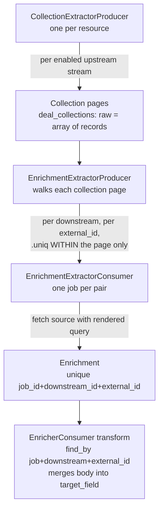

# SPIKE — Deduplicated downstream fetch funnel for the integrator extraction stage

> Repo: `integrator`. Concerns the Extract stage's downstream enrichment fan-out (`app/workers/*/{collection,enrichment}_extractor_*`, `Enrichment`, `Computation`).

## Question

Can the per-downstream enrichment fan-out be replaced by a single **persisted, deduplicated funnel** of everything that must be fetched from a downstream source — deduplicated across pages *and* across streams — so that enqueueing draws from a set already guaranteed unique, each distinct fetch runs exactly once, and duplicate work disappears "once and for all"? And where should that funnel live?

## Current state (what the code does today)

The Extract stage fans out downstream fetches per resource, in three hops:

Grounding:

- The producer dedups external_ids only **within one collection page**: `records.map { |r| r[downstream.source_field] }.compact_blank.uniq` ([enrichment_extractor_producer.rb:23](app/workers/deal/enrichment_extractor_producer.rb:23)), then recurses page by page ([:43](app/workers/deal/enrichment_extractor_producer.rb:43)).
- Each consumer fetches, then `Enrichment.find_or_initialize_by(job_id:, downstream_id:, external_id:)` + `save!` ([api_enrichment_extractor_consumer.rb:33-37](app/workers/deal/api_enrichment_extractor_consumer.rb:33)); the store carries a raw Mongo unique index `{job_id, downstream_id, external_id}` ([enrichment.rb:18](app/models/enrichment.rb:18)).
- The transform stage reads back **per downstream**: `Enrichment.find_by(job_id:, downstream_id:, external_id:)` and merges `record[downstream.target_field]` ([enricher_consumer.rb:20-24](app/workers/deal/enricher_consumer.rb:20)).
- `Computation` is a blind atomic Redis counter pair (`queue`/`executions`, equal ⇒ stage done — [computation.rb:23-46](app/models/computation.rb:23)); every enqueued consumer must increment exactly once.

**Two distinct duplications exist, and the dedup key is different for each:**

1. **Cross-page, same downstream** — the same `external_id` on two collection pages produces two consumers for the same `{job, downstream, external_id}`. They collide on the unique index; today the loser fails and Sidekiq retry heals it (wastefully). This is the case the simple skip-if-exists fix already closes.
2. **Cross-stream, same value** — many downstreams fetch a "parent" or a "user"; the same id is reused across them. Because the key includes `downstream_id`, each `{downstream, external_id}` is a **separate fetch**, even when two downstreams resolve to the *same source and the same rendered request*. This is the waste the funnel idea targets, and the simple fix does **not** touch it.

## The load-bearing insight — the real dedup unit is the RENDERED REQUEST, not the external_id

Two fetches return the same bytes iff they are the same request: same `source_id` + same rendered query. The `external_id` is only an *input* to `Stream#render_query` ([stream.rb:83-92](app/models/stream.rb:83)); two downstreams can share an `external_id` but carry different `query_template` / `target_field`, in which case they are genuinely different fetches and must NOT be merged. Conversely two downstreams with identical `(source, template)` for the same `external_id` are the same fetch and should run once.

So a funnel keyed on `external_id` alone is wrong in both directions. The correct funnel key is a **request signature**: `{job_id, source_id, rendered_query_hash}` (for API sources the rendered URL is the signature; for DB sources the rendered SQL). The engineer's own framing — "uma lista de URLs / recursos a buscar" — is exactly this: the URL/rendered-query *is* the dedup key.

## Persistence — Mongo, and the idempotent primitive it gives

The funnel is integration state that cannot be lost mid-job, so:

- **Redis** — rejected: in-memory, ephemeral; a flush loses the funnel. (It stays the right place for the `Computation` counters, which are reconstructible progress, not data.)
- **File** — rejected: no concurrency control, awkward lifecycle.
- **Mongo** — the store already in use, durable, and it has the exact primitive the engineer asked about.

**"Insert if absent, else do nothing" exists in Mongo** and is atomic: `collection.update_one(filter, { '$setOnInsert' => doc }, upsert: true)` on a unique index — if the doc exists nothing changes, if it does not it is inserted, and under a concurrent race the upsert **no-ops instead of raising** (the raw `insert` is what raises `E11000`). `bulkWrite` of `updateOne`+`$setOnInsert` is the batch form. Mongo has **no row triggers** (that is Atlas Triggers / Change Streams — asynchronous, not applicable). So the funnel row is built with an idempotent upsert, and enqueue draws from the resulting unique set. Sources: [MongoDB community: insertMany ordered:false vs upsert $setOnInsert](https://www.mongodb.com/community/forums/t/is-insertmany-ordered-false-the-same-as-updatemany-with-upsert-and-setoninsert-defined/109822), [oneuptime: idempotent operations in MongoDB](https://oneuptime.com/blog/post/2026-03-31-mongodb-how-to-implement-idempotent-operations-in-mongodb/view).

## The constraint that shapes the model — the transform reads per downstream

Whatever the funnel dedups on, the transform stage still addresses the result **per downstream** (`enricher_consumer.rb:20` looks up by `downstream_id`). A cross-stream-deduplicated fetch must therefore still be resolvable back to every downstream that needed it. This is the crux that separates the options below: dedup the *fetch* while keeping the *per-downstream addressing*, or re-key the whole thing and rewrite the transform lookup.

## Options

| | A — Idempotent consumer (the small fix) | B — Shared fetch layer | C — Full two-phase manifest |
|---|---|---|---|
| **What** | Consumer skips fetch+save when the enrichment (doc + S3 body) already exists | New `Retrieval` entity keyed `{job, source, query_signature}`, built by idempotent upsert; one consumer per unique retrieval; `Enrichment` per downstream points at the shared retrieval body | A dedicated manifest-build phase enumerates all pages × all downstreams first, upserts the unique request set, then enqueues from it |
| **Dedups cross-page** | Yes | Yes | Yes |
| **Dedups cross-stream** | **No** | Yes | Yes |
| **Blast radius** | ~50 consumer files, no model/schema change | producer + consumer + transform lookup + new entity + Computation accounting | whole extract fan-out + Computation shape + a new phase |
| **Transform impact** | none | shared body → N per-downstream pointers (or transform reads by signature) | transform re-keyed |
| **Risk** | low (one narrow storage-heal regression, already scoped) | medium — changes the completion accounting and the transform contract | high — new stage, new failure modes, in-flight-migration implications |
| **Ships for the current release?** | yes | no | no |

## Recommendation

**Phase it.** Ship **A** now (it is the change already scoped and reviewed this session, low-risk, and the release is near); pursue **B** as the "solve it once and for all" effort, as its own plan, **after** one empirical question is answered — because B's entire value is the cross-stream win, and that win is unmeasured.

**Measure first (cheap, read-only):** on a real completed job, count how many distinct downstreams share an identical `(source_id, rendered_query)` for the same `external_id`. If reuse is high, B pays for its blast radius; if most downstreams render distinct queries even for the same id, B buys little over A and is not worth the transform-contract change. This is a `Model.collection.aggregate` over the job's enrichments/streams — no mutation.

C is recorded for completeness but is not recommended: the two-phase manifest changes the `Computation` accounting shape and introduces a new stage, and B already captures the dedup win without a new phase.

## Open questions

- **How much cross-stream identical-request reuse actually exists?** The decision between A-only and A-then-B turns on this. Unmeasured today.
- **Does the funnel key on the rendered request or on `(downstream, external_id)`?** The request signature is correct for cross-stream dedup; confirm no downstream renders a non-deterministic query (a timestamp/nonce in the template would defeat the signature).
- **In-flight migration** — B changes what a resumed job reads, so it inherits the same "no job straddles the deploy" constraint as the store-fix and the S3 rename already noted for release 8.5.0; it is not a hot-deploy.
