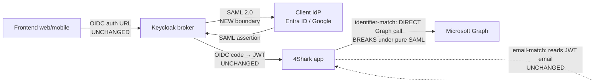

# SPIKE: Federate Keycloak to client IdPs via SAML 2.0

**Status:** Research complete
**Date:** 2026-05-28
**Author:** main session (synthesized from spike auxiliary research after the spike subagent's connection dropped mid-run; code citations re-verified directly against `app` source)

---

## Question

Clients want SSO via **SAML 2.0** instead of OIDC. The proposed approach: change **only** the
**Keycloak ↔ client-IdP** boundary to SAML 2.0, leaving the **Keycloak ↔ `app`** boundary as OIDC
and unchanged — so "our side stays the same, only the Keycloak-to-client communication changes".

Validate or refute that hypothesis with evidence, and identify what actually changes.

---

## VERDICT

The hypothesis is **mostly true, with one sharp exception that the engineer needs to decide on.**

| Boundary / path | Stays the same under SAML? | Why |
|---|---|---|
| Keycloak → `app` (downstream OIDC) | **Yes — identical** | `app` only ever speaks OIDC to Keycloak. It is structurally blind to whether the upstream IdP is OIDC or SAML. Verified in code. |
| Frontend → Keycloak (authorization URL) | **Yes — identical** | The frontend still opens the same `openid-connect/auth` URL; Keycloak handles the SAML hop internally. |
| Mobile `app4shark://callback` deep link | **Yes — identical** | Downstream is unchanged, so the mobile callback is unaffected. |
| User matching **by email** | **Yes — works end-to-end** | `app` reads `email` from the Keycloak OIDC JWT. As long as Keycloak emits the email claim (NameID → email), nothing changes. Zero app changes, zero extra client credentials. |
| User matching **by external identifier** | **NO — this breaks under pure SAML** | Today this path makes a **direct, independent Microsoft Graph call from `app`** — nothing to do with Keycloak. A pure SAML enterprise app provides no Graph credentials. See Task B. |

**Bottom line:** for the common case (email matching), the SAML migration is a Keycloak-only configuration
change — exactly as hoped. But the **identifier-matching** clients depend on a hidden second integration
(`app` → Microsoft Graph) that is independent of Keycloak and does **not** come along for free with SAML.
That case needs a decision (Task D).



---

## Task A — Keycloak SAML upstream federation

Keycloak supports adding an upstream IdP as a **SAML v2.0 Identity Provider** (broker). The broker
exposes an SP descriptor the client registers on their side, and consumes the client's IdP metadata.

**SP endpoints Keycloak exposes** (the client registers these):
- Broker ACS endpoint: `https://<host>/auth/realms/<realm>/broker/<alias>/endpoint`
- SP descriptor (metadata): `https://<host>/auth/realms/<realm>/broker/<alias>/endpoint/descriptor`
  - *"An EXPORT button displays the SAML SP entity descriptor for external provider integration."* — Keycloak docs (`keycloak-saml-idp_doc_1.txt`, source `wjw465150.gitbooks.io/keycloak-documentation/.../identity-broker/saml.html`)

**IdP config Keycloak consumes** (from the client):
- *"Single Sign-On Service URL — specifies the SAML endpoint to start the authentication process"* (required)
- *"Validating X509 Certificate — public certificate for signature validation"*
- NameID Policy Format — *"defaults to `urn:oasis:names:tc:SAML:2.0:nameid-format:persistent`"* (set to **email** for the email-match path)
  - Source: `keycloak-saml-idp_doc_1.txt`

**Recommended signature/encryption settings** (from `skycloak.io/blog/saml-as-an-sp-in-keycloak/`, captured in `keycloak-saml-idp_doc_1.txt`):

| Setting | Value |
|---|---|
| Sign Documents | ON |
| Sign Assertions | ON |
| Encrypt Assertions | ON |
| Force POST Binding | ON |
| NameID Format | `email` + Force Name ID format |

**Attribute mappers (the SAML equivalent of the Graph lookup):** `keycloak.AttributeImporterIdentityProviderMapper`
maps assertion attributes to Keycloak user attributes:
- *"OIDC providers: Maps ID or access token claims … SAML providers: Maps assertion attributes to user attributes"* — `keycloak-saml-idp_doc_2.txt` (source `pulumi.com/.../attributeimporteridentityprovidermapper/`)
- For SAML: `attribute_name` = *"the name of the attribute to search for in the assertion"*

**Two-stage mapping flow** — this is the mechanism that makes SAML-upstream + OIDC-downstream work for
non-email attributes (`keycloak-saml-idp_doc_3.txt`):
1. **SAML assertion → Keycloak user attribute** (Attribute Importer mapper on the IdP)
2. **Keycloak user attribute → OIDC token claim** (User Attribute mapper on the downstream OIDC client)

> **Operational gotcha (must not miss):** the Attribute Importer alone is **not** sufficient for the value
> to reach `app`. A second mapper on the downstream OIDC client is required for the claim to appear in the
> JWT. Source: Keycloak discussion #8462 — *"Access Token claims not imported using Identity Provider
> Attribute Importer Mappers"* (`keycloak-saml-idp_doc_3.txt`).

---

## Task B — Does the Keycloak → `app` boundary really stay identical? (CODE — load-bearing)

**Yes for the OIDC token exchange; the catch is the identifier path uses a separate Graph integration.**

### The downstream exchange is pure OIDC and upstream-agnostic

`Authenticator#find_email_by` exchanges the code and decodes the JWT — it talks **only** to Keycloak's
`openid-connect/token` endpoint and never references the upstream IdP type:

> `app/app/models/authenticator.rb:21` — `token_url = "#{authenticator_configuration.url}/realms/#{authenticator_configuration.realm}/protocol/openid-connect/token"`
> `app/app/models/authenticator.rb:29` — `decoded_token_body, _token_encryption = JWT.decode(token, nil, false, { algorithm: 'RS256' })`
> `app/app/models/authenticator.rb:30` — `decoded_token_body['email']`

This confirms: whether the user authenticated upstream via OIDC or SAML, `app` sees the same OIDC JWT.
**No app change for the email path.**

### The two matching paths

`Authentication::SessionsController#current_user` branches on `identity_provider_user_uuid`:

> `app/app/controllers/authentication/sessions_controller.rb:42-52`
> ```ruby
> if authenticator_configuration.identity_provider_user_uuid.present?
>   user_identifier = authenticator_configuration.find_user_identifier_by(code: params[:code], base_url: request.base_url)
>   return unless user_identifier
>   @current_user = current_company.users.enabled.joins(:identifiers).find_by('user_identifiers.value': user_identifier)
> else
>   email = authenticator_configuration.find_user_email_by(code: params[:code], base_url: request.base_url)
>   @current_user = current_company.users.enabled.find_by(email: email)
> end
> ```

- **Else branch (email match):** reads `email` from the JWT. Upstream-agnostic. **Unchanged under SAML.**
- **If branch (identifier match):** calls `find_user_identifier_by`, which does **email → Graph → identifier**.

### The identifier path is a direct app → Microsoft Graph call, independent of Keycloak

`AzureIdentityProvider#find_user_identifier_by` authenticates to Azure with the **IdP credentials**
(`client_credentials` grant) and queries Graph directly:

> `app/app/models/authenticator_configuration/azure_identity_provider.rb:13` — `Faraday.post("https://login.microsoftonline.com/#{configuration.identity_provider_tenant_id}/oauth2/v2.0/token")`
> `app/app/models/authenticator_configuration/azure_identity_provider.rb:22` — `Faraday.get('https://graph.microsoft.com/v1.0/users')`
> `app/app/models/authenticator_configuration/azure_identity_provider.rb:39-40` — `"client_id=#{configuration.identity_provider_client_id}&scope=https%3A%2F%2Fgraph.microsoft.com%2F.default&client_secret=#{configuration.identity_provider_client_secret}&grant_type=client_credentials"`

Three consequences this code makes explicit:

1. **The Graph call has nothing to do with Keycloak.** It uses `identity_provider_client_id/secret/tenant_id`
   (the IdP App Registration credentials), not the Keycloak client. Changing the Keycloak↔IdP boundary to
   SAML does not touch this code path at all — but a pure SAML enterprise app **does not issue** a client
   secret or grant Graph permission, so the credentials this path needs would no longer exist.
2. **Identifier matching is Microsoft-only today.** `AuthenticatorConfiguration#identity_provider` hard-wires
   `AzureIdentityProvider` (`authenticator_configuration.rb:131` — `@identity_provider ||= AzureIdentityProvider.new(self)`).
   There is no Google equivalent. Google clients can only match by email regardless.
3. **Even the identifier path first needs the email** (`azure_identity_provider.rb` filters Graph by
   `"Mail eq '#{email}'"`, and the email itself comes from `find_email_by`). So the JWT email claim is
   load-bearing in **both** paths.

---

## Task C — What changes in CLIENT onboarding

The headline difference across both IdPs: **SAML replaces the client-secret model with certificate-based
metadata exchange.** The client no longer sends a `client_id` + `client_secret`; they send IdP metadata
(SSO URL, entityID, signing certificate) and Keycloak sends them the SP descriptor (ACS URL, entityID).

### Microsoft Entra ID (SAML enterprise application)

Source: `keycloak-saml-idp_doc_4.txt` (Microsoft Learn — *"Enable single sign-on for an enterprise
application with a relying party security token service"*). Microsoft's own docs describe **Keycloak acting
as the relying-party STS** — exactly the 4Shark scenario.

- Client path: Entra admin center → Enterprise apps → New application → *"Integrate any other application
  you don't find in the gallery (Non-gallery)"* → Single sign-on → SAML.
- Client enters (from Keycloak's SP descriptor): **Identifier (Entity ID)** and **Reply URL (ACS URL)**.
- Client sends back: *"the values of the Login URL, Microsoft Entra Identifier, and Logout URL"* plus
  either the **App Federation Metadata URL** or the downloaded **Certificate (Base64/Raw)**.
- Claims: *"By default, only a few attributes … are included in the SAML token … You can add additional
  claims … and change the attribute provided in the SAML name identifier."* (Attributes & Claims → Edit;
  Name ID via the *Unique User Identifier (Name ID)* row).
- **No client secret. No Graph admin consent** (when the identifier travels in the assertion instead of via Graph).

### Google Workspace (custom SAML app)

Source: `keycloak-saml-idp_doc_4.txt` (Google — *"Set up your own custom SAML app"*). **Different product
surface than today:** custom SAML apps live in the **Admin Console (`admin.google.com`)**, not the Cloud
Console (`console.cloud.google.com`) where the current OAuth client is created. Requires a super-admin.

- Client path: Apps → Web and mobile apps → Add App → Add custom SAML app.
- Google provides: **SSO URL, Entity ID, Certificate** (or IdP metadata download).
- Client enters (from Keycloak): **ACS URL** (`.../broker/<alias>/endpoint`) and **Entity ID** (the realm
  entity ID or broker-specific entity ID).
- Attribute mapping configured Google-side: *"Click Add mapping to map user attributes …"*; NameID default
  is primary email.
- No client secret; certificate-based trust.

### Contrast with the current OIDC instructions (runbook Step 3)

| | Current (OIDC) | SAML |
|---|---|---|
| Entra surface | App Registration (entra.microsoft.com) | Enterprise application, non-gallery |
| Google surface | OAuth client (console.cloud.google.com) | Custom SAML app (admin.google.com) |
| Trust material | client ID + client secret | metadata + signing certificate |
| Graph admin consent (`User.Read.All`) | required for identifier matching | not needed *if* identifier ships in the assertion |
| What 4Shark sends the client | broker redirect URI | SP descriptor (ACS URL + entityID) |

---

## Task D — Gaps, risks, open decisions for the engineer

1. **The identifier-matching clients are the real decision.** Email-match clients migrate with a
   Keycloak-only change. Identifier-match clients hit the Graph dependency (Task B). Options:
   - **(D1) Keep Graph alongside SAML** — the client registers **both** a SAML enterprise app (for login)
     **and** an App Registration with `User.Read.All` consent + secret (for the Graph lookup). Zero app
     change, but contradicts "clients are happy with SAML" — they still do the heavy OIDC/Graph setup.
   - **(D2) Move the identifier into the SAML assertion** — client adds the identifier as a claim; Keycloak
     maps it (two-stage mapper, Task A) into the JWT; `app` reads it from the JWT instead of calling Graph.
     This **is an app code change** (the `if` branch in `sessions_controller.rb:42-52` and the
     `AzureIdentityProvider` Graph call would be replaced by a JWT-claim read). Cleaner long-term, removes
     the Microsoft-only limitation, but it is no longer "our side stays the same".
   - **Recommendation to discuss:** D2 for new SAML clients (it generalizes to Google too and kills the
     Graph dependency), but it must be scoped as an explicit app change, not assumed away.
2. **Email claim must be guaranteed in the JWT.** Both matching paths depend on `decoded_token_body['email']`.
   Under SAML this requires NameID format = email (or an explicit email attribute mapper) **and** a
   downstream OIDC-client mapper that puts it in the access token. Confirm before any client goes live.
3. **`AuthenticatorConfiguration` validations assume the OIDC/Graph world.** `client_secret`,
   `identity_provider_client_id`, `identity_provider_client_secret` are all `presence: true`
   (`authenticator_configuration.rb:111-114`), and `identity_provider_tenant_id` is required for Microsoft
   (`:115`). Under pure SAML (option D2) several of these become meaningless but are still mandatory — the
   model would reject a SAML-only config. This is a schema/validation decision, not just Keycloak config.
4. **Realm strategy.** Dedicated realm per SAML client (matches the current OIDC default in the runbook) vs
   shared realm with multiple IdPs. Recommend keeping dedicated-realm for isolation.
5. **Mobile, frontend, rollback, X-Frame-Options** — all unchanged (downstream untouched; broker still serves
   the OIDC authorization URL the frontend already uses).

---

## What this feeds (not done here)

- **Runbook extension:** add a "SAML variant" to `ADD-SSO-CLIENT.md` (Step 2 Keycloak config and Step 3
  client instructions get SAML branches). Material for both is in Tasks A and C.
- **Client-facing instructions:** Entra SAML enterprise app + Google custom SAML app, addressed-to-client
  like the existing Step 3 blocks. Material in Task C / `keycloak-saml-idp_doc_4.txt`.
- **App decision (D1 vs D2)** must be settled before the identifier-matching clients can move — that is a
  planning/architecture decision, not documentation.

> Note: the runbook currently lives in the `terraform` repo
> (`terraform/docs/runbooks/client-onboarding/ADD-SSO-CLIENT.md`). The engineer flagged it may belong in
> dot-claude instead — separate concern, not addressed by this spike.

---

## Sources

**Code (verified directly against `app` source this session):**
- `app/app/controllers/authentication/sessions_controller.rb`
- `app/app/models/authenticator.rb`
- `app/app/models/authenticator_configuration.rb`
- `app/app/models/authenticator_configuration/azure_identity_provider.rb`

**External (fetched by the spike subagent; verbatim quotes preserved in the auxiliary files):**
- `keycloak-saml-idp_doc_1.txt` — Keycloak SAML IdP config + SP descriptor + signing settings
- `keycloak-saml-idp_doc_2.txt` — Attribute Importer mapper (SAML assertion → user attribute)
- `keycloak-saml-idp_doc_3.txt` — two-stage mapping flow + discussion #8462 gotcha
- `keycloak-saml-idp_doc_4.txt` — Entra SAML enterprise app + Google custom SAML app
- `keycloak-saml-idp_excerpt_1.rb` — app code excerpt captured by the spike (matches verified source)
