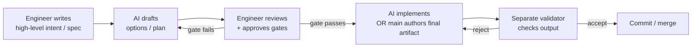
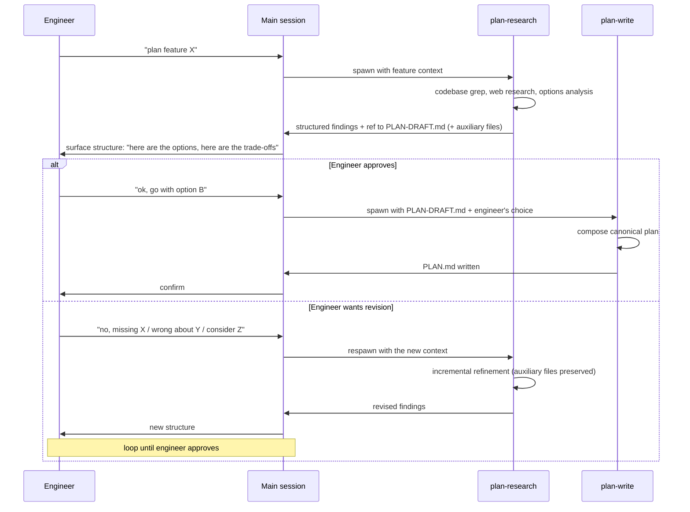

# SPIKE — Planner Agent Design under the Research-Only Contract

**Date:** 2026-05-15
**Question:** how is the community doing planner-shaped AI agents? Do they delegate planning fully to a subagent? Do they have the same fabrication problem? Does the "engineer evaluates by hand" hypothesis hold up against industry practice?
**Related spike (predecessor):** `~/.claude/plans/active/spike/subagent-shallow-execution-and-verification/SPIKE.md` — established that subagents fabricate conclusions and main accepts them as truth. This spike investigates the *next* question: given the research-only contract, how should planner / task-creator / spike actually work?

**Status of related work:** PR [#163](https://github.com/4shark/dot-claude/pull/163) introduces the Subagent Contract (research-only). This spike does NOT propose changes; it gathers evidence. Decisions on planner redesign are deferred until the engineer reads this.

---

## Engineer's stated hypothesis (the question driving this spike)

> *"Eu acho ruim ele planejar tudo sozinho no subagente, sem falar com o engenheiro. De repente, ele só cria arquivos temporários numa pasta. A gente dá permissão para ele fazer isso ou com os achados ou com as opções, e aí volta pra main e a main analisa, mostra para o engenheiro a ideia da estrutura. O engenheiro valida, e aí a main cria de fato o plan."*

In short: subagent drafts options to a temp file → main reads → engineer validates → main writes the canonical `PLAN.md`. Engineer wants to know if the community has converged on this or something different.

---

## Finding 1 — the industry has converged on Spec-Driven Development (SDD), and SDD is engineer-gated, not autonomous

GitHub Spec Kit (90,000+ stars, 8,000+ forks as of May 7 2026) is the canonical reference. It defines a 3-command workflow:

1. `/speckit.specify` — the engineer writes the spec, AI helps draft. The result is "team-reviewed specifications" that are "expressed and versioned, created in branches, and merged" like code.
2. `/speckit.plan` — the AI generates the plan from the engineer's spec, NOT from a high-level prompt.
3. `/speckit.tasks` — the AI decomposes the plan into tasks.

**Critical constraint:** the AI MUST mark ambiguities, not guess:

> *"Mark all ambiguities: Use [NEEDS CLARIFICATION: specific question]. Don't guess: If the prompt doesn't specify something, mark it."*

**Critical gate:** before code generation, the engineer signs off on "Pre-Implementation Gates":

- Simplicity Gate (≤3 projects?)
- Anti-Abstraction Gate (using framework directly?)
- Integration-First Gate (contracts defined?)

If gates fail, the spec author MUST "document why in the 'Complexity Tracking' section, creating accountability for architectural decisions." And: *"Tests are validated and approved by the user. Tests are confirmed to FAIL (Red phase)"* before implementation code is generated.

The shape is: **engineer authors spec → AI drafts plan → engineer approves gates → AI implements**.

Sources:
- [github/spec-kit](https://github.com/github/spec-kit)
- [github/spec-kit — spec-driven.md](https://github.com/github/spec-kit/blob/main/spec-driven.md)
- [GitHub Blog — Spec-driven development with AI](https://github.blog/ai-and-ml/generative-ai/spec-driven-development-with-ai-get-started-with-a-new-open-source-toolkit/)

## Finding 2 — even with SDD, agents still fail to follow plans. Birgitta Böckeler (Martin Fowler) documented it

Böckeler's comparison of Kiro, Spec Kit, and Tessl (martinfowler.com, exploring-gen-ai series) is the most candid critique. Direct quotes:

> *"Just because the windows are larger, doesn't mean that AI will properly pick up on everything that's in there."*

> *"I frequently saw the agent ultimately not follow all the instructions"*

> *"Lots of up-front spec design [may not be] a good idea, especially when it's overly verbose."*

> *"The past has shown that the best way for us to stay in control of what we're building are small, iterative steps."*

> These tools may create *"false sense of control"* rather than genuine oversight.

This is direct evidence that **the engineer's instinct is correct**: even the most structured spec-driven workflows produce agents that drift. The fix is NOT bigger specs; it is **iterative, engineer-gated checkpoints**.

Source: [martinfowler.com — Understanding Spec-Driven-Development: Kiro, spec-kit, and Tessl](https://martinfowler.com/articles/exploring-gen-ai/sdd-3-tools.html)

## Finding 3 — verification is more important than generation. Vadim Geshel's "The Agent That Says No"

This is the strongest match for the engineer's hypothesis. Core thesis:

> *"An autonomous improvement system without verification is just autonomous damage."*

> *"More generation without better verification is a net negative."*

Empirical backing from Google's 2025 DORA Report: **a 90% increase in AI adoption correlates with a 91% increase in code review time**. Generation grew; verification cost grew with it; net productivity barely moved.

Geshel's architecture: a dedicated **Verification Gate agent** that runs after generation, before commit. Read-only. Four verdicts: `ACCEPT`, `ACCEPT_WITH_WARNINGS`, `REJECT`, `PARTIAL`. The bias is explicit:

> *"False negatives (accepting bad changes) are treated as far more dangerous than false positives."*

The engineer defines the rules; the AI applies them. The agent does not invent quality criteria.

Source: [vadim.blog — The Agent That Says No: Why Verification Beats Generation](https://vadim.blog/verification-gate-research-to-practice)

## Finding 4 — practitioner experience confirms the validator pattern

The DEV.to article "How I Validate Quality When AI Agents Write My Code" (Teppo Niemi) is a concrete production account:

- *"In an AI-native workflow, I spend roughly 70% of my time defining requirements, not writing code."*
- A **separate validator agent** with separate prompt and separate context: *"It has no incentive to pass."*
- *"Commits are blocked until the validator returns PASS."*
- Failure example: the developer agent forgot to update a Firestore converter; *"Data would be written to the database but silently lost on read."* Tests passed, types passed, architecture failed.
- The solution was NOT better prompts — it was **independent validation gates**.

Source: [dev.to — How I Validate Quality When AI Agents Write My Code](https://dev.to/teppana88/how-i-validate-quality-when-ai-agents-write-my-code-481c)

## Finding 5 — even fully autonomous loops require human-defined inputs

"Ralph" — a documented autonomous Claude Code loop (knightli.com) — is interesting because it is *aggressively autonomous*. Yet:

> *"Write a PRD first"* — engineer writes the product requirements document
> The PRD becomes `prd.json` — structured stories the AI executes against
> Each iteration runs typecheck + tests + CI; commits only on PASS
> *"Start a brand-new AI coding session for every iteration"* — to avoid context bloat

Even Ralph, the most autonomous setup, does not have the AI invent the plan. The engineer authors stories; the AI executes them.

Source: [knightli.com — What Ralph Is](https://www.knightli.com/en/2026/04/27/ralph-autonomous-agent-loop-claude-code-amp/)

## Finding 6a — Anthropic's own multi-agent research system uses exactly the research-subagent-writes-to-file pattern

This is the strongest external match for the engineer's proposed redesign. Anthropic's published architecture for their internal Research feature (the one that outperformed a single Claude Opus 4 agent by **90.2%** on their internal research eval):

> *"A lead agent coordinates the process while delegating to specialized subagents that operate in parallel."*

> *"The subagents act as intelligent filters by iteratively using search tools to gather information and then returning a list of results to the lead agent so it can compile a final answer."*

The critical detail — direct match for the engineer's "temp file" proposal:

> *"Instead of subagents reporting findings back through chat-style returns — long, lossy, expensive on lead-agent tokens — they write to a shared filesystem and return a lightweight reference."*

This is exactly what the engineer proposed: subagent writes findings to a file, returns a reference; main (the "lead agent" in Anthropic's terminology) compiles the canonical output.

Effort-scaling rules Anthropic embedded in their prompts:
- 1 subagent for simple fact-finding
- 2–4 subagents for direct comparisons
- 10+ subagents for complex research

The 2–4 range maps naturally to the planner case: one research subagent surveying patterns, one surveying constraints, one surveying web/community precedent. Returns three artifacts main reads, presents to engineer, then a separate writer subagent composes the canonical plan.

Source: [Anthropic Engineering — How we built our multi-agent research system](https://www.anthropic.com/engineering/multi-agent-research-system)

## Finding 6b — "Separation of Planning and Execution" is named as a canonical pattern

The DEV.to article "Separation of Planning and Execution: The Key Pattern for Reliable AI Coding Agents" (Varun Bhardwaj) names this exact split:

> *"This architectural pattern separates the planning phase from the execution phase, generating a complete plan first — a spec, a file map, test criteria, an ordering of changes — and only then executing against that plan."*

> *"Planning is divergent — it explores possibilities, considers constraints, and makes trade-offs. The architectural pattern transforms flaky, meandering agent sessions into predictable, reviewable workflows."*

> *"Re-read file contents before each execution step rather than caching them from the planning phase to avoid plan staleness."*

Key recommendation: structured formats (numbered steps, explicit file paths) work better than prose paragraphs for the plan output. This matches the engineer's intuition that a structured draft file is the right shape for engineer review.

The Angy product (referenced in the same search) is even more direct: it implements "Plan → Build → Test" with an **adversarial Counterpart agent that strictly verifies all code** — another match for the validator pattern.

Source: [dev.to — Separation of Planning and Execution: The Key Pattern for Reliable AI Coding Agents](https://dev.to/varun_pratapbhardwaj_b13/separation-of-planning-and-execution-the-key-pattern-for-reliable-ai-coding-agents-5b53)

## Finding 6c — Plan-and-Solve is a documented academic pattern

The "Plan & Solve Agent Pattern" (agent-patterns.readthedocs.io, ema.ai "Plan-and-Execute Agent") is the formalization:

- **Plan phase:** decompose the task, surface options, identify dependencies
- **Solve phase:** execute the plan step-by-step

Engineer-gating between Plan and Solve is the human-in-the-loop variant. This is the named pattern the engineer's proposal implements.

## Finding 6 — "AI drafts, human reviews" is the consistent pattern

"From Vibe Coding to Spec-Driven Development" (Towards Data Science) captures the consensus pattern:

> *"We start by doing the hard thinking ourselves: making architectural decisions, defining requirements, and documenting them in a structured markdown specification."*

> *"With agentic engineering, the role of the developer shifts toward steering, reviewing, and making architectural decisions, rather than directly writing specifications or code."*

> *"It's worth spending time now aligning on the plan, because this specification will later translate into thousands of lines of code."*

> *"You can also ask a second agent — with fresh context — to critique the plan."* (the validator pattern again)

Source: [towardsdatascience.com — From Vibe Coding to Spec-Driven Development](https://towardsdatascience.com/from-vibe-coding-to-spec-driven-development/)

---

## Finding 7 — canonical agent role names exist; we should use them

Multi-agent system patterns guides (Polarix, Innovatrix, Inductivee, Galileo) converge on a stable vocabulary for agent roles:

| Canonical role | What it does | Sources |
|---|---|---|
| **Orchestrator** | Coordinates other agents, decomposes goals | Anthropic, Polarix, Sunil Rao |
| **Planner** | Decomposes the goal into a task graph; the "Brain" | Microsoft Copilot, multi-agent design guides |
| **Researcher** | Long-running research assistant for deep-dive questions | Microsoft Copilot, Sunil Rao, multi-agent docs |
| **Analyst** | Discovers the environment (data, results, previous outputs); the "Eyes" | Microsoft Copilot |
| **Executor** / **Builder** | Carries out the plan steps | Plan-and-Execute, Angy, redis.io |
| **Composer** / **Synthesizer** | Combines inputs into a final artifact | Polarix "Synthesiser" role |
| **Verifier** | Reviews the executor's output against requirements | Plan-and-Execute pattern, polarix |
| **Evaluator** | Validates outputs against objective acceptance criteria | Plan-Do-Verify cycle |
| **Critic** | Probes for subjective weaknesses, edge cases, hidden assumptions | Plan-Do-Verify cycle |
| **Reviewer** | Quality control on completed work | Multi-agent design pattern team |
| **Retriever** / **Memory Keeper** / **Mediator** / **Monitor** | Specialized support roles | Polarix taxonomy |

The naming convention is `[Role/Function] Agent`. The Supervisor-Worker pattern is the production standard.

For our 2-agent planning pipeline, the canonical names are clear:
- First agent → **Researcher** (gathers patterns, options, trade-offs)
- Second agent → **Composer** (combines validated draft into canonical artifact)
- Optional separate role → **Verifier** (read-only review of either agent's output)

We should NOT invent names. We should use `plan-researcher` + `plan-composer` (or similar), pulling directly from this taxonomy.

Sources:
- [Polarix — Designing a State-of-the-Art Multi-Agent System](https://polarixdata.com/en/blog/designing-a-state-of-the-art-multi-agent-system/)
- [Sunil Rao — Architect's Guide to Agentic Design Patterns](https://medium.com/data-science-collective/architects-guide-to-agentic-design-patterns-a184216c1660)
- [Microsoft 365 — Introducing Researcher and Analyst in Copilot](https://www.microsoft.com/en-us/microsoft-365/blog/2025/03/25/introducing-researcher-and-analyst-in-microsoft-365-copilot/)
- [Innovatrix — Agentic AI Design Patterns 2026: ReAct, Reflection & Tool Use](https://www.innovatrixinfotech.com/blog/agentic-ai-design-patterns-react-reflection-tool-use)
- [Galileo — Multi-Agent Coordination Strategies](https://galileo.ai/blog/multi-agent-coordination-strategies)

## Finding 8 — verifiers have a concrete check list; we don't have to invent it

Vadim's Verification Gate (Finding 3) runs five specific checks:
- **Coherence Check** — does the change make sense within its own scope
- **Cross-Skill Check** — does it interact cleanly with other parts
- **Convention Check** — does it follow documented project conventions (CLAUDE.md rules)
- **Regression Check** — does it break existing behavior
- **Build Check** — does it pass automated build/lint (concrete: `pnpm lint`, `pnpm build`)

Each produces a confidence score (0.0–1.0). Verdicts: `ACCEPT`, `ACCEPT_WITH_WARNINGS`, `REJECT`, `PARTIAL`. False negatives (accepting bad work) are weighted more heavily than false positives.

Niemi's separate validator (Finding 4): checks against "acceptance criteria" — defined by the engineer upfront — and "has no incentive to pass."

The AI Coding Agents 2026 quality-gate list (search Finding) — applies to code; for our case (validating *documents*) the subset that maps is:

| Check | Applies to documents? | Concrete form for our case |
|---|---|---|
| Coherence | Yes | No internal contradictions in the file |
| Cross-Skill | Adapted | References to other files/agents/skills resolve to things that exist |
| Convention | Yes | File matches the document type's template structure |
| Build | Adapted (no compile, but) | Markdown is well-formed (no broken links, no orphan headings) |
| Regression | Skip | Documents don't have regressions in the code sense |
| Citation Integrity | New for us | Every quote matches the cited source (file:line content, URL substring) |
| Scope Containment | New for us | For composer agents, output contains nothing beyond the validated draft + engineer's choice |

This gives us a concrete check list, not an invented one.

---

## Industry consensus (synthesis)

The community has converged on a clear pattern, applied across Spec Kit, Kiro, Tessl, Ralph, and practitioner accounts:



- **Engineer never disappears** from the loop. The role shifts from author to architect-and-reviewer, but the gate is human.
- **Specs precede plans**; plans don't come from thin air.
- **Validators are separate agents** with read-only role, biased against false-positives (accepting bad work).
- **The engineer's "AI evaluates AI" skepticism is validated by Vadim and by Böckeler.** Verification is the bottleneck, not generation.

## Answers to the engineer's specific questions

**Q: How is the community doing planner?**
A: Spec-first, AI-drafted, engineer-reviewed, AI-implemented. The plan is **derived from an engineer-authored spec**, not generated from a high-level prompt. The plan must pass engineer-approved gates before implementation.

**Q: Do they delegate planning fully to a subagent?**
A: No. The strongest tools (Spec Kit, Ralph) require engineer-authored inputs and engineer-approved checkpoints. Even Kiro's three-step AI workflow expects engineer review at each step.

**Q: Do they have the same fabrication problem?**
A: Yes. Böckeler observed agents "ignore detailed planning instructions and create duplicates despite research documentation" — *with* spec-driven tooling in place. The Firestore-converter example from DEV.to shows the same shape: tests passed, types passed, but the agent missed an architectural consistency the engineer would have caught. Spec-driven workflows reduce the problem; they do not eliminate it.

**Q: Engineer's "verify by hand" hypothesis — does it hold?**
A: It is the industry consensus. The DEV.to author dedicates 70% of his time to requirements. Spec Kit forces user approval on tests before implementation. Vadim's central thesis is *"verification beats generation."* The engineer's instinct is correct.

---

## Implications for the dot-claude agents

This SPIKE does NOT propose changes — the engineer asked for evidence first. Implications are surfaced here for the discussion that follows.

### The 4 DDD agents (knowledge-cruncher, context-mapper, process-modeler, domain-modeler)

The engineer proposed an exception: these 4 may write their designated `.md` (KNOWLEDGE / CONTEXT-MAP / PROCESS / DOMAIN) as their sole output.

**Industry alignment:** strong. This matches Spec Kit's pattern — the AI generates a structured artifact from engineer input; the artifact lives in the repository; the engineer reviews and refines. Kiro's three sequential markdown documents (Requirements → Design → Tasks) work the same way.

**Caveat to surface:** Böckeler's critique applies. The artifact must be **reviewed by the engineer before becoming canonical**. The exception is "the agent may write the file" — not "the agent's output is automatically trusted." Main and the engineer still validate before moving to the next DDD phase.

### The orchestrator agent

The engineer wants to keep it. Industry doesn't have a direct analogue — orchestrators in spec-driven tools are typically slash commands or built-in workflow modes, not separate agents. But the orchestrator's role (reading state, suggesting next phase) is benign and trivial. No conflict with industry patterns.

### The planner — engineer decision after refinement (2026-05-15): two-agent pipeline

Engineer's refined proposal:

> *"Vamos quebrar ele em duas rodadas. O cara que faz levantamento e cria as opções é um agente. Isso devolve pro main. O main passa pro engenheiro. O engenheiro valida e, dando tudo certo, passa pro próximo agente. O engenheiro falando: 'preciso de mais estudo, tem algo errado, não gostei.' Volta pro agente de [research]. Ele faz um novo estudo baseado nesse novo contexto, traz um novo draft. A main task devolve pro engenheiro. O engenheiro valida, validando aí, passa pro próximo agente. O agente que faz o plano não vai fazer estudo nem nada."*

**Two distinct agents:**

1. **Plan Research agent** (working name: `plan-research` or `plan-options`)
   - **Job:** read existing patterns (codebase grep, web search, project conventions), surface 2–N options with trade-offs, dependencies, risks
   - **Output:** writes findings to `PLAN-DRAFT.md` + auxiliary files (same pattern as spike — source quotes, codebase excerpts, web fetches as supporting files in the feature directory)
   - **Forbidden:** writing `PLAN.md` itself, picking the "right" option, executing anything
   - **Returns to main:** a structured payload of options + a reference to the draft file

2. **Plan Writer agent** (working name: `plan-write` or `plan-compose`)
   - **Job:** read the engineer-approved `PLAN-DRAFT.md`, compose the canonical `PLAN.md`
   - **Does NOT do research** — works exclusively from the validated draft
   - **Output:** writes `PLAN.md` directly (exception, same as 4 DDD agents)
   - **Forbidden:** introducing new options, deviating from the engineer's validated choices

**Pipeline flow:**



**Industry alignment:** strong. This is the "Separation of Planning and Execution" pattern (Finding 6b) plus Anthropic's research-then-synthesize architecture (Finding 6a) plus Spec Kit's gate-based approval (Finding 1). The novel piece is putting the engineer-gate BEFORE the writer agent runs — but it is a direct generalization of Spec Kit's constitutional gates.

**Naming convention to surface for the engineer:** `plan-research` + `plan-write` reads cleanest, but `planner-research` + `planner-writer` keeps continuity with the existing `@agent-planner` mention pattern. Engineer's call.

**Contract for the two agents:**
- `plan-research`: research-only contract + auxiliary-file write exception (same as spike) + write `PLAN-DRAFT.md` (this one file)
- `plan-write`: write `PLAN.md` (this one file) + may read draft and auxiliary files + may not do new research (no `WebSearch`, no broad `Grep`/`Glob` — only Reads of pre-existing draft and inputs)

### The task-creator — same two-agent pipeline

Engineer's framing: *"A mesma coisa para o task creator."*

Apply the same split:

1. **Task Research agent** (`task-research`)
   - Reads `PLAN.md`, identifies decomposition options, surfaces dependencies, sequencing alternatives
   - Writes findings to `TASKS-DRAFT.md` + auxiliary files (pattern references from codebase, etc.)
   - Returns options to main

2. **Task Writer agent** (`task-write`)
   - Reads engineer-approved `TASKS-DRAFT.md`
   - Composes canonical `TASKS.md`
   - Does not do new research

Same engineer-gate between the two phases. Same loop-on-revision pattern.

**Caveat — possible simplification to surface:** Spec Kit's `/speckit.tasks` is autonomous (no separate human approval before the tasks file is generated), because the upstream plan is already approved. If the engineer accepts the same trade-off for our task-creator, we could collapse it to a single agent that writes `TASKS.md` directly (like the 4 DDD agents). The 2-agent pipeline is more conservative; the single-agent pipeline is faster. **Engineer's call.**

### The spike agent — engineer decision after refinement (2026-05-15)

Engineer decided: spike is **exception, like the 4 DDD agents** — writes its designated `SPIKE.md` directly. PLUS: spike may also write **auxiliary files** alongside `SPIKE.md` when the research surfaces material that doesn't fit inside the spike document itself.

**Auxiliary files — examples from the engineer's framing:**

- Documentation pages fetched from the web that are too long to inline (save as `<topic>_doc_<n>.md` or `<topic>_doc_<n>.html`)
- CSV / Excel data found during the investigation (save as `.csv` / `.xlsx`)
- Raw command output (`terraform plan`, `aws describe-*`, `git log` excerpts) that informed the spike
- Screenshots, diagrams, anything reused by reference inside `SPIKE.md`

**What stays inline in `SPIKE.md`:**

- Links (URLs are short — paste them in)
- Short quotes (5–10 lines from a source)
- The synthesis itself — the findings, trade-offs, recommendation

**Decision rule:** if the content is small enough that quoting it in `SPIKE.md` doesn't bloat the document and the reader can absorb it inline, keep it inline. If the content is big or structured (a full doc page, a table of data), save it alongside and reference from `SPIKE.md` with a relative link.

**Why this matters operationally (engineer's reasoning):**

> *"Quando o engenheiro revisar e ele não gostar do estudo, ele não precisa começar do zero, porque o contexto do que foi usado já foi ali. Então é só falar: ignora esse, ou muda esse, ou adiciona mais esse contexto."*

Translation: when the engineer doesn't like the spike's analysis and wants a revision, the auxiliary files preserve the source material. The engineer can say "ignore source X, weight source Y more, add source Z" — the spike rerun does not need to re-fetch from scratch. **Auxiliary files turn revision into incremental refinement instead of full restart.**

This aligns with Anthropic's pattern (Finding 6a): subagents writing to a shared filesystem and returning lightweight references is precisely the architecture Anthropic uses for their Research feature. The auxiliary files ARE that shared filesystem.

**Industry alignment:** strong. Matches Anthropic's multi-agent research filesystem pattern and the "Supporting Files" convention already documented in this repo's CLAUDE.md (`~/.claude/plans/active/<feature>/` already supports auxiliary materials).

**Contract amendment for spike:**
- Allowed to write `SPIKE.md` (its designated artifact)
- Allowed to write auxiliary files in the same directory when content does not fit inline
- Auxiliary file naming follows the supporting-files convention already in CLAUDE.md (raw data → `.csv`/`.json`/`.xlsx`/`.txt`; doc fetches → `.md`/`.html`; scripts → `.sh`)
- Still forbidden: writing OUTSIDE the spike's own feature directory; writing other workflow document types

### Code-reviewer / security-reviewer

These match Vadim's Verification Gate pattern almost exactly: dedicated read-only agent, runs after generation, returns findings, engineer-gated approval. The current research-only contract is the right shape. No redesign needed.

---

## Recommendation (refined 2026-05-15, pending final engineer sign-off on open questions)

The agent fleet splits into four tiers under the new design:

| Tier | Agents | Rule |
|---|---|---|
| **Pure research-only** (no writes at all) | orchestrator, code-reviewer, security-reviewer | Return findings. Main composes any deliverable. Engineer approves verdict. |
| **Designated `.md` write — one file** | knowledge-cruncher, context-mapper, process-modeler, domain-modeler | May write the single `.md` that is their entire job (KNOWLEDGE/CONTEXT-MAP/PROCESS/DOMAIN). Engineer reviews after. |
| **Designated `.md` write + auxiliary files** | spike | May write `SPIKE.md` AND auxiliary files (sources, raw data, fetched docs) when content does not fit inline. Auxiliary files preserve revision context. |
| **Two-agent research → engineer-gate → writer pipeline** | planner (split into `plan-research` + `plan-write`); task-creator (split into `task-research` + `task-write` — OR collapsed to single agent if engineer prefers Spec Kit's simplification) | Research agent writes `<X>-DRAFT.md` + auxiliary files. Main surfaces structure. Engineer approves or sends back for revision. On approval, writer agent reads validated draft and composes canonical `<X>.md`. |

**Net agent count** under this design: 10 agents → 11 agents (the planner/task-creator split adds 2 agents but removes 0, since the original `planner` and `task-creator` are replaced not augmented). Or 10 agents → 9 if task-creator stays single-agent.

The pipeline pattern is well-supported by industry:
- Anthropic's own multi-agent research system uses lead + parallel research subagents writing to shared filesystem (Finding 6a)
- "Separation of Planning and Execution" is a named canonical pattern (Finding 6b)
- Plan-and-Solve / Plan-and-Execute is the academic framing (Finding 6c)
- Spec Kit's gate-based approval inserts engineer between phases (Finding 1)
- Vadim's "verification beats generation" makes engineer-gating essential (Finding 3)

Implementing this means the Subagent Contract in PR #163 must be amended to allow:
1. Designated-file write exception (per agent, named file)
2. Auxiliary file write for spike and research agents
3. The contract still bans: writing files outside the agent's designated scope, returning verdicts, executing state-changing commands

---

## Engineer decisions captured (2026-05-15)

### Q1 — Task-creator: split or single? → **SPLIT (2 agents)**

Engineer reasoning: *"task creator não toma decisões de alto nível, MAS caso o plan tenha buracos ele pode precisar tomar decisões — então é melhor ter 2 mesmo."*

This is sound. Spec Kit's autonomous `/speckit.tasks` works because Spec Kit's plan is rigorously gated by constitutional checks. Our `PLAN.md` quality is variable; a `task-researcher` that can surface "this plan has a gap" without commit pressure is safer. The cost is small (one extra subagent invocation per feature); the benefit is catching plan gaps before they become task ambiguity that an executor compounds.

**Decision:** `task-researcher` + `task-composer`, same shape as the planner split.

### Q2 — Naming: industry has canonical names; use them

Finding 7 documents the canonical vocabulary. We use it:

- **Researcher** for the first agent in the pipeline (gather patterns, options, trade-offs). Used by Microsoft Copilot, Anthropic's multi-agent research system, all major taxonomies.
- **Composer** for the second agent (combine validated draft into canonical artifact). Closest to Polarix's "Synthesiser" role; "Composer" reads cleaner in English and matches function exactly.
- **Verifier** for the validation role (Vadim, Plan-Do-Verify cycle, Salesforce ReAct guides).

**Decision:**
- Replace `planner` → `plan-researcher` + `plan-composer`
- Replace `task-creator` → `task-researcher` + `task-composer`
- Add new agent → `output-verifier` (or just `verifier`; engineer's call between the two)

### Q3 — Validator: what does it validate?

Six concrete checks, derived from Finding 8 (Vadim's gate + Niemi's validator + Plan-Do-Verify):

| Check | What it does | Pass criterion |
|---|---|---|
| **Citation integrity** | For each `file:line` + quote: open the file, confirm the quote matches the actual content at that line range. For each URL + quote: fetch the URL, confirm the quote substring appears. | All citations verified; failures named and reported |
| **Scope containment** (composer agents only) | For `plan-composer` / `task-composer`: every section/option/decision in the canonical file traces back to (a) the validated draft, OR (b) the engineer's communicated choice. Nothing invented in the composition step. | All material has a documented source |
| **Contract compliance** | No verdict language ("I recommend", "the best option is", "APPROVED", "you should..."). For composer-stage agents the engineer's *choice* may be stated as a fact, but the agent must not editorialize. | No forbidden phrases detected |
| **Template compliance** | Output matches the document type's template — required sections present, in canonical order. | Structure matches `~/.claude/templates/<TYPE>.template.md` |
| **Reference resolution** | Every file/agent/skill/path mentioned in the document exists in the repo at validation time. | No dangling references |
| **Auxiliary-file integrity** (spike + research agents) | Every reference in the main `.md` to an auxiliary file points to a file that exists. No orphan auxiliary files (every aux is referenced from the main `.md`). | Bidirectional integrity holds |

**Verdict shape (per Vadim):** `ACCEPT` / `ACCEPT_WITH_WARNINGS` / `REJECT` / `PARTIAL` plus a confidence score. False negatives (accepting bad work) weighted more than false positives.

**Where verifier runs in the pipeline:**

```
plan-researcher writes PLAN-DRAFT.md ─┐
                                       ├─► verifier (citation/scope/contract/template/refs/aux)
                                       ▼
                              main reads + surfaces to engineer
                              (verifier results shown to engineer too)
                                       │
                              engineer approves the draft
                                       │
                                       ▼
plan-composer writes PLAN.md ─┐
                               ├─► verifier (citation/scope/contract/template/refs)
                               ▼
                       main accepts PLAN.md
```

**Verifier on which agents?**
- `plan-researcher`, `plan-composer`, `task-researcher`, `task-composer` — yes (run on every write)
- `knowledge-cruncher`, `context-mapper`, `process-modeler`, `domain-modeler` — yes (run after each write; engineer reviews after verifier)
- `spike` — yes, with auxiliary-file integrity check active
- `orchestrator`, `code-reviewer`, `security-reviewer` — no (they don't write files)

**Verifier itself:** strict research-only agent. Tools: `Read`, `Grep`, `Glob`, `WebFetch`. Cannot write files. Returns findings. Main decides whether to accept the artifact based on verifier's report + (when applicable) engineer's review.

### Q4 — Same PR

**Decision:** all of this lands in PR #163.

---

## Implementation plan (for the same PR — #163)

### Contract amendments (CLAUDE.md + SUBAGENT-CONTRACT.md)

The Subagent Contract gets three carve-outs, named explicitly:

1. **Designated-file write exception (4 DDD + 2 composers + spike).** Listed agents may write the single named file that is their entire job. Spike additionally may write auxiliary files in its feature directory.
2. **Verifier role.** A separate agent runs after every designated-file write. Read-only. Returns findings.
3. **Composer agents have stricter input bounds.** They may write their target file but may not introduce material beyond the validated draft + engineer's choice. Verifier enforces.

### Agent fleet changes

| Action | Agent file | Notes |
|---|---|---|
| Keep as-is | `agents/orchestrator.md` | Research-only, no writes; already restricted |
| Update — exception | `agents/knowledge-cruncher.md` | May write `KNOWLEDGE.md` |
| Update — exception | `agents/context-mapper.md` | May write `CONTEXT-MAP.md` |
| Update — exception | `agents/process-modeler.md` | May write `PROCESS.md` |
| Update — exception | `agents/domain-modeler.md` | May write `DOMAIN.md` |
| Update — exception + auxiliary | `agents/spike.md` | May write `SPIKE.md` + auxiliary files |
| **Rename + split** | `agents/planner.md` | → `agents/plan-researcher.md` (research role) + new `agents/plan-composer.md` |
| **Rename + split** | `agents/task-creator.md` | → `agents/task-researcher.md` (research role) + new `agents/task-composer.md` |
| Keep as-is | `agents/code-reviewer.md` | Research-only |
| Keep as-is | `agents/security-reviewer.md` | Research-only |
| **New** | `agents/output-verifier.md` | Read-only verifier with the 6 checks |

Net: 10 agents → 12 (split adds 2, new verifier adds 1, old `planner` and `task-creator` retire so net +2 ≠ +3 → 10 → 11. Let me recount: starting 10, remove 2, add 4 → 12.)

Actually: starting 10 (after pr-writer was removed). Remove `planner` and `task-creator` (the originals). Add `plan-researcher`, `plan-composer`, `task-researcher`, `task-composer`, `output-verifier`. Net = 10 − 2 + 5 = **13 agents**.

### Other updates

- `~/.claude/CLAUDE.md` — Available Agents section (replace `@agent-planner`, `@agent-task-creator` with the four new names + verifier); Workflows tables; Documentation Loading hook list (no change — same hook covers all subagents).
- `README.md` — Workflow tables, Agent Reference table.
- `CHANGELOG.md` — Added/Changed entries for the new agents and the contract amendments.

### Smoke-test in this PR

- Manual: invoke `plan-researcher` on a trivial feature, confirm it returns findings + writes `PLAN-DRAFT.md`. Confirm `output-verifier` runs after and returns a report. Confirm engineer-gate flow.
- Capture evidence in the PR description.

### Order of execution

1. SPIKE marked as done (this document)
2. Update CLAUDE.md / SUBAGENT-CONTRACT.md with contract amendments
3. Update 5 existing agents (4 DDD + spike) with their designated-file write exception
4. Delete `planner.md` and `task-creator.md`; create the 4 new `plan-researcher.md`, `plan-composer.md`, `task-researcher.md`, `task-composer.md`
5. Create `output-verifier.md`
6. Update README.md
7. Update CHANGELOG.md
8. Smoke test
9. Single commit, force-push with lease to PR #163

---

## Sources (continued from earlier list)

- [Polarix — Designing a State-of-the-Art Multi-Agent System](https://polarixdata.com/en/blog/designing-a-state-of-the-art-multi-agent-system/)
- [Sunil Rao — Architect's Guide to Agentic Design Patterns](https://medium.com/data-science-collective/architects-guide-to-agentic-design-patterns-a184216c1660)
- [Microsoft 365 — Introducing Researcher and Analyst in Copilot](https://www.microsoft.com/en-us/microsoft-365/blog/2025/03/25/introducing-researcher-and-analyst-in-microsoft-365-copilot/)
- [Innovatrix — Agentic AI Design Patterns 2026: ReAct, Reflection & Tool Use](https://www.innovatrixinfotech.com/blog/agentic-ai-design-patterns-react-reflection-tool-use)
- [Galileo — Multi-Agent Coordination Strategies](https://galileo.ai/blog/multi-agent-coordination-strategies)
- [Salesforce — What Are ReAct Agents?](https://www.salesforce.com/agentforce/ai-agents/react-agents/)
- [agent-patterns.readthedocs.io — Reflexion Agent Pattern](https://agent-patterns.readthedocs.io/en/stable/patterns/reflexion.html)

---

## Sources

- [Anthropic Engineering — How we built our multi-agent research system](https://www.anthropic.com/engineering/multi-agent-research-system) — research-then-synthesize pattern, shared-filesystem references
- [dev.to — Separation of Planning and Execution](https://dev.to/varun_pratapbhardwaj_b13/separation-of-planning-and-execution-the-key-pattern-for-reliable-ai-coding-agents-5b53) — canonical naming
- [agent-patterns.readthedocs.io — Plan & Solve Agent Pattern](https://agent-patterns.readthedocs.io/en/stable/patterns/plan-and-solve.html) — academic formalization
- [github/spec-kit](https://github.com/github/spec-kit) — the canonical SDD toolkit (90k+ stars)
- [github/spec-kit — spec-driven.md](https://github.com/github/spec-kit/blob/main/spec-driven.md) — the workflow definition
- [GitHub Blog — Spec-driven development with AI](https://github.blog/ai-and-ml/generative-ai/spec-driven-development-with-ai-get-started-with-a-new-open-source-toolkit/)
- [martinfowler.com — Understanding Spec-Driven Development: Kiro, spec-kit, and Tessl](https://martinfowler.com/articles/exploring-gen-ai/sdd-3-tools.html) — the most useful critique
- [vadim.blog — The Agent That Says No: Why Verification Beats Generation](https://vadim.blog/verification-gate-research-to-practice)
- [dev.to — How I Validate Quality When AI Agents Write My Code](https://dev.to/teppana88/how-i-validate-quality-when-ai-agents-write-my-code-481c)
- [knightli.com — What Ralph Is: Turning Claude Code and Amp into a Repeatable Autonomous Development Loop](https://www.knightli.com/en/2026/04/27/ralph-autonomous-agent-loop-claude-code-amp/)
- [towardsdatascience.com — From Vibe Coding to Spec-Driven Development](https://towardsdatascience.com/from-vibe-coding-to-spec-driven-development/)
- [Augment Code — What Is Spec-Driven Development? A Complete Guide](https://www.augmentcode.com/guides/what-is-spec-driven-development)
- [thebcms.com — Spec-Driven Development (SDD): The Definitive 2026 Guide](https://thebcms.com/blog/spec-driven-development)
