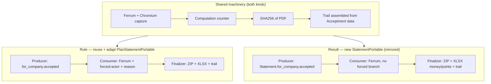

# PLAN — Declaration PDF Export (rule + result) with Evidentiary Trail

> Reference: `SPIKE.md` (this folder, Rounds 1–5) carries every `file:line` citation behind the claims below.
> Supersedes `../signature-pdf-export/PLAN.md` (which covered the rule declaration only, without the evidentiary trail, the result declaration, or the legacy-reuse decision).

---

## Execution status

**Frontend (Phase 1) is IMPLEMENTED and CI-green** — PR [app-webclient#6613](https://github.com/4shark/app-webclient/pull/6613). **Backend (Phase 2) is IN PROGRESS** — the result-side models (PR #5247) AND the result-side workers + manifest (PR #5253) landed 2026-07-22. Remaining: the worker instance sizing (bigger box, keep 10 threads — see Scale & delivery decisions), the DELIVERY REDESIGN (many ZIPs per plano + root index Excel), the rule-side adaptation (`PlanStatementPortable`), and the terraform `worker_portable_exportation` service + Chromium image.

### 2026-07-22 — Backend Phase 2 started: result-side models merged

- **PR [app#5247](https://github.com/4shark/app/pull/5247) (merged)** delivered the new **result-side** mirrored data layer — `StatementPortable` + `StatementPortableBatch`, their STI attachment/download models (`StatementPortableAttachment`, `StatementPortableBatchAttachment`, `StatementPortableDownload`, `StatementPortableBatchDownload`), the two CarrierWave uploaders, the `Company`/`User`/`Statement` associations, and the two migrations. The batch table was created **company-wide, without `calendar_id`** — the company-scoped shape this plan calls for is baked in from creation, so the result side needs **no** calendar-decoupling step (that step remains only on the reused rule-side `PlanStatementPortableBatch`).
- Merged green after a rebase onto the Ruby 4.0.6 upgrade. A small unrelated test cleanup rode alongside as PR [app#5251](https://github.com/4shark/app/pull/5251) — removed a state-machine transition spec that does not match the house testing conventions.
- **Not yet built on the result side**: the `computation` counter on the batch model, and the Producer/Consumer/Finalizer Ferrum pipeline (the worker half of Execution-order step 4). **Still untouched**: the shared infra (step 2), the rule-side adaptation (step 3), and the run (step 5).

### 2026-07-22 — Backend Phase 2 workers merged (result side)

**PR [app#5253](https://github.com/4shark/app/pull/5253)** (branch `feature/portable-exportation-backend`) — result-side Producer/Consumer/Finalizer + manifest. Rubocop-green; **no specs** (chained workers and concrete work_books are not unit-tested in this codebase — the `PlanStatementAudit` triad has zero specs; only `spec/work_books/application_work_book` exists). NOT run locally (postgres was down; and the workers need Chromium + a deployed front to run end-to-end) — CI + review are the gates.

Files: `config/initializers/hire_fire.rb` (added `worker_portable_exportation` dyno, mirrors `worker_deal_indexation`); `app/models/statement_portable_batch.rb` (added `computation` = `Computation.new("statement_portable_batch_#{id}")`, mirrors `Audit#computation` at `audit.rb:115`); `app/workers/statement_portable_batch/{producer,consumer,finalizer}.rb` (triad namespaced under the coordinator model `StatementPortableBatch`, queue `:portable_exportation`); `app/work_books/statement_portable_work_book.rb` + `.../statements_work_sheet.rb` (manifest, following `StatementAuditWorkBook` + `StatementsWorkSheet` — Axlsx, inline i18n titles via `human_attribute_name`, NO header constant, flow inline in `add`). NOTE: `gem 'ferrum'` and `config/sidekiq_portable_exportation.yml` were ALREADY on develop from a prior infra PR (the earlier "infra remains" note was wrong).

**Facts resolved this session (must persist):**
- **Entry point = `Producer#perform(company_id)`** — the trigger passes a `company_id` (operator/rake); the Producer creates the batch and fans out one Consumer per statement. NOT a batch_id.
- **Enumeration = ALL statements (`company.statements`)**, NOT `.accepted` — the earlier plan text `Statement.for_company(...).accepted` was WRONG (contradicts the objective "all of them"). Engineer confirmed: export every declaration.
- **Front URL = `company.primary_webclient_host`** (`db/schema.rb:525`, `null: false`; also `webclient_hosts` array). Consumer navigates to `https://#{host}/statements/#{statement_id}?expand=true`.
- **Capture auth (FINAL, adopted 2026-07-22, commit `4692ae00`)** = mint `JsonWebToken.encode(user_id: owner.id)` (`json_web_token.rb:6`) → navigate to the SPA's own token-login route `https://#{host}/session/create?token=#{token}`, `wait_for_idle`, THEN navigate to the statement. Supersedes the earlier `localStorage['credentials']` injection (the review flagged the hard-coded localStorage key; the route is the codebase's own pattern per `web_authenticator_configuration.rb:5`). No credential passed/persisted.
- **Owner** = company's SuperAdmin seat user (`company.users.joins(:seat).find_by(seats: { type: 'SuperAdmin' })`). The batch follows the `Document` owned-resource convention (`app/models/document.rb:16,24`: `belongs_to :owner` optional + `validates :owner_id, presence: true`) — validates presence, trusts the flow to supply the owner, NO defensive seat-fallback + raise.
- **Trail/manifest** = the `StatementPortableWorkBook` XLSX IS the evidentiary trail, built at the Finalizer from `Acceptment` (actor, forced=reason present, reason name+description, IP=`acceptment.from`, timestamp, SHA256 of each PDF via reading the portable's attachment). SEPARATE file in the ZIP (never appended to the PDF). Consumer stores the PDF on each `StatementPortable`'s attachment; Finalizer bundles all PDFs + the manifest into a ZIP on the batch's attachment.
- **Sidekiq concurrency (CORRECTED 2026-07-22)** = KEEP the shared `sidekiq_threads` (10 — Sidekiq's recommended default); do NOT lower it. The earlier "must be LOW-concurrency / 1 thread" note is REVERSED — one thread per process does not scale (a huge export would need a huge number of instances). Chromium memory pressure is solved at the INFRASTRUCTURE layer with a bigger ECS instance (≥8 GB vs the standard 4 GB), not fewer threads. See "2026-07-22 — Scale & delivery decisions" below (decision #1).

**Open review findings on #5253 (REAL — fix; NOT false positives):**
- **Idempotency on retry**: no short-circuit when portable/batch already `final`. Consumer re-captures the PDF and `build_attachment` can duplicate the `has_one` attachment; Finalizer rebuilds the ZIP/attachment. Add early-return-when-final + reuse.
- **Tmp collision**: PDF tmp path keyed only on `statement_id` collides across concurrent batches/retries — add the Sidekiq `jid`.
- **Zip append**: `Zip::File.open(zip_path, Zip::File::CREATE)` appends to an existing zip on retry (stale entries) — create clean each run.
- **PR description**: #5253 body says "accepted" but the code exports ALL — correct the description (code is right per the decision above).

**Review findings resolved this round (commit `4692ae00`, all threads replied + resolved):**
- **Auth via `/session/create?token=...`** — ADOPTED (engineer's call), replacing the localStorage injection. See the Capture-auth fact above.
- **File cleanup could raise on retry** — the three `File.delete` (Consumer PDF, Finalizer zip + manifest) swapped for `FileUtils.rm_f` (atomic, never raises on a missing file, so no retry after a successful save+increment). Rubocop `Lint/NonAtomicFileOperation` pointed to this fix.
- **Memory of `attachment.file.read` (SHA256 in the worksheet, PDF into the zip)** — both loops read ONE PDF at a time and release it each iteration, so the footprint is bounded to a single statement PDF and does NOT grow with batch size. Documented with a code comment at each spot. Storage is Fog/S3; sub-PDF chunked streaming has no codebase precedent (would be a separate spike) — the bounded per-iteration read is the practical minimum here.

**Forced flag — does NOT apply to statements (engineer-confirmed domain fact, 2026-07-22):** the earlier "Trail/manifest" line said `forced=reason present`, which is WRONG for statements. For a statement, **only the owner can give the acknowledgement (ciência)** — a statement is never accepted on the owner's behalf, so `acceptment.user_id != statement.user_id` is always false and there is no forced state to record. Consistent with `Acceptment#acceptment_reason_required?` (`acceptment.rb:65`: `return false if statement?`) — the forced/reason marker belongs to plan_statements, not statements. No forced column added; the two Copilot threads asking for it were resolved as not-applicable. **Resolved (commit `218eeb22`):** the engineer decided to REMOVE the three redundant columns — `actor` (duplicated the User column, since the actor is always the owner) and reason-name / reason-description (always empty for statements). The manifest is now 6 columns: Statement, User, accepted, IP (`acceptment.from`), accepted_at, checksum. No workbook spec exists, so nothing broke.

**Brakeman build fix (commit `2826acd4`):** Brakeman `FileAccess` (Weak) flagged `FileUtils.rm_f(manifest.path)` in the Finalizer — "Model attribute used in file name", because `manifest.path` comes through `StatementPortableWorkBook#generate` (`File.new(Rails.root.join('tmp', "manifest-#{id}.xlsx"))`) and the taint trace loses the id-only shape. The sibling audit finalizers never clean their workbook tmp output (id-keyed, overwritten on retry, bounded), so the manifest cleanup line was removed to match the pattern — the Consumer PDF (`jid`-keyed, unbounded) and the zip (`id`-keyed) cleanups stay via `FileUtils.rm_f`, and neither of those is Brakeman-flagged. **Process note: run `bin/brakeman` + `rubocop` locally before every push — the earlier rounds pushed without the local Brakeman check and CI caught what a local run would have.**

**Review threads resolved (FPs)**: 6 `github-code-quality` "uninitialized local variable" (`actor`/`reason` in `statements_work_sheet.rb`) — Ruby `x = expr if cond` defines the local as nil (sibling `statement_audit_work_book/statements_work_sheet.rb:116` same idiom); plus the owner-nil one (Document convention above).

### 2026-07-22 — Scale & delivery decisions (post-merge, engineer)

Follows the SPIKE `../portable-exportation-scale-limits/SPIKE.md` (memory/disk/upload/concurrency ceilings, source-cited). Verified there: the ZIP build and the S3 upload are both memory-safe (rubyzip streams to disk; fog-aws streams to S3 in 1 MB chunks, no full-body buffer). The real ceilings are the S3 single-PUT 5 GB limit, the container disk, and concurrency. The engineer's decisions:

**1. Concurrency — KEEP ≥10 threads/process; solve memory with a BIGGER INSTANCE, not fewer threads.** REVERSES the earlier low-concurrency note. One thread per process does not scale (a huge export would need a huge number of servers). Sidekiq's recommended default (≥10 threads) stays. Chromium memory is handled at the INFRASTRUCTURE layer: this worker's ECS instance is sized above the standard 4 GB — **8 GB or more**, so 10 concurrent Chromiums do not OOM (tune up empirically). The worker is ephemeral and runs occasionally, so a bigger box only while it runs is acceptable and it has no OOM problem when it runs. Horizontal scale by dyno instances (HireFire by queue depth) still applies on top. So `sidekiq_portable_exportation.yml` stays at `sidekiq_threads` (10); the fix lives in TERRAFORM (instance memory), not the yml.

**2. Delivery — MANY ZIPs in a navigable folder, likely ONE ZIP PER PLANO, with a root Excel index.** A single giant ZIP is rejected: an 8 GB "download this" is a bad deliverable AND hits the 5 GB S3 PUT ceiling. Instead the export produces MULTIPLE ZIPs the customer downloads as a folder and works from locally ("baixa tudo pra sua máquina e trabalha"). Working shape (engineer sketch — exact tree to CONFIRM, see open questions): one ZIP per **plano**, each holding that plano's rule declarations + result declarations (PDFs), organized in a navigable tree (e.g. `2024/ → <planos> → <months> → one file per plano`). At the ROOT, an Excel INDEX lists every plano (one tab) and every declaration (another tab), each row pointing to WHERE its file lives in the tree — so an auditor finds "a 2024 plan" by navigating year → month → plano, or via the index. This turns the manifest into an index/map and MERGES the rule side (`PlanStatement`) and result side (`Statement`) per plano into one deliverable.

**3. Disk — 40 GB ephemeral (4Shark standard).** Set the worker's ephemeral storage to 40 GB (our standard); increment later if an export doesn't fit. The worker is ephemeral: boot → generate the ZIPs on the box → save to S3 → die. (Fargate: `ephemeralStorage.sizeInGiB: 40`; EC2: the EBS volume.)

**4. S3 location — DEFERRED decision, recorded so it is not forgotten.** Today the batch attachment saves to the SAME bucket/path as the project's normal uploads (`ApplicationUploader` → `:fog`). This export is NOT a product feature yet, so that co-location is provisional. At some point decide: **(a)** release it internally so any client can self-download an audit of all their declarations at any time via the platform → then keeping it with the normal uploads is fine; or **(b)** if we will never expose it, MOVE it out of the product uploads into a DEDICATED S3 folder with a lifecycle policy that deletes after N days — mirroring today's `integration-debug` folder (7-day auto-delete). Decide later, not now.

**Domain path (traced 2026-07-22, grounds the tree):** both declaration kinds reach a **Plan** — the common grouper. Rule (`PlanStatement`) is **plan-level**: `belongs_to :plan` directly (`plan_statement.rb:6`), one per user per plan. Result (`Statement`) is **month-level**: reached via `statement.user_commission.commission.plan` (`commission.rb:12`), with the month from `commission.period` (`commission.rb:11`), one per user per commission/month. The year/periods come from the plan's `calendar` (`plan.rb:8,35`).

**Confirmed structure (engineer, 2026-07-23): two standalone audits + one unified all-together delivery. SUPERSEDES the earlier "one ZIP per plano".** The rule-only audit (`PlanStatementPortableBatch`) and the result-only audit (`StatementPortableBatch`) each stay **first-class** — a client may request just one and it delivers on its own (each with its own Producer/Consumer/Finalizer/manifest). The **all-together** case (a cancellation, e.g. RedeBrasil) runs BOTH and delivers them **unified** in one navigable folder tree: root → one folder per **year** → one folder per **month** → one folder per **plano** → and inside each plano folder, that plano's rule declarations AND result declarations, together. A multi-month plan lands in a single month (first or last — a build-time pick, either is acceptable). The tree is what makes it navigable ("all of 2025 in one folder, all of January in one folder, this plano's rule + result in one folder"); the client downloads/zips it. This runs **background-only, operator-triggered on cancellation, always both together — never in the UI**. `plan_id` on both batch tables (PR #5255) is what lets the unified assembly place each declaration under its plano.

**Accepted risk + guardrail:** a single very large plano (many users × many months of PDFs) could still exceed 5 GB in one object and hit the PUT ceiling. Engineer accepted this for the one-zip-per-plano grain; add a **guardrail** in the plano Finalizer that logs / fails loudly when a plano's ZIP would exceed 5 GB, and if it ever bites, fall back to the per-plano-per-month split for THAT plano only.

**Still to pin down at build time:** exact columns of the two index tabs and the location-pointer format. **This redesign SUPERSEDES the current one-ZIP-per-batch Finalizer (PR #5253)** and folds in the still-owed rule-side (`PlanStatementPortable`) adaptation — the two sides converge per plano.

**Build sequence:**
1. **Standalone rule audit** — build the owed `PlanStatementPortableBatch` process (Producer/Consumer/Finalizer + manifest) mirroring the result triad (#5253), Ferrum-capturing `PlanStatement` PDFs on the `/planStatements/:id?expand=true` route. First-class deliverable (a rule-only request stands on its own). NON-throwaway. The rule manifest carries the forced-acceptance columns the result side lacks (actor, forced flag, reason name + description) plus IP + timestamp + checksum.
2. **Unified all-together coordinator** — a NEW process (the cancellation trigger) that runs BOTH standalone audits for the company and assembles their PDFs into the `year → month → plano` folder tree (each plano folder holding that plano's rule + result declarations together). The two standalone processes are NOT restructured — the coordinator sits on top. Includes the 5 GB-per-object guardrail and the multi-month-plan month pick.
3. **Delivery** — the assembled tree handed to the operator via presigned S3 URLs; the client downloads and zips locally.
4. Terraform (separate PR) — the `worker_portable_exportation` ECS service: 8 GB+ instance, 40 GB ephemeral disk, Chromium image; keep 10 threads.

**Build-time details still open:** whether the unified delivery also carries a root Excel index (the folder tree already provides navigation; the per-audit evidentiary manifest stays regardless), and which month a multi-month plan lands in.

### Decisions made (2026-07-20 session)

- **Scope**: exactly two declaration kinds — rule (`PlanStatement`) + result (`Statement`). No third type (engineer confirmed).
- **Evidentiary trail**: delivered as a SEPARATE file, NOT appended to the PDF (appending changes the final image hash).
- **Legacy reuse**: reuse the 2020 `PlanStatementPortable`/`Batch` models on the rule side (do NOT drop; migrate/preserve data). Mirror a NEW `StatementPortable`/`Batch` on the result side (it never had one) — engineer chose "espelhar" over generalizing the legacy model.
- **Forced-acceptance honest rendering**: fixed in the frontend, rule side only (`Statement` cannot be force-accepted).
- **Accept-flow gate = HARD GATE (option B)**: the "Estou ciente / Assinar" button is disabled until the declaration is fully reviewed. Gated on the EXPANDED STATE, not scroll → avoids the WebAIM scroll-accessibility problem. Signer loads expanded by default; a non-signer loads collapsed with a toggle. Grounded by `../declaration-expand-before-sign/SPIKE.md` (DocuSign "Must Read" + ClickSign "Visualização completa" precedents; BR doctrine that not-reading rarely invalidates makes the *legal* gain uncertain, but the engineer chose the hard gate so the deliverable is not left to a judge's interpretation).
- **Naming vocabulary (review domain)**: module flag `reviewing`; gate `readyToSign()` (= `reviewing && !loading`); toggle `toggleReview()`. Per-panel property stays **`expanded`** — it is declared on the shared `Incentive`/`Commissioning` model; renaming it to a domain word (e.g. `open`) would touch other consumers and is NOT done (awaiting engineer OK). URL param stays `?expand=true` (backend Ferrum contract).
- **Result-page pagination gap fixed**: the 5 commissioning lists had NO "load more" (silently truncated at 9) → added load-more buttons + drain-to-end in review mode.
- **Trigger + delivery**: NOT a user/web action — operator-triggered by rake/console, only on request after a cancellation. No GraphQL mutation, no UI (consistent with the download mutation being absent from `graphql_schema.rb`). The ZIP is delivered via an S3 presigned URL handed to the operator.
- **Compute — dedicated queue + dedicated HireFire dyno, scale-from-0 (engineer choice 2026-07-20)**: the queue is `:portable_exportation` (one queue serves both rule and result — both need Chromium), served by a NEW dedicated dyno `worker_portable_exportation` (`config/initializers/hire_fire.rb`), mirroring the single-queue dynos `worker_deal_indexation` / `worker_payroll_tiger_shark` (lines 135-141). HireFire scales that dyno by the queue's depth: idle (the normal 10-years-parked state) → 0 instances → **no monthly cost**, no manual scale up/down. Chromium lives ONLY in that dyno's image, never the main fleet — that is what keeps the cost off the always-on workers (the existing `migration`/`cleansing` queues ride the always-on `worker_system` dyno, so a heavy Chromium image could not go there without a standing cost). The Producer/Consumer/Finalizer code shape (approved) is unchanged; only the queue name and the dyno draining it are new.
- **Capture auth (FINAL, 2026-07-20)** — the Ferrum-authenticates-the-SPA Blocker, resolved: NO password, NO credential passed anywhere, NO new token type, NO service user, NO change to the shared `authenticate!` path. Because the worker runs IN-APP it has the token logic, so it **mints a JWT in-process** for a super-admin user and injects it into Ferrum (localStorage pre-seed, since the Angular SPA reads its token from storage — the community pattern for authenticated SPA capture). One privileged session captures every participant's declaration because `PlanStatementPolicy#show?` returns true for a role with `plan_statement_listing` (`plan_statement_policy.rb:10`) — no per-participant login. **User selection**: the operator passes an account id, or the script finds `Company.main` (`company.rb:150`) and picks a `SuperAdmin`-seat user in it (`seat.rb:8`). **Mint primitive**: `Session.new(user).payload` / `JsonWebToken.encode({user_id:})` (`json_web_token.rb:6`, `sessions_controller.rb:36`), which stamps `exp` from `jwt_token_expiration_ttl`. **Self-refresh**: mid-run the worker decodes its own token; when `exp` is within ~10 min it mints a fresh one and continues — so a long export outliving one TTL never stalls. This supersedes the earlier detours (stateless-vs-stateful token, service-user, username+password-in-Redis) — the in-app mint carries no secret, so there is nothing to persist or scrub.
- **Cross-repo scope**: this compute decision makes the work span TWO repos — `app` (gem, queue config, `sidekiq_portable_exportation.yml`, the HireFire dyno entry, the workers/models) AND `terraform` (the ECS service for `worker_portable_exportation` + its Chromium image build). The HireFire **min-0** setting is platform config (HireFire dashboard, not this repo) — confirm it is 0 for the new dyno.

### Implemented (PR #6613 — SQUASH the commits to one before merge)

- Rule page `plan-statement/plan-statement-show`: review-mode full expansion (`?expand=true` + toggle); honest forced-acceptance block (Ciência forçada / Ciente por [gestor] / Em nome de [operador]; IP always shown; reason name + description); accept gate; loads expanded for the signer.
- Result page `statement/statement-show`: review-mode drains all 7 paginated collections to the end; toggle; accept gate; load-more added to the 5 commissioning lists; no forced case.
- i18n pt-BR/es/en: `actions.expand_all|collapse_all`, `acceptment.forced.badge|on_behalf_of`, `plan_statement.page.expand_to_accept`, `statement.page.expand_to_accept`.
- Squashed to a single commit `a174849a0` (one commit per PR); PR title aligned to it. Content verified CI-green at `eee956b18` before the squash; the force-push re-runs CI on identical content.

### Build / verification notes (for the next session)

- Worktree at `app-webclient/.claude/worktrees/declaration-pdf-export`, branch `feature/declaration-pdf-export`; `node_modules` symlinked from the main checkout to allow building.
- Local build: `node_modules/.bin/ng build 4shark --configuration development` (the project name `4shark` is required, else "Cannot determine project").
- Local build shows `@env/.env` and `./translation-files.config` "Cannot find module" errors — these are GENERATED files (CI runs `yarn env` + `yarn translations:compile`); IGNORE, they are not code errors.
- CI (Netlify) command: `yarn prettier:check && yarn lint:ng && yarn lint:htmlhint && yarn csp:allow-netlify && yarn build 4shark`.
- Gotcha learned the hard way: the per-panel UI flag is declared on the `Incentive`/`Commissioning` models as `expanded`; a template referencing any other name fails `ng build` with NG9 — and this is NOT caught by prettier/eslint/htmlhint, only by the full Angular compile.

### Remaining

- **Backend (Phase 2 — repo `app`, IN PROGRESS)** — see the execution phases below and `SPIKE.md` Rounds 1–5. **Done (2026-07-22, PR #5247)**: the new mirrored `StatementPortable`/`Batch` models + tables + uploaders (result side). **Remaining**: Ferrum PDF capture; reuse/adapt `PlanStatementPortable` (decouple the single calendar, add a `computation`); the result-side batch `computation`; evidentiary-trail assembly (actor, forced flag, `AcceptmentReason` name + description, IP, timestamp, SHA256) as a separate file; ZIP + XLSX; dedicated low-concurrency Sidekiq queue + HireFire dyno; Producer → Consumer → Finalizer topology; the terraform worker service + Chromium image.
- **Open decisions**: (a) per-panel domain name — rename model property `expanded` → `open`? (awaiting OK); (b) legal-counsel confirmations — does the CDC information-duty apply to the employee/declaration relationship, and is the hard-gate value worth it (spike: legally uncertain, engineer chose it anyway); (c) two spike open items — whether old forced-acceptance rows predate the reason-required validation, and whether `AcceptmentDocument::Processor` is the ONLY forced-acceptance path.

### Research artifacts

- `signature-pdf-audit-trail/SPIKE.md` (Rounds 1–5) — export mechanics, entity mapping (`PlanStatement` = rule, `Statement` = result), evidentiary data, the 2020 legacy remnant.
- `../declaration-expand-before-sign/SPIKE.md` (Rounds 1–2) — force-review-before-sign market/legal/UX research → the hard-gate decision.
- `../signature-pdf-export/PLAN.md` — the superseded rule-only precursor.

---

## Objective

A cancelled customer (offboarding) used the platform only for declarations and wants **all** of them delivered as PDFs, bundled in a ZIP with an XLSX manifest, plus a legally-usable evidentiary trail — because the platform's signature is a *simple electronic signature* (drawn PNG + login/password + access history) whose validity, under Brazilian law (MP 2.200-2 art. 10 §2º; Lei 14.063/2020), rests on the trail (actor, IP, timestamp, hash), not on the rendered image.

Two distinct declaration kinds must be exported: the **rule declaration** (`PlanStatement`) and the **result declaration** (`Statement`). No PDF is persisted today — each is re-rendered by the Angular SPA on every view. The whole change must ship **zero-downtime**.

---

## The two declaration kinds (and why they are asymmetric)

| | Rule declaration | Result declaration |
|---|---|---|
| Model | `PlanStatement` (accepted plan rules) | `Statement` (results, built from `Commission` via `UserCommission`) |
| Frontend route | `/planStatements/:planStatementId` | `/statements/:statementId` |
| Signed | Yes, via `Acceptment` | Yes, via the **same** `Acceptment` model |
| Forced/mass acceptance | **Possible** (manager accepts for the operator, via CSV bulk upload only) | **Impossible** by construction (policy blocks; no CSV path exists for `Statement`) |
| Capture difficulty | 5 `*ngIf` collapsible panels, 1 async signature load | **Harder**: 6 panel groups, 9 sequential async calls, plus a "load more" pagination (9/page) |
| Legacy export remnant | `PlanStatementPortable`/`Batch` (2020, PDF-gen deleted 2022; models survive) | **None ever existed** |

The asymmetry drives the plan: the result declaration is *simpler on acceptance* (no forced case ⇒ no `AcceptmentReason`, no actor substitution, no rendering fix) but *harder on capture* (pagination + 9 async calls), and it has **no legacy code to reuse**.

---

## Settled decisions (engineer, this session)

| Decision | Choice | Reason |
|---|---|---|
| Evidentiary trail delivery | **Separate file**, not appended to the PDF | Appending a page changes the final image hash, adding complexity |
| Rule-side storage models | **Reuse + adapt** the existing `PlanStatementPortable`/`Batch`; do not drop, migrate/preserve data | The 2020 feature's models still exist; rebuild only the deleted capture step |
| Result-side storage models | **Mirror** — new `StatementPortable`/`Batch` parallel to the rule structure | Matches the codebase's own parallel-per-type precedent (`PlanStatementAudit` vs `StatementAudit`); minimal risk to the legacy rule models |
| Forced-acceptance rendering | **Fix in the frontend** (text + code) so a forced declaration renders honestly | Today it misrepresents forced records (see Frontend §) |
| Scope | **Rule + result only** (no third declaration type) | Confirmed by the engineer |
| PDF capture tool | **Ferrum** (Chromium via Ruby, no Node) | The 2020 `wicked_pdf` capture was deleted in 2022; Ferrum renders the Angular SPA faithfully |

---

## Evidentiary trail — contents (per declaration, in the separate file)

Extracted **verbatim as stored** — no cleaning, normalization, or inference (garbage-in is acceptable and intentional):

- **Actual actor** of the acceptance. For a **normal** acceptance this is the declarant; for a **forced** acceptance it is the manager (`Acceptment#user_id`, set to the uploading manager's id — never the operator's). Precedent for reading this: `PlanStatementAudit::Consumer` already branches on `forced_acceptance?` and reads the actor + `acceptment.reason.name` — the new worker copies that and **adds `acceptment.reason.description`**, which the audit worker does not read today.
- **Operator** (the declaration owner) and a **forced flag**, so a substitution is never hidden.
- **AcceptmentReason** `name` + `description` (mandatory on forced acceptances; the presence check `Acceptment#acceptment_reason_required?` is the *same condition* as `forced_acceptance?`).
- **IP** (`acceptment.from`, sourced from `request.remote_ip` at signing) and **acceptance timestamp** (`acceptment.created_at`).
- **`signed` flag** and, when present, the drawn signature.
- **SHA256** of the generated PDF (integrity of the delivered artifact — distinct from proving the acceptance event).

For the **result** declaration the forced/actor-substitution/reason fields do not apply (forced is impossible); its trail is actor + IP + timestamp + hash.

---

## Backend changes

**Shared (build once, both kinds):** add `gem 'ferrum'`; add the `:portable_exportation` queue via `config/sidekiq_portable_exportation.yml` (mirroring `sidekiq_migration.yml` / `sidekiq_cleansing.yml` — one file, `:concurrency` from `ApplicationConfiguration.sidekiq_threads`, `:queues: [portable_exportation]`) and a new `worker_portable_exportation` dyno in `config/initializers/hire_fire.rb` (mirroring `worker_deal_indexation`); the ECS service + Chromium image for that dyno live in the `terraform` repo, and HireFire scales it from **0** by queue depth (no idle cost, Chromium off the main fleet). Bounded concurrency keeps memory in check while it is up. Add a `computation` method to the batch models (neither Portable batch has one); add `Digest::SHA256` (no usage exists today — trivial stdlib); assemble the separate-file trail in the Consumer/Finalizer from existing `Acceptment` data. The triad code shape (Producer/Consumer/Finalizer, IDs-only, `with_uncached_connection`) mirrors `PlanStatementAudit` exactly — only the queue name and the dyno draining it differ.

**Rule declaration — reuse + adapt:** reuse `PlanStatementPortable`/`Batch` models, uploaders (S3 paths already per-record), state machines, and the surviving download surface. **Adapt:** remove the single-calendar coupling — `calendar_id` presence validation + the `before_validation :add_plan_statements` callback tie a batch to one calendar, but a company-wide export spans all calendars (make `calendar_id` nullable / scope company-wide; do **not** drop). **Rebuild** the Producer/Consumer/Finalizer fan-out that was deleted in 2022, now Ferrum-based, following the `PlanStatementAudit` triad shape. **Forced handling** in the Consumer as above. **Enumerate** `PlanStatement.for_company(company_id).accepted` (both indexes confirmed present).

**Result declaration — new mirrored models:** create `StatementPortable`/`StatementPortableBatch` mirroring the rule structure (uploaders, state machines, computation); new Producer/Consumer/Finalizer (Ferrum), **no forced branch**; manifest carries the money/points totals (`dealMoney`/`indicatorMoney`/…/`billableMoney`) rather than rule text. **Enumerate** ALL of the company's statements (`company.statements`) — NOT filtered to accepted; the export covers every declaration (engineer decision, 2026-07-22). Navigate from the object (`company.statements`), not the `Statement.for_company` scope.

---

## Frontend changes (`app-webclient`)

**Phase 1 — pre-expansion, ships FIRST (hard prerequisite for capture):** a URL parameter (and a user-facing "expand all/collapse all" button on the same mechanism) that makes each declaration page arrive fully expanded, so Ferrum captures a complete PDF without click automation.
- Rule page (`/planStatements/:id`): expand the 5 `*ngIf` panels; wait for the async signature image.
- Result page (`/statements/:id`): the **bigger** job — expand 6 panel groups, drive the 9 sequential async calls to completion, and **fully expand the "load more" pagination** (9 records/page) so nothing is cut off in the capture. The rule page has no pagination equivalent; this is new work Phase 1 must solve.

**Forced-acceptance rendering fix (rule page only):** today the IP is printed only inside the `*ngIf="signature"` block, so a **forced** acceptance (no `Signature` record) renders with **no IP, no "forced" indicator, and the manager's name shown as if he were the declarant** — the opposite of what the customer needs. Fix the text + code so a forced declaration renders honestly: flag it as forced, show operator vs. manager, and surface the reason (`name` + `description`) and IP outside the signature block. The result page needs none of this (no forced case).

---

## Zero-downtime deployment

- **Frontend Phase 1 ships first and is backward-compatible** — parameter absent = current behavior; the forced-fix is additive display. Deploy and verify live **before** any backend export worker runs (otherwise captures come out collapsed/misleading).
- **Backend changes are additive / expand-only.** The Portable creation path is currently **dead** (no callers), so adapting those models is low-risk; the calendar decoupling is an *expand* step (make `calendar_id` nullable — never drop). The new `StatementPortable` tables and the new workers/queue are purely additive.
- **No in-flight contract breaks** (new workers, new queue, additive migrations), so a single deploy per component is legitimate — the only ordering constraint is frontend → backend. Run the migration as the standard ephemeral task before the new code goes live.
- **Export is operator-triggered** (rails console / rake for this one customer), decoupled from the deploy — it is not a user-facing release. No web UI, no GraphQL mutation. Operational sequence per run: the operator runs the rake/console job → enqueuing raises the `:portable_exportation` depth → **HireFire auto-scales `worker_portable_exportation` up** → it processes → the Finalizer produces the ZIP → HireFire drains the queue and returns the dyno to **0**. The operator does NOT scale anything by hand; they collect the ZIP via S3 presigned URL.
- **The dedicated queue and the export worker service are additive and idle at 0** — deploying them costs nothing until a run raises the queue depth. No standing cost.

---

## Data migration

Preserve the existing `PlanStatementPortable` data ("manter os dados funcionais"): inspect what the tables hold, make `calendar_id` nullable rather than dropping it, and migrate any legacy rows to the company-wide shape if needed. New result-side tables start empty.

---

## Execution order

1. **Frontend Phase 1** (both pages pre-expansion) + forced-acceptance rendering fix → deploy, verify live.
2. **Backend shared infra** — `ferrum` gem + `:portable_exportation` queue (`sidekiq_portable_exportation.yml` + `worker_portable_exportation` HireFire dyno) + `computation` on the batch models + `SHA256`. **Terraform (separate PR/repo)**: the `worker_portable_exportation` ECS service + its Chromium image, HireFire min-0.
3. **Rule pipeline** — adapt `PlanStatementPortable` (calendar decoupling, computation), rebuild the Ferrum fan-out, forced-actor + reason handling.
4. **Result pipeline** — mirror `StatementPortable` **(models/tables/uploaders DONE — PR #5247)**; still to do: the new Ferrum fan-out, the batch `computation`, the money/points manifest.
5. **Run the export** per kind for the customer; Finalizer produces ZIP + XLSX + per-declaration trail; deliver via the surviving download surface (candidate mechanism).

---

## Risks

| Risk | Mitigation |
|---|---|
| Result page pagination + 9 async calls → incomplete capture | Phase 1 must fully drive pagination and all async calls before capture; verify a rendered result PDF shows every page |
| Chromium memory at Sidekiq concurrency | Dedicated low-concurrency queue is a hard prerequisite |
| Forced acceptance is `signed: false` (no signature image) | The trail carries the proof; the frontend fix renders it honestly |
| Legacy Portable data + calendar decoupling | Expand-only migration (nullable, not drop); preserve existing rows |
| Old forced rows may predate the reason-required validation | Extract as-is (may lack a reason) — per the engineer's rule |

---

## Build-time / still open (do not block the plan)

- Calendar decoupling shape (make nullable + company scope is the leaning) — settle when touching the model.
- Delivery mechanism: the surviving `PlanStatementPortableBatchDownload` download surface is a candidate presigned-URL path.
- Exact manifest columns per declaration kind.
- Whether `AcceptmentDocument::Processor` is the *only* forced-acceptance creation path — it is the only one found across the spike, but no exhaustive codebase-wide grep of every `Acceptment`-creating call site was run.

---

## Sources

- `SPIKE.md` (this folder), Rounds 1–5 — all `file:line` citations for the entity mapping, the acceptance/forced model, the render behavior, the legacy remnant dating/liveness, and the community packaging research.
- `../signature-pdf-export/PLAN.md` — superseded (rule-only precursor).
