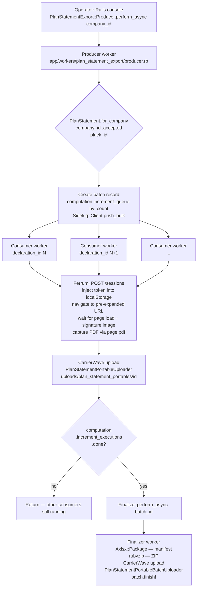

# PLAN — Signature PDF Export (Urgent Customer Backfill)

> Reference: SPIKE.md, PLAN-SPIKE.md (verified 2026-06-01); derived from engineer-approved PLAN-SPIKE.md (revision 2026-06-01).

## Objective

A cancelled customer used 4Shark only for declarations. They want all their signed declarations delivered as PDFs, bundled in a ZIP with an XLSX manifest. No PDF is persisted today — the signed document is re-rendered on every view by the Angular SPA (`app/app/uploaders/signature_uploader.rb:12`, extension allowlist is `%w[png]` only). The architecture is two-phase: Phase 1 ships a frontend change to `app-webclient` that makes the declaration page arrive fully expanded via a URL parameter; Phase 2 ships the backend to `app`, using a Sidekiq fan-out that navigates Ferrum to the pre-expanded URL, captures PDF, uploads to S3, and finalizes with a ZIP + XLSX manifest. Phase 1 must be deployed before Phase 2 workers run.

---

## Scope

### In scope

**Phase 1 — `app-webclient` (standalone release, ships first):**
- A URL parameter that renders the declaration page (`/planStatements/:planStatementId`) fully expanded — all collapsible panels open, pagination fully expanded and stable through page load.
- A user-facing "expand all / collapse all" button that toggles the same expanded state; the URL flag and the button are backed by the same mechanism.

**Phase 2 — `app` (requires Phase 1 to be deployed):**
- Producer worker: receives a `company_id`, enumerates ACCEPTED `plan_statement` IDs, creates the batch tracking record, fans out one per-declaration job each.
- Per-declaration consumer worker: Ferrum navigates to the pre-expanded URL, waits for page load (no panel-click logic — the URL parameter handles expansion), captures PDF, uploads to S3 via existing CarrierWave infrastructure, marks the per-declaration record done, gates on the computation counter.
- Finalizer worker: triggered when `computation.done?`, generates XLSX manifest with `Axlsx::Package`, creates ZIP with `rubyzip`, uploads via existing batch uploader, marks batch done.
- New low-concurrency Sidekiq queue for Ferrum/Chromium workers.
- `gem 'ferrum'` added to `app/Gemfile`.
- Chromium binary added to the worker Docker image (plain build task).

### Out of scope

- Long-term PDF persistence at signing time (SPIKE.md Deliverable 1 — this backfill is the bridge, not the solution).
- New GraphQL mutation or UI for triggering the export (operator triggers via Rails console / rake task for this customer).
- Internal frontend implementation detail of the URL parameter or button (decided at build time).

---

## Chosen approach

A two-phase backfill. **Phase 1** ships a frontend pre-expansion feature to `app-webclient` — a URL parameter (and a user-facing "expand all / collapse all" button backed by the same mechanism) that makes the declaration page arrive fully expanded. **Phase 2** ships a Sidekiq fan-out backend to `app` following the verified `PlanStatementAudit` Producer → Consumer → Finalizer pattern: the Producer enumerates ACCEPTED declarations for a `company_id` and fans out one Ferrum-rendering Consumer per declaration (each navigates to the pre-expanded URL, captures a PDF, uploads to S3 under a per-client folder); a Finalizer, gated on the Redis `Computation` counter, packages a ZIP + XLSX manifest. The headless worker authenticates as a dedicated, rotated service-account superadmin.

**Rationale (engineer):** doing the expansion on the frontend removes the fragile click-to-expand sequence from the backend and ships a real UX improvement; reusing the established fan-out pattern keeps the work within proven, memory-light infrastructure; the service account keeps auth simple and gives full read access regardless of the cancelled company's state.

**Key source patterns:** `PlanStatementAudit::{Producer,Consumer,Finalizer}` (fan-out), `Computation` (counter), `Commission::ReportGenerator` + `CommissionWorkBook` (file → CarrierWave → S3), `PlanStatement.for_company(company_id).accepted` (enumeration).

---

## Technical decisions

| Decision | Choice | Rationale (from engineer) |
|---|---|---|
| Architecture | Two-phase: frontend ships first, backend follows | Removes the fragile click-to-expand sequence from the backend; ships a real UX improvement in Phase 1; hard dependency is made explicit rather than hidden |
| PDF capture tool | Ferrum gem (Ruby CDP, no Node.js) | No Node.js runtime dependency in the worker image; same Chromium fidelity as alternatives; consistent with Ruby-native stack. Source: https://rubygems.org/gems/ferrum (v0.17.2, 2026-03-23, Ruby >= 3.1); https://www.simplethread.com/replacing-grover-with-ferrum-pdf-for-pdf-generation/ |
| Backend fan-out pattern | Producer → Consumer → Finalizer with Redis `Computation` counter | Matches the verified `PlanStatementAudit` sibling pattern exactly. Producer plucks IDs, calls `Sidekiq::Client.push_bulk`; each Consumer calls `computation.increment_executions`, checks `computation.done?`, enqueues Finalizer when done. Sources: `app/app/workers/plan_statement_audit/producer.rb:9-17`, `app/app/workers/plan_statement_audit/consumer.rb:65-69`, `app/app/models/computation.rb:22-40` |
| Plan statement enumeration | `PlanStatement.for_company(company_id).accepted` | ACCEPTED-only filter via existing scopes; both required indexes are confirmed present (`index_plan_statements_on_company_id` at `app/db/schema.rb:1562`; `index_acceptments_on_plan_statement_id` at `app/db/schema.rb:54`). Sources: `app/app/models/plan_statement.rb:20`, `app/app/models/plan_statement.rb:22` |
| Authentication for headless worker | Dedicated service-account user (username + password) in 4Shark's internal company, per environment; password rotated; passed to worker as a parameter; worker logs in as superadmin | Avoids SSO complexity; superadmin can read every declaration regardless of the cancelled company's state. The Angular app authenticates with a JWT Bearer token stored under the key `credentials` in `sessionStorage`/`localStorage`; worker obtains token via `POST /sessions` then injects it into browser context before navigating. Sources: `app-webclient/src/app/core/authentication/credentials.service.ts:101-115`, `app-webclient/src/app/app.service.ts:28-34`, `app/app/controllers/sessions_controller.rb:6-16` |
| XLSX manifest shape | Maps customer-meaningful user identifier ↔ declaration id ↔ acceptance status ↔ PDF filename; SHA256 hash of PDF content included (likely as a manifest column); starting point is the `PlanStatementAudit` column set (`user_name`, `user_primary_identifier_value`, `user_register_type`, `user_unique_register_id`, `plan_name`, `accepted`, `accepted_at`) | Customer needs to match files back to their users; SHA256 provides integrity; exact columns finalized at build time |
| File generation → S3 upload | Existing CarrierWave pattern: generate file to `Rails.root.join('tmp', file_name)`, assign to attachment's `file` attribute, call `finish!`; CarrierWave + fog-aws handles the rest | No new upload infrastructure required. Per-declaration upload path: `app/app/uploaders/plan_statement_portable_uploader.rb:4-6`; batch (ZIP) upload path: `app/app/uploaders/plan_statement_portable_batch_uploader.rb:4-6`; bucket config: `app/config/initializers/carrierwave.rb:3-12` |
| XLSX generation | `Axlsx::Package` — already present at `app/Gemfile:23` | Pre-existing dependency; same pattern as `CommissionWorkBook`. Source: `app/app/work_books/commission_work_book.rb:9-22` |
| ZIP generation | `rubyzip` — already present at `app/Gemfile:70` | Pre-existing dependency; no new gem required |

---

## End-to-end flow

---

## Execution phases

### Phase 1: Frontend pre-expansion (`app-webclient`)

**Objective:** Ship the URL parameter and "expand all / collapse all" button so the declaration page arrives fully expanded — a prerequisite for Phase 2 and a real UX improvement for end users.

**Background:** The declaration page at `/planStatements/:planStatementId` has five collapsible panels controlled by Angular `*ngIf` — when `expanded` is false, the element is absent from the DOM, not just hidden with CSS (SPIKE.md Finding 3, verbatim: *"when `expanded` is false, the element is **absent from the DOM**, not just hidden with CSS"*). The panels are `dealIncentive`, `indicatorIncentive`, `rankingIncentive`, `limiterIncentive`, and `redemptionIncentive` (`app-webclient/src/app/plan-statement/plan-statement-show/plan-statement-show.component.html:114–329`). The Phase 2 worker navigates to the pre-expanded URL and waits for page load — no panel-click automation needed.

**Components:**
- URL parameter reading and state initialization in `PlanStatementShowComponent`
- "Expand all / collapse all" button backed by the same mechanism as the URL parameter
- Both the URL flag path and the button path set all five `*.expanded` properties to true/false

**Dependencies:** None — this is a standalone `app-webclient` release.

**Hard constraint:** Phase 1 must be deployed and verified live before Phase 2 workers are run. If Phase 1 has not shipped, the URL parameter has no effect and panels will be collapsed in captured PDFs.

**Success criteria:**
- [ ] Navigating to `/planStatements/:id?expand=true` (or equivalent parameter name, decided at build time) renders all five panels expanded on page load
- [ ] The "expand all / collapse all" button toggles all panels in one click
- [ ] The page renders correctly in the existing user flow (parameter absent = default collapsed behavior)

---

### Phase 2: Backend fan-out (`app`)

**Objective:** Enumerate all ACCEPTED declarations for the target company, capture each as a PDF via Ferrum, upload to S3, and produce a ZIP + XLSX manifest.

**Hard dependency:** Phase 1 must be deployed before any Phase 2 worker is executed.

#### Phase 2.1 — Dependencies and infrastructure

**Components:**
- `gem 'ferrum'` added to `app/Gemfile` (no Ferrum gem found: `grep -n "ferrum" Gemfile` returns no results; `app/Gemfile:23` has `gem 'caxlsx'`; `app/Gemfile:70` has `gem 'rubyzip'` — both already present)
- Chromium binary added to the worker Docker image
- Model layer: batch and item tracking model(s) configured; `computation` method added to batch model (build-time decision on whether to extend `PlanStatementPortableBatch` or introduce a new dedicated model — see Deferred)
- New Sidekiq queue configuration (low concurrency, Chromium-bounded) + ECS service definition

**Dependencies:** None — can be done in parallel with Phase 1.

**Success criteria:**
- [ ] `gem 'ferrum'` present in `Gemfile.lock` and bundle installs cleanly
- [ ] Chromium binary available inside the worker container
- [ ] Batch and per-declaration tracking models have state machines (`initial → processing → final` pattern matching `app/app/models/plan_statement_portable_batch.rb:34-43`) and a `computation` method wired to a Redis `Computation` counter (`app/app/models/computation.rb:22-40`)
- [ ] New low-concurrency Sidekiq queue is configured and the ECS service definition is updated

#### Phase 2.2 — Producer worker

**Components:**
- `PlanStatementExport::Producer` (new worker under `app/app/workers/plan_statement_export/`)
- Guards: if `company.primary_webclient_host` is blank (`app/db/schema.rb:520`, validated at `app/app/models/company.rb:78`), abort with a clear error before fanning out any jobs
- Enumerates ACCEPTED plan statements: `PlanStatement.for_company(company_id).accepted.pluck(:id)` (indexes confirmed: `app/db/schema.rb:1553-1568`, `app/db/schema.rb:38-57`)
- Creates batch tracking record
- Calls `batch.computation.increment_queue(by: plan_statement_ids.count)`
- Calls `Sidekiq::Client.push_bulk` to fan out one Consumer job per ID — matching the `PlanStatementAudit::Producer` shape at `app/app/workers/plan_statement_audit/producer.rb:9-17`

**Dependencies:** Phase 2.1 complete (models and queue available).

**Success criteria:**
- [ ] Producer aborts cleanly when `company.primary_webclient_host` is blank
- [ ] Producer creates a batch record in `processing` state
- [ ] `computation.queue_value` equals the number of accepted plan statements after fan-out
- [ ] Consumer jobs are enqueued on the new low-concurrency queue

#### Phase 2.3 — Per-declaration consumer worker

**Components:**
- `PlanStatementExport::Consumer` (new worker)
- Ferrum browser: `POST /sessions` to obtain JWT token, inject into browser `localStorage` under key `credentials` before navigation (matching `app-webclient/src/app/app.service.ts:28-34`)
- Navigate to `https://#{company.primary_webclient_host}/planStatements/#{plan_statement_id}?<expand_param>=true`
- Wait for page load: explicit wait for the signature image to finish loading (presigned URL from `temporarySignature` GraphQL query, second async call after page load — SPIKE.md Finding 4)
- Capture PDF via Ferrum's CDP interface
- Generate PDF file to `Rails.root.join('tmp', ...)`, assign to `PlanStatementPortableAttachment#file`, call `finish!` — matching `app/app/workers/commission/report_generator.rb:10-12`
- Upload lands at `uploads/plan_statement_portables/#{attachable_id}` (`app/app/uploaders/plan_statement_portable_uploader.rb:4-6`)
- Call `computation.increment_executions`; if `computation.done?`, enqueue Finalizer — matching `app/app/workers/plan_statement_audit/consumer.rb:65-69`

**Dependencies:** Phase 2.1 and 2.2 complete; Phase 1 deployed.

**Success criteria:**
- [ ] Consumer navigates to the pre-expanded URL and the PDF contains all five expanded panels
- [ ] Consumer waits for the signature PNG to finish loading before capture (no blank signature in output)
- [ ] PDF is uploaded to S3 under `uploads/plan_statement_portables/`
- [ ] Per-declaration record transitions to `final` state
- [ ] The last consumer to finish enqueues the Finalizer

#### Phase 2.4 — Finalizer worker

**Components:**
- `PlanStatementExport::Finalizer` (new worker)
- Fetches all completed per-declaration records for the batch; downloads each PDF from S3
- Generates XLSX manifest with `Axlsx::Package` (present at `app/Gemfile:23`) — pattern from `app/app/work_books/commission_work_book.rb:9-22`; column set starts from `PlanStatementAudit` and is finalized at build time
- Creates ZIP with `rubyzip` (present at `app/Gemfile:70`)
- Uploads ZIP via existing batch uploader to `uploads/plan_statement_portable_batches/#{attachable_id}` (`app/app/uploaders/plan_statement_portable_batch_uploader.rb:4-6`)
- Calls `batch.finish!` to transition batch to `final` state

**Dependencies:** Phase 2.3 complete (all consumers must have finished — gated by `computation.done?`).

**Success criteria:**
- [ ] ZIP contains one PDF per ACCEPTED declaration
- [ ] XLSX manifest maps user identifier ↔ declaration id ↔ acceptance status ↔ PDF filename ↔ SHA256 hash
- [ ] ZIP is uploaded to S3 under `uploads/plan_statement_portable_batches/`
- [ ] Batch record transitions to `final` state

---

## Risks

| Risk | Impact | Mitigation |
|---|---|---|
| Presigned signature PNG URL expires during render | Worker navigates to the declaration page; `temporarySignature` GraphQL query returns a presigned URL with TTL from `ApplicationConfiguration.signed_url_expiration_time` (`app/lib/application_configuration.rb:77-78`: `Integer(ENV.fetch('SIGNED_URL_EXPIRATION', 10)).minutes.from_now`). If a job is delayed past the TTL after the URL was resolved, the signature image will 403 — PDF generated without the signature PNG | Each consumer job navigates fresh (obtains a new presigned URL on each navigation). Do not batch URL resolution at fan-out time. Keep queue concurrency high enough that each job runs promptly after enqueue |
| Chromium memory at high Sidekiq concurrency | At ~150–300 MB RAM per Chromium instance × default 25 threads (`app/lib/application_configuration.rb:73-74`: `Integer(ENV.fetch('SIDEKIQ_THREADS', 25))`) = 3.75–7.5 GB — likely OOM on the ECS task | Dedicated low-concurrency queue is a hard prerequisite before deploying Phase 2 workers (Phase 2.1). Concurrency ceiling decided at build time |
| Phase 1 not deployed before Phase 2 runs | Declaration pages captured with all panels collapsed — PDFs are incomplete | Phase 1 deployment is the first gate in execution order. Phase 2 worker must not be triggered until Phase 1 is verified deployed and the URL parameter is confirmed working |
| `company.primary_webclient_host` blank for the cancelled company | Producer cannot construct the declaration URL | Guard in the Producer: if `company.primary_webclient_host` is blank, abort with a clear error message before fanning out any jobs (`app/db/schema.rb:520`, `app/app/models/company.rb:78`) |

---

## Assumptions

These are engineering preconditions this plan accepts as true without further proof.

- **Ferrum + Chromium work in a Rails worker** with the features needed (authenticated navigation, full-page PDF capture). No proof-of-concept is planned (engineer decision); Chromium-in-the-worker-image is a plain build task.
- **The deployed `app-webclient` is reachable from the Sidekiq worker** over HTTPS at `https://#{company.primary_webclient_host}`.
- **A dedicated service-account superadmin user can be created** in 4Shark's internal company in each environment, and its rotated credentials can be supplied to the worker.
- **The `POST /sessions` + `credentials` token-injection flow authenticates the headless browser** for the service account without SSO (SPIKE.md Finding 5).
- **The signed-URL TTL is long enough for a single job** to render after obtaining the presigned signature PNG URL (`signed_url_expiration_time`, default 10 minutes — `app/lib/application_configuration.rb:77-78`).
- **Only ACCEPTED declarations have a signature to render**; pending declarations carry no acceptment/signature and appear in the manifest as status-only rows (SPIKE.md Finding 4; `app/app/models/plan_statement.rb:20`).

---

## Deferred — decided at build time

These items are settled at implementation time. They are not decisions to make now.

- **Batch/item model choice:** reuse `PlanStatementPortableBatch` / `PlanStatementPortable` (no migration, but `calendar_id` validation at `app/app/models/plan_statement_portable_batch.rb:12` and `before_validation :add_plan_statements` callback at `app/app/models/plan_statement_portable_batch.rb:47, 57-66` create coupling to a single calendar that does not fit a company-wide export spanning all calendars) vs new dedicated models (cleaner, requires two migrations). The `computation` method also does not exist on `PlanStatementPortableBatch` today and must be added either way.
- **Sidekiq concurrency approach:** dedicated low-concurrency config file + new ECS service, or capped queue on an existing service. Either achieves the Chromium memory constraint.
- **PDF filename convention:** human-readable (e.g. `<user_primary_identifier_value>-<plan_statement_id>.pdf`) vs ID-only.
- **Exact manifest columns:** start from the `PlanStatementAudit` column set (`user_name`, `user_primary_identifier_value`, `user_register_type`, `user_unique_register_id`, `plan_name`, `accepted`, `accepted_at`); adjust at build time.
- **SHA256 placement:** manifest column vs `.sha256` sidecar vs both.
- **XLSX inside ZIP vs alongside.**
- **Customer delivery mechanism:** presigned URL via existing `PlanStatementPortableBatchDownload` infrastructure vs manual handoff from S3 console.
- **Exact credential-passing mechanism for the service account:** env var vs argument.

---

## Sources

- `app/app/workers/plan_statement_audit/producer.rb:9-17` — canonical Producer pattern (pluck + push_bulk)
- `app/app/workers/plan_statement_audit/consumer.rb:65-69` — canonical Consumer gate pattern (`increment_executions` + `done?` + enqueue Finalizer)
- `app/app/models/computation.rb:22-40` — Redis counter (`queue` / `executions` / `done?`)
- `app/app/models/plan_statement_portable_batch.rb:34-43` — batch state machine (`initial → processing → final`)
- `app/app/models/plan_statement_portable_batch.rb:12` — `validates :calendar_id, presence: true` (coupling that affects build-time model choice)
- `app/app/models/plan_statement_portable_batch.rb:47, 57-66` — `before_validation :add_plan_statements` callback (coupling that affects build-time model choice)
- `app/app/models/plan_statement_portable.rb:20-24` — per-record state machine
- `app/app/models/plan_statement.rb:20` — `scope :accepted, -> { joins(:acceptment) }`
- `app/app/models/plan_statement.rb:22` — `scope :for_company`
- `app/app/models/plan_statement.rb:27-34` — status enum (`pending: 0, accepted: 1, canceled: 2`)
- `app/db/schema.rb:1553-1568` — `plan_statements` table + indexes (company_id covered)
- `app/db/schema.rb:38-57` — `acceptments` table + indexes
- `app/db/schema.rb:1969-1979` — `signatures` table
- `app/db/schema.rb:520` — `primary_webclient_host` column
- `app/app/models/company.rb:78` — `validates :primary_webclient_host, presence: true`
- `app/app/workers/commission/report_generator.rb:10-12` — file generation → CarrierWave assignment pattern
- `app/app/work_books/commission_work_book.rb:9-22` — `Axlsx::Package` generate pattern
- `app/app/uploaders/plan_statement_portable_uploader.rb:4-6` — existing PDF upload path
- `app/app/uploaders/plan_statement_portable_batch_uploader.rb:4-6` — existing batch (ZIP) upload path
- `app/config/initializers/carrierwave.rb:3-12` — CarrierWave fog-aws config (single bucket, `ApplicationConfiguration.aws_bucket`)
- `app/Gemfile:23` — `gem 'caxlsx', require: 'axlsx'`
- `app/Gemfile:70` — `gem 'rubyzip'` (present; no production usage found)
- `app/config/sidekiq_user.yml:5-15` — existing user worker queues
- `app/lib/application_configuration.rb:73-74` — `SIDEKIQ_THREADS` default 25
- `app/lib/application_configuration.rb:77-78` — `signed_url_expiration_time` (default 10 minutes)
- `app-webclient/src/app/plan-statement/plan-statement-routing.module.ts:19` — route `/planStatements/:planStatementId`
- `app-webclient/src/app/plan-statement/plan-statement-show/plan-statement-show.component.html:114-329` — five `*ngIf`-controlled `.show-panel` panels; `expanded` property; DOM-absent when collapsed
- `app-webclient/src/app/plan-statement/plan-statement-show/plan-statement-show.component.ts:213-226` — `getSignature()` — presigned signature PNG URL fetched via second async GraphQL call after page load
- `app-webclient/src/app/core/authentication/credentials.service.ts:101-115` — JWT token stored under key `credentials`
- `app-webclient/src/app/app.service.ts:28-34` — Bearer token injected into GraphQL requests from `credentials` key
- SPIKE.md Finding 3 — five `*ngIf`-controlled `.show-panel` panels; DOM-absent when collapsed
- SPIKE.md Finding 4 — presigned signature PNG URL fetched via second async GraphQL call after page load
- SPIKE.md Finding 5 — JWT Bearer token in `localStorage`/`sessionStorage` under key `credentials`; `POST /sessions` login endpoint
- SPIKE.md Finding 8 — required sequence for headless capture of declaration page
- Auxiliary files: `batch_pattern_excerpts_aux_1.rb`, `xlsx_zip_pattern_excerpts_aux_2.rb`, `signature_excerpt_1.ts`, `signature_excerpt_2.html`
- https://rubygems.org/gems/ferrum — version 0.17.2 (2026-03-23); requires Ruby >= 3.1
- https://www.simplethread.com/replacing-grover-with-ferrum-pdf-for-pdf-generation/ — Ferrum as Grover alternative (Chromium-native, no Node.js dependency)
