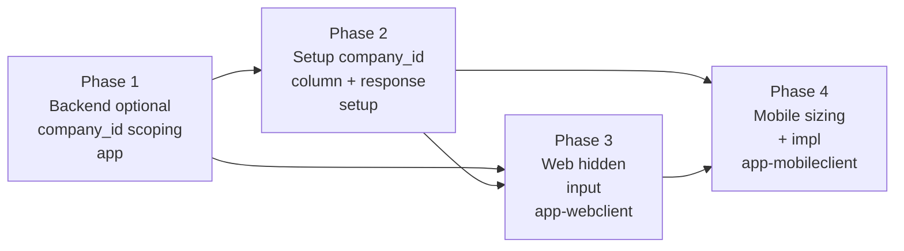

# PLAN — Tenant-Scoped Authentication

> Reference: PLAN-SPIKE.md (validated draft), SPIKE-authentication-keys.md (Devise 5.0.4
> mechanism research), SPIKE.md (why tenant-scoped email is legitimate and Option B chosen)

---

## Status (2026-06-17)

- **Phase 1 (app backend) — DONE and validated on beta.** PR #5139 merged to `develop`; released in 3.39.0 (PR #5140, finished via HubFlow). Beta validation via direct `fetch` to `POST /sessions` confirmed: `company_id=1` (correct) → 201, `company_id=123` (wrong) → 401 (scope proven), no `company_id` → 201 (backward-compatible). Note: the webclient still sends only `{email, password, remember}` (a DOM hidden input is NOT sent by the Angular JSON POST), so the field must be added to the `authentication.service` payload — that is Phase 3.
- **3.39.0 rolled out to all environments.** Hold lifted.
- **Phase 2 (setup) — DONE.** PR #335 (`feature/configuration-company-id` → `develop`, open): nullable `company_id` integer column on `configurations` + serializer exposes it + request spec asserts it (24 examples, 0 failures). Per-config value is set as data; the web client consumes it in Phase 3.
- **Phase 2 deployed to production** (setup 1.18.0). First deploy failed: the migration hit `PG::InsufficientPrivilege: must be owner of table configurations` — on the setup RDS the app role (`JtCm4FNq32kyqWsViBpx`) owned no objects; all app tables were owned by `postgres` (RDS has no full superuser). Root cause fixed by connecting as the RDS managed master (`postgres`, secret in Secrets Manager) and running `GRANT "<app_role>" TO postgres; REASSIGN OWNED BY postgres TO "<app_role>";` — the 6 app objects now belong to the app role, so this and all future setup migrations run as owner. Re-deploy succeeded. (Note for future setup migrations: if a fresh table is created by a non-app role, ownership must land on the app role.)
- **Next: Phase 3 (app-webclient)** — env var → send `company_id` in the `authentication.service` login payload. Then Phase 4 (mobile, small).

---

## Objective

The app uses a partial unique index `(company_id, email) WHERE anonymized=false`, meaning
the same email can legitimately belong to different people in different companies (e.g., a
Mexico carnet `170472@atento.com` and a Brazil RE `170472@atento.com` are two distinct
humans). The goal is to make login resolve the correct user when a cross-tenant email
collision exists, without breaking anything for the majority of users whose emails are
globally unique.

The implementation is backward-compatible at every step: the backend ships first and works
with or without a `company_id` param. Clients update incrementally.

---

## Scope

### In scope

- **app** (Rails/Devise 5.0.4) — accept optional `company_id` at login; scope user lookup
  when present; apply collision guard when absent; covers both login entry points.
- **setup** (Rails) — add `company_id` column to the `configurations` table; return it in
  the configuration response so clients can discover their tenant identifier.
- **app-webclient** (Angular) — read `company_id` from an Angular environment variable
  per deployment; inject it as a hidden field on the login form so it is included in the
  login POST.
- **app-mobileclient** (Flutter) — sized as SMALL; implementation is deferred until after
  backend and setup ship; details to be scoped separately.

### Out of scope (decided)

- **Password reset** — the app does not use Devise `:recoverable`. The `devise` call in
  `app/app/models/user.rb:12` lists only `database_authenticatable, lockable,
  registerable, rememberable, trackable, timeoutable`. Password reset goes through
  `PasswordDocument::Processor`, not `send_reset_password_instructions`. Closed.
- **SSO / Keycloak** — `Authentication::SessionsController` already scopes by company via
  `AuthenticatorConfiguration.find_by(uuid:)` before any user lookup
  (`app/app/controllers/authentication/sessions_controller.rb:85-90`). Not affected.
- **`confirmation_keys` / `unlock_keys` scoping** — `unlock_strategy` is `:time`
  (`app/config/initializers/devise.rb:191`); no email-driven unlock or confirmation flow
  exists. Out of scope.
- **`company_id` type** — integer, matching `users.company_id` in
  `app/db/schema.rb:2326`. No alternative type considered.

---

## Chosen approach

**Direction:** Option B — keep email unique per tenant; make login tenant-aware by
accepting an OPTIONAL `company_id` and scoping the user lookup when present.

**Rationale (from engineer):** Tenant-scoped email is the correct model for 4Shark's
cross-country HR deployment (different humans sharing the same numeric-ID-derived email
across jurisdictions). Option B requires no data migration and no ETL changes. The backend
ships before clients send `company_id`, preserving backward compatibility at every step.
The collision guard (N2) prevents wrong-tenant login during the transition window — a
collision user gets a failed login (not a wrong-user login) until the client sends
`company_id`.

**Devise mechanism chosen (from engineer):** The Devise documented pattern — BOTH
mechanisms together, as Finding 6 of SPIKE-authentication-keys.md establishes is the
official wiki recipe:

1. `authentication_keys: { email: true, company_id: false }` (HASH form on the User
   model) — makes `company_id` optional at the Warden strategy level. When absent,
   `parse_authentication_key_values` skips the key and the strategy proceeds with only
   `email` in `authentication_hash`
   (`app/vendor/bundle/ruby/4.0.0/gems/devise-5.0.4/lib/devise/strategies/authenticatable.rb:157-167`).

2. A `self.find_for_authentication` override on the User model with a COLLISION GUARD
   (Option N2 from SPIKE-authentication-keys.md):
   - `company_id` present → `find_by(email:, company_id:)` (scoped lookup)
   - `company_id` absent → query all users with that email; if exactly one matches,
     return it; if more than one matches, return `nil` (refuse the ambiguous login —
     caller gets `:not_found_in_database`, not a wrong-user session)

**`company_id` transport:** POST param (not `request_keys` — `company_id` is not a
property of the HTTP request object; it is submitted by the client). This is confirmed by
SPIKE-authentication-keys.md Finding 5.

**Source patterns referenced:**
- `app/vendor/bundle/ruby/4.0.0/gems/devise-5.0.4/lib/devise/strategies/authenticatable.rb:157-167` — `parse_authentication_key_values` with hash form
- `app/vendor/bundle/ruby/4.0.0/gems/devise-5.0.4/lib/devise/models/authenticatable.rb:263-269` — `find_for_authentication` and `find_first_by_auth_conditions` defaults
- `app/vendor/bundle/ruby/4.0.0/gems/devise-5.0.4/lib/devise/models/database_authenticatable.rb:198-200` — `find_for_database_authentication` delegates to `find_for_authentication`
- Devise wiki "How to: Scope login to subdomain" (full text at `~/.claude/plans/active/spike/devise-tenant-scoped-email/devise_doc_1_scope_login.txt`) — four-step recipe; step 3 is the `find_for_authentication` override

---

## Execution phases



Phase 1 is independently shippable. Phases 2 and 3 depend on Phase 1 being deployed.
Phase 3 also depends on Phase 2 (setup is the source of `company_id` for web when not
available through environment config; the Angular environment variable approach means Phase
3 can ship once the backend accepts the param, regardless of setup). Phase 4 is blocked on
Phase 2.

---

### Phase 1: Backend — accept optional `company_id` at login (app)

**Objective:** The `app` backend accepts `company_id` as an optional POST param at login,
scopes the user lookup when present, and refuses an ambiguous unscoped lookup when more
than one user shares the same email. Ships standalone; all existing clients continue to
work unchanged.

**Components:**

- **`app/app/models/user.rb`** — two additions to the existing `devise` call and model:

  1. Change the `devise` call (currently at line 12) to add the hash-form
     `authentication_keys`:

     ```ruby
     devise :database_authenticatable, :lockable, :registerable,
            :rememberable, :trackable, :timeoutable,
            authentication_keys: { email: true, company_id: false }
     ```

  2. Add `self.find_for_authentication` override:

     ```ruby
     def self.find_for_authentication(tainted_conditions)
       email = tainted_conditions[:email]
       company_id = tainted_conditions[:company_id]
       if company_id.present?
         find_by(email: email, company_id: company_id)
       else
         matching_users = where(email: email)
         matching_users.count == 1 ? matching_users.first : nil
       end
     end
     ```

     When `company_id` is present: scoped lookup. When absent and email is globally
     unique in the active user set: returns the single match (unchanged behavior for
     the majority). When absent and email collides across tenants: returns `nil`,
     Devise logs `:not_found_in_database`, login fails without exposing which tenant
     the user belongs to.

- **`app/app/controllers/sessions_controller.rb`** — the custom JSON controller at line 7
  currently calls `User.enabled.find_for_database_authentication(email: params[:email])`.
  Update to pass `company_id` when present:

  ```ruby
  auth_conditions = { email: params[:email] }
  auth_conditions[:company_id] = params[:company_id] if params[:company_id].present?
  user = User.enabled.find_for_database_authentication(auth_conditions)
  ```

  `find_for_database_authentication` delegates to `find_for_authentication`
  (`app/vendor/bundle/ruby/4.0.0/gems/devise-5.0.4/lib/devise/models/database_authenticatable.rb:198-200`),
  so the override above covers this call path.

- **`app/config/initializers/devise.rb` — `Warden::Manager.before_failure` hook
  (lines 307-332):** The failure hook calls
  `User.find_for_database_authentication(email: attempted_email)` with only the email.
  This hook fires on the Devise web form path (`/sign_in`), not on the custom JSON
  controller (which returns 401 directly). The `find_for_authentication` override covers
  this call — if the email matches one user, the `SecurityEvent` is logged against the
  correct user; if the email is ambiguous, the lookup returns `nil` and the hook must
  handle a `nil` user gracefully. Verify the hook's nil-handling before shipping
  (the hook is at `app/config/initializers/devise.rb:307-332`).

**Dependencies:** None. Phase 1 ships independently.

**Success criteria:**
- [ ] Login with `company_id` + correct email + correct password succeeds and returns
      the user for that specific company.
- [ ] Login with correct email + correct password and no `company_id`, where the email
      is globally unique, succeeds (unchanged behavior).
- [ ] Login with correct email + correct password and no `company_id`, where the email
      collides across two companies, fails with 401 (not a wrong-user session).
- [ ] Login with `company_id` pointing to a company the user does not belong to fails
      with 401.
- [ ] All existing clients (no `company_id` in their POST body) continue to work for
      non-collision users.
- [ ] The `Warden::Manager.before_failure` hook handles a `nil` user result from the
      override without raising.

---

### Phase 2: Setup — add `company_id` to configuration response (setup)

**Objective:** The setup service persists a `company_id` integer on each configuration
record and returns it in the configuration JSON payload. This is the prerequisite for the
mobile app (and optionally the web client) to know which tenant identifier to send at
login.

**Components:**

- **Migration** — generate (do not hand-write) a migration adding `company_id` as a
  nullable integer column to the `configurations` table. The `configurations` table
  currently has no `company_id` column (`setup/db/schema.rb:18-36`). Type: integer,
  matching `users.company_id` in `app/db/schema.rb:2326`.

  ```
  bin/rails generate migration AddCompanyIdToConfigurations company_id:integer
  ```

  Run `bin/rails db:migrate` after generating; commit migration and updated
  `setup/db/schema.rb` together.

- **`setup/app/serializers/configuration_serializer.rb`** — add `company_id` to the
  serialized attributes (currently `auth_origin, auth_provider, auth_url, favicon_ico_url,
  favicon_png_url, graphql_endpoint_url, name, primary_color, primary_logo_url,
  secondary_color, secondary_logo_url, uuid` at lines 3-6). When `company_id` is `nil`
  on the record, the field is included in the JSON as `null` — clients treat an absent or
  null `company_id` the same way (do not send it at login).

- **`setup/app/models/configuration.rb`** — the model currently has no `company_id`
  attribute (`setup/app/models/configuration.rb:1-23`). No model-level change is required
  beyond what the migration provides; no association or validation is added (the column is
  a plain integer reference to the app's companies, not an ActiveRecord association in
  setup).

- **Populate existing configurations** — after running the migration, existing
  configuration records have `company_id: nil`. Each configuration must be populated with
  the correct `company_id` value by an admin or via a data task. The method for populating
  existing records (admin UI, rake task, or manual update) is an operational decision
  made at deploy time; this plan does not prescribe it, but the migration alone does not
  populate existing records.

**Dependencies:** Phase 1 deployed (backend accepts `company_id`). The setup change is
additive and does not break existing clients that ignore the new field.

**Success criteria:**
- [ ] The migration runs cleanly; `setup/db/schema.rb` shows `company_id :integer` on
      the `configurations` table.
- [ ] `GET /api/v1/devices/:device_id/configurations/:uuid` response includes
      `"company_id": <integer>` when the configuration has a `company_id` set.
- [ ] The response includes `"company_id": null` (not an error) when `company_id` is not
      yet populated on the record.
- [ ] Controller test: configuration response includes `company_id` field.

---

### Phase 3: Web frontend — pass `company_id` at login (app-webclient)

**Objective:** Each Angular deployment reads `company_id` from its environment
configuration and injects it as a hidden input on the login form, so it is sent with
the login POST body.

**Components:**

- **Angular environment files** — each per-tenant deployment has its own
  `environment.ts` / `environment.prod.ts`. Add a `companyId` property (type `number |
  null`) to the environment object. For deployments where the tenant is known, set the
  value; for deployments where it is not, set `null`.

- **`app-webclient/src/app/login/login.model.ts`** — add `company_id` to the `Login`
  model interface (currently at lines 1-17).

- **`app-webclient/src/app/login/login.component.ts`** — in `createForm()` (currently
  at lines 57-63), add `company_id` initialized from the Angular environment's
  `companyId`. When `companyId` is `null` or `undefined` in the environment, omit the
  field from the form value (do not send `null` to the backend; the backend treats absent
  `company_id` as the unscoped path).

  The login form value is already POSTed verbatim as `formData` in
  `app-webclient/src/app/core/authentication/authentication.service.ts:35`:

  ```typescript
  return this.http.post<any>(loginUrl, formData, { observe: 'response' })
  ```

  No change is needed to `AuthenticationService.login()` — `company_id` flows through
  automatically once it is in `formData`.

- **`company_id` storage after login** — the web client already stores `company_id`
  from the session response (`app/app/models/session.rb:14: company_id: @user.company_id`)
  in `CredentialsService` after a successful login. No change needed for post-login
  credentials.

**Dependencies:** Phase 1 deployed. Phase 2 is not a hard dependency for the web path
(the Angular environment variable is the source of `company_id` for the web, not the
setup response). The web client can ship once the backend accepts the param.

**Success criteria:**
- [ ] Login POST from the web client includes `company_id` for deployments where the
      environment variable is set.
- [ ] Login POST from the web client omits `company_id` for deployments where the
      environment variable is not set (no regression for those tenants).
- [ ] Login succeeds end-to-end for a collision-email user when the correct `company_id`
      is sent.

---

### Phase 4: Mobile — sizing and implementation (app-mobileclient)

**Objective:** The Flutter mobile app passes `company_id` in the login POST body when
the configuration blob provides it. Sized as SMALL; implementation is deferred and scoped
separately.

**Effort sizing (from draft):**

| Dimension | Assessment |
|-----------|------------|
| Files to change | `lib/http/login/login_http.dart` (1 file — add `company_id` to body) |
| Prerequisite | Phase 2 (setup returns `company_id` in config blob) |
| New screens | None |
| New dependencies | None |
| Testing | Manual test with a collision-user config; one unit test for `PostLogin` body |
| Effort | Small (< 1 day of Dart work once setup is done) |
| Risk | None for non-collision users; collision users remain unreachable until both Phase 2 and Phase 4 ship |

**What the implementation will touch (when scoped):**

- `app-mobileclient/lib/http/login/login_http.dart:22-31` — the body currently includes
  `email`, `password`, `remember`. Add `company_id` read from the already-loaded
  configuration map (`SharedPreferences['configuration']`, accessed at lines 10-14).
  When `company_id` is absent from the blob (configuration not yet populated in setup),
  the field is omitted and the backend falls back to the unscoped path.

**Dependencies:** Phase 2 (setup returns `company_id` in config blob). Phase 4 is blocked
until Phase 2 ships and existing configurations are populated.

**Success criteria (when implementation is scoped):**
- [ ] `PostLogin` body includes `company_id` when the stored configuration blob contains
      it.
- [ ] `PostLogin` body omits `company_id` when the blob does not contain it (no crash,
      correct fallback behavior).
- [ ] Collision-email user on updated mobile logs into the correct company.

---

## Technical decisions

| Decision | Choice | Rationale (from engineer) |
|----------|--------|--------------------------|
| Overall approach | Option B — keep tenant-scoped email; make auth tenant-aware | No data migration; no ETL changes; industry-standard pattern for different-people-same-email across jurisdictions |
| Backend Devise mechanism | Hash-form `authentication_keys: { email: true, company_id: false }` + `find_for_authentication` override (Option N2 from SPIKE-authentication-keys.md) | The Devise documented pattern (wiki, Finding 6) combines both. The hash form makes `company_id` optional at the strategy level; the override provides explicit control of the nil case with a collision guard |
| Collision guard in override | Return `nil` when more than one user matches the unscoped email (N2, not N1) | N1 (no guard) would log a collision user into the wrong tenant's account non-deterministically; N2 fails the login cleanly with `:not_found_in_database`, making the failure explicit |
| `company_id` transport | POST param (`authentication_keys`) | `company_id` is submitted by the client, not derivable from the HTTP request object; `request_keys` reads from `request.send(:company_id)` which does not exist on a standard Rails request (Finding 5 of SPIKE-authentication-keys.md) |
| Login entry points covered | Both — the custom JSON `SessionsController` and the Devise web form path | The `find_for_authentication` override covers both because `find_for_database_authentication` delegates to it regardless of entry point |
| Web client `company_id` source | Angular environment variable per deployment | The web client is deployed per-tenant; the environment file is the natural per-deployment configuration surface |
| Setup `company_id` type | Integer | Matches `users.company_id` in `app/db/schema.rb:2326` |
| Mobile sequencing | SMALL; implement last, separately, after Phase 2 ships | Mobile is backward-compatible (non-collision users unaffected); deferral reduces coordination cost |
| Password reset scope | Out of scope (closed) | App does not use Devise `:recoverable`; password reset uses `PasswordDocument::Processor` |
| SSO scope | Out of scope | Already tenant-scoped at `Authentication::SessionsController` via `AuthenticatorConfiguration` |

---

## Risks

| Risk | Impact | Mitigation |
|------|--------|------------|
| `Warden::Manager.before_failure` hook receives `nil` from the override | `SecurityEvent` logging on the web form failure path may raise or log incorrect data | Verify nil-handling in the hook at `app/config/initializers/devise.rb:307-332` before shipping Phase 1; add nil guard if needed |
| Partial rollout — some configurations have `company_id`, others do not | Mobile users on unpopulated configurations send no `company_id`; backend falls back to unscoped path | Backend fallback handles this correctly (non-collision users unaffected; collision users get failed login, not wrong-user login) |
| Collision users on unscoped clients (transition window) | The 8 known email-collision users cannot log in from clients that do not yet send `company_id` | Acceptable per engineer's plan; collision is detected cleanly (nil return → 401); non-collision users are unaffected; window closes when clients ship |
| Existing configurations with `company_id: nil` after Phase 2 migration | Mobile cannot send `company_id` for those tenants until records are populated | Populate records (admin action or rake task) before Phase 4 users are expected to log in with `company_id`; nil is non-destructive (same as today) |
| Web client environment variable not set for a tenant | That tenant's web login sends no `company_id`; unscoped path applies | Collision users on that tenant remain unable to log in; acceptable if the tenant has no collision users; flag as a deployment checklist item |
| `devise_parameter_filter` behavior with integer `company_id` from string params | If the adapter does not coerce the string param to integer before the `find_by`, the scoped lookup silently fails to match | Verify in a test that `find_by(email:, company_id: "7")` matches a user with `company_id: 7`; add `.to_i` coercion in the override if needed |

---

## Assumptions

- The app does not use Devise `:recoverable` — confirmed by the `devise` call at
  `app/app/models/user.rb:12` which lists no `:recoverable` module. The `reset_password_token`
  and `reset_password_sent_at` columns exist in the schema but the module is not active;
  this is intentional (password reset uses `PasswordDocument::Processor`).
- Each `setup` Configuration corresponds to exactly one company, and `company_id` can be
  set on the record by an admin. The setup-to-app company mapping is handled operationally
  (admin-set); this plan does not add a programmatic bridge between the two databases.
- The 8 known cross-tenant email collisions are the primary use case; the collision guard
  also handles any unknown collisions that may exist in the data.
- No client currently uses HTTP Basic auth against Devise. The known hash-form
  `authentication_keys` + HTTP Basic auth edge case (Devise Issue #2288, documented in
  SPIKE-authentication-keys.md Finding 7) does not apply.
- The Angular environment files are managed per-tenant deployment and can be updated to
  include `companyId` as part of the normal deployment configuration process.
