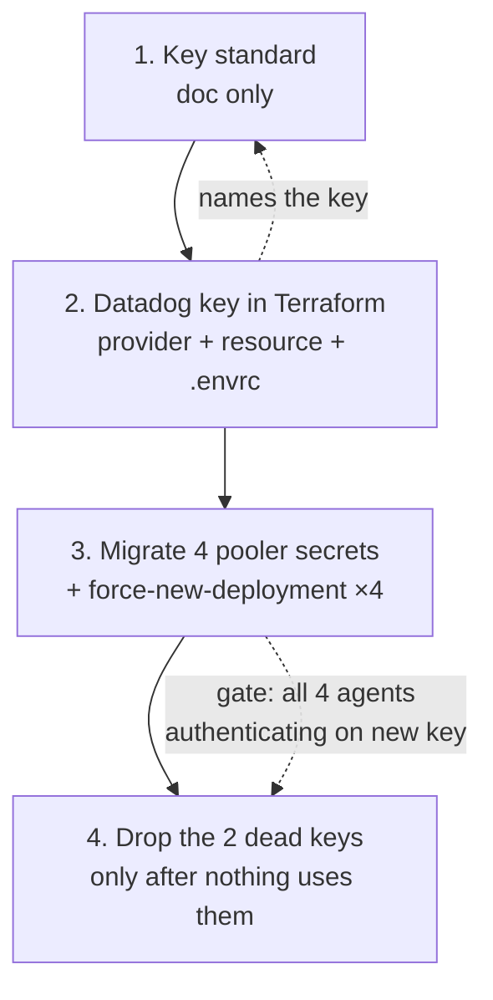

# PLAN-SPIKE — 4Shark key standard + Terraform-managed Datadog API keys

> No DDD documents exist for this feature. Grounding is the existing codebase, the
> Rollbar precedent runbook, the Datadog provider source, and read-only AWS state.
>
> **Settled before this spike, not re-opened here:** third-party API keys are created and
> managed BY Terraform, so rotation is `terraform apply`-able. Every option below assumes
> that. What this spike researches is how to do it well, including the state exposure it
> implies.

## Objective

Establish a 4Shark standard for third-party service keys — naming, ownership, lifecycle —
generalized from the existing Rollbar token convention, and apply it to a Datadog API key
that Terraform creates and manages, replacing the key the four connection-pooler Datadog
sidecars authenticate with today (an unnamed 2018 key owned by a disabled personal
account). The standard lands first, the Datadog key second, consumer migration third, and
the two dead keys are dropped only once nothing uses them.

## Scope

### In scope

- A key standard covering naming, owning identity, and lifecycle (create / rotate / revoke)
  for third-party service keys.
- A `datadog_api_key` resource created and managed in Terraform, with the provider newly
  introduced to the repo.
- The hand-off of the key value from wherever it is created to the four
  `<stack>-connection-pooler-datadog-api-key` Secrets Manager secrets.
- The sequencing and its dependencies, through to dropping the two dead keys.

### Out of scope (open question)

- The two Datadog **APP keys** (`app`, Slack integration). They are adjacent — the
  provider needs an APP key to authenticate (F5), and F9 shows an APP key owned by a
  person is revoked when that person is disabled. Whether the standard covers APP keys
  now or defers them is a decision, not a given.
- The `/<stack>/DD_API_KEY` SSM parameters. Established: they feed an app-side agent that
  is off (`DISABLE_DATADOG_AGENT="true"`). Whether they are migrated, or deleted as dead
  weight alongside the 2018 key, is not decided here.
- Enumerating which IAM principals can read the state bucket — the real blast radius of
  the state trade-off. Answerable read-only; not reached in this spike (aux:
  `state_bucket_config_dump_1.json` `_not_researched`).

---

## Findings

### The existing 4Shark conventions

**F1 — The Rollbar token label is a positional grammar, entity-first.**
`~/.claude/docs/runbooks/terraform-operations/ADD-ROLLBAR-PROJECT.md:36-44`:

> - Prefix `ROLLBAR_`, then the **entity/client first**, then the type.
> - Split multi-word names at camelCase and letter→digit boundaries:
>   `InovaMaquinas` → `INOVA_MAQUINAS`, `RedeBrasil` → `REDE_BRASIL`,
>   `Atento001` → `ATENTO_001`. Single-cap names stay joined (`Maqnelson` →
>   `MAQNELSON`).
> - Type tokens: backend/API = bare `_APP`; webclient = `_APP_WEBCLIENT`;
>   integrator = `_INTEGRATOR`; harvester = `_SIMPLEX_HARVESTER`.
> - Atento per-country: `ATENTO_<CC>` (e.g. `ATENTO_MX`).
> - Environment suffix last: `_STAGING`, `_DEVELOPMENT`.

Decomposed: `<SERVICE>_<ENTITY>_<TYPE>[_<ENVIRONMENT>]`. Full extraction with the worked
examples table: aux `rollbar_convention_extract_1.md`.

**F2 — The convention governs a 1Password field label, which doubles as a Terraform map key.**
Same file, `:31-34`:

> Each token is a concealed field in the `Rollbar ENV` 1Password item (Employee
> vault). The label is also the key used in `var.rollbar_project_tokens`.

It does **not** state that it governs the name of a resource *inside* the third-party
service. Extending it to a Datadog key's `name` argument is an extrapolation — surfaced as
an open decision, not asserted.

**F3 — Rollbar tokens are created out of band because the provider CANNOT create usable ones — not because 4Shark prefers out-of-band.**
`~/Projects/4Shark/terraform/monitoring/rollbar_notifications.tf:9-13`:

```hcl
# The per-project write tokens are NOT created here: the Rollbar provider can
# only mint legacy (unencrypted) tokens, which this account disables. They are
# created out of band, stored in the 'Rollbar ENV' 1Password
# item, and injected as var.rollbar_project_tokens (keyed by the token's
# 1Password label) via the stack .envrc.
```

This matters for how much of the precedent transfers: the naming half and the
1Password-storage half are 4Shark choices and carry over; the out-of-band half is a
Rollbar provider limitation and does not apply to Datadog, whose provider does create real
keys (F4). This is consistent with the settled decision, not an argument against it.

**F4 — `monitoring/` is the third-party monitoring provider home, with a `.envrc` → 1Password → provider credential chain.**
`~/Projects/4Shark/terraform/monitoring/providers.tf:1-27`:

```hcl
provider "aws" {
  region = "us-east-1"
}

provider "rollbar" {}

terraform {
  required_version = ">= 1.11"

  required_providers {
    aws = {
      source  = "hashicorp/aws"
      version = "6.53.0"
    }
    rollbar = {
      source  = "rollbar/rollbar"
      version = "~> 1.16"
    }
  }

  backend "s3" {
    bucket       = "4shark-terraform-state"
    key          = "monitoring/terraform.tfstate"
    region       = "us-east-1"
    use_lockfile = true
  }
}
```

The credential arrives via `monitoring/.envrc:9-15`:

```bash
terraform_environment="$(op item get 'Terraform ENV' --vault 'Employee' --account=4shark.1password.com --format json)"

export ROLLBAR_API_KEY="$(echo "$terraform_environment" | jq -r '.fields[] | select(.label == "ROLLBAR_API_KEY").value')"

rollbar_project_tokens="$(op item get 'Rollbar ENV' --vault 'Employee' --account=4shark.1password.com --format json)"

export TF_VAR_rollbar_project_tokens="$(echo "$rollbar_project_tokens" | jq -c '[.fields[] | select(.label | startswith("ROLLBAR_")) | {(.label): .value}] | add')"
```

Two shapes: a single account-level credential as a bare env var the provider reads
implicitly (`provider "rollbar" {}` — no arguments); and a map of per-entity credentials as
`TF_VAR_*`. The file layout is one file per concern (`rollbar.tf`, `rollbar_notifications.tf`,
`dashboard.tf`, `chatbot.tf`, `sns.tf`, `outputs.tf`). Terraform `>= 1.11` is already
required — relevant to F7.

### The Datadog provider

**F5 — Current version v4.15.0 (2026-07-07). The provider authenticates with an API key AND an APP key.**
`gh api repos/DataDog/terraform-provider-datadog/releases/latest` → `v4.15.0`,
`2026-07-07T11:03:13Z`. From
https://raw.githubusercontent.com/DataDog/terraform-provider-datadog/master/docs/index.md:

```terraform
provider "datadog" {
  api_key = var.datadog_api_key
  app_key = var.datadog_app_key
}
```

- `api_key`: "Datadog API key. This can also be set via the DD_API_KEY environment variable."
- `app_key`: "Datadog APP key. This can also be set via the DD_APP_KEY environment variable."

Note the bootstrap shape: **to have Terraform create a Datadog key, Terraform must already
hold a Datadog key.** The provider's own credentials are necessarily out-of-band. This is
not a contradiction of the settled decision — it is the same shape as
`ROLLBAR_API_KEY` in F4, and it is what the `.envrc` chain exists to serve.

**F6 — `datadog_api_key` creates real keys. `key` is Computed + Sensitive, and the provider reads it back from state.**
Provider source, `datadog/fwprovider/resource_datadog_api_key.go:50-62`:

```go
		Attributes: map[string]schema.Attribute{
			"name": schema.StringAttribute{
				Description: "Name for API Key.",
				Required:    true,
			},
			"key": schema.StringAttribute{
				Description:   "The value of the API Key.",
				Computed:      true,
				Sensitive:     true,
				PlanModifiers: []planmodifier.String{stringplanmodifier.UseStateForUnknown()},
```

The full schema is `name` (required), `remote_config_read_enabled` (optional), `id` + `key`
(read-only). `Sensitive: true` redacts CLI output — **it does not redact state**.
`UseStateForUnknown()` means the provider reads the key back **from state** on subsequent
plans rather than re-fetching, so the state copy is structurally load-bearing, not
incidental.

The resource doc also carries its own guidance
(`docs/resources/api_key.md`, and identically in the source `Description`):

> Import functionality for this resource is deprecated and will be removed in a future release with prior notice. Securely store your API keys using a secret management system or use this resource to create and manage new API keys.

Two readings worth surfacing: (a) Datadog itself frames "create and manage new API keys"
via this resource as the sanctioned alternative to importing — the settled decision is the
vendor-endorsed path; (b) **import is deprecated**, which constrains any option that would
adopt an existing key rather than create a new one.

**Rotation** is expressed as resource replacement. Neither the doc nor the schema names a
rotation argument; `name` is the only required input and the key value is Computed, so a
new value is produced only by destroying and recreating the resource. `terraform apply
-replace=datadog_api_key.foo` is the current CLI spelling (`taint` is the deprecated
predecessor). **Not verified:** I did not find a Datadog-provider-specific statement
endorsing `-replace` for this resource; the mechanism is inferred from the schema shape
(Computed value + no rotation argument), not quoted from a source.

**F7 — Ephemeral resources / write-only arguments do NOT dissolve the state trade-off. This is the spike's most consequential finding.**

Three independent pieces:

1. **The provider ships zero ephemeral resources.**
   `gh api repos/DataDog/terraform-provider-datadog/contents/docs --jq '.[].name'` returns
   exactly `dashboard_widget_field_rules.md`, `data-sources`, `guides`, `index.md`,
   `resources`. There is no `ephemeral-resources` directory.
   https://github.com/DataDog/terraform-provider-datadog/tree/master/docs/ephemeral-resources
   returns **HTTP 404 Not Found**.

2. **Write-only arguments are inputs, and `key` is an output.** From
   https://developer.hashicorp.com/terraform/language/manage-sensitive-data/write-only:

   > "Write-only arguments let you securely pass temporary values to Terraform's managed resources during an operation without persisting those values to state or plan files."

   The mechanism *passes values to* a resource. `datadog_api_key.key` is `Computed: true`
   (F6) — a value the provider produces and returns. There is nothing to pass in. Even if
   the Datadog provider adopted write-only arguments tomorrow, they would apply to
   arguments like `name`, not to the generated key value.

3. **The provider actively depends on the state copy.** `UseStateForUnknown()` (F6) reads
   the key back from state between applies.

**Honest limit on this finding:** HashiCorp's write-only page does not contain an explicit
sentence saying "write-only arguments cannot apply to Computed attributes" — I fetched it
and it is not there (recorded as a gap in aux
`datadog_provider_docs_raw_1.md` §10). Point 2 is my reading of the mechanism's
definition plus the provider's schema, not a quoted prohibition. Points 1 and 3 are
directly cited and are sufficient on their own for the practical conclusion: **there is no
available path today where Terraform creates a Datadog API key and the value does not land
in state.** The trade-off the engineer accepted is real and does not have a hidden exit.

**F8 — `datadog_application_key` exists; its value is also Computed + Sensitive, and import is not supported.**
`docs/resources/application_key.md`:

> Provides a Datadog Application Key resource. This can be used to create and manage Datadog Application Keys. Import is not supported for this resource.

Schema read-only section: "- `key` (String, Sensitive) The value of the Application Key."
There is also `datadog_service_account_application_key`, whose doc is explicit about the
same limit: "- `key` (String, Sensitive) The value of the service account application key.
This value cannot be imported." and "# Importing a service account's application key
cannot import the value of the key."

This corroborates the session's established fact (APP key values are not recoverable, only
`last4`) from the provider side: a Terraform-created APP key is capturable at creation, but
an existing one can never be adopted into Terraform with its value intact.

**F9 — The ownership failure is documented by Datadog, and the two key types behave asymmetrically.**
https://docs.datadoghq.com/account_management/api-app-keys/:

> "API keys are unique to your organization."

> "Application keys are associated with the user account that created them and by default have the permissions of the user who created them."

> "If a user's account is disabled, any application keys that the user created are revoked."

> "Any API keys that were created by the disabled account are not deleted, and are still valid."

This is the exact explanation for the established fact that the 2018 key, owned by a
disabled personal account, still authenticates the pooler agents. The asymmetry is the
core of the ownership rule:

- **API keys** survive their creator's disablement — so a personal-account API key is a
  silent, permanent orphan. Nothing breaks; nobody notices; the key outlives the employee.
  This is the failure the standard must prevent.
- **APP keys** are revoked when their creator is disabled — so a personal-account APP key
  is a live outage waiting on an HR event. **This lands directly on the Datadog provider**,
  which needs an APP key to authenticate (F5). If the provider's APP key belongs to a
  person and that person is disabled, every Terraform apply against Datadog breaks — and
  the standard's own rotation mechanism goes with it.

The provider docs corroborate the inheritance half:
`docs/resources/application_key.md` — "# This key inherits all permissions of the user that owns the key";
`docs/resources/service_account_application_key.md` — "# This key inherits all permissions of the service account that owns the key".
A service account is therefore the available non-personal owning identity.

### The state-exposure problem

**F10 — The state bucket is encrypted with SSE-S3 (AES256), not SSE-KMS.**
`aws s3api get-bucket-encryption --bucket 4shark-terraform-state`:

```json
{
    "ServerSideEncryptionConfiguration": {
        "Rules": [
            {
                "ApplyServerSideEncryptionByDefault": {
                    "SSEAlgorithm": "AES256"
                },
                "BucketKeyEnabled": true
            }
        ]
    }
}
```

Encryption at rest is satisfied — HashiCorp's "Encrypt your state at rest" recommendation
(F13) is met. But SSE-S3 decryption is transparent to any principal holding `s3:GetObject`;
there is no separate key policy acting as a second authorization gate the way SSE-KMS would
provide.

**F11 — Public access is fully blocked, and there is no bucket policy.**
`get-public-access-block` returns all four of `BlockPublicAcls`, `IgnorePublicAcls`,
`BlockPublicPolicy`, `RestrictPublicBuckets` as `true`. `get-bucket-policy` returns:

> An error occurred (NoSuchBucketPolicy) when calling the GetBucketPolicy operation: The bucket policy does not exist

Combined with F10: with no resource policy and no KMS key policy, **the only control
between a principal and the plaintext state is its IAM identity policy.** Not public, but
single-layered.

**F12 — Versioning is enabled, so rotation does not erase the old value from S3 history.**
`get-bucket-versioning` returns `{"Status": "Enabled"}`. Replacing a `datadog_api_key`
writes a new state object version; every prior version still holds the old key value.
Rotating in Datadog makes the old value useless, so this is not a live exposure in the
normal case — but a rotation performed *because a key leaked* does not purge that value
from object history. Only noncurrent-version expiration or explicit version deletion does.
Whether such a lifecycle rule exists was not checked.

**F13 — HashiCorp's own guidance on sensitive state.**
https://developer.hashicorp.com/terraform/language/state/sensitive-data:

> "If you are developing with Terraform locally, Terraform stores your state in a plaintext file, which includes any secret values you defined in your configuration."

Its recommendations: "Store your state remotely", "Encrypt your state at rest", "Use access
controls to limit who has access to your state", "Use audit logs to track state access over
time". Scored against 4Shark today: remote ✅ (S3 backend, F4); encrypted ✅ (F10, SSE-S3);
access controls — IAM-only, single layer, **membership not enumerated in this spike**;
audit logs — **not checked** (CloudTrail data events on this bucket).

### The cross-stack hand-off

**F14 — The repo already has a monitoring → app-stack remote-state hand-off, in production, for exactly this shape.**
`~/Projects/4Shark/terraform/app-shared-001/monitoring_data.tf:1-13`:

```hcl
data "terraform_remote_state" "monitoring" {
  backend = "s3"

  config = {
    bucket = "4shark-terraform-state"
    key    = "monitoring/terraform.tfstate"
    region = "us-east-1"
  }
}

locals {
  rollbar_project_id = data.terraform_remote_state.monitoring.outputs.rollbar_project_ids["app-shared001-api"]
}
```

Fed by `~/Projects/4Shark/terraform/monitoring/outputs.tf:1-9`:

```hcl
output "rollbar_project_ids" {
  description = "Map of Rollbar project key to project ID"
  value       = { for k, v in rollbar_project.project : k => v.id }
}

output "sns_topic_arn" {
  description = "ARN of the CloudWatch alerts SNS topic"
  value       = aws_sns_topic.cloudwatch_alerts.arn
}
```

`terraform_remote_state` is the repo's established cross-stack mechanism — the same file
set also uses `data.terraform_remote_state.dns` for zone IDs
(`app-shared-001/connection_pooler.tf:61`, `app-shared-001/main.tf:116`,
`app-atento-001/connection_pooler.tf:72`). **The precedent is unambiguous on mechanism.**

What the precedent does **not** cover: everything passed this way today is
non-sensitive (project IDs, zone IDs, SNS ARNs). A key value would be the first *secret*
crossing stacks this way. `terraform_remote_state` reads the whole remote state object, so
the key value would then exist in the **consuming** stack's state as well — four app-stack
states in addition to `monitoring`. That multiplies the F10–F12 surface by five rather
than keeping it at one. This is a genuine difference from the precedent, and it is what
makes the hand-off an open decision rather than a settled copy.

**F15 — The pooler secret today is a Terraform-declared placeholder, populated out of band.**
`~/Projects/4Shark/terraform/app-shared-001/connection_pooler.tf:40-55`:

```hcl
resource "aws_secretsmanager_secret" "connection_pooler_datadog_api_key" {
  name        = "shared-001-connection-pooler-datadog-api-key"
  description = "Datadog API key for the pooler monitoring sidecar — populated out of band"
  kms_key_id  = "arn:aws:kms:us-east-1:405749097490:key/mrk-fa0cda243274491784fc7b39bead5a03"

  tags = local.tags
}

resource "aws_secretsmanager_secret_version" "connection_pooler_datadog_api_key" {
  secret_id     = aws_secretsmanager_secret.connection_pooler_datadog_api_key.id
  secret_string = "populated out of band"

  lifecycle {
    ignore_changes = [secret_string]
  }
}
```

`app-atento-001/connection_pooler.tf:42-57` is identical modulo the `atento-001` name. Two
things follow. First, the secret is **KMS-encrypted with a customer-managed key** — a
stronger posture than the state bucket's SSE-S3 (F10), so today the key's most protected
copy is in Secrets Manager and its least protected copy would be in state. Second, the
`ignore_changes = [secret_string]` is exactly what a Terraform-fed value would have to
remove — the placeholder pattern and a Terraform-populated value are mutually exclusive by
construction.

**F16 — The consumer is the sidecar's `DD_API_KEY`, read by ARN.**
`~/Projects/4Shark/terraform/modules/connection_pooler/main.tf:86-89`:

```hcl
    secrets = [
      { name = "DD_API_KEY", valueFrom = var.datadog_api_key_secret_arn },
      { name = "PGBOUNCER_STATS_PASSWORD", valueFrom = var.datadog_stats_password_secret_arn },
    ]
```

`variables.tf:142-144`:

```hcl
variable "datadog_api_key_secret_arn" {
  description = "Secrets Manager/SSM ARN of the Datadog API key. The Agent sidecar reads it to run the pgbouncer integration via container autodiscovery."
```

The module consumes an **ARN**, never a value. The pooler module therefore needs no change
under any option below — the swap happens entirely at the secret-version layer.

---

## Candidate approaches

Two decisions are genuinely open and combine independently: **where the key is created**
(A1/A2) and **how the value reaches the four secrets** (B1/B2/B3). They are presented
separately rather than as a pre-combined matrix.

### Where the key resource lives

#### Option A1: create the key in `monitoring/`

**Approach summary:** Add the `datadog` provider to `monitoring/`, extend
`monitoring/.envrc` to export `DD_API_KEY` + `DD_APP_KEY` from 1Password, and declare
`datadog_api_key` in a new `monitoring/datadog.tf`. `monitoring/` becomes the home of all
Datadog resources as it is today for Rollbar.

**Pros:** Matches the stack's stated purpose — "Centralized observability configuration
(Rollbar)" (`monitoring/stack.tm.hcl:3`) — and the file-per-concern layout (F4). One place
to look for third-party monitoring credentials. The key value lands in exactly one state
(`monitoring`). The `.envrc` → 1Password chain already exists and needs extension, not
invention. Terraform `>= 1.11` already required.

**Cons:** Forces a cross-stack hand-off for a value the four app stacks need (B1/B2/B3
below). Makes `monitoring/`'s state a higher-value target — it currently holds no secret at
all (its outputs are project IDs and an SNS ARN, F14). Adding a provider to a stack that
already has 51 Rollbar projects means every future `monitoring` plan also touches Datadog.

**Cost / effort:** New provider block + `.envrc` extension + one resource + one output.
Small in isolation; the hand-off is where the cost actually is.

**Risk:** Low on mechanism. The risk is concentration — one state now holds a live
production credential.

**Source patterns referenced:**
- `~/Projects/4Shark/terraform/monitoring/providers.tf:1-27` — the provider + backend shape to extend (F4).
- `~/Projects/4Shark/terraform/monitoring/.envrc:9-15` — the credential chain to extend (F4).
- `~/Projects/4Shark/terraform/monitoring/stack.tm.hcl:1-6` — `description = "Centralized observability configuration (Rollbar)"`; the description itself would need updating.
- See auxiliary: `datadog_provider_docs_raw_1.md` §5 — the provider block and auth arguments.

#### Option A2: create one key per app stack, in the app stack

**Approach summary:** Add the `datadog` provider to each of the four app stacks and declare
a `datadog_api_key` next to the secret that consumes it. No cross-stack hand-off; the
resource and its consumer are co-located, and `aws_secretsmanager_secret_version` reads
`datadog_api_key.this.key` directly.

**Pros:** No hand-off decision at all — the value never crosses a stack boundary, so the
key value lands in exactly one state per key (its own). Blast radius per key is one stack.
A per-stack key also means a leak or rotation is scoped to one environment. Removes the
`ignore_changes` placeholder (F15) cleanly.

**Cons:** Contradicts the `monitoring/`-as-third-party-home precedent (F4) — Datadog
resources would live in four places, and a future Datadog monitor/dashboard resource would
have no obvious home. Four provider blocks, four `.envrc` extensions (the app stacks'
`.envrc` files were not read in this spike — an unknown). Four keys to name, own, and
rotate instead of one. The Datadog org accumulates four more keys, when the current problem
is precisely that the org has accumulated keys nobody tracks.

**Cost / effort:** Four times the provider wiring; no hand-off work. Whether the app stacks'
`.envrc` files can take a 1Password-sourced Datadog credential was **not researched**.

**Risk:** Medium — proliferation. The standard would need to say plainly that four keys with
four owners is the intended end state, not drift.

**Source patterns referenced:**
- `~/Projects/4Shark/terraform/app-shared-001/connection_pooler.tf:40-55` — where the resource and its consumer would be co-located (F15).
- `~/Projects/4Shark/terraform/monitoring/providers.tf:15-18` — the `required_providers` shape each stack would repeat.

### How the value reaches the four pooler secrets

These apply only if A1 is chosen. **Under A2 the question dissolves** — that is A2's
central argument.

#### Option B1: `terraform_remote_state` from `monitoring` outputs

**Approach summary:** `monitoring/outputs.tf` gains a `sensitive = true` output carrying the
key value; each app stack's existing `data.terraform_remote_state.monitoring` reads it and
feeds `aws_secretsmanager_secret_version.secret_string`.

**Pros:** The repo's established cross-stack mechanism, already wired in the exact
source→destination pair this needs (F14) — `app-shared-001/monitoring_data.tf` exists and
would need one added line, not a new data source. Fully declarative: rotate in `monitoring`,
apply the app stacks, done. No manual step, which is the whole point of the settled
decision.

**Cons:** The key value would then live in **five** states (`monitoring` + four app stacks),
not one — `terraform_remote_state` copies the value into the consumer's state. Given F10–F12
(SSE-S3, IAM-only, versioned), that is a 5× multiplication of the surface the engineer
accepted. It is also the first *secret* to cross stacks this way in this repo (F14) — the
precedent covers the mechanism but not the sensitivity. HashiCorp additionally warns that
`terraform_remote_state` exposes all state data to the consuming stack, not just the named
output — **I did not fetch a citation for this and it is stated here as an unverified
recollection, not a finding.**

**Cost / effort:** Smallest of the three. One output, one local per stack, remove four
`ignore_changes` blocks.

**Risk:** The multiplication above. Bounded and knowable — but it is the option that most
enlarges the trade-off the engineer accepted.

**Source patterns referenced:**
- `~/Projects/4Shark/terraform/app-shared-001/monitoring_data.tf:1-13` — the data source already present (F14).
- `~/Projects/4Shark/terraform/monitoring/outputs.tf:1-9` — where the output would be added (F14).
- `~/Projects/4Shark/terraform/app-shared-001/connection_pooler.tf:48-55` — the `secret_version` whose `ignore_changes` would be removed (F15).

#### Option B2: `monitoring` writes the Secrets Manager secrets directly

**Approach summary:** `monitoring/` owns both the `datadog_api_key` and the four
`aws_secretsmanager_secret_version` resources (writing cross-account/cross-stack by ARN or
name), while the app stacks keep only the secret *container*. No output, no remote state
read.

**Pros:** The key value stays in exactly one state (`monitoring`) — the minimum achievable
under the settled decision, and strictly better than B1 on the dimension the engineer
explicitly cares about. Still fully declarative and rotatable by apply.

**Cons:** Splits ownership of one resource pair across two stacks — the secret container in
the app stack, its version in `monitoring`. That is an inversion of the current layout
(F15 has both in the app stack) and is arguably worse for comprehension than the exposure it
saves. `monitoring/` would need write access to the app stacks' KMS key
(`mrk-fa0cda243274491784fc7b39bead5a03`, F15) — **whether its execution role has that was
not researched.** Apply order becomes load-bearing: the container must exist before
`monitoring` can write its version.

**Cost / effort:** Medium. New cross-stack AWS permissions to verify, four resources to
move, apply-ordering to document.

**Risk:** Medium-high on comprehension. A future engineer reading
`app-shared-001/connection_pooler.tf` would find a secret whose value is written from
somewhere else entirely, with nothing local saying so.

**Source patterns referenced:**
- `~/Projects/4Shark/terraform/app-shared-001/connection_pooler.tf:40-46` — the container that would stay.
- `~/Projects/4Shark/terraform/app-shared-001/connection_pooler.tf:48-55` — the version that would move.
- **Pattern not found:** no stack in this repo writes another stack's Secrets Manager secret version. Every cross-stack reference found (F14) is a *read* via `terraform_remote_state`. This option has no precedent here.

#### Option B3: keep the 1Password hop — `monitoring` creates, engineer stores, `.envrc` injects

**Approach summary:** Terraform creates the key in `monitoring/`; the value is captured once
and stored in a 1Password item (as `Rollbar ENV` does, F1/F4); the app stacks read it via
their `.envrc` as `TF_VAR_datadog_api_key` and write the secret version.

**Pros:** Closest to the existing Rollbar shape end-to-end (F1, F4) — an engineer who knows
`Rollbar ENV` already knows this. Keeps the key value out of the four app-stack states
(only `monitoring` has it, same as B2). 1Password becomes the human-facing record, which
the standard's revocation step benefits from.

**Cons:** Reintroduces a manual step into a workflow whose entire purpose was to make
rotation automatable — rotation becomes apply → capture → update 1Password → re-`direnv
allow` → apply four stacks. That is materially the Rollbar runbook's step 3, and Rollbar
only has it because its provider *cannot* create keys (F3). Adopting the manual hop when
the provider does not force it arguably inherits the precedent's scar tissue rather than
its design.

**Cost / effort:** Highest ongoing cost — every rotation is a multi-step human procedure and
needs a runbook.

**Risk:** The manual step is the thing that decays. A rotation nobody wants to perform is a
rotation that does not happen — which is the status quo that produced the 2018 key.

**Source patterns referenced:**
- `~/Projects/4Shark/terraform/monitoring/.envrc:13-15` — the `TF_VAR_*` map injection shape (F4).
- `~/.claude/docs/runbooks/terraform-operations/ADD-ROLLBAR-PROJECT.md:96-120` — the capture-and-store-in-1Password step this would mirror.
- See auxiliary: `rollbar_convention_extract_1.md` — why the Rollbar hop exists (F3).

---

## The key standard — drafted substance

Drafted for the engineer to react to. Every clause traces to a finding; where a clause is
extrapolation rather than citation, it is marked.

### Naming

Generalizing F1's grammar from `ROLLBAR_` to any service:

```
<SERVICE>_<ENTITY>_<TYPE>[_<ENVIRONMENT>]
```

- `<SERVICE>` — the third-party service (`ROLLBAR`, `DATADOG`).
- `<ENTITY>` — client or stack, entity-first, camelCase and letter→digit split
  (`SHARED_001`, `ATENTO_MX`).
- `<TYPE>` — what consumes it. Rollbar's existing set: `APP`, `APP_WEBCLIENT`,
  `INTEGRATOR`, `SIMPLEX_HARVESTER`. A pooler key needs a new type token — the pooler is a
  first-class consumer and no existing token fits.
- `<ENVIRONMENT>` — `STAGING` / `DEVELOPMENT`; absent means production.

**Under this grammar the pooler key for `shared-001` would be
`DATADOG_SHARED_001_CONNECTION_POOLER`** (and `..._ATENTO_001_...`, `..._BETA_001_...`,
`..._DEMO_001_...` under A2; a single `DATADOG_CONNECTION_POOLER` under A1, since one key
serves all four and has no single entity).

That last sentence exposes a real gap: **A1 produces a key with no `<ENTITY>`.** The grammar
as inherited from Rollbar assumes one credential per entity. A shared key either takes a
placeholder entity (`DATADOG_SHARED_CONNECTION_POOLER` — collides confusingly with the
`shared-001` stack) or the grammar gains an explicit "no entity / org-wide" form. This is
an open decision below, not something to paper over.

**Scope caveat (F2):** the Rollbar convention governs a 1Password label. Applying it to a
Datadog key's `name` argument (the only required field, F6) extends it to a new surface.
Defensible — a name is a name — but it is an extension, not a citation.

### Ownership

Grounded in F9:

- **An API key must not be owned by a personal account.** API keys survive their creator's
  disablement ("Any API keys that were created by the disabled account are not deleted, and
  are still valid") — so a personal-account API key becomes a permanent orphan that nothing
  reports. This is precisely the 2018 key.
- **An APP key must not be owned by a personal account, and the stakes are higher.**
  "If a user's account is disabled, any application keys that the user created are revoked."
  The Terraform provider needs an APP key (F5). A personal APP key means one HR event
  breaks every Datadog apply — including the rotation the standard depends on.
- **The owning identity is a service account.** `datadog_service_account_application_key`
  exists for exactly this ("This key inherits all permissions of the service account that
  owns the key", F9), and a service account is not subject to the disablement lifecycle a
  person is.
- **A key's owner is the identity whose credentials created it.** A key Terraform creates is
  owned by whoever owns the APP key in the provider's `.envrc`. This is the mechanism that
  makes the rule enforceable rather than aspirational — get the provider's identity right
  once and every key it creates inherits it. **Extrapolation:** this follows from F9's
  "associated with the user account that created them", but I did not find a source
  stating it specifically for provider-created keys.

### Lifecycle

- **Creation** — Terraform (`datadog_api_key`), per the settled decision, which F6 shows is
  also the vendor-endorsed path ("use this resource to create and manage new API keys").
- **Rotation** — resource replacement (`terraform apply -replace=...`), then the consumers
  re-read. No rotation argument exists (F6). **The mechanism is inferred from the schema,
  not quoted** — worth confirming against a plan before the standard asserts it.
- **Revocation** — `terraform destroy` / removing the resource. The standard's real content
  here is the *ordering* rule the engineer already stated: nothing is dropped until nothing
  uses it (see Sequencing).
- **The gap the standard must close:** a key with no Terraform resource and no owner is
  invisible. Both dead keys are that. Whether the standard mandates a periodic audit — and
  what runs it — is not answerable from the codebase.

### Where the standard lives

Evidence for the two candidate homes:

`~/.claude/docs/runbooks/INDEX.md:3` defines what a runbook is:

> A runbook is a documented process for executing something — mostly manual steps, sometimes automated.

And `INDEX.md:7`:

> Runbook bodies are Tier 3 (filesystem-discovered, never auto-loaded). Only this index is surfaced at session start.

The `terraform-operations` category currently holds four files —
`ADD-ROLLBAR-PROJECT.md`, `AMI-VERSION-UPGRADE.md`, `EMERGENCY-SINGLE-STACK-APPLY.md`,
`STATE-RECOVERY.md` — every one a *procedure*.

Tier 2 docs, by contrast, are pointer-loaded every session
(`~/.claude/scripts/read-context.sh:109-237`) and are *conventions*: `LANGUAGE-POLICY.md`,
`TERRAFORM-CONVENTIONS.md`, `PULL-REQUEST-CONVENTIONS.md`, `BULK-DELETE.md`.

**The reading:** a key standard is a convention (naming, ownership, lifecycle rules), not a
procedure — which points at Tier 2 `docs/`. But "create a Datadog key and wire it to the
poolers" *is* a procedure, and its natural sibling is `ADD-ROLLBAR-PROJECT.md`. The two are
not competing so much as different documents. Surfaced as a decision below.

---

## Sequencing

The engineer's stated order, with what each step touches and what gates it.



**Step 1 — Key standard.** Documentation only; no infrastructure touched. Gates step 2
because the key's `name` is fixed at creation (`name` is the only required argument, F6)
and renaming means replacing. Blocked on: the naming decision, the entity-less-key gap, the
document's home.

**Step 2 — Datadog key created + managed in Terraform.** Touches: the chosen stack's
`providers.tf` (new `datadog` provider, F4/F5), its `.envrc` (new `DD_API_KEY` +
`DD_APP_KEY` from 1Password, F4), a new `datadog.tf`, and — under A1 — `outputs.tf`.
Prerequisite that is easy to miss: **the provider needs an APP key with sufficient
permission before anything can be applied** (F5), and per the standard's own ownership rule
that APP key should belong to a service account (F9) — which may mean creating the service
account first. Per `TERRAFORM-POLICY.md:7`, the PR opens before any plan or apply, and per
`:9` the apply waits for explicit engineer approval.

**Step 3 — Migrate the four pooler secrets.** Touches the four
`aws_secretsmanager_secret_version.connection_pooler_datadog_api_key` resources — removing
`ignore_changes = [secret_string]` and sourcing the value (F15). **The pooler module needs
no change** — it consumes an ARN, not a value (F16). Then each of the four services needs
an ECS `force-new-deployment` so the sidecar re-reads the secret; a running task holds the
value it started with.

> **The engineer checks the Sidekiq queue before any deploy. The session never does.**
> This applies to each of the four redeployments in this step.

Four stacks × (apply + redeploy + verify the agent is reporting) — sequential, one stack at
a time, with `beta-001` as the natural first (non-productive) if the engineer wants a canary.
Verification that an agent authenticates on the new key is what gates step 4.

**Step 4 — Drop the two dead keys.** Only after every consumer is confirmed on the new key.

- The **`PgBouncer` key (2025-10-05)** is in no secret store and was used once — it has no
  consumers to migrate and is, on the established facts, droppable independently of steps
  2–3. It does not need to wait. Whether to drop it early or keep the batch together is the
  engineer's call.
- The **2018 key** is the one with real dependencies: 4 pooler secrets (migrated in step 3)
  **and 4 `/<stack>/DD_API_KEY` SSM params**. Those SSM params are out of scope above but
  are a hard gate here — the key cannot be dropped while they still hold it, even though the
  agent reading them is disabled (`DISABLE_DATADOG_AGENT="true"`). "Disabled today" is not
  "cannot be enabled tomorrow"; deleting the key silently arms a future failure. Migrating
  or deleting those params is a step-4 prerequisite that the stated four-step order does not
  currently name.

---

## Technical decisions to be made (NOT decided here)

| Decision point | Options | Trade-off summary | Engineer to choose |
|---|---|---|---|
| Where the key resource lives | A1 `monitoring/` / A2 per app stack | A1 matches the third-party-home precedent (F4) but forces a hand-off; A2 dissolves the hand-off but puts Datadog in four places and creates four keys | ☐ |
| How the value reaches the 4 secrets (A1 only) | B1 `terraform_remote_state` / B2 `monitoring` writes the secrets / B3 1Password hop | B1 is the repo's precedent (F14) but puts the key in 5 states; B2 keeps it in 1 state with no precedent for the shape; B3 keeps it in 1 state but reintroduces the manual step the decision was meant to remove | ☐ |
| Naming for a key with no single entity (A1) | Placeholder entity / new org-wide form in the grammar / A2 makes it moot | The Rollbar grammar (F1) assumes one credential per entity; a shared key has none | ☐ |
| Does the naming convention govern the Datadog `name` argument, or only a 1Password label? | Extend / keep label-only | F2 shows the convention is written for a 1Password label; extending it to an in-service resource name is an extension | ☐ |
| Where the standard lives | Tier 2 `docs/` / runbook `terraform-operations/` / both (convention + procedure) | `INDEX.md:3` defines a runbook as a *process*; a standard is a *convention*, which is the Tier 2 shape — but the create-and-wire procedure is a natural `ADD-ROLLBAR-PROJECT.md` sibling | ☐ |
| Does the standard cover APP keys now? | Now / defer | F9: a personal APP key is revoked on disablement and would break every Datadog apply — the provider depends on one (F5). Deferring leaves the standard's own tooling on an unguarded credential | ☐ |
| Are the 4 `/<stack>/DD_API_KEY` SSM params migrated or deleted? | Migrate / delete / leave | They are a hard gate on dropping the 2018 key (step 4) regardless of which | ☐ |
| Is the `PgBouncer` key dropped early or with the batch? | Early / with batch | It has no consumers; it does not depend on steps 2–3 | ☐ |

---

## Risks (cross-cutting)

| Risk | Impact | Possible mitigation |
|---|---|---|
| The key value in state is unavoidable — no ephemeral/write-only exit exists (F7) | The accepted trade-off is permanent, not transitional | Minimize the number of states holding it (A2 or B2 over B1); tighten the state bucket's access controls (F10–F13) |
| State bucket is SSE-S3 + no bucket policy → IAM identity policy is the only control (F10, F11) | Any principal with `s3:GetObject` reads the key in plaintext; the KMS-encrypted Secrets Manager copy (F15) is better protected than the state copy | Enumerate who holds `s3:GetObject` (read-only, not done); consider SSE-KMS as a second gate — a bucket-wide change, out of this scope |
| Versioning keeps old key values in S3 history after rotation (F12) | A rotation performed *because* of a leak does not purge the leaked value | Noncurrent-version expiration lifecycle rule; check whether one exists |
| The provider's APP key is itself an unguarded personal credential (F5 + F9) | An HR event revokes it and breaks every Datadog apply, including rotation | Put the provider on a service-account APP key as part of step 2, before it becomes load-bearing |
| Dropping the 2018 key while the SSM params still hold it | Re-enabling the app-side agent later fails with a key that no longer exists — a silent, deferred failure | Make the SSM params an explicit step-4 prerequisite |
| Step 3 needs 4 ECS redeployments | Deploy risk × 4 on productive stacks | **Engineer checks the Sidekiq queue before each; the session never does.** Sequence them; `beta-001` first |
| `name` is fixed at creation; renaming = replacement (F6) | Getting the name wrong costs a full rotation cycle | Settle naming (step 1) before step 2 — which is what the stated order already does |

---

## Open questions for the engineer

1. **Which APP key will the provider authenticate with, and who owns it today?** F5 makes
   this a hard prerequisite for step 2 and F9 makes personal ownership a live risk. The
   established facts say the two APP keys are `app` and a Slack integration one — neither
   sounds like a Terraform service account.
2. **What is the exact Datadog scope required to create an API key?** I could not verify it —
   https://docs.datadoghq.com/api/latest/scopes/ renders its scope tables client-side and the
   fetched body carried no rows. A secondary source referenced `api_keys_write`, but per
   citation discipline I am not asserting a scope name I could not read at the source. This
   needs confirmation before the provider's APP key is scoped.
3. **Should the 4 `/<stack>/DD_API_KEY` SSM params be migrated or deleted?** They gate step 4
   either way and the stated four-step order does not name them.
4. **Does `monitoring/`'s execution role have write access to the app stacks' KMS key
   (`mrk-fa0cda243274491784fc7b39bead5a03`)?** Decides whether B2 is even available. Not
   researched.
5. **Can the four app stacks' `.envrc` files take a 1Password-sourced Datadog credential?**
   Their `.envrc` files were not read in this spike. Gates A2 and B3.
6. **Is one key for all four poolers right, or one per stack?** This is the A1/A2 decision
   restated in its consequential form: it decides whether a leak or rotation is scoped to one
   environment or all four. The Rollbar precedent is per-entity (F1) — 51 projects, 51
   tokens — which is evidence for A2, but the pooler is one workload, not four products.

---

## Sources

**Codebase:**
- `~/.claude/docs/runbooks/terraform-operations/ADD-ROLLBAR-PROJECT.md:29-57` — token label naming convention (F1, F2)
- `~/.claude/docs/runbooks/terraform-operations/ADD-ROLLBAR-PROJECT.md:15-25,96-120` — why tokens are out of band; the capture-and-store step (F3, B3)
- `~/.claude/docs/runbooks/INDEX.md:3,7` — the definition of a runbook; Tier 3 loading
- `~/.claude/scripts/read-context.sh:84-94,109-237` — Tier 1 / Tier 2 classification
- `~/.claude/docs/TERRAFORM-POLICY.md:3-11` — wrapper for reads, PR before plan, no `-auto-approve`, stop for approval
- `~/Projects/4Shark/terraform/monitoring/providers.tf:1-27` — provider + backend shape (F4)
- `~/Projects/4Shark/terraform/monitoring/.envrc:9-15` — 1Password → env credential chain (F4)
- `~/Projects/4Shark/terraform/monitoring/rollbar.tf:1-64` — `for_each` project map, team assignment
- `~/Projects/4Shark/terraform/monitoring/rollbar_notifications.tf:1-19` — why tokens are not created here (F3)
- `~/Projects/4Shark/terraform/monitoring/outputs.tf:1-9` — the outputs the app stacks read (F14)
- `~/Projects/4Shark/terraform/monitoring/stack.tm.hcl:1-6` — stack description
- `~/Projects/4Shark/terraform/app-shared-001/monitoring_data.tf:1-13` — the existing monitoring remote-state read (F14)
- `~/Projects/4Shark/terraform/app-shared-001/connection_pooler.tf:40-55` — the placeholder secret + `ignore_changes` (F15)
- `~/Projects/4Shark/terraform/app-atento-001/connection_pooler.tf:42-57` — the identical atento-001 shape (F15)
- `~/Projects/4Shark/terraform/modules/connection_pooler/main.tf:86-89` — `DD_API_KEY` from `valueFrom` (F16)
- `~/Projects/4Shark/terraform/modules/connection_pooler/variables.tf:142-144` — the ARN-only variable (F16)

**External:**
- https://raw.githubusercontent.com/DataDog/terraform-provider-datadog/master/docs/resources/api_key.md — resource schema, import deprecation (F6)
- `gh api repos/DataDog/terraform-provider-datadog/contents/datadog/fwprovider/resource_datadog_api_key.go` (lines 50–62) — `Computed`/`Sensitive`/`UseStateForUnknown` (F6, F7)
- `gh api repos/DataDog/terraform-provider-datadog/contents/docs` — no `ephemeral-resources` directory (F7)
- https://github.com/DataDog/terraform-provider-datadog/tree/master/docs/ephemeral-resources — HTTP 404 (F7)
- https://raw.githubusercontent.com/DataDog/terraform-provider-datadog/master/docs/index.md — provider auth arguments (F5)
- `gh api repos/DataDog/terraform-provider-datadog/releases/latest` — v4.15.0, 2026-07-07 (F5)
- `gh api .../docs/resources/application_key.md` — APP key schema, import unsupported (F8, F9)
- `gh api .../docs/resources/service_account_application_key.md` — service-account key, value not importable (F8, F9)
- https://docs.datadoghq.com/account_management/api-app-keys/ — key lifecycle vs. disabled accounts (F9)
- https://developer.hashicorp.com/terraform/language/state/sensitive-data — sensitive data in state (F13)
- https://developer.hashicorp.com/terraform/language/manage-sensitive-data/write-only — write-only arguments (F7)
- `aws s3api get-bucket-encryption|get-public-access-block|get-bucket-policy|get-bucket-versioning --bucket 4shark-terraform-state` (F10–F12)

**UNVERIFIED (may not sustain any option or derivation):**
- https://docs.datadoghq.com/api/latest/scopes/ — scope tables render client-side; no rows in the fetched body. The scope name required to create an API key is not established (open question 2).
- https://docs.datadoghq.com/api/latest/key-management/ — endpoint list only; no scope requirements, no statement on whether GET returns the full key value.
- https://registry.terraform.io/providers/DataDog/datadog/latest/docs and `.../resources/api_key` — JS shell, no body. Superseded by the GitHub fetches of the same generated content.

**Auxiliary files:**
- `datadog_provider_docs_raw_1.md` — all fetched Datadog/HashiCorp source material verbatim, plus the failed-fetch record
- `rollbar_convention_extract_1.md` — the Rollbar convention verbatim + decomposed grammar
- `state_bucket_config_dump_1.json` — the four AWS read-only responses + what was not checked
