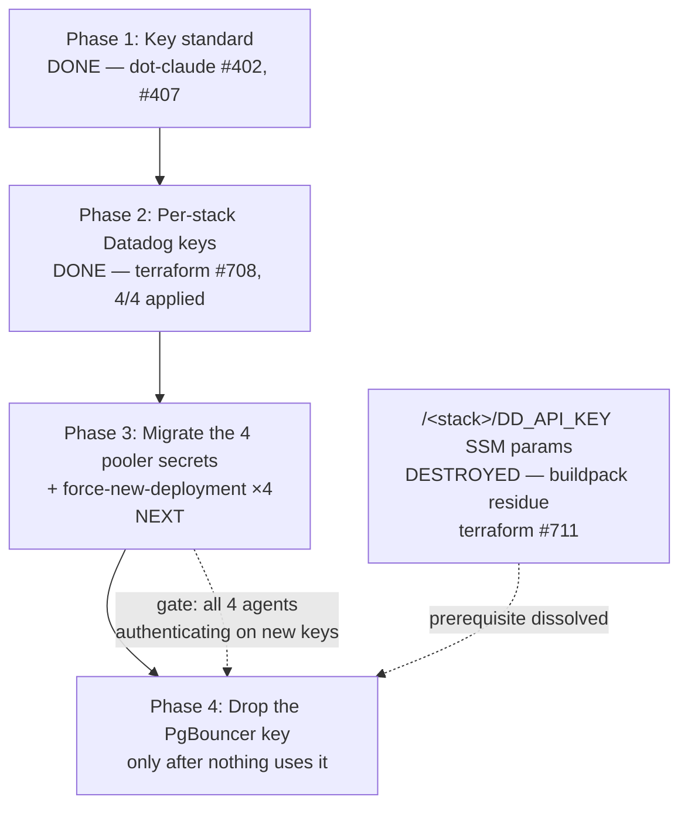

# PLAN — 4Shark key standard + Terraform-managed Datadog API keys

> Reference: no DDD documents exist for this feature. Derived from `PLAN-SPIKE.md` (engineer-validated) and the engineer's communicated choices. Grounding is the existing codebase, the Rollbar precedent runbook, the Datadog provider source, and read-only AWS state — carried forward from the draft.

## Status (2026-07-15)

| Phase | State |
|---|---|
| 1 — Key standard | **DONE** — `dot-claude` #402, corrected by #407 |
| 2 — Per-stack keys | **DONE** — `terraform` #708, applied to all four stacks |
| 3 — Migrate the pooler secrets | **DONE** — `terraform` #713 merged; all four poolers on their own stack's key, each rollout `COMPLETED` at 2/2 |
| 4 — Drop the `PgBouncer` key | **DONE** — `35e7` dropped. The legacy key is **out of this plan's scope**, handled outside it; see § Phase 4 |

**This plan's scope is complete.** The standard exists, the four per-stack keys exist and are owned by a service account, every pooler authenticates on its own stack's key, and the `PgBouncer` key is gone. What remains in the § Open threads index below is not this plan's work.

## Open threads — index, not scope

Everything this session surfaced that is still owed. **Most of these are not this plan's work** — they are listed here only so the context is not lost, each with the home where it actually belongs. Do not grow this plan to cover them; a thread's real home is where it gets executed.

**One remains: #6, and it is paused at the engineer's call.** Threads #3 and #4 were executed; #5 is resolved (Datadog closed by decision, New Relic blocked on a missing credential); #2 is running elsewhere. The legacy key is handled outside this plan entirely.

| # | Thread | Home | State |
|---|---|---|---|
| 1 | **The legacy key** | **Outside this plan** | Handled outside, at the engineer's call. Not this plan's work and not tracked here. |
| 2 | **`ignore_changes = [task_definition]`** — how to reconcile Terraform-as-source-of-truth with an external deployer owning the same field; whether `plan` can detect the divergence; how to destroy a referenced secret safely | **A spike, already running in a separate session** | In progress. Outcome may become a `dot-claude` rule or a mechanical guard. Root cause of this session's incident. |
| 3 | **Bootstrap-credential naming exception** — the standard says every key has an `<ENTITY>`; the provider's own credential is org-wide and has none. The Rollbar precedent names it the same way (`ROLLBAR_API_KEY`, no entity) | `dot-claude` PR against `THIRD-PARTY-KEY-STANDARD.md` | **DONE — `dot-claude` #415 merged.** The exception is bounded: it relaxes the `<ENTITY>` segment (`<SERVICE>_<TYPE>`) and the Terraform lifecycle (created/rotated by hand), and explicitly does **not** relax ownership — which matters most here, since every managed key inherits this credential's identity. |
| 4 | **Integrators' `DD_APM_ENABLED = "false"`** — **12** files, not the 10 this plan said | A `terraform` PR of its own | **DONE — `terraform` #718 merged and applied to all five integrator stacks.** Evidence is *not* the same as the app buildpack block, and the difference matters: the app has no tracing gem at all, whereas the integrator **does** ship `ddtrace 0.48.0`. So the claim had to be proven at the gem, not by absence — and it was, in the source at the exact locked version: `lib/ddtrace/ext/diagnostics.rb:6` declares only `DD_TRACE_ENABLED`, and `lib/ddtrace/configuration/settings.rb:256` is its only consumer. `DD_APM_ENABLED` is an **Agent** variable, and no Agent container runs in an integrator task. The #711 trap was checked for and **does not apply** — see the boundary below. |
| 5 | **`monitoring` stack — Datadog + New Relic** | `~/Projects/4Shark/dot-claude-plans/active/terraform/monitoring/PLAN.md` | **RESOLVED — the two halves resolved differently, neither by writing code.** **Datadog: CLOSED out of scope** by the engineer, after the state was enumerated read-only (11 monitors, 6 dashboards, all UI-made; zero `.tf` matches repo-wide). Option A (adopt the monitors, leave the dashboards) was recommended and declined; the accepted cost is recorded there. **New Relic: BLOCKED**, and not on scope — no `NEW_RELIC_*` field exists in the `Terraform ENV` 1Password item, so the provider cannot authenticate and the current state cannot even be read. The engineer creating a service-account-owned key is the single prerequisite. |
| 6 | **SSH key hygiene** — 6 private keys on disk beyond the sanctioned GitHub one | The `migrate-ssh-keys` skill | Not started. Unrelated to this plan; surfaced by the session-start check. Needs engineer interaction (1Password desktop import). |

**Which old key each pooler actually held — verified, not inferred.** All four `AWSPREVIOUS` values are `2a5c` = the unnamed 2018 key. An earlier reading of this plan guessed from *dates* that `shared-001` held the `PgBouncer` key (its `AWSPREVIOUS` is dated 2026-07-05 13:44, matching the wrong-key incident timeline). **That guess was wrong** — the value is `2a5c` on all four. The `PgBouncer` key (`35e7`) had, and still has, zero consumers. Checked by reading each `AWSPREVIOUS` and comparing its last4 against both old keys' `last4` from the Datadog API, rather than reasoning from timestamps.

> ### ⚠️ INCIDENT — `terraform` #711 broke worker autoscaling on all four stacks
>
> **What happened.** #711 destroyed the four `/<stack>/DD_API_KEY` SSM parameters. Running tasks were unaffected (they already held the secret in memory), but **every new task failed to launch**: `unable to place a task. Reason: Fetching secret data from SSM Parameter Store in us-east-1: invalid parameters: /<stack>/DD_API_KEY`. The services were still pinned to the old task definition revision, which still referenced the destroyed parameter.
>
> **Impact.** Worker autoscaling dead on all four stacks — the failure only manifests when something tries to *start* a task, which is exactly what autoscaling does. `shared-001` had jobs sitting in the queue with `worker-system` and `worker-commission` at 1 desired / 0 running; `atento-001` was failing to start 7 of 8 `worker-user` tasks. Web stayed up everywhere (existing tasks kept serving). Detected by the engineer noticing the stalled queue, **not** by any check this plan ran.
>
> **Root cause — `ignore_changes = [task_definition]` makes a clean `terraform plan` lie about reality.** The `ecs_service` module carries `ignore_changes = [task_definition]` (`modules/ecs_service/main.tf:155`, CodeDeploy owns it during deployments). So Terraform registered a new, clean revision and reported `No changes` — truthfully, from its own point of view — while every service went on running the *old* revision that still referenced the parameter. **"Terraform reconciled" was read as "reality is sound".** It is not the same claim.
>
> **The specific reasoning error.** #711's verification checked the *running* tasks and concluded zero downtime. It never exercised the **new-task path**. The PR text even asserted *"nothing reads what is being removed"* — true of the variable, false of the mechanism: **ECS fetches the parameter to build the task, before the container exists**, regardless of whether anything reads the variable afterwards.
>
> **The check that would have caught it:** list the task definition each service *actually uses* (`describe-services --query 'services[].taskDefinition'`) and grep it for the parameter — not `terraform plan`.
>
> **Resolution — RESOLVED.** A full app deploy per stack, which makes each service adopt the clean revision. All four engineer-triggered, all succeeded:
>
> | Stack | Run | Recovery evidence |
> |---|---|---|
> | `shared-001` | 29445805695 | 4 workers back to 1/1; task def `:104` verified free of `DD_API_KEY` |
> | `atento-001` | 29446233553 | `worker-user` **8/8** (was 8 desired / 1 running, 7 failing in a loop) |
> | `beta-001` | 29446305335 | `worker-system` 1/1 (was 1 desired / 0 running) |
> | `demo-001` | 29446317758 | task def `:115` verified clean (workers at 0 — idle stack, nothing tried to start) |
>
> Duration ≈ 1h05 (parameters destroyed 16:40, last stack recovered 17:45 BRT). The two poolers already migrated in Phase 3 (`beta-001`, `demo-001`) were verified untouched at 2/2 after their app deploys — separate clusters, as expected, but checked rather than assumed.
>
> **Generalizable lesson, worth a rule:** on any stack whose ECS service pins `task_definition` in `ignore_changes`, destroying a secret/parameter referenced by the live revision arms a delayed failure that `plan` cannot see. Either force the new revision in the same change, or verify the live revision no longer references it. A post-mortem is proposed; this is not a one-off oversight but a property of the module.
>
> **The lesson's boundary — established empirically by #718, so it is not over-generalized into paralysis.** The trap needs a resource the **live** revision depends on. It is NOT armed by a task-definition replacement itself, even though `plan` renders that as N destroys. Terraform deregisters only the revision **its own state** holds; the revision the service actually runs was registered out of band by the deploy pipeline — which is the entire reason `ignore_changes = [task_definition]` exists — and Terraform never touches it. Verified live on the `maqnelson` stack: Terraform's revision `:37` went `INACTIVE`, its new one is `:39`, and the service's `:38` stayed `ACTIVE` and untouched. AWS backs the weaker case too, for a service that *were* pinned to a deregistered revision: *"Existing tasks and services that reference an INACTIVE task definition revision continue to run without disruption. Existing services that reference an INACTIVE task definition revision can still scale up or down by modifying the service's desired count"* (https://docs.aws.amazon.com/AmazonECS/latest/developerguide/deregister-task-definition-v2.html). **The discriminator is fetch-time dependency:** #711 destroyed an SSM parameter that ECS resolves *to build a task, before the container exists*; an inline `environment` entry has no such dependency, and old revisions keep their own copy.

**Three things happened that this plan did not predict.** Each is folded into the phases below; recorded here because each changes what remains.

1. **The naming rule was wrong when written, and was corrected before any key was created.** The standard applied one grammar to two different names. The `<SERVICE>_<ENTITY>_<TYPE>` form is `SCREAMING_SNAKE` **because it is an env-var label** — applying it to a resource name inside a vendor console produced `DATADOG_SHARED_001_CONNECTION_POOLER`, which matched neither the community shape nor the repo's own precedent (`monitoring/rollbar.tf:16` names the project *inside* Rollbar `"App-Atento001-Api"`, never the `ROLLBAR_` label). The standard now carries two grammars; the keys are named `<stack>-connection-pooler`. Datadog itself prescribes nothing beyond *"Key names must be unique across your organization"*.
2. **The `/<stack>/DD_API_KEY` SSM parameters are gone — the Phase 4 prerequisite resolved itself.** They were investigated on the engineer's instruction rather than decided by asking, and turned out to be **Heroku buildpack residue**: no agent in the Procfile, no package in the Aptfile, no sidecar in the task definition, and the only Datadog gem present (`dogapi`) reads neither `DD_API_KEY` nor any of the `DD_*` flags. The whole block was removed in `terraform` #711, which destroyed the four parameters — and with them the 2018 key's second-largest consumer. This plan had them listed as an open decision (migrate vs delete); the decision no longer exists.
3. **`DATA_DOG_API_KEY` is a different variable, a different key, and it is live.** The app's `ApplicationConfiguration` reads `DATA_DOG_API_KEY` + `DATA_DOG_APPLICATION_KEY` and builds a `Dogapi::Client`; `api.usage.*` and `commission.count` are reporting today. It was never in this plan's scope and stays out — but the name similarity is the trap: **`DD_API_KEY` was the dead one; `DATA_DOG_API_KEY` is not.**

**What still holds the 2018 key:** only the four pooler Secrets Manager secrets. That is exactly Phase 3.

## Objective

Establish a 4Shark standard for third-party service keys — naming, ownership, lifecycle — generalized from the existing Rollbar token convention, and apply it to Datadog API keys that Terraform creates and manages, replacing the key the four connection-pooler Datadog sidecars authenticate with today (an unnamed 2018 key owned by a disabled personal account). One key per app stack, created and managed in that stack. The standard lands first, the per-stack Datadog keys second, consumer migration third, and the two dead keys are dropped only once nothing uses them.

## Scope

### In scope

- A key standard covering naming, owning identity, and lifecycle (create / rotate / revoke) for third-party service keys.
- A `datadog_api_key` resource created and managed in Terraform in **each** of the four app stacks, with the Datadog provider newly introduced to those stacks.
- Feeding each stack's own `<stack>-connection-pooler-datadog-api-key` Secrets Manager secret locally from the key created in that same stack.
- The sequencing and its dependencies, through to dropping the two dead keys.

### Out of scope

- The two Datadog **APP keys** (`app`, Slack integration) as a governed class. They are adjacent — the provider needs an APP key to authenticate (F5), and F9 shows an APP key owned by a person is revoked when that person is disabled. Whether the standard covers APP keys now or defers them is an open decision below. **Note the boundary:** the provider's own APP key is *in* scope as a prerequisite of Phase 2 (see Phase 2 dependencies); what is out of scope is APP keys as a class the standard governs.
- ~~The `/<stack>/DD_API_KEY` SSM parameters as a migration target.~~ **Moot — they no longer exist.** They held no consumer: Heroku buildpack residue, destroyed in `terraform` #711. See Phase 4.
- Enumerating which IAM principals can read the state bucket — the real blast radius of the state trade-off. Answerable read-only; not reached in the spike (aux: `state_bucket_config_dump_1.json` `_not_researched`).

## Chosen approach

**Direction:** Option A2 — create one `datadog_api_key` per app stack, in the app stack, alongside the Secrets Manager secret that consumes it. The Datadog provider is added to each of the four app stacks; `aws_secretsmanager_secret_version` reads `datadog_api_key.<name>.key` directly. No cross-stack hand-off exists.

**Rationale (from engineer):** *"vamos manter os ambientes bem separados... se tiver vazamento, não pega todos, então uma para cada ambiente."* Blast-radius isolation, chosen deliberately over DRY: a leak or a rotation is scoped to one environment rather than reaching all four. The engineer accepted A2's stated cost knowingly — Datadog resources living in four places, four keys to name/own/rotate, and four provider blocks + four `.envrc` extensions.

**What A2 settles by construction:** the draft's B1/B2/B3 hand-off decision dissolves entirely — the key value never crosses a stack boundary, so there is no output, no `terraform_remote_state` read of a secret, and no 1Password hop for this value. The draft's "entity-less key" naming gap also disappears: each key has a stack as its `<ENTITY>`.

**Source patterns referenced:**

- `~/Projects/4Shark/terraform/app-shared-001/connection_pooler.tf:40-55` — the placeholder secret + `ignore_changes` where the resource and its consumer are co-located (F15).
- `~/Projects/4Shark/terraform/app-atento-001/connection_pooler.tf:42-57` — the identical `atento-001` shape (F15).
- `~/Projects/4Shark/terraform/monitoring/providers.tf:15-18` — the `required_providers` shape each stack repeats (F4).
- `~/Projects/4Shark/terraform/monitoring/.envrc:9-15` — the 1Password → env credential chain each stack's `.envrc` extends (F4).
- `~/Projects/4Shark/terraform/modules/connection_pooler/main.tf:86-89` and `variables.tf:142-144` — the module consumes an **ARN**, never a value, so it needs no change (F16).
- `~/.claude/docs/runbooks/terraform-operations/ADD-ROLLBAR-PROJECT.md:36-44` — the naming grammar being generalized (F1).

### The state-exposure reality (accepted, not transitional)

The engineer accepted that Terraform creating the key puts the key value in state. The draft establishes there is **no hidden exit** from this (F7):

1. **The Datadog provider ships zero ephemeral resources.** `gh api repos/DataDog/terraform-provider-datadog/contents/docs` returns exactly `dashboard_widget_field_rules.md`, `data-sources`, `guides`, `index.md`, `resources` — no `ephemeral-resources` directory; the corroborating fetch of `https://github.com/DataDog/terraform-provider-datadog/tree/master/docs/ephemeral-resources` returns **HTTP 404**.
2. **Write-only arguments do not apply.** HashiCorp: *"Write-only arguments let you securely pass temporary values to Terraform's managed resources during an operation without persisting those values to state or plan files."* The mechanism passes values *to* a resource; `datadog_api_key.key` is `Computed: true` — a value the provider produces. Even if the provider adopted write-only arguments, they would apply to `name`, not to the generated key value. **Honest limit, carried from the draft:** HashiCorp's page carries no explicit sentence saying write-only arguments cannot apply to a Computed attribute — this point is a reading of the mechanism's definition plus the provider's schema, not a quoted prohibition (aux `datadog_provider_docs_raw_1.md` §10). Points 1 and 3 are directly cited and sufficient on their own.
3. **The provider actively depends on the state copy.** `datadog/fwprovider/resource_datadog_api_key.go:50-62` — `key` is `Computed: true`, `Sensitive: true`, with `PlanModifiers: []planmodifier.String{stringplanmodifier.UseStateForUnknown()}`. `Sensitive: true` redacts CLI output — **it does not redact state**. `UseStateForUnknown()` means the provider reads the key back **from state** on subsequent plans, so the state copy is structurally load-bearing, not incidental.

**What A2 changes about this:** the exposure is one key per stack state, instead of one key reachable across five states (the B1 shape). It does not remove the exposure; it bounds each key's blast radius to its own environment. That is exactly the property the engineer chose A2 for.

### The state bucket's actual posture

Read-only AWS output, collected 2026-07-15 (aux `state_bucket_config_dump_1.json`; F10–F12):

| Property | Actual value | What it means |
|---|---|---|
| Encryption | SSE-S3 (`"SSEAlgorithm": "AES256"`), **not** SSE-KMS | Encrypted at rest — HashiCorp's *"Encrypt your state at rest"* is satisfied. But SSE-S3 decryption is transparent to any principal holding `s3:GetObject`; there is no separate key policy acting as a second authorization gate. |
| Bucket policy | **None** — `NoSuchBucketPolicy` | No resource policy exists. |
| Public access | All four blocks `true` | Not public by ACL or policy. |
| Versioning | `{"Status": "Enabled"}` | Rotation writes a new state object version; every prior version still holds the old key value. |

Two consequences to state plainly:

- **IAM identity policy is the only control.** With no bucket policy and no KMS key policy, nothing else stands between a principal and the plaintext state. Not public — single-layered.
- **Versioning means a leaked value persists in object history.** Rotating in Datadog makes the old value useless, so this is not a live exposure in the normal case — but a rotation performed *because a key leaked* does not purge that value from S3 object history. Only noncurrent-version expiration or explicit version deletion does; whether such a lifecycle rule exists was not checked.

**The inversion the draft found:** the pooler secret is KMS-encrypted with a customer-managed key (`app-shared-001/connection_pooler.tf:40-46`, `kms_key_id = "arn:aws:kms:us-east-1:405749097490:key/mrk-fa0cda243274491784fc7b39bead5a03"`), while the state copy is SSE-S3. The key's most-protected copy is in Secrets Manager; its least-protected copy is in state.

## Execution phases



### Phase 1: Key standard

**Objective:** Land a documented standard covering naming, owning identity, and lifecycle for third-party service keys, so Phase 2 creates each key with a settled name and a settled owner.

**Components:**

- **Naming** — generalize the Rollbar grammar (F1, `ADD-ROLLBAR-PROJECT.md:36-44`) from `ROLLBAR_` to any service:

  ```
  <SERVICE>_<ENTITY>_<TYPE>[_<ENVIRONMENT>]
  ```

  - `<SERVICE>` — the third-party service (`ROLLBAR`, `DATADOG`).
  - `<ENTITY>` — client or stack, entity-first, camelCase and letter→digit split (`SHARED_001`, `ATENTO_MX`), per the runbook's split rules.
  - `<TYPE>` — what consumes it. Rollbar's existing set: `APP`, `APP_WEBCLIENT`, `INTEGRATOR`, `SIMPLEX_HARVESTER`. **A pooler key needs a new type token** — the pooler is a first-class consumer and no existing token fits.
  - `<ENVIRONMENT>` — `STAGING` / `DEVELOPMENT`; absent means production.

  **This grammar governs the 1Password label ONLY — the plan originally said otherwise and that was the error.** It is `SCREAMING_SNAKE` *because it is an env-var name*: the Rollbar convention describes a concealed field that doubles as the map key in `var.rollbar_project_tokens` — *"Each token is a concealed field in the `Rollbar ENV` 1Password item (Employee vault). The label is also the key used in `var.rollbar_project_tokens`."*

  The name **inside the vendor's console** is a different name with a different format: `<entity>-<type>`, lowercase-kebab, no service segment. Under A2 that yields `beta-001-connection-pooler`, `demo-001-connection-pooler`, `atento-001-connection-pooler`, `shared-001-connection-pooler` — the names actually created.

  The plan's own caveat flagged the extension as *"an extension, not a citation"* and it was made anyway, producing `DATADOG_SHARED_001_CONNECTION_POOLER` in a console where nothing else is uppercase. Two sources agree it was wrong: the repo already keeps the two apart (`monitoring/rollbar.tf:16` names the project *inside* Rollbar `"App-Atento001-Api"`), and the community shape for a vendor key name is lowercase-kebab. The vendor prescribes nothing — Datadog's only rule is *"Key names must be unique across your organization"*. Corrected in `dot-claude` #407.

- **Ownership** — grounded in F9 (https://docs.datadoghq.com/account_management/api-app-keys/):
  - **An API key must not be owned by a personal account.** *"Any API keys that were created by the disabled account are not deleted, and are still valid."* — a personal-account API key becomes a permanent orphan that nothing reports. This is precisely the 2018 key.
  - **An APP key must not be owned by a personal account, and the stakes are higher.** *"If a user's account is disabled, any application keys that the user created are revoked."* The Terraform provider needs an APP key (F5), so a personal APP key means one HR event breaks every Datadog apply — including the rotation the standard depends on.
  - **The owning identity is a service account.** `datadog_service_account_application_key` exists for exactly this — *"This key inherits all permissions of the service account that owns the key"* — and a service account is not subject to the disablement lifecycle a person is.
  - **A key's owner is the identity whose credentials created it.** A key Terraform creates is owned by whoever owns the APP key in the provider's `.envrc`; get the provider's identity right once and every key it creates inherits it. **Marked as extrapolation in the draft, and it stays marked here:** this follows from F9's *"associated with the user account that created them"*, but the draft found no source stating it specifically for provider-created keys.

- **Lifecycle**:
  - **Creation** — Terraform (`datadog_api_key`), per the settled decision, which F6 shows is also the vendor-endorsed path: *"Securely store your API keys using a secret management system or use this resource to create and manage new API keys."* Note the constraint that comes with it: **import is deprecated** — *"Import functionality for this resource is deprecated and will be removed in a future release with prior notice."*
  - **Rotation** — resource replacement (`terraform apply -replace=...`), then the consumers re-read. No rotation argument exists; `name` is the only required input and the key value is Computed, so a new value is produced only by destroying and recreating the resource. **Not verified (carried from the draft, stays unverified):** no Datadog-provider-specific statement endorsing `-replace` for this resource was found; the mechanism is inferred from the schema shape (Computed value + no rotation argument), not quoted from a source. Confirm against a plan before the standard asserts it.
  - **Revocation** — `terraform destroy` / removing the resource. The real content here is the ordering rule: nothing is dropped until nothing uses it (Phase 4).
  - **The gap the standard must close:** a key with no Terraform resource and no owner is invisible. Both dead keys are that. Whether the standard mandates a periodic audit — and what runs it — is **not answerable from the codebase** and is not decided here.

**Dependencies:** None outside itself. Gates Phase 2, because each key's `name` is fixed at creation (`name` is the only required argument, F6) and renaming means replacement.

**Success criteria — all met:**

- [x] The standard exists at `~/.claude/docs/THIRD-PARTY-KEY-STANDARD.md`, covering naming, owning identity, and lifecycle. Tier 2 pointer wired in `read-context.sh`.
- [x] The naming grammar is stated — **as two grammars**, after the correction: `SCREAMING_SNAKE` for the 1Password label/env var (the Rollbar convention verbatim), `lowercase-kebab` for the name inside the vendor's console. The four key names derive from the second.
- [x] The three open decisions are settled: the convention governs **both** names but with different formats (the original "extend it to the `name` argument" was the error); the document lives as a **Tier 2 convention doc**, not a runbook (a standard is a convention; a procedure would be a separate `ADD-ROLLBAR-PROJECT.md` sibling); **APP keys are in scope** — the provider depends on one and it is the higher-stakes case.
- [x] The ownership rule is recorded, with the provider-inheritance clause still marked as the extrapolation the draft found it to be.
- [x] **Resolved beyond the plan:** the scope required to create a key — `api_keys_write` + `api_keys_read` + `api_keys_delete` — was listed as unverified and is now sourced. The delete is what makes rotation possible, and the provider's own `datadog_permissions` example omits it; the standard says so explicitly.

### Phase 2: Per-stack Datadog keys created and managed in Terraform

**Objective:** Each of the four app stacks creates and manages its own `datadog_api_key`, named per Phase 1, owned by a non-personal identity.

**Components:**

- **Per stack (×4)** — `providers.tf`: add the `datadog` provider + its `required_providers` entry (current version v4.15.0, published 2026-07-07, per `gh api repos/DataDog/terraform-provider-datadog/releases/latest`), following the shape at `monitoring/providers.tf:15-18`.
- **Per stack (×4)** — `.envrc`: export `DD_API_KEY` + `DD_APP_KEY` from 1Password, extending the chain at `monitoring/.envrc:9-15`. The provider reads both (F5: `api_key` — *"This can also be set via the DD_API_KEY environment variable."*; `app_key` — *"This can also be set via the DD_APP_KEY environment variable."*).
- **Per stack (×4)** — a new `datadog.tf` declaring `datadog_api_key` with the Phase 1 name. No output, no remote-state read: under A2 the value never leaves the stack.
- **The provider's own APP key** — see Dependencies; this is a prerequisite, not an afterthought.

**Dependencies:**

- **Phase 1** — the name is fixed at creation; renaming costs a full rotation cycle.
- **The APP-key ownership prerequisite — a prerequisite of this phase, not an afterthought.** The provider needs an APP key to authenticate (F5). Per the standard's own ownership rule, that APP key must belong to a **service account** (F9), which may mean creating the service account first. If the provider's APP key belongs to a person, one HR event revokes it (*"If a user's account is disabled, any application keys that the user created are revoked."*) and breaks every Datadog apply — including the rotation this standard depends on. Get this right **before** the APP key becomes load-bearing.
- **The four app stacks' `.envrc` files were not read in the spike — an unknown.** Whether they can take a 1Password-sourced Datadog credential gates this phase's `.envrc` work. Resolve at execution.
- **The exact Datadog scope required to create an API key is UNVERIFIED** — see § Unverified items. Needed before the provider's APP key is scoped.

**Terraform execution rules (per `~/.claude/docs/TERRAFORM-POLICY.md:3-11`, cited in the draft):** the PR opens **before** any plan or apply; plan-then-apply with a **saved plan file**; **no `-auto-approve`**; **no `-target`**; `direnv exec` per stack; the apply waits for explicit engineer approval.

**Success criteria — all met:**

- [x] The provider authenticates as the `Terraform` **service account** (verified against the API: `service_account: true`, Active), holding the `Terraform Key Manager` role with `api_keys_read` + `api_keys_write` + `api_keys_delete`.
- [x] Each of the four stacks declares its own `datadog_api_key` and applied cleanly — `1 added, 0 changed, 0 destroyed` each.
- [x] Four keys exist in the Datadog org, each named and traceable to exactly one stack: `beta-001-connection-pooler`, `demo-001-connection-pooler`, `atento-001-connection-pooler`, `shared-001-connection-pooler`.
- [x] No key value crossed a stack boundary.

**How the bootstrap was resolved (the plan did not name this problem).** Creating the service account via Terraform needs an APP key to authenticate — which is the thing being created. The paradox was broken the way the Rollbar precedent already breaks it in the same stack: the provider's own credential is created **out of band once** and stored in 1Password (`Terraform ENV` → `DATADOG_API_KEY` / `DATADOG_APP_KEY`), exactly as `ROLLBAR_API_KEY` is. The engineer created the service account, role, and both keys in the Datadog UI; Terraform manages everything downstream of that. The bootstrap credential is therefore **not** Terraform-managed, and rotating *it* is manual — the same trade-off Rollbar already carries.

**The naming gap this exposed — CLOSED (`dot-claude` #415, merged).** The standard said every key has an `<ENTITY>` and that a key without one is the design telling you the key is wrong. The provider's own bootstrap credential is org-wide by nature and has none — so the one credential the standard cannot govern in full read as a violation of its own first rule. The standard now carries a written, bounded exception: it relaxes the `<ENTITY>` segment (the label becomes `<SERVICE>_<TYPE>` — `ROLLBAR_API_KEY`, `DATADOG_API_KEY`, `DATADOG_APP_KEY`, all fields of the shared `Terraform ENV` 1Password item) and the Terraform lifecycle (created out of band, rotated by hand — Terraform cannot bootstrap the credential it authenticates with). **Ownership is explicitly not relaxed**, and the exception says why it matters most there: every key Terraform creates inherits this credential's identity, so a personal APP key here would revoke Terraform's ability to apply anything on one HR event. It licenses nothing else — "no entity for this one" never justifies dropping the segment on a key a provider *can* create.

### Phase 3: Migrate the four pooler secrets to the new keys

**Objective:** Every pooler Datadog sidecar authenticates on its own stack's new key, and nothing reads the 2018 key from a pooler secret.

**Components:**

- **Per stack (×4)** — `aws_secretsmanager_secret_version.connection_pooler_datadog_api_key`: remove `lifecycle { ignore_changes = [secret_string] }` and source `secret_string` from the local `datadog_api_key` (F15). The placeholder pattern (`secret_string = "populated out of band"` + `ignore_changes`) and a Terraform-populated value are **mutually exclusive by construction** — the `ignore_changes` is exactly what must go.
- **The pooler module needs NO change** — it consumes an ARN, never a value: `secrets = [{ name = "DD_API_KEY", valueFrom = var.datadog_api_key_secret_arn }, ...]` (`modules/connection_pooler/main.tf:86-89`). The swap happens entirely at the secret-version layer.
- **Per stack (×4)** — an ECS `force-new-deployment` so the sidecar re-reads the secret; a running task holds the value it started with.

**Dependencies:** Phase 2 (the keys must exist). Sequential, one stack at a time — `beta-001` is the natural first (non-productive) if the engineer wants a canary.

> **HARD GATE — the engineer checks the Sidekiq queue before any deploy. The session never does.**
> This phase contains four redeployments. Each one is a deploy. Before each, the work **stops and hands off to the engineer** for the queue check; the session does not check the queue, does not infer the queue is clear, and does not proceed on its own. This is a gate, not a footnote.

**Success criteria — all met (`terraform` #713, merged):**

- [x] Per stack: the plan showed exactly `1 add, 1 change, 1 destroy` — the secret version replaced (`secret_string` is ForceNew) plus the description update. No task definition touched: the module consumes the secret by **ARN**, so changing the value does not alter the task def.
- [x] Per stack: the engineer performed the queue check before each productive redeployment. **The gate's scope was corrected mid-phase** — this plan framed the four redeployments as app deploys needing the check for Sidekiq-quiet reasons, which is wrong (a pooler redeploy quiets nothing). The engineer's actual rule is broader: *"o check vale para tudo que afete produção"*. Applied to `atento-001` and `shared-001`; `atento-001` was productive and this plan had not said so.
- [x] Per stack: the agent confirmed on the new key.
- [x] All four confirmed. Each pooler authenticates with its **own stack's** key — the point of A2.

| Stack | Key | Rollout | Evidence |
|---|---|---|---|
| `beta-001` | `8958` | COMPLETED 2/2 | key `used_24h: true`; `pgbouncer.*` metrics arriving |
| `demo-001` | `09f8` | COMPLETED | key `used_24h: true` |
| `atento-001` | `a9d0` | COMPLETED 2/2 | key flipped `null` → `used_24h: true` after the rollout |
| `shared-001` | `ea2d` | COMPLETED 2/2 | agent log: `check:pgbouncer \| Running check... \| Done running check`, live |

**Zero downtime, verified against the live services rather than assumed:** two tasks at `minimumHealthyPercent=100` / `maximumPercent=200`, so a new task is healthy before an old one drains; the health check gates on `pg_isready` (the pooler actually accepting connections, not merely the process being up); `stopTimeout=120` against a SIGINT stop signal, so in-flight transactions finish; circuit breaker with rollback. Every rollout was observed holding 2/2 throughout.

**A trap worth recording — the AWSCURRENT/AWSPREVIOUS inversion.** The version Terraform tracked was at **`AWSPREVIOUS`**, not `AWSCURRENT`: the out-of-band population had created a newer version that took `AWSCURRENT`, demoting Terraform's placeholder. So the apply destroys its own (inert) version and creates a new one that becomes `AWSCURRENT` — during the window, `AWSCURRENT` is still the old key, and the sidecar never sees a gap. Verified per stack by reading the version stages before and after.

**On `shared-001`'s verification specifically:** the key's `used_24h` stayed `false` right after its rollout. That is Datadog metadata lag, not a failure — but it could not be assumed, because the `datadog-agent` container is **`essential = false`** (`modules/connection_pooler/main.tf:77`): if it failed to authenticate, the task would stay up and metrics would stop *silently*. Confirmed instead by reading the agent's own log.

### Phase 4: Drop the `PgBouncer` key

**Objective:** The `PgBouncer` key (2025-10-05) is removed, only after nothing uses it.

**The legacy key this plan replaced is OUT OF SCOPE — deliberately, at the engineer's call, and not tracked here.** It is handled outside this plan. **Do not add it back as a task, and do not drop it on the strength of this plan** — nothing here establishes that it is safe to remove, and this plan is not where that decision lives.

**Components:**

- **The `PgBouncer` key (`35e7`, 2025-10-05) — ✅ DROPPED (2026-07-15 ~20:50).** The engineer chose "early". Final check before the delete: `used_in_last_24_hours: false`, `date_last_used: 2026-07-01T10:00` — 14 days idle. `DELETE /api/v2/api_keys/e6b9dcaf-...` → `204`; re-fetch → `404`. Confirmed gone.

**The SSM-parameter prerequisite is RESOLVED — it no longer exists.** This plan listed the four `/<stack>/DD_API_KEY` parameters as a hard gate on the reasoning *"disabled today is not cannot-be-enabled-tomorrow"* — that deleting the key while the params still held it would arm a silent failure whenever someone re-enabled the app-side agent. **That reasoning rested on a false premise.** Investigation found there is no agent to re-enable: the Procfile starts none, the Aptfile installs none, the task definition has no sidecar, and `dogapi` — the only Datadog gem in the app — reads neither `DD_API_KEY` nor any `DD_*` flag (it reads only `DATADOG_HOST` and proxy vars; the credential must be passed to the constructor). The entire block was Heroku buildpack residue that outlived the buildpack. `terraform` #711 removed it and destroyed the four parameters. The gate is gone because the thing it guarded never existed.

**Dependencies:** Phase 3 confirmed complete for all four stacks. Nothing else.

**Success criteria:**

- [x] All four pooler agents confirmed on the new keys (Phase 3).
- [x] ~~The four `/<stack>/DD_API_KEY` SSM parameters no longer hold the legacy key~~ — **destroyed in `terraform` #711**, verified `No changes` on all four stacks afterward.
- [x] The `PgBouncer` key is dropped — engineer chose "early"; `204` on delete, `404` on re-fetch.

**Do NOT touch on the way past** (both live, both easily confused with the target by name):

- `DATA_DOG_API_KEY` / `DATA_DOG_APPLICATION_KEY` — a *different* key, feeding `Dogapi::Client`; `api.usage.*` and `commission.count` report from it today.
- The connection pooler's `DD_APM_ENABLED` / `DD_PROCESS_AGENT_ENABLED` / `DD_LOGS_ENABLED` (`modules/connection_pooler/main.tf:81-83`) — the running sidecar's own configuration, not residue. 28 `pgbouncer.*` metrics depend on that agent. **This is now the only `DD_APM_ENABLED` left in the repo** — #718 removed the 12 integrator ones and deliberately kept this one. The discriminator is not the variable's name but whether an Agent is there to read it: these three sit *inside* the `datadog-agent` container definition, alongside `ECS_FARGATE`; the integrators' sat in an app container with no Agent anywhere, which is what made them dead.

## Technical decisions

| Decision | Choice | Rationale (from engineer / from draft) |
|---|---|---|
| Does Terraform create and manage the key, or adopt one out of band? | **Terraform creates and manages** (`datadog_api_key`) | Settled before the spike, not re-opened: rotation must be a real automatable operation (`terraform apply`-able). F6 shows this is also the vendor-endorsed path — *"use this resource to create and manage new API keys"* — and that **import is deprecated**, which constrains adopting an existing key. |
| Is the key value in state acceptable? | **Yes — accepted knowingly** | The engineer accepted the trade-off. F7 establishes there is no exit: no ephemeral resource in the provider, write-only args do not apply to a Computed attribute, and the provider reads the key back from state (`UseStateForUnknown`). The trade-off is permanent, not transitional. |
| Where does the key resource live? | **A2 — one key per app stack, in the app stack** | Engineer: *"vamos manter os ambientes bem separados... se tiver vazamento, não pega todos, então uma para cada ambiente."* Blast-radius isolation, deliberately chosen over DRY. Accepted cost: Datadog resources in four places, four keys to name/own/rotate, four provider blocks + four `.envrc` extensions. |
| How does the value reach the four pooler secrets? | **Dissolved by A2 — no hand-off exists** | Each stack creates its own key and feeds its own Secrets Manager secret locally. The draft's B1/B2/B3 options apply only under A1 and are moot. |
| Naming for a key with no single entity | **Dissolved by A2** | The Rollbar grammar (F1) assumes one credential per entity; under A2 each key has a stack as its `<ENTITY>`, so the entity-less-key gap does not arise. |
| Sequencing | **1) standard → 2) per-stack keys → 3) migrate consumers → 4) drop dead keys** | The engineer's stated order, with the spike's `/<stack>/DD_API_KEY` gap folded into Phase 4. Step 1 gates step 2 because `name` is fixed at creation (F6). |
| Who checks the Sidekiq queue before a deploy? | **The engineer — always. The session never does.** | Engineer's standing rule. Phase 3's four redeployments each stop and hand off. |
| Owning identity for the provider's APP key | **A non-personal service account, as a Phase 2 prerequisite** | F9: an APP key owned by a person is revoked on disablement, breaking every Datadog apply including rotation. `datadog_service_account_application_key` is the available non-personal owning identity. |
| Does the naming convention govern Datadog's `name` argument? | **Two grammars, not one** — `SCREAMING_SNAKE` label, `lowercase-kebab` in-service | The single-grammar framing was itself the error. Corrected in `dot-claude` #407 before any key was created. |
| Where does the standard live? | **Tier 2 convention doc** | A standard is a convention; a procedure would be a separate runbook. |
| Does the standard cover APP keys now? | **Yes** | The provider depends on one, and it is the higher-stakes case (revoked on disablement). |
| How is the provider's own credential bootstrapped? | **Out of band, once, in 1Password — the Rollbar precedent** | Terraform cannot create the APP key it authenticates with. Same shape as `ROLLBAR_API_KEY` in the same stack. Cost accepted: rotating the bootstrap credential is manual. |
| Are the 4 `/<stack>/DD_API_KEY` SSM params migrated or deleted? | **Dissolved — destroyed as buildpack residue** | The question presupposed an agent that does not exist. `terraform` #711. |
| Is the `PgBouncer` key dropped early or with the batch? | **OPEN — engineer decides at execution** | See § Open decisions. Blocks nothing. |

## Open decisions

Four of the five are settled; one remains. Kept as a record of what was decided and why, so a later reader does not re-open them.

**1. Does the naming convention govern Datadog's `name` argument?** — **SETTLED, and the original framing was the bug.** The question assumed one grammar that either does or does not extend. It is two grammars: `SCREAMING_SNAKE` for the 1Password label (because it *is* an env var), `lowercase-kebab` for the name inside the vendor's console. The repo already kept them apart and the plan missed it. Corrected in `dot-claude` #407.

**2. Where does the standard live in `dot-claude`?** — **SETTLED: Tier 2 convention doc.** A standard is a convention (naming, ownership, lifecycle), and Tier 2 is where conventions live. The draft's own reading was right that a *procedure* ("create a key and wire it to the poolers") would be a different document — an `ADD-ROLLBAR-PROJECT.md` sibling — not a competitor. None was needed.

**3. Does the standard cover APP keys now?** — **SETTLED: yes.** The provider depends on one and it is the higher-stakes case (a personal APP key is revoked on disablement and breaks every apply, including rotation).

**4. Are the four `/<stack>/DD_API_KEY` SSM parameters migrated, deleted, or left?** — **DISSOLVED, not decided.** The question presupposed a consumer that does not exist. See Phase 4 for the evidence; the parameters were destroyed in `terraform` #711 as buildpack residue.

**5. Is the `PgBouncer` key (2025-10-05) dropped early or with the batch?** — **SETTLED: early.** Engineer's call. Dropped 2026-07-15 ~20:50 after a final idle check (14 days since last use). See Phase 4.

**Every decision in this plan is now settled, and this plan's scope is complete.** The legacy key is handled outside it.

## Risks

| Risk | Impact | Mitigation |
|---|---|---|
| The key value in state is unavoidable — no ephemeral/write-only exit exists (F7) | High — the accepted trade-off is permanent, not transitional | A2 already bounds each key's exposure to its own stack's state (one key per state, not one key across five). Tightening the state bucket's access controls (F10–F13) is the remaining lever, out of this scope. |
| State bucket is SSE-S3 + no bucket policy → IAM identity policy is the only control (F10, F11) | High — any principal with `s3:GetObject` reads a key in plaintext; the KMS-encrypted Secrets Manager copy (F15) is better protected than the state copy | Enumerate who holds `s3:GetObject` (read-only, not done — aux `_not_researched`); consider SSE-KMS as a second gate — a bucket-wide change, out of this scope. |
| Versioning keeps old key values in S3 history after rotation (F12) | Medium — a rotation performed *because* of a leak does not purge the leaked value | Noncurrent-version expiration lifecycle rule; whether one exists was not checked. |
| The provider's APP key is itself an unguarded personal credential (F5 + F9) | High — an HR event revokes it and breaks every Datadog apply, including the rotation the standard depends on | Put the provider on a service-account APP key **as a Phase 2 prerequisite**, before it becomes load-bearing. |
| Dropping the legacy key on the strength of this plan | High — this plan migrated the consumers it knew about; it never established that nothing else uses the key, and a wrong drop is a silent, deferred failure | **Out of scope, by decision.** The key is handled outside this plan; nothing here authorizes removing it. |
| Phase 3 needs four ECS redeployments on productive stacks | Medium — deploy risk ×4 | **The engineer checks the Sidekiq queue before each; the session never does.** Sequence them one stack at a time; `beta-001` first as a canary. |
| `name` is fixed at creation; renaming = replacement (F6) | Medium — getting a name wrong costs a full rotation cycle | Settle naming in Phase 1 before Phase 2 — which is what the sequencing already does. |
| A2 proliferation — four keys, four owners, four provider blocks | Medium — the current problem is precisely an org accumulating keys nobody tracks | The standard must say plainly that four keys with four owners is the **intended end state, not drift** (the draft's own stated condition for A2). |
| The four app stacks' `.envrc` files were never read (draft gap) | Medium — gates Phase 2's `.envrc` work; unknown whether they can take a 1Password-sourced Datadog credential | Resolve at execution, before the Phase 2 PR. |

## Assumptions

- Third-party API keys are created and managed **by** Terraform so rotation is `terraform apply`-able. Settled before the spike; every phase assumes it.
- The engineer accepts the state-exposure cost of Terraform-created keys knowingly, in exchange for automatable rotation.
- The 2018 key still authenticates the pooler agents because API keys survive their creator's disablement (F9) — an established fact the draft explains, not a new claim.
- ~~The `/<stack>/DD_API_KEY` SSM parameters feed an app-side agent that is disabled today, and "disabled today" does not mean "cannot be enabled tomorrow".~~ — **FALSE, and it was the plan's only wrong assumption.** There is no agent: no process in the Procfile, no package in the Aptfile, no sidecar in the task definition, and `dogapi` reads neither `DD_API_KEY` nor any `DD_*` flag. `DISABLE_DATADOG_AGENT="true"` was disabling a Heroku buildpack that stopped existing at the ECS migration. The parameters were destroyed in `terraform` #711.
- **The app's live Datadog integration is `DATA_DOG_API_KEY` + `DATA_DOG_APPLICATION_KEY` — a different variable, a different key, out of this plan's scope and staying.** Recorded because the name similarity is the trap that made the assumption above look right.
- The `PgBouncer` key (2025-10-05) is in no secret store and was used once — hence no consumers to migrate.
- The pooler module needs no change under A2, because it consumes a secret **ARN**, not a value (F16).
- Terraform `>= 1.11` is already required in the repo's monitoring stack (`monitoring/providers.tf`); the Datadog provider's own documented `required_version` is `>= 1.1.5` (aux §5).

## Unverified items

**Resolved during Phases 1–2:**

- [x] **The exact Datadog scope required to create an API key** — `api_keys_write` (*"Create and rename API Keys for your organization."*), plus `api_keys_read` (the provider reads the key back on every plan) and `api_keys_delete` (rotation is a replace, which destroys first). https://docs.datadoghq.com/account_management/rbac/permissions/. The provider's own `datadog_permissions` example builds an "API Key Manager" role from the first two only — **that role cannot rotate a key.**
- [x] **`terraform apply -replace=...` as the rotation mechanism** — grounded, not inferred: the resource schema takes only `name` + `remote_config_read_enabled` and the key is Read-Only, so a new value comes only from replacement; `-replace` is HashiCorp's documented *"Instructs Terraform to plan to replace the resource instance with the given address"*.
- [x] **Whether the four app stacks' `.envrc` files can take a 1Password-sourced Datadog credential** — yes; all four already pull from the same `Terraform ENV` item and now export `DD_API_KEY` / `DD_APP_KEY` alongside the existing Atlas/Redis/GitHub credentials.

**Still unverified** — none blocks Phase 3 or 4:

- **The write-only-arguments reading (F7 point 2).** HashiCorp's page carries no explicit sentence that write-only arguments cannot apply to a Computed attribute. The practical conclusion does not depend on it — F7 points 1 (no ephemeral resources; 404) and 3 (`UseStateForUnknown`) are directly cited and sufficient.
- **Which IAM principals hold `s3:GetObject` on `4shark-terraform-state`.** Not enumerated; answerable read-only. This is the actual blast radius of the state trade-off, and now four key values sit in four states.
- **Whether CloudTrail data events are enabled on the state bucket** (HashiCorp's *"Use audit logs to track state access over time"*). Not checked.
- **Whether a noncurrent-version expiration lifecycle rule exists on the state bucket.** Not checked — relevant to how long an old key value persists in object history.

---

> **Authoring:** written by `@agent-plan-composer` from the engineer-validated `PLAN-SPIKE.md` plus the engineer's communicated choices (Terraform-managed keys; A2 — one key per stack, for blast-radius isolation; the four-step sequencing with the SSM-param gate folded in; the engineer-only Sidekiq queue check). No new options, no new technical decisions, and no new assumptions were introduced at the composer stage — every claim traces to the draft or to those choices. Items the draft marked unverified remain unverified; decisions A2 does not resolve remain open for the engineer.
