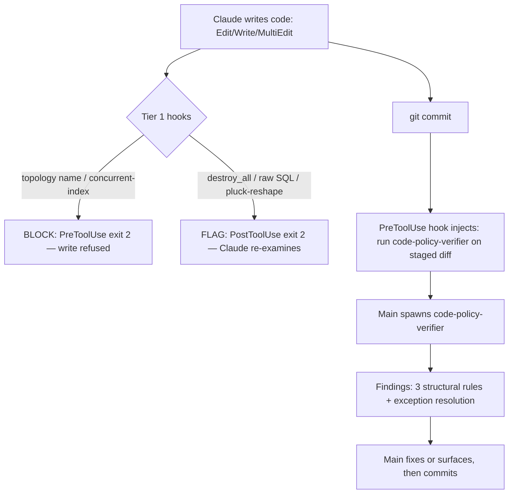

# PLAN — Vazamento B: Code-Write Conformance Enforcement

> Reference: derived from `~/.claude/plans/active/spike/vazamento-b-code-enforcement/SPIKE.md` (+ aux: coverage-gap matrix, detectability/block-flag table). Target repo: `dot-claude` (config) — ships via PR from `~/Projects/4Shark/dot-claude`, never a direct edit to `~/.claude/`.

## Objective

Catch 4Shark convention violations at the moment code is written (Edit/Write) or about to be committed — closing "vazamento B": code that breaks a convention even when the plan was conforming. The document-level `policy-verifier` (already shipped) gates the PLAN; this gates the CODE.

## Scope

### In scope (the tiered architecture — engineer chose "the two together")

- **Tier 1 — deterministic bash hooks** for the highest-value detectable rules: 2 BLOCKs + 3 FLAGs.
- **Tier 2 — an LLM code-policy reviewer** spawned at the `git commit` boundary, covering the 3 structural rules bash cannot detect and resolving exception context for the flags.

### Out of scope (not deferred work — boundaries of this change)

- The other 7 deterministic FLAGs (statement_timeout absence, if_not_exists, one-action migration, belongs_to optional, safety_assured, multiple raise, .new().to_h) — the engineer opts these in case by case; they are not part of this change to avoid flag noise.
- Rules already covered at write time (bang methods, migration creation, single-letter variables, terraform Bash commands).

## Chosen approach

Tier 1 deterministic hooks follow the established `validate-bang-method-web-flow.sh` pattern (tool_name branch → new-content extraction → scope gate → regex → exit code). Tier 2 mirrors the `policy-verifier` contract (read-only agent, status enum, main-driven, governing docs injected at spawn) but operates on the staged code diff instead of a `.md` document.

**Execution note (from the spike verification):** the `output-verifier` found the spike's rendering of the hook pattern carries wrong line numbers and one fabricated construct (`|| exit 0` where the real file uses `case`). **Read `validate-bang-method-web-flow.sh` directly before writing any hook — do not trust the spike's pseudocode.**

## Flow

## Execution phases

Each phase is independently shippable as its own PR (Phase 1 and Phase 2 may be combined — both are deterministic hooks; Phase 3 is separate).

### Phase 1 — Tier 1 BLOCK hooks (2)

**Objective:** hard-stop the two absolute rules (no documented exception, no false-positive path).

**Components:**
- `scripts/validate-worker-topology-naming.sh` (PreToolUse `Edit|Write|MultiEdit`) — blocks a worker class named `Executor` / `Runner` / `Handler` / `Manager`. Scope gate: worker paths (`~/Projects/4Shark/*/app/workers/**/*.rb` and the repo's worker conventions — confirm the actual worker dir layout at build time). Regex on new content for a class declaration ending in those words. Exit 2.
- `scripts/validate-concurrent-index-ddl.sh` (PreToolUse `Write|Edit`, migration scope `db/migrate/*.rb`) — blocks `algorithm: :concurrently` present without `disable_ddl_transaction!`. **Implementation nuance:** this needs the WHOLE migration file state (the `disable_ddl_transaction!` may sit outside the edited fragment), so the hook reads the target file from disk and considers it together with the new content — not just `new_string`. Exit 2.
- `settings.json` — two PreToolUse entries.
- Doc updates: `CLAUDE.md` (the Data Processing and Rails Migrations sections gain a "mechanically enforced" mention), repo tree, `CHANGELOG.md`.

**Success criteria:**
- [ ] Topology hook blocks a banned worker class name; passes a legit `Processor`/`Producer` and a same-named class outside worker scope.
- [ ] Concurrent-index hook blocks the invalid combination; passes a concurrent index that has `disable_ddl_transaction!`.
- [ ] `bash -n` clean; smoke-tested both block and pass paths.

### Phase 2 — Tier 1 FLAG hooks (3 high-value)

**Objective:** flag (PostToolUse exit 2 — write proceeds, Claude re-examines) the three most common real mistakes; each carries its rule's documented exception so Claude can judge.

**Components:**
- `scripts/flag-bulk-delete.sh` — `destroy_all` / `delete_all` in app code. Message names the BULK-DELETE.md exceptions (≤15 records w/ callbacks; no callbacks/dependents).
- `scripts/flag-raw-sql.sh` — `update_all` / `connection.execute` / `find_by_sql` (raw-SQL shapes). Message names the explicit-authorization exception. **Overlap to resolve:** `delete_all` belongs to BOTH this rule and bulk-delete — at build time, decide which single hook owns `delete_all` so it does not double-flag (proposal: bulk-delete owns `delete_all`/`destroy_all`; raw-SQL owns `update_all`/`connection.execute`/`find_by_sql`).
- `scripts/flag-pluck-ruby-reshape.sh` — `pluck` in proximity to `group_by`/`sort_by`/`transform_values`/`each_with_object`.
- `settings.json` — three PostToolUse entries.
- Doc updates: `CLAUDE.md` (Bulk Delete + ActiveRecord Query Discipline sections), repo tree, `CHANGELOG.md`.

**Success criteria:**
- [ ] Each hook flags its violation and passes clean code.
- [ ] `delete_all` flags exactly once (no double-flag).
- [ ] Scope gates keep the flags inside 4Shark app/lib Ruby.

### Phase 3 — Tier 2 LLM code-policy reviewer at `git commit`

**Objective:** cover the 3 structural rules (IDs-only, index awareness, code anti-patterns) and resolve exception context for the flags — at the commit boundary, automatically reminded.

**Components:**
- `agents/code-policy-verifier.md` — read-only agent mirroring `policy-verifier`'s contract (status enum `ACCEPT`/`ACCEPT_WITH_WARNINGS`/`PARTIAL`/`REJECT`, confidence, false-negative weighting, main-decides), but its input is the staged code diff, not a `.md`. It applies the structural rules + judges whether a Tier-1 flag is a real violation or a documented exception.
- `scripts/inject-commit-policy-reminder.sh` (PreToolUse Bash, `git commit` matcher) — fires before a commit, injects an instruction that main should spawn `code-policy-verifier` on `git diff --cached` before completing the commit. **Reminder, not block** — parity with the document `policy-verifier` (main-driven; a hook cannot run an LLM). Precedent: `inject-pr-commit-data-policy.sh` already fires on `git commit`.
- Governing-doc injection: reuse the `inject-policy-verifier-docs.sh` approach (PreToolUse Task hook keyed on `subagent_type == "code-policy-verifier"`) — decide at build time whether to inject the same full set or a code-focused subset.
- Doc updates: `SUBAGENT-CONTRACT.md` (a third verifier — code policy), `CLAUDE.md` (verifier subsection + agents list + tree), `CHANGELOG.md`, and an ADR (the commit-boundary code-review decision — next number after ADR-003).

**Success criteria:**
- [ ] Reviewer agent returns the status enum + per-rule findings on a staged diff.
- [ ] Commit-reminder hook fires on `git commit`, passes through on every other Bash.
- [ ] Reviewer correctly clears a documented-exception case (e.g. `destroy_all` for a ≤15-record collection) and flags a genuine structural anti-pattern.

## Technical decisions

| Decision | Choice | Rationale (from engineer) |
|----------|--------|----------------------------|
| Architecture | Tiered: deterministic hooks + LLM reviewer | Engineer chose maximum coverage ("os dois juntos") |
| Tier-1 FLAG scope | 3 high-value rules only; other 7 opt-in later | Avoid flag noise from firing 10 at once |
| Tier-2 trigger | `git commit` (PreToolUse reminder) | Automatic at the natural "code is final" boundary; cleaner than manual `/test`, more semantic than `Stop` (which fires every turn) |
| Tier-2 nature | Reminder-injection, main spawns the reviewer | A hook cannot run an LLM inline — same shape as the document policy-verifier |
| Block vs flag (per rule) | Block only the 2 exception-free rules; flag the rest | Block is safe only when the rule has no documented exception |

## Risks

| Risk | Impact | Mitigation |
|------|--------|------------|
| Spike's hook-pattern citations were wrong (verifier PARTIAL) | Building from bad pseudocode | Read `validate-bang-method-web-flow.sh` directly before each hook |
| Flag noise even with 3 | Engineer dismisses flags | Started with the 3 highest-value; the other 7 stay opt-in |
| `delete_all` double-flag | Two hooks fire on one keyword | One hook owns `delete_all` (bulk-delete); raw-SQL hook excludes it |
| Topology BLOCK false-positive on a legit `*Handler` class | Engineer can't write valid code | Tight scope gate to worker dirs only |
| Concurrent-index hook needs whole-file state | Edit fragment lacks `disable_ddl_transaction!` context | Hook reads the file from disk, not just `new_string` |
| Commit reviewer not mechanically forced | Main may skip spawning it | Parity with policy-verifier (reminder); acceptable, documented |

## Assumptions

- The PreToolUse Bash `git commit` matcher fires reliably (confirmed by the existing `inject-pr-commit-data-policy.sh` precedent — verify its matcher shape at build time).
- The worker-class and migration scope-gate paths match the actual 4Shark repo layout (confirm against `app/workers/` and `db/migrate/` at build time).
- PostToolUse exit 2 surfaces the flag to the model the same way `check-abbreviated-variables.sh` does (confirm the existing hook's exact exit/stderr behavior at build time).
