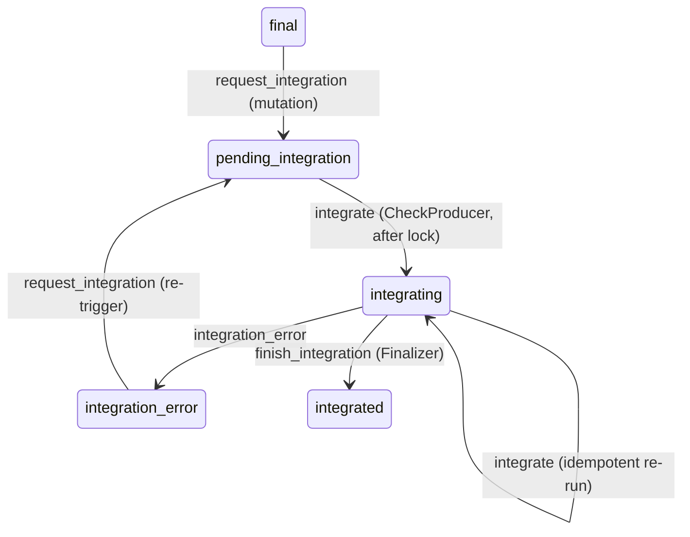

# PLAN — FPW Payroll Integration: timeout retry, single-level error handling, per-company serialization

> Branch / PR: `feature/fpw-consumer-timeout-retry` (PR #5111). All four pieces below ship in this PR.
> Source draft: `PLAN-SPIKE.md` (same directory). Engineer resolved all open design questions; this PLAN reflects the locked decisions.
> Out of scope (separate follow-up PR): the `attempts` jsonb per-attempt log column.

## Context

The 21/05 `app-outbound` (atento-br) run had 17 `validation` requests fail with `Net::OpenTimeout` to FPW; they were never retried because a `Net::*Timeout` (a `StandardError`) was swallowed by the inner `rescue StandardError` and never reached the retry handler. Fixing this exposed structural issues in the three FPW consumers and a latent concurrency bug. This plan redesigns the error handling, makes all three stages safely retryable, and serializes integration to one payment at a time per company.

Pipeline today: `IntegratePaymentGraphqlMutation` → `CheckProducer` → `CheckConsumer` (read) → `ExecuteProducer` → `ExecuteConsumer` (write: Cadastre/Atualize) → `ValidateProducer` → `ValidateConsumer` (read) → `Finalizer`. Producers fan out one consumer job per `user_payment`; each consumer persists a `PayrollRequest` per `(user_payment, action)` via `find_or_create_by`. `ApplicationWorker` has no `sidekiq_options retry:` → Sidekiq default 25 retries on any exception that escapes `perform` (`app/workers/application_worker.rb:4`) — so nothing may escape the write consumer.

---

## Piece 1 — Single-level error handling (remove the gambiarra)

**Decision:** Remove the inner `begin/rescue StandardError` block around `http.request` in all three consumers. The `rescue *HTTP_TIMEOUT_EXCEPTIONS; raise` re-raise idiom is deleted. All exceptions propagate to ONE method-level rescue with two clauses:

```ruby
rescue *FpwIntegration::CONNECTION_EXCEPTIONS, *FpwIntegration::HTTP_TIMEOUT_EXCEPTIONS => e
  # timeout/connection → count + retry (reads) / count + fail (write)
rescue StandardError => e
  # any other error during the exchange → mark payroll_request + user_payment failure, save
end
```

- The success / non-2xx HTTP handling stays inline in the happy path (non-2xx is not an exception — it is the `else` branch).
- `starts_at`/duration: compute duration in the happy path; in the `StandardError` clause, set `ends_at` defensively (guard against an exception raised before `starts_at` is assigned).
- Same shape in `check_consumer.rb`, `execute_consumer.rb`, `validate_consumer.rb`.

Net effect: linear control flow, no re-raise, identical structure across the three.

---

## Piece 2 — Retry up to 5 in all three consumers

**Decision:** `timeout_quantity` = count of timeouts seen; increment on EVERY timeout including the initial one. Retry gate: `timeout_quantity <= FpwIntegration::MAX_TIMEOUT_RETRIES` (5). Backoff: `TIMEOUT_RETRY_BACKOFF` = 5s via `dynamic_perform_in`. Final count after the cap is reached = 6 (1 initial + 5 retries).

- `CheckConsumer` and `ValidateConsumer` (reads): on timeout → `increment!(:timeout_quantity)`; if `<= MAX` → `dynamic_perform_in(TIMEOUT_RETRY_BACKOFF, user_payment_id)`; else → mark `payroll_request` + `user_payment` failure. (Already in PR #5111; keep.)
- `ExecuteConsumer` (write): adopt the same retry path. The write becomes safe to retry — see Piece 3. (See `app/models/fpw_integration.rb:6-10` for the exception sets and constants already added in PR #5111.)
- The retry path itself raises nothing; the failure branch saves and returns. Nothing escapes `perform` → no Sidekiq 25× retry.

---

## Piece 3 — Cadastre "already exists" on retry — OBSERVE FIRST, do NOT implement yet

**Why the write is safe to retry** (`app/workers/fpw_integration/execute_consumer.rb:23-29`):
- `Atualize` sets an ABSOLUTE value (`payroll_check_request.balance + user_payment.billable_money`). Re-applying the same absolute value is idempotent.
- `Cadastre` creates a new event; the FPW/LG SOAP API REJECTS a duplicate Cadastre with an "already exists" fault (guaranteed by the API — engineer-confirmed). So a retried Cadastre never produces a duplicate.

**Decision (engineer): do NOT write handling for this yet — "deixar explodir".** We do not know the exact shape/wording of the FPW "already exists" fault, and we will NOT guess it in code. With Execute now retryable (Piece 2), a Cadastre that landed but timed out will, on retry, receive that fault and fall into the existing `else` → recorded as `failure`. That failure is the signal: it surfaces the real `response_body` in production. ONLY THEN, with the actual faultstring in hand, do we implement "treat already-exists as success" — as a follow-up, not in this PR.

**Do not:** add a guessed faultstring constant or any `match?` against an unobserved response. (This was attempted and reverted — the regex was a guess.)

**Follow-up (after first prod occurrence):** read the failed `payroll_request.response_body`, capture the exact fault, then add the detection (SOAP 1.1 `Envelope/Body/Fault/faultstring`, SOAP 1.2 `Envelope/Body/Fault/Reason/Text`) and convert that specific fault to `:success`.

---

## Piece 4 — Per-company serialization (new state + per-company lock + baton)

**Goal:** only ONE payment integrates at a time PER COMPANY; different companies run in parallel. The client may request many payments; the system drains them one at a time.

### New Payment status: `pending_integration`

- Add `pending_integration` to `Payment#status` enumerize (next integer = **10**). NO migration (status is an integer enumerize value).
- Meaning: integration was requested but the payment is waiting for the company's integration slot.
- pt-BR translation: **"Aguardando capacidade de integração"**.
- Translations must be added in BOTH repos: `app/config/locales/pt-BR/models/payment.yml` and `app-webclient/src/translations/pt-BR.json`. **Pre-implementation check:** grep both repos for every locale file (`en`, `es`, …) and add the key to each.

### State machine changes (`app/models/payment.rb:66-76`)



- Add transitions into `pending_integration` from `final` and `integration_error`.
- Change the `integrate` event source from `final` to `pending_integration` (keep `integrating → integrating`).
- `integration_owner_id` / `integrated_from` / `integrated_at` are set today by `integrate_by` (`payment.rb:122-130`). Decide during implementation whether they are set at the `final → pending_integration` transition (request time) or at `pending_integration → integrating` (start time). Recommended: set at request time (the mutation) so we record who requested.

### Flow

1. **Mutation** (`integrate_payment_graphql_mutation.rb:13-14`): transition `final → pending_integration` and enqueue `CheckProducer`. Does NOT acquire the lock; does NOT go to `integrating`.
2. **CheckProducer** (`check_producer.rb:9-37`): FIRST, try the per-company lock. If held → silent `return` (payment stays `pending_integration`, no work). If acquired → `payment.integrate!` (`pending_integration → integrating`) and proceed with the existing fan-out.
3. **Finalizer** (`finalizer.rb:7-10`): after `finish_integration!`, run the baton — find `Payment.where(company_id:).with_status(:pending_integration).order(:id).limit(1).first`; if found, enqueue its `CheckProducer` (which acquires the lock and starts it); if none, release the lock (`Lock.delete`).

The lock is held continuously across the chain (acquired by the first payment's CheckProducer, passed implicitly via the baton, released only when no `pending_integration` payment remains for the company).

### Lock

- Use the existing `Lock` class (`app/models/lock.rb`), **non-block form, NO TTL**.
- Key: `"fpw_integration_company_#{company_id}"` (the class prepends `lock:` → `lock:fpw_integration_company_<id>`).
- **No TTL by design.** A TTL that expired mid-process would let a second payment start and reintroduce the race. Instead, the system GUARANTEES release on every terminal outcome. The release/baton lives only in the `Finalizer` (the single release point), so the invariant the implementation must hold is: **every `user_payment` outcome — success AND failure — still calls `increment_executions`, so the pipeline always reaches the `Finalizer`.** No path may end a payment's integration without reaching the Finalizer. Any unexpected exception that could escape a consumer and skip the chain must be caught and funneled to a terminal path that still advances the counter.

### Concurrency bug this fixes (independent of retry)

Two payments for the same company integrating in parallel both read the same FPW balance in their Check stage, both compute their own absolute target, both Atualize → last-writer-wins → one payment's `billable_money` is silently lost (`execute_consumer.rb:18,25`). The per-company lock makes this impossible.

---

## Execution order

1. Piece 1 + Piece 2 in the three consumers (single-level rescue; retry-by-action; Execute retry). Lowest risk, closes the incident.
2. Piece 3 — NOT in this PR. Let the Cadastre "already exists" case explode (recorded as failure); observe the real fault in prod, then implement as a follow-up.
3. Piece 4 state + serialization: add `pending_integration` + translations (all locales, both repos); state-machine transitions; mutation change; CheckProducer lock; Finalizer baton.
4. Tests (see below). CHANGELOG entry.

## Risks / open items

| Item | Status |
|---|---|
| Exact FPW "already exists" faultstring | OBSERVE FIRST — do NOT implement or guess; let the Cadastre retry fail in prod, capture the real fault from `response_body`, then handle as a follow-up |
| Lock leak if a path skips the Finalizer | No TTL by design — mitigated by guaranteeing every `user_payment` outcome (success and failure) increments executions so the pipeline always reaches the Finalizer (single release + baton point) |
| New `pending_integration` value unknown to a GraphQL status enum / frontend status switch / Payment scope | **MUST grep before merge** — a new enumerize value that a GraphQL enum or a frontend map doesn't know about breaks serialization/rendering. Enumerate every consumer of `Payment#status` and add the new value. |
| `(company_id, status)` composite index on `payments` absent | Baton query may Seq Scan for large companies — follow-up migration, out of scope |
| `user_payment.pending?` on Execute retry re-runs the HTTP (re-sends Cadastre) | Intended — FPW rejects the duplicate; the resulting failure is the signal we use to capture the real fault (Piece 3 follow-up) |

## Tests

No consumer specs exist today. Add specs for: timeout → retry path (stub `Net::HTTP` raising `Net::OpenTimeout`; assert `dynamic_perform_in` + `timeout_quantity` increment); cap reached → failure; CheckProducer lock-held → no-op return; Finalizer baton picks next `pending_integration`.

## Decisions locked (do not re-open)
- Single-level rescue (remove inner block).
- Retry in all three; `timeout_quantity` counts every timeout; cap 5; backoff 5s.
- Cadastre "already exists" → NOT implemented now; observe the real fault in prod first, then handle as a follow-up.
- New `pending_integration` status; lock in CheckProducer; baton + guaranteed release in Finalizer; existing `Lock` class, NO TTL (release guaranteed on every terminal path — success and failure).
