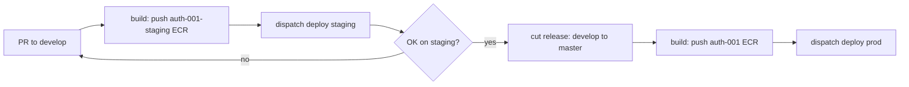

# PLAN — Keycloak restructure (HubFlow + staging + role-named ECRs)

Supersedes the earlier "auth-001-staging" plan (that scope is folded in below). This is the full keycloak image-repo + infra restructure so a new upstream version is validated on a non-productive staging instance and promoted to production through GitFlow, before it touches the productive SSO.

## Decisions (engineer, this session)

1. **HubFlow for keycloak** (`develop` + `master`) — keycloak is actively-versioned / multi-scenario (unlike pgbouncer, which stays main-only). `develop` builds the staging image; `master` builds the production image.
2. **Deploy is a manual dispatch** (same as pgbouncer) — NOT auto-deploy on merge. The only difference vs main-only: the staging deploy pulls the `develop`-built image, prod pulls the `master`-built image.
3. **Separate role-named ECRs per instance** — `auth-001` (prod), `auth-001-staging` (staging). No shared `:latest` collision; ECR storage cost is negligible.
4. **Naming principle** — infra is named after the application ROLE (`authenticator`), not the tool (`keycloak`). The repo stays `keycloak`. The pgbouncer → `connection-pooler` fleet rename is a SEPARATE effort (renaming productive ECS clusters/services is destroy+recreate — its own planned migration).
5. **Standard doc gets two shapes** — main-only (simple/stable, pgbouncer) vs HubFlow (actively-versioned, keycloak).

## Flow this enables

## Done already

- **Staging infra** — service (desired 0) + task-def + target group + host listener rule + log group (terraform #591); DNS CNAME → same ALB (#592).
- **ECRs** — `auth-001` + `auth-001-staging` created, deploy user push access granted; legacy `auth-001-app` kept (#594).
- **The `keycloak_staging` database** created on the shared RDS instance (via psql from the VPN box).
- (Earlier this session: the whole CI/CD — Dockerfile pinned tag+digest, renovate.json, hadolint ci, verify-minimum-age, build/deploy workflows, CHANGELOG, identity min-age check; build-fix; repo hygiene; README.)

## Remaining — safe execution order

The ECR-rename steps fold into the HubFlow build/deploy rewrite. The order below never strands production and keeps develop/master driving the right ECRs.

**Current focus (engineer direction, this session)** — the SSO-realm/staging track is CLOSED (beta validated, demo parked). **F is DONE** (release 1.0.0 → prod on `auth-001:latest`, validated, zero-downtime confirmed). The engineer redirected NEXT to **I** (Keycloak version upgrade — research + design the process, runbook if warranted) ahead of G/H; both since done. **H is DONE** (dot-claude PR #338 — the two repo shapes documented in `DOCKER-IMAGE-TOOL-REPOS.md`). **G is in progress** (terraform PR #610 open; the legacy `auth-001-app` ECR emptied of its 12 images, awaiting the engineer's apply). The `four-shark` prod realm and its OAuth client are **kept intentionally** to facilitate production testing — NOT deleted (the engineer never requested that). The AUTH-001-KEYCLOAK X-Frame-Options doc gap is closed (the runbook covers the exclude-list mechanism).

### Phase A — HubFlow migration (keycloak repo) — DONE
The branch migration and the identity governance are coupled (terraform protects `main`; deleting `main` before moving governance breaks `github_branch_protection.main["keycloak"]`). Order:
1. ✅ Create `master` and `develop` from `main` (both = current `main` HEAD); push.
2. ✅ Set the GitHub default branch → `develop`.
3. ✅ **Identity PR #595** — moved `keycloak` from `local.main_branch_repositories` → `local.hubflow_repositories` (+ `hubflow_repositories_with_min_age_check`); applied (2 add, 1 destroy). PR open, awaiting merge. Added master/develop protection and dropped the stale `main` protection.
4. ✅ Delete `main` (protection gone, default moved) — remote + local.
5. ✅ HubFlow config set (matches `app`/`integrator`: master/develop, feature/release/hotfix/support prefixes, empty versiontag prefix — 4Shark HubFlow standard).
6. ✅ **master rebased to the deployed baseline** — engineer chose master → `75e6f84` (initial commit = the Dockerfile that built the prod image), develop stays at `13d88f2` (HEAD, CI/CD as genuine `[Unreleased]`). Force-push done via a temporary `allow_force_pushes=true` toggle on master protection (restored to `false` right after). First `release/X.Y.Z` from develop brings CI/CD to master and tags.

### Phase B — build.yaml restructure (keycloak PR → develop) — DONE (PR #4 merged)
- ✅ `develop` push → build + push to **`auth-001-staging`** ECR (`:latest` + `:<sha>`).
- ✅ `master` push → build + push to **`auth-001`** ECR (`:latest` + `:<sha>`).
- ✅ `ci.yaml` push trigger → `develop`/`master`. `verify-minimum-age` is `on: pull_request` (no branch filter) — fires for PRs to any base, no change. `reverify` is cron-only, no change.
- ✅ **GitHub Environment `auth-001-staging` created + seeded** with the deploy user's access key (same iam_deploy creds as `auth-001`, from terraform output; files cleaned). Needed by `build-auth-001-staging` (Phase F reuses this environment for the staging deploy).
- ✅ **Validated end-to-end**: merge to develop ran `build-auth-001-staging` green → `auth-001-staging:latest` present in ECR (08:08:54).

**Sequencing refinement (this session):** the prod ECR `auth-001` is empty until the first `master` release builds it, so the prod task-def repoint is NOT done up front — it moves into the prod cutover (Phase E) so the prod task-def never points at an empty ECR. Phase C is staging-only. `deploy.yaml` (old Phase F) moves ahead of the staging validation, since a deploy needs the fixed workflow.

### Phase C — repoint the STAGING task-def (terraform PR) — DONE (PR #597, applied)
- ✅ Staging `auth-001-staging` task-def image → `auth-001-staging:latest` (was `auth-001-app:latest`). Applied; task-def replaced (new revision), service unchanged (`ignore_changes[task_definition]`), running tasks unaffected until the next staging deploy.
- Prod repoint is deferred to Phase E (the prod cutover) — see the note above.

### Phase D — deploy.yaml (keycloak PR → develop) — DONE (PR #5 open)
- ✅ `workflow_dispatch` choice `[auth-001-staging, auth-001]`. Infra names mapped explicitly per target in a `DEPLOY_TARGETS` JSON in `env:`, resolved with `jq` (mirroring the app `SIDEKIQ_SERVICES` technique) — because `auth-001-staging` shares the `auth-001-cluster`, so `<target>-cluster` derivation was wrong (the old bug). A resolve step exports `CLUSTER_NAME`/`SERVICE_NAME`/`TASK_FAMILY`.
- ✅ GitHub Environment `auth-001-staging` already created + seeded (Phase B); the `iam_deploy` policy already covers `service/auth-001-cluster/*`.
- Must land before Phase E (any deploy uses this workflow).

### Staging bring-up fix — X-Frame-Options (DONE, PR #598 merged)
When bringing staging up for real use, the admin console failed with "Something went wrong" (check-iframe timeout). Root cause: the Cloudflare `cloudflare_zone_security` module adds `X-Frame-Options: DENY` to every `app4shark.com` host except `x_frame_options_exclude_hosts`; prod `auth-001` was excluded, staging was not, so Cloudflare blocked Keycloak's `login-status-iframe.html` (the console must frame it same-origin). NOT keycloak, NOT the DB (schema auto-created by Liquibase; realm `xFrameOptions` was already `SAMEORIGIN`). Fix: added `auth-001-staging.app4shark.com` to the exclude list (`dns/security_app4shark_com.tf`). Verified the `DENY` header is gone. The staging bootstrap admin is `shkcuiad` / shared `auth-001-sm` secret — engineer chose to create a DEDICATED staging admin next (avoid sharing the prod admin password).

### Staging admin hardening (DONE, PRs #599 + manual)
- Created a dedicated permanent staging admin `nYqxihawKZuacbA` (via admin REST API: created user, set password from 1Password, assigned the `admin` realm role after a "No realm access" caused by the missing role). Deleted the temporary bootstrap admin `shkcuiad`.
- Specialized the bootstrap-admin secret: the `auth-001-sm` secret is shared with prod, and both task-defs read `KEYCLOAK_ADMIN`/`KEYCLOAK_ADMIN_PASSWORD`. Added dedicated `KEYCLOAK_STAGING_ADMIN`/`KEYCLOAK_STAGING_ADMIN_PASSWORD` keys (populated out-of-band, secret value is not TF-managed) and repointed only the staging task-def's `valueFrom` to them (PR #599). Prod unchanged — no staging credential in prod containers, and prod's bootstrap admin config is untouched. Credential lives in 1Password ("Auth 001 Staging 4shark (KeyCloak)").

### Phase E — validate staging deploy — DONE
- ✅ Scaled staging service 0→1; dispatched the staging deploy (run 28658199359, green). The `Resolve target infra names` + `Force a new deployment` steps succeeded → the `DEPLOY_TARGETS` map resolved `auth-001-cluster` correctly (no `ClusterNotFound`); the service rolled to `auth-001-staging-web:2` (`auth-001-staging:latest`, the develop-built image).
- ✅ Validated login: `https://auth-001-staging.app4shark.com/auth/realms/master/.well-known/openid-configuration` → HTTP 200, issuer `https://auth-001-staging.app4shark.com/auth/realms/master`. Keycloak serving end-to-end (image + deploy workflow + ALB/DNS/target group).
- ✅ Scaled back to 0.

### Phase F — prod cutover (release + terraform PR) — DONE (deploy rolling out; prod validation pending)
- ✅ **Release 1.0.0 finished** — `git hf release start 1.0.0` (had to materialize the local `master` branch first via `git fetch origin master:master`; this clone's HubFlow init was partial — local master was missing. `hubflow.origin` is unset but `app` is too, so it is not required). CHANGELOG dated `## [1.0.0] - 2026-07-03`, commit `chore(release): 1.0.0`, PR #6 merged, `git hf release finish 1.0.0` (via `/merge-cleanup`) tagged `master` `1.0.0` + back-merged to `develop`. The `master` build populated `auth-001:latest` (SHA `3904b30`, ECR sa-east-1).
- ✅ **Prod task-def repointed** `auth-001-app:latest` → `auth-001:latest` (`ecs.tf:58` `app`→`auth_001`) — terraform PR #602, applied (task-def `auth-001-web:5` registered), merged. `auth-001-app` stays intact (rollback = repoint back).
- ✅ **Prod deploy dispatched** (`deploy.yaml` `environment=auth-001`, run 28673692368) → `update-service --task-definition auth-001-web --force-new-deployment` picks the latest revision (5). Rolling out: observed `running 4` (2 old rev 2 + 2 new rev 5), `desired 2`, `rollout: IN_PROGRESS`.
- ✅ **Validated**: rollout `COMPLETED` (`desired 2 / running 2`, one deployment, rev 5); `auth-001.app4shark.com/auth/realms/master/.well-known/openid-configuration` → HTTP 200, issuer correct. Prod serving on the new ECR image.
- ✅ **Zero-downtime assessment (what the engineer asked to understand)**: the prod `auth-001` is ALREADY zero-downtime — `desired 2`, rolling `minHealthy 100% / maxPercent 200%` (new tasks up before old drain, never <2 healthy), circuit breaker + rollback. The deploy is a content-equivalent ECR-source swap (same Keycloak 26.1.5), so no adjustment was needed. The session confirmed the rolling swap live (running 4 during the window). Keycloak session cache across 2 nodes is the pre-existing steady-state condition, not a new risk.

### Process correction (this session) — Terraform PR-first
- Mid-Phase-F I ran a `terraform plan` on the prod repoint BEFORE opening its PR. The engineer stopped everything: the PR must come first, and **both plan and apply** run only after the PR is open. Fixed the docs (`TERRAFORM-POLICY.md` + `TERRAFORM-CONVENTIONS.md` — "before apply" → "before plan or apply", PR is the first action) via dot-claude PR #335 (merged, `~/.claude` pulled). Then redid the repoint in the correct order: commit → push → PR #602 → plan (PR open) → apply → deploy.

### Phase G — drop the legacy ECR (terraform PR) — APPLIED (PR #610 open, awaiting merge)
- ✅ Removed `aws_ecr_repository.app` (`auth-001-app`) + its `iam_deploy` arn — prod validated on `auth-001` (Phase F). The ECR held 12 multi-arch images; emptied via two `batch-delete-image` passes (manifest lists first, then the freed per-arch children), since `force_delete` was not in state. `terraform apply` complete: **0 added, 1 changed, 1 destroyed** (ECR destroyed, `iam_deploy` policy updated in-place). PR #610 open, awaiting the engineer's merge.

### Phase H — doc (dot-claude PR) — DONE (PR #338 merged)
- ✅ `DOCKER-IMAGE-TOOL-REPOS.md`: documented the two repo shapes (main-only vs HubFlow develop/master) — a "Two repo shapes" section defining the axis, keycloak as the HubFlow example, pgbouncer as the main-only example, and "HubFlow variant" notes on the three items that differ (branch model, build-on-merge, versioning/release).

### Phase I — Keycloak version upgrade (engineer direction, this session — pulled from Deferred)
Full research + trial captured in `~/.claude/plans/active/spike/keycloak-version-upgrade/SPIKE.md`.
- ✅ **First upgrade done (26.1.5 → 26.6.3)** — validated on staging (Infinispan 16 config parsed with the `15.0→16.0` namespace bump, Liquibase migrated the model clean, all 4 realms intact, SSO on beta confirmed by the engineer). Two PRs merged: **#7** (the upgrade) and **#8** (`ci(deploy)`: replaced the fixed 10-min `services-stable` waiter with a 20-min poll that exits fast on a circuit-breaker rollback — the first run false-failed the deploy because the cross-version 503 flap pushed stabilization past 10 min).
- ✅ **Deploy-strategy design RESOLVED (community/official convergence)** — the crossing of an Infinispan major is NOT an on-the-spot deploy: it requires a **planned maintenance window** (a schema-migrating cross-minor upgrade cannot be zero-downtime without reducing instances — old and new can't coexist on the one-way-migrated DB; blue-green-on-one-DB is not viable). The official gate is `kc.sh update-compatibility check` (exit 0 = rolling-safe / exit 3 = recreate). Patches (26.6.3→26.6.4) return exit 0 → clean rolling, no window.
- ⏳ **Runbook (deliverable, dot-claude PR) — engineer's structure**: Step 1 = mandatory `update-compatibility check` gate. Rolling branch (exit 0) = normal `deploy.yaml`. **Infinispan-crossing branch (exit 3) = a dedicated section**: it must state the deploy cannot be done in the moment (plan a window) and carry MAX detail — pre-window prep (announce, RDS snapshot, stage image), the exact recreate commands + flow/process, post-migration validation (Infinispan parses + cluster forms + Liquibase completes → admin console + realms + SSO), the "guarantee it works after" checklist, and rollback (restore snapshot + repoint old image).
- ⏳ **Second run (26.6.3 → 26.6.4)** — the engineer's "do it twice / process redondo", intended LAST: proves the patch path is clean rolling (zero-downtime, no false-fail now that the waiter is fixed).

## Risks

1. **Prod ECR repoint** — keep `auth-001-app` until prod is validated on `auth-001` (Phase C keeps it, Phase E drops it). Rollback = repoint the task-def back.
2. **HubFlow migration ↔ identity coupling** — the branch-protection move (Phase A.3) must land before deleting `main` (A.4), or terraform errors on the missing branch.
3. **Default-branch / open-PR coordination** — changing the default to `develop` re-bases open PRs; there are none on keycloak right now, so low risk.
4. **CHANGELOG lifecycle** — HubFlow uses `release/*` branches and `[Unreleased]` on develop; the release flow changes accordingly.
5. **Productive SSO first deploy** — `desired_count = 2` + circuit breaker + rollback keep it zero-downtime; still the engineer's controlled dispatch.

## Open questions (confirm at execution)
- HubFlow migration mechanics: create `master`+`develop` from `main`, then delete `main` (vs keep). Default → `develop`.
- Prod image tag stays `:latest` (from master). Confirm.
- pgbouncer → connection-pooler fleet rename: OUT of scope here; separate PLAN when we get to it.

## Deferred — future work (engineer-requested, NOT now)
- **Keycloak version upgrade** — NOW ACTIVE (engineer pulled it in this session). Moved to **Phase I** above. The SSO-realm test work is done, so the upgrade is the tail of the current effort: understand the process → validate on staging → runbook if warranted.

## SSO realms on staging — DONE (beta validated end-to-end; demo parked ready, not tested)

**Outcome (engineer, this session)**: Beta was validated end-to-end on the actual front and that is **sufficient** — demo is NOT tested. Everything is left **ready** so demo (or any env) can be click-tested later if needed, but we do not spend a cycle on it now. `shared-001`/`atento-001` stay intentionally unwired (productive).

- Created one realm per environment on the staging Keycloak: `beta-001`, `demo-001`, `shared-001`, `atento-001`, tied to the internal 4Shark Google Workspace (`@4shark.com.br`) as the OIDC IdP — 4Shark-side config, NOT the final client-side config.
- Followed `~/.claude/docs/runbooks/client-onboarding/ADD-SSO-CLIENT.md` (+ `sso-client-instructions/GOOGLE-OIDC.md`) and `services/AUTH-001-KEYCLOAK.md`.

**Decisions**: OIDC; realm names = env names (`beta-001`…); one Google OAuth client per realm; only beta gets front-end + end-to-end test (demo ready but parked).

**Progress**:
- ✅ All 4 realms created + configured on `auth-001-staging` via the admin REST API (authenticated as `nYqxihawKZuacbA`): Google IdP (OIDC, alias `google`); `account` client → confidential + Standard/Implicit + redirect `https://<env>001.app4shark.com/*`; browser flow → Cookie `DISABLED`, forms `DISABLED`, Identity Provider Redirector `REQUIRED` + Default IdP `google`. Review-Profile relaxation SKIPPED (only Google SAML omits name; OIDC sends `given_name`/`family_name`). Verified all 4.
- ✅ Google OAuth clients created (project `shark-sso`, consent Internal `@4shark.com.br`, scopes openid/email/profile) and wired into the `beta-001` + `demo-001` Google IdPs (replacing the `placeholder`). `shared-001`/`atento-001` still `placeholder` (intentional).
- ✅ App-side `WebAuthenticatorConfiguration` created (Rails console via `bin/ecs run`): `beta-001` → id=70 / uuid `9249d2d1-9022-4a91-9bad-798780f588ca`; `demo-001` → id=1 / uuid `61b201e9-5dd2-4a0c-a7d0-3294c49a9359`.
- ✅ **Beta front configured + deployed** — set `AUTH_PROVIDER=google` + `AUTH_URL` (full keycloak auth URL for realm `beta-001` + redirect to the beta config uuid) on the Netlify site `fourshark-app-client-beta` (id `1f94c733-5bcd-470d-8d5a-4823064d6207`, account `5d9c939ac98c2406038d77f5`) via `createEnvVars` (verified with `getEnvVars`); triggered `createSiteBuild` (branch `develop`, `yarn build 4shark`) → published `ready`. **Engineer confirmed end-to-end SSO on beta.**
- ⏸️ **Demo front — parked, ready to go if needed**: repeat the same two env vars on the Netlify site `fourshark-app-client-demo` (id `5c3624c5-2359-4f8e-987a-b5e0926556b7`), `AUTH_URL` pointing at realm `demo-001` + redirect to demo uuid `61b201e9-…`, then `createSiteBuild`. NOT done (beta sufficient).

**Google side — discovered state (this session):**
- Prod SSO uses the CLIENT's OAuth app per client realm (client-owned). The internal-testing realm on PROD is `four-shark`, whose Google IdP uses a 4Shark OAuth client `1093145256321-…` living in a stray Google project (number `1093145256321`, NOT under the org — likely a personal/legacy project; the "messed-up older" projects the engineer suspected). That app is what made past 4Shark-account SSO work.
- Decision: create a NEW clean OAuth app under the org for staging. The `four-shark` realm and its OAuth client (`1093145256321-…`) are **kept** — they are the path for 4Shark-account SSO testing directly against production.
- **Retained deliberately (engineer, this session)**: the `four-shark` prod realm and its OAuth client stay in place to facilitate production testing. Earlier notes that framed them for deletion were incorrect — the engineer never requested it, so nothing is removed.
- **Google Workspace admin hardening (done, side-effort)**: reduced Super Admins to ONLY `ivo@4shark.com.br` (break-glass, 3 geographically-distributed YubiKeys, periodically tested); removed Paulo + Sergio from Workspace Super Admin AND from GCP Organization Administrator (Cloud IAM) — both planes now Ivo-only. Model mirrors the AWS `ivo` break-glass. Correction: the `shark-sso` project IS correctly under the org `4shark.com.br` — it only appeared "outside" because Ivo lacked org-level visibility before getting GCP Org Admin; no move/recreate needed.
- **Stray-project cleanup (in progress)**: `SellDifferent` (`selldifferent-353315`) was audited via gcloud as Ivo (no SQL/buckets/compute/App Engine/BigQuery datasets/service accounts, 0 activity in 30 days) → **deleted** (DELETE_REQUESTED, restorable ~30 days). Remaining stray projects to review later: `mailer-nao-responda`, `gmail-smpt-project-356913`. (The `four-shark` OAuth-app project, number `1093145256321`, is **retained** — it powers the production-testing `four-shark` realm.) `system-gsuite` folder is Google-managed — leave alone.
- ✅ App-side `WebAuthenticatorConfiguration` for beta-001/demo-001 created (Rails console via `bin/ecs run`, Script Discipline); beta front deployed; **engineer confirmed "consigo autenticar" end-to-end on Beta** (demo parked, not tested).
- **Doc gap found**: `services/AUTH-001-KEYCLOAK.md` documents the X-Frame-Options gotcha only for prod `auth-001`; the staging host (`auth-001-staging`) needed the same `x_frame_options_exclude_hosts` entry. Improve the runbook to cover the exclude-list mechanism + staging.
