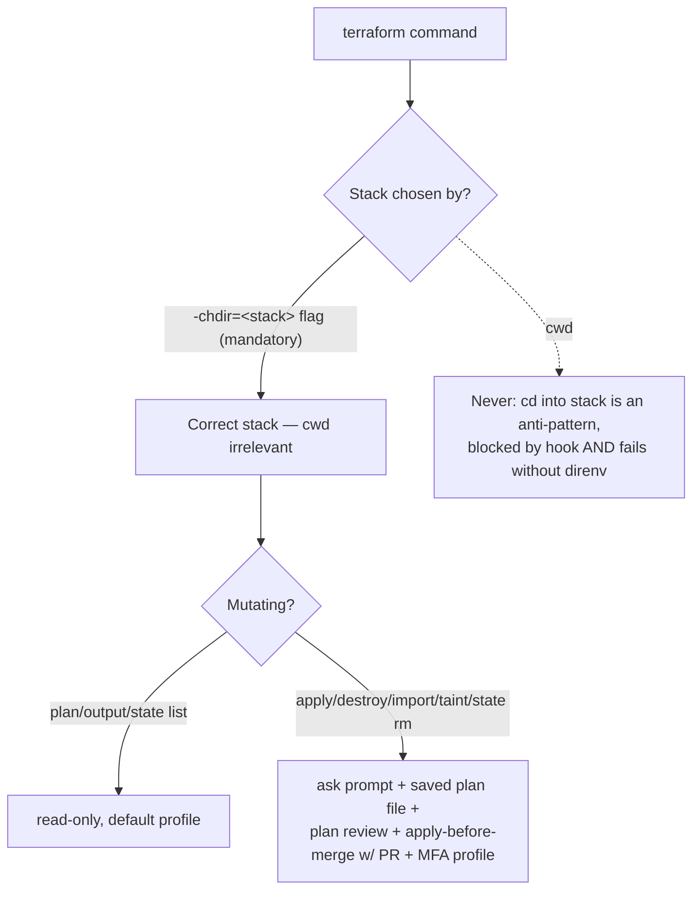

# PLAN: Remove `CLAUDE_BASH_MAINTAIN_PROJECT_WORKING_DIR=1` — adopt Claude Code's default working-directory carry-over

**Project:** dot-claude
**Status:** Done — executed; `CLAUDE_BASH_MAINTAIN_PROJECT_WORKING_DIR=1` removed from settings and the rationale baked into CLAUDE.md § Working Directory Behavior
**Date:** 2026-05-29 (planned) / by 2026-05-31 (executed)
**Source research:** `~/.claude/plans/completed/spike/working-dir-cwd-strategy/SPIKE.md` (Findings 1–8)
**Change class:** Claude Code configuration → MUST ship via PR (CLAUDE.md § Configuration Changes Policy; never edit `~/.claude/` directly)

---

## 1. Objective

Remove the `CLAUDE_BASH_MAINTAIN_PROJECT_WORKING_DIR=1` override so the main session uses Claude Code's default behavior: a `cd` carries over to later Bash commands while it stays inside the project / `additionalDirectories`, and auto-resets if it escapes that tree.

This delivers the engineer's goal — stay in the correct path in the main session — which:
- restores the **existing** RVM/bundle allow-list (the env-prefix acrobatics that defeat it disappear once `cd` is allowed — SPIKE Finding 8), and
- removes the daily friction between the reset regime and the no-`cd` rules.

---

## 2. Decision (from SPIKE, refined by the Terraform harness analysis)

Adopt **Option B (remove the variable)** with **no compensating anti-drift control required** — because the Terraform harness analysis (§3) shows the anti-drift the variable supposedly provided is already enforced at the command level and does not depend on cwd at all.

The SPIKE's earlier hedging (B1 "surface the stack in the `ask` prompt" / B2 "mandate `terraform -chdir`") is **superseded**: B2 already exists and is mandatory, so there is nothing new to add.

---

## 3. Harness analysis — Terraform anti-drift and the impact of removing the variable (centerpiece)

### 3.1 How Terraform actually runs today

The canonical command shape, mandatory per `TERRAFORM-CONVENTIONS.md:68-84` and `TERRAFORM-POLICY.md:3`:

```
direnv exec ~/Projects/4Shark/terraform terraform -chdir=<stack> <subcommand>
```

Two explicit, cwd-independent anchors on **every** command:
- `direnv exec ~/Projects/4Shark/terraform` — loads the repo `.envrc` (secrets) regardless of cwd. Bare `terraform` fails with provider auth errors, so a cwd-based shortcut **cannot succeed**.
- `terraform -chdir=<stack>` — names the target stack explicitly. The stack acted upon is determined by the flag, **not** by the working directory.

The repo holds ~30 sibling stacks (`identity`, `networking`, `dns`, `integrator-*`, `app-*`, `auth-001`, `setup`, …) all under `~/Projects/4Shark/terraform/`.

### 3.2 Why the variable contributes nothing to Terraform safety



The original justification for the variable — "the agent might `cd` into stack A, then `apply` while sitting in stack B" — is **impossible under the current convention**:
- The agent never `cd`s into a stack: `cd …/<stack> && terraform` is an explicit anti-pattern (`TERRAFORM-CONVENTIONS.md:91`), blocked by `validate-bash-command.sh`, and would fail anyway (no direnv env).
- Even a (now-allowed) standalone `cd` into a stack changes nothing: the terraform command still needs `direnv exec … -chdir=<stack>`, so cwd never selects the stack.

The actual Terraform safety model is: `-chdir` (correct stack) + `direnv exec` (self-enforcing against cwd shortcuts) + `ask` on mutating ops (`settings.json:432-437`) + mandatory saved plan file + structured plan review before apply + apply-before-merge with an open PR + MFA profile. **The cwd-reset variable is not part of this model.**

### 3.3 Impact of removing the variable on Terraform

**Zero.** Terraform commands are cwd-independent by construction. Removing the variable neither weakens nor strengthens any Terraform control. No compensating control is needed; `-chdir` already *is* the command-level anti-drift the SPIKE considered inventing.

### 3.4 Harness-maturity note

The engineer's observation that the harness is "much more controlled today" (SPIKE Finding 7) is corroborated structurally: the safety moved from a fragile cwd trap to explicit per-command flags and a multi-gate apply workflow. The variable is a vestigial control from an earlier, weaker convention.

---

## 4. Scope of change (coordinated edits)

| # | File | Change | Reason |
|---|------|--------|--------|
| 1 | `settings.json:8` | Remove the `CLAUDE_BASH_MAINTAIN_PROJECT_WORKING_DIR` env entry (leave `CLAUDE_AUTOCOMPACT_PCT_OVERRIDE`) | Adopt default carry-over |
| 2 | `scripts/validate-bash-command.sh:16-23, 111-130` | Keep blocking `cd <dir> && <cmd>` **chains**, but rewrite the rationale: the block is now purely command-safety / approval-fatigue (Command Safety Policy), NOT "the variable makes cd pointless". Standalone `cd` is now the sanctioned way to enter a project | Stop citing a removed variable; keep the chain guard |
| 3 | `CLAUDE.md § Working Directory Behavior` (+ mirror in repo `CLAUDE.md`) | Rewrite: cwd now persists within `~/Projects`/additional dirs; use a standalone `cd` to enter a project; escape hatches (`git -C`, `gh -R`, `BUNDLE_GEMFILE=<abs>`, `ruby -C`, absolute paths) remain REQUIRED for subagents and cross-repo one-offs (they never carry cwd) | Doc must match new reality |
| 4 | `CLAUDE.md § Ruby Version Manager in Bash` (+ mirror) | Update: with correct cwd, rbenv/asdf shims auto-resolve and `bundle exec <tool>` matches the existing allow-list; the `BUNDLE_GEMFILE=<abs>` + `ruby -C` acrobatics are no longer the default — keep them documented only as the cross-repo / subagent fallback. Note RVM auto-activation under correct cwd is UNVERIFIED (wrappers stay the safe path) | Capture the RVM ergonomics win honestly |
| 5 | `CHANGELOG.md` | Add an entry under `## [Unreleased]` (Changed) — e.g. "Working-directory handling for Bash commands" | Every feature branch updates the changelog |
| 6 | `TERRAFORM-CONVENTIONS.md:91` (optional, low priority) | The anti-pattern bullet says `cd … && terraform` is "blocked by validate-bash-command.sh"; still true (chain block stays). No edit needed unless wording references the variable — verify during execution | Keep terraform docs consistent |

**Explicitly NOT changing:**
- No new `permissions.allow` entries (the band-aid rejected in SPIKE Finding 8 — removing the variable restores the existing rules instead).
- No Terraform anti-drift control added (§3 — none needed).
- No subagent behavior change (subagents never carry cwd; escape hatches stay).

---

## 5. Execution phases (ordered)

1. **Branch** — from `develop` in the working copy `~/Projects/4Shark/dot-claude`: `feature/working-dir-default-carry-over` (or engineer's preferred name). Never edit `~/.claude/` directly.
2. **Edit settings.json** (scope #1) — remove the env entry. Run Pattern Priming against the file's existing structure before editing.
3. **Edit validate-bash-command.sh** (scope #2) — rewrite rationale comments, keep the `cd &&` regex block intact. Pattern Priming against the script's existing style.
4. **Rewrite the two CLAUDE.md sections** (scope #3, #4) — in BOTH the repo `CLAUDE.md` and confirm the global is deployed via the same file (they are the same content; the repo file is the source that deploys to `~/.claude`).
5. **Changelog** (scope #5) — entry under `## [Unreleased]`, succinct, past-tense subject only (no technical detail) per Changelog Policy.
6. **Verify terraform docs** (scope #6) — read `TERRAFORM-CONVENTIONS.md` for any stale reference to the variable; edit only if found.
7. **Commit** — single commit, Angular format, e.g. `chore(bash): adopt default working-directory carry-over`. No AI co-authorship.
8. **Push** with explicit refspec (`git push origin <branch>:refs/heads/<branch>`), set upstream, **open PR** targeting `develop`. PR title = commit message.
9. **Engineer merges** (never auto-merged). After merge, `/merge-cleanup`, then the engineer `git pull` in `~/.claude` to deploy.

---

## 6. Risks & residuals (honest)

- **Subagents unchanged** — every subagent-driven flow (spike, plan/task researcher+composer, pr-reviewer, DDD) still needs `git -C` / `BUNDLE_GEMFILE=<abs>` / `ruby -C` / absolute paths. This change is main-session-only (SPIKE Finding 4). Acceptable and documented in scope #3.
- **Env vars never persist** — `BUNDLE_GEMFILE=<abs>` inline prefix is still mandatory for cross-repo one-offs; only disappears when the agent `cd`s into that repo first (SPIKE Finding 4).
- **RVM auto-activation under correct cwd is UNVERIFIED** (SPIKE Finding 5) — rbenv/asdf shims are a clear win; RVM may still need the wrappers. Scope #4 documents wrappers as the safe path; no claim is made that RVM auto-activates. Optional follow-up: a one-line empirical test (`cd` into an RVM project, run `ruby -v`, check gemset) before relying on bare `bundle`.
- **Terraform** — no residual (§3).

---

## 7. Acceptance criteria

- `grep MAINTAIN_PROJECT_WORKING_DIR settings.json` returns nothing.
- `validate-bash-command.sh` still blocks `cd foo && bar` (chain) and no longer references the removed variable in its rationale.
- Both CLAUDE.md sections describe the carry-over model; no sentence asserts "cwd resets after every command".
- CHANGELOG has an `## [Unreleased]` Changed entry.
- After deploy, in a fresh session: a standalone `cd ~/Projects/4Shark/integrator` followed (next tool call) by `~/.rvm/wrappers/<ruby>@integrator/bundle exec rubocop --version` runs **without** a permission prompt (matches `Bash(~/.rvm/wrappers/*/bundle:*)`), confirming Finding 8's predicted win.

---

## 8. References

- SPIKE: `~/.claude/plans/active/spike/working-dir-cwd-strategy/SPIKE.md`
- `settings.json:8` (env var), `:264-281` (rvm wrapper allow rules), `:432-437` (terraform mutating in `ask`)
- `scripts/validate-bash-command.sh:16-23, 111-130` (`cd &&` block + rationale)
- `docs/TERRAFORM-CONVENTIONS.md:68-91` (`direnv exec` + `-chdir` mandate, anti-patterns), `docs/TERRAFORM-POLICY.md:3`
- Claude Code docs: [Tools reference — Bash tool behavior](https://code.claude.com/docs/en/tools-reference), [Environment variables](https://code.claude.com/docs/en/env-vars), [Configure permissions](https://code.claude.com/docs/en/permissions)
