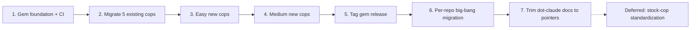

# PLAN — rubocop-fourshark: shared custom-cops gem

## Status — 2026-05-30

Phases 1–6 are **complete**. The gem is published to **RubyGems at `0.2.3`** — it went fully public + published, not the private/git-source model originally scoped. Adopted in **5 repos**: onboarding, setup, integrator, lambda, app — one more than the 4 originally listed (lambda added).

**Cops shipped** — names differ from the provisional ones used below (the "no rename" decision in the Decisions table was reversed during the build; cops were renamed to clearer names):

| Provisional name (this plan) | Shipped name |
|---|---|
| `Rails/AssociationInverseOf` | `Rails/MandatoryInverseOf` |
| `RSpec/AssociationInverseOf` | `RSpec/InverseOfMatcher` |
| `Rails/BidirectionalAssociations` | `Rails/BidirectionalAssociation` |
| `Layout/MultiLineBlockSpacing` | `Layout/MultilineStatementSpacing` |
| `RSpec/LetNotInContext` | `RSpec/OverwrittenLet` |
| `RSpec/NoConditionalInLet` | `RSpec/ConditionalInLet` |
| `RSpec/NoFactoryBotInBefore` | `RSpec/FactoryBotInBefore` |
| `FactoryBot/NoAssociationsInFactory` | `FactoryBot/AssociationInFactory` |
| `Rails/AlphabeticalMacros` (borderline) | `Rails/OrderedMacros` (built, through-aware) |

`Style/DisallowSafeNavigation`, `Style/DisallowTry`, `Rails/OptionalBelongsTo` shipped under their planned names.

**Two cop bugfixes surfaced by the `app` adoption** (both released):
- `0.2.2` — `RSpec/InverseOfMatcher`: skip polymorphic associations; classify a nested class by its own superclass (a root nested inside a wrapper class was misread as an STI subclass).
- `0.2.3` — `Rails/OrderedMacros`: `:through` associations sorted as a separate trailing group (a `:through` must be declared after its target association).

**Remaining:** Phase 7 (trim `dot-claude` docs to pointers). Phase 8 (stock-cop standardization) stays deferred.

The detail below is the original plan as authored — kept for rationale/criteria; superseded by this Status block where they disagree.

## Context

4Shark convention rules for Ruby/Rails/RSpec are enforced today as **prose docs** in `dot-claude` plus **copy-pasted cops** in `lib/rubo_cop/` across some backend repos. The copy-paste model has already broken:

- `Style/DisallowSafeNavigation` + `Style/DisallowTry` are duplicated as separate file copies in `app`, `integrator`, `setup`.
- `onboarding` has **none** — those rules silently do not run there.
- `Rails/AssociationInverseOf` (×2 Rails+RSpec) and `Rails/BidirectionalAssociations` live **only in `app`**.

A levantamento found **~16 cops** in the family (5 existing + 11 new AST-feasible). At that scale, copy-paste is untenable. Decision: ship a shared gem. The repo `4shark/rubocop-fourshark` is **already created (private) and scaffolded** via `rubocop-extension-generator`.

The end goal closes the original thread: once a rule is a cop, the corresponding `dot-claude` doc shrinks to a pointer — syntax leaves the docs and is enforced mechanically by RuboCop.

## Decisions (locked)

| Decision | Choice | Rationale |
|---|---|---|
| Gem name | `rubocop-fourshark` | Community convention `rubocop-<name>` |
| Gem shape | **Umbrella**: `rubocop-fourshark` declares the upstream plugins (`rubocop-rails`, `-rspec`, `-rspec_rails`, `-performance`, `-factory_bot`, `-graphql`) as **gem dependencies**, ships 4Shark's custom cops (in stock departments) + a unified `config/default.yml` | Consuming repos drop those gems from the Gemfile (one dep brings all) and inherit one config |
| Department/namespace | **Cops keep their natural stock departments** — `Rails/`, `RSpec/`, `Style/`, `FactoryBot/`, `Layout/` — with their existing names (no rename, no migration). The two `AssociationInverseOf` coexist (`Rails/` vs `RSpec/`). The gem's own wrapper module is `RuboCop::FourShark` (cosmetic; `4Shark` impossible — a Ruby constant can't start with a digit) | Same names work (different departments → no clash); simplest migration. Trade-off: a future upstream cop of the same name could clash (rubocop#5251) — 4Shark's names are distinct today |
| Loading in repos | Each repo's `.rubocop.yml` lists the plugins itself (`plugins:`/`require:`) — lint_roller has **no transitive plugin activation** (verified), so the umbrella does not auto-activate them | Manual listing accepted; the umbrella's value is the single Gemfile dependency + shared config, not auto-activation |
| Distribution | **DONE differently than scoped:** repo is **public** and the gem is **published to RubyGems** (`gem 'rubocop-fourshark', require: false` in each Gemfile, version resolved from RubyGems). MIT license in place. The git-source tag-pin model originally scoped was not used — it went straight to RubyGems publish | Engineer chose full publish; supply-chain (min-release-age) now applies via the normal RubyGems flow |
| `Gemfile.lock` | Committed | Modern Bundler convention (flipped from the old "gems gitignore it") — reproducible CI, traceable deps |
| `config/default.yml` | Unified config: enables the 4Shark custom cops (in their stock departments) + centralizes the ~8 shared stock-cop settings | One config source across all repos; consuming repos `inherit_gem` it |
| Release model (gem repo) | `main` + feature branches; tags cut from `main`; **no HubFlow** (low-volume OSS-style project). Consuming repos pin the **tag** in their Gemfile | Established 4Shark tag-based releases, minus HubFlow's `release/*` branches which this repo does not need |
| Autocorrect | Detection-only by default; safe autocorrect only on the mechanical cops (`AlphabeticalMacros`, `AlphabeticalLet`, `MultiLineBlockSpacing`) | The semantic bans (`unless`/`&.`/`try`) need a human-judged fix the cop cannot infer |
| Adoption model | **Big-bang per repo**: one PR adds the gem with **all cops active** and **fixes every offense in the same PR**. No incremental per-cop enable, **no `.rubocop_todo.yml`** | Engineer directive; each repo gets one coherent change, build green at merge, nothing masked |

## Cop inventory (~16)

### Existing — migrate from `app/lib/rubo_cop` into the gem (5)
| Cop | Rule | Currently in |
|---|---|---|
| `Style/DisallowSafeNavigation` | no `&.` (NO-SAFE-NAVIGATION) | app, integrator, setup |
| `Style/DisallowTry` | no `try`/`try!` | app, integrator, setup |
| `Rails/AssociationInverseOf` | association needs `inverse_of` | app only |
| `RSpec/AssociationInverseOf` | spec-side | app only |
| `Rails/BidirectionalAssociations` | both sides declared (cross-file) | app only |

### New cops — re-evaluated: absolute rule (cop) vs judgment rule (stays in docs)

**Criterion (learned from `DisallowUnless`):** a rule becomes a cop ONLY if it is *absolute* — there is no legitimate case where the banned/required form is the right call. A rule of the shape "prefer X, except when judgment says Y" is NOT cop-able and stays in the docs / CLAUDE.md — which is exactly why it lived there. A cop on a judgment rule blocks the legitimate exceptions (and, for `unless`, trips the `return unless` cop idiom too).

#### Cop-able — absolute (build) (6)
| Cop | Rule / source doc | Status |
|---|---|---|
| `Rails/OptionalBelongsTo` | always `optional: true` + manual validation (OPTIONAL-BELONGS-TO) | written (this branch) — confirm it's truly absolute |
| `Layout/MultiLineBlockSpacing` | blank line around multi-line statements (CODE-STYLE-RULES) | to build |
| `RSpec/LetNotInContext` | `let` only at top level (RSPEC) | to build |
| `RSpec/NoConditionalInLet` | no `if`/`case` in `let` (RSPEC) | to build — FP tuning |
| `RSpec/NoFactoryBotInBefore` | no `create`/`build` in `before` (FACTORYBOT/RSPEC) | to build — FP tuning |
| `FactoryBot/NoAssociationsInFactory` | no association calls in a `factory` block (FACTORYBOT) | to build |

#### NOT cop-able — judgment rules → stay in docs / CLAUDE.md (4)
| Rule (was) | Legitimate exception a hard cop would break |
|---|---|
| `unless` ban (`Style/DisallowUnless`) | `unless` is the correct tool for genuine "do X unless Y-exception" semantics (~2%). 98% should be `if`, but a hard ban breaks the 2% and trips the `return unless` cop idiom. **Killed.** |
| `let` alphabetical (`RSpec/AlphabeticalLet`) | the doc itself requires dependent `let`s to follow dependency order, not alphabet — extremely common in specs. A naive cop misfires constantly. |
| multiple `raise ArgumentError` (`Rails/NoMultipleArgumentErrorRaise`) | wrong in AR-validation context (use `errors.add`), but legitimate in plain Ruby methods. The cop can't tell the context. |
| AR bang in web flow (`Rails/BangMethodInWebFlow`) | the Rails doc allows a bang "if handled"; a cop can't detect whether the exception is rescued, so it over-blocks. (Claude is still guarded by the dot-claude PreToolUse hook — an AI guardrail, not a universal cop.) |

#### Borderline — engineer call
| `Rails/AlphabeticalMacros` | associations/validations/scopes alphabetical is mostly mechanical, but the doc allows "logical grouping when order conveys meaning" → occasional false flags. Cop-able (the `rubocop-rails-order_model_macros` gem proves it) but not exception-free. |

### Stock-cop centralization — DEFERRED to standardization (second level, post-release)
NOT part of v0.1.0. The release ships the gem with the custom cops only (existing + new); each repo keeps its own stock-cop config as-is. Centralizing shared stock settings into the gem's `config/default.yml` is a later standardization pass.

The PLAN's original "~8 cops to centralize" list was stale — verified against the live repo configs (2026-05-29): 6 of the 8 appear in NO repo (they were proposed in planning, never adopted); only `Layout/LineLength` (150) and `Rails/SkipsModelValidations` (`Enabled: false`, not "warning") are real. The genuinely-shared set is ~18 cops identical across all 4 repos plus ~15 divergent/partial. When standardization is picked up, re-derive the set from the live `.rubocop.yml` files — do not trust any pre-written list.

### Out of scope — stay as docs (semantic, no cop)
Variable naming "no abbreviations / name describes content"; FactoryBot build-vs-create judgment; RSpec doctrine (before=actions/it=assertions, DAMP, no `let(:expected)`); the *rationale* behind each Rails rule; the TS `?.` side (ESLint, not RuboCop).

## Phases

1. **Gem foundation + CI** — scaffold (done); add the upstream plugins (`rubocop-rails`, `-rspec`, `-rspec_rails`, `-performance`, `-factory_bot`, `-graphql`) as `add_dependency` in the gemspec; GitHub Actions running the cop specs + `rubocop-internal_affairs`; `config/default.yml` skeleton; README. *Done when:* CI green.
2. **Migrate the 5 existing cops** into the gem keeping their stock departments — `lib/rubocop/cop/{style,rails,rspec}/<name>.rb`, classes stay `RuboCop::Cop::Style::DisallowSafeNavigation` etc. (no rename), each with a cop spec (`expect_offense`/`expect_no_offenses`) + `config/default.yml` entry. *Done when:* 5 cops + specs pass.
3. **Easy new cops** — `Rails/OptionalBelongsTo` (written; `DisallowUnless` was dropped — judgment rule). *Done when:* cop+spec+config, pass.
4. **Remaining cop-able new cops** — `Layout/MultiLineBlockSpacing`, `RSpec/LetNotInContext`, `RSpec/NoConditionalInLet`, `RSpec/NoFactoryBotInBefore`, `FactoryBot/NoAssociationsInFactory` (+ `Rails/AlphabeticalMacros` pending engineer call). Tune the RSpec/before-sensitive ones for false positives. The 4 judgment rules (unless, alphabetical-let, multiple-raise, bang-in-web-flow) are NOT built — they stay in docs. *Done when:* each cop+spec+config, pass.
5. **Release the gem** — all cop-able cops (5 existing + new) are in `main`. Flip the repo to public (`gh repo edit 4shark/rubocop-fourshark --visibility public --accept-visibility-change-consequences`), cut `v0.1.0` from `main`, and **publish to RubyGems** (`gem push` / `rake release`). *Done when:* repo public, tag exists, gem is on RubyGems, repos can depend on the published version.
6. **Per-repo big-bang migration** — one PR per repo (`app`, `integrator`, `onboarding`, `setup`), one procedure + a per-repo specifics table (per Planning Documents Discipline): in the **Gemfile**, add `gem 'rubocop-fourshark'` (RubyGems, version-pinned, e.g. `'~> 0.1'`); in **`.rubocop.yml`**, add `rubocop-fourshark` to `plugins:` (auto-loads the gem's `config/default.yml` → activates the custom cops; lint_roller has no transitive activation, so the existing upstream plugins stay listed); remove the `require: ./lib/rubo_cop/...` lines and delete the copied `lib/rubo_cop/`; **keep the repo's existing stock-cop config as-is**; **fix every new-cop offense in the same PR** (safe autocorrect first, then hand-fix the rest). *Done when:* `bundle exec rubocop` is green on each repo. (Gemfile dedup of the individual `rubocop-*` plugin gems + unified-config `inherit_gem` = deferred to standardization.)
7. **Trim `dot-claude` docs to pointers** — one PR: for each delegated rule, shrink its doc to a pointer ("enforced by `rubocop-fourshark` → `<Department>/<Cop>`"); keep the semantic/judgment parts. *Done when:* docs no longer duplicate cop-enforced syntax.

### Deferred — stock-cop standardization (second level, post-release)
Centralize the stock-cop settings shared across repos into the gem's `config/default.yml` (repos then `inherit_gem` one source) + dedup the individual `rubocop-*` plugin gems from each Gemfile. Not part of v0.1.0. Re-derive the shared set from the live `.rubocop.yml` files when picked up (see "Stock-cop centralization — DEFERRED" above).

## Risks

- **False positives** on `NoFactoryBotInBefore` / `NoConditionalInLet` → ship detection-only first, tune before enabling.
- **`OptionalBelongsTo` redundancy** → a global `belongs_to_required_by_default = false` may already cover it; verify before writing the cop.
- **Big-bang PR size** → turning all cops on at once means each repo's migration PR also carries every fix. Mitigate with safe autocorrect first (mechanical cops), then hand-fix the rest; keep the diff reviewable. No `.rubocop_todo.yml`.

## Open questions (engineer)

None — all resolved. RubyGems publish is **done** (gem live at `0.2.3`, public repo, MIT license in place). The only remaining work is **Phase 7** (trim `dot-claude` docs to pointers); **Phase 8** (stock-cop standardization) stays deferred.
