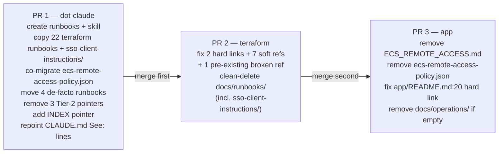

# PLAN — Runbook Centralization

> Reference: derived from PLAN-SPIKE.md (REVISION 2, 2026-06-03); auxiliaries: link-drift-audit.txt (regenerated from origin/develop, 2026-06-03), skill-structure-findings.txt

## Objective

Move all 4Shark operational runbooks — currently scattered across `terraform/docs/runbooks/` (22 files on origin/develop), `app/docs/operations/` (1 runbook + 1 policy JSON), and de-facto runbooks embedded in `dot-claude/docs/` (4 files) — into a single canonical home at `~/.claude/docs/runbooks/` (working copy: `~/Projects/4Shark/dot-claude/docs/runbooks/`). Provide a new `/runbook` skill that lets Claude Code find and follow the right runbook on demand. The canonical home is dot-claude because it is the only repository available in every Claude Code session regardless of which project is open. Runbooks are loaded Tier 3 (filesystem-discovered, never auto-injected) so they do not inflate the context window on every session start.

## Scope

### In scope

- Create `~/.claude/docs/runbooks/` with the 10-category structure (27 runbook .md files + 1 supporting .json, enumerated below)
- Create `~/.claude/docs/runbooks/INDEX.md` — one line per runbook: title, relative path, trigger keywords
- Create `~/Projects/4Shark/dot-claude/skills/runbook/SKILL.md` — the `/runbook` skill definition
- Add a single always-on pointer to `INDEX.md` in `read-context.sh` (one new Tier 2 entry mirroring the existing pointer shape in that file — e.g., `"Read ~/.claude/docs/runbooks/INDEX.md BEFORE following any operational procedure"`)
- Remove the three now-redundant Tier-2 pointers from `read-context.sh` for `HUBFLOW.md`, `SEARCHING-ACCOUNT-EVENTS.md`, and `1PASSWORD-WSL2-SETUP.md`
- Repoint all `CLAUDE.md` "See:" references for the four moved files to their new `docs/runbooks/<category>/` paths
- Repoint `AWS-MFA.md:16,240` and `IDENTITY-STACK.md:5` to the new dot-claude paths (source: `link-drift-audit.txt` — dot-claude section)
- Update the Repository Structure listing in `CLAUDE.md` to reflect `docs/runbooks/` and the new `skills/runbook/` entry
- Add `/runbook` to the CLAUDE.md "Available Commands" section
- Update `CHANGELOG.md` in dot-claude
- Fix the 2 hard-link 404s and 6 soft refs in the terraform repo (per link-drift-audit.txt)
- Fix the pre-existing broken reference at `terraform/modules/ami_versions/README.md:72`
- Clean-delete `terraform/docs/runbooks/` (no breadcrumb, no stubs) — including the nested `sso-client-instructions/` subdirectory (all files migrate)
- Remove `app/docs/operations/ECS_REMOTE_ACCESS.md` and `app/docs/operations/ecs-remote-access-policy.json`; remove `app/docs/operations/` if empty after both removals
- Fix `app/README.md:20` — hard link that becomes a 404 after the app runbook is removed (source: `link-drift-audit.txt:112-116`)

### Out of scope

- Adding a `check_trigger` entry to `inject-skill-tip.sh` for proactive `/runbook` surfacing — the skill is fully functional without it; this is a deferred follow-up
- Loading individual runbook bodies at session start (Tier 1 or Tier 2 injection) — bodies are Tier 3 by design
- Any restructuring of the `dot-claude/docs/` flat layout for non-runbook docs

## Chosen approach

**Direction:** Preserve the terraform 8-category folder structure verbatim, add two new categories (`development/` and `compliance/`) for the de-facto dot-claude runbooks, place the app runbook under the existing `engineer-access/` category, migrate the SSO client-instruction files with the nested subfolder intact, and co-migrate `ecs-remote-access-policy.json` alongside the app runbook.

**Rationale (from engineer):** The 8-category tree is already known and referenced in engineer memory, CHANGELOG history, and ADR prose. Preserving it eliminates cognitive overhead and keeps cross-runbook relative links intact (the `migrations/` VPC relative link at `VPC-DECOMMISSION-CHECKLIST.md:75` stays valid). New categories are added only where the de-facto runbooks need them — two new categories (`development/`, `compliance/`) rather than forcing existing runbooks into ill-fitting buckets.

**Decision: SSO client-instruction files (engineer locked — Option a):** The 4 files in `client-onboarding/sso-client-instructions/` are client-facing templates (Language Policy Category 2: "Send this to the client... paste it into email or a ticket as-is" — source: `PLAN-SPIKE.md` SSO Open Decision, verbatim from `git show origin/develop:...ENTRA-OIDC.md` lines 1–8). Decision: migrate them WITH `ADD-SSO-CLIENT.md`, preserving the nested subfolder `client-onboarding/sso-client-instructions/` inside the runbook home. They are supporting files of the SSO onboarding runbook; the Category-2 classification governs their language, not their location. The relative links in `ADD-SSO-CLIENT.md:185-188` stay valid because both move together — no link edit needed for those.

**Decision: ecs-remote-access-policy.json (engineer locked — Option a):** Co-migrate `ecs-remote-access-policy.json` into `engineer-access/` alongside `ECS-REMOTE-ACCESS.md`, keeping the relative link in the runbook valid. It remains an applicable .json file (not inlined). Source: `link-drift-audit.txt:118-125` — `app/docs/operations/ECS_REMOTE_ACCESS.md:73` references `ecs-remote-access-policy.json` via a relative link.

**Decision: App runbook placement:** `ECS-REMOTE-ACCESS.md` goes into `engineer-access/` (renamed from `ECS_REMOTE_ACCESS.md`). Rationale (from engineer): `engineer-access/` is the natural home for console/SSH access procedures; creating a new one-file category would add noise.

**Decision: De-facto runbooks become real runbooks:** `HUBFLOW.md`, `LGPD-DATA-ERASURE.md`, `SEARCHING-ACCOUNT-EVENTS.md`, and `1PASSWORD-WSL2-SETUP.md` move from `docs/` into `docs/runbooks/<category>/`. Their three Tier-2 pointers in `read-context.sh` (HUBFLOW, SEARCHING-ACCOUNT-EVENTS, 1PASSWORD-WSL2-SETUP — LGPD has no pointer there) are removed. The always-on POLICY/RULE sections in CLAUDE.md (HubFlow Policy, LGPD Data Erasure, Searching Account Events, Git Safety, etc.) stay in CLAUDE.md — they are rules, not runbooks. Only their "See:" lines are repointed to the new paths.

**Decision: Terraform cleanup:** Clean deletion of `terraform/docs/runbooks/` including the now-empty `sso-client-instructions/` subdirectory. No breadcrumb, no stubs. All link drift fixed in the same PR before deletion.

**Decision: inject-skill-tip.sh:** No changes. Single awareness mechanism only: the INDEX always-on pointer plus the skill itself.

**Decision: Sourcing rule:** All canonical file content comes from `origin/develop` of each repo. The terraform working copy is on `feature/strip-enrich-and-filter` (a divergent branch). Worktrees for all three PRs must be based on `origin/develop`: `git worktree add <path> -b <feature-branch> origin/develop`. Source file content via the develop-based worktree or `git show origin/develop:<path>`.

**Source patterns referenced:**
- `git -C ~/Projects/4Shark/terraform ls-tree -r --name-only origin/develop -- docs/runbooks/` — verified 22 files (source: `PLAN-SPIKE.md` CORRECTION NOTICE)
- `~/Projects/4Shark/dot-claude/skills/post-mortem/SKILL.md:1-4` — YAML frontmatter pattern (name, description)
- `~/Projects/4Shark/dot-claude/skills/integration-debug/SKILL.md:1-6` — skill role declaration + mandatory context loading pattern
- `~/Projects/4Shark/dot-claude/scripts/auto-approve-local-skills.sh:53-56` — filesystem-based auto-approval: `[ -f "${claude_root}/skills/${skill_name}/SKILL.md" ]`; no settings.json registration needed
- `~/Projects/4Shark/dot-claude/scripts/read-context.sh:84-191` — Tier 1/2 lists; `docs/runbooks/` bodies must NOT appear here (Tier 3)
- `~/Projects/4Shark/dot-claude/settings.json:221-228` — `"matcher": "Skill"` PreToolUse hook already wired; no new registration needed

## Final runbook structure (27 runbook .md files + 1 supporting .json, 10 categories)

```
~/.claude/docs/runbooks/
├── INDEX.md
├── client-onboarding/
│   ├── ADD-INTEGRATOR-CLIENT.md
│   ├── ADD-SSO-CLIENT.md
│   └── sso-client-instructions/              ← nested subfolder, migrated intact
│       ├── ENTRA-OIDC.md
│       ├── ENTRA-SAML.md
│       ├── GOOGLE-OIDC.md
│       └── GOOGLE-SAML.md
├── compliance/                               ← NEW category (from dot-claude)
│   └── LGPD-DATA-ERASURE.md
├── databases/
│   ├── MONGODB-ATLAS-AUTH.md
│   ├── MONGODB-REPLICA-SET-MIGRATION.md
│   └── MONGOSYNC-DISABLE-VERIFICATION.md
├── development/                              ← NEW category (from dot-claude)
│   └── HUBFLOW.md
├── engineer-access/
│   ├── 1PASSWORD-WSL2-SETUP.md              ← from dot-claude
│   ├── AWS-ENGINEER-SETUP.md
│   ├── BREAK-GLASS.md
│   ├── ECS-REMOTE-ACCESS.md                 ← from app (renamed from ECS_REMOTE_ACCESS.md)
│   └── ecs-remote-access-policy.json        ← co-migrated from app (supporting file, not a runbook)
├── migrations/
│   ├── VPC-CROSS-VPC-CONNECTIVITY.md
│   ├── VPC-DECOMMISSION-CHECKLIST.md
│   ├── VPC-DEPOSED-SG-DEPENDENCY.md
│   └── VPC-DESIRED-COUNT-ZERO.md
├── security/
│   ├── PENTEST-ACTIVATION.md
│   └── SEARCHING-ACCOUNT-EVENTS.md          ← from dot-claude
├── services/
│   └── AUTH-001-KEYCLOAK.md
├── terraform-operations/
│   ├── AMI-VERSION-UPGRADE.md
│   ├── EMERGENCY-SINGLE-STACK-APPLY.md
│   └── STATE-RECOVERY.md
└── vpn/
    ├── AZURE-SQL-VPN-OVERRIDE.md
    └── PRITUNL-VPN-OPERATIONS.md
```

## Awareness mechanism

**Single always-on pointer:** One new entry is added to `read-context.sh` in the Tier 2 section, mirroring the existing pointer shape used in that file. The entry points only to `~/.claude/docs/runbooks/INDEX.md` (the catalog), not to any individual runbook body. This is how Claude knows the universe of mapped processes exists without loading any body. Tier 3 bodies are filesystem-discovered at invocation time via the `/runbook` skill.

**Pointer is NOT added to individual runbook files.** The INDEX catalog is the single entry point.

## `/runbook` skill behavior

- Invoked as `/runbook <text>`
- On invocation: Claude reads `~/.claude/docs/runbooks/INDEX.md` and matches the engineer's text against it
- **Exactly one match:** follow that runbook directly — read the file and walk the engineer through it
- **Multiple matches:** present the candidate list and let the engineer choose before following any runbook (consistent with the team's "Exact Match Wins" rule — single exact match executes directly; ambiguity surfaces candidates)
- **No match:** report that no runbook exists for the text and suggest browsing `INDEX.md` directly
- The skill loads ONE matched runbook body at a time — never all candidates simultaneously — to keep context weight low
- Skill file: `~/Projects/4Shark/dot-claude/skills/runbook/SKILL.md`; no bundled scripts needed (pure-text workflow per skill-structure-findings.txt)
- Auto-approval: handled by the existing `auto-approve-local-skills.sh` hook via filesystem check (`~/.claude/skills/runbook/SKILL.md`) — no `settings.json` change required

## Execution phases

### Phase 1: dot-claude PR

**Objective:** Establish the new canonical home with all 27 runbooks and the `/runbook` skill before any source is removed elsewhere.

**Work happens in a dedicated git worktree** for the feature branch off `origin/develop` in `~/Projects/4Shark/dot-claude/`. Direct edits to `~/.claude/` are not permitted per the Configuration Changes Policy. Worktree command: `git worktree add <path> -b <feature-branch> origin/develop`.

**Components:**

- `docs/runbooks/` tree: create the 10-category directory structure; copy the 18 standard terraform runbooks from origin/develop; copy the nested `sso-client-instructions/` subfolder with its 4 files; copy/rename `ECS_REMOTE_ACCESS.md` → `ECS-REMOTE-ACCESS.md`; co-migrate `ecs-remote-access-policy.json` into `engineer-access/`; move the 4 de-facto dot-claude runbooks (`HUBFLOW.md`, `LGPD-DATA-ERASURE.md`, `SEARCHING-ACCOUNT-EVENTS.md`, `1PASSWORD-WSL2-SETUP.md`) into their categories
- `docs/runbooks/INDEX.md`: create with one entry per runbook — title, relative path from `runbooks/`, trigger keywords (the 4 SSO client-instruction files in `sso-client-instructions/` are listed as supporting templates, not as primary runbook entries)
- `skills/runbook/SKILL.md`: create with YAML frontmatter (`name: runbook`), role declaration, INDEX load instruction, match-then-follow logic (single exact → follow; multiple → present candidates)
- `scripts/read-context.sh`: add one Tier 2 pointer to `INDEX.md`; remove the three now-redundant Tier-2 pointers for `HUBFLOW.md`, `SEARCHING-ACCOUNT-EVENTS.md`, and `1PASSWORD-WSL2-SETUP.md`
- `CLAUDE.md`: repoint "See:" lines for HUBFLOW (HubFlow Policy section), LGPD-DATA-ERASURE (LGPD Data Erasure section), SEARCHING-ACCOUNT-EVENTS (Searching Account Events section), and 1PASSWORD-WSL2-SETUP (any reference) to the new `docs/runbooks/<category>/` paths; update the Repository Structure listing to include `docs/runbooks/` and `skills/runbook/`; add `/runbook` to the "Available Commands" section
- `docs/AWS-MFA.md:16,240`: update both cross-repo references from the old terraform path to `~/.claude/docs/runbooks/engineer-access/AWS-ENGINEER-SETUP.md` (source: `link-drift-audit.txt:131-139`)
- `docs/IDENTITY-STACK.md:5`: update from the terraform path to `~/.claude/docs/runbooks/engineer-access/BREAK-GLASS.md` (source: `link-drift-audit.txt:141-144`)
- `CHANGELOG.md`: add `### Added` entry for runbook centralization

**Dependencies:** None. This phase is self-contained.

**Success criteria:**
- [ ] `~/.claude/docs/runbooks/` exists with all 10 categories, 27 runbook .md files, and `ecs-remote-access-policy.json` in `engineer-access/`
- [ ] `~/.claude/docs/runbooks/client-onboarding/sso-client-instructions/` exists with all 4 client-instruction files
- [ ] `~/.claude/docs/runbooks/INDEX.md` lists all 27 runbooks
- [ ] `~/.claude/skills/runbook/SKILL.md` exists and the skill invokes without a permission prompt
- [ ] `read-context.sh` has the INDEX pointer and the three removed entries are gone
- [ ] All `CLAUDE.md` "See:" lines for the four moved files point to `docs/runbooks/`
- [ ] `AWS-MFA.md` and `IDENTITY-STACK.md` cross-repo references updated
- [ ] PR merged before Phase 2 begins

---

### Phase 2: terraform PR

**Objective:** Fix all link drift in the terraform repo, then clean-delete `terraform/docs/runbooks/`.

**Work happens in a dedicated git worktree** for the feature branch off `origin/develop` in `~/Projects/4Shark/terraform/`. Worktree command: `git worktree add <path> -b <feature-branch> origin/develop`. Do NOT use the working copy (on `feature/strip-enrich-and-filter`).

**Components — link drift fixes (all must be applied before deletion):**

Hard links (will become 404 after deletion — fix first):

| File | Line | Current target | Fix |
|------|------|----------------|-----|
| `terraform/SECURITY.md` | 31 | `docs/runbooks/engineer-access/BREAK-GLASS.md` | Update to `~/.claude/docs/runbooks/engineer-access/BREAK-GLASS.md` |
| `terraform/identity/README.md` | 27 | `../docs/runbooks/engineer-access/BREAK-GLASS.md` | Update to `~/.claude/docs/runbooks/engineer-access/BREAK-GLASS.md` |

Soft refs (prose path citations):

| File | Line | Current path | Fix |
|------|------|--------------|-----|
| `terraform/README.md` | 237 | `docs/runbooks/` | Update to `~/.claude/docs/runbooks/` |
| `terraform/identity/README.md` | 175 | `docs/runbooks/engineer-access/AWS-ENGINEER-SETUP.md` | Update to `~/.claude/docs/runbooks/engineer-access/AWS-ENGINEER-SETUP.md` |
| `terraform/docs/adr/ADR-002-terramate.md` | 43 | `docs/runbooks/terraform-operations/EMERGENCY-SINGLE-STACK-APPLY.md` | Update to `~/.claude/docs/runbooks/terraform-operations/EMERGENCY-SINGLE-STACK-APPLY.md` |
| `terraform/docs/adr/ADR-004-identity-model.md` | 48 | `docs/runbooks/engineer-access/BREAK-GLASS.md` | Update to `~/.claude/docs/runbooks/engineer-access/BREAK-GLASS.md` |
| `terraform/docs/adr/ADR-005-ecs-multi-cluster-pattern.md` | 91 | `docs/runbooks/client-onboarding/ADD-INTEGRATOR-CLIENT.md` | Update to `~/.claude/docs/runbooks/client-onboarding/ADD-INTEGRATOR-CLIENT.md` |
| `terraform/docs/adr/ADR-001-state-backend.md` | 41 | `docs/runbooks/terraform-operations/STATE-RECOVERY.md` | Update to `~/.claude/docs/runbooks/terraform-operations/STATE-RECOVERY.md` |
| `terraform/dns/security_locals.tf` | 2 | `docs/runbooks/security/PENTEST-ACTIVATION.md` | Update comment to `~/.claude/docs/runbooks/security/PENTEST-ACTIVATION.md` |

Pre-existing broken reference (fix in this PR regardless of migration):

| File | Line | Issue | Fix |
|------|------|-------|-----|
| `terraform/modules/ami_versions/README.md` | 72 | Points to `docs/runbooks/ami-version-upgrade.md` (flat path, never existed); actual file was at `terraform-operations/AMI-VERSION-UPGRADE.md` | Update to `~/.claude/docs/runbooks/terraform-operations/AMI-VERSION-UPGRADE.md` |

Not requiring fix (document as "no action"):

| File | Line | Reason |
|------|------|--------|
| `terraform/CHANGELOG.md` | 152 | Historical prose entry in a changelog — not a navigable hyperlink; records what was announced at the time. Do not alter changelog history. |

- Clean-delete `terraform/docs/runbooks/` after all link fixes above are committed. This includes the `client-onboarding/sso-client-instructions/` nested subdirectory (all files migrated in Phase 1).

**Dependencies:** Phase 1 PR must be merged. Runbooks must exist in dot-claude before they are removed from terraform.

**Success criteria:**
- [ ] All 10 entries in the link-drift table above are updated (2 hard links + 7 soft refs + 1 pre-existing broken ref)
- [ ] `terraform/docs/runbooks/` directory does not exist after the PR merges (including `sso-client-instructions/`)
- [ ] No remaining references to `docs/runbooks/` within the terraform repo point to local files
- [ ] PR merged before Phase 3 begins

---

### Phase 3: app PR

**Objective:** Remove the migrated app runbook and its sibling JSON file, fix the hard link in app README, and clean up the `app/docs/operations/` directory.

**Work happens in a dedicated git worktree** for the feature branch off `origin/develop` in `~/Projects/4Shark/app/`. Worktree command: `git worktree add <path> -b <feature-branch> origin/develop`.

**Components:**

Hard link fix (will become 404 after file removal):

| File | Line | Current target | Fix |
|------|------|----------------|-----|
| `app/README.md` | 20 | `docs/operations/ECS_REMOTE_ACCESS.md` | Update to `~/.claude/docs/runbooks/engineer-access/ECS-REMOTE-ACCESS.md` |

File removals:

- Remove `app/docs/operations/ECS_REMOTE_ACCESS.md`
- Remove `app/docs/operations/ecs-remote-access-policy.json`
- Remove `app/docs/operations/` directory if it is empty after both removals

Note: the relative link `ecs-remote-access-policy.json` in `ECS_REMOTE_ACCESS.md:73` is handled by co-migration (Phase 1 creates both in `engineer-access/` with the relative link intact). This is not drift requiring a fix — the co-migration preserves it.

Not requiring fix:

| File | Line | Reason |
|------|------|--------|
| `dot-claude/skills/pr-triage/SKILL.md` | 41 | Path appears inside a JSON code block illustrating an example PR thread object — static example data, not a live reference. |
| `dot-claude/commands/cleanup-memories.md` | 156, 280 | Generic template placeholders in instructional prose — not references to any specific file. |

**Dependencies:** Phase 2 PR must be merged (maintains the strict ordering the engineer requires so the sequence is explicit).

**Success criteria:**
- [ ] `app/docs/operations/ECS_REMOTE_ACCESS.md` does not exist
- [ ] `app/docs/operations/ecs-remote-access-policy.json` does not exist
- [ ] `app/docs/operations/` directory is removed if empty
- [ ] `app/README.md:20` hard link updated to `~/.claude/docs/runbooks/engineer-access/ECS-REMOTE-ACCESS.md`
- [ ] No broken in-app references to the old file paths

---

## PR sequence diagram



**Why this order is load-bearing:** PR 1 must land before PR 2 so that engineers who pull after each merge always have the runbooks available in dot-claude before they disappear from terraform. If PR 2 lands first, there is a window where no session has the runbooks.

## Technical decisions

| Decision | Choice | Rationale (from engineer) |
|----------|--------|--------------------------|
| Category structure | Preserve terraform 8-category tree; add `development/` and `compliance/` for de-facto runbooks | Lowest edit cost; preserves cross-runbook relative links; leverages existing engineer and CHANGELOG memory |
| App runbook placement | `engineer-access/` | Natural home for console/SSH access procedures; avoids a one-file new category |
| Four de-facto dot-claude runbooks | Move into `docs/runbooks/<category>/`; remove their 3 Tier-2 pointers from `read-context.sh` | Consolidates all runbooks under the single home; POLICY/RULE sections in CLAUDE.md stay as rules — only "See:" lines repointed |
| SSO client-instruction files | Migrate with preserved nested subfolder into `client-onboarding/sso-client-instructions/` (Option a) | Supporting files of ADD-SSO-CLIENT.md; relative links in ADD-SSO-CLIENT.md:185-188 stay valid because both move together — no edit needed |
| ecs-remote-access-policy.json | Co-migrate to `engineer-access/` alongside ECS-REMOTE-ACCESS.md (Option a) | Keeps the relative link in the runbook valid; self-contained engineer-access/ category |
| Terraform cleanup | Clean deletion of `terraform/docs/runbooks/` including `sso-client-instructions/`; no stubs, no breadcrumbs | Simplest; all link drift documented and fixed in the same PR |
| `inject-skill-tip.sh` | No changes | Single awareness mechanism only (INDEX pointer + skill); tip hook is deferred |
| Skill match behavior | Single exact match → follow directly; multiple → present candidates | Consistent with team "Exact Match Wins" rule |
| Worktree constraint | Each repo (dot-claude, terraform, app) uses a dedicated git worktree based on `origin/develop` | Working copy of terraform is on `feature/strip-enrich-and-filter` (wrong branch); worktree from origin/develop is mandatory |
| INDEX always-on pointer | One Tier-2 entry in `read-context.sh` pointing to `INDEX.md` only | Claude knows the universe of runbooks exists without loading any body; mirrors existing Tier-2 pointer shape |
| Content sourcing | All canonical content sourced from `origin/develop` via `git worktree` or `git show origin/develop:<path>` | terraform working copy diverges from origin/develop; sourcing from origin/develop prevents branch contamination |

## Risks

| Risk | Impact | Mitigation |
|------|--------|------------|
| Worktree sourced from wrong branch (terraform working copy on `feature/strip-enrich-and-filter`) | Phase 1 copies stale content, missing the 4 SSO client-instruction files | All three worktrees MUST be created with `git worktree add <path> -b <feature-branch> origin/develop`; verify file count (22 terraform files) before continuing |
| Link drift reference missed by grep — an undiscovered reference in terraform becomes a dead link | Engineer follows a 404 in a README or ADR | `link-drift-audit.txt` documents every hit from the grep sweep (regenerated from origin/develop); verify at PR 2 review that no remaining `docs/runbooks/` path inside terraform still points locally |
| dot-claude PR not pulled between PR 2 and PR 3 merge — short window where runbooks exist in neither location | Engineer in a session that pulled terraform but not dot-claude loses access to runbooks | State in PR 2 description: "Pull dot-claude (or `~/.claude`) before pulling terraform" |
| Pre-existing broken ref at `terraform/modules/ami_versions/README.md:72` left unfixed | After migration the already-broken path becomes even harder to diagnose | Fix is included explicitly in Phase 2 scope |
| `/runbook` skill loads multiple large runbooks simultaneously if the match logic is not constrained | Context window pressure | SKILL.md must instruct loading ONE matched runbook body at a time |
| Four moved dot-claude files have references inside their own bodies pointing to sibling docs/ files that no longer exist at the old relative path after the move | Internal dead links within the moved runbooks | During Phase 1 PR review, check each of the four moved files for internal relative links and update them to the new sibling paths under `docs/runbooks/` |

## Assumptions

- The authoritative source for all content is `origin/develop` of each repo, verified by `git -C ~/Projects/4Shark/terraform ls-tree -r --name-only origin/develop -- docs/runbooks/` (22 files confirmed) and `git -C ~/Projects/4Shark/app ls-tree -r --name-only origin/develop -- docs/` (ECS_REMOTE_ACCESS.md + ecs-remote-access-policy.json confirmed). The prior assumption that "18 file names and contents are source verified by `ls` at research time" was falsified — the terraform working copy was on `feature/strip-enrich-and-filter`, which diverges from origin/develop and is missing the 4 SSO client-instruction files. The corrected develop-sourced inventory is 22 terraform files (18 standard + 4 SSO client-instruction in the nested subdirectory), 1 app runbook, 1 app policy JSON, and 4 de-facto dot-claude runbooks = 27 runbook .md files + 1 supporting .json.
- The cross-runbook relative link at `terraform/docs/runbooks/migrations/VPC-DECOMMISSION-CHECKLIST.md:75` (`[Deposed SG Dependency runbook](VPC-DEPOSED-SG-DEPENDENCY.md)`) remains valid after migration because both files move together into `migrations/`
- The relative links at `ADD-SSO-CLIENT.md:185-188` (`sso-client-instructions/ENTRA-OIDC.md` etc.) remain valid after migration because the nested subfolder is preserved in the same relative structure under `client-onboarding/`
- The relative link at `ECS_REMOTE_ACCESS.md:73` (`ecs-remote-access-policy.json`) remains valid after migration because the JSON file is co-migrated to `engineer-access/` alongside the renamed runbook
- `app/docs/operations/` contains only `ECS_REMOTE_ACCESS.md` and `ecs-remote-access-policy.json` — both are removed in Phase 3; the directory is removed if empty after both removals (confirmed: `git -C ~/Projects/4Shark/app ls-tree -r --name-only origin/develop -- docs/` source: PLAN-SPIKE.md)
- The existing `Skill` PreToolUse hook in `settings.json:221-228` covers `/runbook` without any registration change; creating `skills/runbook/SKILL.md` is sufficient for auto-approval (source: `skill-structure-findings.txt`)
- LGPD-DATA-ERASURE.md has no Tier-2 pointer in `read-context.sh` — nothing to remove for it (confirmed in PLAN-SPIKE.md)
