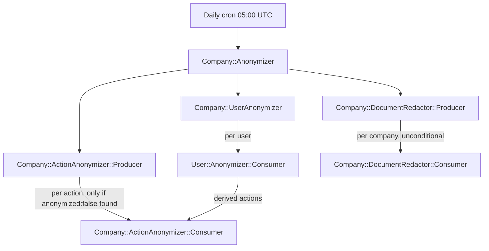

# SPIKE — Gating the Anonymization Producers Against Unbounded Daily Re-Scans

## Outcome — RESOLVED: Option C shipped, and this spike's costing of it was WRONG

**Read this before the option analysis below.** The engineer chose **Option C (the company-level
terminal flag)** and it shipped in app PR #5229, merged into `feature/per-country-anonymization`
(Phase 5, items 5–8 of `active/app/anonimizacao-retencao-por-pais/PLAN.md`).

**This spike characterized Option C as the highest-cost option — "new column, new coordination,
retroactive backfill" — and that characterization was wrong.** What shipped is a boolean
`companies.anonymized` (default false), a `without_anonymization` scope on the three
"disabled company" producers, and a fourth leg (`Company::Anonymizer::Producer` → `Consumer` →
`Finalizer`) that sets the flag. No `Computation`. No shared key. No coordination between the legs.
No backfill. It is one of the cheapest options in the list, not the most expensive.

**The error was an assumption, not a fact: this spike assumed completion had to be COORDINATED
(each leg signalling the others) when it only needs to be OBSERVED.** Finding 7 and Finding 10 are
both accurate about `Computation` and about the three legs having no shared start/stop signal — but
neither is a reason the flag needs `Computation`. A fourth reader can simply ask each leg's own data
"is there pending work?" and set the flag when all three answer no:

```ruby
# app/workers/company/anonymizer/consumer.rb (shipped, PR #5229)
pending_users_existence = User.with_uncached_connection { User.exists?(company_id: company_id, anonymized: false) }
return if pending_users_existence
# ... same shape for Document (without_status(:redacted)) and UserIdentifierAction (anonymized: false)
Company::Anonymizer::Finalizer.perform_async(company_id)
```

Three consequences this spike missed:

1. **No race, so nothing to synchronize.** Every check reads **durable data state, not job state**.
   A leg that has not run yet today, or was interrupted mid-run, still has its rows pending — so the
   flag is not set and the company is re-scanned tomorrow. Finding 7's Redis-durability concern
   evaporates because no signal is stored in Redis at all.
2. **No backfill — the first run IS the backfill.** The flag defaults to false, so on the first cron
   run after deploy every already-anonymized company is selected, observed complete, and self-marks.
   This spike's claim that Option C needs "a **backfill** to compute the correct initial value for
   every company that is already fully anonymized today" is false: re-running the three completeness
   checks retroactively is exactly what the Consumer does anyway, on day one, for free.
3. **It gets Option A's elimination WITHOUT Option A's residual-PII risk.** Findings 4/5/10 correctly
   killed the user-based gate (the user leg never touches `Document`, so a finished user leg would
   starve an interrupted document leg). The flag has no such failure mode because the gate is "all
   three legs report zero", not "users are done" — which is precisely the property Finding 4 was
   testing for.

What this spike got right and the implementation kept: the re-enable edge case (Option C's analysis
flagged that a stale flag would suppress a new cycle — `Company#enable` now clears it), and Finding 3
(`User::Anonymizer::Producer` is deliberately left ungated, because an enabled company never reaches
a terminal state).

**Lesson for the next spike:** an option's cost was asserted from an assumed mechanism
(`Computation`) rather than derived from what the option actually requires. Costing an option by the
most elaborate way to build it, and presenting that as the option's cost, is how the cheapest answer
gets buried under four more complex ones.

## Investigation question

The daily cron `anonymization:company` (and the sibling `anonymization:user`) fan out into four producers that re-derive their eligible-company/user population from scratch every day, forever — including for companies that were fully anonymized years ago. How can the four producers stop re-scanning already-anonymized companies daily, without ever leaving residual PII behind when one of the three per-company concerns (users, documents, identifier actions) is interrupted mid-run while another has already finished?

All findings below are evaluated against the **in-flight worktree** at `~/Projects/4Shark/app/.claude/worktrees/per-country-anonymization` (branch diff vs `origin/develop`), which rewrites all four producers to resolve the retention window per country via `country.anonymizing_window_days` and `companies.retention_jurisdiction_country_id`, not against `develop`.

## Sources consulted

- `app/workers/company/action_anonymizer/producer.rb` (worktree) — per-company UserIdentifierAction scan, no company-level gate
- `app/workers/company/action_anonymizer/consumer.rb` (worktree) — per-action anonymization
- `app/workers/company/document_redactor/producer.rb` (worktree) — no per-company gate of any kind
- `app/workers/company/document_redactor/consumer.rb` (worktree) — per-document idempotent redaction
- `app/workers/company/user_anonymizer.rb` (worktree) — per-company User scan, no company-level gate
- `app/workers/company/anonymizer.rb` (worktree) — top-level orchestrator, fires all three in parallel with no shared coordination
- `app/workers/user/anonymizer/producer.rb` (worktree) — the fourth producer, operates on a structurally different population (enabled companies, individually-disabled users)
- `app/workers/user/anonymizer/consumer.rb` (worktree) — confirms the Document/UserIdentifierAction boundary
- `app/models/company.rb`, `app/models/country.rb`, `app/models/document.rb`, `app/models/user.rb`, `app/models/user_identifier_action.rb`, `app/models/application_record.rb`, `app/models/computation.rb` (worktree)
- `db/schema.rb` (worktree) — companies, countries, documents, user_identifier_actions, users table/index definitions
- `db/migrate/2026/07/*` (worktree) — the per-country retention-window and `retention_jurisdiction_country_id` NOT NULL migrations
- `lib/application_configuration.rb`, `lib/tasks/cron.rake` (worktree)
- `docs/architecture/API_PATTERNS.md` diff (worktree vs develop) — the per-country retention narrative
- `docs/architecture/WORKERS.md` — `ApplicationWorker` vs `TenantWorker`
- `~/.claude/docs/DATA-PROCESSING.md` — the `Computation` completion guarantee (distributed termination detection)
- `vendor/bundle/ruby/4.0.0/gems/sidekiq-8.0.10/lib/sidekiq/client.rb` — `push_bulk` semantics on an empty args array
- `git -C app diff origin/develop -- app/workers` (worktree) — full diff of the four producers
- `~/Projects/4Shark/dot-claude-plans/active/spike/anonimizacao-por-pais/SPIKE-v2.md` — the predecessor spike that produced the per-country-window design; checked for prior coverage of the gating question (none found)
- Codebase-wide `grep` for `.computation` under `app/workers/` (worktree) — confirms which workers already use `Computation`

## Findings

### Finding 1: Three of four producers already gate at the per-record level, not the per-company level

**Evidence:**

```ruby
# app/workers/company/action_anonymizer/producer.rb:20-27 (worktree)
company_ids.each do |company_id|
  action_ids =
    UserIdentifierAction.with_uncached_connection do
      UserIdentifierAction.where(company_id: company_id, anonymized: false).pluck(:id)
    end

  Sidekiq::Client.push_bulk('class' => Company::ActionAnonymizer::Consumer, 'args' => action_ids.zip)
end
```

```ruby
# app/workers/company/user_anonymizer.rb:20-26 (worktree)
company_ids.each do |company_id|
  user_ids = User.with_uncached_connection { User.where(company_id: company_id, anonymized: false).pluck(:id) }

  user_ids.each do |user_id|
    User::Anonymizer::Consumer.perform_async(user_id)
  end
end
```

**Source:** `app/workers/company/action_anonymizer/producer.rb:20-27`, `app/workers/company/user_anonymizer.rb:20-26` (worktree per-country-anonymization)

**Significance:** once every action/user for a company is already anonymized, these two producers' inner `where(..., anonymized: false)` queries return zero IDs, and `push_bulk` with an empty `args` array enqueues zero consumer jobs (verified below, Finding 8). So these two legs are already **cheap-but-not-eliminated**: the daily cost is one indexed-or-not `pluck(:id)` query per already-anonymized company, forever, even though it does zero work downstream.

### Finding 2: `Company::DocumentRedactor::Producer` has no per-company gate at all — every qualifying company gets a Consumer job every day forever

**Evidence:**

```ruby
# app/workers/company/document_redactor/producer.rb:8-21 (worktree)
def perform
  country_ids = Country.with_uncached_connection { Country.where.not(anonymizing_window_days: nil).pluck(:id) }

  country_ids.each do |country_id|
    country = Country.with_uncached_connection { Country.find(country_id) }

    company_ids =
      Company.with_uncached_connection do
        Company.disabled.where(retention_jurisdiction_country_id: country_id,
                               disabled_at: ...country.anonymizing_window_days.days.ago).pluck(:id)
      end

    Sidekiq::Client.push_bulk('class' => Company::DocumentRedactor::Consumer, 'args' => company_ids.zip)
  end
end
```

Unlike `ActionAnonymizer::Producer` and `UserAnonymizer`, there is no inner `where(...)` check before `push_bulk` — every company ID that clears the disabled+window filter gets a `Company::DocumentRedactor::Consumer.perform_async(company_id)` call, unconditionally, every day. The Consumer itself is idempotent (`Document...without_status(:redacted)`, see Finding 4) but is still invoked and does its own query every time.

**Source:** `app/workers/company/document_redactor/producer.rb:8-21` (worktree). Confirmed identical in structure (no gate) on `origin/develop` via `git -C app show origin/develop:app/workers/company/document_redactor/producer.rb` — the per-country rewrite did not add a gate; it only changed how the window is resolved.

**Significance:** this is the one leg among the four where the daily cost is not just "a cheap no-op query" but "an unconditional Consumer job enqueued and executed" for every already-fully-redacted company, forever.

### Finding 3: `User::Anonymizer::Producer` (the fourth producer) operates on a structurally different, permanently-open population

**Evidence:**

```ruby
# app/workers/user/anonymizer/producer.rb:10-19 (worktree)
country_ids = Country.with_uncached_connection { Country.where.not(anonymizing_window_days: nil).pluck(:id) }

country_ids.each do |country_id|
  country = Country.with_uncached_connection { Country.find(country_id) }

  company_ids =
    Company.with_uncached_connection do
      Company.enabled.where(retention_jurisdiction_country_id: country_id).pluck(:id)
    end
```

**Source:** `app/workers/user/anonymizer/producer.rb:10-19` (worktree)

**Significance:** this producer scopes to `Company.enabled` (not `.disabled`), for **individually disabled users inside otherwise-active companies**. An enabled company never "graduates out" of this scan — new users can be individually disabled at any time for the life of the company. None of the company-level gating strategies below (user-based gate, terminal flag) apply to this producer's outer loop, because there is no terminal state for an enabled company to reach. Its per-company cost is bounded by `User.where(company_id:, anonymized: false, disabled_at: ...window)`, which is covered by the composite index `index_users_on_company_id_and_disabled_at` (`db/schema.rb:2446`) for the `company_id` + `disabled_at` range, with `anonymized` filtered from the matched rows. This producer's inherent daily cost is a separate concern from the "already-anonymized company keeps being re-scanned" problem the other three exhibit — it cannot be "solved" the same way because there is nothing to permanently exclude.

### Finding 4: `Company::DocumentRedactor::Consumer` is idempotent per document, but `User::Anonymizer::Consumer` never touches `Document`

**Evidence:**

```ruby
# app/workers/company/document_redactor/consumer.rb:10-23 (worktree)
def perform(company_id)
  document_ids =
    Document.with_uncached_connection do
      Document.where(company_id: company_id, type: IDENTITY_TYPES).without_status(:redacted).pluck(:id)
    end

  document_ids.each do |document_id|
    document = Document.with_uncached_connection { Document.find(document_id) }

    attachment = document.attachment
    attachment.destroy if attachment

    document.redact!
  end
end
```

```ruby
# app/workers/user/anonymizer/consumer.rb:10-27 (worktree)
def perform(user_id)
  user = User.find(user_id)
  user.anonymized = true
  user.email = "#{User::ANONYMIZED_VALUE}@#{User::ANONYMIZED_VALUE}.com"
  user.unique_register_id = User::ANONYMIZED_VALUE
  user.first_name = User::ANONYMIZED_VALUE
  user.last_name = User::ANONYMIZED_VALUE
  user.save!

  identifier_values = user.identifiers.pluck(:value)
  actions_by_identifier_value = UserIdentifierAction.where(company_id: user.company_id, user_identifier_value: identifier_values)
  actions_by_new_identifier_value = UserIdentifierAction.where(company_id: user.company_id, new_user_identifier_value: identifier_values)
  action_ids = actions_by_identifier_value.or(actions_by_new_identifier_value).pluck(:id)
  Sidekiq::Client.push_bulk('class' => Company::ActionAnonymizer::Consumer, 'args' => action_ids.zip)

  user.identifiers.update_all(primary: false)
  user.identifiers.destroy_all
end
```

**Source:** `app/workers/company/document_redactor/consumer.rb:10-23`, `app/workers/user/anonymizer/consumer.rb:10-27` (worktree)

**Significance:** `User::Anonymizer::Consumer` scrubs the `User` row, forwards to `ActionAnonymizer::Consumer` for identifier-derived actions, and destroys `UserIdentifier` rows — it never queries or mutates `Document`. Nothing in the user-anonymization leg advances document redaction. This is the concrete mechanism behind the engineer's stated concern: if a company's user-anonymization leg (`Company::UserAnonymizer` → `User::Anonymizer::Consumer`, one job per user) fully completes and marks every user `anonymized: true`, but the document-redaction leg (`Company::DocumentRedactor::Producer` → `Consumer`, one job per company) was interrupted mid-run for that same company (deploy `sidekiqctl quiet`, per `app/CLAUDE.md` § Deploy — "A deploy runs `sidekiqctl quiet`, which pauses workers for 5–10 minutes while new pods come up"), a gate that keys off "does this company still have a non-anonymized user" would return false for that company from that point forward. Any producer whose own re-enqueue depends on that shared gate would stop revisiting the company, and the un-redacted `Document` rows for that company would never be found again by the existing daily mechanism.

### Finding 5: after `user.identifiers.destroy_all`, `UserIdentifierAction` rows are not reachable through the `User` → `UserIdentifier` graph

**Evidence:**

```ruby
# app/models/user_identifier_action.rb:6-9 (worktree)
belongs_to :company, optional: true, inverse_of: :user_identifier_actions

belongs_to :document, class_name: 'UserIdentifierActionDocument', foreign_key: :user_identifier_action_document_id,
                      inverse_of: :actions, optional: true
```

`UserIdentifierAction` has no association back to `User` or `UserIdentifier` at all — only to `Company` and to its own source `Document`. Its anonymization gate in `ActionAnonymizer::Producer` is a flat `UserIdentifierAction.where(company_id: company_id, anonymized: false)` (Finding 1), independent of whether any `UserIdentifier` still exists.

**Source:** `app/models/user_identifier_action.rb:6-9` (worktree)

**Significance:** this narrows the objection from Finding 4 — the risk is not that `UserIdentifierAction` rows become *unreachable* after `identifiers.destroy_all` (the model was never reached through `UserIdentifier` in the first place; `ActionAnonymizer` always scans by `company_id` directly). The risk is specifically about **which gate decides whether a company is still visited at all**. A company-level gate built on "any live `UserIdentifier`" would be broken by `destroy_all` (nothing would ever be found live again, immediately masking a real gap). A gate built on "any `User` with `anonymized: false`" (the engineer's proposal) does not have that specific failure mode, but does have the cross-leg failure mode described in Finding 4 — if all `User` rows for a company reach `anonymized: true` while a sibling leg (documents or actions) is still incomplete, that sibling leg is starved of future re-scans under a shared user-based gate.

### Finding 6: none of the four anonymization workers currently use `Computation`

**Evidence:** a repo-wide `grep -rn "computation" app/workers/` across every worker in the worktree (30 matches total) returns zero hits inside `company/anonymizer.rb`, `company/user_anonymizer.rb`, `company/action_anonymizer/{producer,consumer}.rb`, `company/document_redactor/{producer,consumer}.rb`, `user/anonymizer/{producer,consumer}.rb`. The matches that do exist are all in unrelated pipelines (`deal_incentive/*`, `ranking/*`, `ranking_incentive/*`, `commission/*`, `fpw_integration/*`, `monthly_usage_audit/row/*`, `plan_statement/*`, `plan_goal_audit/*`, `user_identifier_action_document/*`, `acceptment/*`, `deal_search_index/*`).

By contrast, `Company` and `Document` already expose a `computation` accessor for **other** flows:

```ruby
# app/models/company.rb:157-159 (worktree)
def computation
  @computation ||= Computation.new("company_#{id}")
end
```

```ruby
# app/models/document.rb:96-98 (worktree)
def computation
  @computation ||= Computation.new("document_#{id}")
end
```

**Source:** `app/models/company.rb:157-159`, `app/models/document.rb:96-98` (worktree); grep of `app/workers/` (worktree)

**Significance:** wiring `Computation` into the anonymization pipeline (Option C below) is **new integration work**, not a reuse of an existing wiring for this specific pipeline — even though the `company_#{id}` computation key already exists and is used elsewhere in the codebase (unrelated commission/deal flows), so reusing the *same* key for anonymization completion would risk cross-purpose collision with whatever else increments `company_#{id}`'s counters; a dedicated key (e.g. `"company_anonymization_#{id}"`) would be needed.

### Finding 7: `Computation#done?` answers "has this one fan-out finished", not "has a multi-day, multi-leg pipeline finished"

**Evidence:**

```ruby
# app/models/computation.rb:22-40 (worktree)
def increment_queue(by: 1)
  @queue_value = queue.increment(by: by)
end

def increment_executions(by: 1)
  @executions_value = executions.increment(by: by)
end
...
def done?
  queue_value == executions_value
end
```

Per `~/.claude/docs/DATA-PROCESSING.md:131`: *"Producer/Consumer (and Sower/Grower) need to know **when the whole fan-out is done** — when every job spawned, directly or recursively, has finished — so the next stage can start without advancing on missing work."* Per `~/.claude/docs/DATA-PROCESSING.md:158`: *"the counters are monotonic so retries stay balanced. This is the standard mitigation for at-least-once delivery"*.

**Source:** `app/models/computation.rb:22-40` (worktree); `~/.claude/docs/DATA-PROCESSING.md:131,158`

**Significance:** `Computation` is designed for a **single Producer → Consumer fan-out** completing within one logical run — `queue` is incremented when jobs are pushed, `executions` when each one finishes, and `done?` is `true` once they match. It is retry-safe for at-least-once delivery of the *same* fan-out. Using it as a company-level "fully anonymized" terminal signal requires composing **three independent fan-outs** (user, document, action legs — each with its own producer, its own daily re-trigger, and no shared start/stop boundary) into one `done?` check, which is not what the class does today. It would need: (a) a shared key per company across all three legs, (b) each leg's producer/consumer incrementing that shared key's `queue`/`executions` instead of (or in addition to) any per-leg counters, and (c) something to read `done?` and flip a separate persistent terminal flag, because `Computation`'s state lives in Redis counters, not a durable column — a Redis flush or TTL-based eviction would silently lose the "done" signal if the terminal flag itself were not persisted separately in Postgres.

### Finding 8: `push_bulk` with an empty `args` array enqueues zero jobs (verified against the vendored Sidekiq gem)

**Evidence:**

```ruby
# vendor/bundle/ruby/4.0.0/gems/sidekiq-8.0.10/lib/sidekiq/client.rb:157-159
result = args.each_slice(batch_size).flat_map do |slice|
  raise ArgumentError, "Bulk arguments must be an Array of Arrays: [[1], [2]]" unless slice.is_a?(Array) && slice.all?(Array)
  break [] if slice.empty? # no jobs to push
```

`Array#each_slice` on an empty array yields no slices, so `flat_map` returns `[]` with no Sidekiq push occurring.

**Source:** `vendor/bundle/ruby/4.0.0/gems/sidekiq-8.0.10/lib/sidekiq/client.rb:157-159`

**Significance:** confirms the "cheap-but-not-eliminated" characterization in Finding 1 — `ActionAnonymizer::Producer`'s and `UserAnonymizer`'s inner queries producing zero IDs for an already-anonymized company genuinely cost zero downstream Sidekiq jobs; the entire daily cost for those two legs, for an already-anonymized company, is the `pluck(:id)` query itself.

### Finding 9: the outer company query has an index on `retention_jurisdiction_country_id` but none on `disabled_at`; the inner `UserIdentifierAction` and `Document` per-company queries have no index that includes the anonymization-status column

**Evidence:**

```ruby
# db/schema.rb:505-536 (worktree, companies table)
t.datetime "disabled_at"
...
t.bigint "retention_jurisdiction_country_id", null: false
...
t.index ["commission_queue_suffix"], name: "index_companies_on_commission_queue_suffix", unique: true
t.index ["disabler_id"], name: "index_companies_on_disabler_id"
t.index ["name"], name: "index_companies_on_name", unique: true
t.index ["retention_jurisdiction_country_id"], name: "index_companies_on_retention_jurisdiction_country_id"
```

No index on `companies.disabled_at`, alone or composite with `retention_jurisdiction_country_id`.

```ruby
# db/schema.rb:2268-2285 (worktree, user_identifier_actions table)
t.boolean "anonymized", default: false, null: false
t.bigint "company_id"
...
t.index ["company_id"], name: "index_user_identifier_actions_on_company_id"
t.index ["owner_id"], name: "index_user_identifier_actions_on_owner_id"
t.index ["user_identifier_action_document_id"], name: "idx_on_user_identifier_action_document_id_e9e2e8b057"
```

No index that includes `anonymized`. `UserIdentifierAction.where(company_id: company_id, anonymized: false)` (Finding 1) uses `index_user_identifier_actions_on_company_id` to find the company's own rows, then filters `anonymized` from each of those rows — cost scales with the company's total historical action-row count, not with the (zero) match count, once every row is already anonymized.

```ruby
# db/schema.rb:757-776 (worktree, documents table)
t.integer "status"
...
t.index ["company_id", "type"], name: "index_documents_on_company_id_and_type"
t.index ["company_id"], name: "index_documents_on_company_id"
t.index ["owner_id"], name: "index_documents_on_owner_id"
t.index ["plan_slice_commission_id"], name: "index_documents_on_plan_slice_commission_id"
t.index ["type"], name: "index_documents_on_type"
```

No index that includes `status`; `Document.where(company_id:, type: IDENTITY_TYPES).without_status(:redacted)` (Finding 4) is at least narrowed by the `company_id, type` composite before filtering `status`.

Contrast with `users`, which already has this pattern applied:

```ruby
# db/schema.rb:2446-2448 (worktree, users table)
t.index ["company_id", "disabled_at"], name: "index_users_on_company_id_and_disabled_at"
t.index ["company_id", "email"], name: "index_users_on_company_id_and_email", unique: true, where: "(anonymized = false)"
t.index ["company_id", "register_type", "unique_register_id"], name: "user_encrypted_unique_register_id_index", unique: true, where: "(anonymized = false)"
```

**Source:** `db/schema.rb:505-536, 757-776, 2268-2285, 2446-2448` (worktree)

**Significance:** the codebase already has a precedent for a `where: "(anonymized = false)"` partial index (twice, on `users`) — so a partial index scoped to the not-yet-anonymized subset is an idiomatic, already-used pattern here, not a new technique. `companies.disabled_at` having no index is a separate, likely-lower-impact gap: `companies` is presumably a small table (one row per 4Shark client account — see "What remains uncertain" for why this is not confirmed from code), so a `disabled_at` filter on an already-narrow `retention_jurisdiction_country_id`-indexed set is unlikely to be the dominant cost, unlike the `user_identifier_actions` per-company scan, which can hold a large multiple of rows per company.

### Finding 10: `companies` has no "fully anonymized" terminal column today, and reaching that terminal state requires all three legs, which currently run and re-trigger independently

**Evidence:**

```ruby
# app/workers/company/anonymizer.rb:1-13 (worktree)
class Company < ApplicationRecord
  class Anonymizer < ApplicationWorker
    sidekiq_options queue: :anonymizing

    def perform
      Company::UserAnonymizer.perform_async
      Company::DocumentRedactor::Producer.perform_async
      Company::ActionAnonymizer::Producer.perform_async
    end
  end
end
```

The `companies` table columns (`db/schema.rb:505-536`, quoted in Finding 9) include no `anonymized`, `anonymized_at`, or similar terminal-state column — only `disabled_at`/`disabler_id` (individually-disabled state) and the retention-jurisdiction fields.

**Source:** `app/workers/company/anonymizer.rb:1-13`, `db/schema.rb:505-536` (worktree)

**Significance:** the three legs are fired in parallel with **no ordering guarantee and no shared start/stop signal** — `Company::UserAnonymizer`'s consumers, `DocumentRedactor::Producer`'s consumers, and `ActionAnonymizer::Producer`'s consumers all run independently, at whatever pace Sidekiq schedules them. A terminal flag (Option C) would need to be set only after confirming all three have actually finished for that company — which is exactly the coordination problem `Computation` addresses in general (Finding 7), but which is not wired up for this specific three-way join today.

### Finding 11: countries without a configured retention window are skipped entirely; every company now has exactly one retention country

**Evidence:**

```ruby
# app/workers/company/document_redactor/producer.rb:9 (worktree, same shape in the other three producers)
country_ids = Country.with_uncached_connection { Country.where.not(anonymizing_window_days: nil).pluck(:id) }
```

```ruby
# db/migrate/2026/07/20260710222036_set_companies_retention_jurisdiction_country_id_not_null.rb (worktree)
```

(migration title only visible via filename; the file sets `retention_jurisdiction_country_id` to `NOT NULL` on `companies`, corroborated by `db/schema.rb:524`: `t.bigint "retention_jurisdiction_country_id", null: false`)

```ruby
# docs/architecture/API_PATTERNS.md diff (worktree vs develop)
+An account whose country has no window configured yet is not anonymized until it is set.
```

**Source:** `app/workers/company/document_redactor/producer.rb:9` (worktree), `db/schema.rb:524` (worktree), `docs/architecture/API_PATTERNS.md` diff (worktree vs develop)

**Significance:** every company resolves to exactly one country (`NOT NULL` FK), and only Brazil (1855 days), Mexico (3680 days), and Colombia (3680 days) currently have `anonymizing_window_days` set (`db/migrate/2026/07/20260708221559_add_anonymizing_window_days_to_brazil.rb`, `.../20260708221704_add_anonymizing_window_days_to_mexico.rb`, `.../20260710123240_add_anonymizing_window_days_to_colombia.rb`, worktree). Companies whose country has no window set are excluded from every producer's outer scan today — the "unbounded daily re-scan" problem is currently confined to companies in those three countries, but will expand to every country as more `anonymizing_window_days` values are configured. Any gating option chosen needs to keep working as the country coverage grows, and needs to react correctly if a country's window value is changed later or if a company's `retention_jurisdiction_country_id` is re-pointed to a different country (see per-option analysis below).

### Finding 12: none of the four anonymization workers have any test coverage in this worktree

**Evidence:** `find spec/workers/company -iname "*anonymiz*"` and `find spec/workers/user -iname "*anonymiz*"` (worktree) both return no matches; `spec/workers/company/` and `spec/workers/user/` do not even exist as directories for this worker family.

**Source:** filesystem search of `spec/` (worktree), no matching output

**Significance:** whichever gating option is chosen, there is currently no regression safety net for the anonymization pipeline's existing behavior — a control-flow change here (Options A, B, C) is materially riskier to validate than it would be in a codebase area with existing spec coverage, purely because there is nothing today to run before/after and diff.

## Options — trade-offs, not a recommendation



### Option A — the engineer's proposal: a single user-based gate applied to all three "disabled company" producers

Skip a company entirely at the producer level unless it (a) is disabled past its country's window, and (b) still has at least one `User` with `anonymized: false`.

- **Eliminates vs. cheapens:** eliminates the daily cost for `UserAnonymizer` and `ActionAnonymizer::Producer` for a company once every user is anonymized (they already return zero downstream jobs today — Finding 1 — so the gate mainly saves the `pluck(:id)` query itself); **fully eliminates** the currently-unconditional `DocumentRedactor::Producer` enqueue for that company too (Finding 2), which is the biggest single change in behavior.
- **Residual-PII risk:** real, per Finding 4 and Finding 6-7. If `UserAnonymizer`'s consumers finish for a company before `DocumentRedactor`'s or `ActionAnonymizer`'s consumers do (no ordering guarantee, Finding 10), and the slower leg is then interrupted (a deploy's `sidekiqctl quiet` window, `app/CLAUDE.md` § Deploy), a shared user-based gate stops re-enqueuing that company for `DocumentRedactor::Producer` and `ActionAnonymizer::Producer` from that day forward — the un-redacted `Document` or un-anonymized `UserIdentifierAction` rows are never revisited by the existing daily mechanism. This is the scenario the engineer's proposal was explicitly asked to be tested against, and Findings 4/6/7/10 together support that the risk is real given the current lack of any cross-leg completion coordination.
- **Interaction with window/country changes:** once a company is excluded by the gate, later changes to its country's `anonymizing_window_days` or to its own `retention_jurisdiction_country_id` have no effect — the company is not re-considered by the outer scan at all, whether or not the underlying documents/actions are actually done.
- **Interruption behavior:** Sidekiq's default retry re-runs a failed job's `perform` from the top (no mid-loop resume state), so a producer interrupted mid-country-loop simply re-derives its lists on retry — that part is unaffected. The risk is specifically the *next day's* run skipping a company whose leftover work was never retried to completion.
- **Migration/backfill cost:** low to add (a `.joins`/`.where(users: { anonymized: false })` or an `EXISTS` subquery on the existing `Company.disabled.where(...)` scope); no backfill needed since the gate is evaluated fresh each run.

### Option B — per-concern gating: each producer short-circuits on its own pending work

Each producer keeps its own `disabled + window` outer scan, but the inner per-company step becomes an `EXISTS`-shaped check against that concern's own pending records — `ActionAnonymizer::Producer` already effectively does this via its `anonymized: false` filter (Finding 1); this option makes it explicit and extends the same shape to `DocumentRedactor::Producer` (checking `Document...without_status(:redacted).exists?`) and to `UserAnonymizer` (already has it).

- **Eliminates vs. cheapens:** does **not** eliminate the daily outer scan (every disabled+window-matched company is still visited every day, forever) — it only turns "enqueue unconditionally" (`DocumentRedactor`, Finding 2) into "enqueue only if there is pending work" (matching the other two legs' existing shape, Finding 1), and turns an ID-`pluck` into a cheaper `EXISTS` where indexed. The unbounded-*visit* cost remains; the unbounded-*downstream-job* cost for `DocumentRedactor` goes away.
- **Residual-PII risk:** none beyond what exists today — each leg still gates on its **own** pending state, so no leg is ever starved by another leg's progress. This directly avoids the cross-leg failure mode in Finding 4/6.
- **Interaction with window/country changes:** unaffected — nothing is permanently excluded, so a later window/country change is picked up on the very next daily run exactly as today.
- **Interruption behavior:** unaffected for the same reason — an interrupted leg's own next-day `EXISTS` check still finds its own leftover work and re-enqueues it.
- **Migration/backfill cost:** low — no schema change required if index gaps (Finding 9) are also closed; without new indexes, `DocumentRedactor::Producer`'s new `exists?` check is bounded by the same `company_id, type` composite index already used by its Consumer.

### Option C — a company-level "fully anonymized" terminal flag, set once all three concerns are confirmed complete

> **CORRECTED — see the Outcome at the top of this document.** This option SHIPPED (PR #5229), and
> the cost analysis below is wrong. It assumes the flag requires a *coordination* mechanism
> (`Computation` or per-leg completion columns) plus a retroactive backfill. Neither is needed:
> completion is **observed** by a fourth leg that queries each concern's own pending rows, and the
> first cron run after deploy self-marks every already-anonymized company. Read the paragraphs below
> as a record of the reasoning that was actually applied at the time — not as a valid costing.

Add a persistent column (e.g. `companies.fully_anonymized_at`) and a coordination mechanism that sets it only after user-anonymization, document-redaction, and action-anonymization are all independently confirmed done for that company; every producer's outer scan then excludes companies where the flag is set.

- **Eliminates vs. cheapens:** fully eliminates the outer-scan visit **and** all inner work for a company, permanently, once set — the only option of the four that removes the company from consideration entirely rather than just cheapening or partially gating the check.
- **Residual-PII risk:** the design intent is zero risk **by construction**, but the risk is displaced into the coordination mechanism's correctness. Per Finding 6/7, `Computation` is not currently wired to this pipeline and is semantically built for a single fan-out's `queue == executions` check, not a three-independent-leg join with no shared start signal (Finding 10). Making it safe requires either: (1) a shared `Computation` key incremented/decremented by all three legs' producers and consumers (new integration work across six files), with a separate process to read `done?` and durably persist the flag (Redis counters are not themselves durable across a flush/TTL — Finding 7); or (2) a simpler three-boolean/three-timestamp Postgres-only coordination (e.g. per-company `user_anonymization_completed_at`, `document_redaction_completed_at`, `action_anonymization_completed_at`, with the terminal flag set only when all three are non-null) that avoids `Computation` and Redis-durability concerns entirely but is a different, un-precedented mechanism in this codebase. Both sub-options need each leg's *own* completion detection to be reliable first — which today does not exist for any of the three legs (there is no current signal that says "`DocumentRedactor` truly has no more documents left" beyond re-running the query and getting zero, which is not something the Consumer itself observes or reports back).
- **Interaction with window/country changes:** once genuinely set, a later window/country change is irrelevant — the underlying data is already gone, so nothing is lost by no longer reconsidering the company. The edge case not covered by the flag alone: if a company is later **re-enabled** and then **disabled again** with a new `disabled_at`, a stale terminal flag from the prior disablement would incorrectly suppress the new cycle — the flag would need to be cleared on re-enable (nothing in `app/models/application_record.rb:80-96` `enable`/`disable` today clears any such flag, since the flag does not exist).
- **Interruption behavior:** by design, the flag is only set once all three legs are durably confirmed complete, so an interruption before that point simply delays the flag from ever being set — no risk of a false-positive terminal state, provided the "confirmed complete" check is itself correct (see risk above).
- **Migration/backfill cost:** the highest of the four options — a new column, a coordination mechanism, and a **backfill** to compute the correct initial value for every company that is already fully anonymized today (there is no way to distinguish "fully anonymized, just never flagged" from "not yet fully anonymized" without re-running the same three completeness checks retroactively for every existing disabled company).

### Option D — pure index/query fix, no control-flow change

Add a partial index on `user_identifier_actions` scoped to `where anonymized = false` (mirroring the existing `users` partial-index pattern, Finding 9), and a composite index on `documents` that includes `status` (or a partial index `where status != 5` / `where status <> N` for `redacted`), leaving every producer's logic untouched.

- **Eliminates vs. cheapens:** cheapens only — every producer still visits every disabled+window-matched company every day forever (Findings 1, 2), and `DocumentRedactor::Producer` still unconditionally enqueues a Consumer job per company (Finding 2). This option does not touch that unconditional enqueue at all.
- **Residual-PII risk:** none — zero behavior change, only query-plan change.
- **Interaction with window/country changes:** none — nothing cached, so unaffected by design.
- **Interruption behavior:** none — unaffected by design, identical to today.
- **Migration/backfill cost:** lowest of the four — one or two `add_index ... algorithm: :concurrently` migrations (per `~/.claude/CLAUDE.md` § Rails Migrations, a `:concurrently` index requires `disable_ddl_transaction!`, mechanically enforced by `scripts/validate-concurrent-index-migration.sh`), no backfill, no worker code change.

### Option E — approaches surfaced but not deeply evaluated

- **Weekly (or otherwise less-frequent) re-scan cadence instead of daily.** Divides the daily cost by the cadence factor without eliminating the unbounded-growth shape — an already-anonymized company is still re-visited forever, just less often. Introduces a compliance-timing question not present in the other options: `~/.claude/CLAUDE.md:362` describes the retention window as "the **maximum** we may keep the data, after which storage limitation requires erasing" — a coarser cadence means some companies cross their window up to (cadence − 1) days before being caught, which is a small but real slip past the maximum. Not evaluated against the other four dimensions (residual-PII risk, window-change interaction, interruption behavior) in this spike.
- **Cache/memoize a "confirmed empty as of date" signal per company per leg** (e.g. in Redis, with a TTL or explicit invalidation on the events that could make a company newly eligible for work — a new `Document`, a new `UserIdentifierAction`, a newly-disabled `User`). Conceptually a softer version of Option C that avoids a schema migration, but trades that for cache-invalidation complexity (a second named hard problem) and a durability gap of its own (a Redis flush loses the memoized "empty" state, silently reverting to the current daily-rescan behavior rather than to a data-loss risk — arguably a safer failure mode than Option C's Redis-durability gap, since Option E's cache miss is "rescan", not "silently correct"). Not developed further in this spike.

## Trade-offs surfaced

| Option | Eliminates unbounded scan? | Residual-PII risk vs. today | Window/country-change safe? | Interruption-safe? | Migration/backfill cost |
|---|---|---|---|---|---|
| A — single user-based gate | Yes, for all three "disabled company" producers | New risk (Findings 4, 6, 7, 10) — cross-leg starvation possible | No — excluded company is never re-considered | Unaffected for the interrupted job itself; the *next day's* skip is the risk | Low |
| B — per-concern gating | No — outer scan stays daily forever; only the unconditional `DocumentRedactor` enqueue is fixed | None beyond today | Yes — unaffected, same as today | Yes — unaffected, same as today | Low |
| C — company-level terminal flag via observed completion **(SHIPPED — PR #5229; the row below is CORRECTED, see Outcome)** | Yes, for all three legs, permanently | Zero — the gate is "all three legs report zero pending rows", so no leg can be starved by another's progress | Safe once set; re-enable handled — `Company#enable` clears the flag | Safe by design — every check reads durable data state, not job state, so an interrupted leg leaves its rows pending and the flag simply is not set | **Low** — one boolean column (`default: false`), one scope, one three-worker leg. No `Computation`, no coordination, no backfill (the first cron run self-marks) |
| D — pure index/query fix | No — same unconditional `DocumentRedactor` enqueue and daily visits remain | None — zero behavior change | Yes — unaffected | Yes — unaffected | Lowest |
| E — cadence change / soft cache (not deeply evaluated) | Partially (cadence) / Yes while cache is warm (memoize) | Cadence: small compliance-timing slip past the window maximum; Memoize: cache-miss reverts to today's behavior, not to data loss | Cadence: unaffected; Memoize: needs invalidation on the right write events | Cadence: unaffected; Memoize: not evaluated | Cadence: none; Memoize: moderate (invalidation logic) |

## What remains uncertain

- **How many companies actually cross the retention window today, and how large `user_identifier_actions` gets per company.** Not found — this spike had no production database access (per `~/.claude/CLAUDE.md` § Production Access, Claude does not have direct database access; only the engineer can supply this). `~/.claude/docs/JURISDICTION.md:20` describes the shared-productive front category as "many clients, by role" and `~/.claude/docs/JURISDICTION.md:43` lists `shared001` as one such front (`operador`, Brazil), which weakly suggests the `companies` table is not enormous (tens to low hundreds of rows, not thousands), but this is an inference from front-naming documentation, not a verified count, and should not be treated as a fact. Whether the daily re-scan is a material cost or a micro-optimization depends entirely on this number and on the average `user_identifier_actions` row count per long-lived, fully-anonymized company — neither of which this spike can quantify from code alone.
- **Whether `DocumentRedactor::Producer`'s currently-unconditional per-company enqueue (Finding 2) is itself measurably expensive in practice**, or whether the Consumer's `without_status(:redacted)` early-exit (Finding 4) makes each no-op invocation cheap enough that only the outer scan cost (addressed by any of Options A–D) matters. Not measured in this spike.
- **Whether a leg-completion signal (needed for Option C) can be derived reliably without new plumbing in each of the three Consumers.** Today, none of the three Consumers reports back "I found and processed my last pending record" — completion is only ever observed indirectly, by re-running the producer's own query tomorrow and getting zero. Any coordination mechanism (`Computation`-based or a simpler three-timestamp column set) needs each Consumer to explicitly signal its own completion, which none of them do today.

## Suggested options for main and the engineer

**RESOLVED — the engineer chose Option C; it shipped in PR #5229. See the Outcome at the top.** The
list below is the set as it was originally presented, kept for the record.

- Option A: gate all three "disabled company" producers on a single "company still has a non-anonymized user" check
- Option B: keep the daily outer scan, but make every leg gate on its own pending work (extending the shape `ActionAnonymizer` and `UserAnonymizer` already have to `DocumentRedactor`)
- Option C: build genuine cross-leg completion coordination and a persistent terminal flag, accepting the highest migration/backfill/coordination cost for the only option that fully eliminates the daily visit forever — **as worded here, wrong: the coordination and the backfill are not required (Outcome)**
- Option D: leave all control flow untouched and only add the missing indexes (Finding 9), accepting that the unbounded daily scan continues but becomes cheap per visit
- Option E: a less-frequent re-scan cadence or a soft Redis-memoized "confirmed empty" cache — surfaced but not developed to the same depth as A–D in this spike

The two items in "What remains uncertain" that gated the original choice — production scale, and
whether `DocumentRedactor::Producer`'s unconditional enqueue is measurably expensive — were never
quantified, and did not need to be: the shipped option eliminates the daily visit at low cost
regardless of the scale, so the trade-off those numbers would have informed disappeared. The third
uncertainty ("whether a leg-completion signal can be derived reliably without new plumbing in each
Consumer") **is answered: yes** — no Consumer plumbing was needed, because completion is observed
from the outside by querying each leg's own pending rows rather than reported from the inside.

Finding 9's index gaps (no partial index on `user_identifier_actions.anonymized`, no index including
`documents.status`, no index on `companies.disabled_at`) were **not** addressed by PR #5229 and
remain open. Their impact is now much smaller — after the first cron run, only genuinely-pending
companies are scanned at all — but the `exists?` checks in `Company::Anonymizer::Consumer` hit those
same unindexed columns for every not-yet-flagged company. Left as a possible follow-up, not a
blocker.
