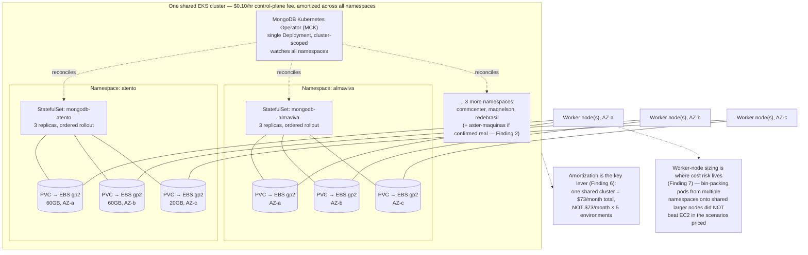
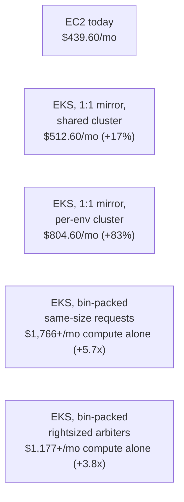

# SPIKE — MongoDB self-managed on EC2 (current) vs EKS + MongoDB Community Kubernetes Operator, with numbers

**Conducted by:** spike agent
**Date:** 2026-07-08
**Status:** Closed — DECISION: do NOT migrate to EKS. Option A chosen — MongoDB stays on EC2, the manual OS upgrade proceeds (see § Decision).

---

## Decision (2026-07-08)

**Outcome: do NOT adopt EKS. MongoDB stays on its current dedicated-EC2 topology, and the already-drafted manual OS upgrade (`~/.claude/plans/active/terraform/integrator-mongodb-os-upgrade/PLAN.md`) is the path forward — this is Option A from § Suggested options.**

This is the engineer's decision, made after reviewing this spike's quantified findings. The reasoning:

- **EKS costs more in every scenario priced** (Findings 5–7): the cheapest EKS variant (shared cluster, 1:1 mirror) is +16.6%/month over EC2 in sa-east-1 — the control-plane fee is pure addition with nothing modeled to offset it; bin-packing, the only lever that could have made it cheaper, came out 3.8×–5.7× more expensive in worker compute alone.
- **EKS does not reduce maintenance — it changes its composition** (Finding 10): it removes manual node-OS patching but adds two new mandatory recurring obligations EC2 does not have (the Kubernetes control-plane version lifecycle, ≤14-month cadence or a 6× fee; and operator tracking — the named operator is already EOL Nov 2025). The MongoDB engine FCV governance stays manual on both platforms.
- **The stated pain — the unmaintained OS — is resolved directly by the manual upgrade** without adopting a first-ever Kubernetes platform at 4Shark, a new skillset, or the cost premium.

This closes the spike. No `PLAN.md` is generated from it (the OS-upgrade plan already exists and is now the decision of record). The findings are retained as the documented rationale so a future session does not re-open the EKS question without new information (e.g. AWS materially changing EKS control-plane pricing, or a Spot-for-arbiters analysis — the one lever flagged but not modeled, § What remains uncertain).

Together with the prior `mongodb-on-ecs` spike (which ruled out ECS), the self-managed-container re-platforming question is now closed on both fronts: ECS lacks the StatefulSet primitive, and EKS has it but does not pay for itself here.

---

## Investigation question

The prior spike (`~/.claude/plans/completed/spike/mongodb-on-ecs/SPIKE.md`) closed with "MongoDB stays on EC2, do NOT migrate to ECS," but left **Option C — EKS + MongoDB Community Kubernetes Operator** on the table with no cost or maintenance-effort quantification (that spike's Finding 9, § Suggested options Option C, § Next Steps). This spike fills that gap with a DATA-BASED comparison, on two axes only:

1. **Cost** — monthly and annual, per replica set and fleet-wide, in sa-east-1, comparing the current dedicated-EC2-instance topology against EKS with the MongoDB Community Kubernetes Operator (control plane fee, worker-node compute, EBS/PVC storage).
2. **Maintenance time/effort** — what 4Shark manually owns today (OS patching, OS major-version migration, MongoDB engine major-version migration) versus what shifts, stays, or is newly introduced on EKS (Kubernetes control-plane version lifecycle, node AMI lifecycle, the operator's own upgrade surface).

Self-managed MongoDB is a hard, non-negotiable constraint (DocumentDB and Atlas both ruled out by the engineer, established in the prior spike's Finding 10) — this spike does not revisit that constraint or propose either managed alternative.

---

## Methodology note (read before evaluating citations)

`WebFetch` against `aws.amazon.com/ec2/pricing/on-demand/` and `instances.vantage.sh` returned no usable numeric pricing (both render their pricing tables via client-side JavaScript, confirmed empirically — the fetched text described the page's purpose but contained no dollar figures). `cloudprice.net` returned a paywall notice for non-US regions. Workable numeric pricing for sa-east-1 was obtained from `aws-pricing.com`, a static-rendered third-party AWS-pricing mirror, via `WebFetch`, one page per instance type/region — each figure below carries its exact quote and URL (see auxiliary file `mongodb-eks-vs-ec2_pricing-data_1.md` for the full raw table). AWS's own documentation pages (`docs.aws.amazon.com`) fetched cleanly as static Markdown-rendered content and are the primary source for the EKS control-plane fee, the Kubernetes version-support lifecycle, and the managed-node-group update mechanics.

Every quote below was captured on a single fetch (2026-07-08); consistent with the prior `mongodb-on-ecs` spike's Methodology Note, this environment gives no mechanism to perform an independent second fetch to re-confirm each quote in the same session, so confidence is "fetch-tool-mediated," not "independently re-verified." Nothing below returned an outright fetch error, so nothing is tagged `UNVERIFIED` in the strict sense, but treat third-party pricing-aggregator citations (`aws-pricing.com`) as one tier below a direct AWS Price List API pull.

---

## Sources consulted

- `~/Projects/4Shark/terraform/integrator-atento/mongodb.tf` (and identical `integrator-almaviva/commcenter/maqnelson/redebrasil`) — direct read, ground truth for the current topology
- `~/Projects/4Shark/terraform/CHANGELOG.md:83`, `~/Projects/4Shark/terraform/docs/adr/ADR-003-network-topology.md:11` — direct read, source of the "aster-maquinas" / fleet-count discrepancy
- [AWS EC2 T3 Instances product page](https://aws.amazon.com/ec2/instance-types/t3/) — canonical vCPU/memory specs
- [aws-pricing.com — t3.micro / t3.small / t3.medium / t3.large / t3.xlarge / m5.xlarge / c5.xlarge / sa-east-1](https://aws-pricing.com/) — sa-east-1 on-demand hourly prices and EBS gp2/gp3 per-GB-month prices (full list in auxiliary file)
- [AWS EKS Pricing](https://aws.amazon.com/eks/pricing/) — cluster-hour fee (standard vs extended support), billable-components list
- [AWS EKS — Understand the Kubernetes version lifecycle on EKS](https://docs.aws.amazon.com/eks/latest/userguide/kubernetes-versions.html) — minor-version release cadence, standard/extended support durations, release calendar
- [AWS EKS — Update a managed node group for your cluster](https://docs.aws.amazon.com/eks/latest/userguide/update-managed-node-group.html) — node AMI/OS update automation mechanics
- [MongoDB Controllers for Kubernetes — Upgrade MongoDB Version](https://www.mongodb.com/docs/kubernetes/current/tutorial/upgrade-mdb-version/) — `spec.version` / FCV upgrade mechanics
- [GitHub mongodb/mongodb-kubernetes-operator](https://github.com/mongodb/mongodb-kubernetes-operator) — deprecation notice
- [GitHub mongodb/mongodb-kubernetes](https://github.com/mongodb/mongodb-kubernetes) — successor operator (MCK), license, Community Edition support
- See auxiliary: [`mongodb-eks-vs-ec2_pricing-data_1.md`](./mongodb-eks-vs-ec2_pricing-data_1.md) — every pricing quote, the full instance-type table, and the $/vCPU-hour derivation
- See auxiliary: [`mongodb-eks-vs-ec2_operator-research_1.md`](./mongodb-eks-vs-ec2_operator-research_1.md) — the operator deprecation/succession research and version-upgrade mechanics, in full
- Internal — `~/.claude/plans/completed/spike/mongodb-on-ecs/SPIKE.md` — prior spike; Finding 9 (StatefulSet architecture), Finding 12 (AZ distribution requirement), § Suggested options Option C
- Internal — `~/.claude/plans/active/terraform/integrator-mongodb-os-upgrade/PLAN.md` — the 7-step Mongo 4.4→8.0 + Ubuntu 18.04→24.04 plan; source of the current-topology maintenance-hour estimates

---

## Findings

### Finding 1 — The actual EBS volume type is gp2, not gp3; the task's grounded baseline needs one correction

**Evidence:**

```
# ~/Projects/4Shark/terraform/integrator-atento/mongodb.tf:36-39 (mongo003, primary)
  root_block_device {
    volume_size           = 60
    volume_type           = "gp2"
    delete_on_termination = false
```

The same `volume_type = "gp2"` appears at lines 38/83/128 of every one of the five `integrator-*/mongodb.tf` files (almaviva, atento, commcenter, maqnelson, redebrasil) — `grep -n "volume_type" ~/Projects/4Shark/terraform/integrator-*/mongodb.tf` returns `"gp2"` for all 15 volumes, zero `"gp3"` occurrences.

**Source:** `~/Projects/4Shark/terraform/integrator-atento/mongodb.tf:38,83,128` (direct read; identical in the other four stacks)

**Significance:** The task brief's grounded baseline stated "60 GB gp3 EBS." The actual deployed volume type is gp2, which is priced differently ($0.19/GB-month vs gp3's $0.152/GB-month in sa-east-1 — see Finding 6). This spike's cost math uses gp2 throughout to match what is actually running; gp3 is shown separately only as a reference point, since a gp2→gp3 migration is an available, EKS-independent optimization (relevant to any future spike, out of scope for the EC2-vs-EKS decision itself since both a hypothetical EC2 gp3 migration and an EKS PVC would use the same underlying EBS pricing).

---

### Finding 2 — The current fleet is 5 replica sets in terraform; "aster-maquinas" is a documented VPC/networking entity with no corresponding `integrator-*` MongoDB stack

**Evidence:** `ls ~/Projects/4Shark/terraform/ | grep -i integrator` returns exactly five directories: `integrator-almaviva`, `integrator-atento`, `integrator-commcenter`, `integrator-maqnelson`, `integrator-redebrasil`. Each has its own `mongodb.tf` with the 3-node PSA topology (Finding 1). There is no `integrator-aster-maquinas` directory.

`aster-maquinas` does appear elsewhere in the terraform repo, but only at the networking/VPC layer, not as a MongoDB stack:

> `~/Projects/4Shark/terraform/CHANGELOG.md:83` — "Centralized internet egress for all 7 integrator VPCs (almaviva, maqnelson, commcenter, aster-maquinas, redebrasil, out-atento-br, atento-br) via a single shared NAT Gateway"

> `~/Projects/4Shark/terraform/docs/adr/ADR-003-network-topology.md:11` — "Integrator stacks (almaviva, maqnelson, commcenter, aster-maquinas, redebrasil, atento-br)"

Note the CHANGELOG's "7 integrator VPCs" list also splits atento into two separate VPC entries (`out-atento-br` and `atento-br`), which is a VPC-count artifact (egress/inbound split) unrelated to the replica-set count — atento has exactly one `mongodb.tf` (Finding 1).

**Source:** `~/Projects/4Shark/terraform/CHANGELOG.md:83`, `~/Projects/4Shark/terraform/docs/adr/ADR-003-network-topology.md:11` (direct reads)

**Significance:** The existing OS-upgrade `PLAN.md` states "6 environments × 3 nodes = 18 EC2 instances" and lists `aster-maquinas` as environment #1 in its execution order. Current terraform evidence supports only **5** replica sets (15 EC2 instances). **RESOLVED (2026-07-08, engineer confirmation):** `aster-maquinas` cancelled its contract and its integrator infrastructure was already torn down — the `PLAN.md`'s "6 environments" figure is stale. The fleet is definitively **5 replica sets**. The 5-replica-set fleet figures (§ Findings 5, 7) are the correct ones; the 6-replica-set column is retained only for historical trace and is moot. The OS-upgrade `PLAN.md`'s "6 environments" count should be corrected in a separate pass.

---

### Finding 3 — sa-east-1 on-demand EC2 pricing for the current instance types

**Evidence:**

| Instance | vCPU | Memory | Price/hr (sa-east-1) |
|---|---|---|---|
| t3.micro | 2 | 1.0 GiB | $0.0168 |
| t3.small | 2 | 2.0 GiB | $0.0336 |

> "The on-demand hourly price for t3.small in the **sa-east-1** (South America - São Paulo) region is **$0.0336 per hour**, or **$24.53 per month**." — https://aws-pricing.com/t3.small.html

> "the on-demand hourly rate for the t3.micro instance type in the South America (São Paulo) region (sa-east-1) is **$0.0168 per hour**." — https://aws-pricing.com/t3.micro.html

**Source:** see auxiliary `mongodb-eks-vs-ec2_pricing-data_1.md` for every quote and the full instance-type table (adds t3.medium/large/xlarge, m5.xlarge, c5.xlarge, used in Finding 7)

**Significance:** These are the base compute figures for every calculation below. No Reserved Instance or Savings Plan configuration exists anywhere in the `mongodb.tf` files (no `aws_ec2_capacity_reservation`, no RI purchase resources) — confirmed absent by inspection of the same files read for Finding 1 — so on-demand is the correct current-state rate, not a hypothetical worst case.

---

### Finding 4 — sa-east-1 EBS pricing (gp2 actual, gp3 reference)

**Evidence:**

> "gp2 (General Purpose SSD): \"$0.19\" per GB/month" — https://aws-pricing.com/sa-east-1.html
> "gp3 (General Purpose SSD): \"$0.152\" per GB/month for storage" — https://aws-pricing.com/sa-east-1.html

**Source:** https://aws-pricing.com/sa-east-1.html (the gp3 IOPS/throughput add-on figures returned alongside this are flagged as a likely scraping artifact in the auxiliary file and are not used — 4Shark's current volumes carry no provisioned IOPS/throughput above the gp2/gp3 default, confirmed by the absence of `iops`/`throughput` arguments in `mongodb.tf`)

**Significance:** Feeds directly into Findings 5–7's storage-cost lines.

---

### Finding 5 — Current EC2 topology cost, per replica set and fleet-wide

**Evidence** (derived from Findings 3–4; 730 hours/month):

Compute per replica set: `2 × $0.0336 + 1 × $0.0168 = $0.0840/hr → $61.32/month`
EBS per replica set (gp2): `120 GB × $0.19 + 20 GB × $0.19 = $26.60/month`
**Total per replica set: $87.92/month ($1,055.04/year)**

| Fleet size | Monthly | Annual |
|---|---|---|
| 5 replica sets (terraform-confirmed) | $439.60 | $5,275.20 |
| 6 replica sets (if aster-maquinas is real — Finding 2) | $527.52 | $6,330.24 |

**Source:** arithmetic on Findings 3–4; no external citation needed for the multiplication itself.

**Significance:** This is the EC2 baseline every EKS scenario below is measured against.

---

### Finding 6 — EKS control-plane fee and its version-support-driven cost step

**Evidence:**

> "The standard EKS cluster pricing is **$0.10 per cluster per hour** for Kubernetes versions under standard support, and **$0.60 per cluster per hour** for extended support versions." — https://aws.amazon.com/eks/pricing/

> "A minor version is under standard support in Amazon EKS for the first 14 months after it's released. Once a version is past the end of standard support date, it enters extended support for the next 12 months." — https://docs.aws.amazon.com/eks/latest/userguide/kubernetes-versions.html

> "This means that each version will be supported for 26 months in Amazon EKS (14 months of standard support plus 12 months of extended support)." — same source

**Source:** as quoted

**Significance:** $0.10/hr × 730 = $73/month per cluster on standard support — a flat fee independent of how many replica sets/namespaces live inside that one cluster, which makes **amortization the key lever**: one shared cluster spreads $73/month across the whole fleet; one cluster per environment multiplies it. If a cluster is left on a version past 14 months without upgrading, the fee sextuples to $438/month ($0.60/hr) for up to 12 more months before AWS force-upgrades it — so deferring the Kubernetes upgrade is not a free "do nothing" option, it is a materially more expensive one.

---

### Finding 7 — EKS worker-node cost: mirroring the current topology 1:1 costs strictly more than EC2 (the control-plane fee is pure addition); bin-packing onto larger shared nodes costs even more in every scenario modeled

**Evidence — Scenario A, no bin-packing (3 nodes per replica set, same instance types as today), shared cluster:**

Per replica set: same $61.32/month compute + same $26.60/month EBS (PVC→EBS, same gp2 pricing) + `$73/month ÷ 5 replica sets = $14.60/month` control-plane share = **$102.52/month**

| Fleet size | EKS monthly (shared cluster) | EC2 monthly | Difference |
|---|---|---|---|
| 5 replica sets | $512.60 | $439.60 | **+$73.00/month (+16.6%)** — exactly the one shared control-plane fee |
| 6 replica sets | $597.52 | $527.52 | +$70.00/month (+13.3%) |

With a **dedicated cluster per environment** instead of shared: per replica set becomes $61.32+$26.60+$73 = $160.92/month; fleet of 5 = $804.60/month, **+$365.00/month (+83.0%)** over EC2 — the control-plane fee is no longer amortized at all.

**Evidence — Scenario B, bin-packed onto shared larger nodes, same-size (instance-shaped) pod requests:**

Fleet-wide pod requests: 10 data pods × (2 vCPU, 2 GiB) + 5 arbiter pods × (2 vCPU, 1 GiB) = 30 vCPU / 25 GiB total. MongoDB's own geographically-distributed replica-set guidance (cited in the prior ECS spike's Finding 12) requires each replica set's 3 members to land in 3 different AZs, so the fleet's total request spreads evenly across 3 AZs: ~10 vCPU / ~8.3 GiB per AZ. Fitting 10 vCPU of requests requires 3× t3.xlarge (4 vCPU/16 GiB each) per AZ (vCPU is the binding constraint; GiB is left stranded) — **9 nodes fleet-wide** × $0.2688/hr = **$1,766.02/month in worker compute alone**, before EBS or the control-plane fee — **5.7× the EC2 fleet's $306.60/month compute-only baseline**.

**Evidence — Scenario C, bin-packed with an illustrative rightsized arbiter request (0.25 vCPU / 256 Mi instead of the full 2 vCPU/1 GiB an EC2 t3.micro forces):**

Total: 20 vCPU/20 GiB (data pods, unchanged — no evidence found that 2 vCPU/2 GiB is over-provisioned for the actual mongod workload; see § What remains uncertain) + 1.25 vCPU/1.25 GiB (rightsized arbiters) = 21.25 vCPU/21.25 GiB fleet-wide, ~7.1 vCPU/AZ. Fitting this needs 2× t3.xlarge per AZ = **6 nodes fleet-wide** × $0.2688/hr = **$1,177.34/month worker compute** — still **3.8× EC2's $306.60/month compute-only baseline**, even in this best-case rightsizing scenario.

**Why bin-packing does not win here:** within the T3 family in sa-east-1, price roughly doubles at each size step while vCPU count stays flat at 2 (only memory doubles) until t3.xlarge, where vCPU finally doubles to 4 — but $/vCPU-hour lands at $0.0672, **4× t3.small's $0.0168/vCPU-hour** (derivation in the auxiliary pricing file). The two fixed-performance families also checked, c5.xlarge ($0.0655/vCPU-hr) and m5.xlarge ($0.0765/vCPU-hr), are likewise more expensive per vCPU than t3.small — they trade T3's burstable/baseline-credit discount for guaranteed fixed performance, a premium neither bin-packing scenario needed to pay for.

**Source:** arithmetic on Findings 3 + the auxiliary pricing file's $/vCPU-hour table; MongoDB AZ-distribution requirement per the prior ECS spike's Finding 12 (`~/.claude/plans/completed/spike/mongodb-on-ecs/SPIKE.md:219-225`, citing https://www.mongodb.com/docs/manual/core/replica-set-architecture-geographically-distributed/)

**Significance:** Among the instance families and pricing checked in sa-east-1, **bin-packing MongoDB replica-set pods onto shared larger EKS worker nodes does not reduce compute cost relative to today's dedicated-small-instance topology — it increases it, by 3.8×–5.7× in the two scenarios modeled**, because 4Shark's current per-member footprint (2 vCPU / ≤2 GiB) already sits at the cheapest $/vCPU point available in the T3 family for sa-east-1, and every larger or fixed-performance alternative checked costs more per vCPU, not less. This directly answers the task's request to "investigate the bin-packing question seriously with numbers" — the answer found is negative for the instance types priced, not positive. Spot instances for interruption-tolerant members (arbiters) were not modeled (see § What remains uncertain) and remain the one unexplored lever that could still change this conclusion.

---

### Finding 8 — EBS CSI driver and other add-ons carry no separately billed line item; the AZ-pinning constraint from the ECS spike still applies unchanged

**Evidence:**

> EKS billable components (re-fetched confirmation): "EKS Cluster Fee... Compute Resources... Storage... Data Transfer: cross AZ traffic from nodes to the Kubernetes control plane... Public IPv4 Addresses... Optional Add-ons: Provisioned Control Plane, EKS Auto Mode, EKS Capabilities (Argo CD, ACK, KRO), and Hybrid Nodes each have their own separate hourly fees" — https://aws.amazon.com/eks/pricing/ — no separate charge for AWS-community-maintained add-ons like the EBS CSI driver is listed; only the underlying EC2/EBS resources they provision are billed (already counted in Findings 5–7).

**Source:** as quoted

**Significance:** The EBS CSI driver itself is not an additional cost beyond the EBS volumes already counted in Findings 5–7. A residual, unquantified cost line not modeled here: "Data Transfer: cross AZ traffic from nodes to the Kubernetes control plane" is new relative to EC2 (which has no control plane to talk to), but node-to-control-plane traffic is typically low-volume relative to MongoDB's own inter-member replication traffic (which already crosses AZs identically on both platforms) — flagged as unquantified rather than assumed negligible without a source.

---

### Finding 9 — Current EC2 maintenance burden, quantified from 4Shark's own OS-upgrade plan

**Evidence:**

> "Total per environment... **~12-16 hours**" for the full 7-step MongoDB 4.4→8.0 + Ubuntu 18.04→24.04 migration — `~/Projects/4Shark/terraform/../../.claude/plans/active/terraform/integrator-mongodb-os-upgrade/PLAN.md` (local path: `~/.claude/plans/active/terraform/integrator-mongodb-os-upgrade/PLAN.md:318`)

> "All 6 Environments... **Total ~4 weeks**" — same file, line 327

> "There are currently NO backups, no upgrade procedures, and no documented process for maintaining these servers." — same file, line 12

**Source:** `~/.claude/plans/active/terraform/integrator-mongodb-os-upgrade/PLAN.md:12,318,327`

**Significance:** This 12–16h/environment, ~4-week fleet-wide figure is a **one-time backlog-clearing effort** (the environments have been left un-upgraded for years), not a steady-state annual maintenance figure. The plan's own per-step estimates give the building blocks for a steady-state estimate: each MongoDB major-version hop (Steps 1/3/4/5) is estimated at 60–90 minutes execution time; each Ubuntu OS major hop (Steps 2/6/7, 3 nodes) is estimated at 2–3 hours. Projected forward at a "stay current" cadence (roughly one MongoDB major per year, one Ubuntu LTS hop roughly every 2 years) rather than a multi-year backlog, steady-state EC2 maintenance is on the order of **3–4.5 hours/year/environment**, or **15–22.5 hours/year fleet-wide (5 environments)** — before accounting for routine minor-version patching, which the plan's own prerequisite section states is not currently happening at all ("no upgrade procedures, no documented process"), meaning the true steady-state target (with routine patching actually running) is likely higher than this backlog-derived estimate, not lower.

---

### Finding 10 — EKS maintenance: node OS lifecycle shifts to AWS-managed automation, but Kubernetes control-plane and operator upgrades are new, mandatory, recurring items EC2 does not have

**Evidence — node OS lifecycle shifts:**

> "When you initiate a managed node group update, Amazon EKS automatically updates your nodes for you... If you're using an Amazon EKS optimized AMI, Amazon EKS automatically applies the latest security patches and operating system updates to your nodes as part of the latest AMI release version." — https://docs.aws.amazon.com/eks/latest/userguide/update-managed-node-group.html

> One-command trigger: `eksctl upgrade nodegroup --name=node-group-name --cluster=my-cluster --region=region-code` — same source

> "When a node in a managed node group is terminated due to a scaling operation or update, the Pods in that node are drained first" respecting Pod Disruption Budgets — same source

**Evidence — Kubernetes control-plane version is a NEW mandatory recurring item:**

> "The community releases new Kubernetes minor versions... on average once every four months." "A minor version is under standard support... for the first 14 months." — https://docs.aws.amazon.com/eks/latest/userguide/kubernetes-versions.html

Each release carries workload-breaking changes that must be validated before upgrading — e.g., from the same version-lifecycle documentation: Kubernetes 1.36 "permanently disabled" the `gitRepo` volume type; 1.35 was "the last release supporting containerd 1.x"; both require action *before* upgrading, not just after.

**Evidence — the Operator itself is a new, already-once-forced-migration component:**

> "DEPRECATED: This repository is deprecated but we will continue a best-effort support until November 2025." — https://github.com/mongodb/mongodb-kubernetes-operator (the literal "MongoDB Community Kubernetes Operator" named in this spike's own task)

> Its replacement, `mongodb/mongodb-kubernetes` (MCK), "unifies and replaces two previous operators... The Community Operator has an End-of-Life date of November 2025" — https://github.com/mongodb/mongodb-kubernetes. MCK remains Apache 2.0 and supports self-managed Community Edition, so the hard self-managed constraint still holds — but 4Shark would be adopting an operator that has *already* gone through one deprecation/migration cycle before adoption even starts.

**Evidence — the MongoDB engine major-version FCV step stays manual on both platforms:**

> "If you update this value to a later version of MongoDB for your database resources, the feature compatibility version remains at the MongoDB version you're upgrading from to give you the option to downgrade if necessary." — https://www.mongodb.com/docs/kubernetes/current/tutorial/upgrade-mdb-version/ — FCV must be bumped manually via `spec.featureCompatibilityVersion`, mirroring the manual `setFeatureCompatibilityVersion` command in 4Shark's own OS-upgrade `PLAN.md` (Steps 1/3/4/5). The operator automates the *ordered rolling pod replacement* once `spec.version` is bumped (per the prior ECS spike's Finding 9, quoting the same operator family's architecture docs: it "deliberately block[s] Kubernetes' native rolling-upgrade mechanism because unordered restarts 'can trigger multiple re-elections'"), but does not automate the FCV governance decision itself.

**Source:** as quoted; full detail in auxiliary `mongodb-eks-vs-ec2_operator-research_1.md`

**Significance:** This directly answers the task's "net it out" question, and the honest answer is: **EKS does not clearly reduce total maintenance hours — it changes the composition of them.** What shifts away from 4Shark: the raw SSH-in / `systemctl stop` / reconfigure-apt-repo / reboot / poll-`rs.status()` sequence for node OS patching (Steps 2/6/7 of the current plan), replaced by a one-command, AWS-orchestrated, PDB-respecting rolling AMI refresh. What is new and was not there before: (a) a mandatory Kubernetes control-plane version upgrade at least once every 14 months (or a 6× cost penalty to defer it — Finding 6), each requiring release-note review for breaking changes; (b) tracking and upgrading the operator itself, a component with its own release cadence and — as directly observed in this research window — its own forced-migration risk; (c) more frequent (vs the current ~2-year OS-LTS-hop cadence) but individually smaller node AMI refresh events. What stays exactly the same on both platforms: the FCV governance step for every MongoDB engine major upgrade, and the testing/validation effort around it — this remains a human-gated, backup-and-rollback-tested operation regardless of platform, consistent with the prior ECS spike's Strategic Analysis conclusion that "the engine major-version upgrade... stays a manual, self-managed operation on any platform."

---

## Diagrams

### EKS topology (shared cluster, per-environment namespace, StatefulSet + PVC per member across AZs)



### Cost comparison at a glance (5-replica-set fleet, monthly)



---

## Decision matrix

| Option | Monthly cost / replica set | Monthly cost, fleet (5) | One-time migration effort | Ongoing maintenance (hours/year, fleet) | New maintenance surface introduced | Risk |
|---|---|---|---|---|---|---|
| **A — Stay on EC2** (current topology, post-OS-upgrade-plan) | $87.92 | $439.60 | None beyond the already-planned Mongo 4.4→8.0 / Ubuntu 18.04→24.04 migration (Finding 9: 12–16h/env, ~4 weeks fleet-wide, one-time) | ~15–22.5h/year (Finding 9, steady-state estimate) — likely understated since routine patching is not currently happening at all | None — same platform, same operational model | Low platform risk (mature, well-understood); risk lives in the *backlog* (no current backups/procedures per Finding 9), not the platform choice |
| **B — EKS, 1:1 mirror, shared cluster** | $102.52 | $512.60 (+16.6%) | Full re-platforming: build StatefulSet/Operator manifests, PVC storage classes, per-AZ node placement, migrate live replica-set members into the new cluster (mechanically the same add-member/sync/step-down technique as any MongoDB migration, per the prior ECS spike's Finding 11) | Same order of magnitude as EC2 (Finding 10) — composition shifts (less manual OS toil, new K8s-version + operator-tracking toil), not a clear net reduction | Kubernetes control-plane version lifecycle (mandatory ≤14-month cadence or 6× fee), operator version tracking (already once force-migrated — Finding 10), more frequent smaller node-AMI events | New platform for 4Shark (first Kubernetes adoption); operator's already-observed deprecation cycle is a concrete, non-hypothetical risk data point |
| **C — EKS, 1:1 mirror, per-environment cluster** | $160.92 | $804.60 (+83.0%) | Same as B, plus N separate clusters to provision/manage | Same composition as B, but K8s control-plane upgrade effort multiplies by fleet size (no amortization) | Same as B, un-amortized | Same as B, plus loses the one amortization lever that makes B's cost premium small |
| **D — EKS, bin-packed, same-size pod requests** | n/a (computed fleet-wide) | ≥$1,766 compute alone (+5.7×, before EBS/control-plane) | Same as B, plus shared-node-group capacity planning and cross-client pod co-location design | Same composition as B | Same as B, plus noisy-neighbor / blast-radius considerations from co-locating multiple clients' mongod pods on shared physical nodes (not evaluated in this spike) | Same as B, plus multi-tenant isolation risk not present in today's one-EC2-instance-per-member model |
| **E — EKS, bin-packed, rightsized arbiters** | n/a (computed fleet-wide) | ≥$1,177 compute alone (+3.8×, before EBS/control-plane) | Same as D | Same as D | Same as D | Same as D; the rightsizing itself (0.25 vCPU/256 Mi arbiter) is an illustrative assumption, not a sourced MongoDB/AWS minimum (§ What remains uncertain) |

Every EKS scenario priced in this spike costs strictly more per month than staying on EC2, in sa-east-1, for the instance types and configurations checked. The maintenance axis does not show a clear win either way — it shows a change in what kind of hours are spent, not fewer hours.

---

## Trade-offs surfaced

| Approach | Pros | Cons | Source |
|---|---|---|---|
| Stay on EC2 (current topology) | Cheapest of all options priced; mature, already-understood platform; the planned Mongo/OS migration already addresses the stated "unmaintained OS" pain without a re-platform | Steady-state maintenance stays 4Shark's manual responsibility (SSH, `systemctl`, `do-release-upgrade`); no automated drain/rolling orchestration; today's near-zero routine patching (Finding 9) is a real operational gap regardless of platform | Findings 5, 9 |
| EKS, shared cluster, 1:1 mirror | Smallest cost premium among EKS options (amortized control-plane fee); StatefulSet + PVC-per-member is the purpose-built primitive for this exact shape (established in the prior ECS spike); node OS patching shifts to AWS-managed, one-command, PDB-respecting rolling refresh | Still costs 16.6% more per month than EC2 for identical compute/storage — the control-plane fee is pure addition, not offset by any modeled saving; introduces two entirely new recurring maintenance items (K8s version lifecycle, operator tracking) that EC2 does not have at all; first Kubernetes platform for 4Shark (skillset/tooling adoption cost not quantified in this spike) | Findings 6, 7, 10 |
| EKS, per-environment cluster | Full workload/blast-radius isolation between clients, no shared-cluster noisy-neighbor risk | Loses the one lever (amortization) that keeps EKS's cost premium small — 83% more than EC2 monthly; multiplies the K8s-upgrade maintenance effort by fleet size instead of amortizing it | Findings 6, 7 |
| EKS, bin-packed onto larger shared nodes | The only lever that could theoretically make EKS cheaper than EC2 on compute | Did NOT beat EC2 in either scenario priced (3.8×–5.7× more expensive in worker compute alone) — sa-east-1's T3-family pricing makes 4Shark's existing small-instance footprint the cheapest available $/vCPU point, and larger/fixed-performance families checked are all more expensive per vCPU; introduces multi-tenant co-location risk not present today | Finding 7 |

---

## What remains uncertain

- **Fleet count: RESOLVED — 5 replica sets.** Terraform confirms 5 (`integrator-almaviva/atento/commcenter/maqnelson/redebrasil`, each with its own `mongodb.tf`). The engineer confirmed (2026-07-08) that `aster-maquinas` cancelled its contract and its integrator infrastructure was already torn down, so the OS-upgrade `PLAN.md`'s "6 environments" figure is stale. All fleet-level cost figures in this spike should be read at the 5-replica-set column.
- **Whether 4Shark's current 2 vCPU/2 GiB data-node sizing is itself over- or under-provisioned.** This spike found no CloudWatch/Datadog utilization data (no production access) to know whether the data-bearing pod requests used in the bin-packing scenarios (Findings 7) could legitimately be rightsized smaller — if they could, the bin-packing economics would look different, though the arbiter-only rightsizing already modeled (Scenario C) still landed 3.8× more expensive than EC2, suggesting a data-node rightsizing alone would need to be substantial to close that gap.
- **Spot instances for interruption-tolerant replica-set members (arbiters).** Not modeled in this spike. An arbiter holds no data and can tolerate a restart with only a brief loss of the fourth voting member; a Spot-backed node group for arbiters specifically was not priced, and Spot pricing in sa-east-1 for the relevant instance types was not researched — this is the one lever flagged but not investigated that could still change the bin-packing conclusion.
- **The exact hands-on time saved per MongoDB engine major-version upgrade by using the operator vs the current manual EC2 procedure.** No published benchmark was found (flagged in the auxiliary operator-research file). This spike's maintenance-hours discussion (Finding 10) relies on a structural inference from the automation mechanism (declarative `spec.version` + operator-owned ordered rollout replacing manual per-node SSH steps), not a cited measured number.
- **The operator's own HA/resource footprint.** Not directly investigated — confirmed only that it carries no separately billed line item on the EKS pricing page (Finding 8), not its actual CPU/memory request or whether it runs as a single replica.
- **4Shark's own Kubernetes skillset/tooling adoption cost.** This spike prices AWS/MongoDB list-rate compute, storage, and control-plane fees, and estimates maintenance hours from published mechanics — it does not estimate the one-time human learning-curve cost of operating a first-ever Kubernetes platform at 4Shark (kubectl, Helm/manifests, StatefulSet debugging, node-group tooling). That cost is real but was out of this spike's pricing/mechanics scope.
- **Cross-AZ data-transfer cost delta.** MongoDB's own inter-member replication traffic already crosses AZs identically on both platforms; EKS adds "node → control plane" traffic on top (Finding 8), which is unquantified in this spike (flagged, not assumed negligible).

---

## Suggested options for main and the engineer

- **Option A — Stay on EC2, execute the already-planned Mongo 4.4→8.0 / Ubuntu 18.04→24.04 migration** (`~/.claude/plans/active/terraform/integrator-mongodb-os-upgrade/PLAN.md`), which directly resolves the stated "unmaintained OS" pain without taking on a new platform, a new recurring Kubernetes-version-lifecycle obligation, or the cost premium found in every EKS scenario priced.
- **Option B — Adopt EKS with a single shared cluster and 1:1-mirrored worker sizing** (no bin-packing), accepting a 16.6% monthly cost premium on the fleet in exchange for the StatefulSet-native operational model and AWS-managed node OS patching, while taking on the Kubernetes-version-lifecycle and operator-tracking obligations quantified in Finding 10.
- **Option C — Adopt EKS with per-environment clusters** for stronger client isolation, accepting the larger (83%) cost premium and the un-amortized Kubernetes-upgrade effort that comes with it.
- **Option D — Investigate the unmodeled Spot-for-arbiters lever before deciding** between A and B/C — this is the one path in this spike's research that could still change the cost comparison and was explicitly flagged as not yet investigated.

This spike takes no position among these — the cost numbers in Findings 5–8 and the maintenance trade-off in Finding 10 are the facts the engineer's decision should weigh; nothing here recommends A over B or B over C.

---

> **What is a Spike?** A time-boxed research task aimed at reducing uncertainty. The goal is fact-finding, not decision-making. A spike may lead to a PLAN.md (implementation), an ADR (architecture decision), or simply documented knowledge for future reference.
