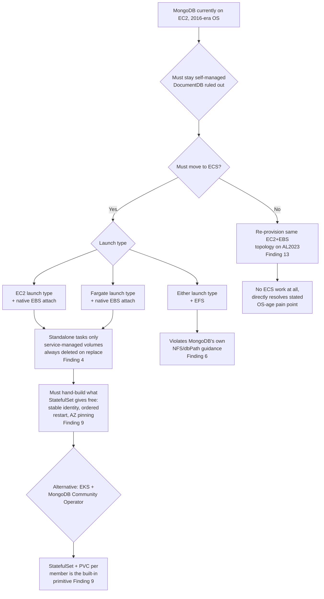
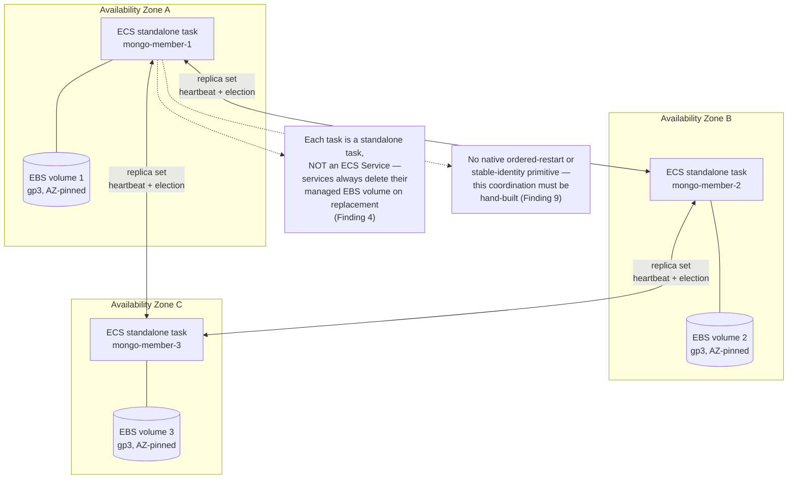

# SPIKE — Self-managed MongoDB on ECS: the disk/persistence problem

**Conducted by:** spike agent
**Date:** 2026-07-06
**Status:** Closed — DECISION: do NOT migrate MongoDB to ECS; the change is not justified (see § Decision).

---

## Decision (2026-07-06)

**Outcome: do nothing — MongoDB stays on its current EC2 topology. The migration to ECS is NOT pursued; the change does not justify itself.**

This is the engineer's decision, made after reviewing this spike's findings and the strategic analysis below. The reasoning that makes the alteration not worth it:

- **The migration does not deliver the goal that motivated it.** The stated aim was "no OS to maintain by hand." But self-managed MongoDB is a hard requirement (DocumentDB/Atlas ruled out — Finding 10), so the **engine** major-version upgrade (4 → 5 → 6 → 7) stays a manual, self-managed operation on any platform (§ Strategic analysis). And ECS EC2-launch does not even remove the host OS (Finding 7 context); only Fargate does, and that variant keeps the hardest part.
- **The cost is disproportionate to the benefit.** ECS has no StatefulSet-equivalent primitive (Finding 9): a MongoDB replica set on ECS requires hand-building stable per-member identity, per-member EBS attach/re-attach, AZ pinning, and ordered restart — machinery with no AWS/MongoDB reference architecture behind it (Finding 1). Service-managed EBS volumes are always deleted on task replacement (Finding 4), so the PgBouncer/Keycloak "2 identical tasks in a Service" precedent does not transfer to a stateful replica set.
- **The actual pain is already handled elsewhere.** The existing MongoDB migration plan (engine 4 → current, with the OS upgrades interleaved) already addresses the OS-age and version-currency concern on the current EC2/EBS topology, without taking on the ECS re-platforming.

This decision closes the spike. No `PLAN.md` is generated from it. The findings and strategic analysis are retained as the documented rationale, so a future session does not re-open the question without new information (e.g. AWS shipping a StatefulSet-equivalent for ECS — Finding 9's still-open roadmap request).

---

## Goal

4Shark has moved PgBouncer and Keycloak from EC2 to ECS. Both are stateless — two identical, interchangeable tasks. **MongoDB (backing the integrator's per-client databases) is the last piece of infrastructure still on EC2**, currently on a 2016-era operating system. The motivation for ECS migration is to stop maintaining that OS anywhere.

MongoDB is stateful, and the engineer's central question is: *"the process can run on ECS, but what about the disk? How does the disk work?"*

**A constraint is already decided and not re-litigated here**: AWS DocumentDB is ruled out by the engineer ("it doesn't have most of the functionality... we need self-managed MongoDB"). This spike documents, with citations, where DocumentDB's compatibility falls short (Finding 10), but the research target is **self-managed MongoDB on ECS**, not managed alternatives.

Questions this spike answers:

1. Is self-managed MongoDB on ECS/containers documented prior art in production, and is it treated as a recommended pattern or a caution?
2. How does the disk/persistence problem actually work on ECS — EC2 vs Fargate launch type, native EBS attachment mechanics, EFS viability, bind mounts?
3. How would a MongoDB replica set (stable identity + own volume per member) map onto ECS, given ECS's task model?
4. Why does DocumentDB not fit (compatibility gaps), for the record?
5. What does the realistic option landscape look like, including the non-ECS "just upgrade the OS" path?
6. What would a migration path from the current EC2 MongoDB look like?

---

## Methodology note (read before evaluating citations)

`WebFetch` was unavailable for every external domain tested in this research environment (`docs.aws.amazon.com`, `aws.amazon.com`, `www.mongodb.com`, `kubernetes.io`, `github.com`, `medium.com` all failed with "Unable to verify if domain is safe to fetch"; `example.com` succeeded, confirming the tool itself works but is domain-restricted here). All external findings below were therefore gathered via `WebSearch`, which fetches the source page internally and returns an attributed quote/snippet — but this environment gave no way to perform an independent second fetch to re-confirm each quote (Citation Discipline Rule 5, the self-check re-fetch, could not be executed).

Practical effect: every external citation below states the URL and the quote as returned by the search tool, but the "verification block" is weaker than a direct-fetch spike — it records what was retrieved and by what mechanism, not an independent re-confirmation. Where a claim only came from a single low-authority blog/SEO source with no primary-source corroboration, it is flagged as lower confidence or omitted. No source returned an outright fetch error under `WebSearch`, so nothing below is tagged `UNVERIFIED` in the strict sense — but treat the confidence as "search-tool-mediated," not "directly re-fetched," across every external Finding. All internal citations (4Shark's own prior spikes) are direct file reads and carry normal confidence.

---

## Sources consulted

- [AWS ECS — Use Amazon EBS volumes with Amazon ECS](https://docs.aws.amazon.com/AmazonECS/latest/developerguide/ebs-volumes.html) — core mechanics: one volume per task, new-volume-only, IAM role requirement
- [AWS ECS — Specify Amazon EBS volume configuration at deployment](https://docs.aws.amazon.com/AmazonECS/latest/developerguide/configure-ebs-volume.html) — deleteOnTermination default and the standalone-vs-service-managed distinction (the pivotal finding)
- [AWS News Blog — Amazon ECS supports a native integration with Amazon EBS volumes for data-intensive workloads](https://aws.amazon.com/blogs/aws/amazon-ecs-supports-a-native-integration-with-amazon-ebs-volumes-for-data-intensive-workloads/) — feature framing
- [AWS What's New — Amazon ECS and AWS Fargate now integrate with Amazon EBS (Jan 2024)](https://aws.amazon.com/about-aws/whats-new/2024/01/amazon-ecs-fargate-integrate-ebs/) — ships-date confirmation
- [AWS ECS — Use bind mounts with Amazon ECS](https://docs.aws.amazon.com/AmazonECS/latest/developerguide/bind-mounts.html) — EC2-launch-type host-tied persistence, no cross-instance sync
- [AWS ECS — Fargate task ephemeral storage](https://docs.aws.amazon.com/AmazonECS/latest/developerguide/fargate-task-storage.html) — non-persistent task storage limits
- [MongoDB — Operations Checklist for Self-Managed Deployments](https://www.mongodb.com/docs/manual/administration/production-checklist-operations/) — the NFS/dbPath warning
- [MongoDB — Add Members to a Self-Managed Replica Set](https://www.mongodb.com/docs/manual/tutorial/expand-replica-set/) — `rs.add()` mechanics
- [MongoDB — Force a Self-Managed Replica Set Member to Become Primary](https://www.mongodb.com/docs/manual/tutorial/force-member-to-be-primary/) — `rs.stepDown()` mechanics
- [MongoDB — Replica Sets Distributed Across Two or More Data Centers](https://www.mongodb.com/docs/manual/core/replica-set-architecture-geographically-distributed/) — AZ/DC distribution guidance
- [AWS DocumentDB — Compatibility with MongoDB](https://docs.aws.amazon.com/documentdb/latest/developerguide/compatibility.html) — subset-of-API framing
- [AWS DocumentDB — Functional differences: Amazon DocumentDB and MongoDB](https://docs.aws.amazon.com/documentdb/latest/devguide/functional-differences.html) — the detailed unsupported-feature list
- [Kubernetes — StatefulSets](https://kubernetes.io/docs/concepts/workloads/controllers/statefulset/) — the primitive ECS lacks
- [Kubernetes blog — Running MongoDB on Kubernetes with StatefulSets (2017)](https://kubernetes.io/blog/2017/01/running-mongodb-on-kubernetes-with-statefulsets/) — "conventional wisdom" framing
- [MongoDB Community Kubernetes Operator — architecture docs](https://github.com/mongodb/mongodb-kubernetes-operator/blob/master/docs/architecture.md) — one StatefulSet + PVC per replica set member
- [GitHub aws/containers-roadmap #1008 — Support StatefulSets in ECS](https://github.com/aws/containers-roadmap/issues/1008) — open feature request, opened 2020-08-03
- [GitHub aws/containers-roadmap #127 — ECS Stateful Services](https://github.com/aws/containers-roadmap/issues/127) — open feature request for per-task stable roles
- [ECS Workshop — Stateful Workloads module](https://ecsworkshop.com/stateful_workloads/) — AWS-authored workshop content contrasting EFS (cross-AZ) vs EBS (AZ-pinned)
- [endoflife.date — Amazon Linux](https://endoflife.date/amazon-linux) and [AWS blog — Update on Amazon Linux AMI end-of-life](https://aws.amazon.com/blogs/aws/update-on-amazon-linux-ami-end-of-life/) — EOL dates for the "just upgrade the OS" option
- See auxiliary: [`mongodb-on-ecs_research-notes_1.md`](./mongodb-on-ecs_research-notes_1.md) — full raw search material organized by topic, including community blog prior-art references (Medium/Terraform-module walkthroughs) not elevated to Findings below because they are not primary-source
- Internal — `~/.claude/plans/active/spike/integrator-stateful-services-fargate/SPIKE.md` — prior 4Shark spike, evaluated Fargate+EFS only, concluded against it
- Internal — `~/.claude/plans/active/spike/mongodb-integrator-daily-shutdown/SPIKE.md` — prior 4Shark spike, establishes the current 3-node PSS replica-set baseline

---

## Findings

### Finding 1 — Self-managed MongoDB on ECS is documented prior art, but AWS's own paired content favors DocumentDB, and MongoDB's own guidance favors Atlas or Kubernetes

**Evidence:** AWS's own Database Blog post pairing ECS with a MongoDB-API database is titled *"Deploy a containerized application with Amazon ECS and connect to Amazon DocumentDB (with MongoDB compatibility) securely"* — the AWS-authored "ECS + Mongo-API" story is written around DocumentDB, not self-managed MongoDB. Separately, community/blog-tier prior art for self-managed MongoDB on ECS does exist (Terraform modules, Medium walkthroughs using the official MongoDB image + EFS, or the Bitnami image for replica-set env-var configuration — cataloged in the auxiliary file) — so it is technically done, but not by AWS as its flagship pattern.

**Source:** https://aws.amazon.com/blogs/database/deploy-a-containerized-application-with-amazon-ecs-and-connect-to-amazon-documentdb-securely/ (title as returned by search)

**Significance:** There is no AWS-authored, primary-source reference architecture for "self-managed MongoDB on ECS" as a first-class pattern — every piece of prior art for that specific combination is community-tier (blog posts, Terraform Registry modules), not vendor-endorsed. This does not mean it cannot be done (Findings 2–7 show the mechanics exist), only that whoever builds it is assembling primitives AWS ships generically (ECS + EBS), not following an AWS or MongoDB reference architecture built for this exact case.

---

### Finding 2 — MongoDB's own official guidance treats a plain Docker/ECS deployment as a non-default path for production

**Evidence:** Search synthesis of MongoDB's Docker compatibility page and community guidance converged on: MongoDB's Kubernetes Operator with the enterprise image is the officially recommended containerized production path, and Atlas (managed) is presented as "the best way to use Docker with MongoDB" for a containerized application. A plain `mongod` container without the Operator is treated as a getting-started/dev pattern, not the production-recommended path.

**Source:** https://www.mongodb.com/compatibility/docker (as characterized by search synthesis; the specific sentence-level quote could not be independently re-verified given the Methodology Note above)

**Significance:** This is corroborating context, not a blocking fact — 4Shark's requirement is explicitly self-managed (DocumentDB and Atlas are both out), so "MongoDB recommends Atlas" is not actionable here. It does mean that running self-managed MongoDB well on ECS is 4Shark's own operational responsibility to get right (backup, HA, monitoring) rather than something MongoDB Inc. ships turnkey guidance for on this exact platform.

---

### Finding 3 — ECS's native EBS-volume integration: what it is, when it shipped, which launch types

**Evidence:**

> "Amazon ECS supports using Amazon Elastic Block Store (Amazon EBS) volumes with your ECS tasks... you can configure Amazon ECS to provision and attach Amazon EBS storage to your tasks running on both Amazon EC2 and Fargate."

This feature (native EBS attach for ECS tasks) is confirmed shipped in **January 2024** per the AWS "What's New" announcement, and it explicitly covers **both launch types** — EC2 and Fargate — not just one.

**Source:** https://docs.aws.amazon.com/AmazonECS/latest/developerguide/ebs-volumes.html ; date from https://aws.amazon.com/about-aws/whats-new/2024/01/amazon-ecs-fargate-integrate-ebs/

**Significance:** This is the key enabler the spike was asked to investigate. Before this feature, persistent block storage for an ECS task meant either an EC2-launch-type bind mount tied to a specific host instance (Finding 7) or EFS (Finding 6, with MongoDB's own NFS caveat). The native EBS integration is what makes "MongoDB on ECS with real block storage" a mechanically supported combination at all, on either launch type.

---

### Finding 4 — The constraints: one volume per task, must be new, AZ-pinned, and — the critical one — service-managed volumes are ALWAYS deleted on task termination

**Evidence:**

> "You can attach at most one Amazon EBS volume to each Amazon ECS task, and it must be a new volume. You can't attach an existing Amazon EBS volume to a task." (a snapshot of an existing volume can be used to seed a *new* volume at deploy time, but a live existing volume cannot be attached)

> "EBS volumes are specific to the Availability Zone that you create them in, and you must ensure that the instance that you want to attach your volume to is in the same Availability Zone." Fargate additionally cannot attach EBS in the `use1-az3` Availability Zone specifically.

> "Volumes that are attached to tasks that are managed by a service aren't preserved and are always deleted upon task termination." Only **standalone tasks** (not services) can override `deleteOnTermination` to `false` to preserve the volume; for tasks running under an ECS **Service**, the volume is deleted every time regardless of this setting, and a task replacement gets a brand-new empty (or snapshot-seeded) volume, never the live volume of the task it replaced.

**Source:** https://docs.aws.amazon.com/AmazonECS/latest/developerguide/ebs-volumes.html (attach constraint, AZ constraint) and https://docs.aws.amazon.com/AmazonECS/latest/developerguide/configure-ebs-volume.html (deleteOnTermination / standalone-vs-service distinction)

**Significance:** This is the single most consequential mechanical finding for the whole spike. **If MongoDB is deployed as an ECS *Service* (the natural choice for "keep N tasks running, replace on failure" — the same model 4Shark already uses for PgBouncer/Keycloak), the data volume is destroyed every time the task is replaced** — a deploy, a task health-check failure, a host reclaim, or an AZ event. Preserving data across a task replacement requires either (a) running MongoDB as a **standalone task** self-managed outside the Service construct (so `deleteOnTermination: false` can be set, and something/someone must re-attach that specific preserved volume to the next task manually or via automation), or (b) always seeding the new task's volume from a **snapshot** taken before the old task died — which is not the same as "the same live volume survives," and requires an external process to snapshot proactively (there is no automatic "snapshot on stop" built into the service). Either path is materially more operational machinery than the "2 identical stateless tasks" model that worked for PgBouncer and Keycloak.

---

### Finding 5 — Volume configuration knobs (relevant for MongoDB's WiredTiger I/O profile)

**Evidence:** EBS volumes attached to ECS tasks support `volumeType` (gp3 is the default; gp3/io1/io2 support explicit `iops`/`throughput`), `sizeInGiB`, with gp3 defaulting to 3,000 IOPS and up to 1,000 MiB/s of provisioned throughput.

**Source:** https://docs.aws.amazon.com/AmazonECS/latest/developerguide/configure-ebs-volume.html

**Significance:** The volume type/IOPS/throughput knobs map directly onto what a MongoDB `mongod` instance already needs to size correctly on a bare EC2 host with an attached EBS volume — nothing about ECS changes those sizing considerations; the task just needs a task definition that requests the equivalent of what the current EC2 instance's EBS volume already provides.

---

### Finding 6 — EFS as an alternative to EBS: technically wired up by AWS's own workshop content, but directly contradicted by MongoDB's own operational guidance

**Evidence:**

> MongoDB's own "Operations Checklist for Self-Managed Deployments": *"Avoid using NFS drives for your dbPath. Using NFS drives can result in degraded and unstable performance."*

Contrast with AWS's own ECS Workshop "Stateful Workloads" module, which uses EFS as the storage provider for a generic stateful-container-on-Fargate exercise, and states the trade-off explicitly: *"consuming volumes from an EFS file system allows you to work cross-AZ, while consuming volumes from an EC2 EBS disk ties the container to a specific AZ."*

**Source:** https://www.mongodb.com/docs/manual/administration/production-checklist-operations/ (MongoDB warning) and https://ecsworkshop.com/stateful_workloads/ (AWS workshop framing)

**Significance:** EFS is mechanically wireable to ECS (both launch types) and gets around the AZ-pinning and service-managed-deletion problems that plague EBS (Finding 4) — but it does so by using NFS, which MongoDB's own documentation explicitly warns against for the data directory. Community prior art (the Brett Namba blog, the "Streamlining MongoDB Deployment" Medium post, both cataloged in the auxiliary notes) shows people running MongoDB-on-ECS-with-EFS anyway, but that is going against MongoDB's own stated guidance, not a validated pattern MongoDB Inc. endorses. 4Shark's own prior spike (`integrator-stateful-services-fargate/SPIKE.md`, evidence E5) reached the same conclusion independently by a different route (cost + latency, not the NFS warning specifically): *"MongoDB is designed for local SSD. EFS is NFS-based — higher latency, different IOPS characteristics. Acceptable for low-throughput workloads, but not ideal."*

---

### Finding 7 — EC2-launch-type bind mounts: durable, but pins the task to one specific host instance

**Evidence:**

> "With bind mounts, a file or directory on a host, such as an Amazon EC2 instance, is mounted into a container. The host parameter is used to tie the lifecycle of the bind mount to the host Amazon EC2 instance, rather than the task... If the host parameter contains a sourcePath file location, then the data volume persists at the specified location on the host Amazon EC2 instance until you delete it manually."

> "Amazon ECS doesn't sync your storage across Amazon EC2 instances. Tasks that use persistent storage can be placed on any Amazon EC2 instance in your cluster that has available capacity. If your tasks require persistent storage after stopping and restarting, always specify the same Amazon EC2 instance at task launch time with the AWS CLI start-task command."

**Source:** https://docs.aws.amazon.com/AmazonECS/latest/developerguide/bind-mounts.html

**Significance:** This is the pre-2024 mechanism (predates native EBS attach) and it works, but it converts the ECS cluster's EC2 fleet into something closer to "one pet host per MongoDB member" — task placement must be manually pinned to a specific instance ID (via `start-task`, not a Service's automatic placement), which defeats most of the operational benefit ECS is supposed to bring versus just running MongoDB directly on that EC2 instance. Not the primary path worth pursuing given the newer native EBS integration exists, but relevant as the "old way" baseline.

---

### Finding 8 — Fargate ephemeral storage is not a persistence option at all (context, not a live option)

**Evidence:** Fargate tasks get 20 GiB of ephemeral storage by default (configurable up to 200 GiB), and this is explicitly non-persistent: *"Ephemeral storage is non-persistent storage, which makes it unsuitable for workloads requiring persistent data storage like databases."*

**Source:** https://docs.aws.amazon.com/AmazonECS/latest/developerguide/fargate-task-storage.html

**Significance:** Rules out "just run MongoDB on Fargate with its default storage" outright — any Fargate-based option for MongoDB requires the native EBS attach (Finding 3) or EFS (Finding 6); there is no third Fargate-native persistence path.

---

### Finding 9 — ECS has no StatefulSet-equivalent primitive; this is a known, still-open AWS gap, not a documentation omission

**Evidence:**

> GitHub `aws/containers-roadmap` issue #1008, "[ECS] Support StatefulSets in ECS," opened 2020-08-03, still **open**: requests a StatefulSets equivalent of EKS in the ECS world, where (verbatim) "each has a persistent identifier that it maintains across any rescheduling."

> GitHub `aws/containers-roadmap` issue #127, "[ECS]: ECS Stateful Services," open: requests a service type where tasks can be assigned stable roles — *"specific Tasks play a special role such as 'primary' or 'leader'"* — with an identity that survives task replacement.

Contrast with Kubernetes' own definition of what a StatefulSet actually guarantees: *"stable, unique network identifiers, stable persistent storage, ordered graceful deployment and scaling, and ordered automated rolling updates."* The MongoDB Community Kubernetes Operator relies on exactly this: *"the Kubernetes Operator deploys each resource as a StatefulSet... Pods are defined as StatefulSets so they benefit from stable identities,"* with one Persistent Volume Claim generated per pod per replica-set member, and the Operator deliberately blocking Kubernetes' native rolling-upgrade mechanism because unordered restarts "can trigger multiple re-elections."

**Source:** https://github.com/aws/containers-roadmap/issues/1008, https://github.com/aws/containers-roadmap/issues/127, https://kubernetes.io/docs/concepts/workloads/controllers/statefulset/, https://github.com/mongodb/mongodb-kubernetes-operator/blob/master/docs/architecture.md

**Significance:** This is the material structural finding the engineer asked to have surfaced explicitly. A MongoDB replica set is not "N identical interchangeable tasks" (the PgBouncer/Keycloak model) — each member needs a stable identity (hostname in the replica set config) and its own persistent volume, and the set as a whole needs ordered, one-at-a-time restarts to avoid triggering repeated elections. Kubernetes has a first-class primitive built for exactly this shape (StatefulSet + per-pod PVC + ordered rollout); ECS has no equivalent primitive, and AWS customers have been asking for one since at least 2020 with no resolution. Anything built on ECS for this must **manually simulate** what a StatefulSet gives for free: distinct task definitions or distinct standalone tasks per replica-set member (each with its own named EBS volume and a fixed AZ), a custom mechanism for one-at-a-time restart ordering, and a way to keep each member's stable network identity across replacement (service discovery / static DNS per member, not a shared Service DNS name).

---

### Finding 10 — DocumentDB's MongoDB-API compatibility gaps (for the record, per the engineer's request to document the reasoning)

**Evidence:** AWS's own functional-differences documentation lists (not exhaustive, the categories that matter most for a general-purpose OLTP workload):

- **Unsupported/limited features:** capped collections, map-reduce, GridFS, text indexes, vector search indexes, partial indexes, case-insensitive indexes, time-series collections, on-demand materialized views, client-side field level encryption, queryable encryption.
- **Unsupported commands:** `collMod`, `collMod:expireAfterSeconds`, `copydb`, `createView`, `filemd5`, `reIndex`, `connPoolStats`, `dbHash`, `features`, `getLastError`, `getPrevError`, `parallelCollectionScan`, `resetError`, `endSessions`, `killAllSessionsByPattern`, `refreshSessions`, and sharding commands other than `enableSharding`/`shardCollection`.
- **Unsupported query operators:** `$expr`, `$jsonSchema`, `$text`, `$where`, `$meta`, `$box`, `$center`, `$centerSphere`, `$polygon`, `$near`, `$uniqueDocs`.
- **Transactions:** *"can be indeterminate and 'ambiguous'"* — a transaction affected by a timeout or node failure returns an error that cannot distinguish success from failure; transactions are scoped to a single primary node only; no retryable writes; cannot create new collections inside a transaction.
- **Change streams:** no DDL events (drop/rename/dropDatabase); cannot open a change stream against a non-primary node.

**Source:** https://docs.aws.amazon.com/documentdb/latest/devguide/functional-differences.html and https://docs.aws.amazon.com/documentdb/latest/developerguide/compatibility.html

**Significance:** This substantiates the engineer's stated reasoning ("doesn't have most of the functionality... nothing fits") with specifics on the record: DocumentDB implements a compatibility-layer subset of the MongoDB wire protocol, not the actual MongoDB engine, and the transaction-ambiguity behavior in particular is a correctness concern (an application cannot reliably tell whether a transaction committed), not merely a missing convenience feature. This spike does not evaluate whether the integrator's actual current MongoDB usage hits any of these specific gaps (that would require a separate codebase audit against this list) — it only records the gap catalog the engineer's decision is based on.

---

### Finding 11 — Migration mechanics: replica-set-based migration is a standard, well-documented technique, independent of the destination platform

**Evidence:** MongoDB's own tutorial: *"Use rs.add() to add the new member to the replica set. You can only add members while connected to the primary."* Community guidance (corroborated across multiple independent walkthroughs) adds the new member with `priority: 0, votes: 0` until it finishes initial sync, monitors it until it reaches `SECONDARY` state, then issues `rs.stepDown()` (or `replSetStepDown`) on the old primary — which, without `force: true`, *"nominates an eligible secondary to call an election immediately."* Old members are removed once traffic has fully shifted to the new ones.

**Source:** https://www.mongodb.com/docs/manual/tutorial/expand-replica-set/, https://www.mongodb.com/docs/manual/tutorial/force-member-to-be-primary/ (mechanics); community corroboration at https://mschmitt.org/blog/mongodb-migration-replicaset/ and https://eng.blackbuck.com/mongodb-cluster-migration-with-zero-downtime/ (cross-infrastructure walkthroughs, blog-tier, not primary-source)

**Significance:** The migration mechanism itself is platform-agnostic and low-risk in principle: add-member/sync/step-down is the same technique whether the new member lands on a new EC2 instance, an ECS standalone task with an attached EBS volume, or a different cloud entirely. The risk in a MongoDB→ECS migration is not "does MongoDB support this kind of migration" (it does, natively) — it is entirely in **whether the ECS-hosted destination member can hold a stable-enough identity and reliable-enough storage for the sync + cutover window**, which is exactly the open questions in Finding 4 and Finding 9.

---

### Finding 12 — HA distribution guidance: MongoDB expects members spread across ≥3 AZs/data centers

**Evidence:** MongoDB's official geographically-distributed replica set guidance recommends distributing members so that the loss of any single data center/AZ still leaves a majority able to elect a primary — e.g., for a 3-member set, one member per data center; for a 5-member set, 2/2/1 across three data centers.

**Source:** https://www.mongodb.com/docs/manual/core/replica-set-architecture-geographically-distributed/

**Significance:** Combined with Finding 4 (EBS volumes are AZ-pinned, and a task must be scheduled in the same AZ as its volume), this means each replica-set member's ECS task effectively needs a **fixed AZ assignment** enforced via task placement constraints — the same shape of manual pinning the "old way" bind-mount approach required (Finding 7), just at the AZ level instead of the specific-instance level. This is materially different from PgBouncer/Keycloak, where either of the 2 identical tasks can land in any AZ with no correctness implication.

---

### Finding 13 — "Just upgrade the OS" is a real, independent minimal-path option that does not require ECS at all

**Evidence:** Amazon Linux 1 (the 2016-era AMI line) reached end-of-life 2023-12-31 (no further security updates); Amazon Linux 2 reaches end-of-life 2026-06-30; AWS's own recommended migration path is to Amazon Linux 2023 (AL2023), supported until 2029.

**Source:** https://endoflife.date/amazon-linux and https://aws.amazon.com/blogs/aws/update-on-amazon-linux-ami-end-of-life/

**Significance:** The stated pain point ("2016-era OS," unmaintained) can be resolved by re-provisioning the same EC2/EBS replica-set topology on a current AMI (AL2023) without touching ECS, EBS-attach mechanics, or the StatefulSet gap at all. This is not what the engineer asked to pursue (the stated goal is "everything on ECS"), but it is the option that most directly and narrowly addresses the literal complaint in the prompt, and is included here per the requirement to keep the option landscape honest.

---

### Finding 14 — 4Shark's own prior spike already evaluated (and rejected) Fargate+EFS for this exact MongoDB — but did not evaluate native EBS attach

**Evidence:** `~/.claude/plans/active/spike/integrator-stateful-services-fargate/SPIKE.md:119` — *"Architecture verdict: MongoDB on Fargate + EFS is technically viable but not recommended."* And `SPIKE.md:194-199` — the final recommendation: *"MongoDB → stays on EC2 (recommended)... The EC2 stop/start pattern (already implemented for AlmaViva) is the correct solution: EBS volumes persist data across stop/start cycles at no additional cost... Local SSD performance vs EFS NFS."*

That prior spike's Method section (`SPIKE.md:37-44`) lists its research scope as ElastiCache stop/pause capability, Redis-on-Fargate, and *"MongoDB on ECS Fargate with ephemeral storage"* / EFS — it does not mention the native ECS↔EBS volume-attachment feature (which had already shipped, January 2024, well before that spike's March 2026 date) as an option it considered.

**Source:** `~/.claude/plans/active/spike/integrator-stateful-services-fargate/SPIKE.md` (internal file, direct read)

**Significance:** The prior spike's "MongoDB should remain on EC2" conclusion was reached by ruling out EFS specifically (cost + NFS latency), not by evaluating the EBS-attach mechanism this current spike investigates. That prior conclusion is not automatically superseded — Finding 4's service-managed-volume-deletion problem and Finding 9's missing-StatefulSet problem are new obstacles of their own — but the reasoning chain that produced "stay on EC2" did not consider the option this spike was asked to investigate, so it should not be cited as having already closed this question.

---

## Diagrams

### Option decision tree

### Replica-set-on-ECS topology (EC2 launch type + native EBS attach, the path this spike was asked to investigate)

---

## Trade-offs surfaced

| Approach | Pros | Cons | Source (Finding) |
|---|---|---|---|
| **EC2-launch-type ECS + native EBS attach** (per-member standalone task) | Real block storage, gp3/io1/io2 with configurable IOPS/throughput; same durability model as current EC2+EBS; both launch types supported since Jan 2024 | Must run as standalone tasks (not a Service) to avoid automatic volume deletion on replacement; one volume per task, can't reattach a live existing volume; AZ-pinned — task placement must be manually constrained per member; no built-in ordered-restart/stable-identity primitive — must hand-build the StatefulSet-equivalent coordination | Findings 3, 4, 5, 9, 12 |
| **Fargate + native EBS attach** | Same EBS mechanics as EC2 launch type, no EC2 host fleet to manage/patch | Same standalone-task / AZ-pinning / no-StatefulSet caveats as EC2 launch type, on top of Fargate's own constraints (e.g., `use1-az3` unsupported for EBS attach) | Findings 3, 4, 9 |
| **EFS (either launch type)** | Sidesteps AZ pinning (cross-AZ) and the service-managed-deletion problem entirely — a shared, always-available filesystem | Directly contradicts MongoDB's own dbPath/NFS guidance ("can result in degraded and unstable performance"); 4Shark's own prior spike independently reached the same "not ideal" conclusion on cost + latency grounds | Finding 6 |
| **EC2 launch type + bind mount (pre-2024 mechanism)** | Durable, tied to a specific EC2 host, works today with no dependency on the 2024 EBS feature | Requires manually pinning task placement to one specific instance ID via `start-task`; ECS does not sync storage across instances — effectively "pet hosts," undermining much of ECS's operational value | Finding 7 |
| **Stay on EC2, upgrade AMI only (AL2023)** | Directly resolves the stated pain (unmaintained 2016-era OS) with the least new moving parts; no new orchestration model to build | Does not consolidate onto ECS; 4Shark keeps one more platform (EC2 fleet) to operate alongside the ECS estate | Finding 13 |
| **EKS + MongoDB Community Operator (StatefulSets)** | The purpose-built primitive for exactly this shape: stable identity, per-member PVC, ordered rollout, all handled by Kubernetes natively — what 4Shark would otherwise hand-build on ECS | New platform/skillset (Kubernetes) alongside the existing ECS estate; real adoption cost or duplicated orchestration model | Finding 9 |
| **MongoDB Atlas (managed, full MongoDB)** | Full MongoDB feature set, no self-managed HA/backup/patching burden | Out of scope per the engineer's explicit self-managed requirement — included only for landscape completeness | Finding 1 (contextual) |
| **AWS DocumentDB (managed)** | Fully managed, deep AWS integration | Already ruled out — subset-of-MongoDB-API, ambiguous transaction semantics, missing operators/commands (Finding 10) | Finding 10 |

---

## What remains uncertain

- No primary-source (AWS or MongoDB) reference architecture exists for "self-managed MongoDB replica set on ECS with native EBS attach" specifically — every piece of prior art found is either community blog-tier, or (for the EBS-attach feature itself) generic/non-database-specific AWS documentation. Whether the standalone-task-plus-manual-coordination approach sketched in the topology diagram above has actually been run in production by anyone, at any real MongoDB write volume, was not established by this research.
- Not found: a documented account of anyone combining the **native ECS↔EBS attachment** feature (as opposed to EFS or pre-2024 bind mounts) specifically with **MongoDB**. The community prior art found (Namba blog, Medium/Terraform-module walkthroughs) predates or does not reference the native EBS-attach mechanism and uses EFS or the Bitnami image instead.
- This spike did not audit whether the integrator's actual MongoDB usage (models, aggregation pipelines, transactions) intersects any of the specific DocumentDB gaps in Finding 10 — that would require a dedicated codebase audit, separate from this platform-focused spike, if DocumentDB were ever reconsidered.
- Exact current EC2 instance type / provisioned EBS IOPS-throughput for the existing MongoDB nodes were not looked up in this spike (out of scope — this was external/documentation research, not an AWS account inventory pass); sizing the ECS task definition's EBS request to match would need that data.
- The "how does a service discover a stable per-member hostname across task replacement" question (needed so replica-set config doesn't have to be manually edited every time a task is replaced) has no ECS-native answer surfaced by this research — Cloud Map / ECS Service Discovery exists generically but was not evaluated here for whether it can be pinned to a specific *task slot* the way a StatefulSet pod ordinal (`mongo-0`, `mongo-1`, `mongo-2`) can.

---

## Suggested options for main and the engineer

- **Option A — EC2-launch-type ECS + native EBS attach, one standalone task per replica-set member.** Matches the "everything on ECS" goal. Requires building, by hand, what a StatefulSet gives natively: per-member task definitions with fixed AZ placement, a coordination mechanism for ordered restarts, and a stable per-member network identity strategy (since these are standalone tasks with `deleteOnTermination: false`, not an ECS Service). Closest to the current architecture's persistence model (block storage, AZ-pinned), since it mirrors what already exists on EC2+EBS today.
- **Option B — Fargate + native EBS attach**, same caveats as A, trading EC2 host management for Fargate's own constraints (AZ restriction on certain zones, standalone-task requirement still applies).
- **Option C — EKS + MongoDB Community Operator.** Uses the primitive purpose-built for this exact problem (StatefulSet + PVC per member), at the cost of introducing a second container orchestration platform (Kubernetes) alongside the existing ECS estate.
- **Option D — Stay on EC2, upgrade to a current AMI (AL2023).** Directly and minimally resolves the stated pain (2016-era, unmaintained OS) without any new orchestration model. Leaves MongoDB off the "everything on ECS" umbrella.
- **Option E — EFS-backed MongoDB on ECS (either launch type).** Mechanically the easiest to wire up (no AZ pinning, no service-managed-deletion problem) but runs against MongoDB's own explicit operational guidance against NFS for the data directory, and against 4Shark's own prior spike's independent conclusion on this exact system.

This spike takes no position among these — Findings 4 and 9 are the two facts most likely to change which option the engineer picks, since they are the ones that differ MongoDB's ECS story from the PgBouncer/Keycloak precedent the migration effort is modeled on.

---

## Strategic analysis — is the hand-rolled ECS work worth it, and under what conditions?

This section records the strategic framing that emerged in discussion with the engineer after the initial research. Unlike the Findings above (external, cited research), this is 4Shark-internal reasoning about whether to *act* on those findings. It is a conditional recommendation for the engineer's decision, not a directive.

### The real distinction is responsibility for the OS lifecycle, not "OS vs no OS"

The pain being solved is not "an OS exists" — it is that **the host OS lifecycle is 4Shark's manual responsibility**. On EC2, a version upgrade never happens unless someone manually tests, backs up, and migrates; the machine sits on a stale OS indefinitely by default. On ECS/Fargate, that lifecycle shifts to AWS: accept the new AMI/patch and roll it, and for many services this is zero-downtime. The shift is fullest on **Fargate** (no host OS at all); on **ECS EC2-launch** it is "accept + roll the new AMI onto the container instances" (Bottlerocket automates the remainder) — still far less than in-place patching a pet host. This responsibility shift is the permanent, real win the migration buys, and it applies to the last piece of 4Shark infrastructure not yet on ECS.

### The boundary of that win: the MongoDB engine version stays self-managed

"Just accept AWS's patch" applies to the **host OS and container runtime** — NOT to the **MongoDB engine major version** (4 → 5 → 6 → 7). Because self-managed MongoDB is a hard requirement (DocumentDB and Atlas both ruled out — Finding 10), the engine major upgrade remains 4Shark's own operation regardless of platform. Renovate delivers **patch-within-major** automatically (an image-tag bump, e.g. 4.4.x → 4.4.y — the same mechanism already used for pgbouncer/keycloak). What Renovate cannot do safely on its own is **cross a major boundary**: `featureCompatibilityVersion` must be set to N-1 before the jump, majors cannot be skipped (4 → 5 → 6, never 4 → 6), and the app's Mongoid driver must move in lockstep. Moving to ECS does **not** make the Mongo 4 → 7 debt automatic — that expectation would be wrong.

### The strongest argument FOR the migration, in the engineer's own terms

The dreaded engine-upgrade sequence interleaves OS migrations: `Mongo 4 → latest 4 → migrate the OS → 5 → 6 → migrate the OS again`. If MongoDB already runs on ECS/Fargate, **every "migrate the OS" step disappears** from that sequence — there is no host OS left to migrate. The ECS move therefore *shortens the very migration being dreaded*. And since the Mongo 4 → current upgrade must be done by hand regardless (the engine is years behind), that forced migration is the natural moment to pay the one-time cost of landing on ECS and never touch a host OS again.

### What changes the cost calculus: AI carrying the manual work

The initial research weighed "is the hand-rolled StatefulSet-equivalent (Finding 9) worth it?" implicitly against **human** labor, and concluded it was hard to justify. With AI carrying both the one-time build (standalone tasks, per-member EBS attach/re-attach, stable identity, ordered restart) and the ongoing coordination, that labor cost drops materially — and the permanent host-OS win becomes worth more relative to it. The absence of an ECS StatefulSet primitive is still real work that must be built and maintained; it is simply no longer the human-labor bottleneck it would have been, which flips the earlier "does not pay off" read toward "conditionally worth it."

### The guardrail: automation level must differ by layer

"AI does the minimum every day" is the right *cadence* philosophy — small continuous updates beat years of accumulated debt (which is exactly how the Mongo-4 situation arose). But the automation **level** must differ by layer:

- **Stateless / image / Renovate layer** (keycloak, pgbouncer, app dependencies): a bad update rolls back with the image, zero data risk → safe to automate largely unattended, behind the existing 7-day minimum-release-age gate.
- **Stateful engine major upgrade** (the replica set): a set that has crossed the `featureCompatibilityVersion` boundary with data written cannot be auto-rolled-back → must run behind an **explicit human go + backup + tested rollback**, never unattended on live data. This is the same discipline already applied to productive app deploys (queue check, no-processing window).

The cadence philosophy is correct for both; the safety envelope is tighter for the engine.

### Conditional conclusion

Migrating MongoDB to ECS is worth the hand-rolled StatefulSet-equivalent work **when both conditions hold**: (a) AI carries the one-time build and the ongoing coordination, and (b) the forced Mongo 4 → current migration is executed as the *same* effort, so the cost is paid once during work that must happen anyway. The migration buys a **permanent end to manual host-OS lifecycle** for the last non-ECS piece of infrastructure, and shortens the engine-upgrade migration by removing every interleaved OS step. It does **not** buy automatic engine upgrades — those remain a gated, human-authorized process (now with AI doing the continuous minimum instead of years of accumulation). Fargate + native EBS attach is the variant that most fully delivers the "no host OS anywhere" goal; ECS EC2-launch delivers most of it with a residual "roll the AMI" step. Option D (stay on EC2, AMI-only) is the fallback that resolves the literal OS-age pain without the ECS work, but it leaves the host-OS lifecycle partly manual and keeps one more platform in the estate.

**Decision taken (2026-07-06): the alteration was judged NOT justified — MongoDB stays on EC2 and the ECS migration is not pursued. This conditional case is retained as the input the decision weighed, not as an open recommendation. See § Decision at the top of this document for the recorded outcome and reasoning.**

---

## Next Steps

- If the engineer wants to proceed with Option A or B: this would move to a `PLAN.md` (or a further, narrower spike) that (a) inventories the current EC2 instance types/EBS IOPS to size the ECS task definitions, (b) designs the per-member stable-identity mechanism (static Cloud Map entries per task slot, or another approach), and (c) designs the ordered-restart coordination the StatefulSet gap leaves unaddressed.
- If Option C (EKS): would need its own spike on EKS adoption cost/operational fit for 4Shark, since this would be the first Kubernetes-based platform in the estate.
- If Option D: no further spike needed — this is a standard AMI-upgrade operation on the existing EC2/EBS topology.
- Either way, the migration mechanics in Finding 11 (add-member → sync → step-down) apply regardless of which destination option is chosen.

---

> **What is a Spike?** A time-boxed research task aimed at reducing uncertainty. The goal is fact-finding, not decision-making. A spike may lead to a PLAN.md (implementation), an ADR (architecture decision), or simply documented knowledge for future reference.
>
> **Further reading:**
> - [Spikes - Scaled Agile Framework](https://framework.scaledagile.com/spikes)
> - [Technical Spike - Microsoft Engineering Fundamentals Playbook](https://microsoft.github.io/code-with-engineering-playbook/design/design-reviews/recipes/technical-spike/)
