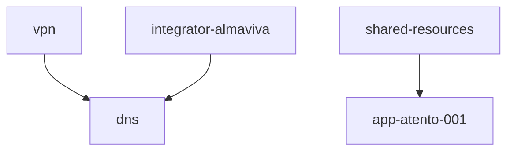

# SPIKE — Terraform Repository Documentation Best Practices

**Conducted by:** Research Agent
**Date:** 2026-02-28
**Last updated:** 2026-03-13
**Status:** Complete — all decisions resolved, ready for PLAN.md

---

## Goal

Determine the most effective documentation practices for the 4Shark Terraform monorepo, covering:

1. What documentation exists and where the gaps are
2. Whether and how to use terraform-docs for auto-generated module READMEs
3. What architecture diagrams to create and with which tools
4. How to document relationships between environments, modules, and states
5. Whether ADRs make sense for this repository
6. What operational runbooks are worth maintaining
7. How to prevent documentation from going stale

---

## Method

- Full inspection of the repository at `/Users/plribeiro3000/Projects/4Shark/terraform`
- Web searches covering official HashiCorp guidance, community best practices, and tool comparisons
- Cross-referenced findings across at least 6 independent sources per topic area
- Repository re-inspected on 2026-03-13 to update current state

---

## Current State (2026-03-13)

### Repository Scale

| Metric | Value (2026-02-28) | Value (2026-03-13) | Delta |
|--------|--------------------|--------------------|-------|
| Modules (`modules/`) | 23 | 26 | +3 |
| Root stacks (Terramate) | 16 | 19 | +3 |
| Environment stacks (`app-*`) | 5 | 5 | — |
| Integrator stacks | 6 | 6 | — |
| Infrastructure stacks | 5 | 8 | +3 |

New modules added: `cloudflare_zone_security`, `networking_data`, `vpc_data`.

New stacks added: `identity`, `monitoring`, `networking`.

### Documentation File Tree

```
terraform/
├── CHANGELOG.md                    ✅ well-maintained
├── SECURITY.md                     ✅ security policy, break glass model summary
├── docs/
│   └── runbooks/
│       └── BREAK-GLASS.md          ✅ emergency access procedures
├── identity/
│   └── README.md                   ✅ first stack-level README — high quality, serves as template
├── modules/
│   ├── vpc/README.md               ✅ auto-generated (terraform-docs), complete, has examples/
│   ├── internal_alb/README.md      ⚠️  hand-written, in Portuguese
│   ├── public_alb/README.md        ⚠️  hand-written, in Portuguese
│   └── [23 other modules]          ❌ no README
└── [18 other stacks]               ❌ no README
```

**Root README**: ❌ does not exist
**Architecture diagrams**: ❌ none (no `.dot`, `.png`, `.svg` anywhere)
**terraform-docs config**: ❌ no `.terraform-docs.yml`
**ADRs**: ❌ no `docs/adr/` directory
**CI documentation checks**: ❌ not configured

### What Is Done Well

1. **CHANGELOG.md** is well-maintained with consistent, user-facing language
2. **Terramate stack definitions** — all 19 stacks have `name`, `description`, `id`, and `tags` in `stack.tm.hcl`; this is the most complete machine-readable documentation in the repo
3. **`tfvars` files are committed** for all environment stacks — valuable configuration documentation
4. **`identity/README.md`** sets an excellent quality bar for stack-level documentation; can serve as template
5. **`docs/runbooks/BREAK-GLASS.md`** establishes the `docs/runbooks/` directory structure
6. **`SECURITY.md`** is a concise security policy at repository root
7. **Variable descriptions** are generally present in recently written modules (`rds_instance`, `rds_aurora_cluster`, `ecs_service`, `public_alb`, `internal_alb`)

### Known Quality Issues in Existing Files

- **`vpc/README.md`** — source URL points to an external elvenworks repository instead of the local module. Must be corrected.
- **`vpc` module** — variables `route_table_routes_private` and `route_table_routes_public` have no `description`. Must be filled in before terraform-docs generates the README.
- **`ecs_cluster` module** — variable descriptions mix English and Portuguese (e.g., `"ID da VPC"`, `"Subredes para rodar as instâncias"`, `"Nome da role ECS"`). Must be translated to English.
- **`internal_alb/README.md` and `public_alb/README.md`** — written in Portuguese. Must be translated to English.

### Stack Dependency Model

The `dns` stack declares `after` blocks in its `stack.tm.hcl` listing all integrator stacks and the VPN stack. This is **deploy-time ordering only** — there are no `terraform_remote_state` data sources in the repository. Stacks do not read each other's outputs at configuration time; they use hardcoded or `tfvars`-provided values. The stack dependency diagram in the root README will reflect Terramate orchestration order, not data flow.

### What Is Missing

1. **Root README** — no entry point explaining how the infrastructure works as a system
2. **Root architecture diagrams** — no visual of networks, VPN, DNS, ECS, or stack dependencies
3. **Stack READMEs** — 18 of 19 stacks have no README (only `identity` has one)
4. **Stack architecture diagrams** — no per-stack visual of what each stack creates
5. **Integrator stack client details** — each integrator serves a specific client; that context (network CIDR, number of servers, client-specific notes) is not documented anywhere
6. **Module READMEs** — 23 of 26 modules have no README
7. **Language inconsistency** — `internal_alb` and `public_alb` READMEs are in Portuguese; `ecs_cluster` variable descriptions mix English and Portuguese
8. **ADRs** — key architectural decisions (Terramate, network CIDR allocation, S3 state backend, identity model) are not recorded
9. **Runbooks** — only break glass runbook exists; missing: adding new integrator client, emergency single-stack apply, state recovery
10. **terraform-docs config** — no `.terraform-docs.yml` to enable module README generation
11. **CI checks** — no automated format or syntax validation on PRs

---

## Decisions (resolved 2026-03-13)

### Diagram tool: Mermaid

Diagrams are written as Mermaid code blocks directly inside each `README.md`. GitHub renders them natively — no tooling, no generated files, no binary commits.

**How it works:**

````markdown

````

**Update flow**: edit the Mermaid block in the README → commit. GitHub renders the updated diagram automatically.

**Why Mermaid over the alternatives:**

| Tool | Decision |
|------|----------|
| **Mermaid** | ✅ Chosen — GitHub native rendering, no tooling, single file, text-diffable in PRs |
| Graphviz DOT | ❌ Requires generating PNG, committing two files, running `dot` command locally |
| Terramaid | ❌ Auto-generates from `.tf` but becomes unreadable with 45+ resources |
| terraform graph + Graphviz | ❌ Output is noisy, not suitable for documentation as-is |
| Rover | ❌ Interactive HTML only, cannot be embedded in READMEs |
| Blast Radius | ❌ Incompatible with Terraform 1.x. Abandoned. Do not use. |
| Pluralith | ❌ Commercial SaaS |
| draw.io / Excalidraw | ❌ GUI tools, not version-controllable as source |

Terramaid was specifically evaluated because it generates Mermaid from Terraform code automatically. Rejected for documentation use: with complex stacks it produces unreadable diagrams. Diagrams here are written manually to control exactly what level of detail is shown.

### Pre-commit hooks: rejected

Pre-commit breaks the commit flow and has been tried and abandoned in multiple previous projects. Not adopted. CI enforcement covers the gap.

### CI enforcement: format + validate only

PRs run `terraform fmt --check` and `terraform validate`. No `plan`, no `apply`, no AWS credentials required. All checks are static.

### terraform-docs: adopt for modules

Module READMEs are generated and kept in sync via terraform-docs. Configuration stored in `.terraform-docs.yml` at repository root.

**Recommended `.terraform-docs.yml`:**

```yaml
formatter: markdown table

output:
  file: README.md
  mode: inject
  template: |-
    <!-- BEGIN_TF_DOCS -->
    {{ .Content }}
    <!-- END_TF_DOCS -->

settings:
  anchor: true
  color: true
  default: true
  description: true
  escape: true
  html: true
  indent: 2
  required: true
  sensitive: true
  type: true

sort:
  enabled: true
  by: name

recursive:
  enabled: true
  path: modules
  include-main: false
```

Running `terraform-docs .` from the repository root with `recursive.enabled: true` processes all modules under `modules/` in a single pass.

### ADRs: adopt MADR format

ADRs stored in `docs/adr/`, numbered sequentially: `ADR-001-state-backend.md`, `ADR-002-terramate.md`, etc.

**MADR template:**

```markdown
# ADR-NNN: Title

**Date:** YYYY-MM-DD
**Status:** Accepted

## Context
[Why this decision was needed]

## Options Considered
- Option A
- Option B
- Option C

## Decision
[Which option was chosen]

## Rationale
[Why this option over the others]

## Consequences
[What this decision requires or implies going forward]
```

**ADR-worthy decisions for this repository:** state backend and locking strategy, network topology (CIDR allocation), module organization (monorepo), orchestration tool (Terramate), identity model, naming conventions.

---

## Documentation Vision

The repository should allow any engineer to open the root README and immediately understand how the entire 4Shark infrastructure works — without having to read code. Individual stack READMEs provide the detail for each piece.

**Level 1 — Repository root README**: A comprehensive explanation of the infrastructure as a system:
- How the networks are structured (VPCs, CIDRs, regions — Brazil vs USA)
- How the VPN works and which networks are reachable through it
- How ECS applications are deployed and how they run
- How DNS works: internal resolution via Route53, external via Cloudflare, which stack manages each, and what Cloudflare rules exist
- How all 19 stacks relate to each other

**Level 2 — Per stack**: Every stack gets a `README.md` explaining what it manages and its specific configuration, plus an architecture diagram as a Mermaid block embedded in the README. Integrator stacks additionally include: client name, VPC CIDR, number of servers, and any client-specific notes.

**Level 3 — Per module**: Every module under `modules/` gets a `README.md` with inputs, outputs, and a usage example. Generated by terraform-docs.

---

## Implementation Plan

Documentation is built **bottom-up**: individual stacks first, root last. The root README and diagrams are written after all stacks are documented, so the macro view is grounded in real, verified information.

### Phase 1 — Tooling foundation

1. Add `.terraform-docs.yml` at repository root — enables module README generation
2. Fix language inconsistencies: translate `internal_alb/README.md`, `public_alb/README.md`, and `ecs_cluster` variable descriptions to English

### Phase 2 — Individual stack documentation (micro)

Every stack gets a `README.md` with an architecture diagram as a Mermaid block embedded directly in the file.

**Integrator stacks** — 6 stacks, one per client. Each README includes: client name, VPC CIDR, number of servers, client-specific notes, and a Mermaid architecture diagram.

| Stack | Client |
|-------|--------|
| `integrator-almaviva` | Almaviva |
| `integrator-aster-maquinas` | Aster Máquinas |
| `integrator-atento-br` | Atento BR |
| `integrator-commcenter` | Commcenter |
| `integrator-maqnelson` | Maqnelson |
| `integrator-redebrasil` | Rede Brasil |

**App environment stacks** — 5 stacks. Each README includes: environment purpose, region, resources managed, and a Mermaid architecture diagram.

| Stack | Purpose |
|-------|---------|
| `app-atento-001` | Atento (US) |
| `app-atento-br` | Atento (BR) |
| `app-beta-001` | Beta environment |
| `app-demo-001` | Demo environment |
| `app-shared-001` | Shared services |

**Infrastructure stacks** — 8 stacks. `identity` already has a README; it only needs a Mermaid architecture diagram added.

| Stack | What it manages | README needed |
|-------|-----------------|---------------|
| `auth-001` | AWS SSO, auth config | ❌ create |
| `dns` | Centralized DNS (Route53 + Cloudflare) | ❌ create |
| `identity` | Engineer access across all platforms | ⚠️ Mermaid diagram only |
| `monitoring` | Rollbar, alerting | ❌ create |
| `networking` | VPC peering, routing | ❌ create |
| `setup` | Mobile app configuration service | ❌ create |
| `shared-resources` | Shared AWS resources | ❌ create |
| `vpn` | Pritunl VPN | ❌ create |

> **Before writing integrator READMEs**: collect from each stack's `.tf` / `.tfvars`: VPC CIDR, number of servers (EC2 or ECS tasks), and any client-specific configuration. This is a read-only pass over code already in the repository.

### Phase 3 — Module documentation

Generate READMEs via terraform-docs for all 26 modules. Each README follows this structure:

````markdown
# Module Name

One-paragraph description of what this module creates and its primary use case.

## Architecture

```mermaid
graph TD
  [module resources and relationships]
```

## Usage

[Minimal working example with all required inputs]

## Requirements
<!-- BEGIN_TF_DOCS -->
<!-- END_TF_DOCS -->

## Known Limitations

[Manual — list any important constraints or gotchas]
````

The `<!-- BEGIN_TF_DOCS -->` / `<!-- END_TF_DOCS -->` markers are injected by terraform-docs and auto-populate Requirements, Providers, Resources, Inputs, and Outputs sections.

Priority order:
1. Core modules (most referenced): `integrator`, `app`, `ecs_service`, `ecs_cluster`, `rds_instance`, `rds_aurora_cluster`, `codedeploy`
2. Remaining 16 modules

### Phase 4 — Root documentation (macro)

Written last, informed by all stack docs from Phase 2.

**Root `README.md` structure:**

````markdown
# 4Shark Infrastructure (Terraform)

[Brief description of what this repository manages]

## How the Infrastructure Works

[Comprehensive explanation: networks, VPN, ECS applications,
DNS — Route53 internal + Cloudflare external + Cloudflare rules]

## Network Topology

```mermaid
graph TD
  [VPCs, CIDRs, regions, VPN access paths]
```

## Stack Dependency Graph

```mermaid
graph TD
  [all 19 stacks and Terramate ordering relationships]
```

## DNS Architecture

```mermaid
graph TD
  [Route53 zones internal, Cloudflare zones external, delegation flow]
```

## ECS Architecture

```mermaid
graph TD
  [ECS clusters, services, load balancers, deployment flow]
```

## Repository Structure

[Table of all stacks with purpose and links to their READMEs]

## Modules

[Table of all modules with one-line description and link to README]

## Prerequisites

- Terraform >= 1.x
- Terramate >= 0.x
- AWS credentials configured
- MongoDB Atlas, Redis Cloud API keys

## Getting Started

[How to initialize and plan/apply a stack]

## Contributing

[How to add a new stack, module, or make changes]
````

**Root diagrams — 4 Mermaid blocks embedded directly in the root README:**

| Diagram | Contents |
|---------|----------|
| Network Topology | All VPCs, CIDRs, regions (Brazil vs USA), VPN access paths, inter-network routing |
| Stack Dependency Graph | All 19 stacks and their Terramate dependency relationships |
| DNS Architecture | Route53 zones (internal), Cloudflare zones (external), delegation flow, which stack manages each |
| ECS Architecture | ECS clusters, services, load balancers, deployment flow |

### Phase 5 — Operations and governance

- **Runbooks**: "Adding a new integrator client", "Emergency single-stack apply", "State recovery"
- **ADRs**: Terramate, network topology, S3 state backend, identity model
- **CI enforcement**: `terraform fmt --check` + `terraform validate` via GitHub Actions

---

## Deliverable Summary

| Deliverable | Count | Format | Phase |
|-------------|-------|--------|-------|
| `.terraform-docs.yml` | 1 | Config file | 1 |
| Language fixes in existing files | 3 | Edit existing | 1 |
| Integrator stack READMEs + diagrams | 6 | Manual + Mermaid | 2 |
| App stack READMEs + diagrams | 5 | Manual + Mermaid | 2 |
| Infrastructure stack READMEs + diagrams | 7 new + 1 diagram-only | Manual + Mermaid | 2 |
| Core module READMEs | 7 | terraform-docs | 3 |
| Remaining module READMEs | 16 | terraform-docs | 3 |
| Root `README.md` | 1 | Manual | 4 |
| Root diagrams | 4 | Mermaid (embedded in README) | 4 |
| Runbooks | 3 | Manual | 5 |
| ADRs | 4 | MADR format | 5 |
| CI enforcement | 1 | GitHub Actions | 5 |

**Total**: 19 stack READMEs + 19 stack diagrams + 1 root README + 4 root diagrams + 23 module READMEs + 3 runbooks + 4 ADRs + tooling config.

---

> **What is a Spike?** A time-boxed research task aimed at reducing uncertainty. The goal is fact-finding, not decision-making.
> - [Spikes - Scaled Agile Framework](https://framework.scaledagile.com/spikes)
> - [Technical Spike - Microsoft Engineering Fundamentals Playbook](https://microsoft.github.io/code-with-engineering-playbook/design/design-reviews/recipes/technical-spike/)

---

## Sources

- [HashiCorp — Standard Module Structure](https://developer.hashicorp.com/terraform/language/modules/develop/structure)
- [AWS Prescriptive Guidance — Terraform Code Structure](https://docs.aws.amazon.com/prescriptive-guidance/latest/terraform-aws-provider-best-practices/structure.html)
- [Google Cloud — Terraform Best Practices](https://cloud.google.com/docs/terraform/best-practices/general-style-structure)
- [terraform-docs — Configuration Reference](https://terraform-docs.io/user-guide/configuration/)
- [Terramaid — Mermaid diagrams from Terraform](https://github.com/RoseSecurity/Terramaid)
- [Spacelift — Top Terraform Visualization Tools for 2026](https://spacelift.io/blog/terraform-visualization)
- [ADR GitHub](https://adr.github.io/)
- [MADR — Markdown Architectural Decision Records](https://adr.github.io/madr/)
- [Spacelift — Terraform Monorepo Best Practices](https://spacelift.io/blog/terraform-monorepo)
- [Spacelift — Terraform Graph Command](https://spacelift.io/blog/terraform-graph)
- [Diagrams as Code — Python library](https://diagrams.mingrammer.com/)
